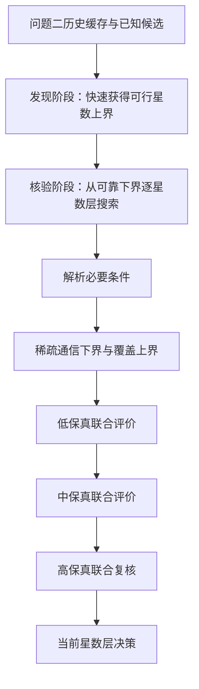

# 问题二—问题三联合反推多保真分支定界设计

## 1. 目标与范围

本设计完善 [[21-问题三参数化求解模型]] 中的问题二—问题三联合反推模型，并替换当前“覆盖黑盒评价后再调用通信黑盒评价”的高成本串行架构。

联合搜索需要寻找成本最低的 Walker 构型

$$
\mathcal X=(M,N,F,i,\Omega_0,u_0),
$$

同时满足问题二覆盖约束与问题三通信约束。设计目标包括：

1. 复用问题二与问题三共同需要的轨道传播和星地几何；
2. 把廉价且淘汰力强的必要条件放在高成本覆盖和路由之前；
3. 用多保真评价限制高精度计算的候选数量；
4. 明确区分严格不可行、预算不足和数值异常；
5. 在规定参数范围和离散精度下保留最低成本结论的可审计性；
6. 保留问题二连续覆盖证书作为最终覆盖验证后端。

本设计不建立连续参数域上的联合 Lipschitz 区间分支定界，不声称对连续的 $(i,u_0)$ 参数域给出全局最优证明。

## 2. 联合约束口径

### 2.1 覆盖约束

沿用问题二面积—时间加权覆盖率：

$$
\mathcal C_1(\mathcal X)\ge0.999,
\qquad
\mathcal C_2(\mathcal X)\ge0.95.
$$

### 2.2 可达样本准严格时延达标率

考虑到区域内全部可达 OD—时间样本均不超过 30 ms 可能导致联合可行域为空，将原 $100\%$ 严格口径松弛为 $99.9\%$。对可达样本集合 $\mathcal R(\mathcal X)$，定义：

$$
P_{30}^{\mathrm{reach}}(\mathcal X)
=
\frac{
\#\{(A,B,t)\in\mathcal R(\mathcal X):T_{AB}(t;\mathcal X)\le30\,\mathrm{ms}\}
}{|\mathcal R(\mathcal X)|}
\ge0.999.
$$

该约束允许最多 $0.1\%$ 的可达样本超过 30 ms。$T_{\max,\mathrm{reach}}$ 仍作为诊断指标输出，但不再作为联合可行域的硬约束。

对等权离散样本，设最终可达样本数为 $R$，其中超时样本数为 $F$，则约束等价于：

$$
F\le n_{\max}(R),
\qquad
n_{\max}(R)
=
\left\lfloor0.001R\right\rfloor.
$$

整数预算必须向下取整，不能四舍五入，否则实际超时比例可能超过 $0.1\%$。例如 $R=12782$ 时允许的最大超时样本数为 $n_{\max}=12$。

### 2.3 全样本服务率约束

全样本服务率继续把不可达样本视为不达标：

$$
P_{30}^{\mathrm{all}}(\mathcal X)
=
\frac{
\#\{(A,B,t):T_{AB}(t;\mathcal X)\le30\,\mathrm{ms}\}
}{|\mathcal P||\mathcal T|}
\ge0.95.
$$

不可达样本取 $T_{AB}=+\infty$，不进入分子。对等权样本有：

$$
P_{30}^{\mathrm{all}}
=
(1-P_{\mathrm{unreach}})P_{30}^{\mathrm{reach}}.
$$

因此两个比例约束分别控制可达样本的时延质量和全部业务样本的实际服务能力，二者不重复。

## 3. 总体架构

算法采用“发现阶段 + 核验阶段”的多保真分支定界框架：

发现阶段只负责尽快获得联合可行上界 $S_{\mathrm{UB}}$，不用于证明更小星数不可行。核验阶段从可靠下界 $S_{\mathrm{LB}}$ 开始，按可实现星数 $S=MN$ 升序搜索。

## 4. 共享快照评价内核

每个候选由统一的 `JointCandidateEvaluator` 处理。对时间 $t_k$ 只传播一次卫星位置，形成共享快照：

$$
\mathcal S_k=
\left(
\mathbf r^{ECI}(t_k),
\mathbf r^{ECEF}(t_k),
G_k,
A_k
\right).
$$

其中：

- $\mathbf r^{ECI}$ 用于构造 ISL 图；
- $\mathbf r^{ECEF}$ 同时用于问题二覆盖和问题三星地接入；
- $G_k$ 是满足题面四邻接和 5000 km 距离上限的 ISL 图；
- $A_k$ 是通信业务点到卫星的可接入矩阵。

密集覆盖网格和通信业务点网格可以不同，但共享同一批卫星位置。评价过程按时间块流式执行，不保存完整的 $S\times K\times3$ 位置张量。

## 5. 批量最短路设计

构造有向增广稀疏图：

1. 每个地面点 $G_j$ 建立源节点 $G_j^+$，只有指向可接入卫星的上行边；
2. 每个地面点建立目的节点 $G_j^-$，只有从可接入卫星进入的下行边；
3. ISL 边在卫星节点之间保持双向；
4. 从所有 $G_j^+$ 同时调用 `scipy.sparse.csgraph.dijkstra`；
5. 提取所有 $G_a^+$ 到 $G_b^-$ 的距离，得到完整 OD 时延矩阵。

目的节点没有出边，源节点没有入边，因此最短路不能把地面点作为中继。该结果必须与现有逐地面源点多源 Dijkstra 在小图上逐项一致。

## 6. 候选状态与剪枝语义

每个候选只能处于以下状态之一：

| 状态 | 含义 |
|:--|:--|
| `active` | 正在逐级评价 |
| `deferred` | 代理评价较差，但没有严格不可行证据 |
| `rejected` | 被数学必要条件或严格上下界证明不可行 |
| `verified` | 已完成规定高保真联合评价 |
| `numerical_error` | 数值库、稀疏图或浮点计算异常 |

低保真代理只能调整候选顺序或将候选放入 `deferred`，不能直接产生 `rejected`。

允许永久淘汰的条件包括：

1. 同轨相邻卫星距离超过 5000 km；
2. 倾角无法到达目标区域；
3. 可达样本 30 ms 达标率严格上界低于 0.999；
4. 全样本 30 ms 服务率严格上界低于 0.95；
5. 覆盖面积—时间加权上界低于 0.999 或 0.95；
6. 高保真评价完成后任一联合约束不满足。

通信乐观下界超过 30 ms 只能证明对应样本不可能成为 30 ms 达标样本。它应累计为比例上界中的失败权重，不能再因单个样本超限而立即淘汰整个构型。

## 7. 面积加权覆盖提前终止

当前 `CoverageProgress` 使用样本个数累计，与问题二面积权重口径不完全一致。新实现使用权重流式累计。

设总权重为 $W$，已处理权重为 $W_q$，单重、二重达标权重分别为 $H_1,H_2$，则最终覆盖率严格上界为：

$$
\mathcal C_1^{\mathrm{upper}}
=
\frac{H_1+W-W_q}{W},
\qquad
\mathcal C_2^{\mathrm{upper}}
=
\frac{H_2+W-W_q}{W}.
$$

任一上界低于阈值即可提前停止。该判断不会漏掉覆盖可行候选。

## 8. 服务率提前终止

设通信总样本权重为 $Q$，已处理权重为 $q$，已处理可达样本权重为 $r$，其中 30 ms 达标权重为 $h$。全样本服务率的严格上界为：

$$
P_{30,\mathrm{upper}}^{\mathrm{all}}
=
\frac{h+Q-q}{Q}.
$$

可达样本达标率的严格上界为：

$$
P_{30,\mathrm{upper}}^{\mathrm{reach}}
=
\frac{h+Q-q}{r+Q-q}.
$$

该上界假设所有未处理样本最终均可达且在 30 ms 内达标，是候选可能取得的最有利结果。若两个上界分别低于 0.95 或 0.999，即可提前淘汰。单个可达超时样本只累计为失败权重，不再立即否决候选。

对等权样本，可以直接使用整数失败预算实现同一提前终止条件。设已发现可达超时样本数为 $f$，尚未处理的全部样本数为 $u$，则当前最乐观的可达样本基数为 $r+u$，对应预算为：

$$
n_{\max}^{\mathrm{optimistic}}
=
\left\lfloor0.001(r+u)\right\rfloor.
$$

一旦

$$
f>n_{\max}^{\mathrm{optimistic}},
$$

即可安全淘汰候选。低保真层的样本基数可能小于 1000；若错误地用低保真样本数代替最终 $R$，会得到预算 0 并造成过早淘汰。低保真层必须使用高保真母样本中尚未处理的数量 $u$ 计算上述乐观预算，最终 $n_{\max}$ 由高保真完整可达样本基数确定。若通信业务点带有非等权面积权重，则使用等价条件：

$$
W_{\mathrm{fail}}
\le
0.001W_{\mathrm{reach}}.
$$

## 9. 多保真网格

各层从同一高分辨率母网格抽取索引，保证低保真样本属于高保真样本。每个候选保存母网格总权重、已处理的“时间—地面点”键和“时间—OD”键；晋级时跳过已经评价的嵌套样本，避免重复累计。低保真比例上界的分母始终使用高保真母网格总权重，不能使用低保真子集自身的样本数。默认配置为：

| 层级 | 覆盖空间网格 | 通信空间网格 | 时间步长 | 作用 |
|:--|:--|:--|:--|:--|
| 低保真 | $4^\circ$ | $25^\circ$ | 900–3600 s 嵌套子集 | 排序和发现严格反例 |
| 中保真 | $2^\circ$ | $10^\circ$ | 300–900 s | 联合复筛 |
| 高保真 | $1^\circ$ | $5^\circ$ 并加密边界 | 150–300 s | 最终离散核验 |
| 连续覆盖证书 | Lipschitz 裕度网格 | 不扩展为连续 OD 证书 | 自适应 | 问题二覆盖证明 |

低保真覆盖率或服务率不足本身不能永久淘汰候选；只有严格上界、必要条件或嵌套样本反例可以永久淘汰。

## 10. 参数搜索与最优性口径

- 沿用问题二已经证明的旋转对称性，固定 $\Omega_0=0$；
- 利用卫星重编号周期性，将 $u_0$ 限制在 $[0,360^\circ/N)$；
- 发现阶段抽样 $F,i,u_0$，利用历史优质构型热启动；
- 核验阶段对配置中声明的离散参数网格完整检查；
- 代理评分不作为不可行证明；
- 计算预算耗尽而仍有 `deferred` 候选时，星数层状态为 `inconclusive`。

若低于首个可行星数的每个候选都进入 `rejected`，且当前层至少有一个 `verified` 可行候选，则可报告“规定参数范围和离散精度下的最低成本构型”。否则只能报告“当前搜索预算下发现的最低成本可行构型”。

## 11. 搜索调度

发现阶段读取问题二缓存并优先评价覆盖可行候选。没有可行解时向更大星数扩展。

核验阶段使用阶段统计量：

$$
\mathrm{priority}(r)
=
\frac{\widehat p_{\mathrm{reject}}(r)}{\widehat t(r)},
$$

其中 $\widehat p_{\mathrm{reject}}$ 是筛选器历史淘汰率，$\widehat t$ 是平均耗时。该优先级只在满足数据依赖的严格筛选器之间调整顺序。通信乐观下界的成本较低，默认先于高成本覆盖精算；在采用 0.999 松弛口径后，其实际淘汰力应由新运行统计重新校准。

## 12. 并行、缓存与断点恢复

- 候选构型是进程级并行单元；
- 每个工作进程将 SciPy、BLAS 和 OpenMP 内部线程限制为 1；
- 缓存键包含构型参数、保真层级、模型常数、地面网格、时间网格与代码版本；
- 每完成一个阶段立即追加检查点；
- 恢复时校验配置摘要，配置不一致时拒绝混用旧缓存；
- 写入采用临时记录完成后原子替换或追加校验，避免中断产生半条记录。

## 13. 模块划分

| 文件 | 职责 |
|:--|:--|
| `代码/问题三/q3_joint_evaluator.py` | 共享快照、面积加权覆盖、接入集合、通信下界、多保真联合评价 |
| `代码/问题三/q3_batched_routing.py` | 有向增广稀疏图、批量 Dijkstra、OD 时延矩阵 |
| `代码/问题三/q3_joint_search.py` | 星数层、候选状态机、阶段调度、最优层判定 |
| `代码/问题三/run_q3_joint_search.py` | 命令行入口、并行、缓存、检查点、结果汇总 |
| `代码/问题三/tests/test_q3_joint_search.py` | 联合搜索数学、状态和性能回归测试 |

已有 `q3_routing.py` 保留为参考实现和小图对照后端。

## 14. 输出文件

每次正式运行写入独立结果目录：

| 文件 | 内容 |
|:--|:--|
| `joint_candidate_records.csv` | 每个候选各阶段指标、状态与淘汰原因 |
| `joint_stage_timing.csv` | 阶段调用次数、耗时和淘汰率 |
| `joint_checkpoint.jsonl` | 可恢复的候选状态记录 |
| `joint_layer_summary.csv` | 各星数层状态数量和层结论 |
| `joint_summary.json` | 最终构型、约束裕量和最优性口径 |
| `joint_report.md` | 中文运行报告与论文可用结论 |

## 15. 异常与最终状态

最终运行状态区分：

- `infeasible`：搜索范围内候选均被严格证明不满足离散联合约束；
- `inconclusive`：预算不足、仍有延迟候选或连续覆盖证书未完成；
- `numerical_error`：数值异常导致结果不可用；
- `interrupted`：运行中断且检查点已保存；
- `feasible_discrete`：规定离散网格下联合可行；
- `coverage_certified`：联合可行且问题二连续覆盖证书通过。

## 16. 测试与验收

### 16.1 数学正确性

1. 面积加权覆盖上下界与离线完整计算一致；
2. 可达样本达标率允许不超过 $0.1\%$ 的可达超时权重；
3. 等权样本预算严格采用 $\lfloor0.001R\rfloor$，边界两侧分别接受和拒绝；
4. 低保真样本数不足 1000 时不把单个超时样本误判为最终失败；
5. 全样本服务率把不可达样本计为不达标；
6. 两个比例上界提前终止不会接受违规候选；
7. 批量 Dijkstra 与现有逐源算法在小图、空接入和断连图上逐项一致；
8. 增广图不能通过地面节点中继。

### 16.2 搜索状态

1. 代理失败只能产生 `deferred`；
2. 严格反例才能产生 `rejected`；
3. 有未决候选的星数层不能标记为严格不可行；
4. 第一可行星数层完成规定复核后才返回最低成本候选；
5. 恢复运行与不中断运行得到相同记录顺序和最终结果。

### 16.3 性能验收

在固定候选集和相同保真度下：

- 新旧通信评价数值一致；
- 单候选中保真联合评价至少加速 3 倍；
- 完整候选池进入高保真的数量减少至少 80%；
- 每个时间点卫星位置只传播一次；
- 峰值内存不随全部时间点数线性增长。

## 17. 文档同步

实施完成后同步更新：

1. [[21-问题三参数化求解模型]]：统一 $P_{30}^{\mathrm{all}}$、联合可行域、发现/核验双阶段模型和最优性口径；
2. [[22-问题三求解算法设计]]：增加联合算法 L、共享快照、批量路由、复杂度和状态机；
3. `代码/问题三/README.md`：增加联合入口、依赖、运行示例和输出说明。

## 18. 文献依据

Walker 星座的规则结构和二维相位空间可以用于消除重复覆盖几何计算，参见：

- Quick coverage analysis of mega Walker Constellation based on 2D map. *Acta Astronautica*, 2021. DOI: [10.1016/j.actaastro.2021.07.008](https://doi.org/10.1016/j.actaastro.2021.07.008)。

现有问题三文献中的动态快照图、多源最短路和 LEO 路由依据继续沿用，不改变题面规定的 ISL 边集。
