# Rosette Constellations of Earth Satellites

A.H. BALLARD, Senior Member, IEEE

TRW Defense and Space Systems Group

## I. Introduction

This paper gives some new answers to an old set of questions, namely,

1) What is the minimum number of satellites required to guarantee continuous visibility at any point on Earth of at least:

a) 1 satellite?

b) 2 satellites?

c) 3 satellites?

## Abstract

Satellite constellations having rosette (flowerlike) orbital patterns are described which exhibit better worldwide coverage properties than constellations previously reported in U.S. literature. The best rosettes with 5-15 satellites are identified and evaluated relative to prior results. In most cases, the best results are obtained by placing one satellite in each of N separate planes and by using inclined rather than polar orbits.

d) 4 satellites?

Coverage properties of these constellations are analyzed in terms of the largest possible great circle range between an observer anywhere on the Earth's surface and the nearest subsatellite point. When evaluated in this manner, coverage properties are invariant with deployment altitude. As deployment altitude is reduced, however, higher order constellations must be used to maintain a fixed minimum viewing angle. Coverage properties are also invariant with deployment orientation relative to Earth coordinates, although specific orientations can cause the satellite patterns to appear quasi-stationary. Thus these constellations offer a promising alternative to the use of geostationary satellites.

Rosette constellations can also be used to guarantee multiple satellite visibility on a continuous worldwide basis. It is shown that 5, 7, 9, and 11 satellites are the minimum numbers required for single, double, triple, and quadruple visibility, respectively. Examples of rosette constellations which achieve these bounds are given.

2) Given a fixed number of satellites N, equal to or greater than the minimum requirement, what arrangement of satellite orbits provides the best continuous worldwide coverage, in the sense of maximum elevation angle at the worst possible observation point?

Prior U.S. studies which have attempted to answer these questions $[1-4]$ have concentrated for the most part on cases where N is a factorable number $(P \times Q)$ corresponding to P orbit planes each containing Q satellites. Furthermore, these studies have concentrated primarily on constellations employing polar orbits. Constellations employing inclined orbits, or constellations employing a nonfactorable number of satellites, were generally deemed to be too difficult to analyze and were therefore dropped from further consideration. As a consequence, the “optimal” constellations identified in these studies are, in fact, only optimal within the restricted class defined by the starting assumptions.

A broader approach to the search for optimized constellations was adopted by Walker [5-7] in the U.K. He showed [5] that continuous worldwide visibility of at least one satellite can be accomplished with a total of only five satellites, not six as generally supposed. He also derived optimized $(5\times 1)$ and $(7\times$ 1) constellations and showed that the latter can provide continuous worldwide visibility of two satellites simultaneously. With minor exceptions, Walker's results for single visibility constellations employing up to 15 satellites [6] are the most efficient of any encountered in a literature search on this subject. He has also listed numerous examples of efficient multiple visibility constellations [7] for $N$ up to 25 satellites, although his examples are not exhaustive for all values of $N$ .

This paper extends and generalizes the earlier work by Walker. The methods of analysis employed are basically the same but are presented in a more unified mathematical framework. Subsequent to performing this analysis it was learned that Mozhaev [8,9] in the U.S.S.R. has obtained many of the same single visibility results using a completely different mathematical approach based on symmetrical group theory.

The class of constellations to be described is characterized by circular, common-period orbits all having the same inclination with respect to an arbitrary reference plane. The orbits are uniformly distributed in a right ascension angle as they pass through the reference plane, and the initial phase position of satellites in each orbit plane is proportional to the right ascension angle for that plane. The name “rosette” has been chosen to designate this class of constellations because the pattern of orbital traces, when drawn on a fixed celestial sphere, resembles a many-petaled flower.

The constellations in this paper are evaluated in terms of the largest possible great circle range (degrees of arc) from an observer anywhere on the Earth's surface to the nearest subsatellite point. This parameter is a more fundamental measure of good coverage geometry than elevation angle because it is independent of the altitude at which the satellites are deployed, whereas elevation angle is not.

Fig. 1 illustrates how elevation angle is related to great circle range and deployment altitude (or period). In Fig. 1, the altitude H is measured in Earth radii, where $R_{E} = 6378$ km. The orbit period is measured in sidereal hours, where $T_{E} = 24$ h, sidereal time = 23 h 56 m 4 s solar time. Notice that for any finite altitude, the great circle range R must be less than 90° for the satellite to be visible at or above the observer's horizon.

In designing a constellation for optimized worldwide coverage, the first step is to choose a set of common-altitude orbits which minimize the maximum value of R, considering all possible observation points on Earth at all instants of time. The constellation altitude is then chosen to obtain a guaranteed minimum elevation angle sufficiently high (say $10^{\circ}$ ) that atmospheric propagation anomalies or local terrain obstructions are not a significant problem.

In the constellations to be described, all satellite orbits are assumed to be circular because the goal of worldwide visibility implies that no particular part of the Earth should be favored over another. For the same reason, all orbits are assumed to have the same altitude H and period T, which are interrelated as shown in Fig. 1. An analysis of orbital perturbations (i.e., nonzero eccentricity or long-term drift in orbital constants) is beyond the scope of this paper. These perturbations can be minimized by deploying the constellation in such a way that all satellite orbits are affected more or less equally. These perturbations can also be minimized by periodic station-keeping corrections, but would probably cause one to choose a slightly overdesigned constellation to begin with.

## II. Basic Geometry of Satellite Pairs and Triads

Fig. 2 illustrates the basic parameters needed to describe the position of typical satellites in a constellations. All satellites move in circular paths on the surface of an imaginary sphere of radius $H + R_{E}$ . The position of any satellite on this fixed celestial sphere is described by three constant orientation angles, plus a time-varying phase angle:

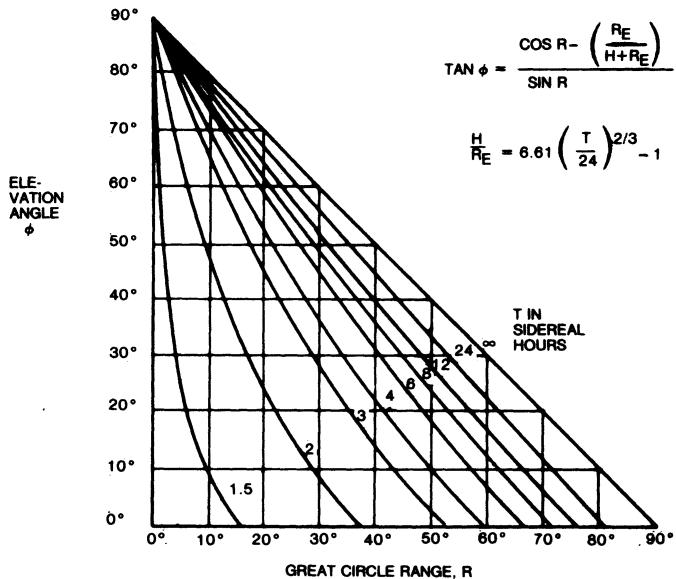

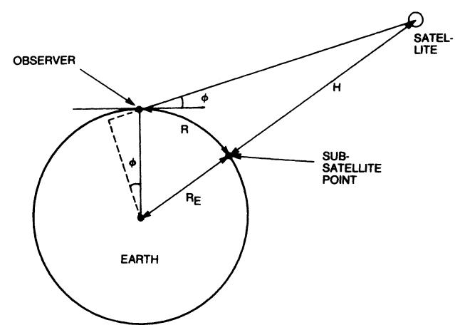  
Fig. 1. Observer-to-satellite profile.

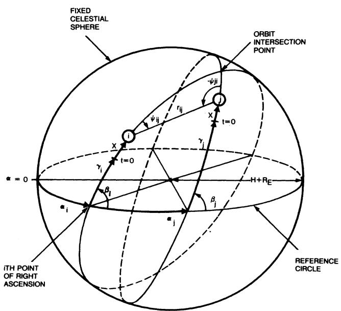  
Fig. 2. Geometry of satellite pair.

$\alpha_{i} =$ right ascension angle for the ith orbit plane

$\beta_{i} =$ inclination angle for the ith orbit plane

$\gamma_{i}=$ initial phase angle of the ith satellite in its orbit plane at t=0, measured from the point of right ascension

$x = 2\pi t / T =$ time-varying phase angle for all satellites of the constellation.

In the special case of a rosette constellation containing N satellites, the orbit orientation angles have the symmetrical form

$$
\alpha_ {i} = 2 \pi i / N, \quad i = 0 \text { to } N - 1\tag{1a}
$$

$$
\beta_ {i} = \beta , \quad \text {   for   all   } i\tag{1b}
$$

$$
\gamma_ {i} = m \alpha_ {i}, \quad m = 0 \text {   to   } N - 1.\tag{1c}
$$

The harmonic factor m in (1c) is an important descriptor of a rosette constellation. It influences not only the initial distribution of satellites over the sphere, but also the rate at which the constellation pattern precesses around the sphere (as is shown later).

As m takes on integer values from 0 to N - 1, widely different constellation patterns are generated, all of them containing a single satellite in each of N separate planes. The rosette class can be further generalized to include constellations having Q satellites in each of P planes by allowing m to take on fractional values. In this more generalized formulation,

$$
\alpha_ {i} = 2 \pi i / P, \quad i = 0 \text { to } N - 1\tag{2a}
$$

$$
\beta_ {i} = \beta , \quad \text { for   all } i\tag{2b}
$$

$$
\gamma_ {i} = m \alpha_ {i} = m Q (2 \pi i / N),
$$

$$
m = (0 \text {   to   } N - 1) / Q\tag{2c}
$$

$$
N = P Q, \text {   a   product   of   integers.   }\tag{2d}
$$

Equations (2a)-(2d) reduce to (1a)-(1c) for $Q = 1$ satellite per plane.

From this point on, the shorthand notation $(N, P, m)$ is used to designate a rosette constellation having N total satellites, P orbit planes, and a harmonic factor m. If m is a simple integer, a constellation having one satellite in each of N planes is being referred to. If m is an unreduced ratio of integers, a constellation having Q satellites in each of P planes is being referred to, where Q is the denominator of m.

The intersatellite great circle range $r_{ij}$ between any arbitrary pair of satellites in a constellation is illustrated in Fig. 2. The set of formulas describing $r_{ij}(x)$ for all satellite pairs completely and uniquely defines the geometry of the constellation as far as its coverage properties are concerned.

Using the half-angle formulas found in standard reference books on spherical trigonometry, and applying the special conditions of (2a)-(2d), the inter-satellite ranges in a rosette constellation can be expressed in the form

$$
\sin^ {2} (r _ {i j} / 2) = \cos^ {4} (\beta / 2) \sin^ {2} (m + 1) (j - i) (\pi / P)
$$

$$
+ 2 \sin^ {2} (\beta / 2) \cos^ {2} (\beta / 2) \sin^ {2} m (j - i) (\pi / P)
$$

$$
+ \sin^ {4} (\beta / 2) \sin^ {2} (m - 1) (j - i) (\pi / P)
$$

$$
+ 2 \sin^ {2} (\beta / 2) \cos^ {2} (\beta / 2) \sin^ {2} (j - i) (\pi / P)
$$

$$
\cdot \cos [ 2 x + 2 m (j + i) (\pi / P) ]\tag{3}
$$

where i, j, mQ = 0 to N - 1 and P, Q are integer factors of N such that PQ = N. An outline of the derivation is given in the Appendix. While these formulas might at first appear formidable, they are highly symmetric and are easily adapted to high-speed digital computation.

Similar formulas are derived in the Appendix for the bearing angles, depression angle, and slant range between satellite pairs. These formulas would be of interest to someone concerned with designing crosslink antennas and transceivers, but are not essential to an analysis of Earth coverage. One important observation to make, however, is that the bearing angles are always odd harmonic functions of the phase variable x, while the great circle range, slant range, and depression angle are always even harmonic functions. Use is made of this fact later.

Fig. 3 illustrates that the worst possible observation point in a spherical triangle formed by joining three subsatellite points $(i, j, k)$ is at the midpoint of the triangle. The range arc from the midpoint of the triangle to any of its three vertices is the equidistance $R_{ijk}$ . A constellation providing usable coverage only to a range $R' < R_{ijk}$ leaves the midpoint of the triangle uncovered and therefore fails the test of worldwide visibility. If $R'$ is increased to equal or exceed $R_{ijk}$ , the number of satellites visible at the midpoint changes from zero to three, and at least single visibility coverage is assured everywhere within the triangle.

Knowing the three sides of a spherical triangle, its equidistance parameter can be computed directly from the formula

$$
\begin{array}{r l} \sin^ {2} R _ {i j k} & = 4 A B C / [ (\mathrm{A} + \mathrm{B} + \mathrm{C}) ^ {2} \\ & - 2 (\mathrm{A} ^ {2} + \mathrm{B} ^ {2} + \mathrm{C} ^ {2}) ] \end{array}\tag{4}
$$

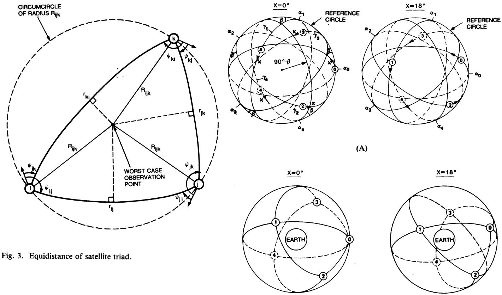  
Fig. 4. Five-satellite rosette constellation. (A) Orbital traces on fixed sphere. (B) Spherical triangles of constellation.

where, from (3),

$$
\mathbf {A} = \sin^ {2} (r _ {i j} / 2)
$$

$$
\mathrm{B} = \sin^ {2} (r _ {j k} / 2)
$$

$$
C = \sin^ {2} (r _ {k i} / 2)
$$

Equation (4) is also derived in the Appendix. It is more useful in this application than the form usually found in standard reference books.

The coverage properties of a constellation can therefore be analyzed by examining the equidistances $R_{ijk}(x)$ of its spherical triangles at all instants of time to find the worst case. With $N$ satellites, a total of $2N - 4$ nonoverlapping triangles are required to cover the sphere, and all must be examined for worst-case equidistance. The worst-case observer on the Earth's surface will be one whose position coincides with the midpoint of the spherical triangle having the largest equidistance.

In dividing the sphere into triangles, care must be taken to choose only those triangles whose circum-circles (Fig. 3) enclose no other satellites. Once another satellite moves inside the circumcircle of a triangle, that triangle is no longer of interest in a single-visibility analysis because a set of smaller triangles can then be chosen whose circumcircles are all empty. Formulas useful in testing for enclosure are given in the Appendix.

## III. Best Five-Satellite Rosette

As is proven later, the minimum number of satellites needed to guarantee continuous worldwide visibility is five. Fig. 4(A) shows a polar view of the orbital traces of an $(N, P, m) = (5, 5, 1)$ rosette constellation on a fixed celestial sphere. The similarity to a 10-petaled flower is apparent—hence the name rosette. As the inclination angle $\beta$ is increased, the flower closes around the pole, and as $\beta$ is decreased, the flower opens toward the reference circle.

Fig. 4(B) illustrates how the five satellites divide the celestial sphere into $2N - 4 = 6$ nonoverlapping triangles. At the time phase $x = 0^{\circ}$ , the triangles of interest are $(012) = (034)$ , $(013) = (024)$ , and $(134) = (124)$ . At the time phase $x = \pi / 2N = 18^{\circ}$ , the triangles of interest are $(012)$ , $(134)$ , $(013) = (124)$ , and either $(034)$ , $(024)$ or $(023)$ , $(234)$ .

A five-satellite rosette has the desirable property that it replicates—i.e., takes on the same geometry at a new orientation and with different satellite identities—10 times per orbit period. Fig. 5 illustrates the replication phenomenon. At $x = 2\pi / 10 = 36^\circ$ , the geometry is the same as at $x = 0^\circ$ except that the pattern has rotated clockwise by $36^\circ$ , and has a mirror image with respect to the reference plane. Satellite $S_2$ now occupies the former position of satellite $S_0$ on the

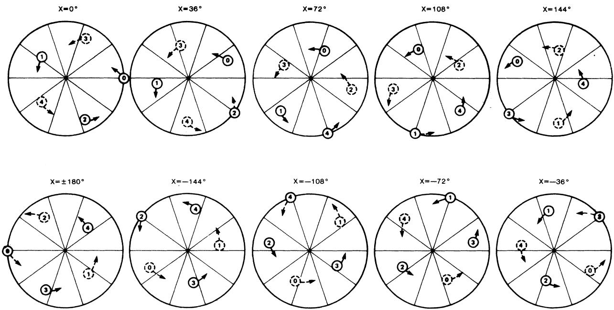  
SOLID ARROWS INDICATE SATELLITES ABOVE THE REFERENCE PLANE; DOTTED ARROWS INDICATE SATELLITES BELOW THE REFERENCE PLANE.

Fig. 5. Replication and precession of (5, 5, 1) rosette geometry.

reference circle; satellite $S_{3}$ occupies a mirror image of the former relative position of satellite $S_{1}$ ; and so on. At each successive increment of $36^{\circ}$ , the pattern rotates again by $36^{\circ}$ and satellite $i \oplus 2$ (modulo-5) appears at the mirror image of the former relative position of satellite i. The rate at which the pattern precesses around the sphere is exactly equal to the rate of orbit rotation for the case m = 1.

Because of the replication phenomenon, which is characteristic of rosette constellations, coverage properties need only be analyzed over one replication phase interval, or $36^{\circ}$ in this case. In fact, the worst-case phase usually occurs either at the beginning or at the midpoint of the replication interval.

For the $(5, 5, 1)$ rosette illustrated in Figs. 4 and 5, the intersatellite range formulas of $(3)$ simplify to the form (see the Appendix)

$$
\sin^ {2} \left[ r _ {1 4} (x) / 2 \right] = 1 / 8 [ \cos^ {4} (\beta / 2) ] \quad [ (5 - \sqrt {5})
$$

$$
+ 2 \tan^ {2} (\beta / 2) (5 + \sqrt {5}) (1 + \cos 2 x) ]\tag{5a}
$$

$$
\sin^ {2} \left[ r _ {2 3} (x) / 2 \right] = 1 / 8 [ \cos^ {4} (\beta / 2) ] \quad [ (5 + \sqrt {5})
$$

$$
+ 2 \tan^ {2} (\beta / 2) (5 - \sqrt {5}) (1 + \cos 2 x) ]\tag{5b}
$$

$$
r _ {i \oplus 2, j \oplus 2} (x) = r _ {i j} (x - 3 6 ^ {\circ}).\tag{5c}
$$

These expressions can be substituted into (4) to obtain the equidistances $R_{ijk}(x)$ for the nonoverlapping triangles of interest at each x value.

The process for optimizing orbit inclination is illustrated in Fig. 6. Fig. 6(A) shows, in polar view, how the positions of the five satellites move with increasing $\beta$ . In Fig. 6(B), the equidistances for the six nonoverlapping triangles at $x = 0^{\circ}$ and $x = 18^{\circ}$ are plotted as functions of $\beta$ . Only inclination angles between $0^{\circ}$ and $90^{\circ}$ need to be considered in this case, because any inclination greater than $90^{\circ}$ would place all satellites in the same hemisphere and none would be visible from the central region of the other hemisphere.

The critical phase x and optimum inclination $\beta$ which produce the smallest equidistance for the largest triangle are found by a trial-and-error process. For the five-satellite rosette shown in Fig. 6, the minimax value of R occurs simultaneously for triangles (034), (024), and (134) at $x = 18^{\circ}$ . The optimum inclination angle is $\beta = 43.66^{\circ}$ , and the minimax range which results is $R = 69.15^{\circ}$ .

If the inclination angle is now held fixed at its optimum value, the complete time history of triangle equidistances for this constellation will appear as shown in Fig. 7. The six triangles of interest at all instants of time are indicated by darkened lines. They provide single-visibility coverage on a worldwide basis. The remaining four triangles, indicated by lighter lines, exhibit multiple visibility but not on a worldwide basis. It can be verified from Fig. 7 that the worst-case R for single visibility occurs ten times per orbit period, and specifically, at odd multiples of $x = 18^{\circ}$ .

The same optimization process has been carried out for other $(5, 5, m)$ rosettes, where m = 0 to 4, but none of the others produce a smaller minimax R than the $(5, 5, 1)$ rosette. The minimum elevation

(B)  
(A)  
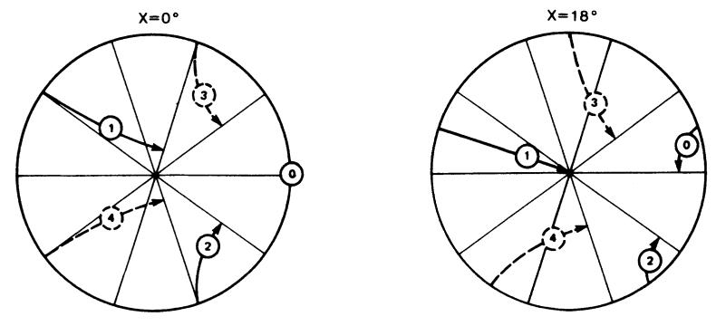

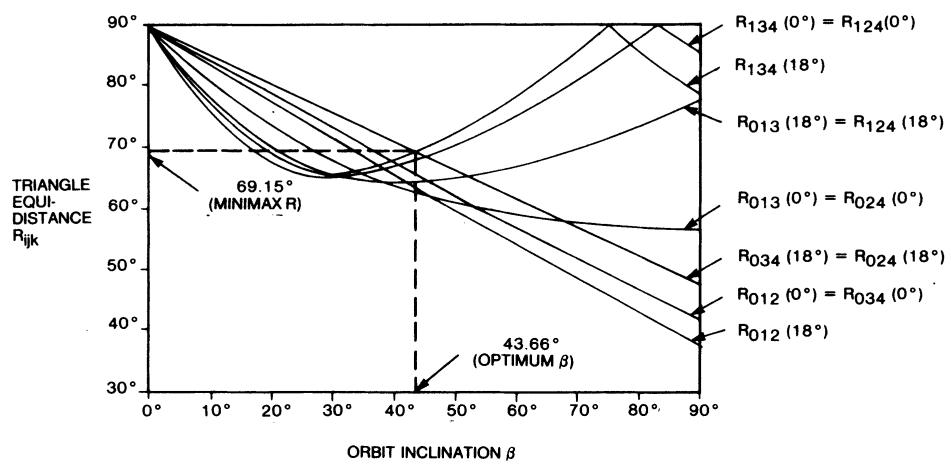

Fig. 6. Optimization of orbit inclination. (A) Satellite loci as $\beta$ increases from $0^{\circ}$ to $90^{\circ}$ . (B) $R$ versus $\beta$ curves.  
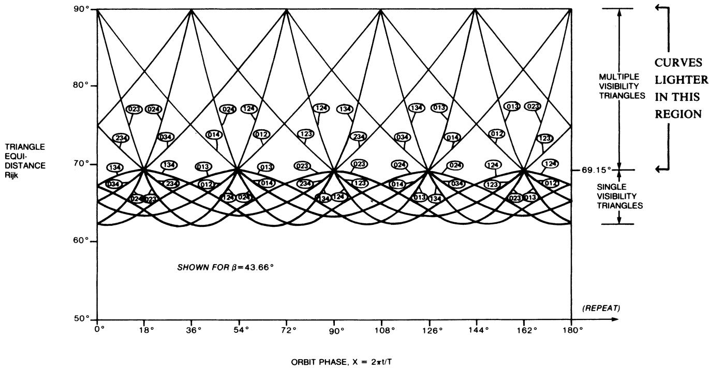  
Fig. 7. Time history of equidistances for optimum 5-satellite rosette.

Best Single-Visibility Rosettes for $N = 5$ To 15

<table><tr><td colspan="3">Constellation Dimensions</td><td rowspan="2">Replication Phase Interval (deg)</td><td rowspan="2">Worst Case Phase(s) (deg)</td><td rowspan="2">Optimum Inclination β (deg)</td><td rowspan="2">Minimax Range R (deg)</td><td colspan="2">Lowest Deployment for Elevation ≥ 10°</td><td colspan="2">Uniformity Index</td><td rowspan="2">References</td></tr><tr><td>N</td><td>P</td><td>m</td><td>H, e.r.u</td><td>T, s.h.</td><td>uT</td><td>us</td></tr><tr><td>5</td><td>5</td><td>1</td><td>36</td><td>18</td><td>43.66</td><td>69.15</td><td>4.232</td><td>16.90</td><td>1.023</td><td>1.099</td><td>[5,6,7,9]</td></tr><tr><td>6</td><td>6</td><td>4</td><td>60</td><td>30</td><td>53.13</td><td>66.42</td><td>3.194</td><td>12.13</td><td>1,190</td><td>1.250</td><td>[6,7,9]</td></tr><tr><td>7</td><td>7</td><td>5</td><td>25.7</td><td>12.9</td><td>55.69</td><td>60.26</td><td>1.916</td><td>7.03</td><td>1.086</td><td>1.240</td><td>[5,6,7,9]</td></tr><tr><td>8</td><td>8</td><td>6</td><td>90</td><td>0,45</td><td>61.86</td><td>56.52</td><td>1.472</td><td>5.49</td><td>1.093</td><td>1.205</td><td>[6,7,9]</td></tr><tr><td>9</td><td>9</td><td>7</td><td>20</td><td>10</td><td>70.54</td><td>54.81</td><td>1.314</td><td>4.97</td><td>1.052</td><td>1.566</td><td>[7,9]</td></tr><tr><td>10</td><td>10</td><td>7</td><td>36</td><td>0,7.7</td><td>47.93</td><td>51.53</td><td>1.066</td><td>4.19</td><td>1.001</td><td>1.186</td><td>[9]</td></tr><tr><td>11</td><td>11</td><td>4</td><td>16.4</td><td>8.2</td><td>53.79</td><td>47.61</td><td>0.838</td><td>3.52</td><td>1.082</td><td>1.280</td><td>[6,7,9]</td></tr><tr><td>12</td><td>3</td><td> $\frac{1}{4},\frac{7}{4}$ </td><td>30</td><td>3.05,15</td><td>50.73</td><td>47.90</td><td>0.853</td><td>3.56</td><td>1.020</td><td>1.204</td><td>[6,7]</td></tr><tr><td>13</td><td>13</td><td>5</td><td>13.8</td><td>6.9</td><td>58.44</td><td>43.76</td><td>0.666</td><td>3.04</td><td>1.040</td><td>1.290</td><td>[6,7]</td></tr><tr><td>14</td><td>7</td><td> $\frac{11}{2}$ </td><td>25.7</td><td>0,12.9</td><td>53.98</td><td>41.96</td><td>0.598</td><td>2.85</td><td>1.042</td><td>1.318</td><td>[6,7]</td></tr><tr><td>15</td><td>3</td><td> $\frac{1}{5},\frac{4}{5},\frac{7}{5},\frac{13}{5}$ </td><td>12</td><td>0.52,6</td><td>53.51</td><td>42.13</td><td>0.604</td><td>2.87</td><td>1.023</td><td>1.168</td><td>[6,7]</td></tr></table>

Notes: 1) The transformation $(m\to P - m,\beta \to 180^{\circ} - \beta)$ gives equal coverage.  
2) Multiple m-values indicate physically indistinguishable constellations.

angle obtainable with the $(5, 5, 1)$ rosette at specific deployment altitudes is determined using the curves in Fig. 1. At a 24-h deployment altitude, for example, a minimax range of $69.15^{\circ}$ is small enough to guarantee an elevation angle of at least $12.35^{\circ}$ at all times anywhere on Earth.

## IV. Higher-Order Rosettes

Using the methods just described, an exhaustive search has been conducted to find the best single-visibility rosette constellations for N = 5 to 15 satellites. Results are summarized in Table I. For each value of N, Table I shows the number of planes P, the harmonic factor m, and the orbit inclination $\beta$ which produce the smallest minimax range R. (Where multiple values are shown for m, the constellations are physically indistinguishable.) The replication phase interval and worst-case phase angle(s) are also shown for each constellation.

The only cases found where a constellation with multiple satellites per plane gave best results (smallest R) were for N = 12, 14, 15. The results for N = 12, however, are slightly poorer than for N = 11, and the results for N = 15 are slightly poorer than for N = 14. In all cases shown in Table I, inclined orbits gave better results than polar orbits.

Only inclination angles between $0^{\circ}$ and $90^{\circ}$ are shown in Table I, but it should be noted that the transformation ( $\beta \rightarrow 180^{\circ} - \beta$ , $m \rightarrow P - m$ ) produces a twin constellation with equal coverage properties. This statement does not conflict with the earlier statement regarding the (5, 5, 1) rosette. In general, neither an (N, N, 1) rosette with $90^{\circ} \leqslant \beta \leqslant 180^{\circ}$ , nor an (N, N, N - 1) rosette with $0^{\circ} \leqslant \beta \leqslant 90^{\circ}$ , can provide worldwide coverage because they place all satellites in the same hemisphere. Also, it is worth noting that m = 0 and m = P/2 are never good

choices because they place all satellites on the reference circle at time phase $x = 0^{\circ}$ , regardless of $\beta$ .

With the exceptions noted above for N = 12 and 15, the great circle range achieved in the constellations in Table I decreases with increasing N, as one might expect. One way of exploiting the reduction in range is to strive for higher and higher elevation angles. Once the guaranteed elevation angle exceeds about $10^{\circ}$ , however, problems associated with local terrain obstructions or excessive propagation losses in the atmosphere rapidly become insignificant. A more profitable exploitation is to hold the elevation angle fixed and reduce the constellation altitude. The payoff in this case will be in terms of reduced launch vehicle costs and in potential simplifications of spacecraft payload and user terminal equipments.

The lowest altitude H (in Earth radius units) and corresponding orbit period T (in sidereal hours) at which each of the optimum rosette constellations could be deployed for a guaranteed $10^{\circ}$ minimum elevation angle, is also shown in Table I. The (14, 7, 11/2) rosette, for example, could be deployed at an altitude of only about 0.6 Earth radii (3814 km or 2058 nmi), yet still assure that at least one satellite would always be visible $10^{\circ}$ or more above the horizon everywhere on Earth. Further reduction in altitude is possible if a $5^{\circ}$ elevation angle is acceptable.

Ideally, the satellites in a constellation with worldwide coverage should be distributed as uniformly as possible over the celestial sphere. To evaluate this property, a temporal uniformity index $u_{T}$ and a spatial uniformity index $u_{S}$ have been defined as follows:

$u_{T} =$ ratio of $R_{\mathrm{max}}$ at the least favorable phase angle to $R_{\mathrm{max}}$ at the most favorable phase angle $u_{S} =$ ratio of $R_{\mathrm{max}}$ to $R_{\mathrm{min}}$ at the same phase angle, maximized over all phase angles.

TABLE II  
Best Single-Visibility Results for Nonsymmetric Polar Networks

<table><tr><td colspan="3">Constellation Dimensions</td><td>Corotating Separation</td><td>Minimax Range</td><td colspan="2">Uniformity Index</td><td rowspan="2">References</td></tr><tr><td>N</td><td>P</td><td>Q</td><td> $\Delta\alpha$ (deg)</td><td>R(deg)</td><td> $u_{T}$ </td><td> $u_{S}$ </td></tr><tr><td>6</td><td>2</td><td>3</td><td>104.49</td><td>66.72</td><td>1.048</td><td>1.108</td><td>[4, 5]</td></tr><tr><td>8</td><td>2</td><td>4</td><td>96.47</td><td>56.95</td><td>1.025</td><td>1.232</td><td>[5]</td></tr><tr><td>9</td><td>3</td><td>3</td><td>74.46</td><td>60.92</td><td>1.013</td><td>2.289</td><td>[5]</td></tr><tr><td>10</td><td>2</td><td>5</td><td>95.48</td><td>53.22</td><td>1.027</td><td>1.404</td><td>[4, 5]</td></tr><tr><td>12</td><td>3</td><td>4</td><td>69.29</td><td>48.59</td><td>1.026</td><td>2.376</td><td>[4, 5]</td></tr><tr><td>14</td><td>2</td><td>7</td><td>92.84</td><td>49.26</td><td>1.015</td><td>1.788</td><td>[5]</td></tr><tr><td>15</td><td>3</td><td>5</td><td>65.50</td><td>42.07</td><td>1.020</td><td>2.547</td><td>[5]</td></tr><tr><td>16</td><td>4</td><td>4</td><td>53.97</td><td>45.61</td><td>1.008</td><td>2.146</td><td>[5]</td></tr><tr><td>18</td><td>3</td><td>6</td><td>64.34</td><td>38.68</td><td>1.020</td><td>2.797</td><td>[4, 5]</td></tr><tr><td>20</td><td>4</td><td>5</td><td>51.21</td><td>38.03</td><td>1.009</td><td>2.221</td><td>[4, 5]</td></tr><tr><td>21</td><td>3</td><td>7</td><td>62.86</td><td>36.30</td><td>1.014</td><td>3.055</td><td>[5]</td></tr><tr><td>22</td><td>2</td><td>11</td><td>91.16</td><td>46.74</td><td>1.006</td><td>2.853</td><td>[5]</td></tr><tr><td>24</td><td>4</td><td>6</td><td>49.19</td><td>33.51</td><td>1.013</td><td>2.337</td><td>[5]</td></tr></table>

Referring back to Fig. 7 for the (5, 5, 1) rosette, for example, $u_{T}$ is the ratio of $69.15^{\circ}$ (at $x = 18^{\circ}$ ) to $67.62^{\circ}$ (at $x = 0^{\circ}$ ), while $u_{S}$ is the ratio of $68.63^{\circ}$ to $62.47^{\circ}$ at $x = 7.7^{\circ}$ . In an ideal constellation, both $u_{T}$ and $u_{S}$ would be equal to unity. The rosette constellations in Table I exhibit an average $u_{T}$ of about 1.06 and an average $u_{S}$ of about 1.25.

Fig. 8 illustrates the appearance of the best rosette constellations found for N = 6 to 15, in polar view analogous to Fig. 4(A) for N = 5. In each diagram, the satellite positions are shown at the middle of a replication interval, which is usually a worst-case phase angle.

## V. Comparison with Previous Results

As indicated by the column in Table I labeled “references,” all of the $R(N)$ and $\beta(N)$ results listed have been obtained previously by Walker and/or Mozhaev. Walker rounded off his results to the nearest $0.1^{\circ}$ and Mozhaev to the nearest $1'$ ; however, the listed results are accurate to the nearest $0.01^{\circ}$ . The results listed are identical (within roundoff error) to Walker’s best “delta patterns” in all cases except N = 10. He apparently ruled out this constellation in his initial sorting process by requiring that no two satellites lie within $3^{\circ}$ of one another. This requirement is more appropriate to a multiple visibility analysis than a single visibility analysis. Mozhaev obtained all of the listed results for N = 5 to 11, except that his published inclination angle for N = 9 is at least $0.2^{\circ}$ too low.

The best nonrosette single-visibility constellations previously reported are listed in Table II for N = 6 to 24. They belong to a family of constellations which can be described as nonsymmetric polar networks.

They employ Q satellites in each of P planes and are realizable only when N is a factorable number. The right ascension angles for all orbits are clustered within a semicircle with a spacing $\Delta\alpha$ , and the inclination angle for all orbits is $90^{\circ}$ . Satellite phasing is such that when one satellite passes through the reference circle, the nearest satellites in an adjacent corotating orbit are displaced $\pm\pi/Q$ from the reference circle.

Ullock and Schoen [2] showed that these constellations are better than the symmetric polar networks of Luders [1], but they carried out the calculations only for continuous coverage above $35^{\circ}$ latitude. The worldwide coverage results listed in Table II correspond to Walker's best “star patterns” [5], and the “optimal” constellations reported by Beste [4]. Walker's results are slightly better for those cases where $(P + Q)$ is an even number.

In Fig. 9 the best N-satellite rosettes described in this paper are compared with the best N-satellite polar networks found by Walker and Beste. Also shown is a theoretical bound which would apply if all satellites could be held stationary (see Appendix) and the bound given by Mozhaev [9] for dynamic constellations. The comparison is in terms of the worst-case great circle range of each constellation, as a function of the total number of satellites.

Where N is a prime number (5, 7, 11, 13), the rosette constellations are clearly better than the nonsymmetric polar networks because the latter are unrealizable under this condition. Where a direct comparison can be made, the rosette constellations show a small but definite improvement for N = 6, 8, 10, 12 and a significant improvement for N = 9 and 14. At N = 15, the great circle range for the best polar network (42.07°) is slightly lower than for the best rosette (42.13°), but the best 14-satellite rosette (41.96°) is better than either one of them.

When compared with the theoretical bounds in Fig. 9, the $R(N)$ results obtained for rosette constellations are typically about 1.22 times the stationary bound and about 1.18 times the dynamic bound. The results are slightly more efficient when N is a prime number, but this effect may not be apparent for large values of N.

Fig. 10 compares the uniformity index values given in Tables I and II for rosette constellations and nonsymmetric polar networks, respectively. Ideally, both the temporal index $u_{T}$ and the spatial index $u_{S}$ should always be equal to unity. The $u_{T}$ values for both types of constellations appear to decay exponentially toward unity as N increases. The spatial uniformity, however, shows distinctly different trends for the two classes of constellations. The spatial uniformity remains fairly constant at about $u_{S} = 1.25$ for the rosette constellations but it degrades progressively with increasing N for the nonsymmetric polar networks. This trend reflects the fact that the polar networks inherently

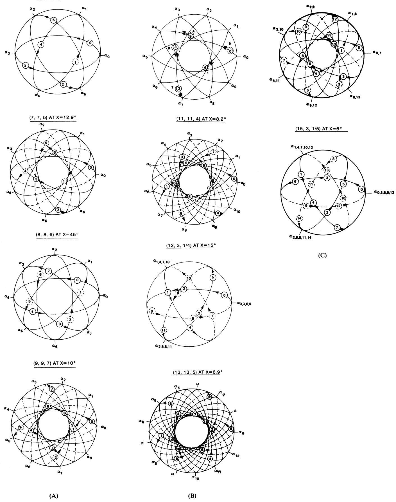  
Fig. 8. Best N-satellite rosettes.

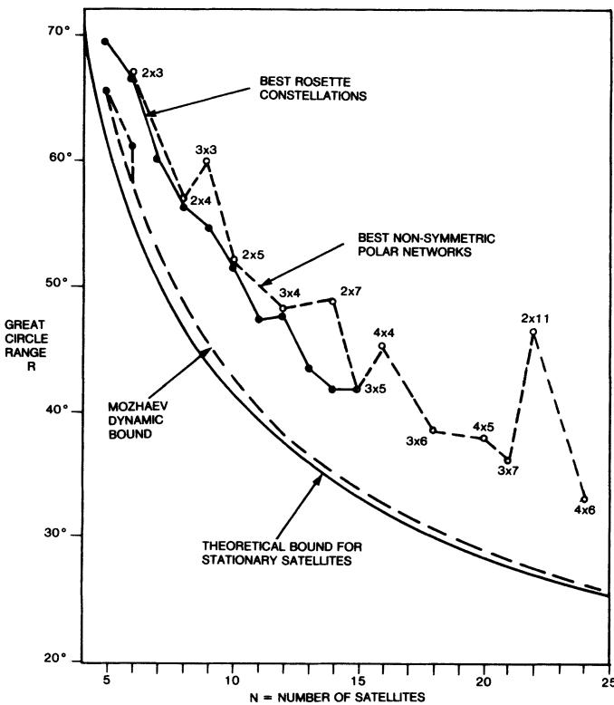  
Fig. 9. Comparison of single-visibility constellations.

produce a distribution of satellites which is dense over the poles and sparse near the reference circle.

## VI. Multiple Satellite Visibility

Another way in which the improved coverage properties of rosette constellations can be exploited is to provide continuous worldwide visibility of two or more satellites simultaneously. The methods of analysis adopted in this paper allow a straightforward proof of the following theorem concerning multiple satellite visibility.

Theorem I: In a constellation employing circular common-period orbits, the number of satellites required to guarantee continuous worldwide V-tuple visibility is at least $2V + 3$ .

To prove Theorem I, one must first establish another fundamental fact, which can also be stated as a theorem.

Theorem II: In a constellation employing circular common-period orbits, any three satellites will always line up on the same great circle at least twice per orbit period.

The proof of Theorem II follows from the earlier discussion of intersatellite geometry. In connection with Fig. 2, it was observed that the bearing angles between satellites are always odd harmonic functions of the phase variable x, while the intersatellite range arcs are always even harmonic functions. In Fig. 3 each of the enclosed angles of the generalized triangle (ijk) is seen to be the difference between two bearing angles. Therefore each enclosed angle is also an odd harmonic function of x and must pass through the value of $0^{\circ}$ or $180^{\circ}$ at least twice per orbit period. When any angle of the spherical triangle equals $0^{\circ}$ or $180^{\circ}$ , all three satellites must lie on the same great circle.

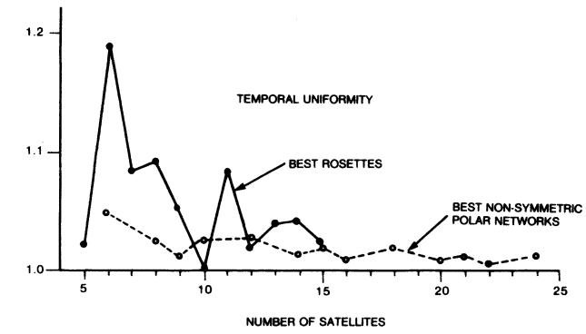

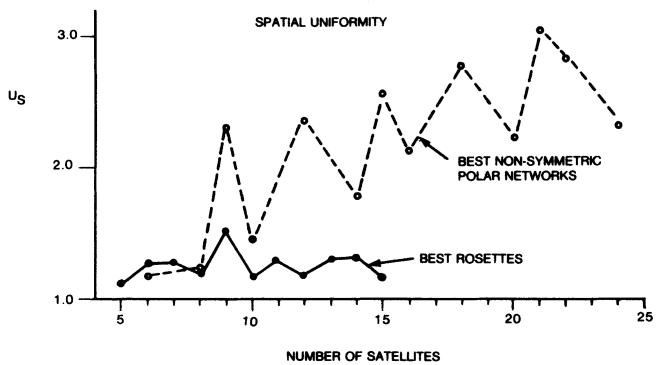  
Fig. 10. Comparison of constellation uniformities.

Whenever three satellites line up on the same great circle, none of them will be visible at the poles of the two hemispheres defined by the great circle plane. To achieve worldwide single visibility at these times, at least one other satellite must lie within each of the two hemispheres. A total of at least $2 + 3 = 5$ satellites is therefore required. By extension of the same argument, continuous worldwide V-tuple visibility requires that at least V other satellites lie within each of the hemispheres defined when any three satellites line up on the same great circle. A total of at least $2V + 3$ satellites is therefore required, as stated in Theorem I.

Theorem I indicates that continuous worldwide visibility of 1, 2, 3, or 4 satellites can be achieved only if the total number of satellites is at least 5, 7, 9, or 11, respectively. The theorem does not show that these bounds are realizable; however, one need only give an example for each case to demonstrate realizability.

Table III lists examples drawn from the family of rosette constellations which demonstrate that the multiple visibility bounds of Theorem I are indeed

Examples of Rosette Constellations with V-Tuple Visibility

<table><tr><td>Order of Visibility</td><td colspan="3">Constellation Dimensions</td><td>Replication Interval</td><td>Critical Phase(s)</td><td>Optimum β</td><td>Minimax R</td></tr><tr><td>V</td><td>N</td><td>P</td><td>m</td><td>(deg)</td><td>(deg)</td><td>(deg)</td><td>(deg)</td></tr><tr><td>1</td><td>5</td><td>5</td><td>1</td><td>36</td><td>18</td><td>43.66</td><td>69.15</td></tr><tr><td>2</td><td>7</td><td>7</td><td>2</td><td>25.7</td><td>4.9, 12.9</td><td>61.81</td><td>75.97</td></tr><tr><td>3</td><td>9</td><td>9</td><td>7</td><td>20</td><td>5.3, 10</td><td>58.56</td><td>84.88</td></tr><tr><td>4</td><td>11</td><td>11</td><td>4</td><td>16.4</td><td>0, 8.2</td><td>68.38</td><td>85.31</td></tr></table>

realizable for V = 1, 2, 3, 4. The single visibility example is the optimized (5, 5, 1) rosette described earlier. The dual visibility example is the one given by Walker [5], which in the notation of this paper, is the (7, 7, 2) rosette.

Walker's (7, 7, 2) example illustrates that, in general, the best dual visibility constellation for a given number of satellites is not the same as the best single visibility constellation. As a minimum, the orbit inclination $\beta$ must be re-optimized for dual visibility, and the best harmonic factor $m$ may change also. Optimization for dual visibility involves minimizing the worst-case equidistance of all spherical triangles whose circumcircles (Fig. 3) enclose one other satellite.

The examples given in Table III for triple and quadruple visibility were obtained merely by read-justing orbit inclination in the (9, 9, 7) and (11, 11, 4) rosettes found to be best for single visibility. Because an exhaustive search has not yet been conducted for optimized dual, triple, or quadruple visibility constellations, no claim is made that these examples are the best ones available. The examples are presented here primarily for the purpose of demonstrating realizability.

The V = 3, 4 examples, however, require fewer satellites than any other valid examples reported previously. Walker [6, 7] indicates that at least 10 satellites are required for triple visibility and 13 for quadruple visibility. Beste [4] indicates that V = 3 requires at least 12 satellites, and he does not address the V = 4 problem. It is claimed in [3] that quadruple visibility can be achieved with only 8 satellites, but Theorem I clearly shows this result to be impossible. $^{1}$

The examples given in Table III for multiple visibility with the minimum number of satellites might not be very practical, because extremely high altitudes would be required to obtain only small positive elevation angles. Based on the examples in [6, 7], however, it appears that an increase of only two to four satellites should be sufficient to produce entirely practical multiple visibility constellations.

## VII. Quasi-Stationary Deployments

Until this point, the fact that the Earth rotates inside the celestial sphere of the constellation has been totally ignored. If nondiscriminating worldwide coverage is adopted as a goal, rather than localized zonal coverage, then the relative orientation between Earth coordinates and constellation coordinates makes no difference. The worldwide coverage properties of a constellation, when measured by the worst-case great circle range to the nearest subsatellite point, remain invariant at all deployment orientations relative to Earth coordinates. The only effect of a rotating Earth is to cause the worst-case observation point(s) on the Earth's surface to move with time.

There are some practical reasons, however, why certain types of deployment might be favored over others. If the deployment is staged over a number of years, for example, it might be desirable to design for continuous coverage only over favored areas during the initial stages and accept intermittent coverage (or even no coverage) temporarily in low-interest areas. Also, some practical simplifications can accrue in the realm of antenna beam-steering design if the satellites are made to move over a fixed ground track on the Earth's surface.

Deployments which cause the subsatellite points of a constellation to follow fixed ground track patterns on the Earth are referred to here as “quasi-stationary.” They are obtained by choosing integer ratios between the orbit period of the constellation and the Earth’s rotation period. Of the infinite variety of quasi-stationary deployments which are possible, three types have been identified so far as ones likely to be favored. (See Appendix for derivation of formulas.)

Type I Deployment: All satellites deployed in 24-h inclined prograde orbits (congruent figure-8 patterns). The ground track equations in earth latitude (L) and longitude ( $\lambda$ ) coordinates are

$$
\sin L _ {i} = \sin \beta \sin (\omega_ {E} t + \gamma_ {i})\tag{6a}
$$

$$
\tan \left(\lambda_ {i} + \omega_ {E} t - \alpha_ {i}\right) = \cos \beta \tan \left(\omega_ {E} t + \gamma_ {i}\right).\tag{6b}
$$

To obtain this deployment, the inclination $\beta$ must be less than $90^{\circ}$ .

Type II Deployment: One satellite in geostationary orbit and the others in 24-h prograde orbits of varying inclination to the earth's equator. Equations (6a) and (6b) still apply, but with transformed orbit orientation angles for each satellite

$$
\alpha_ {i} ^ {\prime} = \pi / 2 + \tan^ {- 1} (\cos \beta \tan \frac {1}{2} \alpha_ {i})\tag{7a}
$$

$$
\beta_ {i} ^ {\prime} = 2 \sin^ {- 1} (\sin \beta \sin \frac {1}{2} \alpha_ {i})\tag{7b}
$$

$$
\gamma_ {i} ^ {\prime} = \gamma_ {i} + \alpha_ {i} ^ {\prime} - \pi .\tag{7c}
$$

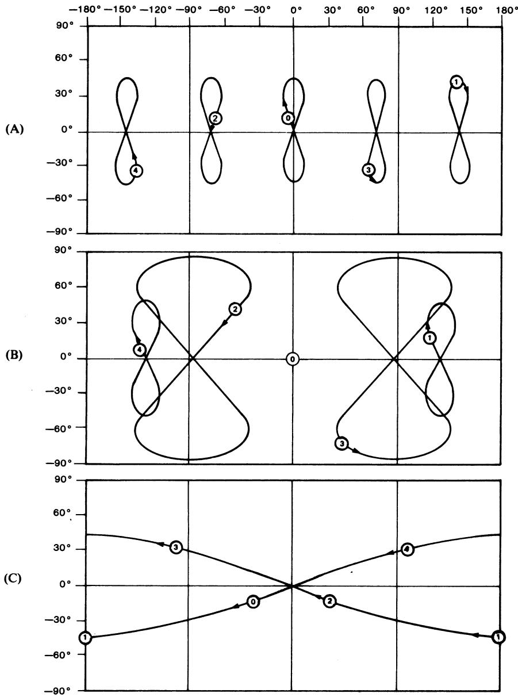  
Fig. 11. Quasi-stationary deployments of (5, 5, 1) rosette. (A) Type I ( $x = 18^{\circ}$ ). (B) Type II ( $x = 18^{\circ}$ ). (C) Type III ( $x = 18^{\circ}$ ).

To obtain this deployment, the new inclinations $\beta_{i}^{\prime}$ must all be less than $90^{\circ}$ .

Type III Deployment: All satellites follow the same fixed ground track at equally spaced intervals of time. The applicable latitude-longitude equations are

$$
\sin L _ {i} = \mp \sin \beta \sin m (\omega_ {E} t \pm \alpha_ {i})\tag{8a}
$$

$$
\tan \left[ \lambda_ {i} + \left(\omega_ {E} t \pm \alpha_ {i}\right) \right] = \mp \cos \beta \tan m \left(\omega_ {E} t \pm \alpha_ {i}\right).\tag{8b}
$$

This deployment can be obtained for any inclination $\beta$ . The upper signs are used if $T = T_{E}/m$ , while the lower signs are used if $T = T_{E}/(P - m)$ . Notice that incrementing the satellite index i in (8a) and (8b) is equivalent to a time shift of 24/P sidereal hours along a single fixed ground track.

Initial conditions for all of these deployments have been chosen such that $\lambda_{o}=0$ at t=0, but any other reference longitude could have been used just as well.

Fig. 11 shows how the ground track patterns for the optimized (5, 5, 1) rosette would appear for each of these deployments. The orbit period is 24 h in each case—only the orientation between Earth coordinates and constellation coordinates has changed from one diagram to the next. In the deployment of Fig. 11(A), the reference circle of the constellation is aligned with the Earth's equator such that the constellation diagram of Fig. 4(A) is also a north polar view of the Earth. In the deployment of Fig. 11(B), the orbit plane of satellite $S_o$ is aligned with the Earth's equator such that satellite $S_{o}$ and the Earth rotate in the same direction. In the deployment of Fig. 11(C), the reference circle is aligned with the Earth's equator such that Fig. 4(A) is a south polar view of the Earth.

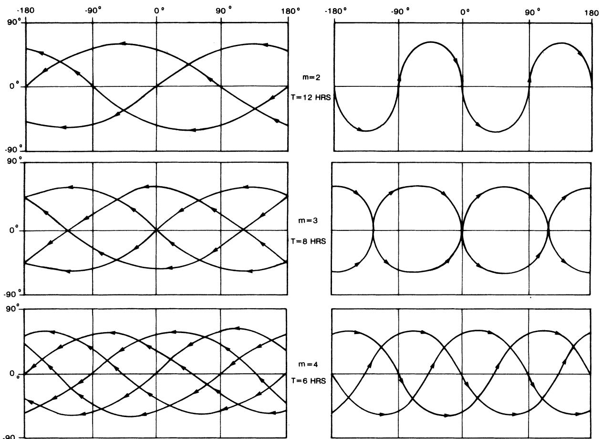  
Fig. 12. Type III deployments for higher-integer harmonic factors.

In Fig. 11(C) all five satellites are in retrograde orbits inclined $136.34^{\circ}$ with respect to the Earth's equator, but the rotation of the Earth causes all five ground tracks to fall on top of one another. Fig. 11(C) would look the same for the twin (5, 5, 4) rosette constellation deployed at a 24-h altitude except that all latitudes would change in sign and the satellite sequence would be reversed.

For constellations having harmonic factors other than m = 1, the Type III deployment is obtained by choosing a constellation period equal to 24 h divided by either m or P - m. Fig. 12 shows several examples of the ground tracks obtainable with Type III deployments and higher integer harmonic factors. These deployments are appropriate where reduction in constellation altitude is a primary goal. The retrograde ground tracks shown in Fig. 12 apply for any $(N, P, m)$ rosette, and the prograde ground tracks apply for any $(N, P, P - m)$ rosette, except that the time spacing of satellites along the ground track will change with N. An orbit inclination of either 60° or 120° is illustrated in Fig. 12, but for any specific constellation, the optimum inclination should be used.

If m is allowed to take on fractional values, as in (2c), an even greater variety of Type III quasi-stationary deployments is available. Fractional values of m greater than unity still result in a reduction of altitude, but give the constellation designer a much wider range of options. Fractional values of m less than unity lead to higher than geostationary altitudes, which might be desirable if minimum elevation angles considerably larger than $10^{\circ}$ must be maintained.

Table IV lists some specific constellation designs in which the best rosettes from Table I are deployed to produce Type III quasi-stationary ground tracks with usable guaranteed elevation angles. Any given rosette constellation can be deployed with a period of either $T_{E}/m$ or $T_{E}/(P - m)$ , but usable elevation angles may or may not result for both deployments. Where multiple m values appear in Table I (N = 12 or 15), each m value leads to a different pair of possible quasi-stationary deployment periods (altitudes). Additional quasi-stationary deployments can be obtained by replacing m with $(P + m)$ , $(2P + m)$ , and so on, which also produces physically indistinguishable constellations.

Among prior researchers in this field, only Walker [6, 7] appears to have recognized the full implications of the Type III quasi-stationary deployment and its applicability to fractional as well as integer harmonic factors. He has defined the harmonic factor in a different way, however, which tends to obscure the simple relationships expressed by (2a)-(2d) and (8a)-(8b). Walker's "F factor" is equal to the modulo- $P$ remainder of the product $mQ$ , as defined in this paper.

TABLE IV  
Some Specific Quasi-Stationary Rosette Designs with Worldwide Visibility

<table><tr><td>(N, P, m) or (N, P, P-m)</td><td>Inclination to Earth&#x27;s Equator* (deg)</td><td>Direction of Precession</td><td>T in Sidereal Hours</td><td>H in Earth Radii</td><td>Max R (deg)</td><td>Minimum Elevation Angle (deg)</td></tr><tr><td>(5,5,1) or (5,5,4)</td><td>136.34</td><td>Retro</td><td>24.0</td><td>5.61</td><td>69.15</td><td>12.35</td></tr><tr><td>(6,6,2) or (6,6,4)</td><td>53.13</td><td>Pro</td><td>12.0</td><td>3.16</td><td>66.42</td><td>9.90</td></tr><tr><td>(7,7,2) or (7,7,5)</td><td>55.69</td><td>Pro</td><td>12.0</td><td>3.16</td><td>60.26</td><td>16.42</td></tr><tr><td>(8,8,2) or (8,8,6)</td><td>61.86</td><td>Pro</td><td>12.0</td><td>3.16</td><td>56.52</td><td>20.48</td></tr><tr><td>(9,9,2) or (9,9,7)</td><td>70.54</td><td>Pro</td><td>12.0</td><td>3.16</td><td>34.81</td><td>22.36</td></tr><tr><td>(10,10,3) or (10,10,7)</td><td>47.93</td><td>Pro</td><td>8.0</td><td>2.18</td><td>51.53</td><td>21.44</td></tr><tr><td rowspan="2">(11,11,4) or (11,11,7)</td><td>126.21</td><td>Retro</td><td>6.0</td><td>1.62</td><td>47.61</td><td>21.64</td></tr><tr><td>53.79</td><td>Pro</td><td>3.4</td><td>0.81</td><td>47.61</td><td>9.27</td></tr><tr><td rowspan="2">(12,3,1/4) or (12,3,11/4)</td><td>129.27</td><td>Retro</td><td>96.0</td><td>15.66</td><td>47.90</td><td>39.44</td></tr><tr><td>50.73</td><td>Pro</td><td>8.7</td><td>2.37</td><td>47.90</td><td>26.72</td></tr><tr><td rowspan="2">(12,3,5/4) or (12,3,7/4)</td><td>129.27</td><td>Retro</td><td>13.7</td><td>3.55</td><td>47.90</td><td>31.28</td></tr><tr><td>50.73</td><td>Pro</td><td>19.2</td><td>4.70</td><td>47.90</td><td>33.70</td></tr><tr><td rowspan="2">(13,13,5) or (13,13,8)</td><td>121.56</td><td>Retro</td><td>4.8</td><td>1.26</td><td>43.76</td><td>22.03</td></tr><tr><td>58.44</td><td>Pro</td><td>3.0</td><td>0.65</td><td>43.76</td><td>9.61</td></tr><tr><td rowspan="2">(14,7,3/2) or (14,7,11/2)</td><td>126.02</td><td>Retro</td><td>4.4</td><td>1.12</td><td>41.96</td><td>22.15</td></tr><tr><td>53.98</td><td>Pro</td><td>16.0</td><td>4.04</td><td>41.96</td><td>39.20</td></tr><tr><td rowspan="2">(15,3,1/5) or (15,3,14/5)</td><td>126.49</td><td>Retro</td><td>120.0</td><td>18.33</td><td>42.13</td><td>45.80</td></tr><tr><td>53.51</td><td>Pro</td><td>8.6</td><td>2.33</td><td>42.13</td><td>33.33</td></tr><tr><td rowspan="2">(15,3,2/5) or (15,3,13/5)</td><td>126.49</td><td>Retro</td><td>9.2</td><td>2.50</td><td>42.13</td><td>34.18</td></tr><tr><td>53.51</td><td>Pro</td><td>60.0</td><td>11.18</td><td>42.13</td><td>44.51</td></tr><tr><td rowspan="2">(15,3,4/5) or (15,3,11/5)</td><td>126.49</td><td>Retro</td><td>30.0</td><td>6.67</td><td>42.13</td><td>42.34</td></tr><tr><td>53.51</td><td>Pro</td><td>10.9</td><td>2.91</td><td>42.13</td><td>35.91</td></tr><tr><td rowspan="2">(15,3,7/5) or (15,3,8/5)</td><td>126.49</td><td>Retro</td><td>17.1</td><td>4.28</td><td>42.13</td><td>39.47</td></tr><tr><td>53.51</td><td>Pro</td><td>15.0</td><td>3.83</td><td>42.13</td><td>38.56</td></tr></table>

\*180° - β for $T = T_{E} / m$ , β for $T = T_{E} / (P - m)$ .

## VIII. Potential Applications

In concluding this paper, some remarks should be made about why anyone would want to use a rosette constellation of Earth satellites—or for that matter, any constellation employing orbits other than the geostationary one. The geostationary orbit is almost everybody's first choice, for the obvious reason that the user need only aim his antenna at a fixed point in the sky to be able to communicate with any other user within a large fixed footprint area. Dynamic constellations introduce additional problems of stationkeep

ing, crosslinking, and channel allocation to the network control agency, and additional problems of beam-steering and beam/channel switching to the network user. These problems are solvable within today's technology, but sufficient benefit must accrue from using the dynamic constellation to justify introducing these problems at all.

One benefit which the constellations in this paper might provide is supplementary communications capacity, which may have to be called upon if predictions of saturation in spacecraft occupancy of the equatorial belt come true. Dynamic worldwide constellations can make efficient use of the entire celestial sphere, not just the equatorial circle. Furthermore, they can be deployed over a wide range of altitudes.

Potential users beyond about $70^{\circ}$ latitude are not well served by geostationary satellites, and no service at all is provided beyond about $80^{\circ}$ latitude. It is true that communication demand in the polar regions is much less than at lower latitudes. Nevertheless, these regions are of interest, not only to the people who live there, but also to the air transportation and shipping industries, to industries concerned with exploration of Earth resources, and to government agencies concerned with strategic surveillance and warning. Constellations with worldwide coverage would service these interests at the same guaranteed elevation angles available everywhere else. It is also worth noting that similar constellations could be employed for continuous scientific data gathering on heavenly bodies other than the Earth.

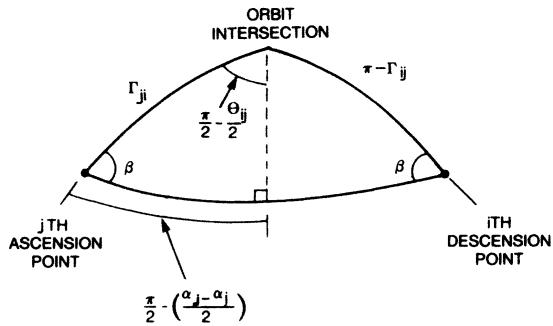  
Fig. A1. Auxiliary orbit parameters.

Dynamic worldwide constellations, especially those providing multiple visibility, should also be of interest to government agencies who worry about survivable communications. It is more difficult to disable a dynamic constellation, either by electronic jamming or by physical attack, than it is to disable geostationary satellites. If an isolated attack should occur, the crosslinks of the satellite network could be reconfigured and operation could continue, at least in a degraded mode. Cross-linking of satellites also eliminates the vulnerability of fixed ground station tie points.

The application where worldwide constellations can provide the most immediate benefit is probably in the area of position fixing and navigation. If continuous visibility of three satellites can be guaranteed, it is possible for any user on the Earth's surface to determine his horizontal position with an accuracy better than 10 meters [10], by making time difference measurements between satellite signals. If four satellites are continuously visible, accurate position fixing in altitude is possible as well.

Navigation error is the product of two factors, commonly designated as UERE (user equivalent range error) and GDOP (geometric dilution of precision). Only the GDOP is affected by satellite geometry, and it generally decreases as the spatial distribution of satellites is made more and more uniform over the celestial sphere. Reference [11] describes a baseline constellation for the global positioning system (GPS) using 24 satellites (8 in each of 3 planes). Of the total satellites visible to a user, 3 or 4 are selected for the navigation computation, based on the lowest predicted GDOP. The GPS baseline constellation is equivalent to a $(24, 3, m)$ rosette, where m = 1/8, 7/8, 13/8, or

19/8, and the inclination angle is $63^{\circ}$ . Its single visibility performance is characterized by $R = 42.02^{\circ}$ , $u_{T} = 1.082$ , and $u_{S} = 1.769$ .

Because the optimized rosette constellations described in this paper inherently maintain a high degree of uniformity in the spatial distribution of satellites, it seems likely that they could achieve GDOP performance as good as described in $[11]$ , using fewer than 24 satellites. Thus it appears that the most profitable direction for continued analytic research on rosette constellations will be toward the goal of achieving usable triple or quadruple coverage on a continuous worldwide basis with as few total satellites as possible.

## Appendix

Derivations for key formulas used in this paper are outlined below for the benefit of readers who may wish to verify them.

## Intersatellite Range

In Fig. 2, let $\theta_{ij}$ denote the intersection angle between the two orbits, let $\Gamma_{ij}$ denote the range arc from the $i$ th ascension point to the intersection point, and let $\Gamma_{ji}$ denote the arc from the $j$ th ascension point to the intersection point. These parameters do not change with time. Their relationship to the $\alpha$ and $\beta$ can be seen most easily by constructing the diagram in Fig. A1.

Standard formulas can now be applied to the isosceles and right spherical triangles in Fig. A1 to obtain the following relationships:

$$
\sin \left(\theta_ {i j} / 2\right) = \sin \beta \sin \left[ \left(\alpha_ {j} - \alpha_ {i}\right) / 2 \right]\tag{A1}
$$

$$
\Gamma_ {i j} + \Gamma_ {j i} = \pi\tag{A2}
$$

$$
\sin \Gamma_ {j i} = \sin \Gamma_ {i j} = \cos [ (a _ {j} - \alpha_ {i}) / 2 ] / \cos (\theta_ {i j} / 2)\tag{A3}
$$

$$
\begin{array}{r l} \cos \Gamma_ {j i} & = - \cos \Gamma_ {i j} = \cos \beta \sin [ (\alpha_ {j} \\ & - \alpha_ {i}) / 2 ] / \cos (\theta_ {i j} / 2). \end{array}\tag{A4}
$$

Returning to Fig. 2, the intersatellite range is obtained by applying the law of cosines for sides to the small triangle formed by the two satellites and the intersection point.

$$
\begin{array}{r l} \cos r _ {i j} & = \cos (\Gamma_ {j i} - m \alpha_ {j} - x) \cos (\Gamma_ {i j} - m \alpha_ {i} - x) \\ & + \sin (\Gamma_ {j i} - m \alpha_ {j} - x) \sin (\Gamma_ {i j} - m \alpha_ {i} - x) \cos \theta_ {i j} \\ & = \cos^ {2} (\theta_ {i j} / 2) \cos [ (\Gamma_ {j i} - \Gamma_ {i j}) - m (\alpha_ {j} - \alpha_ {i}) ] \\ & + \sin^ {2} (\theta_ {i j} / 2) \cos [ (\Gamma_ {j i} + \Gamma_ {i j}) - m (\alpha_ {j} + \alpha_ {i}) \\ & - 2 x ]. \end{array} \tag {A5}
$$

Making use of (A1) through (A4) and converting to half-angles,

$$
\begin{array}{l} \sin^ {2} (r _ {i j} / 2) = \{\cos^ {2} (\beta / 2) \sin (m + 1) [ (\alpha_ {j} - \alpha_ {i}) / 2 ] \\ \quad + \sin^ {2} (\beta / 2) \sin (m - 1) [ (\alpha_ {j} - \alpha_ {i}) / 2 ] \} ^ {2} \\ \quad + 2 \sin^ {2} (\beta / 2) \cos^ {2} (\beta / 2) \sin^ {2} [ (\alpha_ {j} - \alpha_ {i}) / 2 ] \{1 \\ \quad + \cos [ 2 x + m (\alpha_ {j} + \alpha_ {i}) ] \}. \end{array} \tag {A}\tag{A6}
$$

Expanding (A6) and replacing $\alpha$ by their equivalents from (2a) gives (3) in the main text.

Equations (5a) and (5b) are obtained from (3) by setting $N = P = 5$ , $m = 1$ , and by noting that $\cos \pi / 5 = (1 + \sqrt{5}) / 4$ . Equation (5c) is obtained by noting that the phase argument $\{2x + 2\pi / 5[(j + 2) + (i + 2)]\}$ is the same, modulo- $2\pi$ , as the phase argument $\{2(x - \pi / 5) + 2\pi / 5(j + i)\}$ .

## Intersatellite Bearing Angles

The bearing angles $\psi_{ij}$ and $\psi_{ji}$ are defined pictorially in Fig. 2. The formulas for these angles are obtained by means of the Napier analogies

$$
\begin{array}{r l} \tan [ (\psi_ {j i} + \psi_ {i j}) / 2 ] & = [ \cot (\theta_ {i j} / 2) ] \sin \{[ (\Gamma_ {j i} - \Gamma_ {i j}) / 2 ] \\ & - m [ (\alpha_ {j} - \alpha_ {i}) / 2 ] \} / \sin \{[ (\Gamma_ {j i} + \Gamma_ {i j}) / 2 ] \\ & - m [ (\alpha_ {j} + \alpha_ {i}) / 2 ] - x \} \end{array} \tag {A7}
$$

$$
\begin{array}{r l} \tan [ (\psi_ {j i} - \psi_ {i j}) / 2 ] & = - [ \cot (\theta_ {i j} / 2) ] \cos \{[ (\Gamma_ {j i} - \Gamma_ {i j}) / 2 ] \\ & - m [ (\alpha_ {j} - \alpha_ {i}) / 2 ] \} / \cos \{[ (\Gamma_ {j i} + \Gamma_ {i j}) / 2 ] \\ & - m [ (\alpha_ {j} + \alpha_ {i}) / 2 ] - x \}. \end{array} \tag {A8}
$$

Combining (A7) and (A8) gives

$$
\begin{array}{r l} \tan \psi_ {i j} & = [ \sin \theta_ {i j} \sin (x + m \alpha_ {j} - \Gamma_ {j i}) ] / \\ & \{\sin^ {2} (\theta_ {i j} / 2) \sin [ 2 x + m (\alpha_ {j} + \alpha_ {i}) - (\Gamma_ {j i} + \Gamma_ {i j}) ] \\ & - \cos^ {2} (\theta_ {i j} / 2) \sin [ m (\alpha_ {j} - \alpha_ {i}) - (\Gamma_ {j i} - \Gamma_ {i j}) ] \}. \end{array} \tag {A9}
$$

The formula for $\psi_{ji}$ is obtained by an interchange of indices. Equation (A9) can be further simplified by means of (A1) through (A4), but the important point here is that the bearing angles are odd harmonic functions of the phase variable x.

## Depression Angle and Slant Range

These parameters are defined in Fig. A2. Plane geometry can be applied in this case to obtain the relationships:

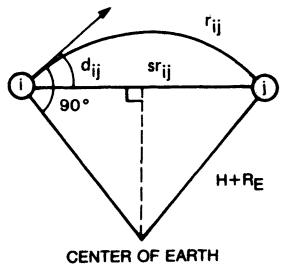

Fig. A2. Depression angle and slant range.

depression angle $d_{ij} = r_{ij} / 2$

(A10)

slant range $sr_{ij} = 2(H + R_E)\sin (r_{ij} / 2)$ .

(A11)

Triangle Equidistance

In Fig. 3, let $\Omega_{ij}$ denote the central half-angle subtended by the half-side $r_{ij}/2$ , and similarly for the other sides.

Then

$$
\Omega_ {i j} + \Omega_ {j k} + \Omega_ {k i} = \pi .\tag{A12}
$$

But

$$
\sin \Omega_ {i j} = \sin (r _ {i j} / 2) / \sin R _ {i j k}\tag{A13a}
$$

$$
\sin \Omega_ {j k} = \sin (r _ {j k} / 2) / \sin R _ {i j k}\tag{A13b}
$$

$$
\sin \Omega_ {k i} = \sin (r _ {k i} / 2) / \sin R _ {i j k}\tag{A13c}
$$

Combining (A12) and (A13a)-(A13c) and simplifying the result gives (4) in the main text.

Enclosure Test

Referring to Fig. A3, let r be the range arc from the midpoint of a given triangle (ijk) with equidistance $R < 90^{\circ}$ to a test satellite $\ell$ , and define a test variable to be

$$
y \triangleq 1 - \cos r / \cos R.\tag{A14}
$$

It can then be stated that

Satellite $\ell$ is $\left\{ \begin{array}{l} \text{inside} \\ \text{on} \\ \text{outside} \end{array} \right\}$ the circumcircle if $\left\{ \begin{array}{l} y < 0 \\ y = 0 \\ y > 0 \end{array} \right.$ .

An analysis of the spherical triangles in Fig. A3 will show that the test variable y must simultaneously satisfy three equations of the form

$$
y ^ {2} + 2 K y + M \tan^ {2} R = 0\tag{A16}
$$

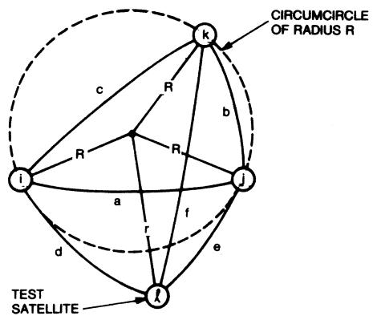  
Fig. A3. Geometry for enclosure test.

where

$$
\begin{array}{l} K _ {1} = (A - D - E) / (1 - A) \\ M _ {1} = K _ {1} ^ {2} (1 / A - 1) - [ 4 D E / (1 - A ] (1 / A - 1 / \sin^ {2} R) \\ A = \sin^ {2} (a / 2), \quad D = \sin^ {2} (d / 2), \quad E = \sin^ {2} (e / 2) \end{array}
$$

and the other two equations are obtained by cyclic rotation of (ABC) and (DEF). Simultaneous solution of any independent pair of the equations (A16) will yield the correct value for y. In the degenerate case where all three equations are identical, the sign of y will be opposite to the sign of K.

## Theoretical Bounds on $R(N)$

The fact that 2N - 4 nonoverlapping triangles are needed to cover the sphere can be seen by inductive reasoning. Starting with N = 3 nodes, the sphere is covered by two triangles (an inner one and an outer one). If another node is placed inside one of these triangles and joined to the original nodes, then three smaller triangles replace the larger one. Each additional node thus produces a net gain of two triangles. For a general number of nodes,

$$
\begin{array}{r l} \text { Number   of   triangles } & = 2 + 2 (N - 3) \\ & = 2 N - 4. \end{array}\tag{A17}
$$

The sum of the areas of these triangles must equal the total surface area of the sphere, $4\pi$ steradians.

The next step is to show that the largest equidistance for these triangles is minimized when all triangles have the same equidistance. Furthermore, for a given area, the equidistance of a spherical triangle is smallest when the triangle is equilateral. A rigorous proof for these two steps is too lengthy to include here, but the results are perhaps obvious. They support the intuitive notion that worldwide coverage should be best when the spatial distribution of satellites is made as uniform as possible.

Given 2N - 4 equilateral triangles of equal size covering the sphere (realizable only for N = 3, 4, 6, or 12), each angle ψ in each triangle must be

$$
\begin{array}{r l} \psi & = (1 / 3) [ \pi + [ 4 \pi / (2 N - 4) ] ] \\ & = (\pi / 3) [ N / (N - 2) ]. \end{array}\tag{A18}
$$

But from (4), the equidistance of a spherical equilateral triangle is given by

$$
\begin{array}{r l} \cos^ {2} R & = 1 - [ 4 \sin^ {2} (r / 2) / 3 ] \\ & = (3 \tan^ {2} (\psi / 2)) ^ {- 1}. \end{array}\tag{A19}
$$

Combining (A18) and (A19) gives the theoretical bound shown in Fig. 9 for stationary satellites, which is a plot of the formula

$$
\sec R = \sqrt {3} \tan [ N 3 0 ^ {\circ} / (N - 2) ].\tag{A20}
$$

The Mozhaev bound for dynamic constellations is derived in [9]. It is based on an argument that the spatial uniformity of satellites in a dynamic constellation must degrade, at times, to no better than a pattern containing one equilateral quadrangle, four isosceles triangles, and $2N - 10$ equilateral triangles. The dynamic bound shown in Fig. 9 is a plot of Mozhaev's formula

$$
\begin{array}{r l} N & \geqslant 5 + \frac {4}{3} \left(\{\tan^ {- 1} (\cos R) + \tan^ {- 1} [ \cos R / (\sqrt {2} - 1) ] - 6 7. 5 ^ {\circ} \} / [ 6 0 ^ {\circ} - \tan^ {- 1} (\sqrt {3} \cos R) ]\right). \end{array} \tag {A21}
$$

In the case of N = 5, (A21) can be solved explicitly for R to show that

$$
R \geqslant \cos^ {- 1} (\sqrt {2} - 1) = 6 5. 5 3 ^ {\circ} \quad \text { for } N = 5.\tag{A22}
$$

In the case of N = 6, Mozhaev obtains a tighter bound for the best possible pattern containing an equilateral quadrangle

$$
R \geqslant \cos^ {- 1} (\sqrt {\sqrt {5} - 2}) = 6 0. 9 3 ^ {\circ} \quad \text { for } N = 6.\tag{A23}
$$

Transformation to Earth Coordinates

Referring to Fig. A4, let the constellation be oriented such that the Earth's equator has an inclination $\beta_{E}$ with respect to the reference circle, and assume that the prime meridian passes through the $\alpha = {}^{\circ}$ reference point at $t = 0$ . The position of the ith satellite at some later time ( $x = \omega_{c}t$ ) will be as shown.

The satellite latitude $(L_{i})$ and longitude $(\lambda_{i})$ are obtained by applying standard formulas to the right spherical triangle labeled 1.

$$
\sin L _ {i} = \sin \beta_ {i} ^ {\prime} \sin (\omega_ {c} t + \gamma_ {i} ^ {\prime})\tag{A24a}
$$

$$
\tan \left(\lambda_ {i} + \omega_ {E} t - \alpha_ {i} ^ {\prime}\right) = \cos \beta_ {i} ^ {\prime} \tan \left(\omega_ {C} t + \gamma_ {i} ^ {\prime}\right).\tag{A24b}
$$

The primed $\alpha$ , $\beta$ , $\gamma$ parameters are obtained from their unprimed values by a spherical trigonometric solution for triangle 2.

$\tan \alpha_{i}^{\prime} = \sin \alpha_{i}\sin \beta /[\cos^{2}(\alpha_{i} / 2)\sin (\beta -\beta_{E})$

$$
- \sin^ {2} [ \alpha_ {i} / 2) \sin (\beta + \beta_ {E}) ]\tag{A25a}
$$

$$
\cos \beta_ {i} ^ {\prime} = \cos^ {2} (\alpha_ {i} / 2) \cos (\beta - \beta_ {E})
$$

$$
+ \sin^ {2} (\alpha_ {i} / 2) \cos (\beta + \beta_ {E})\tag{A25b}
$$

$$
\tan \left(\gamma_ {i} ^ {\prime} - \gamma_ {i}\right) = - \sin \alpha_ {i} - \sin \beta_ {E} / [ \cos^ {2} (\alpha_ {i} / 2)
$$

$$
\cdot \sin (\beta - \beta_ {E}) + \sin^ {2} (\alpha_ {i} / 2) \sin (\beta + \beta_ {E}) ].\tag{A25c}
$$

The law of cosines for angles is used to obtain (A25b), while the Napier analogies are used to obtain (A25a, c).

The Type I deployment described in the main text is obtained by setting $\beta_{E}=0^{\circ}$ and $\omega_{C}=\omega_{E}$ . The Type II deployment is obtained by setting $\beta_{E}=\beta$ and $\omega_{C}=\omega_{E}$ . The Type III deployment is obtained by setting $\beta_{E}=180^{\circ}$ if $\omega_{C}=m\omega_{E}$ , or $\beta_{E}=0^{\circ}$ if $\omega_{C}=(P-m)\omega_{E}$ . In all cases $\gamma_{i}=m\alpha_{i}$ .

## References

[1] R.D. Luders, “Satellite networks for continuous zonal coverage,” Amer. Rocket Soc. J., vol. 31, pp. 197–184, Feb. 1961.

[2] M.H. Ullock and A.H. Schoen, “Optimum polar networks for continuous earth coverage,” AIAA J., vol. 1, Jan. 1963.

[3] E.T. Emara and C.T. Leondes, “Minimum number of satellites for three-dimensional worldwide coverage,” IEEE

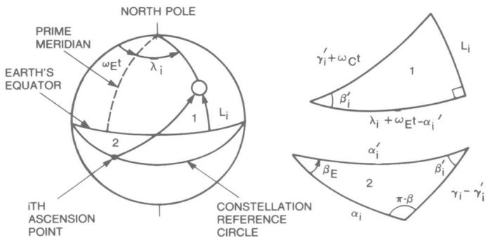  
Fig. A4. Transformation to latitude, longitude.

Trans. Aerosp. Electron. Syst., vol. AES-13, pp. 108–111, Mar. 1977.

[4] D.C. Beste, “Design of satellite constellations for optimal continuous coverage,” IEEE Trans. Aerosp. Electron. Syst., vol. AES-14, pp. 466–473, May 1978.

[5] J.G. Walker, “Circular orbit patterns providing continuous whole earth coverage,” Royal Aircraft Establishment, Tech. Rep. 70211 (UDC 629.195:521.6), Nov. 1970.

[6] ——, “Continuous whole earth coverage by circular orbit satellites,” presented at the IEE Satellite Systems for Mobile Communications Conf., Mar. 13–15, 1973, paper 95.

[7] ——, “Continuous whole earth coverage by circular orbit satellite patterns,” Royal Aircraft Establishment, Tech. Rep. 77044 (UDC 629. 195:527), Mar. 24, 1977; available through DDC, AD-A044593, unclassified.

[8] G.V. Mozhaev, “The problem of continuous earth coverage and kinematically regular satellite networks, I,” Cosmic Res., vol. 10 (UDC 629.191), Nov.-Dec. 1972, translation in CSCRA7 (Consultants Bureau, New York), vol. 10, no. 6, pp. 729–882, 1972.

[9] G.V. Mozhaev, “The problem of continuous earth coverage and kinematically regular satellite networks, II,” Cosmic Res., vol. 11 (UDC 629.191), Jan.-Feb. 1973; translation in CSCRA7 (Consultants Bureau, New York), vol. 11, no. 1, pp. 1-152, 1973.

[10] R.J. Milliken and C.J. Zoller, “Principle of operation of NAVSTAR and system characteristics,” Navigation, vol. 25, pp. 95–106, Summer 1978.

[11] A.H. Bogen, “Geometric performance of the global positioning system,” Aerospace Corp., Rep. SAMSD-TR-169, June 21, 1974; available through NTIS, AD-783210, unclassified.

Arthur H. Ballard (A'50—SM'56) was born in Washington, D.C., in 1925. He received the B.S.E.E. degree from the University of Maryland in 1947 and the M.S.E.E. degree from the Massachusetts Institute of Technology in 1950.

Since 1966 he has been a senior staff engineer with the TRW Defense and Space Systems Group in McLean, Va., engaged in systems engineering and integration activities related to antisubmarine warfare, undersea surveillance, counter-infiltration sensor systems, and strategic command, control, and communications. Before joining TRW, he served with the U.S. Army Signal Corps from 1944 to 1946, as a test engineer with the General Electric Company from 1947 to 1948, and as a research assistant at the M.I.T. Project Whirlwind Laboratory from 1948 to 1950. From 1950 to 1961 he conducted research and development on various communication, navigation, and computer systems at Melpar, Inc., Falls Church, Va. From 1961 to 1966 he was Vice President for Engineering at the Bernard Electronics Co., Washington, D.C.

Mr. Ballard is a member of Phi Eta Sigma, Tau Beta Pi, Omicron Delta Kappa, and Phi Kappa Phi.