# Satellite Networks for Continuous Zonal Coverage

R. DAVID LÜDERS $^{1}$

Aerospace Corp.
El Segundo, Calif.

Solutions are obtained to the problem of providing continuous surveillance of latitudinally bounded zones of the globe by means of a particular family of satellite networks. Each network of the family considered consists of satellites equally divided among, and uniformly distributed around, circular orbits of common altitude; the orbit planes are equally inclined with respect to the Equator and symmetrically arranged about the polar axis. Relations are obtained between the number and distribution of satellites used, the characteristics of the network in which they are arranged, and the extent of the continuous zonal coverage they accomplish. These relations are then employed to select from the family of networks considered those which minimize the number of satellites required as a function of altitude for a variety of coverage problems. Results obtained for several representative cases are given graphically.

IT MAY well be desirable in the near future to establish orbital systems which afford continuous coverage of either all or a limited portion of the globe. A large variety of missions requiring such systems are described in the literature $(1,2,3)$ .² An important consideration in the feasibility of such systems will be the number of satellites and the orbital altitudes required to accomplish the desired coverage missions. Recently Vargo (4) presented a solution to the problem of obtaining uninterrupted coverage of the entire globe by means of a particular network configuration. The present analysis treats a family of networks which provide continuous coverage of latitudinally bounded zones on Earth. Using relations obtained between network characteristics and the resultant coverage, one can select those networks which require the fewest satellites as a function of altitude for a variety of coverage problems.

## Assumptions

The networks considered in this analysis consist of satellites equally divided among, and uniformly distributed around, circular orbits of common altitude; the orbit planes are equally inclined with respect to the Equator and are symmetrically arranged about the polar axis. Each satellite carries a sensor which observes the segment of the globe subtended by the scanned solid cone whose axis is continually aligned with the local vertical. The globe is assumed spherical, and no differential perturbations are assumed to act (i.e., no perturbations which would alter the relative orientation of satellites in any orbit plane or the angular spacing between orbit planes). Results obtained by King-Hele (5) show that for identically inclined, equal circular orbits, perturbations resulting from Earth oblateness will not, in fact, produce a change in the interorbit spacing; one can compensate for the radial excursions executed by the satellites (and the non-spherical shape of Earth) by overdesigning the network.

## Analytical Development

## General Principles

A satellite at altitude h can view a spherical segment whose size $\theta$ (measured by the great circle arc from the satellite subpoint to the small circle bounding the observed segment) depends upon $\sigma$ the minimum angle of visibility consistent with the sensor capability and mission objectives. Fig. 1 illustrates

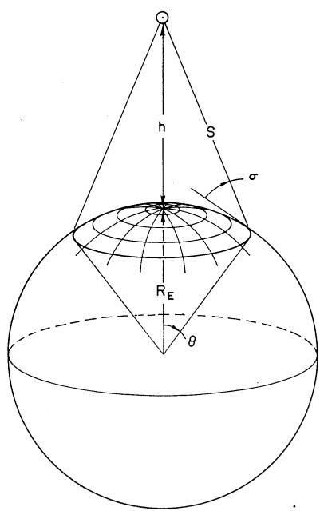

Fig. 1 Area observed by a single satellite

3. THE ORBIT PLANES ARE EQUALLY INCLINED TO THE EQUATOR.

the instantaneous coverage afforded by a single satellite. From the figure and the law of sines, it follows that

$$
h = R _ {E} [ \cos \sigma / \cos (\theta + \sigma) - 1 ]\tag{[1]}
$$

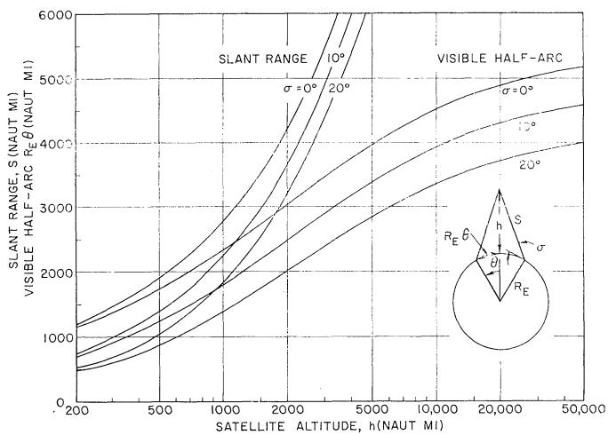  
Fig. 2 Slant range and visible half-arc vs. satellite altitude and minimum viewing angle

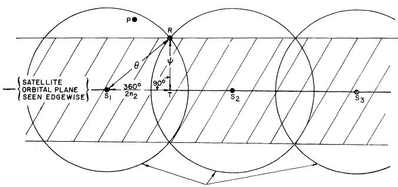  
Fig. 3 Spherical segments visible from $S_{1}$ , $S_{2}$ and $S_{3}$ , respectively

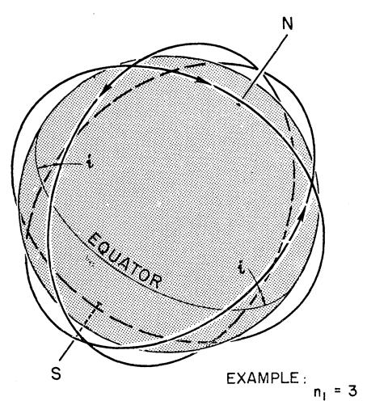

1. THE $n_1$ ORBITS ARE CIRCLES OF COMMON SIZE.

2. $n_2$ SATELLITES (NOT SHOWN HERE) ARE EVENLY SPACED IN EACH ORBIT.

4. THE NODAL AXES OF THE $n_{1}$ ORBIT PLANES ARE UNIFORMLY SPACED AROUND THE EQUATOR.

where $R_{E}$ is the radius of the Earth or other central body. Fig. 2 shows the relation between slant range S, observed half-arc $\theta$ , satellite altitude h and minimum viewing angle $\sigma$ .

The spherical segments observed by the satellites in a common orbit plane will combine to observe a swath of angular half-width $\psi$ on the globe. Fig. 3 illustrates the relation between great circle arcs $\theta$ and $\psi$ and $n_{2}$ the number of satellites in each orbit plane. Although a point such as P will be uncovered periodically as the satellites advance in orbit, the shaded swath will always be observed from the orbit plane. By spherical trigonometry applied to triangle $RS_{1}T$

$$
\cos \theta = \cos \psi \cos \pi / n _ {2}\tag{[2]}
$$

The angle $\psi$ will be found to depend upon $n_{1}$ , the number of orbit planes used, their inclination, and the location and extent of the area to be continuously observed.

Since N denotes the total number of satellites used in a network, it follows by definition that

$$
N = n _ {1} n _ {2}\tag{[3]}
$$

where $n_1$ and $n_2$ are integers.

The general network consists of $n_{1}$ orbit planes which are equally inclined with respect to the Equator and whose nodal axes are uniformly spaced around the equatorial circle. Fig. 4 shows a typical satellite network of the type treated here, and Fig. 5 gives views of such inclined systems seen from above the pole. Note that as the orbit inclination with respect to the equator tends to 90 deg, the inclined network becomes polar. If $n_{1}$ is odd, the resulting polar network will consist of $n_{1}$ distinct orbit planes. However, if $n_{1}$ is even, the polar network obtained will consist of only $n_{1}/2$ distinct planes; each “double plane” will contain two chains of $n_{2}$ satellites moving in opposition. This fact will be important later in the discussion.

Fig. 4 Typical satellite network  
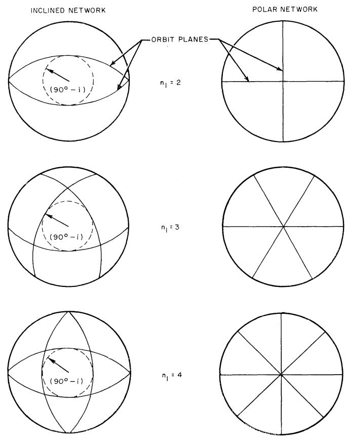  
Fig. 5 Comparison of satellite networks viewed from above the pole

## Method

Fig. 6 indicates the manner in which the swaths observed by satellites in adjacent orbit planes will merge to provide continuous coverage of a latitude belt in each hemisphere.

The zones viewed from the northeastbound satellites in orbit planes 1 and 2 will intersect at point S which will thus be the southernmost $^{3}$ point viewed simultaneously from those planes. The southeastbound satellites in orbit planes $(n_{1}-p)$ and $[n_{1}-(p+1)]$ will view swaths which intersect at point T. (This “plane index” p is chosen as the least integer such that T falls to the west of S.) Let point V at latitude $\lambda$ be the southernmost point on the rotating Earth, continuously observed by the satellite network. Then V will be determined by the intersection of the northern boundaries of the unobserved areas terminating at points S and T; by symmetry, V will fall directly below point B, the intersection of planes 1 and $(n_{1}-p)$ . The northernmost point N continuously observed by the network will be determined by the intersection of the northern boundaries of the swaths viewed from planes 1 and 2. Its latitude will be denoted by $\mu$ .

Combining Equations [1, 2 and 3] to eliminate $\theta$ , and applying spherical trigonometric relations to the geometry in Fig. 6 yields the following system of relations

$$
h = R _ {E} (\cos \sigma / \cos \{\arccos [ \cos (\pi n _ {1} / N) \cos \psi ] + \sigma \} - 1)\tag{[4]}
$$

$$
\begin{array}{l} \lambda = \arctan \left\{\tan i \cos \left[ \left(\frac {p + 1}{n _ {1}}\right) \pi \right] \right\} - \\ \arcsin \left(\frac {\sin \psi}{\sqrt {1 - \sin^ {2} i \sin^ {2} \left\{\left[ (p + 1) / n _ {1} \right] \pi \right\}}}\right) \end{array}\tag{[5]}
$$

where

$$
\psi = \arcsin [ \sin \mu \cos i - \cos (\pi / n _ {1}) \cos \mu \sin i ]\tag{[6]}
$$

and where $p$ is the least integer such that

$$
\begin{array}{l} p \geq \frac {n _ {1}}{2} - 2 - \\ \frac {n _ {1}}{\pi} \arctan \left[ \frac {\cos i}{\sin \psi} \sqrt {\frac {\cos^ {2} \psi}{1 - \sin^ {2} i \sin^ {2} (\pi / n _ {1})} - 1} \right] \end{array}\tag{[7]}
$$

In the foregoing relations, $0 \, deg < \psi < 90 \, deg$ . The extremes of required coverage will be specified in the range $0 \, deg \leq \lambda < \mu \leq 90 \, deg$ , but a resulting negative value of $\lambda$ or a value of $\mu$ in excess of 90 deg will indicate, respectively, coverage south of the Equator by satellites in the northern hemisphere or coverage beyond the poles. (This will be mentioned again later in the discussion.) Note that in relation [7], in order that the quantity under the radical be positive $\psi$ must not exceed arccos $\sqrt{1 - \sin^{2} i \sin^{2} (\pi / n_{1})}$ ; this insures that the swaths observed from adjacent ascending orbits will have a discrete intersection. If $\psi$ exceeds that value, the swaths will overlap everywhere (indeed, providing coverage to $\lambda = 0 \, deg$ , but making S an undefined point).

Relations [4-7] may be combined in principle to eliminate $p$ and $\psi$ ; then relations of the following form result

$$
f _ {1} (n _ {1}, i, \lambda , \mu) = 0\tag{[8]}
$$

$$
f _ {2} (h, N / n _ {1}, n _ {1}, i, \mu , \sigma) = 0\tag{[9]}
$$

For a given coverage requirement and sensor resolution capability, the quantities $\lambda$ , $\mu$ and $\sigma$ will be known. Then from Equation [8] one may obtain values of i satisfying the coverage requirements for a series of integral values of $n_{1}$ . These ( $n_{1}$ , i) pairs when substituted in Equation [9] yield curves of N vs. h for constant $n_{1}$ and i. The envelope to the $n_{1}$ family of curves thus obtained is the locus of the optimum networks. An “optimum” network is defined here as one which accomplishes the specified coverage mission utilizing the minimum number of satellites at a given system altitude. Strictly speaking the envelope obtained is the theoretical optimum curve since both $n_{1}$ and $n_{2}$ will not, in general, assume integral values along it. The theoretical optimum curve will be useful primarily as a standard for comparison of practical networks (i.e., ones consisting of whole numbers of orbit planes containing whole numbers of satellites).

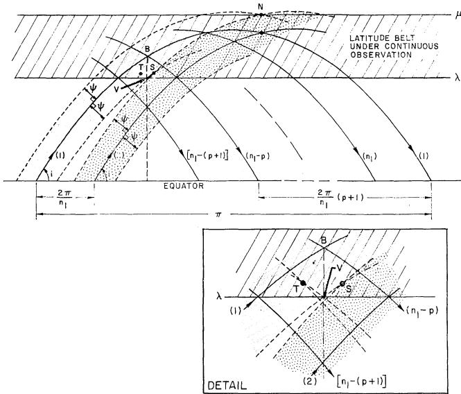  
Fig. 6 Mercator projection of general coverage geometry

## Applications

The specified coverage will always be such that $0 \, deg \leq \lambda < \mu \leq 90 \, deg$ and $0 \, deg \leq i \leq 90 \, deg$ . However, if particular values are assigned to one or more of these quantities, certain special networks may be examined. Two of these, the polar and equatorial networks, are discussed in some detail in the following. The third case is concerned with the more common network where $0 \, deg < i < 90 \, deg$ .

## Case A: The Polar Network

For an orbit inclination of 90 deg, the network is polar. (The particular case $n_1 = 4$ , $n_2 = 3$ is shown in Fig. 7.) Relations [5-7] then simplify to the following forms

$$
p \geq (n _ {1} / 2 - 2)\tag{[10]}
$$

$$
\psi = \arcsin (\cos \lambda \cos \left\{\left[ (p + 1) / n _ {1} \right] \pi \right\})\tag{[11]}
$$

$$
\mu = \arccos [ - \sin \psi / \cos (\pi / n _ {1}) ]\tag{[12]}
$$

Equation [12] indicates that $\mu$ will exceed 90 deg for $\psi > 0$ deg. The quantity p in inequality [10] may best be examined by considering its behavior for even and odd $n_{1}$ values. For odd $n_{1}$ , p is equal to $(n_{1} - 3)/2$ ; then

$$
\cos \left\{\left[ (p + 1) / n _ {1} \right] \pi \right\} = \sin \left(\pi / 2 n _ {1}\right)\tag{[13a]}
$$

so Equation [11] becomes

$$
\psi = \arcsin (\cos \lambda \sin [ \pi / 2 n _ {1} ])\tag{[14a]}
$$

However, if $n_1$ is even, $p$ is equal to $(n_1 - 4)/2$ ; then

$$
\cos \left\{\left[ (p + 1) / n _ {1} \right] \pi \right\} = \sin \left(\pi / n _ {1}\right)\tag{[13b]}
$$

in which case Equation [11] becomes

$$
\psi = \arcsin (\cos \lambda \sin [ \pi / n _ {1} ])\tag{[14b]}
$$

The discrepancy between Equations [14a and 14b] was anticipated earlier in the discussion, when it was realized that,

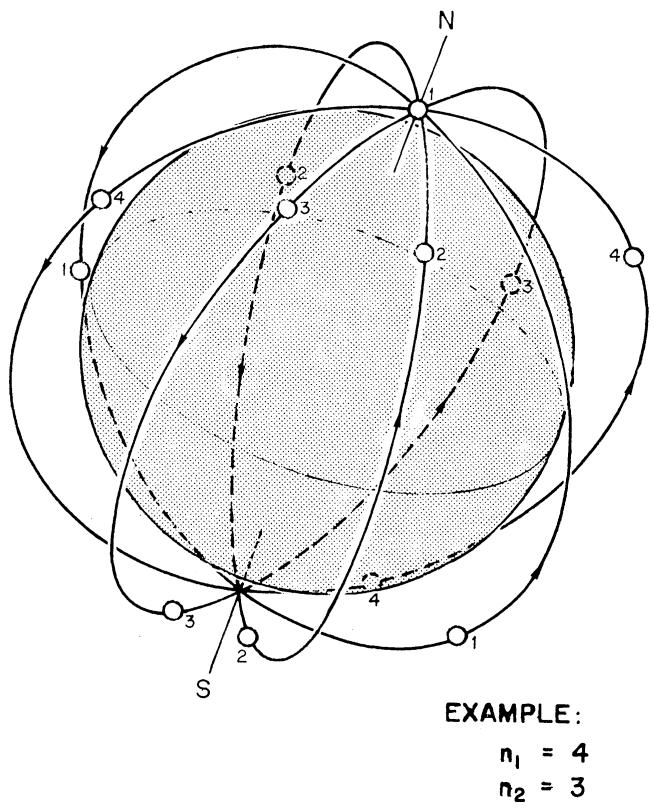

ASSUMPTIONS

I. ALL ORBITS ARE CIRCLES OF COMMON SIZE.

2. THE PLANES ARE EVENLY FANNED ABOUT THEIR COMMON AXIS, NS.

3. THE SATELLITES ARE EVENLY SPACED IN ORBIT.

Fig. 7 Diagram of the polar satellite network  
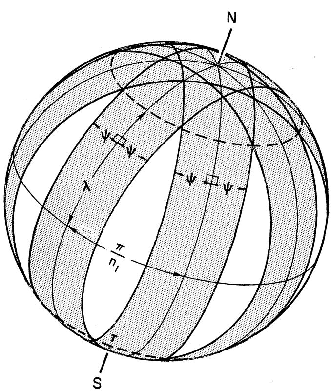  
Fig. 8 Coverage geometry for a polar satellite network

for instance, a four-plane inclined network degenerated at i = 90 deg to a double two-plane polar network. However, meaningful results may be obtained for a polar network containing any (even or odd) number of distinct orbit planes. To find $\psi$ required for a two-plane polar network, one could set $n_{1}$ equal to 4 in Equation [14b] to obtain $\psi$ and substitute that value of $\psi$ and $n_{1}$ in Equation [4] to obtain N, the number of satellites actually required in a double two-plane network. But only half that number of satellites is required in a polar network consisting of two distinct orbit planes. Essentially then, whether $n_{1}$ is odd or even, Equation [14a] can be applied to determine $\psi$ . Consequently, Equation [11] becomes

$$
\psi = \arcsin [ \cos \lambda \sin (\pi / 2 n _ {1}) ]\tag{[15]}
$$

Fig. 8 illustrates the manner in which coverage of the polar caps down to latitude $\lambda$ is effected by overlapping zones of coverage swept out by the satellites in neighboring orbit planes.

Equations [4 and 15] were solved to obtain N, the total number of satellites required, as a function of system altitude h and the number of orbit planes $n_{1}$ for the case of complete, global coverage ( $\lambda = 0$ deg) with ideal sensors (i.e., $\sigma = 0$ deg). The results are displayed in Fig. 9. The rather sharp heels appearing in the curves of constant $n_{1}$ indicate that it is undesirable (if satellite altitude is to be minimized) to pack an excessively large number of satellites into each plane. Instead it is better to increase $n_{1}$ the number of orbit planes, and to decrease $n_{2}$ the satellite density per plane, in order to reduce the system altitude at some N level. For example, 36 satellites may be arranged as follows to provide complete global coverage:

<table><tr><td>Orbit planes</td><td>Satellites/plane</td><td>Required altitude</td></tr><tr><td> $n_{1} = 2$ </td><td> $n_{2} = 18$ </td><td>1500 nautical miles</td></tr><tr><td>3</td><td>12</td><td>672</td></tr><tr><td>4</td><td>9</td><td>522</td></tr><tr><td>6</td><td>6</td><td>672</td></tr><tr><td>9</td><td>4</td><td>1500</td></tr></table>

Then, from a minimum altitude standpoint, a network of $4 \times 9$ is most desirable for complete global coverage if a polar network consisting of 36 satellites is to be employed.

Fig. 10 presents the envelope to the $n_{1}$ family of curves shown in Fig. 9. The requirement that both $n_{1}$ and $n_{2}$ be integers results in the step-like practical optimum curve. The variations in step size and frequency result from the irregular occurrence of N values which may be factored in an optimum or near-optimum fashion. For example, as was seen previously, the minimum altitude of a 36-satellite polar network which provides complete gobal coverage is 522 nautical miles. In order to reduce the network altitude further, N must be increased to at least 40 (h = 475 nautical miles), since the best

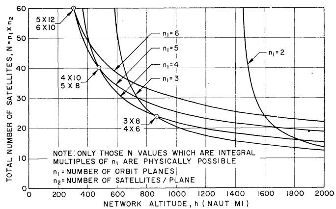  
Fig. 9 Number and distribution of satellites in a polar network providing complete global coverage ( $\lambda = 0$ deg, $\sigma = 0$ deg)

38- and 39-satellite networks require altitudes of 1492 and 651 nautical miles, respectively. Note that when N is twice the square of an integer $(2n_{1}^{2})$ , the theoretical optimum may actually be attained.

The theoretical optimum curves for $\sigma = 10$ and 20 deg demonstrate the strong dependence of N on $\sigma$ . The practical optimum curves for each of these $\sigma$ values may be obtained by a point-by-point transformation of the practical optimum curve for $\sigma = 0$ deg by means of the curves in Fig. 2.

The theoretical optimum satellite utilization curves for several nonzero values of $\lambda$ were obtained in a similar manner and are presented in Fig. 11. Note that sizable reductions in system requirements may be effected by modification of the coverage requirement. For example, a system of 24 satellites providing complete global coverage requires an altitude of 859 nautical miles; but if $\lambda = 30$ deg, the altitude need be only 691 nautical miles.

Equations [3, 4 and 15] indicate the following dependence of system altitude upon the number of orbit planes in a polar network

$$
\begin{array}{l} h = R _ {E} \\ \left\{\frac {\cos \sigma}{\cos (\arccos \left\{\cos (\pi / n _ {2}) \cos [ \arcsin (\cos \lambda \sin \pi / 2 n _ {1}) ] \right\} + \sigma)} - 1 \right\} \end{array}\tag{[16]}
$$

Minimization of h with respect to $n_{1}$ , holding N, $\sigma$ and $\lambda$ constant, results in the expression

$$
\frac {4 n _ {1}}{n _ {2}} \frac {\tan \pi / n _ {2}}{\cos^ {2} \lambda \sin \pi / n _ {1}} \left(1 - \cos^ {2} \lambda \sin^ {2} \frac {\pi}{2 n _ {1}}\right) - 1 = 0\tag{[17]}
$$

For the special case of complete global coverage mentioned earlier, $\lambda$ is equal to zero deg and Equation [17] takes the form

$$
2 n _ {1} \tan \pi / n _ {2} = n _ {2} \tan \pi / 2 n _ {1}\tag{[18]}
$$

whose solution is simply

$$
n _ {2} = 2 n _ {1}\tag{[19]}
$$

In practice, an integral value of N will not generally be twice the square of an integer $(2n_{1}^{2})$ permitting such a theoretical optimum distribution. A convenient rule of thumb for selecting the practical network which minimizes system altitude is to choose the pair of integer factors of N which minimizes quantity q defined by

$$
q = \left| n _ {2} - 2 n _ {1} \right|\tag{[20]}
$$

It is clear from the manner in which $n_{1}$ and $n_{2}$ are involved in Equation [16] why the $(3 \times 10)$ and the $(5 \times 6)$ polar networks mentioned earlier require identical altitudes to provide complete global coverage.

More generally, it appears that the minimum-altitude polar network of N satellites providing coverage down to latitude $\lambda$ is the one for which $q_{\lambda}$ assumes its minimum value, where

$$
q _ {\lambda} = \left| n _ {2} - 2 n _ {1} / \cos \lambda \right|\tag{[21]}
$$

## Case B: The Equatorial Network

In this case i is equal to zero deg, and a single orbit plane is used to avoid redundancy. From Equation [5] it is clear that

$$
\psi = \mu\tag{[22]}
$$

That is, the zone from $-\mu$ to $+\mu$ will be continuously observed by the equatorial chain of satellites. Then from Equations [4 and 22] it follows that

$$
h = R _ {E} \left\{\cos \sigma / \cos [ \arccos (\cos \pi / N \cos \mu) + \sigma ] - 1 \right\}\tag{[23]}
$$

Equation [23] was solved to obtain curves of N vs. $\mu$ and h for a network consisting of a single equatorial orbit plane. The results are displayed in Fig. 13 together with the system requirements for multiplane inclined networks examined in case C. Discussion of the results is deferred until that time.

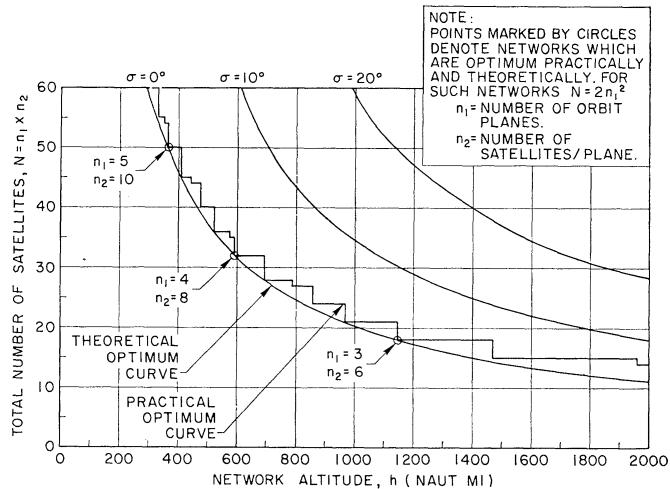

Fig. 10 Theoretical and practical optimum satellite utilization in a polar network providing complete global coverage ( $\lambda = 0$ deg)  
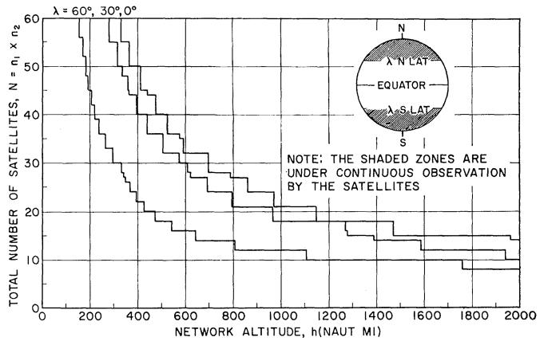  
Fig. 11 Comparison of polar satellite networks providing coverage from the poles to minimum latitude $\lambda$ . ( $\sigma = 0$ deg)

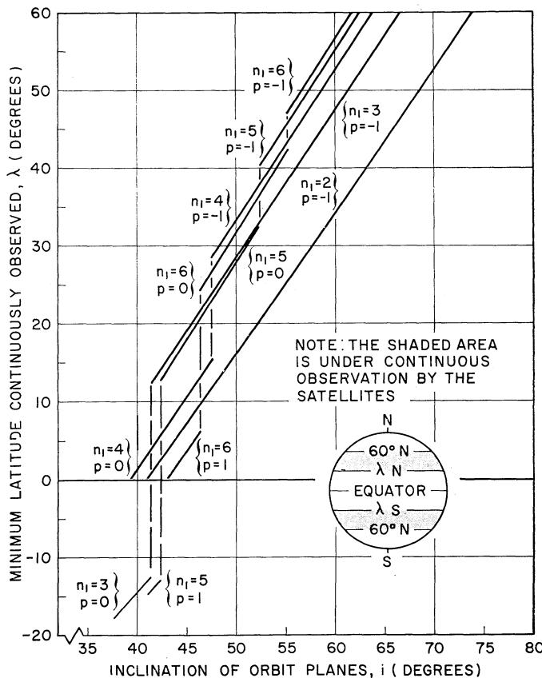  
Fig. 12 Minimum latitude continuously observed as a function of inclination and number of orbit planes in network ( $\mu = 60$ deg)

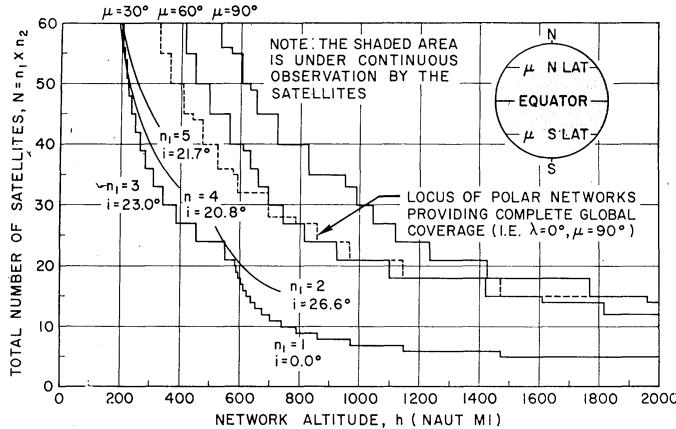  
Fig. 13 Comparison of inclined and polar satellite networks providing coverage from the Equator to maximum latitude $\mu$ . ( $\sigma = 0$ deg)

## Case C: The General Network

In the most common case, the orbit inclination will not necessarily be zero or 90 deg, nor will $\lambda$ or $\mu$ assume its extreme value of zero or 90 deg. For example, suppose coverage is required from a minimum latitude $\lambda$ to a maximum latitude $\mu$ of 60 deg. Substitution of values of $\mu$ , $n_{1}$ and $i$ in relations [5-7] yields $\lambda$ as a function of those parameters as shown in Fig. 12.

Because of the role of the integer $p$ in Equation [5], $\lambda$ is a piecewise continuous function of $i$ for $n_1 > 2$ . The physical explanation for the discontinuous nature of $\lambda$ is as follows. As the orbit inclination $i$ decreases, $\psi$ must increase so as to maintain coverage up to latitude $\mu$ . Then, when the northernmost mesh (below latitude $i$ ) becomes covered, point $V$ (the southernmost continuously observed point) will suddenly appear in the next mesh to the south. As $\psi$ increases further, $\lambda$ will decrease continuously until that mesh is covered—and so on. For odd values of $n_1$ , $\lambda$ will assume negative values until $\psi$ reaches the value $\arccos \sqrt{1 - \sin^2 i \sin^2 (\pi / n_1)}$ , when the swaths covered from adjacent ascending satellite orbits overlap everywhere. Then $\lambda$ becomes undefined with coverage extending from $-\mu$ to $+\mu$ .

It is clear from Fig. 12 that the appropriate inclinations of networks providing coverage from $\lambda = 0$ deg to $\mu = 60$ deg are

$$
\begin{array}{r l r} i = 4 0. 9 \text {deg} & \quad \text {for} \quad n _ {1} = 2 \\ 4 1. 4 \text {deg} & & 3 \\ 3 9. 2 \text {deg} & & 4 \\ 4 2. 4 \text {deg} & & 5 \end{array}
$$

Substitution of these $(n_{1}, i)$ pairs in Equations [4 and 6] yields N as a function of h and $n_{1}$ for $\lambda = 0$ deg and $\mu = 60$ deg. Similarly, curves may be obtained for other values of $\lambda$ and $\mu$ . Fig. 13 shows the results appropriate to networks providing coverage from the Equator to latitude $\mu$ in each hemisphere. The N vs. h curve for the polar network was included in the figure as a basis for comparison of the two kinds of networks for various coverage requirements.

Fig. 12 indicates that, in order to cover the latitude belt from $-\mu$ to $+\mu$ , a network consisting of an even number of orbit planes must observe all points down to latitude $\lambda = 0$ deg. However, a network in which $n_{1}$ is odd need not observe all points down to the Equator in order to cover the zone from $-\mu$ to $+\mu$ ; that is, for $n_{1}$ odd, the most remote point to be observed will be north of the Equator. Note that in Fig. 13 for $\mu = 30$ deg, networks for which $n_{1}$ is odd are superior to those for which $n_{1}$ is even; above a system altitude of 582 nautical miles, a single equatorial orbit plane should be used to provide the required coverage, but immediately below that altitude a three-plane network is preferred.

It appears from Fig. 13 that at low system altitudes a polar network providing complete global coverage requires fewer satellites than does an inclined network providing coverage of a wide equatorial zone. The altitude at which the polar and the inclined networks require equal numbers of satellites increases with $\mu$ . For $\mu = 90$ deg, the inclined and polar networks require equal numbers at an altitude of 1960 nautical miles, above which the inclined network consists of two orbit planes. Since each of the planes is inclined at 45 deg with respect to the equatorial plane, the polar and inclined networks are geometrically identical for a 90-deg rotation of the axis common to the orbit planes.

## Conclusions

A method was developed to determine the minimum number of satellites required to provide continuous coverage of a latitudinally bounded zone by means of a particular kind of satellite network.

Several representative cases of coverage requirements were examined with the following results:

1 The polar network is preferable to the inclined network in providing complete global coverage. Ideally, the distribution of satellites in it is such that the number of satellites in each orbit plane is twice the number of orbit planes.

2 The number and inclination of the orbit planes in the optimum inclined network designed to satisfy a particular coverage requirement vary discontinuously with system altitude.

3 To determine the properties of the optimum satellite network satisfying a certain coverage requirement, it is generally necessary to compare the N vs. h performance curves obtained separately for the polar, equatorial and inclined networks. From such performance curves, preferred orbital inclinations and distributions can be chosen for satellite networks at pre-assigned altitudes.

## Acknowledgment

The writer wishes to acknowledge the support of Douglas Aircraft Co., Santa Monica, Calif., where the early stages of the study were done. Appreciation is also extended to Dr. A. B. Greenberg and Mr. U. E. Lapins, both now with Aerospace Corp., for their many helpful suggestions and criticisms.

## Nomenclature

h = altitude of each satellite in the network
i = inclination of each orbit plane to the Equator $n_{1}$ = number of orbit planes in the network $n_{2}$ = number of satellites in each orbit plane
N = total number of satellites in the network $R_{E}$ = radius of Earth (= 3440 nautical miles) or other central body
S = slant range (Fig. 2) $\theta$ = central angle subtended by the observed great circle half-arc (Fig. 1) $\lambda$ = minimum latitude to be observed continuously $\mu$ = maximum latitude to be observed continuously $\sigma$ = minimum angle of visibility (Fig. 1) $\psi$ = great circle arc half-width of observed swath

## References

1 Clarke, A. C., “The Making of a Moon,” Harper and Brothers, N. Y., 1958, revised ed., chaps. 8 and 15.

2 Select Committee on Astronautics and Space Exploration, "The Next Ten Years in Space 1959–1969," 86th Congress, 1st Session, House Document No. 115; U.S. Government Printing Office, Wash., D. C., 1959, pp. 10–13.

3 Pierce, J. R. and Kompfner, R., "Transoceanic Communication by Means of Satellites," Proc. IRE, vol. 47, March 1959, pp. 372–380.

4 Vargo, L. G., "Orbital Patterns for Satellite Systems," AAS preprint 60-48, Sixth National Annual Meeting, Jan. 18–21, 1960, N. Y.

5 King-Hele, D. G., "The Effect of the Earth's Oblateness on the Orbit of a Near Satellite," Proc. Royal Society of London, Series A, vol. 247, Oct. 1958, pp. 49–72.

## This article has been cited by:

1. Route Theory for Optimal Design of Satellite Const.. . [Citation] [PDF] [PDF Plus]

2. Jay MiddourSurvey of orbit selection for satellite Earth surveillance . [Citation] [PDF] [PDF Plus]

3. Yuri Ulybyshev. 1999. Near-Polar Satellite Constellations for Continuous Global Coverage. Journal of Spacecraft and Rockets 36:1, 92-99. [Citation] [PDF] [PDF Plus]

4. Giovanni Palmerini, Filippo Graziani Polar elliptic orbits for global coverage constellations. [Citation] [PDF] [PDF Plus]

5. D. Castiel, J. Brosius, J. DraimELLIPSO - Coverage optimization using elliptic orbits . [Citation] [PDF] [PDF Plus]

6. JOHN E. DRAIM. 1987. A common-period four-satellite continuous global coverage constellation. Journal of Guidance, Control, and Dynamics 10:5, 492-499. [Citation] [PDF] [PDF Plus]