# Satellite Constellation Pattern Optimization for Complex Regional Coverage

Hang Woon Lee∗

Georgia Institute of Technology, Atlanta, Georgia 30332

Seiichi Shimizu† and Shoji Yoshikawa‡

Mitsubishi Electric Corporation, Amagasaki, Japan

and

Koki Ho§

Georgia Institute of Technology, Atlanta, Georgia 30332

https://doi.org/10.2514/1.A34657

The use of regional-coverage satellite constellations is on the rise, urging the need for an optimal constellation design method for complex regional coverage. Traditional constellations are often designed for continuous global coverage, and the few existing regional constellation design methods lead to suboptimal solutions for periodically time-varying or spatially varying regional-coverage requirements. This paper introduces a new general approach to design an optimal constellation pattern that satisfies such complex regional-coverage requirements. To this end, the circula convolution nature of the repeating ground-track orbit and common ground-track constellation is formalized. This formulation enables a scalable constellation pattern analysis for multiple target areas and with multiple subconstellations. The formalized circular convolution relationship is first used to derive a baseline constellation pattern design method with the conventional assumption of symmetry. Next, a novel method based on binary integer linear programming is developed, which aims to optimally design a constellation pattern with the minimum number of satellites. This binary integer linear programming method is shown to achieve optimal constellation patterns for general problem settings that the baseline method cannot achieve. Five illustrative examples are analyzed to demonstrate the value of the proposed new approach.

## Nomenclature

a semimajor axis ab coverage timeline C coverage satisfactoriness indicator $e$ = eccentricity $f$ coverage requirement vector $i$ inclination $\mathcal { I }$ set of target point(s) $L$ length (number of time steps) of vectors $M$ mean anomaly $N$ total number of satellites $N _ { D }$ number of Greenwich nodal periods $N _ { P }$ number of orbit nodal periods $n$ discrete-time instant $P _ { \pi }$ permutation matrix $p$ semilatus rectum $R _ { \oplus }$ mean radius of Earth $r _ { g }$ target point position vector $r _ { s }$ satellite position vector $T _ { G }$ nodal period of Greenwich $T _ { r }$ = period of repetition $T _ { S }$ = satellite nodal period

Received 1 October 2019; revision received 7 May 2020; accepted for publication 7 May 2020; published online 16 September 2020. Copyright © 2020 by Hang Woon Lee, Seiichi Shimizu, Shoji Yoshikawa, and Koki Ho. Published by the American Institute of Aeronautics and Astronautics, Inc., with permission. All requests for copying and permission to reprint should be submitted to CCC at www.copyright.com; employ the eISSN 1533-6794 to initiate your request. See also AIAA Rights and Permissions www.aiaa.org/ randp.

\*Ph.D. Student and National Science Foundation Graduate Research Fellow, Daniel Guggenheim School of Aerospace Engineering.

†Researcher, Mechatronics Department, Advanced Technology R&D Center.

$T _ { \mathrm { s i m } }$ simulation time horizon t = continuous-time instan $t _ { \mathrm { s t e p } }$ = time step $V$ = access profile circulant matrix $\pmb { v }$ = access profile $\boldsymbol { x }$ constellation pattern vector $\mathcal { Z }$ set of subconstellation(s) $\mathbb { Z } _ { 2 }$ binary integer number set $\mathbb { Z } _ { > 0 }$ 11 positive integer number set $\mathbb { Z } _ { \geq 0 }$ nonnegative integer number set $\varepsilon$ = elevation angle $\eta$ = satellite spacing constant $\lambda$ = longitude $\mu _ { \oplus }$ standard gravitational parameter of Earth $\pmb { \rho }$ relative position vector from target point to satellite $\tau$ = period ratio $\phi$ = latitude $\Omega$ = right ascension of the ascending nod $\omega$ = argument of perigee $\omega _ { \oplus }$ = rotation rate of Earth $\mathbf { \delta } \mathbf { a } _ { \mathbf { \delta } }$ = orbital elements vector

Subscripts

j = target point index $k$ = satellite index

Superscript

Z = subconstellation index

## I. Introduction

ATELLITE constellations for regional coverage are increasingly S being considered as competent business solutions in a market dominated by global-based constellation systems. Regional constel lations, whose form varies from being stand-alone to augmenting existing space-borne systems, provide flexible solutions to stake holders as a means of circumventing geopolitical, economic, and/o technical issues associated with global constellation systems. Exam ples of such regional constellation systems are the Indian Regional Navigation Satellite System (IRNSS) [1] and the Quasi-Zenith Sat ellite System [2].

Unlike global-coverage constellations, regional-coverage constellations solely focus on the coverage over a local region, and therefore generally require a smaller number of satellites in the system to achieve the same performance per area metric compared to globalcoverage constellations. This leads to a significantly reduced system cost as the total life-cycle cost of the system depends on the number of satellites [3]. The reduced system cost allows for a tolerable risk of failure and facilitates a shorter payback period. These properties allow regional constellation systems to swiftly react to uncertainties arising from market demand and/or administrative issues. Research has also shown that a flexible option to treat a regional constellation system as part of a larger staged deployment process can be beneficial when market uncertainties are present [4].

Various space systems have been designed for regional coverage. Although the most classical regional-coverage method is to use geosynchronous/geostationary equatorial orbits, nongeostationary orbit (NGSO) systems are deemed to provide better performance for many mission-critical attributes, such as latency and launch cost. Traditional constellation design methods have investigated the problems with relatively simple coverage criteria, such as satisfying an -fold con ftinuous coverage requirement (e.g., single fold, double fold, etc.) or minimizing the maximum revisit time gap over an area. However, the problems with complex coverage requirements that are periodically time varying and spatially varying have not been explored. Examples of such coverage requirements are 1) the increased communication service needs during the daytime and 2) the increased service needs over urban/suburban areas for reliable access [5]. The design process to generate the optimal constellation for such complex coverage require ments involves determining 1) the common orbital characteristics and 2) a constellation pattern. Although conventional constellation design methods often assume a symmetric pattern (e.g., Walker constellations [6–8]) and optimize the common orbital characteristics (e.g., altitude and inclination) with that assumption, the large design space of asym metric constellation patterns is often missed despite its importance particularly for complex time-varying and spatially varying coverage requirements. Furthermore, it is reasonable to assume that such a regional-coverage constellation system can constitute multiple sub constellations, each with different orbital characteristics, as demon strated in the case of IRNSS [1]; however, the concurrent design of multiple subconstellation patterns using NGSOs requires a sophisticated optimization approach. Such a topic has been scarcely studied and remains an open question. Given this background, a research question of interest arises: How do we design a constellation pattern (for multiple subconstellations if needed) that is optimized (i.e., with the minimum number of satellites) for a periodically time-varying and spatially varying demand over the regional area(s) of interest? This paper seeks to address this question by constructing an optimal constellation pattern design approach for complex regional coverage. The resulting rigorous constellation pattern design approach can be integrated with existing orbital characteristic design methods and launch/ mission constraints to optimize future satellite constellation design.

The contribution of this paper is as follows. First, the discovery of a circular convolution phenomenon between a seed-satellite access profile, a constellation pattern vector, and a coverage timeline is formalized in this research. The resulting formulation is referred to as the APC decomposition, following the acronyms of the seed-satellite access profile, constellation pattern, and coverage timeline; each of these concepts is introduced in detail later in this paper. We derive a linea formulation that enables us to design a constellation pattern for a system of multiple subconstellations for multiple regions. This formulation provides a foundation for general methods introduced herein. Second, we extend the traditional definition of a time-independent -fold cover-fage requirement (e.g., single fold, double fold, etc.) to a time-dependent -fold coverage requirement, where is a discrete-time instant, such fn nthat periodically time-varying coverage demands can be handled opti mally in the constellation design. By applying this idea to multiple target points, this approach is further extended to the case with time-varying and spatially varying coverage requirements. Finally, we develop a general method based on binary integer linear programming (BILP) that finds the optimal satellite constellation pattern for complex regional coverage, and, if needed, for multiple subconstellations concurrently This core concept enables users to explore the hidden design space by breaking the symmetry in the constellation design. The developed constellation pattern design approach is demonstrated with a series of case-study examples.

The rest of the paper is organized as follows. Section II provides a summary of the key literature relevant to this research. Section III provides an overview of the constellation model used in this paper. Section IV introduces the ideas behind the developed approach, including the circular convolution formulation of the problem and its pertinent definitions. Section V then introduces two methods based on this formulation: the baseline quasi-symmetric and the novel BILP methods. The developed methods are applied to various illustrative examples in Sec. VI for demonstration. Section VII then concludes this paper.

## II. Literature Review

This section reviews the major literature relevant to this study. Tradi tional satellite constellation design methods have focused on minimiz ing the number of satellites while providing continuous coverage over a large area of interest, such as the globe or latitudinally bounded zones. Classical methods, such as the streets of coverage [9–12], Walker and rosette constellations [6–8,13], and the tetrahedron elliptical constella tion [14] leveraged a geometric approach to exhibit a symmetry in the constellation pattern, where satellites are uniformly and symmetrically arranged based on a predetermined phasing rule. The symmetry in the constellation pattern provides a foundation for a complete design space analysis due to finite variability [15] or for an analytical solution. However, this usually leads to redundant coverage overlaps, and there fore may not produce an optimal constellation design in terms of the number of satellites over a bounded local region.

There are several prior studies that specifically dealt with the design of regional-coverage constellations. By fully using the characteristics of the repeating ground track (RGT) orbits, Hanson et al. [16] and Ma and Hsu [17] used the timeline meshing method to generate the optimal constellation with respect to minimizing the maximum time gap at the minimum possible inclination. Similarly, Pontani and Teofilatto ex tended the characteristics of the RGT by searching for allowable time delays with respect to minimizing the gap or maximizing coverage [18]. In addition, Crossley and Williams used metaheuristic methods to design a satellite constellation to minimize the maximum revisit time [19]. Although these regional constellation design algorithms show promising ability to produce asymmetric configuration with respect to a single target point or a connected area, these methods are not appli cable to designing a constellation system for periodically time-varying demands over multiple disjoint target points (referred to as complex coverage requirement in this paper) with multiple subconstellations. Ulybyshev investigated a new geometric approach to generate satellite constellation designs for complex coverage [20]. The method demon strates the use of the 2-D space and combined maps for the satellite constellation and coverage functions. Nevertheless, this method cannot be applied to asymmetric constellations. Other literature can be found in the comprehensive literature review by Dutruel-Lecohier and Mora as well as Wertz [15,21]. Recently, Ulybyshev presented a short historical survey of satellite constellation design for continuous coverage [22]. However, there is no methodology that directly answers our question raised in the introduction that considers all three aspects of the regional coverage problem: 1) multiple target points, 2) complex coverage requirements, and 3) multiple subconstellations.

In response to this background, this paper attempts to construct methods to design a satellite constellation pattern for periodically time varying and spatially varying coverage requirements over multiple target points, and if demanded, for multiple subconstellations. Building upon the idea of RGT orbits and common ground-track constellations (e.g., Flower Constellation set theory [23–25]) and generalizing our prior work [26], we formalize the circular convolution nature of the constellation pattern design problem and derive two methods fo it: 1) the baseline and rather traditional quasi-symmetric method and 2) the more general and novel BILP method. The developed approach can design the constellation pattern that satisfies the complex coverage requirements of multiple target points with the minimum number of satellites possible exploring both symmetric and asymmet ric patterns.

## III. Satellite Constellation Model

This section introduces the ideas and assumptions on the satellite constellation model that the proposed approach builds upon, includ ing the RGT orbit and the common ground-track constellation.

## A. RGT Orbit

A ground track of a satellite is defined as a trace of its subsatellite points on the surface of Earth. In this paper, we use an RGT orbit as a basis for the orbital design of the constellation, which allows a ground track of a satellite to repeat exactly and periodically. This type of orbi has been shown to provide better coverage performance than the non RGT orbits with fewer satellites for regional coverage [16]. Consid ering the Earth-centered Earth-fixed (ECEF) frame, an RGT orbit is achieved when the nodal period of the orbit $T _ { S }$ (the time interval TSbetween two consecutive crossings of the orbit ascending node by a satellite) is a rational multiple of the nodal period of Greenwich $T _ { G }$ TG(the time interval between two consecutive crossings of the orbit ascending node line by the prime meridian):

$$
T _ {r} = N _ {P} T _ {S} = N _ {D} T _ {G}\tag{1}
$$

where $T _ { r }$ represents the period of repetition. Equation (1) implies tha Tra satellite on an RGT orbit makes $N _ { P }$ number of revolutions in $N _ { D }$ NPnumber of nodal periods of Greenwich [23,27]. $N _ { P }$ and $N _ { D }$ NDare positive integer numbers.

Considering the $J _ { 2 }$ perturbation effect, the nodal period of the satellite orbit $T _ { S }$ Jand the nodal period of Greenwich $T _ { G }$ are given in Eq. (2):

$$
T _ {S} = \frac {2 \pi}{\dot {\omega} + \dot {M}}\tag{2a}
$$

$$
T _ {G} = \frac {2 \pi}{\omega_ {\oplus} - \dot {\Omega}}\tag{2b}
$$

where $\omega _ { \oplus }$ is the rotation rate of Earth, ω\_ is the rate of change in the argument of perigee due to perturbations, $\dot { \Omega }$ is the rate of nodal regression of a satellite’s orbit, and $\dot { M }$ is the rate of change in the Mmean anomaly due to nominal motion and perturbations. The per turbed orbital elements in Eq. (2) are

$$
\dot {\omega} = \frac {3}{2} J _ {2} \left(\frac {R _ {\oplus}}{p}\right) ^ {2} \sqrt {\frac {\mu_ {\oplus}}{a ^ {3}}} \left[ 2 - \frac {5}{2} \sin^ {2} i \right]\tag{3}
$$

$$
\dot {\Omega} = - \frac {3}{2} J _ {2} \left(\frac {R _ {\oplus}}{p}\right) ^ {2} \sqrt {\frac {\mu_ {\oplus}}{a ^ {3}}} \cos i\tag{4}
$$

$$
\dot {M} = \sqrt {\frac {\mu_ {\oplus}}{a ^ {3}}} \left[ 1 - \frac {3}{2} J _ {2} \left(\frac {R _ {\oplus}}{p}\right) ^ {2} \sqrt {1 - e ^ {2}} \left(\frac {3}{2} \sin^ {2} i - 1\right) \right]\tag{5}
$$

where $R _ { \oplus } = 6 3 7 8 . 1 4$ km is the mean radius of Earth, $p = a ( 1 - e ^ { 2 } )$ R is the semilatus rectum, $\mu _ { \oplus } = 3 9 8 { , } 6 0 0$ .44 $\mathrm { k m } ^ { 3 } \cdot \mathrm { s } ^ { - 2 }$ p  a e    ;gravitational parameter of Earth, and $J _ { 2 } = 0 . 0 0 1 0 8 2 6 3$ is the zonal J harmonic coefficient due to the equatorial bulge of Earth [15].

A period ratio τ is defined as a ratio of $N _ { P } / N _ { D }$ and further can be NP NDdeduced based on the perturbed orbital elements:

$$
\tau = \frac {N _ {P}}{N _ {D}} = \frac {T _ {G}}{T _ {S}} = \frac {\dot {\omega} + \dot {M}}{\omega_ {\oplus} - \dot {\Omega}}\tag{6}
$$

The period ratio is used to identify a unique RGTorbit out of an $N _ { P }$ and $N _ { D }$ pair [23], that is, a satellite orbit with $\tau = 1 0 / 2$ and a satellite NDorbit with $\tau = 5 / 1$ , both of which share an identical orbit and a ground track.

The semimajor axis of an RGT orbit can be derived using the Newton–Raphson method presented by Bruccoleri for a given set of $N _ { P } , N _ { D } , e , \mathrm { a n d } i [ 2 8 ]$ . Because the semimajor axis is a function of $\tau , e ,$ NPand $[ \mathrm { i } . \mathrm { e } . , a = a ( \tau , e , i ) ]$ , we shall use the period ratio $\tau = N _ { P } / N _ { D }$ i a  a ; e; i  NP NDas an independent orbital variable instead of the semimajor axis . aHenceforth, this paper uses an RGT orbital element vector, œ $[ \tau , e , i , \omega , \Omega , M ] ^ { T }$ , to fully define an RGT orbit of a satellite. We  ; e; i; ; ; Massume the use of satellite maneuvers to correct and maintain an identical ground track throughout the satellite lifetime, negating perturbation effects other than the $J _ { 2 }$ effect. Note that the right Jascension of the ascending node (RAAN) Ω and the mean anomaly in the RGT orbital element vector indicate the initial values in Mreference to a given epoch.

## B. Common Ground-Track Constellatio

This paper considers a constellation pattern, where all satellites in the constellation are systematically generated such that their ground tracks overlap to create a single common ground track. In this paper, we refer to this type of constellation as a common ground-track constellation. (If there are multiple subconstellations, each subcon stellation has its own common ground track.) Figure 1 illustrates an example of arbitrarily defined nine-satellite common ground-track constellation; its system satellites, depicted in yellow circles, are placed along a common ground track. The definitions of the terms used in Fig. 1 are discussed in Sec. IV. For more information about the expanded ground-track view, refer to Appendix A.

A common ground-track constellation has relationships with sev eral constellation design theories. For example, when certain con ditions are satisfied (e.g., symmetric distribution and $N _ { D } = 1 )$ , the ND common ground-track constellations using circular RGT orbits can be expressed as $i { : } N / N / ( N - N _ { P } )$ when $N _ { D } = 1 [ 2 9 ]$ , following the i N N standard Walker notation $i { : } N / P / F$ ND . Here, is the total number of i N P F Nsatellites in the system, is the number of orbital planes, and is the Walker phasing factor.

A common ground-track constellation with RGT orbits is a common assumption used in the literature, such as the original Flower Constellation theory [23]. The Flower Constellation is defined as a set of satellites following the same (closed) trajectory Nwith respect to a rotating frame. For this paper, the ECEF frame is considered. Reference [30] introduces the three conditions to con struct a Flower Constellation as follows:

1) The orbital period of each satellite is a rational multiple of the period of the rotating frame.

2) The semimajor axis , eccentricity , inclination , and argumen a eof perigee ω are identical for all the satellite orbits.

3) The right ascension of the ascending node $\Omega _ { k }$ and the mean anomaly $M _ { k }$ of each satellite $( k = 1 , \ldots , \bar { N } )$ satisfy:

$$
N _ {P} \Omega_ {k} + N _ {D} M _ {k} = \text { constant   mod } (2 \pi)\tag{7}
$$

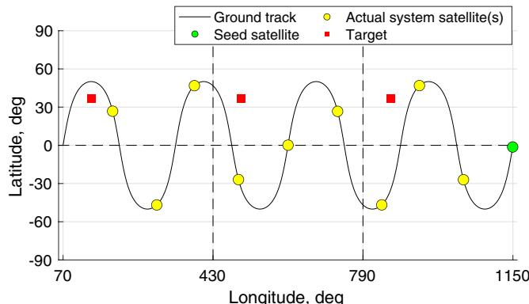  
Fig. 1 Illustration of a common ground-track constellation in an expanded ground-track view.

This paper uses the aforementioned three conditions of the original Flower Constellation set theory as a basis for constellation generations. Furthermore, we restrict satellite orbits to be either circular or critically inclined elliptic ( 63.4 or 116.6 deg). This is because, in engineering practice, non-critically inclined elliptic orbits are generally avoided for periodic coverage requirements due to heavy orbital maintenance costs incurred by negating the precession of the argument of perigee.

## IV. Circular Convolution Formulation

Building upon the satellite constellation model in the previous section, this section introduces the main ideas behind the methods developed in this paper, including the definitions and concepts of the access profile, coverage, and constellation pattern representation, as well as the mathematical representation of the circular convolution phenomenon.

The derivation of the circular convolution phenomenon uses time discretization. One underlying assumption is that, to satisfy the periodically time-varying coverage requirements, the repeat period of the RGTorbit can be chosen such that it is a rational multiple of the repeat period of the coverage requirement. This implies that we can discretize both of these repeat periods by a common time step length $t _ { \mathrm { s t e p } } .$ . The least common multiple of the numbers of time steps for these two repeat periods would be the number of time steps for the simulation time horizon length needed to evaluate the coverage. If Lthere are multiple target points with different repeat periods for their coverage requirements, assuming that their repeat periods can each be represented as an integer number of time steps with the common interval $t _ { \mathrm { s t e p } }$ , then we can use the least common multiple of these time steps as the repeat period of the “overall” coverage requirement. The circular convolution formulation and its associated properties are defined over this discretized -step simulation time horizon length.

LFor simplicity, in this paper, we consider the case in which the repeat period of RGT is an integer multiple of the repeat period of the coverage requirement; in this case, $T _ { \mathrm { s i m } } \bar { = } T _ { r } = L \bar { t _ { \mathrm { s t e p } } } ,$ where $T _ { \mathrm { s i m } }$ is T  Tthe length of the simulation time horizon and $T _ { r }$  Lt Tis the repeat period of Trthe orbit. This case can be easily generalized to the aforementioned more general case. Note that the uniformly continuous coverage case can be treated as a special case, where the repeat period of the orbit (and thus the simulation time horizon) can be arbitrarily chosen.

## A. Access Profile

The relative position vector ρ pointing from a ground target point to a satellite is defined as

$$
\rho = \boldsymbol {r} _ {s} - \boldsymbol {r} _ {g}\tag{8}
$$

where $r _ { s }$ is a satellite position vector from the center of Earth, and $r _ { g }$ s gis a target point position vector from the center of Earth. Figure 2 illustrates this relationship.

An elevation angle ε of a satellite seen from a ground target point is defined as

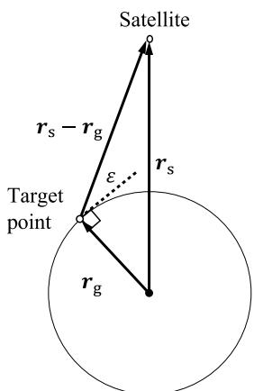  
Fig. 2 Satellite, target point, and elevation angle relationship.

$$
\varepsilon = \sin^ {- 1} \left(\frac {\boldsymbol {r} _ {g} \cdot \boldsymbol {\rho}}{\| \boldsymbol {r} _ {g} \| \| \boldsymbol {\rho} \|}\right) = \sin^ {- 1} (\hat {\boldsymbol {r}} _ {g} \cdot \hat {\boldsymbol {\rho}})\tag{9}
$$

where $\| \cdot \|$ is the Euclidean norm.

k kBecause the dot product between the unit target point position vector $\hat { r } _ { g }$ and the unit relative position vecto $\hat { \pmb \rho }$ continues to change gdue to the rotation of Earth and the motion of a satellite, the elevation angle is, therefore, a function of time, $\varepsilon = \varepsilon ( t )$ . An example of a  ttypical NGSO satellite elevation angle function is shown in the upper part of Fig. 3. When the elevation angle of a satellite is above the minimum elevation angle threshold $\varepsilon _ { \mathrm { { m i n } } } ,$ , which is determined by the mission requirement [5], the satellite is said to be visible from or to have access to the target point. Because the periods when the satellite has access to the ground target point are of particular interest, we convert the elevation angle function into an access profile (or a visibility profile in some literature), which is a binary vector that indicates either access, 1, or no access, 0, at each time instant. The access profile is visualized in the lower part of Fig. 3. This paper uses a sampling method to generate an access profile. Note that access profiles can be derived in different ways [31–33].

The continuous-time elevation angle function ε is sampled at every time step o $\dot { t } _ { \mathrm { s t e p } }$ tto create a discrete-time elevation angle function $\varepsilon [ n ]$ twith length . As mentioned earlier, is the number of time steps n Lof the simulation horizon, that is, $T _ { \mathrm { s i m } } = L t _ { \mathrm { s t e p } } ,$ where $T _ { \mathrm { s i m } }$ is the T  Lt Tsimulation time horizon (which is assumed to be equal to the RGT repeat period $T _ { r }$ in this paper for simplicity as discussed previously). TrThe access profile $\pmb { v } _ { k , j } \in \mathbb { Z } _ { 2 } ^ { L }$ between the th satellite and the th target k;jpoint stores Boolean information about the satellite access (or visibil ity) state at each discrete-time instant $n \in \{ 0 , \ldots , L - 1 \}$ . Therefore, each element of the access profile is

$$
v _ {k, j} [ n ] \triangleq \left\{ \begin{array}{l l} 1, & \text { if } \varepsilon_ {k, j} [ n ] \geq \varepsilon_ {k, j, \min} [ n ] \\ 0, & \text { otherwise } \end{array} \right.\tag{10}
$$

where is the discrete-time instant, and $\mathcal { I }$ is the set of target points. nThroughout this paper, vectors are represented in italic boldface (e.g., $\pmb { v } _ { k , j } )$ and their elements are represented in brackets $( \mathrm { e } . \mathrm { g } . , v _ { k , j } [ n ] )$ ). To make the notation consistent with the circular convolution method from the digital signal processing community, the vector index repre senting the discrete-time instant is set to take the range of $[ 0 , L - 1 ]$

n  ; L It is important to note a condition in Eq. (10): there must exist at least one access interval for a given satellite–target for the methods introduced in this paper to function; simply stated, the access profile shall be a nonzero vector. The methods introduced in the following sections are constructed based on the assumption that the access profile is a nonzero vector.

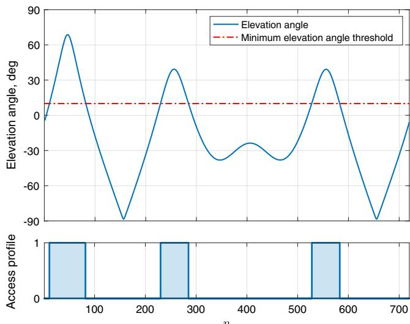  
Fig. 3 Sample illustration of a satellite s elevation angle viewed from a ground point and corresponding access profile.

One can interpret the generalized minimum elevation angle $\varepsilon _ { k , j , \mathrm { m i n } } [ n ]$ in Eq. (10) as the minimum elevation angle threshold imposed on an access between a satellite and a target point at k jdiscrete-time instant . This paper assumes that all satellites have a ncommon generalized minimum elevation angle:

$$
\varepsilon_ {k, j, \min} [ n ] = \varepsilon_ {j, \min} [ n ], \quad \forall k \in \{1, \dots , N \}\tag{11}
$$

When designing a satellite constellation for regional coverage, a constellation must be spatially and temporally referenced relative to the target point and the epoch. A hypothetical satellite that conveys referenced orbital information, $\mathbf { \Phi } ^ { \mathbf { q } } 0 = [ \tau , e , i , \omega , \Omega _ { 0 } , M _ { 0 } ] ^ { T }$ , for the   ; e; i; ; ; M constellation is defined as the seed satellite and the corresponding $\mathbf { 0 } \mathbf { e } _ { 0 }$ as the seed-satellite orbital elements vector. (The term seed satellite is credited to the software Systems Tool Kit [34]). The actua satellites inherit the common orbital characteristics defined in this seed-satellite elements vector, but they independently hold $( \Omega _ { k } , M _ { k } )$ k Mkpairs that are determined by Eq. (7), resulting in the orbital elements vector for each satellite of $\mathbf { \Phi } ^ { \bullet _ { k } = [ \tau , e , i , \omega , \Omega _ { k } , M _ { k } ] ^ { T } }$ , where is an k   ; e; i; ; k; Mk kindex of a satellite. (Ω and are initial values referenced to a given Mepoch; the subscripts refer to the index of a corresponding satellite.) Note that it is not required to have an actual satellite at the seed satellite position; the seed-satellite orbital elements are used as a reference to define the actual satellites in the system.

Let us recall the main assumptions considered thus far: 1) all satellites are placed on a common RGT constellation, as shown in Fig. 1; and 2) all access between a target point and every member jsatellite in a given constellation are constrained to the same minimum elevation angle threshold, as shown in Eq. (11). Such assumptions enable us to use a powerful property, a cyclic property, in which all access profiles of the member satellites in a given constellation are identical, but circularly shifted. Therefore, any access profile $\pmb { v } _ { k , j }$ between the th satellite and the th target point can be represented as k ja circularly shifted seed-satellite access profile $\pmb { v } _ { 0 , j } \colon$

$$
v _ {k, j} [ n ] = \pmb {P} _ {\pi} ^ {n _ {k}} v _ {0, j} [ n ]\tag{12}
$$

where $P _ { \pi }$ is a permutation matrix with the dimension $( L \times L )$ , as shown in Eq. (13), and $n _ { k }$ L Lis the index representing its (temporal) nklocation of the th satellite with respect to the seed satellite along the kcommon ground track:

$$
\boldsymbol {P} _ {\pi} = \left[ \begin{array}{c c c c c} 0 & 0 & 0 & \dots & 1 \\ 1 & 0 & 0 & \dots & 0 \\ 0 & 1 & 0 & \ddots & \vdots \\ \vdots & \vdots & \ddots & \ddots & 0 \\ 0 & 0 & \dots & 1 & 0 \end{array} \right]\tag{13}
$$

The formal definition and the physical interpretation of $n _ { k }$ are explained in Sec. IV.C.

## B. Coverage Timeline and Coverage Requirement

Because there are multiple satellites in the constellation system, the access profiles must be meshed together to create a coverage timeline over a target point. Hence, a coverage timeline $b _ { j } \in \mathbb { Z } _ { \geq 0 } ^ { L }$ is jan access profile between multiple satellites and the th target point; it jstores information about the number of satellites in view at each discrete-time instant . This is illustrated in Fig. 4. As before, $n _ { 1 }$ and $n _ { 2 }$ n nare the indices that represent the temporal locations of the first $( k = 1 )$ ) and second $( k = \hat { 2 } )$ satellites with respect to the seed satellite $( k = 0 )$ k , respectively. It is important to point out that because the seed k satellite is hypothetical, its access profile is not considered in the coverage timeline. Equation (14) provides a mathematical definition of the coverage timeline:

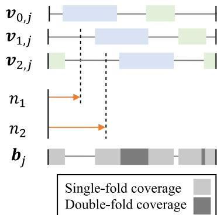  
Fig. 4 Illustration of shifts of access profiles (two-satellite system); notice that the seed-satellite access profile $( v _ { 0 , j } )$ is not part of the coverage timeline.

$$
b _ {j} [ n ] = \sum_ {k = 1} ^ {N} v _ {k, j} [ n ]\tag{14}
$$

Note that the coverage timeline is not a binary vector, but instead it is a nonnegative integer vector.

Next, we define the coverage requirement. A coverage require ment $f _ { j } \in \mathbb { Z } _ { \geq 0 } ^ { L }$ is a vector of nonnegative integers that is created by a juser per mission requirement. It is important to distinguish the differ ence between the coverage timeline $b _ { j }$ and the coverage requirement $f _ { j } .$ j. The coverage timeline is a coverage performance or a state of a constellation system, whereas the coverage requirement indicates what a constellation system shall achieve. For example, in order fo a constellation system to achieve -fold continuous coverage, the fcoverage timeline must be greater than or equal to the coverage requirement, that is, at least satellite(s) must have access to or be fvisible by the target point throughout the simulation time horizon. The coverage satisfactoriness indicator $c _ { j }$ indicates the coverage jrequirement satisfactoriness of the coverage timeline over a target point $j \colon$

$$
c _ {j} \triangleq \left\{ \begin{array}{l l} 1, & \text { if } b _ {j} [ n ] \geq f _ {j} [ n ], \quad \forall n \in \{0, \dots , L - 1 \} \\ 0, & \text { otherwise } \end{array} \right.\tag{15}
$$

If an area of interest consists of multiple target points (e.g., due to area grid discretization), then the coverage is satisfactory if all targe points are satisfactorily covered. Extending Eq. (15), the satisfactory condition of the coverage over all target points in a set $\mathcal { I }$ can be expressed as

$$
c _ {\mathcal {J}} \triangleq \left\{ \begin{array}{l l} 1, & \text { if } c _ {j} = 1, \\ 0, & \text { otherwise } \end{array} \right. \quad \forall j \in \mathcal {J}\tag{16}
$$

where $\mathcal { I }$ is a set of target points. Thus, designers of the constellation system must aim to satisfy all coverage requirements on every targe point as each target point may impose its own unique coverage requirement.

## C. Constellation Pattern Vector

We express the time shifts of satellites along the ground track with respect to the seed satellite in a discrete-time binary sequence x $\in \mathbb { Z } _ { 2 } ^ { L }$ and refer to it as the constellation pattern vector:

$$
x [ n ] \triangleq \left\{ \begin{array}{l l} 1, & \text { if } n = n _ {k} \\ 0, & \text { otherwise } \end{array} \right.\tag{17}
$$

The temporal location index $n _ { k }$ can be interpreted as the time-dela nkindex for the th satellite. This is because the th satellite that is k kdelayed behind the seed satellite by the time difference of $\Delta t _ { k } =$ $t _ { \mathrm { s t e p } } n _ { k }$ tk over the common ground track can be equivalently shown as a t nkunit impulse at time instant $n = n _ { k }$ on a constellation pattern vector x. n  nkThis is illustrated in Fig. 5. The left-hand side of the figure shows a snapshot of an arbitrary constellation system: a seed satellite depicted as the green circle and an arbitrary th satellite depicted as the yellow kcircle in an expanded ground-track view. The th satellite is posi-ktioned behind the seed satellite in a moving direction by the time unit of $\Delta t _ { k }$ . The direction of the motion of satellites is indicated by the tkarrow on the left-hand side of the figure. That is, the th satellite wil occupy the current position of the seed satellite $\Delta t _ { k }$ ktime units later $( \mathrm { i } . \mathrm { e } . , n _ { k }$ tktime steps later). The equivalent representation in the con-nkstellation pattern vector form is shown on the right-hand side of the figure. In this case, the position of the th satellite is represented as a kred impulse, which represents the time delay with respect to the seed satellite.

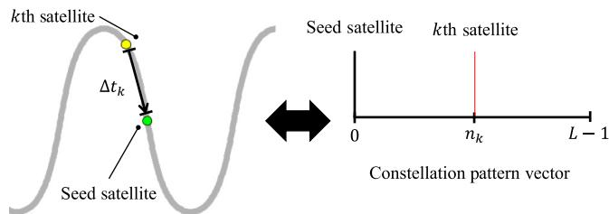  
Fig. 5 Illustration of a satellite time shift and its representation in the constellation pattern vector form.

From Eq. (17) and because is assumed to cover exactly one Lrepeat period of the RGT, we can deduce the total number of satellites in the constellation from the constellation pattern vector as

$$
N = \sum_ {n = 0} ^ {L - 1} x [ n ]\tag{18}
$$

## D. Circular Convolution Phenomenon

The discrete-time sequences, $\mathbf { \psi } _ { v _ { 0 , j } , \mathbf { \epsilon } } , \mathbf { \psi } _ { x , \mathbf { \epsilon } }$ and $\begin{array} { r } { \pmb { b } _ { j } , } \end{array}$ , defined in the pre-;j jvious sections, have a finite periodic length of due to the cyclic Lproperty of the closed relative ground-track assumption. Note that, as mentioned earlier, this length of the vectors is the total number of time steps for the simulation time horizon.

A discrete circular convolution operation between the seed satellite access profile $\pmb { v } _ { 0 , j }$ and the constellation pattern vector x ;jproduces a coverage timeline $\pmb { b } _ { j } \colon$

$$
\begin{array}{c} b _ {j} [ n ] = v _ {0, j} [ n ] \otimes x [ n ] = \sum_ {m = 0} ^ {L - 1} v _ {0, j} [ m ] x [ (n - m) \bmod L ] \\ = x [ n ] \otimes v _ {0, j} [ n ] = \sum_ {m = 0} ^ {L - 1} x [ m ] v _ {0, j} [ (n - m) \bmod L ] \end{array}\tag{19}
$$

where $\circledast$ represents a circular convolution operator. (Note that the circular convolution is commutative.) Or equivalently, this equation can be written as

$$
\boldsymbol {V} _ {0, j} \boldsymbol {x} = \boldsymbol {b} _ {j}\tag{20}
$$

where $V _ { 0 , j } \in \mathbb { Z } _ { 2 } ^ { L \times L }$ is a seed-satellite access profile circulant matrix ;jthat is fully specified by a seed-satellite access profile $\pmb { v } _ { 0 , j }$ . Note that a ;jcirculant matrix is a special form of a Toeplitz matrix [35]; each entr of the matrix [α β] is defined as

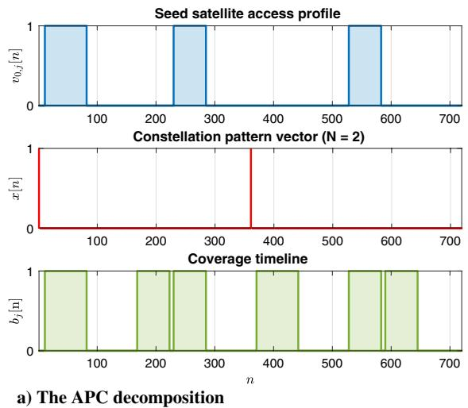

$$
V _ {0, j} [ \alpha , \beta ] = v _ {0, j} [ (\alpha - \beta) \bmod L ]\tag{21}
$$

where α and $\beta$ are the row and column indices, respectively, fo α $\beta \in \{ 0 , 1 , \cdots , L - 1 \}$ . More information about the circular con ; f ; ; ; L gvolution is referred to Ref. [36]. The derivation of the circula convolution relationship [Eq. (20)] from Eq. (14) is described in Appendix B.

To illustrate this relationship, consider a system with ${ \bf { 0 } } _ { 0 } =$ $[ 4 / 1 , 0 , 5 0 ^ { \circ } , 0 ^ { \circ } , 3 5 0 . 2 ^ { \circ } , 0 ^ { \circ } ] ^ { T }$ (J2000) and uniformly spaced $N = 2$  ; ; ; ; ;  N satellites. The corresponding seed-satellite access profile observed from a target $\mathcal { T } = \{ ( \phi = 3 6 . 7 ^ { \circ } \mathrm { N } ; \lambda = 1 3 7 . 4 8 ^ { \circ } \mathrm { E } ) \}$ (a point) with $\varepsilon _ { \operatorname* { m i n } } = 1 0$  f   gdeg is shown in the top part of Fig. 6a. In this example, the length of vectors is set to $L = 7 2 0$ such that the corresponding L time step is approximately 120 s. The constellation pattern vector, shown in the middle part of Fig. 6a, has two unit impulses a $n = 0$ n and 360 to represent the temporal locations of two satellites with n respect to the seed satellite. The equivalent orbital elements vectors for these satellites are (refer to Sec. V.D for the derivation)

$$
\begin{array}{l} \mathbf {e} _ {1} = [ 4 / 1, 0, 5 0 ^ {\circ}, 0 ^ {\circ}, 3 5 0. 2 ^ {\circ}, 0 ^ {\circ} ] ^ {T} \\ \mathbf {e} _ {2} = [ 4 / 1, 0, 5 0 ^ {\circ}, 0 ^ {\circ}, 1 7 0. 2 ^ {\circ}, 0 ^ {\circ} ] ^ {T} \end{array}
$$

In this case, the first satellite of the system is essentially identical to the seed satellite (i.e., a unit impulse at $n = 0 )$ . The circular con n volution between the seed-satellite access profile and the constella tion pattern vector yields the coverage timeline shown in the bottom part of Fig. 6a. A snapshot of the corresponding configuration in the Earth-centered inertial (ECI) and ECEF frame at $n = 0$ is shown in Fig. 6b.

This formulation exhibits the satellite constellation architecture by laying out the relationships between the common orbital character istics, the satellite constellation pattern, and the coverage perfor mance. We shall hereafter refer to this type of satellite constellation design decomposition into three vectors $\mathbf { \delta } _ { v _ { 0 , j } , \mathbf { \delta } } _ { x , \mathbf { \delta } }$ and $\pmb { b } _ { j }$ as the $A P C$ ;j jdecomposition, following the acronyms of the seed-satellite access profile, constellation pattern, and coverage timeline. Methods that are derived based on the APC decomposition are called the APC-based methods.

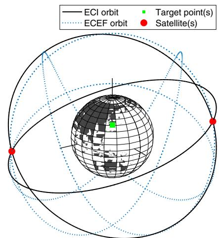  
b) The corresponding configuration in the ECI and ECEF frame at n = 0  
Fig. 6 APC decomposition and its equivalent constellation representation in 3-D space.

## V. Regional-Coverage Constellation Pattern Design Methods

## A. Problem Statement

Following the APC decomposition introduced herein, the satellite constellation design can be split into defining the reference seedsatellite orbital elements ${ \bf { 0 } } { \bf { 0 } } $ (which includes the common orbital characteristics) and defining the constellation pattern vector x. Conventional methods often make simple assumptions for x, such as a symmetric pattern (e.g., Walker constellations), and optimize ${ \bf { 0 } } ^ { } \mathrm { { 0 } } { \mathrm { { , } } }$ instead, this paper focuses on the optimization of the x itself without such simplifying assumptions. Mathematically, the goal of this paper was to solve for the optimal constellation pattern vector $x ^ { * }$ such that the coverage timeline ${ b } _ { j } ^ { * } = { v } _ { 0 , j } \circledast { x } ^ { * }$ is equal to or greater than the j ;jdesignated f coverage threshold. The objective function is the number of satellites required $N ,$ , which can be deduced from Eq. (18). The Nseed-satellite orbital elements ${ \bf { 0 } } { \bf { 0 } } $ are considered as a given input so that the developed constellation pattern design approach can be integrated with the existing established methods for determining $\mathbf { 0 } \mathbf { e } _ { 0 }$ (e.g., brute-force methods and genetic algorithms). Appendix C introduces an example approach to integrate the determination of the seed-satellite orbital elements ${ \bf { 0 } } { \bf { 0 } } _ { 0 }$ and the design of the satellite constellation pattern design x.

This section introduces two constellation pattern optimization meth ods based on the circular convolution formulation and APC decomposition. First, we derive a rather conventional iterative method using a common assumption of symmetry; this method is used as a baseline for later analysis. Next, we develop a novel and general method based on BILP to perform rigorous optimization of the constellation pattern.

## B. Baseline: Quasi-Symmetric Method

The baseline quasi-symmetric method aims to design the satellite constellation pattern with uniform temporal spacing between satel lites along the common closed trajectory in space. Given a length o Lthe constellation pattern vector, the uniform temporal spacing con stant $\eta \in \mathbb { R } _ { > 0 }$ between satellites is defined as

$$
\eta \triangleq \frac {L}{N}\tag{22}
$$

We first consider a special case, where η is an integer. In this case and assuming $n _ { 1 } = 0 ,$ , we can construct a symmetric constellation n pattern (i.e., a uniform distribution of satellites along the common ground track of the constellation system) using the following the constellation pattern vector form:

$$
\bar {x} [ n ] \triangleq \sum_ {k = 1} ^ {N} \delta [ n - \eta (k - 1) ]\tag{23}
$$

where

$$
\delta [ n ] = \left\{ \begin{array}{l l} 1, & \text { if } n = 0 \\ 0, & \text { otherwise } \end{array} \right.\tag{24}
$$

A user is allowed to arbitrarily set the temporal location of the first satellite $n _ { 1 } \left( 0 \leq n _ { 1 } < L \right)$ ). In this case, Eq. (23) requires a circula shift of - :

$$
x [ n ] = \bar {x} [ n ] \circledast \delta [ n - n _ {1} ]\tag{25}
$$

Next, we generalize this formulation into the case, where η is not an integer. In this case, we cannot achieve a strictly symmetric constellation pattern with the given discretization, but only a near-symmetric one; we call the latter a quasi-symmetric constellation pattern in this paper. For this generalization, the only change we need to make is to replace Eq. (23) by Eq. (26):

$$
\bar {x} [ n ] \triangleq \sum_ {k = 1} ^ {N} \delta [ \mathrm{nint} (n - \eta (k - 1)) ]\tag{26}
$$

where nint ⋅ is the nearest integer function, which is used to guar  antee the integer indexing of a vector.

Algorithm 1 is designed to perform an iterative search about and $n _ { 1 }$ Nuntil the coverage requirement is satisfied and outputs the optima

Algorithm 1: Quasi-symmetric method to compute $x^{*}, b_{j}^{*}, N$, and $n_{1}$ (point coverage)

1: procedure QUASI-SYMMETRIC METHOD ($v_{0,j}, f_{j}$)
2:    $N = 1$
3:    while True do
4:    if $N \leq L$ then
5:    Generate $\bar{x}[n]$ based on $\eta \triangleq L/N$ as outlined in Eq. (23)
6:    for $n_{1} = 0, \ldots, \text{nint}(\eta) - 1$ do
7:    Generate $x[n]$ based on $\bar{x}[n]$ and $n_{1}$ as outlined in Eq. (25)
8:    Compute $b_{j}[n] = v_{0,j}[n] \oplus x[n]$ via Eq. (19)
9:    if $c_{j} = 1$ as in Eq. (15) then
10:    Break the loops
11:    return $x^{*}, b_{j}^{*}, N$ [Eq. (18)], and $n_{1}$
12:    end if
13:    end for
14:    $N = N + 1$
15:    else
16:    return Infeasible
17:    end if
18:    end while
19: end procedure

constellation pattern vector $x ^ { * }$ given a set of $\pmb { v } _ { 0 , j }$ and $f _ { j } .$ The ;j jalgorithm consists of two nested iterative loops. The outer loop increments by one at each iteration, whereas the inner loop Nperforms an exhaustive search about $n _ { 1 }$ to find the -minimizing n Ntemporal location of the first satellite. [Note that the range for the inner loop is set to $0 \leq n _ { 1 } \leq \mathrm { n i n t } ( \eta ) - 1$ due to the (quasi-)symmetry n  of the resulting constellation pattern vector.] These loops break when the coverage requirement is satisfied, as shown in Algorithm 1. If no quasi-symmetric constellation is found until the outer loop for Nreaches the maximum number of satellites, which is equal to , the method would determine the problem to be infeasible.

For an area of interest consisting of multiple target points, a user may replace line 9 in Algorithm 1 with “if $c _ { \mathcal { I } } = 1$ as in Eq. (16) c then.” This guarantees the iterative search until all target points are satisfactorily covered. Similarly, one can come up with a custom termination criterion and/or figure of merit, such as time percent coverage or area percent coverage metrics. This is feasible because each iteration provides a full coverage state across all target points.

An overview of the quasi-symmetric method is shown in Fig. 7. The seed-satellite orbital elements vector, minimum elevation angle, reference epoch, and a set of target points are the user-defined parameters, which are determined based on mission requirements.

## C. New Method: BILP Method

This subsection introduces the new satellite constellation pattern method developed in this paper using BILP. The BILP method aims to optimize the constellation pattern in a more rigorous and genera way, without assuming symmetry and, if needed, concurrently con sidering multiple subconstellations. Recall Eq. (20):

$$
\boldsymbol {V} _ {0, j} \boldsymbol {x} = \boldsymbol {b} _ {j}\tag{27}
$$

where $V _ { 0 , j } \in \mathbb { Z } _ { 2 } ^ { L \times L }$ is a circulant matrix that is fully specified by the ;jseed-satellite access profile $\pmb { v } _ { 0 , j }$ as shown in Eq. (21). This definition of $V _ { 0 , j }$ ;jcan be expanded as Eq. (28):

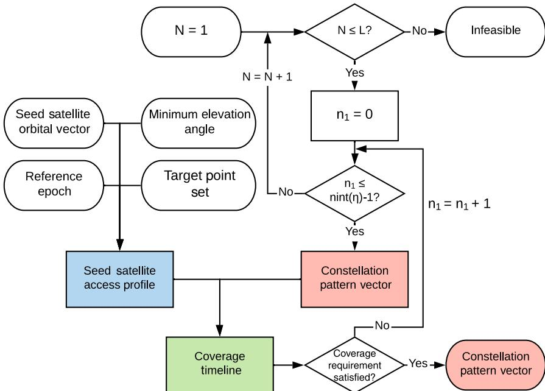  
Fig. 7 Overview of the quasi-symmetric method

$$
\boldsymbol {V} _ {0, j} = \left[ \begin{array}{c c c c c} v _ {0, j} [ 0 ] & v _ {0, j} [ L - 1 ] & v _ {0, j} [ L - 2 ] & \dots & v _ {0, j} [ 1 ] \\ v _ {0, j} [ 1 ] & v _ {0, j} [ 0 ] & v _ {0, j} [ L - 1 ] & \dots & v _ {0, j} [ 2 ] \\ v _ {0, j} [ 2 ] & v _ {0, j} [ 1 ] & v _ {0, j} [ 0 ] & & \vdots \\ \vdots & \vdots & \ddots & \ddots \\ v _ {0, j} [ L - 1 ] & v _ {0, j} [ L - 2 ] & \dots & & v _ {0, j} [ 0 ] \end{array} \right]\tag{28}
$$

Each column of a circulant matrix $V _ { 0 , j }$ is identical to a circularly shifted seed-satellite access profile $\pmb { v } _ { 0 , j }$ ;j. Equation (27) can be shown in a matrix form:

$$
\begin{array}{r l} & \left[ \begin{array}{c c c c c} v _ {0, j} [ 0 ] & v _ {0, j} [ L - 1 ] & v _ {0, j} [ L - 2 ] & \dots & v _ {0, j} [ 1 ] \\ v _ {0, j} [ 1 ] & v _ {0, j} [ 0 ] & v _ {0, j} [ L - 1 ] & \dots & v _ {0, j} [ 2 ] \\ \vdots & \vdots & \ddots & \ddots & \vdots \\ v _ {0, j} [ L - 1 ] & v _ {0, j} [ L - 2 ] & \dots & & v _ {0, j} [ 0 ] \end{array} \right] \left[ \begin{array}{c} x [ 0 ] \\ x [ 1 ] \\ \vdots \\ x [ L - 1 ] \end{array} \right] \\ & = \left[ \begin{array}{c} b _ {j} [ 0 ] \\ b _ {j} [ 1 ] \\ \vdots \\ b _ {j} [ L - 1 ] \end{array} \right] \end{array} \tag {29}
$$

An interesting observation can be formalized. If we are given $\pmb { v } _ { 0 , j }$ and x, then we can produce $\pmb { b } _ { j ^ { - } }$ ;j—this is the assumption of the quasi jsymmetric method at each iteration. Likewise, if $\pmb { v } _ { 0 , j }$ and $\pmb { b } _ { j }$ are given, ;j jthen we can analytically solve for x by solving the system of linear equations in Eq. (27) and obtain $\pmb { x } = V _ { 0 , j } ^ { - 1 } \pmb { b } _ { j } \left[ \operatorname* { d e t } ( V _ { 0 , j } ) \neq 0 \right]$ ]. Because $\pmb { b } _ { j }$ ;jrepresents the entire coverage timeline, this analysis enables us to jfind a constellation pattern vector x that satisfies a given coverage requirement $f _ { j } .$

jAlthough this approach provides us with a way to find the satellite constellation pattern, the resulting x is not necessarily a binary vector, which violates the nature of the constellation pattern vector. The existence of a satellite at a given instance cannot be represented in a decimal number, but only as either one or zero. Therefore, to guarantee a physical quantification of satellites, we shall employ the BILP to solve for $x ^ { * }$ , which satisfies the inequality constraint:

$$
\boldsymbol {V} _ {0, j} \boldsymbol {x} ^ {*} = \boldsymbol {b} _ {j} ^ {*} \geq \boldsymbol {f} _ {j}\tag{30}
$$

Before we formalize the BILP problem that solves Eq. (30), Secs. V.C.1 and V.C.2 introduce linear properties associated with Eq. (27).

## 1. Multiple Target Point

Because the system is linear, we can extend Eq. (27) to an area of interest that consists of multiple target points:

$$
\left[ \begin{array}{c} \boldsymbol {V} _ {0, 1} \\ \boldsymbol {V} _ {0, 2} \\ \vdots \\ \boldsymbol {V} _ {0, | \mathcal {I} |} \end{array} \right] \boldsymbol {x} = \left[ \begin{array}{c} \boldsymbol {b} _ {1} \\ \boldsymbol {b} _ {2} \\ \vdots \\ \boldsymbol {b} _ {| \mathcal {I} |} \end{array} \right]\tag{31}
$$

where $| \mathcal { I } |$ is the cardinality of a target point set $\mathcal { I } .$ . Equation (31) has j jthe dimension of $( | \mathcal { I } | L \times L ) \cdot ( L \times 1 ) ^ { \cdot } = ( | \mathcal { I } | L \times 1 ) ^ { \cdot }$

j jL L L   j jL The augmented circulant matrix on the left-hand side is a matrix of matrices obtained by appending all circulant matrices $V _ { \mathrm { 0 , 1 } } , . . . , V _ { \mathrm { 0 , | \mathcal { I } | } }$ ; ; ; ;jlinearly. Similarly, the augmented coverage timeline vector is also obtained by appending all coverage timeline vectors $\pmb { b } _ { 1 } , . . . , \pmb { b } _ { | \mathcal { I } | }$ lin-j jearly. Here, the constellation pattern vector x represents a single con stellation configuration that satisfies the augmented linear condition.

## 2. Multiple Subconstellations

Another direction of linearity regarding having multiple subcon stellations is observed. We consider a constellation system consisting of multiple subconstellations with different seed-satellite access profiles, $\mathbf { \Delta } _ { \theta _ { 0 , j } , \dots , \theta _ { 0 , j } ^ { ( z ) } , \dots , \mathbf { \delta } \theta _ { 0 , j } ^ { ( | \mathcal { Z } | ) } }$ , where the superscript in parentheses ;j; ; ;j; ; ;j zdenotes the index of a subconstellation, Z is a set of subconstella tions, and Z represents its cardinality. Each subconstellation seed satellite access profile ${ \pmb v } _ { 0 , i } ^ { ( z ) }$ is computed based on its seed-satellite orbital elements vector $\mathbf { q } _ { 0 } ^ { ( z ) }$ and the modified minimum elevation angle threshold $\varepsilon _ { j , \mathrm { m i n } } ^ { ( z ) } [ n ] , j \in \mathcal { I } , z \in \mathcal { Z } , n \in \{ 0 , \ldots , L - 1 \}$ , which is j; n; j ; z ; n f ; : : : ; L gonly applicable to the BILP method (because the quasi-symmetric method does not define multiple subconstellations). The goal of the multiple subconstellation system is to satisfy a common coverage requirement over a single target point . Thus, this can be incorpo jrated by replacing Eq. (27) by the following equation:

$$
\left[ \begin{array}{c c c c} \boldsymbol {V} _ {0, j} ^ {(1)} & \boldsymbol {V} _ {0, j} ^ {(2)} & \dots & \boldsymbol {V} _ {0, j} ^ {(| \mathcal {Z} |)} \end{array} \right] \left[ \begin{array}{c} \boldsymbol {x} ^ {(1)} \\ \boldsymbol {x} ^ {(2)} \\ \vdots \\ \boldsymbol {x} ^ {(| \mathcal {Z} |)} \end{array} \right] = \boldsymbol {b} _ {j}\tag{32}
$$

where the dimension of the system is $( L \times | \mathcal { Z } | L ) \cdot ( | \mathcal { Z } | L \times 1 ) =$ $( L \times 1 )$

To guarantee the validity of this approach, we assume a syn chronization condition among the subconstellations to guarantee synchronized repeatability of the resulting coverage timeline:

$$
T _ {r} ^ {(1)} = \ldots = T _ {r} ^ {(z)} \ldots = T _ {r} ^ {(| \mathcal {Z} |)}\tag{33}
$$

where $T _ { r } ^ { ( z ) } , z \in \mathcal { Z }$ is the period of repetition, which can be written as a Tr ;function of $a , e ,$ and $i ,$ and is therefore unique to each subconstella a e ition. Note that this does not mean that the individual orbital elements for each subconstellation need to be all identical; instead, it only means that the period of repetition, defined by Eq. (1), needs to be identical.

## 3. System of Multiple Subconstellations for Multiple Target Points

Combining both directions of linearity—multiple target points and multiple subconstellations—we get the following generalized gov erning relationship:

$$
\left[ \begin{array}{c c c c} \boldsymbol {V} _ {0, 1} ^ {(1)} & \boldsymbol {V} _ {0, 1} ^ {(2)} & \dots & \boldsymbol {V} _ {0, 1} ^ {(| \mathcal {Z} |)} \\ \boldsymbol {V} _ {0, 2} ^ {(1)} & \boldsymbol {V} _ {0, 2} ^ {(2)} & \dots & \boldsymbol {V} _ {0, 2} ^ {(| \mathcal {Z} |)} \\ \vdots & \vdots & \ddots & \vdots \\ \boldsymbol {V} _ {0, | \mathcal {I} |} ^ {(1)} & \boldsymbol {V} _ {0, | \mathcal {I} |} ^ {(2)} & \dots & \boldsymbol {V} _ {0, | \mathcal {I} |} ^ {(| \mathcal {Z} |)} \end{array} \right] \left[ \begin{array}{c} \boldsymbol {x} ^ {(1)} \\ \boldsymbol {x} ^ {(2)} \\ \vdots \\ \boldsymbol {x} ^ {(| \mathcal {Z} |)} \end{array} \right] = \left[ \begin{array}{c} \boldsymbol {b} _ {1} \\ \boldsymbol {b} _ {2} \\ \vdots \\ \boldsymbol {b} _ {| \mathcal {I} |} \end{array} \right]\tag{34}
$$

where the dimension of the system is $( | \mathcal { I } | L \times | \mathcal { Z } | L )$ $( | \mathcal { Z } | L \times 1 ) = ( | \mathcal { I } | L \times 1 )$

jL   j jL Equation (34) can be expressed in an indexed equation form:

$$
\sum_ {z = 1} ^ {| \mathcal {Z} |} V _ {0, j} ^ {(z)} \boldsymbol {x} ^ {(z)} = \boldsymbol {b} _ {j}, \forall j \in \mathcal {J}\tag{35}
$$

where the subscript is the target point index, and the superscript is jthe subconstellation index.

The physical interpretation of Eq. (34) is as follows: it represents a linear relationship between the physical configuration of a system of multiple subconstellations and the resulting coverage timelines over a set of multiple target points. Here, each subconstellation may exhibit its own unique orbital characteristics. For example, a subconstella tion $( z = 1 )$ may be placed on a critically inclined elliptic orbit, z whereas a subconstellation $( z = 2 )$ may be placed on a circular low z Earth orbit. Similarly, each target point may impose an independent coverage requirement. For example, a target point $( j = 1 )$ may j require continuous single-fold coverage, whereas a target point $( j = 2 )$ may require a sinusoidal-like time-varying coverage, fluctu-j ating between the double and triple folds. Revisiting the inequality constraint, as shown in Eq. (30), it is the goal of the BILP to determine the satellite constellation configurations $\pmb { x } ^ { ( 1 ) } , . . . , \pmb { x } ^ { ( z ) } , . . . , \pmb { x } ^ { ( | \mathcal { Z } | ) }$ that satisfy this complex relationship.

## 4. BILP Problem Formulation

Let us assume that we want to achieve an $f _ { j }$ -fold coverage system $( \forall j \in { \mathcal { I } } )$ with the given $\pmb { v } _ { 0 , j } ^ { ( 1 ) } , . . . , \pmb { v } _ { 0 , j } ^ { ( z ) } , . . . , \pmb { v } _ { 0 , j } ^ { ( | \mathcal { Z } | ) }$ vectors. The BILP ;j ;j ;jformulation is shown in Eq. (36). Solving the most general form of the problem, Eq. (35), via BILP yields an optimal solution in the form $\mathrm { o f ~ } ^ { 6 6 } \mathrm { a }$ system of multiple subconstellations that simultaneously satisfies the coverage requirements over multiple target points”:

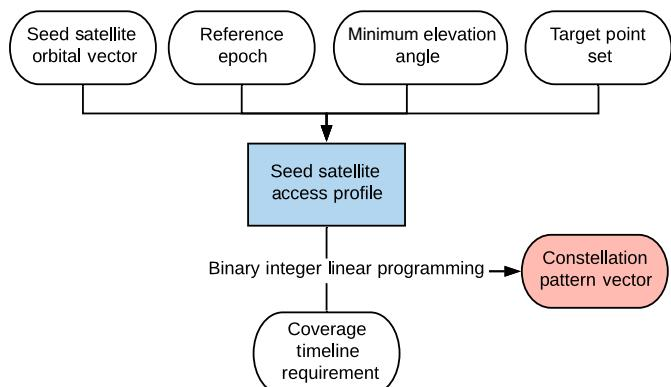  
Fig. 8 Overview of the BILP method.

$$
\begin{array}{l l} \underset {\boldsymbol {x}} {\text { minimize }} & \mathbf {1} ^ {T} \boldsymbol {x} \\ \text { subject   to } & \sum_ {z = 1} ^ {| \mathcal {Z} |} \boldsymbol {V} _ {0, j} ^ {(z)} \boldsymbol {x} ^ {(z)} \geq \boldsymbol {f} _ {j}, \quad \forall j \in \mathcal {J} \\ & \boldsymbol {x} \in \mathbb {Z} _ {2} ^ {L} \end{array}\tag{36}
$$

where the binary design variable constraint is imposed on the ele ments of the constellation pattern vector x to reflect the physica quantification of satellites. The solution to this BILP problem is the optimal constellation pattern vector $x ^ { * }$

An overview of the BILP method is shown in Fig. 8.

## D. Derivation of Ω and M from the Constellation Pattern Vector

Once the aforementioned methods obtain an optimal constellation pattern vector, it must be postprocessed to extract interpretable orbital information—a set of $( \Omega , M ) _ { k } ,$ , where is the index of a satellite.  ; Mk kEvery impulse on a constellation pattern vector corresponds to a poin in the (Ω, ) space. Given $n _ { k }$ found from the constellation pattern Mvector, one can find $( \Omega , M ) _ { k }$ nkset by solving the following system of equations:

$$
N _ {P} (\Omega_ {k} - \Omega_ {0}) + N _ {D} (M _ {k} - M _ {0}) = 0 \bmod (2 \pi)\tag{37a}
$$

$$
\Omega_ {k} = n _ {k} \frac {2 \pi N _ {D}}{L} + \Omega_ {0}\tag{37b}
$$

Note that Eq. (37a) is rearranged from Eq. (7) [30]. The derivation of Eq. (37b) is explained in Appendix D

## VI. Illustrative Examples

This section aims to demonstrate the general applicability of and the computational efficiency associated with the proposed methods under various mission profiles. Five illustrative examples are uniquely set up by varying orbital characteristics, area of interest properties, minimum elevation angle, and coverage requirements to illustrate the APC decomposition.

All illustrative examples are conducted on an Intel Core i9-9940X Processor at 3.30 GHz platform. For BILP problems, Gurobi 9.0.0 is used with the default termination setting [37]. The referenced ellipsoid model adopts the World Geodetic System 1984. It is assumed that all satellites point to their nadir directions. Furthermore, we assume the use of satellite maneuvers to correct and maintain an identical ground track throughout the satellite lifetime, negating the perturbation effects other than the $J _ { 2 }$ effect. Lastly, we make an Jassumption that the minimum elevation angle threshold is time invariant:

$$
\varepsilon_ {j, \min} [ n ] = \varepsilon_ {j, \min}, \quad \forall n \in \{0, \dots , L - 1 \}
$$

Table 1 is a list of parameters used for each example study. The five examples are chosen to test different capabilities of the methods:

Table 1 Example parameters

<table><tr><td>Example</td><td>Seed-satellite orbital elementsa,b</td><td>Minimum elevation angle, deg</td><td>Target point set</td><td>Coverage requirement</td><td>L</td></tr><tr><td>1</td><td>[12/1,0,102.9°,0°,98.3°,0°]T</td><td>5</td><td>{( $\phi = 34.75^\circ N; \lambda = 84.39^\circ W)$ }</td><td>1</td><td>720</td></tr><tr><td>2</td><td>[12/1,0,102.9°,0°,98.3°,0°]T</td><td>5</td><td>{( $\phi = 34.75^\circ N; \lambda = 84.39^\circ W)$ }</td><td>Time varying</td><td>720</td></tr><tr><td>3</td><td>[5/1,0.41,63.435°,90°,0°,0°]T</td><td>30</td><td>{Antarctica}</td><td>1</td><td>718</td></tr><tr><td>4</td><td>[83/6,0,99.2°,0°,0°,0°]T</td><td>20</td><td> $\mathcal{J}_1 = \{Amazon River basin\},$  $\mathcal{J}_2 = \{Nile River basin\}$ </td><td>Time varying and spatially varying</td><td>4200</td></tr><tr><td rowspan="2">5</td><td> $\boldsymbol{\alpha}_{0}^{(1)} = [81,0,70^\circ,0^\circ,0^\circ,0^\circ]^T$ </td><td> $\varepsilon_{1,\min} = 15$ </td><td>{( $\phi = 64.14^\circ N; \lambda = 21.94^\circ W)$ )</td><td>1</td><td>717</td></tr><tr><td> $\boldsymbol{\alpha}_{0}^{(2)} = [61,0,47.915^\circ,0^\circ,0^\circ,0^\circ]^T$ </td><td> $\varepsilon_{2,\min} = 10$ </td><td> $(\phi = 19.07^\circ N; \lambda = 72.87^\circ E)$ }</td><td></td><td></td></tr></table>

aThe seed-satellite orbital elements vector œ takes the form of τ ω $\Omega _ { 0 } , M _ { 0 } ] ^ { T }$ bAll orbital elements are in J2000.

example 1 for single-fold continuous coverage over a single target point, example 2 for time-varying coverage over a single target point, example 3 for single-fold continuous coverage over multiple target points, example 4 for time-varying and spatially varying coverage over multiple target points, and example 5 for multiple subconstellations over multiple target points. All examples uniquely illustrate a variety of orbits (circular vs critically inclined elliptic, prograde vs retrograde, and low vs high altitudes) and a variety of areas of interest (a single target point vs multiple target points and contiguous vs discontiguous). Both the baseline quasi-symmetric method and the BILP method are applied to all examples, with an exception of the quasi-symmetric method for example 5 due to its incapability of handling multiple subconstellations. In this section, the subscripts qs and bilp denote variables associated with the quasi-symmetric and BILP methods, respectively. The rest of this section discusses the details of each illustrative case.

## A. Example 1: Single-Fold Continuous Coverage over a Single Target Point

A target point is located at $\{ ( \phi = 3 4 . 7 5 ^ { \circ } \mathrm { N } ; \lambda = 8 4 . 3 9 ^ { \circ } \mathrm { W } ) \}$ and requires $\varepsilon _ { \operatorname* { m i n } } = 5$ f  deg. A seed-satellite orbital elements vector ${ \bf { 0 } } _ { 0 } =$ $[ 1 \bar { 2 } / 1 , 0 , 1 0 2 . 9 ^ { \circ } , 0 ^ { \circ } , 9 8 . 3 ^ { \circ } , 0 ^ { \circ } ] ^ { T }$ is assumed. The period of repetition  ; ; ; ; ; is 86,400 s. The length of vectors is selected, $L = 7 2 0$ , such that the L time step is 120 s. The objective is to find the optimal constellation pattern vector x that satisfies a single-fold continuous coverage requirement $( f = 1 )$

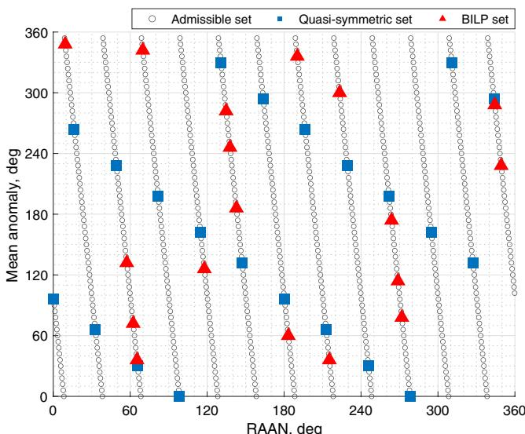  
Fig. 9 Example 1: admissible set, quasi-symmetric set, and BILP set in the (Ω, M) space.

The APC decomposition figures are shown in Fig. 10. One can observe that the single-fold continuous coverage requirement is

The results are obtained as follows:

$$
\begin{array}{l} x _ {\mathrm{qs}} ^ {*} [ n ] = \left\{ \begin{array}{l l} 1, & \text { for } n = 0, 3 3, 6 5, 9 8, 1 3 1, 1 6 4, 1 9 6, 2 2 9, 2 6 2, 2 9 5, 3 2 7, 3 6 0, 3 9 3, 4 2 5, 4 5 8, 4 9 1, 5 2 4, \ldots \\ 0, & \text { otherwise } \end{array} \right. \\ x _ {\mathrm{bilp}} ^ {*} [ n ] = \left\{ \begin{array}{l l} 1, & \text { for } n = 3 9, 7 3, 7 9, 8 9, 1 7 0, 1 8 4, 2 3 4, 2 5 0, 3 3 1, 3 4 1, 3 4 7, 4 9 2, 5 0 2, 5 4 2, 6 3 8, 6 4 8, 6 5 4, 6 6 3 \\ 0, & \text { otherwise } \end{array} \right. \end{array}
$$

where the total number of satellites obtained for each method is $N _ { \mathrm { q s } } = 2 2$ and $N _ { \mathrm { b i l p } } = 1 8$ , with the computational time 0.1 s for the N  N quasi-symmetric method and 5937.6 s for the BILP method. The results indicate that, although the computational cost for the BILP method is longer, it can explore a substantially larger design space and achieve a fewer-satellite configuration than the quasi-symmetric method by breaking the symmetry.

Figure 9 illustrates the (Ω, ) space and where each of the quasi-Msymmetric and BILP solution constellations lies. In this example, $L = 7 2 0 $ ; therefore, there are $L = 7 2 0$ number of admissible points L  L in the (Ω, ) space into which a satellite can be placed. Analyzing the Mpatterns in Fig. 9, the quasi-symmetric set depicts a lattice-like symmetry in the (Ω, ) space, whereas the BILP set exhibits asym Mmetry in the (Ω, ) space.

satisfied everywhere. Again, the asymmetry in the constellation pattern vector from the BILP method is contrasted with the symmetry in that from the quasi-symmetric method. Note that the coverage timeline for the quasi-symmetric constellation may not be strictly symmetric as η is not an integer in this case.

A snapshot of the corresponding constellation configurations at $n = 0$ is shown in Fig. 11. This figure visually shows that the BILP n method is taking advantage of the asymmetry to achieve a smaller number of satellites.

## B. Example 2: Time-Varying Coverage over a Single Target Point

In this example, we execute a single variation to example 1 such that the coverage requirement is now periodically time varying with the rest of the parameters being identical $( \mathrm { e } . \mathrm { g } . , L = 7 2 0 )$ . The objective is to

$$
x _ {\mathrm{qs}} ^ {*} [ n ] = \left\{ \begin{array}{l l} 1, & \text { for } n = \\ 0, & \text { otherwise} \end{array} \right. \begin{array}{l} 0, 2 2, 4 4, 6 5, 8 7, 1 0 9, 1 3 1, 1 5 3, 1 7 5, 1 9 6, 2 1 8, 2 4 0, 2 6 2, 2 8 4, 3 0 5, 3 2 7, 3 4 9, \ldots \\ 3 7 1, 3 9 3, 4 1 5, 4 3 6, 4 5 8, 4 8 0, 5 0 2, 5 2 4, 5 4 5, 5 6 7, 5 8 9, 6 1 1, 6 3 3,   6 5 5, 6 7 6, 6 9 8 \end{array}
$$

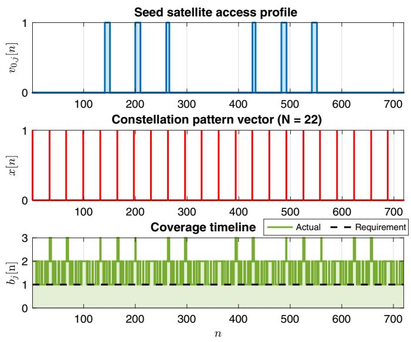  
a) Quasi-symmetric method

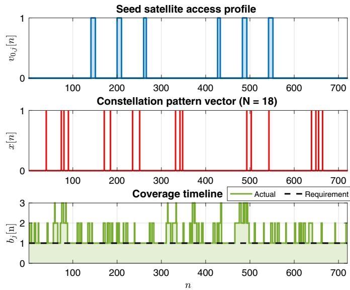  
b) BILP method  
Fig. 10 Example 1: the APC decomposition.

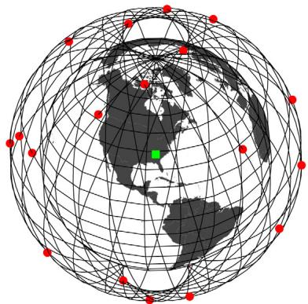  
a) Quasi-symmetric 22-satellite constellation

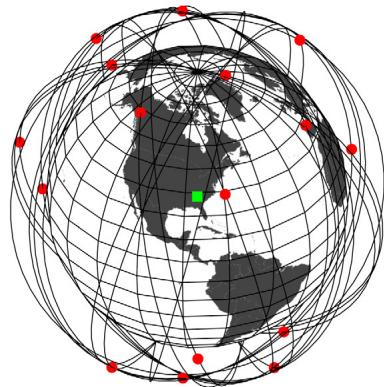  
b) BILP 18-satellite constellation  
Fig. 11 Example 1: 3-D view of generated constellations at n 0 (ECI frame)

find the optimal constellation pattern vector $x ^ { * }$ that satisfies a special ized threshold function, namely, a square-wave function:

$$
f [ n ] = \left\{ \begin{array}{l l} 2, & \text { for } 2 4 0 \leq n \leq 4 8 0 \\ 1, & \text { otherwise } \end{array} \right.
$$

A coverage requirement is now time dependent; the value of the square-wave function varies between values 1 and 2. This requires that some parts of the simulation period must be continuously covered by at least two satellites (double-fold) and by at least one satellite (singlefold) during the other part of the simulation period. This case is an abstract illustration of general time-varying constellation applications. For example, a communication satellite constellation may require two satellites during the day for doubled capacity and one satellite during the night for a quiescent mode.

where the total number of satellites obtained for each method is $N _ { \mathrm { q s } } = 3 3$ and $N _ { \mathrm { b i l p } } = 2 4$ , and the computational time is 0.1 s fo N  N the quasi-symmetric method and 3712.0 s for the BILP method. Like in example 1, although the BILP method takes longer computationa time, it can achieve a constellation pattern solution that requires a significantly smaller number of satellites than the baseline quasi symmetric method. The distribution of satellites in the (Ω, ) space is shown in Fig. 12.

The results are obtained as follows:

As shown in Fig. 13, the BILP constellation produces a coverage timeline that closely follows the time-varying coverage requirement. Such a coverage timeline is possible because the BILP constellation is not subject to symmetry in the satellite distribution. This is not the case for the quasi-symmetric method due to its (quasi-)symmetrical satellite distribution, which resulted in a conservative solution that provides a double-fold coverage over the entire period, even when it is not needed. This leads to the superior solution from the BILP method compared with

$$
x _ {\text { bilp }} ^ {*} [ n ] = \left\{ \begin{array}{l l} 1, & \text { for   } n = \begin{array}{l} 5, 2 3, 3 9, 7 5, 8 9, 1 1 4, 1 2 4, 1 3 0, 1 6 4, 2 1 5, 2 3 0, 2 5 5, 2 6 5, 4 8 3, 4 9 3, 5 1 8, 5 3 3, \dots \\ 5 8 4, 6 1 8, 6 2 4, 6 3 4, 6 5 9, 6 7 3, 7 0 9 \end{array} \\ 0, & \text { otherwise } \end{array} \right.
$$

Seed satellite access profile

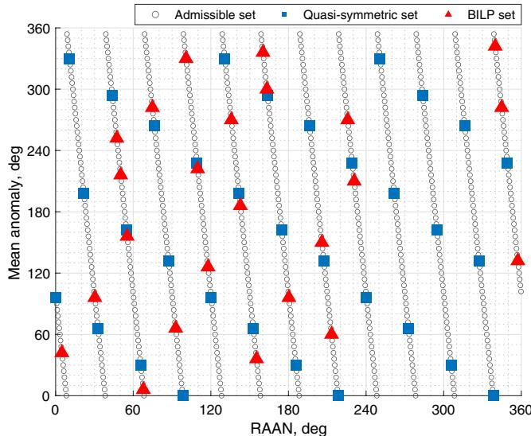  
Fig. 12 Example 2: admissible set, quasi-symmetric set, and BILP set in the (Ω, M) space.

the baseline quasi-symmetric method. As observed in example 1, the BILP method already reduces the number of satellites required compared to that of the quasi-symmetric method given the single-fold coverage requirement. Changing only the coverage requirement to be time varying, we further observe the additional reduction of the number of satellites for the BILP method. A snapshot of the corresponding constellation configurations at $n = 0$ is shown in Fig. 14.

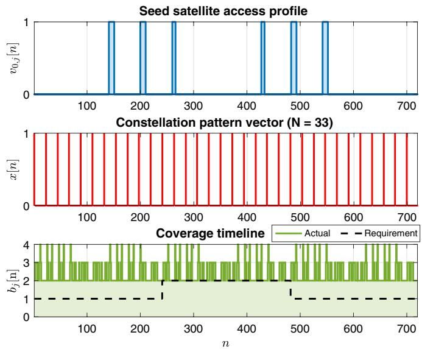  
a) Quasi-symmetric method

## C. Example 3: Single-Fold Continuous Coverage over Multiple Target Points

For this example, we consider a target area, Antarctica, which calls for continuous and reliable telecommunication systems to support existing and planned scientific expeditions [38]. The area is discretized into a set of 94 target points following the $3 ^ { \circ }$ by 3° resolution (latitude by longitude). See Fig. 15; the shapefile is obtained from Ref. [39]. All target points set $\varepsilon _ { \operatorname* { m i n } } = 3 0$ deg. A seed-satellite orbital element vector $\bullet _ { 0 } = [ 5 / 1 , 0 . 4 1 , 6 3 . 4 3 5 ^ { \circ } , 9 0 ^ { \circ } , 0 ^ { \circ } , 0 ^ { \circ } ] ^ { T }$ (critically inclined elliptic   ; ; ; ; ; orbit with the apogee over the Southern Hemisphere) is assumed. The period of repetition is $8 6 { , } 0 7 6 \ \mathrm { s } .$ . The length of vectors is selected, $L = 7 1 8 ,$ , such that the time step is approximately $t _ { \mathrm { s t e p } } \approx 1 2 0 ~ \mathrm { s } .$ . The objective of this example is to design a satellite constellation configu ration that achieves single-fold continuous coverage $( f = 1 )$ over all target points.

Note that this continuous polar coverage is a typical example that is often handled with a symmetric constellation, and thus we would expect that the quasi-symmetric method would perform well

The results are obtained as follows:

$$
\begin{array}{l} x _ {\mathrm{qs}} ^ {*} [ n ] = \left\{ \begin{array}{l l} 1, & \text { for } n = 0, 1 2 0, 2 3 9, 3 5 9, 4 7 9, 5 9 8 \\ 0, & \text { otherwise } \end{array} \right. \\ x _ {\mathrm{bilp}} ^ {*} [ n ] = \left\{ \begin{array}{l l} 1, & \text { for } n = 9 6, 3 1 0, 3 5 8, 5 6 2, 6 1 2 \\ 0, & \text { otherwise } \end{array} \right. \end{array}
$$

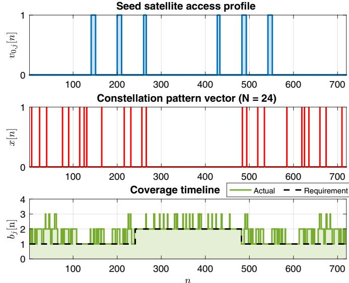  
b) BILP method

Fig. 13 Example 2: the APC decomposition.  
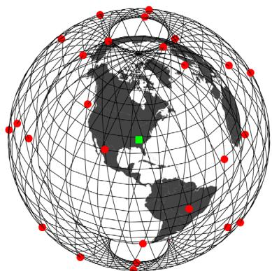  
a) Quasi-symmetric 33-satellite constellation

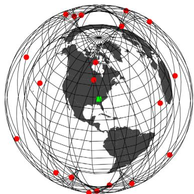  
b) BILP 24-satellite constellation  
Fig. 14 Example 2: 3-D view of generated constellations at n 0 (ECI frame)

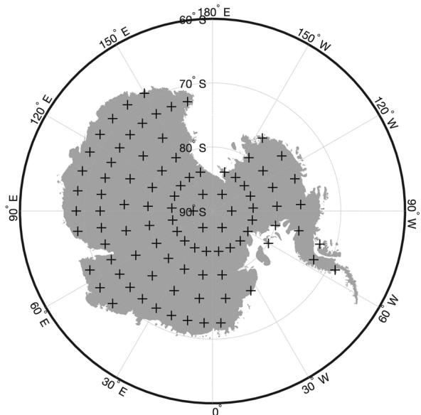  
Fig. 15 Example 3: Antarctica target points (3° by 3° resolution).

where the total number of satellites obtained for each method is $N _ { \mathrm { q s } } = 6$ and $N _ { \mathrm { b i l p } } = 5$ , and the computational cost was 10.7 s for N  N the quasi-symmetric method and 748.4 s for the BILP method. It is worth mentioning that, even for this polar-coverage example for which we would typically just use a symmetric constellation pattern (i.e., using the baseline method), the BILP method still achieves an asymmetric constellation pattern with fewer satellites. A snapshot of the obtained constellations is indicated in Fig. 16.

## D. Example 4: Time-Varying and Spatially Varying Coverage over Multiple Target Points

In this example, we design a satellite constellation system that performs remote sensing tasks over two areas of interest: the Amazon and Nile River basins. These areas represent two of the major river basins in the world, thereby making them desirable locations for monitoring forests, logging, and soil and water managements [40,41], and thus are of great interest to the international community. Each area of interest is discretized into a set of target points following the $3 ^ { \circ }$ by $3 ^ { \circ }$ resolution (latitude by longitude). The Amazon River basin target point set $\mathcal { I } _ { 1 }$ is composed of 56 target points and the Nile River basin target point set $\mathcal { I } _ { 2 }$ is composed of 30 target points. The target points are shown in Fig. 17, the polygon shape files are retrieved from the data set provided by the World Bank [42].

Each target point set is assumed to require different revisit time requirements: the Amazon basin has a revisit time requirement of every 12 h, starting 6 h after the epoch, whereas the Nile basin has a revisit time requirement of every 6 h, starting at the epoch. We assume that all target points within the same set require simultaneous access to the system satellites at given revisit time requirements. Note that these requirements are not just constraining the revisit time interval, but the exact time step for revisit; this is referred to as the strict revisit time requirement here. Furthermore, all target points are assumed to require the minimum elevation angle threshold of 20 deg, which corresponds to the hypothetical sensor’s field of view of approxi mately 110 deg at a given altitude of satellites. The length of vectors is chosen, $L = \bar { 4 } 2 0 0 \stackrel { \cdot } { ( } t _ { \mathrm { s t e p } } \approx 1 2 3 . 4 \mathrm { ~ s ) }$ , such that we can represent the L  tcomplex coverage requirements in an integer-indexed symmetrica form. Note that this coverage requirement is both time varying (i.e., periodic) and spatially varying (i.e., different requirements for Ama zon and Nile River basin target points):

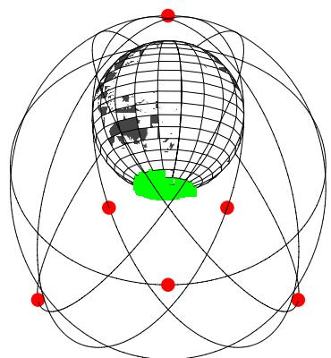  
a) Quasi-symmetric 6-satellite constellation

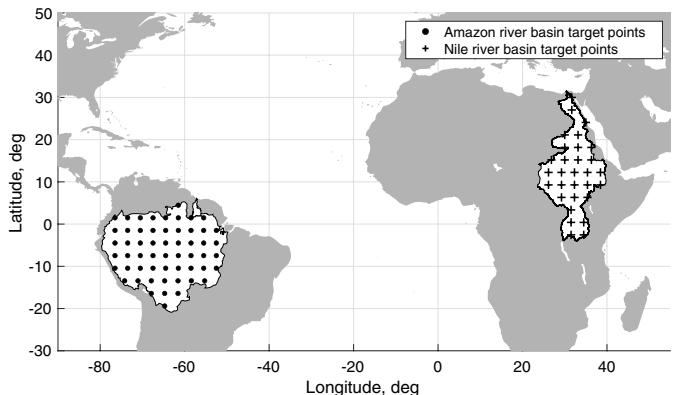  
Fig. 17 Example 4: Amazon and Nile River basin target points (3° by 3° resolution).

$$
\begin{array}{l} f _ {j} [ n ] = \left\{ \begin{array}{l l} 1, & \text { for } n = 1 7 5, 5 2 5, 8 7 5,..., 4 0 2 5 \\ 0, & \text { otherwise } \end{array} \right. \quad \forall j \in \mathcal {J} _ {1} \\ f _ {j} [ n ] = \left\{ \begin{array}{l l} 1, & \text { for } n = 0, 1 7 5, 3 5 0, 5 2 5, 7 0 0, 8 7 5,..., 4 0 2 5 \\ 0, & \text { otherwise } \end{array} \right. \quad \forall j \in \mathcal {J} _ {2} \end{array}
$$

A single-subconstellation system is assumed with the corresponding seed-satellite orbital elements vector: $\bullet _ { 0 } = [ 8 3 / 6 , 0 , 9 9 . 2 ^ { \circ } , 0 ^ { \circ }$ $0 ^ { \circ } , 0 ^ { \circ } ] ^ { T }$   ; ; ; ;. This orbit corresponds to an altitude of 946.7 km. The period ; of repetition of this orbit is $T _ { r } = 5 . 1 8 4 e 0 5 :$ s, which is 6 days. The system must satisfy:

$$
\left[ \begin{array}{c} \boldsymbol {V} _ {0, 1} \\ \boldsymbol {V} _ {0, 2} \\ \vdots \\ \boldsymbol {V} _ {0, 8 6} \end{array} \right] \boldsymbol {x} \geq \left[ \begin{array}{c} \boldsymbol {f} _ {1} \\ \boldsymbol {f} _ {2} \\ \vdots \\ \boldsymbol {f} _ {8 6} \end{array} \right]
$$

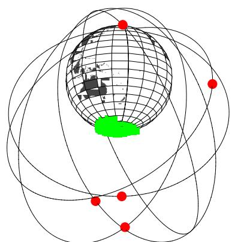  
b) BILP 5-satellite constellation  
Fig. 16 Example 3: 3-D view of generated constellations at n 0 (ECI frame).

where the dimension of this inequality is 361 200 × 4200 $( 4 2 0 0 \times 1 ) \geq ( 3 6 1 , 2 0 0 \times 1 )$

  ; The results show that the quasi-symmetric constellation is composed of 96 satellites, whereas the BILP constellation is composed of 29 satellites. Comparing the computational cost, the quasi-symmetric method took 486.7 s, whereas the BILP method took only 7.7 s. This shows a significant improvement of the BILP method in terms of both the number of satellites and the computational time with respect to the quasi symmetric constellation. The quasi-symmetric method is performing poorly because we need a large number of satellites if the symmetric pattern is used. This factor, together with the large numbers of target points and time steps, makes the iterative process in the quasi-symmetric method inefficient. The BILP method, instead, identifies the asymmetric optimal solution with a significantly smaller number of satellites. The low computational cost for the BILP method is due to the BILP solver Gurobi in our case; the problem structure allows Gurobi to perform an efficient presolve procedure, resulting in a short optimization time.

Figures 18 and 19 show the select snapshots of both the quasi symmetric constellation and the BILP constellation in chronological order over the Amazon and Nile River basins, respectively. (Because of the large number of satellites, the resulting constellation pattern vector is omitted.) As expected, both constellations provide simultaneous access to the target points when needed $( n = 1 7 5$ for Amazon River n basin; 0 175 for the Nile River basin), satisfying the strict revisit n  ;time requirements. It can be seen that, although the quasi-symmetric method satisfies the coverage requirements with a (quasi-)symmetric constellation pattern, the BILP method takes advantage of the asym metry and satisfies the same requirements with fewer satellites.

## E. Example 5: A System of Multiple Subconstellations over Multiple Target Points

We consider a most general case that only the BILP method can solve: a system of multiple subconstellations over multiple target points. In this example, two target points are considered in the target point set $\mathcal { I } = \{ ( \phi = 6 4 . 1 4 ^ { \circ } \mathrm { N } ; \lambda = 2 1 . 9 4 ^ { \circ } \mathrm { W } ) , ( \phi = 1 9 . 0 7 ^ { \circ } \mathrm { N } ; \lambda =$ $7 2 . 8 7 ^ { \circ } \mathrm { E } ) \}$ : Reykjavík, Iceland $( j = 1 )$ and Mumbai, Indi $( j = 2 )$ g j The minimum elevation angle for each target point i $\varepsilon _ { 1 , \mathrm { m i n } } =$ 15 deg and $\varepsilon _ { 2 , \mathrm { m i n } } = 1 0$ ; deg. The objective is to achieve single-fold ;continuous coverage over all target points $( \pmb { f } _ { j } = \mathbf { 1 } , \forall j \in \mathcal { T } )$

Two subconstellations are considered: $\boldsymbol { \mathbf { \Phi } } ^ { ( 1 ) } = [ 8 / 1 , 0 , 7 0 ^ { \circ } , 0 ^ { \circ } , 0 ^ { \circ }$ $0 ^ { \circ } ] ^ { T }$ (an altitude of 4149.2 km) and $\bullet _ { 0 } ^ { ( 2 ) } = [ 6 / 1 , 0 , 4 7 . 9 1 5 ^ { \circ } , 0 ^ { \circ } , 0 ^ { \circ }$ $0 ^ { \circ } ] ^ { T }$ (an altitude of 6380.3 km). The length of vectors is selected, $L = 7 1 7$ , such that the time step is approximately $t _ { \mathrm { s t e p } } \approx 1 2 0 ~ \mathrm { s } .$ . The periods of repetition for these subconstellations are identical, $T _ { r } ^ { ( 1 ) } = T _ { r } ^ { ( 2 ) }$ ≈ 86 024 s, hence making two subconstellations syn T  T ;chronous. Note that, even though we are using two subconstellations for disconnected regions of interest, the subconstellations are not defined one per region of interest; instead, they are used together to satisfy both demands in an optimal way. The goal of the BILP method is to optimize $\mathbf { x } ^ { ( 1 ) }$ and $\boldsymbol { x } ^ { ( 2 ) }$ concurrently such that the system satisfies the augmented linear condition:

$$
\begin{array}{c} \left[ \begin{array}{c c} \boldsymbol {V} _ {0, 1} ^ {(1)} & \boldsymbol {V} _ {0, 1} ^ {(2)} \\ \boldsymbol {V} _ {0, 2} ^ {(1)} & \boldsymbol {V} _ {0, 2} ^ {(2)} \end{array} \right] \left[ \begin{array}{c} \boldsymbol {x} ^ {(1)} \\ \boldsymbol {x} ^ {(2)} \end{array} \right] \geq \left[ \begin{array}{c} \boldsymbol {f} _ {1} \\ \boldsymbol {f} _ {2} \end{array} \right] \Leftrightarrow \left\{\boldsymbol {V} _ {0, 1} ^ {(1)} \boldsymbol {x} ^ {(1)} + \boldsymbol {V} _ {0, 1} ^ {(2)} \boldsymbol {x} ^ {(2)} \geq \boldsymbol {f} _ {1}, \boldsymbol {V} _ {0, 2} ^ {(1)} \boldsymbol {x} ^ {(1)} \right. \\ + \left. \boldsymbol {V} _ {0, 2} ^ {(2)} \boldsymbol {x} ^ {(2)} \geq \boldsymbol {f} _ {2} \right\} \end{array}
$$

The following optimal constellation pattern vectors are obtained:

$$
\begin{array}{l} x ^ {(1) *} [ n ] = \left\{ \begin{array}{l l} 1, & \text { for } n = 6 5, 1 4 4, 2 8 5, 3 6 1 \\ 0, & \text { otherwise } \end{array} \right. \\ x ^ {(2) *} [ n ] = \left\{ \begin{array}{l l} 1, & \text { for } n = 2 0 8, 4 2 8, 5 2 3, 6 0 8, 6 3 4, 7 0 2 \\ 0, & \text { otherwise } \end{array} \right. \end{array}
$$

a) Quasi-symmetric: =n 0  
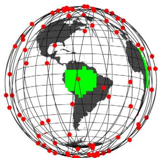

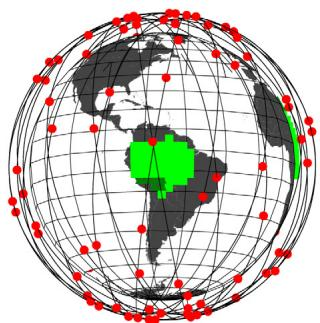  
nb) Quasi-symmetric: = 88 freq: [88] = 0; result cov: 89 %

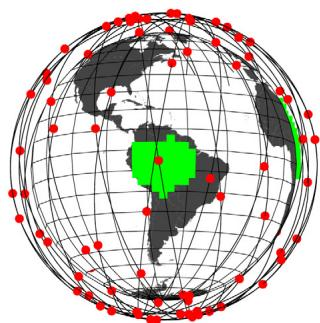  
nc) Quasi-symmetric: = 175 freq: [175] = 1; result cov: 100 %

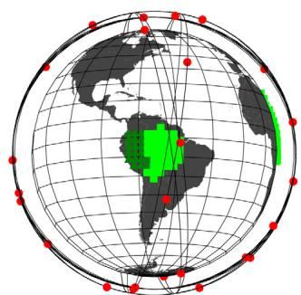  
d) BILP: =n 0

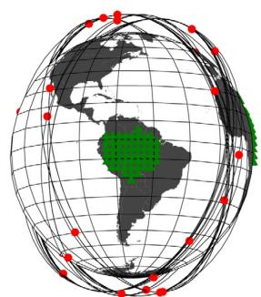  
ne) BILP: = 88

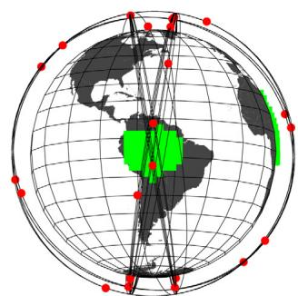  
req: [f 0] = 0; result cov: 66 %  
nf) BILP: = 175  
freq: [88] = 0; result cov: 0 %  
freq: [175] = 1; result cov: 100 %  
Fig. 18 Example 4: coverage over the Amazon River basin; select snapshots are shown at n 0, 88, 175 (ECI frame); a–c) snapshots of the quasi-symmetric constellation; d–f) snapshots of the BILP constellation; at each n, targets that have satellite visibility are shown in light green squares and targets that do not have satellite visibility are shown in dark green triangles; “req” indicates the coverage requirement, and “result cov” is the actual coverage performance of the solution; for example, when the requiremen $f [ n ] = 1 { \mathrm { , } }$ , the coverage has to be 100% (i.e., at least one satellite is visible from all target points in the area).

Seed satellite access profile

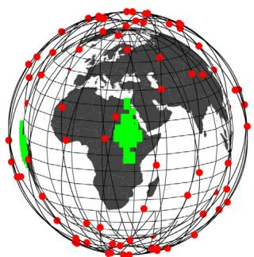  
a) Quasi-symmetric: =n 0 req: [f 0] = 1; result cov: 100 %

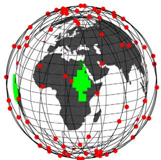  
n b) Quasi-symmetric: = 88 freq: [88] = 0; result cov: 93%

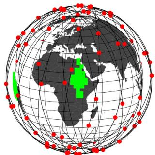  
n c) Quasi-symmetric: = 175 freq: [175] = 1; result cov: 100 %

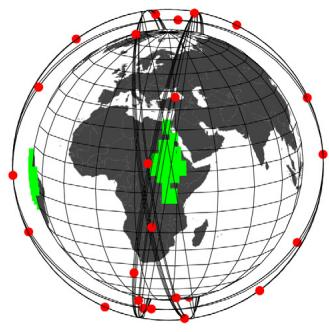  
d) BILP: = n 0  
req: [f 0] = 1; result cov: 100%

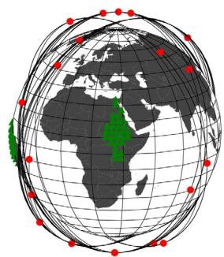  
n e) BILP: = 88  
freq: [88] = 0; result cov: 0 %

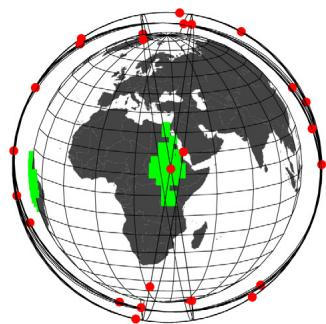  
nf) BILP: = 175  
freq: [175] = 1; result cov: 100 %  
Fig. 19 Example 4: coverage over the Nile River basin; select snapshots are shown at n 0, 88, 175 (ECI frame); a c) snapshots of the quasi-symmetric constellation; d f) snapshots of the BILP constellation; at each n, targets that have satellite visibility are shown in light green squares and targets that do no have satellite visibility are shown in dark green triangles; req indicates the coverage requirement, and result cov is the actual coverage performance of the solution; for example, when the requirement $f [ n ] = 1 ;$ , the coverage has to be 100% (i.e., at least one satellite is visible from all target points in the area).

The number of satellites is four for the first subconstellation and six for the second; 10 in total. The computational time was 5298.7 s.

Figure 20 illustrates the benefit of the BILP method. Individually, $z = 1$ subconstellation provides 53.7 and 37.1% coverage over $j = 1$ z and $j = 2$ , respectively, and $z = 2$ j subconstellation provides 65.0 j and 87.0% coverage over $j = 1$ and $j = 2 ,$ , respectively. No individ j  j ual subconstellation alone provides complete continuous coverage over any target point. The BILP method concurrently optimizes $\mathbf { x } ^ { ( 1 ) }$ and $\mathbf { \boldsymbol { x } } ^ { ( 2 ) }$ such that the continuous coverage over the whole target set J is achieved while minimizing the total number of satellites from two subconstellations. Note that the constellation pattern vectors, $x ^ { ( 1 ) * }$ and $\pmb { x } ^ { ( 2 ) * }$ , are identical in both subfigures of Fig. 20.

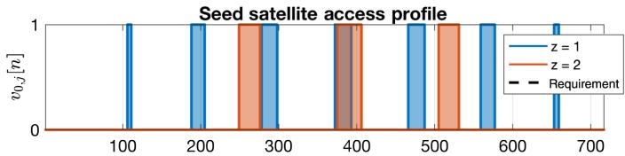

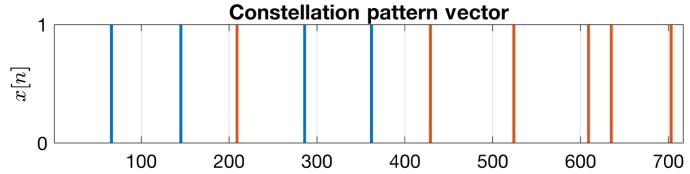

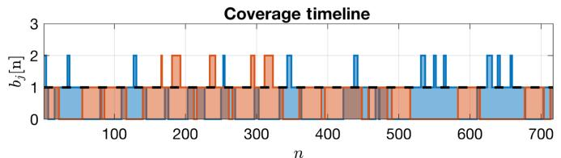  
a) Individual contribution over Revkiavík, Iceland

The optimized two-subconstellation system is shown in Fig. 21. The subconstellation $( z = 1 )$ colored in blue (lower altitude) is z composed of four satellites, whereas the subconstellation $( z = 2 )$ z colored in red (higher altitude) is composed of six satellites for a tota of 10 satellites.

Finally, to show the effectiveness of having the subconstellations, corner cases are evaluated considering each individual subconstella tion separately. The results indicate that, under the same setting, using only subconstellation 1 results in 11 satellites, and using only sub constellation 2 also results in 11 satellites. This particular case demonstrates that through the use of multiple subconstellations, one can reduce the minimum satellites required from 11 to 10 by enlarging the design space. Also, it is worth mentioning that the BILP method can still lead to an optimal solution even for the cases where only part of the subconstellation sets is used in the optimal pattern.

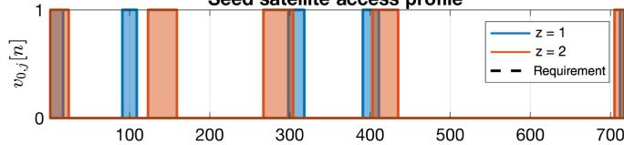

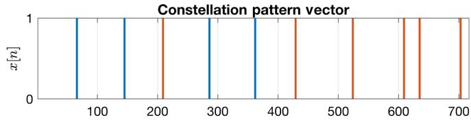

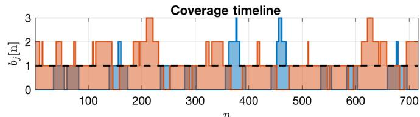  
b) Individual contribution over Mumbai, India  
Fig. 20 Example 5: the APC decomposition.

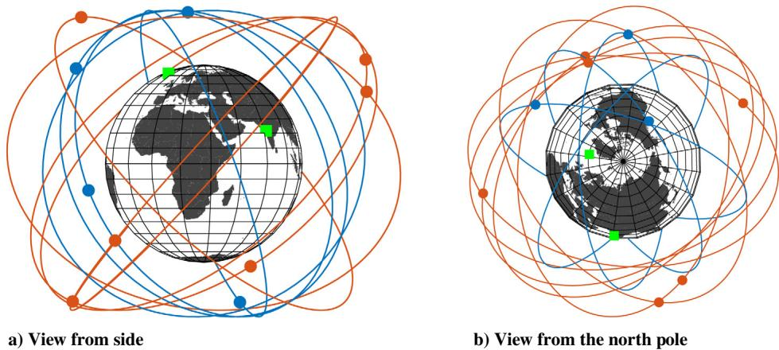  
Fig. 21 Example 5: 3-D view of generated constellation at n  0 (ECI frame).

## VII. Conclusions

A semi-analytical approach to optimally design a regional-coverage satellite constellation pattern is proposed. By treating the seed-satellite access profile and the constellation pattern vector as discrete-time signals, a circular convolution between them creates the coverage timeline. This formulation is referred to as the APC decom position of the satellite constellation system. This formulation is used to derive a set of satellite constellation pattern design methods that take a seed-satellite access profile and a coverage requirement as their inputs, and output the minimum number of satellites required to satisfy the coverage requirement. Two satellite constellation pattern design methods are introduced: the baseline quasi-symmetric method and the more general BILP method. The baseline quasi-symmetric method enforces the conventional assumption of symmetry in the constellation pattern and solves for the minimum number of satellites required in the system by incrementally increasing until the cover-Nage requirement is satisfied. In contrast, the new and more general BILP method solves for constellation pattern vector x, where and Ntheir temporal locations can be deduced by solving a BILP problem. The analysis in this study shows that, although the quasi-symmetric method can be efficient when the coverage requirements can be satisfied with a small number of satellites in a symmetric pattern (e.g., continuous polar coverage), the BILP method always outputs optimal satellite constellation patterns that the baseline method may miss. Furthermore, the BILP method is applicable to the problems that the quasi-symmetric method cannot solve (e.g., the case with multiple subconstellations).

The ideas here respond to the several design features that can reinforce the utility of regional constellations: multiple target points, complex time-varying and spatially varying requirements, and multi ple subconstellations. The developed circular convolution formulation allows linearity in both the multiple target points direction and multiple subconstellations direction via matrix augmentation. A user can design 1) a single constellation system that simultaneously satisfies the complex coverage requirement of area targets composed of multiple target points, 2) a system of multiple subconstellations that satisfies the complex coverage requirement of a single target point, or 3) a combination of both. These design features are demonstrated via a series of illustrative examples in Sec. VI. The resulting general constellation pattern design approach can be integrated with existing orbital characteristics design methods and launch/mission constraints to help future satellite constellation designers rigorously achieve optimal constellation designs.

Despite the demonstrated effectiveness of the proposed approach, there are some possible directions for future work to improve it further. The first potential direction is related to the computational time. Because of the nature of the discretization, obtaining a high-fidelity solution computed with fine time discretization would require a large sized problem and thus a long computational time. To make the method computationally more scalable, approximation algorithms or heuristic methods can be developed to retrieve feasible, yet potentially subopti mal, solutions in a relatively short amount of time. Furthermore, the proposed method only considers the $J _ { 2 }$ effect as the disturbance and Jassumes that the spacecraft has the maneuvering capability to cancel out other disturbances. This assumption is reasonable for the proposed method to be used for a high-level constellation pattern design purpose, but it can be improved for higher-fidelity modeling. Finally, this constellation pattern design method requires the seed-satellite orbital elements as its input. Although Appendix C shows one example process of integrating the proposed approach into the constellation design practice, further investigation can be performed to ensure an efficient and effective integration.

## Appendix A: Expanded Ground-Track View

The expanded ground-track view spatially expands an ordinar ground track of a satellite and visualizes its ground track relative to the area of interest throughout the simulation period $T _ { \mathrm { s i m } } .$ . The area of Tinterest and its mirrored images are positioned throughout the plot (the red squares in Fig. A1) to provide spatial references. The expanded ground-track view is especially useful when visualizing and correlating the access profile and the actual satellite ground track.

The following properties of the expanded ground-track view are formalized for the RGT with the period ratio of $\tau = N _ { P } / N _ { D } \mathrm { : }$

 NP ND1) The magnitude of the longitudinal angular displacement of the expanded ground track is $3 6 0 | \bar { N } _ { P } - N _ { D } |$ degrees for prograde orbits or $3 6 0 ( N _ { P } + N _ { D } )$ jNP NDjdegrees for retrograde orbits. Here, the longi NP  NDtudinal angular displacement of the expanded ground track is defined as the total angular displacement required to repeat the ground track, measured along the axis of longitude in the direction of the satellite’s motion.

2) The mirrored images of the area of interest are separated b 360 deg.

## Appendix B: Derivation of the Coverage Timeline

To prove the circular convolution phenomenon, show that Eq. (14) is identical to Eq. (20). Begin by expanding Eq. (14), which is the summation of all access profiles:

$$
b _ {j} [ n ] = v _ {1, j} [ n ] + v _ {2, j} [ n ] + \dots + v _ {N, j} [ n ]\tag{B1}
$$

Each term in Eq. (B1) can be represented as a multiple of $v _ { 0 , j } [ n ]$ and permutation matrix $P _ { \pi } ^ { n _ { k } }$ v ;jnk due to the cyclic property of the assumed formulation. Recalling the definition from Eq. (12):

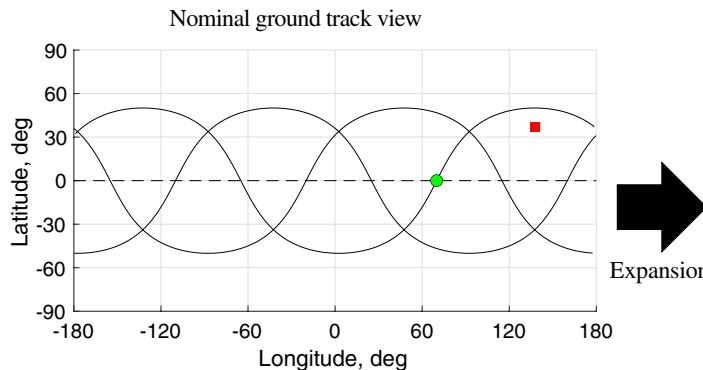

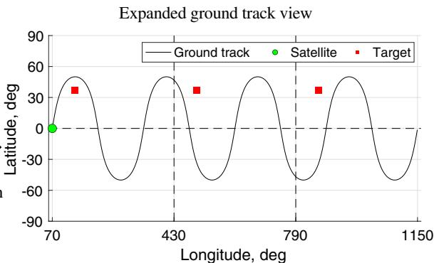  
Fig. A1 Full expansion of a ground track of $\mathrm { { \Phi } } \mathbf { { e } } _ { 0 } = 4 / 1 , 0 , 5 0 ^ { \circ } , 0 ^ { \circ } , 3 5 0 . 2 ^ { \circ } , 0 ^ { \circ }$ (J2000).

$$
v _ {k, j} [ n ] = P _ {\pi} ^ {n _ {k}} v _ {0, j} [ n ]
$$

where $P _ { \pi }$ is a permutation matrix with the dimension $( L \times L )$ shown as follows. Note that $\pmb { I } = \pmb { P } _ { \pi } ^ { 0 } = \pmb { P } _ { \pi } ^ { L }$ a4

$$
\boldsymbol {P} _ {\pi} = \left[ \begin{array}{c c c c c} 0 & 0 & 0 & \dots & 1 \\ 1 & 0 & 0 & \dots & 0 \\ 0 & 1 & 0 & \ddots & \vdots \\ \vdots & \vdots & \ddots & \ddots & 0 \\ 0 & 0 & \dots & 1 & 0 \end{array} \right]\tag{B2}
$$

Substituting Eq. (12) into Eq. (B1), we get the following equation:

$$
b _ {j} [ n ] = \left(\boldsymbol {P} _ {\pi} ^ {n _ {1}} + \boldsymbol {P} _ {\pi} ^ {n _ {2}} + \dots + \boldsymbol {P} _ {\pi} ^ {n _ {N}}\right) v _ {0, j} [ n ]\tag{B3}
$$

Equation (B3) is a superposition of cyclically shifted access pro files referenced to a seed-satellite access profile. Here, $n _ { k }$ denotes the nkindex of the relative time shift of the th access profile with respect to kthe seed-satellite access profile. Instead of only indicating the indices where only access profiles exist, one can generalize this to all time steps $\mathbf { \chi } _ { ! } \in \{ 0 , \dots , L - 1 \}$ following the definition of the constellation n f ; : : : ; L gpattern vector in Eq. (17). Hence, Eq. (B3) can be further deduced as

$$
b _ {j} [ n ] = (x [ 0 ] \pmb {P} _ {\pi} ^ {0} + x [ 1 ] \pmb {P} _ {\pi} ^ {1} + \dots + x [ L - 1 ] \pmb {P} _ {\pi} ^ {L - 1}) v _ {0, j} [ n ]\tag{B4}
$$

The terms within parentheses in Eq. (B4) are identical to the alternative analytical definition of the circulant matrix:

$$
\boldsymbol {X} \triangleq x [ 0 ] \boldsymbol {I} + x [ 1 ] \boldsymbol {P} _ {\pi} ^ {1} + \dots + x [ L - 1 ] \boldsymbol {P} _ {\pi} ^ {L - 1}\tag{B5}
$$

Finally, substituting Eq. (B5) into Eq. (B4), we get

$$
\boldsymbol {b} _ {j} = \boldsymbol {X} \boldsymbol {v} _ {0, j}\tag{B6}
$$

Using the commutative property of the circular convolution oper ator, Eq. (B6) becomes

$$
\boldsymbol {b} _ {j} = V _ {0, j} \boldsymbol {x}\tag{B7}
$$

where

$$
V _ {0, j} [ \alpha , \beta ] = v _ {0, j} [ (\alpha - \beta) \mathrm{mod} L ]
$$

as defined in Eq. (21).

This is identical to the definition of the circular convolution in Eq. (20), thereby proving the circular convolutional nature of the formulation under the aforementioned assumptions.

## Appendix C: Integrating the Developed Method into Constellation Design Process

This appendix introduces an example approach to integrate the developed method into the satellite constellation design process. As discussed earlier, the developed satellite constellation pattern design method needs the seed-satellite orbital elements as its input. In this appendix, we introduce an approach to efficiently integrate the determination of the seed-satellite orbital elements $\mathbf { 0 } \mathbf { e } _ { 0 }$ and the deter mination of the constellation pattern x (i.e., the developed method).

First, note that although ${ \bf { 0 } } { \bf { 0 } } $ contains six orbital elements $( \tau , e , i , \omega , \Omega _ { 0 } , M _ { 0 } )$ , we only have five degrees of freedom. The initial ; e; i; ; ; Mmean anomaly of the seed satellite $M _ { 0 }$ can be set to zero without loss of generality. This is because, as shown in Eq. $( 3 7 ) , \Omega _ { 0 }$ and $n _ { k }$ can be chosen such that any solution with an arbitrarily chosen $M _ { 0 }$ k can be converted into an equivalent solution with $M _ { 0 } = 0$ M deg. (Strictly M speaking, there are only a finite number of possible discrete values fo $M _ { 0 }$ due to the discretization used in this problem.)

The design space of the remaining five orbital elements can be narrowed down even further by considering the launch and mission requirements. As an example, we consider the case used in example 2 in Sec. VI and provide a walk-through process.

1) Suppose there is demand for increased communications capacity (i.e., increased satellite diversity) during a particular time interval of a day that repeats daily (e.g., Internet rush hour) over Atlanta, Georgia $( \{ ( \phi = \mathrm { \bar { 3 } 4 . 7 5 ^ { \circ } N } ; \mathrm { \bar { \lambda } } = \mathrm { \bar { 8 } 4 . 3 9 ~ \mathrm { ^ { \circ } W } } ) \} $ ). Translating this demand, f   gthe time-varying coverage requirement f is derived (see example 2). The communications quality-of-service requirement further enforces consistency in data round-trip latency throughout the mission dura tion; hence, a circular orbit is desired. The period ratio and the minimum elevation angle are assumed to be derived a priori based on mission-related requirements: $\tau = 1 2 / 1$ and $\varepsilon _ { \operatorname* { m i n } } = 5$ deg.

 2) Based on the set of mission requirements and parameters $( T _ { r } = 8 6 , 4 0 0 \ s , e = 0 ,$ , and $\tau = 1 2 / 1 )$ ), the inclination of the orbi Tr  ; e  is readily derived, which is approximately 102.9 deg. Note tha because the repeat period $T _ { r }$ is exactly given together with τ and , Tr ethere is no degree of freedom for trading off the altitude and the inclination. In this case, because the repeat period is exactly 86,400 s, the orbit needs to be a repeating sun-synchronous orbit.

3) At this point, the only leftover variable is $\Omega _ { 0 } ,$ , which dictates the shift of the common ground track along the longitudinal direction. The right ascension of the ascending node (RAAN) of the seed satellite $\Omega _ { 0 }$ can be determined either by an analytical heuristic method or by a numerical optimization.

a) An analytical heuristic approach can determine $\Omega _ { 0 }$ such that the common ground track is symmetric about the longitude of the target point (see Fig. C1). Solving for the corresponding RAAN value yields $\Omega _ { 0 } = 9 8 . 3$ deg. Note that another symmetry exists further offsetting $\Omega _ { 0 }$ value.

b) A single-variable optimization can be performed to determine the value of $\Omega _ { 0 } .$ . Ideally, we prefer to use the number of satellites as the metric, but this cannot be evaluated without x. Instead, an effective metric can be the coverage over the area of interest. Note that the values of $\mathbf { \dot { a } } _ { 0 }$ maximizing the coverage does not necessarily lead to a minimum number of satellites, but as shown later, it is a good approximation to use.

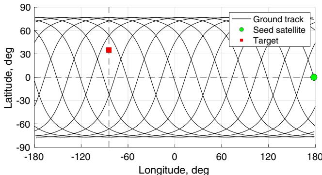  
Fig. C1 Alignment of the ground track such that it is symmetric about the longitude of the target.

Table C1 Comparison of different methods for integrated optimization

<table><tr><td>Method</td><td>Number of satellites</td><td>Computational time, s</td></tr><tr><td rowspan="2">1</td><td>24</td><td>3712.0</td></tr><tr><td>25</td><td>Stage 1: 477.1</td></tr><tr><td rowspan="2">2</td><td></td><td>Stage 2: 2,086.0</td></tr><tr><td>75</td><td>2,482.1 (Population: 100)</td></tr><tr><td rowspan="2">3</td><td>36</td><td>5,854.7 (Population: 200)</td></tr><tr><td>32</td><td>10,635.1 (Population: 300)</td></tr></table>

4) Using the obtained seed-satellite orbital elements, the optimization of the constellation pattern vector can be performed following the APC-based methods developed in this paper.

As we evaluate the efficiency of the developed integrated heuristic and binary integer linear programming (BILP) methods, we compare them against a more straightforward approach, where both ${ \bf { 0 } } { \bf { 0 } } $ and x are optimized as variables simultaneously against the objective func tion of the number of satellites. In fact, this formulation is the most direct representation of our goal; however, because it is a mixed integer nonlinear optimization problem, we cannot leverage the developed method in this paper, and therefore can only use generic inefficient solvers (e.g., genetic algorithm). Here, we aim to show that, by incorporating the developed method into this process, we can achieve a much better performance than this classical integrated method.

In Table C1, method 1 refers to the heuristic approach that finds $\Omega _ { 0 }$ using symmetry, which is the actual method used in example 2. Method 2 refers to the two-stage optimization, where the first stage is the metaheuristic optimization of $\Omega _ { 0 }$ and the second stage is the BILP optimization of x. Lastly, method 3 is the simultaneous opti mization of both $\Omega _ { 0 }$ and x via metaheuristic optimization. For methods 2 and 3, a genetic algorithm by MATLAB is used with the default settings.

The results show that both methods 1 and 2 are effective in finding the optimal solution; the only difference in these two methods is in the optimization of $\Omega _ { 0 } .$ . On the other hand, method 3 requires longer computational time, while only showing poor results. These results demonstrate the utility of the developed method when integrated into the satellite constellation design process.

## Appendix D: Derivation of the RAAN Phasing

This appendix derives

$$
\Omega_ {k} = n _ {k} \frac {2 \pi N _ {D}}{L} + \Omega_ {0}
$$

in Eq. (37b). Define $\Delta \Omega = ( \Omega _ { k } - \Omega _ { 0 } ) / n _ { k }$ . Our goal is to prove $\Delta \Omega = 2 \pi N _ { D } / L$

 ND LThis expression comes from Fig. 5. To achieve a constellation that separates away from each other by $t _ { \mathrm { s t e p } }$ over a common ground track, tneeds to be defined as the difference between Earth’s rotation and the angular displacement due to the RAAN precession during a time interval $[ 0 , t _ { \mathrm { s t e p } } ]$ . More specificall

$$
\Delta \Omega = (\omega_ {\oplus} - \dot {\Omega}) t _ {\mathrm{step}}\tag{D1}
$$

Since $t _ { \mathrm { s t e p } } = T _ { r } / L$ , substituting in Eq. (1) yields $t _ { \mathrm { s t e p } } = N _ { D } T _ { G } / L$ t  Tr LPlugging this into Eq. (D1), we get

$$
\Delta \Omega = (\omega_ {\oplus} - \dot {\Omega}) \frac {N _ {D} T _ {G}}{L}\tag{D2}
$$

Since $T _ { G } = 2 \pi / ( \omega _ { \oplus } - \dot { \Omega } )$ [Eq. (2b)], we get

$$
\Delta \Omega = \frac {2 \pi N _ {D}}{L}\tag{D3}
$$

## Acknowledgments

This research is supported by the Advanced Technology R&D Center at Mitsubishi Electric Corporation. The first author would like to acknowledge additional support from the National Science Foun dation. This material is based upon work supported by the National Science Foundation Graduate Research Fellowship Program under grant number DGE–1650044. Any opinions, findings, and conclu sions or recommendations expressed in this material are those of the author(s) and do not necessarily reflect the views of the Nationa Science Foundation. The authors would like to thank Onall Gunasekara, Hao Chen, and Robert Griffin for their editorial review and thoughtful suggestions for improvement.

## References

[1] Anon., “Indian Regional Navigation Satellite System (IRNSS),” https:/ www.isro.gov.in/irnss-programme [retrieved 15 Jan. 2019].

[2] Anon., “Quasi-Zenith Satellite System (QZSS),” http://qzss.go.jp/en [retrieved 15 Jan. 2019].

[3] Diekelman, D., “Design Guidelines for Post-2000 Constellations,” Mis sion Design & Implementation of Satellite Constellations, Springer, Dordrecht, The, Netherlands, 1998, pp. 11–21

[4] Lee, H. W., Jakob, P. C., Ho, K., Shimizu, S., and Yoshikawa, S., “Optimization of Satellite Constellation Deployment Strategy Consid ering Uncertain Areas of Interest,” Acta Astronautica, Vol. 153, Dec. 2018, pp. 213–228.

https://doi.org/10.1016/j.actaastro.2018.03.054

[5] Lutz, E., Werner, M., and Jahn, A., Satellite Systems for Personal and Broadband Communications, Springer–Verlag, Berlin, 2012. https://doi.org/10.1007/978-3-642-59727-5

[6] Walker, J. G., “Circular Orbit Patterns Providing Continuous Whole Earth Coverage,” Royal Aircraft Establishment TR 70211, Farnborough, England, U.K., 1970.

[7] Walker, J. G., “Continuous Whole-Earth Coverage by Circular-Orbit Satellite Patterns,” Royal Aircraft Establishment TR 77044, Farnbor ough, England, U.K., 1977.

[8] Walker, J. G., “Satellite Constellations,” Journal of the British Inter planetary Society, Vol. 37, Dec. 1984, pp. 559–572.

[9] Luders, R. D., “Satellite Networks for Continuous Zonal Coverage,” ARS Journal, Vol. 31, No. 2, 1961, pp. 179–184. https://doi.org/10.2514/8.5422

[10] Lüders, R., and Ginsberg, L., “Continuous Zonal Coverage—A Gener alized Analysis,” Mechanics and Control of Flight Conference, AIAA Paper 1974-842, Aug. 1974.

https://doi.org/10.2514/6.1974-842

[11] Beste, D. C., “Design of Satellite Constellations for Optimal Continuou Coverage,” IEEE Transactions on Aerospace and Electronic Systems, Vol. AES-14, No. 3, 1978, pp. 466–473. https://doi.org/10.1109/TAES.1978.308608 https://dei org/10.1109/TAES 1978,308608

[12] Rider, L., “Analytic Design of Satellite Constellations for Zonal Earth Coverage Using Inclined Circular Orbits,” Journal of the Astronautica Sciences, Vol. 34, March 1986, pp. 31–64.

[13] Ballard, A. H., “Rosette Constellations of Earth Satellites,” IEEE Trans actions on Aerospace and Electronic Systems, Vol. AES-16, No. 5, 1980 pp. 656–673

https://doi.org/10.1109/TAES.1980.308932

[14] Draim, J. E., “A Common-Period Four-Satellite Continuous Global Coverage Constellation,” Journal of Guidance, Control, and Dynamics, Vol. 10, No. 5, 1987, pp. 492–499 https://doi org/10.2514/3.20244

[15] Wertz, J. R., Mission Geometry; Orbit and Constellation Design and Management: Spacecraft Orbit and Attitude Systems, Space Technol ogy Library, Springer, Dordrecht, The Netherlands, 2001.

[16] Hanson, J. M., Evans, M. J., and Turner, R. E., “Designing Good Partial Coverage Satellite Constellations,” Journal of the Astronautical Scien ces, Vol. 40, No. 2, 1992, pp. 215–239. https://doi.org/10.2514/6.1990-2901

[17] Ma, D.-M., and Hsu, W.-C., “Exact Design of Partial Coverage Satellite Constellations over Oblate Earth,” Journal of Spacecraft and Rockets, Vol. 34, No. 1, 1997, pp. 29–35. https://doi.org/10.2514/2.3188

[18] Pontani, M., and Teofilatto, P., “Satellite Constellations for Continuous and Early Warning Observation: A Correlation-Based Approach,” Journal of Guidance, Control, and Dynamics, Vol. 30, No. 4, 2007, pp. 910–921.

[19] Crossley, W. A., and Williams, E. A., “Simulated Annealing and Genetic Algorithm Approaches for Discontinuous Coverage Satellite Constel lation Design,” Engineering Optimization, Vol. 32, No. 3, 2000, pp. 353–371.

https://doi.org/10.1080/03052150008941304

[20] Ulybyshev, Y., “Satellite Constellation Design for Complex Coverage,” Journal of Spacecraft and Rockets, Vol. 45, No. 4, 2008, pp. 843–849. https://doi.org/10.2514/1.35369

[21] Dutruel-Lecohier, G., and Mora, M. B., “Orion—A Constellation Mission Analysis Tool,” Mission Design & Implementation of Satellite Constellations, edited by J. C. van der Ha, Springer, , Dordrecht, The Netherlands, 1998, pp. 373–393.

[22] Ulybyshev, Y., “Satellite Constellation Design for Continuous Coverage: Short Historical Survey, Current Status and New Solutions,” Pro ceedings of Moscow Aviation Institute, Vol. 13, No. 34, 2009, pp. 1–25.

[23] Mortari, D., Wilkins, M. P., and Bruccoleri, C., “The Flower Constellations,” Journal of Astronautical Sciences, Vol. 52, No. 1, 2004, pp. 107–127.

[24] Mortari, D., and Wilkins, M. P., “Flower Constellation Set Theory. Part I: Compatibility and Phasing,” IEEE Transactions on Aerospace and Electronic Systems, Vol. 44, No. 3, 2008, pp. 953–962. https://doi.org/10.1109/TAES.2008.4655355

[25] Wilkins, M. P., and Mortari, D., “Flower Constellation Set Theory Part II: Secondary Paths and Equivalency,” IEEE Transactions on Aerospace and Electronic Systems, Vol. 44, No. 3, 2008, pp. 964–976. https://doi.org/10.1109/TAES.2008.4655356

[26] Lee, H. W., Ho, K., Shimizu, S., and Yoshikawa, S., “A Semi-Analytical Approach to Satellite Constellation Design for Regional Coverage,” AAS/AIAA Astrodynamics Specialist Conference, edited by P. Singla, R. M. Weisman, B. G. Marchand, and B. A. Jones, Advances in the Astronautical Sciences, Vol. 167, Univelt Inc., Escondido, CA, 2018, pp. 171–190.

[27] Vtipil, S., and Newman, B., “Determining an Earth Observation Repeat Ground Track Orbit for an Optimization Methodology,” Journal of Spacecraft and Rockets, Vol. 49, No. 1, 2012, pp. 157–164. https://doi.org/10.2514/1.A32038

[28] Bruccoleri, C., “Flower Constellation Optimization and Implementa tion,” Ph.D. Thesis, Texas A&M Univ., College Station, TX, 2007.

[29] Wu, T., Wu, S., and Zhu, L., “Design of Common Track Satellite Constellations for Optimal Regional Coverage,” 2006 6th International Conference on ITS Telecommunications, IEEE, New York, 2006, pp. 1252–1255. https://doi.org/10.1109/ITST.2006.288854.

[30] Avendaño, M. E., Davis, J. J., and Mortari, D., “The 2-D Lattice Theory of Flower Constellations,” Celestial Mechanics and Dynamical Astronomy, Vol. 116, No. 4, 2013, pp. 325–337. https://doi.org/10.1007/s10569-013-9493-8

[31] Chylla, M. A., and Eagle, C. D., “Efficient Computation of Satellite Visibility Periods,” Spaceflight Mechanics 1992: Proceedings of the 2nd AAS/AIAA Meeting, Univelt Colorado Springs, CO, 1992, pp. 823–834.

[32] Alfano, S., Negron, D., Jr., and Moore, J. L., “Rapid Determination of Satellite Visibility Periods,” Journal of the Astronautical Sciences, Vol. 40, No. 2, April–June 1992, pp. 281–296.

[33] Han, C., Gao, X., and Sun, X., “Rapid Satellite-to-Site Visibility Determination Based on Self-Adaptive Interpolation Technique,” Science China Technological Sciences, Vol. 60, No. 2, 2017, pp. 264– 270.

https://doi.org/10.1007/s11431-016-0513-8

[34] Anon., “Systems Tool Kit Help Guide,” http://help.agi.com/stk [retrieved 28 April 2019].

[35] Gray, R. M., “Toeplitz and Circulant Matrices: A Review,” Foundations and Trends in Communications and Information Theory, Vol. 2, No. 3, 2006, pp. 155–239. https://doi.org/10.1561/0100000006

[36] Oppenheim, A. V., and Schafer, R. W., Discrete-Time Signal Process ing, 3rd ed., Prentice–Hall, Upper Saddle River, NJ, 2009, pp. 654–659.

[37] Anon., “Gurobi Optimizer Reference Manual,” 2016, http://www .gurobi.com [retrieved 1 Sept. 2019].

[38] Lee, S., Wu, Y., and Mortari, D., “Satellite Constellation Design for Telecommunication in Antarctica,” International Journal of Satellite Communications and Networking, Vol. 34, No. 6, 2016, pp. 725–737. https://doi.org/10.1002/sat.v34.6

[39] Wessel, P., and Smith, W. H. F., “Shoreline Boundary Between Antarctic Grounding Line and the Ocean, 2014 (Full-Resolution),” 2014, http:/ purl.stanford.edu/zt046tb6131 [retrieved 1 Feb. 2020]

[40] Chambers, J. Q., Asner, G. P., Morton, D. C., Anderson, L. O., Saatchi, S. S., Esprito-Santo, F. D., Palace, M., and Souza, C., Jr., “Regiona Ecosystem Structure and Function: Ecological Insights from Remote Sensing of Tropical Forests,” Trends in Ecology & Evolution, Vol. 22, No. 8, 2007, pp. 414–423.

[41] Rientjes, T., Haile, A. T., and Fenta, A. A., “Diurnal Rainfall Variability over the Upper Blue Nile Basin: A Remote Sensing Based Approach,” International Journal of Applied Earth Observation and Geoinforma tion, Vol. 21, April 2013, pp. 311–325. https://doi.org/10.1016/j.jag.2012.07.009

[42] “Major River Basins of the World,” https://datacatalog.worldbank.org/ dataset/major-river-basins-world [retrieved 11 Jan. 2020].

M. A. Ayoubi Associate Editor