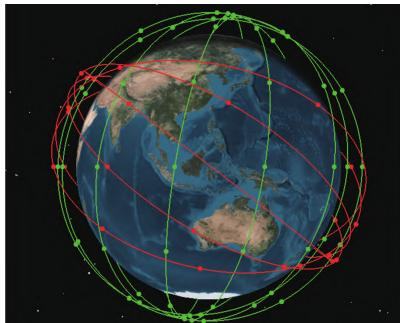
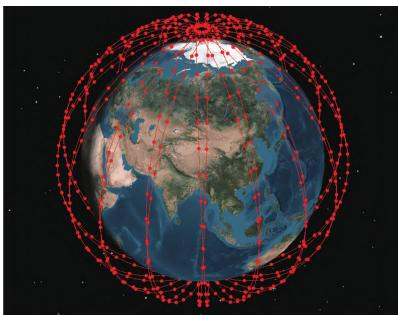
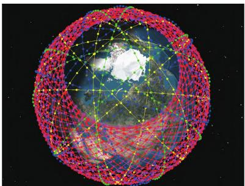
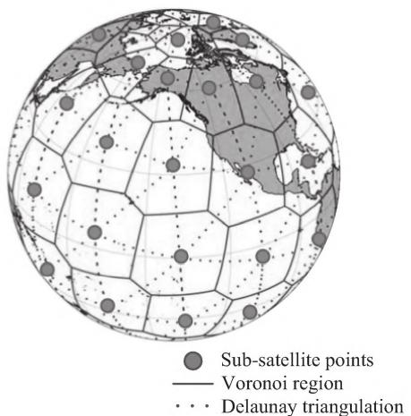
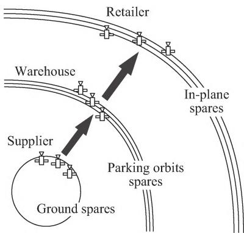
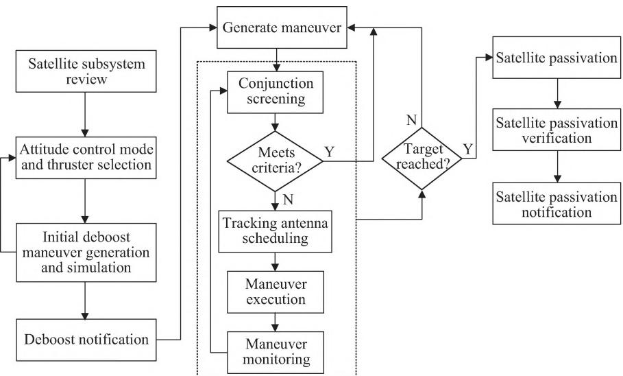
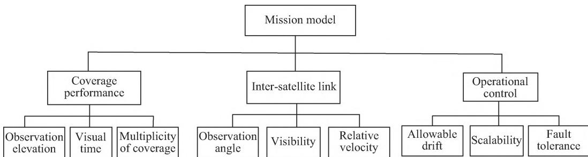

http:zgkj.cast.cn

DOI:10.16708/j.cnki.1000-758X.2022.0001

# 低轨巨型星座构型设计与控制研究进展与展望

阮永井,胡敏\* ,云朝明

航天工程大学,北京

摘 要:近年来低轨星座计划发展迅速,低轨巨型星座已成为全球争夺空间战略资源的“新战场”。首先,概述了 、 、 等低轨巨型星座计划的发展现状,以及中国互联网星座计划的基本情况。在此基础上,分别从星座的任务需求、覆盖特性、摄动补偿和备份策略 个方面,综述了星座的构型设计方法及其特点。然后,根据卫星从发射入轨到离轨整个星座构型的控制流程,梳理了低轨巨型卫星星座的初始化控制、保持控制、重构控制,以及卫星的碰撞规避控制和离轨控制的方法和特点。最后,对未来低轨巨型星座构型设计和构型控制技术的研究方向进行了展望。

关键词:低轨巨型星座;星座构型设计;任务需求;覆盖特性;摄动补偿;备份策略;星座构型控制

中图分类号:

文献标识码:

# Advancesandprospectsoftheconfigurationdesignandcontrol researchoftheLEOmega-constellations

RUANYongjing,HUMin\* ,YUNChaoming

Space Engineering University, Beijing 101416, China

Abstract: In recent years, the LEO constellation programs have developed rapidly and become a "new battlefield" in the global competition of space strategic resources. Firstly, up-to-date status of LEO mega-constellations was described, and the current status of LEO mega-constellations in China was introduced. Configuration design methods and characteristics of constellation were summarized from four aspects, including mission requirements, coverage characteristics, perturbation compensation and spare strategy. Then, according to the whole control process of satellite constellations configuration from orbit to departure, the methods and characteristics of initialization control, stationkeeping control, reconfiguration control, constellation collision avoidance control and de-orbit control were reviewed. Finally, the future research aspects of the configuration design and configuration control technology of the LEO megaconstellations were looked into

Keywords: LEO mega-constellations; constellations configuration design; mission requirements; coverage characteristics; perturbation compensation; spare strategy; constellations configuration control

## 引言

低地球轨道(low Earth orbit,LEO)地区因其轨道高度低 传输延时短 路径损耗小等特性引起了巨型星座设计者和运营商的浓厚兴趣[1]年 随着铱星等公司的破产 低轨星座项目受挫 进入 世纪以后 由于高度集成化和自动化技术快速发展 发射成本逐渐降低 市场需求量不断扩大 低轨巨型星座的研发和部署掀起前所未有的热潮[2-3] 低轨巨型星座能够提供全球覆盖 迅速提高卫星通信 卫星遥感等能力 在通信宽带方面潜力巨大 能够以较低的信号传播延迟来提高服务质量 将低轨星座应用于当前的全球导航卫星系统信号增强 能够实现快速精确定位 在过去的 年里 关于低轨巨型星座构型设计与控制引起学术界广泛关注 巨型星座建设已经开始 低轨巨型星座成为全世界卫星业界的热门话题[4-6]

卫星星座构型包括卫星的轨道类型 空间分布及星间的相互关系[7] 低轨巨型星座是一个庞大的空间系统 其星座构型与系统各种性能之间的相互联系相当复杂 星座构型设计与控制研究也面临着挑战 提早建设和利用低轨星座系统 不仅能够抢占有限的 轨道资源 而且有利于抢占频谱主动权 建设低轨巨型星座 进而增强中国的太空系统弹性和太空感知能力因此 加快中国低轨巨型星座技术的研究至关重要。

本文在梳理国内外低轨巨型星座发展现状的基础上 从任务需求 覆盖特性 摄动补偿和备份策略 个角度 总结了星座的构型设计技术及其特点 接着 通过星座构型控制的流程 归纳了不同任务段星座构型控制方法的特点 最后给出了低轨巨型星座的研究方向建议

## 低轨巨型星座的发展现状

## 国外的低轨巨型星座计划

随着商业航天和小卫星技术的快速发展 卫星发射入轨和全球组网的成本大大降低，国外波音 开普勒通信 三星 亚马逊等商业公司都相继提出了低轨星座计划，其中最具代表性是 SpaceX、Telesat、OneWeb，这些公司计划通过低轨巨型卫星星座提供宽带通信服务 在 年 月的美国联邦通信委员会文件和新闻稿中所述的三个星座系统使用相似半径的圆形轨道 各轨道参数如表所示[8-9]

表 、 、 所提出的星座轨道参数Table 1 Orbit parameters of Telesat, Oneweband SpaceX satellite systems

<table><tr><td rowspan="2">System</td><td rowspan="2">Altitude /km</td><td rowspan="2">Inclination /(%)</td><td colspan="3">Number of</td></tr><tr><td>orbit planes</td><td>satellites per orbit plane</td><td>satellite</td></tr><tr><td rowspan="2">Telesat</td><td>1000</td><td>99.5</td><td>5</td><td>12</td><td rowspan="2">117</td></tr><tr><td>1248</td><td>37.4</td><td>6</td><td>9</td></tr><tr><td>OneWeb</td><td>1200</td><td>87.9</td><td>18</td><td>40</td><td>720</td></tr><tr><td rowspan="5">Starlink</td><td>1150</td><td>53.0</td><td>32</td><td>50</td><td rowspan="5">4425</td></tr><tr><td>1110</td><td>53.8</td><td>32</td><td>50</td></tr><tr><td>1130</td><td>74.0</td><td>8</td><td>50</td></tr><tr><td>1275</td><td>81.0</td><td>5</td><td>75</td></tr><tr><td>1325</td><td>70.0</td><td>6</td><td>75</td></tr></table>

星座使用 波段 计划采用极地轨道和倾斜轨道的混合星座 年 月公司宣布由欧洲厂家泰雷兹 阿莱尼亚空间公司来承造其低轨宽带网络的 颗卫星计划在 年开始部署星座 其中 颗将部署到高度为 的极轨道 设 个轨道面每个轨道面设 颗卫星 到 年底 将其余的 颗卫星将发射到高 的倾斜轨道设 个轨道面 每个轨道面设 颗卫星 星座示意如图 所示 其中极地卫星将于 年在北半球高纬度地区投入使用 并在 年发射倾斜轨道卫星后开始提供全球服务 截至 年月 公司只在 年成功发射一颗原型卫星

  
图 星座示意  
Fig. 1 Telesat constellation diagram

$\mathrm { O n e W e b }$ 星座放弃了星间链路设计 在全球布设关口站使卫星联网 星座采用 波段进行用户通信，Ka波段进行关口站通信，计划通过个阶段部署低轨卫星 为全球 亿用户提供服务 星座初期计划在 个圆形轨道平面上部署 颗卫星 如表 所示 星座示意如图 所示 新增的 颗卫星获准采用 的中地球轨道 使用 波段 用于实现全球覆盖计划于 年完成星座全部部署[10]公司经历破产重组 年 月重启发射[11] 截至 年 月 星座在轨卫星数量已达 颗

  
图 星座示意  
Fig. 2 OneWeb constellation diagram

公司的 星链 星座采用波段进行用户链路 波段用于馈线链路 起初 星链 计划分 个阶段部署星座 第 阶段和第 阶段的轨道参数如表 中所示 轨道高度第 阶段部署的星座轨道高度更低 卫星数目更多 共计 颗卫星部署在轨道高度 附近 将使用 波段 星座示意如图 所示 由于各方面因素的影响 星链 星座计划已经历 次修改 第 次修改旨在降低轨道高度 将原 的 颗星 调整为的 颗 星 星 座 规 模 由 颗 调 整 为颗 第 次修改旨在实现更快的部署 方法则是将轨道面由 个调整为 个 相应的每面卫星数由 颗降为 颗 保持总数不变 第 次修改旨在进一步降低卫星轨道高度 将原轨道高度 的卫星降低至 。

  
图 星座示意  
Fig, 3 Starlink constellation diagram

随后 公司将 颗卫星的网络资料申请提交至美国联邦通信委员会 这一期的卫星代号为 颗卫星的轨道高度分布在 共 个轨道面上具体的星座构型如表 所示[12]。

表 星座构型分布  
Table 2 Starlink Gen2 constellation configuration distribution

<table><tr><td rowspan="2">No.</td><td rowspan="2">Altitude /km</td><td rowspan="2">Inclination /(°)</td><td colspan="3">Number of</td></tr><tr><td>orbit planes</td><td>satellites per orbit plane</td><td>satellite</td></tr><tr><td>1</td><td>328</td><td>30.0</td><td>1</td><td>7 178</td><td>7 178</td></tr><tr><td>2</td><td>334</td><td>40.0</td><td>1</td><td>7 178</td><td>7 178</td></tr><tr><td>3</td><td>345</td><td>53.0</td><td>1</td><td>7 178</td><td>7 178</td></tr><tr><td>4</td><td>360</td><td>96.9</td><td>40</td><td>50</td><td>2 000</td></tr><tr><td>5</td><td>373</td><td>75.0</td><td>1</td><td>1 998</td><td>1 998</td></tr><tr><td>6</td><td>499</td><td>53.0</td><td>1</td><td>4 000</td><td>4 000</td></tr><tr><td>7</td><td>604</td><td>148.0</td><td>12</td><td>12</td><td>144</td></tr><tr><td>8</td><td>614</td><td>115.7</td><td>18</td><td>18</td><td>324</td></tr></table>

目前 星座申请发射的卫星总数为万颗 而 已批准 公司运营 万颗 星链 卫星 得益于批量化卫星制造 火箭重复利用 一箭多星发射等领先技术 截至 年月, 公司已累计发射 星座的卫星总数为 颗 共有 卫星颗在轨运行[13]

## 国内的互联网星座计划

国内卫星互联网计划已被纳入 新基建意味着该项目已经上升为国家战略性工程国内最初提出建设自己卫星互联网星座的有中国航天科技集团有限公司 中国航天科工集团有限公司 和中国电子科技集团有限公司 对应的卫星星座分别是 鸿雁星座 虹云工程 行云工程 天象星座 商业航天公司有银河航天提出的 银河 星座计划 九天微星的 天基物联网 计划以及北京未来导航 的微厘空间 导航增强计划等 部分星座计划如表 所示

表 国内主要低轨星座计划  
Table 3 Major LEO constellation plans in China

<table><tr><td>Operator</td><td>Constellation</td><td>Number of satellites</td><td>Launched</td></tr><tr><td>CASC</td><td>Hongyan</td><td>300</td><td>1</td></tr><tr><td>CASIC</td><td>Hongyun</td><td>156</td><td>1</td></tr><tr><td>CASIC</td><td>Xingyun</td><td>80</td><td>2</td></tr><tr><td>CETC</td><td>Tianxiang</td><td>120</td><td>2</td></tr><tr><td>GalaxySpace</td><td>Galaxy 5G</td><td>650</td><td>1</td></tr><tr><td>BFNTC</td><td>Centispace</td><td>120</td><td>1</td></tr></table>

现阶段只有部分公司发射了几颗试验星 要实现批量发射还面临着一系列问题 从卫星制造能力 市场需求和资金实力上 这些独立的低轨卫星通信计划都未完全具备批量制造和部署的能 力 国 内 的 巨 型 星 座 计 划 还 将 不 断完善[14-16]

年 月 中国正式向国际电信联盟提交了低轨巨型星座的轨道和频率申请网络资料 以 为代号的两个低轨卫星星座共计 颗卫星 星座构型分布如表 所示由此 中国低轨巨型星座建设迈开了坚实的第一步

表 国网 星座构型分布  
Table 4 GW constellation configuration distribution

<table><tr><td rowspan="2">Constellation/Sub Const.</td><td rowspan="2">Altitude/km</td><td rowspan="2">Inclination/(°)</td><td colspan="3">Number of</td></tr><tr><td>orbitplanes</td><td>satellitesper orbit plane</td><td>satellite</td></tr><tr><td>GW-A59/1</td><td>590</td><td>85</td><td>16</td><td>30</td><td>480</td></tr><tr><td>GW-A59/2</td><td>600</td><td>50</td><td>40</td><td>50</td><td>2000</td></tr><tr><td>GW-A59/3</td><td>508</td><td>55</td><td>60</td><td>60</td><td>3600</td></tr><tr><td>GW-2/1</td><td>1145</td><td>30</td><td>48</td><td>36</td><td>1728</td></tr><tr><td>GW-2/2</td><td>1145</td><td>40</td><td>48</td><td>36</td><td>1728</td></tr><tr><td>GW-2/3</td><td>1145</td><td>50</td><td>48</td><td>36</td><td>1728</td></tr><tr><td>GW-2/4</td><td>1145</td><td>60</td><td>48</td><td>36</td><td>1728</td></tr></table>

国内的低轨星座计划越来越热 但与国外相比 国内现阶段低轨巨型星座的设计研究相对滞后 即便如此 国内低轨星座的建设不能一味地跟着国外巨型星座计划跑 只关注低轨巨型星座的移动通信功能 应该注重创新升级 充分发挥低轨互联网星座的能力 让低轨卫星和其他通信 遥感 导航卫星的信息相结合 进而提升资源利用效率并拓宽商业空间 使得方案更加经济有效 目前已有部分通信互联网项目提出导航增强的方案 因此在未来 通信 导航 授时 定位遥感的一体化组网 打造空间信息网络将会是低轨巨型星座的发展趋势 同时 由于低轨巨型星座卫星数量庞大 低轨巨型星座也将朝着星间链路以及自主运行管理的方向发展

要在近地轨道中部署完整的大型星座 需要提供完整 准确和最新的构型 目前近地轨道所部署的巨型星座计划由成百上千个航天器组成其对空间碎片环境的影响，使人们越来越担忧近地空间环境的长期可持续性发展[17] 现有公开文献中 低轨巨型星座的研究主要集中在碎片碰撞概率计算 文献 以 和的巨型星座为例 使用欧洲航天局 欧空局 的碎片演变模型进行模拟研究 并对多 种 情 景 进 行 测 试 研 究 结 果 表 明 在或 星座的 年运行阶段 在中实施减缓措施并没有显著降低碰撞的概率 文献 对近十年提出的巨型星座进行仿真建模 采用空间碎片环境长期演化模型进行分析 发现卫星数量和面积主要影响碰撞次数 卫星质量主要影响由碰撞产生的新增碎片数量 星座部署在 高度对空间碎片环境影响较大 文献 基于巨型星座的风险评估统计工具 分析了星座主要参数对卫星使用寿命卫星数量航天器横截面卫星可靠性的影响 较好的低轨巨型星座构型设计与控制技术能够增强星座的安全性 目前公开资料中 国内外低轨巨型星座的技术研究提案较少 中国对卫星星座构型的研究主要集中在中轨道的导航星座 因此 低轨巨型星座的构型设计与控制问题值得进一步探索

## 卫星星座构型设计与控制

星座构型是以卫星轨道为基础 对星座几何形状以及卫星间相互关系的描述 反映了星座中卫星的时空布局 低轨巨型卫星星座是一个复杂庞大的空间系统 卫星星座的构型设计与构型控制相辅相成 一方面卫星星座的空间几何构型设计决定了构型控制的效果 另一方面要提高星座构型控制的能力和水平 需将星座构型进行重新设计[21]。因此,星座构型设计与构型控制需要综合考虑星座的整体性能和建设效益 实现低轨巨型星座的全寿命优化设计

## 卫星星座构型设计

星座的构型设计是星座系统设计的前提和关键 卫星之间的几何构型直接决定了星座系统的运行能力和应用水平 一个设计良好的星座可以提高星座系统的性能 降低星座部署成本星座的构型设计需考虑卫星的轨道特性 以星座性能为指标来选择优化设计方法 一般来说 星座构型设计除了考虑任务需求 覆盖特性外还需考虑星座的时空结构特性 利用摄动补偿策略和星座备份策略进行构型设计的优化

## 针对任务需求的星座构型设计

由于星座内各卫星之间的拓扑结构动态变化 使得星座构型设计十分复杂 星座构型设计主要是星座构型参数的优化 不同的任务需求和不同的星座构型特点所对应的星座构型设计方法也不尽相同 目前低轨巨型星座的功能主要是通信 随着研究的深入 一些星座计划也提出融合低轨导航增强 遥感以及授时定位等功能。

星座的构型设计是决定低轨卫星通信系统性能的关键因素 文献 在设计低轨巨型星座时 考虑了 和 两种 型星座 并对比分析了两个方案的优缺点 文献 为减少地球观测卫星星座的系统响应时间 提出了卫星遥感和卫星通信的两个相互交联的异构星座设计 并通过基于预定义的设计变量范围生成数千个异构构型配置 并根据预定义的性能度量调整这些配置大小的优化框架寻找最佳的星座异构配置。

全球导航卫星系统无线电掩星大气探测技术，扩展了一个崭新的低地球轨道卫星星座研究领域 针对无线电掩星地球大气的探测星座 文献 提出了多全球导航卫星系统探测星座的概念和设计方法 并使用改进的蚁群算法来进行优化 优化结果与原有星座相比 卫星数量减少颗的同时探测数据量增加了 并且探测均匀性提高了

低轨导航增强技术被认为是扩展和增强现有全球导航卫星系统的一个有前途的应用 它本质上不同于通信星座或地球观测星座的设计问题 文献 详细论证了低轨导航增强星座设计方法 针对单一星座构型全球精度衰减因子(dilution of precision,DOP)值分布不均匀的问题 提出以组合低轨卫星星座的方式实现全球覆盖 并使可见星数量与 值在全球范围内均匀分布 为实现利用低轨巨型星座进行定位 文献 对既可用于通信又可用于定位的星座进行了初步设计 通过将不同星座组合在一起使沿纬度的可见卫星数量分布更均匀 并讨论了倾角 轨道高度 组合星座的数量以及每个星座中卫星数量比例的选择 在此基础上 文献 选择了 个轨道倾角分别为 和 的卫星,在全球范围内实现快速精确点定位收敛 时间为 文献 将低地球轨道星座设计问题建模为一个多目标优化问题 并采用多目标粒子群优化算法进行求解 位置精度因子(position dilution of precision,PDOP)、可见卫星数和轨道高度作为性能指标 被用来在增强性能和部署效率之间寻求最佳折衷 通过模糊集方法从由多目标优化算法给出的一组帕累托最优解中选出最佳的星座 该方法只测试了颗和 颗卫星的星座 对于卫星数量庞大的低轨巨型星座,优化算法的搜索空间可能会增加几个数量级 容易陷入局部最优 难以得到全局最优解

尽管已经有学者提出了一些低地球轨道导航增强以及遥感观测的星座 但目前文献中低轨星座的构型优化设计 采用的是混合星座的设计方式 卫星数目在 颗以内 要想实现上千颗卫星的巨型星座设计 需要在传统星座设计的基础上探索新的设计方法 进而满足在成本可控范围内符合更为复杂多元的任务需求

## 针对覆盖特性的星座构型设计

覆盖性能优化方法在传统上主要用于低轨侦察卫星星座设计 星座的空间覆盖性能是一个多属性指标体系 因此 如何用覆盖性能指标来评估星座的探测能力 在星座设计 优化和评估中具有重要意义 文献 于 世纪年代研究了低轨卫星星座的最佳组成 并给出了 星座 圆形极轨星座 大椭圆轨道星座在不同阶段的覆盖范围 在低轨侦察卫星星座的设计问题中 文献 引入正常随机目标的侦察过程 建立检测过程的数学模型 确定覆盖性能和检测能力之间的关系 文献 利用对地球表面进行连续单次和多次全球覆盖的卫星星座设计来解决更复杂的区域覆盖

可以发现 以上方法的卫星数量都不超过颗 只能实现部分区域覆盖 这些技术无法为持续性全球覆盖的巨型星座设计提供解决方案对于低轨巨型星座 文献 提出了一种大规模优化星座设计框架 旨在实现全球覆盖和强大的连通性 该研究首先建立快速而准确的轨道预报器 然后利用球形 镶嵌 卫星重访频率和星间链路可行性来表征星座的覆盖和连通性 由众多卫星星下点所形成的 图和三角剖分示意如图 所示 最后 基于模拟退火优化 得到最佳轨道高度 轨道倾角 每个轨道卫星数量和星座中轨道平面数量 该方案通过优化星座设计来直接影响系统的成本 可扩展性和有效性 可为低轨巨型星座的构型设计提供参考。

  
图 星下点形成的 图与 三角剖分  
Fig. 4 Voronoi diagram and Delaunay triangulation formed by the sub-satellite points

## 考虑摄动补偿的星座构型设计

卫星在轨运行中会受到各种摄动力作用 逐渐偏离设计轨道 造成卫星间相对位置发生偏移并导致星座整体结构发生变化 影响星座性能 文献 对低轨卫星的摄动力模型进行分析 并估计了各摄动力的量级 低轨卫星受到的主要摄动力包括非球形摄动 日月三体引力摄动 大气阻力摄动 潮汐力摄动及太阳光压摄动

在星座几何构型设计时可以对星座轨道进行小量偏置 通过摄动力补偿策略调整星座构型参数 进而提高星座构型的长期稳定性 文献利用参数偏置的摄动补偿方式来处理卫星摄动运动导致的星座构型发散问题 文献利用卫星初始参数偏置补偿原理建立星座整体偏移方案 同时通过数据拟合方法拟合调整多种摄动对整体的影响结果 进而消除卫星轨道在长期摄动因素下产生的偏差 保持星座构型的长期稳定性 文献 分析了低轨 $\mathrm { W a l k e r }$ 星座的卫星轨道摄动和星座构型稳定性的影响因素 通过其轨道摄动和相对漂移特点 提出的 次偏置控制策略可将两种星座的相对漂移量降至以下 但其研究的轨道高度为 该轨道高度下大气阻力的影响可以忽略不计

针对摄动补偿策略的构型优化设计能有效提高中高轨卫星星座的构型稳定性 但其只能对摄动导致的星座构型长期变化中的线性部分进行补偿 非线性部分无法实现补偿或者补偿效果不是很理想 对于轨道高度较低的低轨巨型星座 尤其是轨道高度低于 的星座 受大气阻力影响较大 摄动补偿的效果会很有限

## 星座构型设计需考虑的星座备份策略

在星座的运行中需要部署一定数目的备份卫星来提高星座的可靠性 即星座的备份策略巨型星座的卫星数目日益增多 未来巨型星座可能会出现大量卫星故障 因此在星座的构型设计时就必须设计稳定的备份更换策略来保障星座服务水平 同时 不同备份策略要求备份卫星进行不同的轨道部署 这将对星座的构型产生不同的影响

传统的星座备份策略包括空间备份和按需发射备份 其中空间备份指在轨备份和停泊轨道备份，按需发射备份也称地面备份，在轨备份是将备份星部署在工作轨道高度 通过相位调整完成故障星替换 停泊轨道备份的备份星轨道与工作轨道存在高度差 利用备份星的轨道漂移和轨道机动完成故障星替换 地面备份的备份星存储在地面 通过地面发射实现故障星替换 三种备份模式的优缺点如表 所示[21,37]

表 不同星座备份模式的优缺点  
Table 5 Advantages and disadvantages of different constellation spare modes

<table><tr><td>Spare mode</td><td>Advantages</td><td>Disadvantages</td></tr><tr><td>In-plane spares</td><td>High availability, can quickly replace faulty stars, enhance constellations service performance</td><td>More spare satellites are required and the cost is higher</td></tr><tr><td>Parking orbits spares</td><td>Spare satellites can spare multiple orbital surfaces without consuming more fuel, which is flexible</td><td>Longer replacement time, higher cost, and poorer constellations performance enhancement</td></tr><tr><td>Ground spares</td><td>Launch on demand, with fewer Spare satellites</td><td>The longest replacement time and the most obvious degradation in constellations performance</td></tr></table>

传统的备份方案包括 建立基于卫星可靠度 备份卫星可用性及固有可用度 平均修复时间建立的星座系统可靠度模型 备份卫星轨道设计约束模型 备份卫星重构控制模型 并通过综合考虑星座构型设计和备份策略设计 实现星座的一体化优化设计[38] 对于倾斜地球同步轨道卫星备份 在考虑 颗剩余卫星的设计约束条件下 通过比较和分析给出了对应的轨道位置和备用方案[39] 文献 基于鸿雁单颗 卫星和轨道卫星资源 建立了单颗 和 颗卫星构成的导航备份方案 从而实现天基卫星导航备份

随着卫星数量急剧增多 星座的空间系统自身冗余性增强 低轨巨型星座需要高效和可扩展的维护策略 而传统卫星星座的备份策略在卫星数量和故障频率方面的可扩展性有限 因此传统备份策略无法满足低轨巨型星座的备份需求基于此问题 提出了一种利用库存管理方法的新备用策略 即存储论模型 存储论模型是一种多级库存策略 通过设计一组比星座轨道高度低的停泊轨道用于备用存储 存储论模型将星座备份看作是一个多层次的供应链系统 综合考虑不同级别的备份卫星 将地面备份视为供应商 停泊轨道备份视为仓库 卫星在轨备份视为零售商 如图 所示

  
图 星座多级备份策略示意  
Fig. 5 Multi-level spare strategy for satellite constellation

文献 基于提出的多级库存策略模型 引入了一种包括停泊轨道的特性和所有位置的优化公式来确定最佳的备用策略 能够在给定性能要求的情况下最大程度地降低系统的维护成本该模型可以通过使用不同的停泊轨道和不同的轨道平面策略 使系统拥有更大灵活性的同时保证效率不变 但是该模型需要综合应用多种星座备份策略 模型建立比较复杂 该方向的模型需要输入研究 使模型更加适用于巨型星座

低轨巨型星座卫星数目成百上千 甚至达到上万颗 这导致了一个新问题的出现 如何以最佳方式管理卫星库存 文献 结合发射失败硬件故障和卫星碰撞风险等随机因素 提出了采用马尔可夫决策过程模型来计算星座内卫星的最佳部署策略 该策略将与卫星故障风险相关的总净成本最小化 同时确保系统级操作不间断文献 中提出的马尔科夫决策过程通用模型可用于优化管理其他轨道甚至混合轨道中卫星星座的库存水平 可为巨型星座的库存管理提供参考。

## 星座构型控制

由于星座会受到环境摄动以及卫星自身可靠性的约束，需要利用星座构型控制，来维持星座中卫星的绝对位置和相对位置 使星座的整体性能处于稳定状态 星座构型控制是实现星座构型稳定 确保星座性能满足任务需求的重要保证[22] 卫星从发射入轨到离轨都离不开控制星座构型控制主要包括星座构型的初始化控制构型保持控制 构型重构控制 星座卫星碰撞规避和离轨控制等 用于完成不同星座的任务要求。

## 星座构型初始化控制

在星座的构型控制中 初始化过程是一个特殊的过程 其控制时间短 摄动长期影响不明显构型的初始化控制是通过一系列的变轨机动 改变卫星星座的主星和从星的轨道要素 形成所需要的构型 文献 研究了一种编队卫星群构型控制的初始化方式 并通过演算确定控制的定轨方式 文献 研究了两次脉冲作用的分布式卫星初始化问题 文献 通过摄动法给出圆参考轨道编队卫星相对动力学方程的二阶亚轨道周期解以及该编队构型解的初始化条件文献 研究了椭圆参考轨道下的编队构型初始化问题 并对两脉冲 三迹向脉冲和四迹向脉冲的构型初始化方法进行了综合比较分析

星链 星座 卫星由猎鹰 火箭发射入轨时 并不会直接将其送入预定的轨道 而是送入位于 左右的轨道 之后通过星上氪离子推进器进行轨道爬升进入预定轨道 后基本能够完成初始轨道的捕获 铱星和 也是先将卫星送入比工作轨道低的入轨轨道 然后通过卫星轨道机动进入工作轨道 并且在改变半长轴的过程中 基本同时改变轨道倾角 使升交点赤经漂移速率基本保持不变 从而最终实现星座初始轨道捕获[47]

## 星座构型保持控制

星座构型保持控制旨在确保星座性能的稳定性和连续性 维持星座中卫星的站位 降低星座运行维护成本和构型设计复杂度 世纪年代文献 提出仅控制平面内的变轨 利用近地点点火调整远地点矢径的控制策略来维持星座构型 文献 利用二次型最优控制理论提出了星座相对位置保持 绝对位置可移动的星座控制方法 文献 分析了 星座中各星相互协作关系，提出一种基于利用网格点仿真法获得覆盖性能的星座构型保持策略

文献 基 于 两 行 轨 道 要 素研究了铱星 一网 星链星座的控制规律 其中 二代铱星利用保持各个星的平倾角基本相同 工作轨道卫星的平半长轴相同的方式使升交点赤经漂移速率保持不变 进而保持星座构型的长期稳定 一网星座的卫星轨道高度受大气阻力的影响较小 主要通过升轨和降轨的交替进行来维持卫星的相位

星链 星座的卫星维持控制是通过调节半长轴大小 采用卫星升轨和降轨的方式维持控制星座 其中升轨控制能够维持轨道高度 星链 星座相邻卫星的相位偏差大都保持在之间 星链 星座的轨道高度较低 大气阻力影响较大 导致卫星的平半长轴衰减较快 统计分析每天的衰减量大约为 但另一方面 同样由于大气阻力影响 星座的部分降轨控制的规律性较差 振荡幅度较大 在卫星降轨后需要马上进行升轨控制 导致星座的升轨和降轨控制较为频繁[47] 基于 数据的反演得到的星座构型保持控制数据可为中国未来低轨巨型星座建设提供参考。

对于低轨巨型星座 卫星受大气阻力影响较大 传统的星座维持控制方法会引起卫星频繁机动 使得卫星寿命缩短 服务质量下降 需要研究更加高效的星座构型维持控制技术

## 星座构型重构控制

星座构型重构是指星座由初始构型变换到另一种构型 星座在运行时由于卫星星座性能提升 卫星星座任务需求改变 星座中卫星失效等因素的存在 需要对卫星星座构型进行重构控制。

卫星星座重构机动的优化是指根据推进剂消耗，转移时间或两者的组合，寻找最佳方式来调整现有卫星星座的轨道 以实现特定任务目标的过程 针对应急机动的星座重构问题 文献提出了保持轨道属性和星座基本构型的预置量机动方法 并给出了对应的星座重构策略通过一阶梯度和邻近极值的组合算法能够求解多卫星轨道转移耦合优化问题[52] 文献 利用基于相对轨道元素的燃料最优脉冲编队重构策略，实现重构阶段卫星重分配问题的优化。

针对卫星星座构型重构过程的优化设计 基于朗伯定理的卫星星座重构的方法能够较好地降低重构过程的成本 文献 采用混合入侵杂草优化 微粒群优化算法对星座中的卫星进行次优转移轨道设计 进而以最小的代价实现星座的重构 并对问题的动态模型进行建模 将卫星对初始轨道和目标轨道的最佳分配与最佳轨道转移整合到一个步骤当中 文献 提出可进行常规地球观测和灾害监测的可重构卫星星座框架 利用系统工程的方法解决卫星设计和轨道设计的多学科共同优化问题

此外 某些星座会通过分阶段部署的策略来逐步扩大容量 以最大程度地降低诸如发射失败和市场不确定性之类的偶然风险 这需要发射额外的卫星并重新配置在轨卫星 文献 提出了一种灵活的多阶段通信卫星部署策略 通过最小的预期生命周期成本来找到每个阶段的设计同时星座的每个阶段都提供了当前关注区域的覆盖范围 以及关注区域潜在的附加覆盖范围与单阶段星座系统和最优全球覆盖星座相比 该策略的生命周期成本要更低 通过优化卫星星座轨道重构的方法 能够将初始的低容量星座转换为新的高容量星座 这种方法可适用于低轨巨型星座

卫星失效会影响星座的覆盖及工作性能 少数卫星失效时可以通过控制调整剩余工作卫星的轨道以及发射快速响应卫星的方法来对星座的空间构型进行重构 从而降低失效影响 修复和改善星座性能[57-58]。为了满足不断变化的任务要求和应对不可预见的挑战 需要反应灵敏和有弹性的星座系统，针对低轨通信星座卫星失效的在轨重构问题 文献 以全球平均覆盖率 燃料消耗均衡性 重构总时间和重构总速度增量作为重构指标 通过基于分解的多目标进化算法进行建模仿真分析 能够构建帕累托前沿恢复星座的覆盖性能 并得到燃料消耗均衡性最好的解 但其调整轨道高度的优化过程会在一定程度上破坏星座构型 不能够很好地适用于巨型星座 文献 利用多目标遗传算法和基于模型的系统工程技术能够不断优化灵敏和有弹性的星座系统 文献 利用系统工程方法开发可重构星座图的优化工具，实现地球观测卫星和可重构星座的并行设计优化

对于低轨巨型星座 由于星座的卫星数目较多 通过传统的机动方式进行重构控制 在一定程度上会破坏原有星座构型 影响星座的维持控制 使星座后期管理复杂度增加 针对这一问题 可以将星座的重构控制 维持控制以及备份策略相结合 进行综合优化

## 卫星碰撞规避及离轨控制

低轨星座卫星大都以批量化生产和减小卫星内部系统冗余度的方式来降低制造成本 这样会使卫星的可靠性降低 故障率提升 进而可能使卫星失效 空间碎片增加 威胁太空环境安全例如星链计划首先发射的 颗卫星中就有 颗发生故障无法工作 这样的故障率将可能使整个计划中的 颗卫星成为空间碎片 严重影响星座的安全性 针对空间碎片 卫星需要进行有效规避以免受到撞击 文献 提出了一种近距离自主规避以躲避无意识飞行的空间目标的机动策略 文献 着重分析了航天器避碰的径向和轨迹分离方法 揭示了分离效果与控制量控制位置和控制时间的关系

此外 星座内部的卫星与卫星也可能发生碰撞 包括 由于摄动力和轨道初始误差的相互作用引起的碰撞 以及卫星在入轨 轨道维持 碰撞规避以及离轨处置等机动过程和观测误差等造成卫星位置不确定引起的碰撞[64] 文献 研究了星座内部卫星间相对距离的变化规律 建立了广义的碰撞检测数学模型 验证了调整轨道倾角的方式可以获得较好的星座参数配置 文献在定义卫星发生碰撞机会和碰撞概率的基础上 从星座系统设计角度提出了可减小卫星碰撞概率的措施 包括 在保证卫星站位没有重叠的同时使卫星间的最小间隔最大化 合理处置在轨报废卫星 减少星座的轨道数量 调整轨道倾角和相位尽量增大卫星通过轨道平面相交处的时间间隔

文献[17]通过引入碰撞率增加百分比，以评估低地球轨道大型卫星星座的环境影响 对于低轨巨型星座 如果废弃卫星不立即或在相对较短的时间内脱离轨道 低地球轨道的碰撞率将进一步增加 因此 低轨巨型星座应尽可能提高卫星任务后的处置成功率 使卫星的离轨阶段相当短或者完全受控 以避免成百上千的废弃卫星长期停留在轨道上

在较高的低地球轨道高度上运行通常需要采取主动离轨控制 即近地卫星在使命完成以后进行离轨机动 文献 通过研究卫星的轨道参数 离轨机动的代价与存在寿命的关系来解决离轨机动问题 文献 通过研究寻求一种简单的机制 电离层阻力 使得微型航天器从较高的 高度脱离轨道 以符合减轻轨道碎片的准则 针对电推进的主动离轨控制方法 文献分析了电推进对轨道根数的影响和燃料消化率 结合哈密顿函数提出了带协状态参数的最优控制率 并建立了基于增广拉格朗日粒子群最优化算法的离轨模型 可用于解决低轨卫星小推力求解问题

针对由于卫星设计或者故障的原因而无法控制再入卫星的问题 重点是通过尽量减少卫星停留时间 以便快速将卫星移出轨道 文献提出了利用空间绳网捕获废弃目标 再通过充气式增阻离轨方式进行被动离轨的方案

铱星公司开发并实施了一项离轨计划 通过减缓卫星的速度进行离轨操作[71] 离轨的主要流程如图 所示 铱星的 颗卫星已经实施离轨计划重返大气层 从轨道上移出 完成了星座的更新升级 铱星的离轨方案为那些无法控制再入的卫星减少停留时间 快速移出轨道提供了参考

  
图 铱星离轨流程  
Fig. 6 Iridium de-orbit process

## 启示与展望

低轨卫星具有距地近 信号优 低延时等优点 并且低轨巨型星座是一个庞大的空间系统其卫星数量大 能较好地实现对目标的持续覆盖 低轨巨型星座必然是未来星座发展的热潮现阶段国外关于低轨巨型星座的研究已取得一系列成果 而国内的低轨巨型星座计划也已提上日程 针对低轨巨型星座的构型设计与控制以下几个问题值得关注

## 星座构型设计与控制的多学科优化研究

卫星星座构型设计与构型控制是一种相互制约的耦合关系 星座空间几何构型设计决定了星座的构型控制效果 而星座构型控制的能力和水平的改变需要新的星座构型设计 星座设计需要同时考虑多个优化指标 此外 星座构型优化设计技术的关键在于分析巨型星座各项性能与几何构型的关系，建立相应的分析模型，解决星座设计多准则 模型复杂以及变量多样的问题 针对上述难点问题 可考虑空间构型与星座覆盖性能服务性能 星间链路性能 稳定性能 可扩展性等系统性能的综合平衡 利用系统工程的方法建立合适的任务模型 见图 以及优化模型

## 低轨巨型星座自主运行管理研究

星座自主运行是指卫星在不依赖地面设施的情况下自主确定星座状态和维持星座构型 在轨完成飞行任务所要求的功能或操作 低轨巨型星座 卫星数量庞大 如果完全依赖地面设施和人工进行控制管理 将耗费巨大的人力物力财力 因此 卫星的自主导航 星座构型的自主维持的星座自主运行管理值得深入研究 研究设计一种将各种卫星平台和有效载荷整合到一起能够适应不断增长的卫星数量 灵活快速地收集 处理以及分发数据的架构十分重要

  
图 巨型星座构型优化设计任务模型  
Fig. 7 Task model for configuration optimization design of mega-constellation

## 低轨巨型星座安全性及离轨技术研究

截至 年 尺寸大于 的在轨空间物体数量已经接近 个 其中 以上都属于空间碎片 尚未编目的空间目标数更是大的惊人 巨型星座中涉及的大量卫星构成了新的挑战[18,20] 针对这一问题 需要突破低轨空间物体临界密度分析 空间碎片雪崩效应构成条件等技术 由于低轨巨型星座的卫星数目多 卫星的长期维持难度较大 卫星故障率较高 为满足星座的安全性 快速补位以及故障星离轨机动的需要,星座控制系统的灵敏性和卫星的离轨控制问题需要深入研究

## 低轨巨型星座分阶段部署策略研究

低轨巨型星座的卫星数量庞大 一般很难在短时间内完成星座的建设 在此情况下就需要研究星座的分段部署方案 综合考虑星座构型的稳定性 星座构型控制 星座的系统可靠性 星座系统费用 部署策略等 利用多目标优化进行星座的分段部署 进而实现各个阶段星座服务能力 部署代价 阶段子星座构型扩展性能以及阶段间性能提升的综合平衡

## 低轨巨型星座备份策略研究

低轨巨型星座的建设和运行周期都很长 为实现星座的可靠运行 巨型星座设计过程中还需要关注备份冗余问题而传统卫星星座的备份策略在卫星数量和故障频率方面的可扩展性有限，无法满足低轨巨型星座备份需要，针对这一问题 一方面要深入研究星座卫星的冗余 可靠性以及成本效率之间的关系 寻求最优方案 另一方面是研究设计新的备份替换策略(如多级库存策略 库存管理控制方式 利用最佳的备份卫星数量确保星座服务连续性和稳定性

## 5 结论

目前针对低轨巨型星座的研究主要围绕星座的性能以及星座对空间环境所的影响 较少涉及低轨巨型星座的构型设计与控制 本文首先介绍了国内外低轨巨型星座计划以及部署现状并分析未来巨型星座的发展方向 然后 从任务需求 覆盖特性 摄动补偿 备份策略 个方面讨论了星座的构型设计,并阐述了从卫星入轨到卫星离轨的星座全寿命周期的构型控制方式 发现现有小型星座的设计方式不能最佳地优化巨型星座的构型 并且一些传统的控制方式已不适用于巨型星座的控制 最后 对未来低轨巨型星座的构型设计与控制进行了思考与展望 针对传统星座的设计和控制方式的不足 在星座构型的多学科优化 星座自主运行管理 星座安全性及离轨技术 星座的分阶段部署和备份策略等方面需要探索新的方法

## 参考文献( )

[1] KLINKARD H. Large satellite constellations and related challenges for space debris mitigation [I]. Journal of Space Safety Engineering, 2017,4(2):59-60.

邢强 低轨巨型星座的建设及其影响分析 中国航天2019(12):43-47.XING Q. The construction and influence analysis of LECmega constellations[J]. Aerospace China, 2019(12) :43-47(in Chinese).

「3]方芳，吴明阁，全球低轨卫星星座发展研究[].飞航导弹，2020(5):88-92.FANG F, WU M G. Research on the development ofglobal LEO satellite constellations [J]. Aerodynamic

Missile Journal, 2020(5) :88-92(in Chinese).

[4] RAVISHANKAR C, GOPAL R, BENAMMAR N, et al. Next-generation global satellite system with megaconstellations [J ]. International Journal of Satellite Communications and Networking,2020(2):1-23.

[5] GUIDOTTI A, VANELLI-CORALLI A, FOGG T, et al. LTE-based satellite communications in LEO megaconstellations [J ]. International Journal of Satellite Communications and Networking,2019,37(4):316-330.

[6] GE H, LI B F, NIE L W, et al. LEO constellation optimization for LEO enhanced global navigation satellite system (LeGNSS) [J]. Advances in Space Research, , ():

张育林 卫星星座理论与设计 北京 科学出版社2008:1-3.ZHANG Y L. Theory and design of satellite[ ] : , : (Chinese).

[] 梁晓莉,陈建光,姚源,等 国外低轨卫星互联网发展现状分析 第十五届卫星通信学术年会论文集 北京中国通信学会LIANG X L, CHE J G, YAO Y, et al. Analysis ofdevelopment of foreign LEO satellite internet [C]//Proceedings of the 15th Annual Meeting of SatelliteCommunication. Beijing: China Communication Society,2019:19-22(in Chinese).

[9] PORTILLOA I D, CAMERONB B G, CRAWLEYC E F. A technical comparison of three low earth orbit satellite constellation systems to provide global broadband [J]. Acta Astronautica, 2019, 159:123-135.

梁晓莉 王聪 李云 一网 星座最新发展分析 中国航天，2019（7）:29-31.LIANG X L, WANG C, LI Y. Analysis of the latestdevelopment of “OneWeb" constellation[J]. Aerospace, (): ( )

张晓帆 英国政府和印企买下一网 拟投 亿美元使之复活 中国航天ZHANG X F. The British government and Indiancompanies bought the OneWeb and plan to invest \$1billion to revive it[I]. Aerospace China, 2020(8) :74-75( )

刘帅军 徐帆江 刘立祥 等 第二代系统介绍[J].卫星与网络，2020(12)：62-65..LIU S J, XU F J, LIU L X, et al. Introduction ofStarlink second generation system [J ]. Satellite &Network, 2020(12):62-65(in Chinese).

[13] JEFF F. Space X launches first dedicated polar Starlink misssion[OL]. (2021-09-14)「2021-10-01]. https:∥/ spacenews. com/space-launches-first-dedicated-polarstarlink-mission/.

中国航天 编辑部 鸿雁 星座谱写我国低轨卫星互联网建设新篇章 中国航天Editorial Department of “Aerospace China". “Hongyan"constellation writes a new chapter of China's LEOsatellite Internet construction [J]. Aerospace China,2019(2):6-9(in Chinese).

杨海霞 商业航天 天基互联网布局起步 对话国务院发展研究中心国际技术经济研究所曲双石 张嘉毅 中国投资，2019(13):32-35.YANG H X. Commercial aerospace: the start of thespace-based internet layout-a dialogue with QuShuangshi and Zhang Jiayi from the Institute ofInternational Technology and Economics, DevelopmentResearch Center of the State Council [J ]. ChinaInvestment, 2019(13):32-35(in Chinese).

高璎园 王妮炜 陆洲 卫星互联网星座发展研究与方案构想 中 国 电 子 科 学 研 究 院 学 报875-881.GAO Y Y, WANG N W, LU Z. The developmentresearch and construction suggestion of satellite internetconstellations [ J ]. Journal of China Academy ofElectronics and Information Technology, 2019, 14(8):875-881(in Chinese).

[17] PARDINI C, ANSELMO L. Environmental sustainability of large satellite constellations in low earth orbit[J]. Acta Astronautica, 2020, 170:27-36.

[18] LE M S, GEHLY S, CARTER B A, et al. Space debris collision probability analysis for proposed global broadband constellations[J]. Acta Astronautica, 2018, 151:445-455.

沈丹 刘静 大型低轨星座部署对空间碎片环境的影响分析[J].系统工程与电子技术，2020，42(9):2041-2051SHEN D, LIU J. Effectiveness of the large LEOconstellation deployment to the space debris environment[J]. Systems Engineering and Electronics, 2020,42(9):2041-2051(in Chinese).

[20] OLIIVIERI L, FRANCESCON A. Large constellations assessment and optimization in LEO space debris environment[J]. Advances in Space Research, 2020, 65 (1):351-363.

项军华 卫星星座构形控制与设计研究 长沙 国防科学技术大学，2007:4-18.XIANG J H. Study on control and design ofconfiguration for satellite constellation[D]. Changsha:National University of Defence, 2007:4-18(in Chinese).

[22] SU Y, LIU Y , ZHOU Y, et al. Broadband LEO satellite communications: architectures and key technologies[J]. IEEE Wireless Communications, 2019, 26(2):55-61.

[23] SANAD I, MICHELSON D G. A Framework for

heterogeneous satellite constellation design for rapid response Earth observations[C]. 2019 IEEE Aerospace Conference. Big Sky :IEEE,2019: 1-10.

[ ] 梁斌,王珏瑶,李成,等 多 掩星大气探测卫星星 座设计[] 宇航学报, , (): LIANG B, WANG Y Y, LI C, et al. Design of multi-GNSS occultation sounding satellite constellation [J]. Journal of Astronautics, 2016, 37 (3): 334-340 (in Chinese).

[ ] 田野,张立新,边朗 低轨导航增强卫星星座设计[] 中国空间科学技术，2019，39(6)：55-61.TIAN Y, ZHANG L X, BIAN L. Design of LEOsatellite augmented constellation for navigation [J ].Chinese Space Science and Technology, 2019, 39(6) :55-61(in Chinese).

[26] HE X C, HUGENTOBLER U. Design of megaconstellations of LEO satellites for positioning[C]. China Satellite Navigation Conference. Singapore: Springer, 2018：663-673.

[27] GE H B, LI B F, NIE L W, et al. LEO constellation optimization for LEO enhanced global navigation satellite system (LeGNSS) [J]. Advances in Space Research, , ():

[28] HAN Y, WANG L, FU WJ, et al. LEO navigation augmentation constellation design with the multiobjective optimization approaches [ J/OL ]. Chinese Journal of Aeronautics, 2020[2020-12-01]. https:// doi, org/10.1016/j. cja.2020.09.005.

[29] MATOSSIAN M G. Improved candidate generation and coverage analysis methods for design optimization of symmetric multisatellite constellations [ J ]. Acta Astronautica, 1997, 40(2-8):561-571.

[30] ZONG P, KOHANI S. The performance of the constellations satellites based on reliability[J]. Journal of Space Safety Engineering, 2017, 4(2) :112-116.

[31] MENG S F, SHU J S, YANG Q, et al. Analysis of detection capabilities of LEO reconnaissance satellite constellation based on coverage performance[J]. Journal of Systems Engineering and Electronics, 2018, 29(1): 98-104.

[32] KAK A, AKYILDIZ I F. Large-scale constellation design for the Internet of Space Things/CubeSats[C]. 2019 IEEE Globecom Workshops, Waikoloa: IEEE, 2019: 1-6.

蒋虎 卫星轨道设计中的主要摄动源影响评估云南天文台台刊JIANG H. The impact assessment of the mainperturbation sources in the LEO satellite orbit design[J]. Journal of Yunnan Observatory, 2002(2) :29-34(inChinese).

李恒年 李济生 焦文海 全球星摄动运动及摄动补偿运控策略研究[J]. 宇航学报,2010(7):1756-1761.LI H N, LI J S, JIAO W H. Analyzing perturbationmotion and studying configuration maintenance strategyfor compass-M navigation constellation [J]. Journal ofAstronautics, 2010(7):1756-1761(in Chinese)

陈长春 林滢 沈鸣 等 一种考虑摄动影响的星座构型 稳定性设计方法[J].上海航天，2020，37(1):33-37 CHEN C C, LIN Y, SHEN M, et al. A novel design method for the constellation configuration stability considering the perturbation influence [J]. Aerospace , , (): ( )

[ ] 李玖阳,胡敏,王许煜,等 低轨 星座构型偏置维 持控制方法分析[]中国空间科学技术, , (): 38-47. LI J Y, HU M, WANG X Y, et al. Analysis of configuration offsetting maintenance method of LEO walker constellation [J]. Chinese Space Science and , , (): ( )

王许煜 胡敏 赵玉龙 等 星座备份策略研究进展 中国空间科学技术，2020，40(3):43-55.WANG X Y, HU M, ZHAO, Y L, et al. Researchprogress of constellation backup strategy[J]. ChineseSpace Science and Technology, 2020, 40 (3): 43-55(inChinese).

项军华 张育林 基于卫星可靠度和 星座空间备份策略 设 计 系 统 工 程 与 电 子 技 术1576-1580.XIANG J H, ZHANG Y L. Design of spatial backupstrategy for constellation based on satellite reliability andMTTR[J]. Systems Engineering and Electronics, 2007(9):1576-1580(in Chinese).

[39] FENG L, JIAO W, JIA X, et al. A method on constellation on-orbit backup of regional navigation satellite system [ C ]//China Satellite Navigation Conference ( CSNC) 2012 Proceedings. Beijing: Springer, 2012:197-211.

雷文英 李毅松 周昀 等 基于鸿雁单颗 卫星和卫星的天基导航备份 空间电子技术(5):47-51,LEI W Y, LI Y S, ZHOU J, et al. Space-basednavigation backup with single Hongyan LEO satelliteand GEO satellites[J]. Space Electronic Technology,2017, 14(5):47-51(in Chinese).

[41] JAKOB P, SHIMIZU S, SHOJI Y, et al. Optimal satellite constellation spare strategy using multi-echelon inventory control[J]. Journal of Spacecraft and Rockets, 2019,56(5):1449-1461.

[42] KIM R. Stochastic inventory control modeling for satellite constellations [ I]. Journal of Spacecraft and

Rockets,2020,57(3):1-9

韩潮 谭田 杨宇 编队飞行卫星群构型保持及初始化 []中国空间科学技术, , (): HAN C, TAN T, YANG Y. Configuration maintenance and initialization satellite formations[J]. Chinese Space Science and Technology, 2003, 23 (2): 54-60 (in Chinese).

王兆魁 张育林 分布式卫星群构形初始化控制策略宇航学报, ():WANG Z K, ZHANG Y L. A control strategy fordistributed satellite formation initialization[J]. Journalof Astronautics, 2004(3):334-337(in Chinese).

[ ] 李亚菲,刘向东,肖余之 圆参考轨道相对动力学方程的 亚轨道周期解[J].航天控制，2013，31(6):50-55. LI Y F, LIU X D, XIAO Y Z. Suborbital periodic solutions the relative dynamic equations in circular orbits [J]. Aerospace Control, 2013, 31 (6): 50-55 (in Chinese).

[ ] 雷博持,郑建华,李明涛 椭圆轨道编队构型的初始化控制研究[1].空间科学学报：2015.35(1)：86-93.LEI B C, ZHENG J H, LI M T. Research on formationinitialization control for elliptic reference orbit J].Chinese Journal of Space Science, 2015, 35(1) :86-93(inChinese).

孙俞 沈红新 基于 的低轨巨星座控制研究 力学与实践，2020，42(2)：156-162SUN Y, SHEN H X. The control of mega-constellationat low Earth orbit based on TLE[J]. Mechanics in, , (): ( )

李果 三颗冻结轨道卫星构成的星座轨道控制策略控制工程，1994（5）：49-54.LI G. Orbit control strategy of constellation composed ofthree frozen orbit satellites[J]. Control Engineering ofChina, 1994(5):49-54(in Chinese).

张洪华 李鸿铭 邹广瑞 等 圆轨道星座位置保持控制的仿真与 研 究 中 国 空 间 科 学 技 术18-25.ZHANG H H, LI H M, ZOU G R, et al. Research onsimulation and station keeping strategy of the circularconstellation[J]. Chinese Space Science and Technology,2000,20(6);18-25(in Chinese).

杨晓龙 刘忠汉 基于覆盖性能的 星座构型保持 空间控制技术与应用YANG X L, LIU Z H. Walker-δ constellationconfiguration maintenance based on coverageperformance[I]. Aerospace Control and Application.2012, 38(2):53-57(in Chinese).

[51]于小红，冯书兴 区域观察小卫星星座重构方法研究[]宇航学报，2003(2):168-172.YU X H, FENG S X. Study on reconfiguring method of

small satellite constellations for regional observation[J]. Journal of Astronautics, 2003(2) :168-172(in Chinese).

[52] APPEL L, GUELMAN M, MISHNE D . Optimization of satellite constellation reconfiguration maneuvers[J]. Acta Astronautica,2014,99:166-174.

[53] WANG J, ZHANG J, CAO X, et al. Optimal satellite formation reconfiguration strategy based on relative orbital elements [J]. Acta Astronautica, 2012, 76: 99-114.

[54] MAHDI F, MAJID B, MAHSHID S. Optimal design of the satellite constellation arrangement reconfiguration process[J]. Advances in Space Research, 2016, 58(3): 372-386.

[55] PAEK S, KIM S, DE W O. Optimization of reconfigurable satellite constellations using simulated annealing and genetic algorithm[J]. Sensors, 2019, 19 (4):765.

[56] LEE H W,JAKOB P C,KOKI H,et al. Optimization of satellite constellation deployment strategy considering uncertain areas of interest[J]. Acta Astronautica, 2018, 153:213-228.

胡伟 王劼 基于遗传算法的全球导航星座重构研究 [] 宇航学报, (): HU W, WANG J. The research on global navigation constellation reconfiguration based on genetic algorithm [J]. Journal of Astronautics, 2008(6):1819-1823 (in Chinese).

赵双 张雅声 戴桦宇 基于快速响应的导航星座重构构型设计[] 空间控制技术与应用, , ():ZHAO S, ZHANG Y S, DAI Y Y. Configuration designof navigation constellation reconfiguration based on quickresponse[J]. Aerospace Control and Application, 2018,44(4) :29-36(in Chinese).

李玖阳 胡敏 王许煜 等 考虑燃料消耗均衡性的低轨通信星座在轨星座构型重构方法研究 中国空间科学技术，2021.41(4):95-101.LI J Y, HU M, WANG X Y, et al. Research on on-orbit construction reconfiguration method of LEOcommunicationconstellationconsideringfuelconsumption balance [J]. Chinese Space Science and, , (): ( )

[60] WAGNER K M, BLACK J T. Genetic-algorithm-based design for rideshare and heterogeneous constellations [J]. Journal of Spacecraft and Rockets, 2020(1) :1-12.

[61] PAEK S W, OLIVIER D W, SMITH M W. Concurrent design optimization of earth observation Satellites and reconfigurable constellations[J]. Journal of the British Interplanetary Scoiety, 2017, 70(1):19-35

姚党鼐 王振国 航天器在轨防碰撞自主规避策略 国防科技大学学报，2012，34(6):100-103.

YAO D N, WANG Z G. Active collision avoidance maneuver strategy for on-orbit spacecraft[J]. Journal of National University of Defense Technology, 2012, 34 (): ( )

[63] GUO X, XU X, LIN H, et al. Study on quick selection technology of low-orbit spacecraft collision-avoidance strategy[C]// Proceedings of 2019 Chinese Intelligent Systems Conference. Beijing,2020:318-324.

[ ] 云朝明,胡敏,宋庆雷,等 巨型低轨星座安全性研究及其规避机动策略综述[] 空间碎片研究, , ( ):17-23.YUN C M, HU M, SONG Q L, et al. Security researchand maneuver avoidance strategy of LEO constellation[] , , ( ): (Chinese).

闫野 任萱 关于星座设计中碰撞检测问题的探讨 中国空间科学技术，1999,19(6)：3-5.YAN Y, REN X. A discussion on collision checking forconstellation design [J ]. Chinese Space Science and, , (): ( )

刘广军 沈怀荣 星座设计中避免卫星碰撞问题的研究[J].航天控制，2004，22(6)：66-70.LIU G J, SHEN H R. Research on satellite collisionavoidance in constellation[J]. Aerospace Control, 2004,(): ( )

肖业伦 李晨光 陈绍龙 近地卫星和星座离轨机动研究[J].空间科学学报，2006(2)：155-160.XIAO Y L, LI C G, CHEN S L. Study on deorbit of

satellites of LEO and constellation [J]. Chinese Journal of Space Science, 2006(2) :155-160( in Chinese).

[68] SMITH B G A, CAPON C J, BROWN M, et al Ionospheric drag for accelerated deorbit from upper low earth orbit[J]. Acta Astronautica, 2020, 176:520-530

李玖阳 胡敏 王许煜 等 基于 算法的低轨卫星小推力离轨最优控制方法 系统工程与电子技术2021,43(1):199-207.LIJ Y, HU M, WANG X Y, et al. Optimal controlmethod for low thrust satellite deorbit based on ALPSOmethod[J]. Systems Engineering and Electronics, 2021,43(1):199-207(in Chinese).

[ ] 王立武,刘安民,许望晶,等 一种低轨废弃目标的捕获 与回收方案 中国空间科学技术 WANG L W, LIU A M, XU W J, et al. Research on capturing and recovery of low-orbit useless targets[J]. Chinese Space Science and Technology, 2021,41(1) :84- 90(in Chinese).

[71] EVERETTS W, ROCK K, IOVANOV M. Iridium deorbit strategy, execution, and results[J]. Journal of Space Safety Engineering,2020,7(3):351-357.

作者简介:

阮永井 男 博士研究生 研究方向为星座构型设计与控制, 。

胡敏 男 副教授 研究方向为空间管理复杂性及其安全管理与决策研究，ilhm09@163.com。

(编辑:高珍)