# 1.4 A COMPARISON OF SATELLITE CONSTELLATIONS FOR CONTINUOUS GLOBAL COVERAGE

Thomas J. Lang $^{*}$ William S. Adams $^{\dagger}$ The Aerospace Corporation
El Segundo, CA

## ABSTRACT

In the past, researchers using the streets of coverage (SOC) and Walker methods for generating optimal satellite constellations have published constellations with the minimum number of total satellites for continuous global coverage. The real goal of constellation optimization, however, is to reduce the overall system cost. In some cases this will occur for the minimum total number of satellites, but other real world considerations (such as sparing strategy or launch vehicle multiple satellite manifesting) may drive the constellation selection process to other solutions. This paper presents tables of constellations, optimized for continuous global coverage (1- to 4-fold), for 5 to 100 satellites and all numbers of orbital planes. These expanded tables for the SOC and Walker methods allow the mission planner more choices in minimizing overall system cost. By simple filtering and sorting of the tables, it is shown how constellations can be selected to account for these real world considerations. A comparison is made between the constellations produced by these two methods in the light of some common real world considerations.

## INTRODUCTION

Not long ago a constellation of satellites was considered “large” if it contained more than five satellites. The NAVSTAR Global Positioning System at about 24 satellites was considered extreme. These days the GPS system is a reality and communication service providers are proposing satellite constellations in low earth orbit (LEO) with as many as several hundred satellites. The constellation selection process is one of the key tradeoff studies which must be performed to obtain the minimum overall system cost. In some cases the best constellation for the job will be the one which can perform the mission using the fewest satellites at the specified satellite altitude. In other cases, considerations such as launch vehicle performance or sparing strategy might yield a lower total system cost using a constellation which has more than the minimum number of satellites. There are currently two methods (the Walker method and the Streets of Coverage method) of generating optimal constellations of large numbers of satellites in circular orbits for continuous global or zonal (between two latitude bounds) coverage. In the past, only the constellations which minimize the total number of satellites have been published for these methods. This paper presents tables of optimized constellations for all numbers of orbital planes and for all numbers of total satellites up to 100. These expanded tables allow the orbit planner more choices in minimizing the overall system cost when the real world factors are considered. Expanded tables are presented for two cases: continuous global coverage and continuous coverage in the latitude band from 65°S to 65°N (zonal coverage). By simple filtering and sorting of these tables, constellations can be selected to address real world considerations. The objective of the current study is to compare the constellations produced by the two methods and examine the considerations which drive the constellation selection process.

## OPTIMAL SATELLITE CONSTELLATION METHODS

The objective of designing optimal satellite constellations is to reduce the number of satellites required at a given altitude to provide the required level, or fold, of continuous zonal or global coverage. Only a few methods have been developed by researchers to design large optimal satellite constellations for continuous zonal or global coverage.

## Streets of Coverage (SOC) Method

In one method, multiple circular orbit satellites at the same altitude are placed in a single plane so as to create a street of coverage which is continuously viewed (see Figure 1). The objective is then to determine analytically how many such streets (i.e., planes of satellites at the same inclination) are required to cover the zone of interest or the globe. Lüders $^{1}$ (also

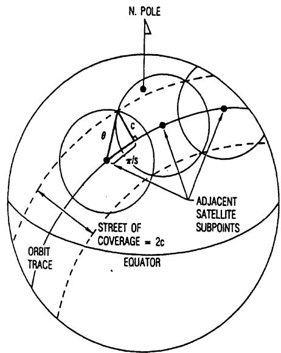  
Figure 1. Continuous Street of Coverage from a Single Orbital Plane

Lüders and Ginsberg $^{2}$ ) used this method and a computer search over orbit inclination to solve the continuous single zonal coverage problem. Rider $^{3}$ further pursued this method to develop an analytic, closed form solution to the inclined orbit zonal coverage problem for multiple coverage. Results from the streets of coverage technique indicate that if the zone (a region between two latitude values on the Earth's surface) is in the low to mid latitudes, then the optimal constellation will consist of inclined orbital planes with nodes spaced evenly through 360°. For zonal coverage at high latitudes or any zone including the pole (including global coverage) researchers Beste $^{4}$ and Rider $^{5}$ found that the streets of coverage method using polar orbits with nodes spread over 180° were preferable. These polar orbits required fewer satellites at the same altitude than did the inclined orbits.

Researchers further noted that these optimal polar constellations had p (p is the number of planes or streets in the constellation) interfaces between adjacent streets. Of these, p-1 were co-rotating, that is, the satellites were moving in the same direction. Only one interface was counter-rotating with satellites moving in opposite directions. If the satellites in adjacent co-rotating planes are correctly phased, then the coverage circles from one plane can be used to cover the cusps in the adjacent plane. Such an optimal phasing allows co-rotating planes to be spaced farther apart than what the simple half-street width would allow. The spacing of counter-rotating planes is set by the half-street width. The overall effect of optimally phasing the satellites between planes is to take advantage of the co-rotating interfaces. The result is that the ascending nodes for the polar planes are no longer evenly distributed within $180^{\circ}$ , but rather a spacing slightly larger than $180^{\circ}/p$ occurs. The constellation is more efficient, but no longer symmetrical.

Adams and Rider $^{6}$ have tabulated optimal streets of coverage constellations for continuous global and various polar cap coverages for both arbitrarily and optimally phased polar arrangements. Multiple folds (from 1-fold to 4-fold) of coverage are examined for up to 200 satellites. Later tables by these same authors investigate constellations of up to several thousand satellites.

## Walker Method

In a second method, satellites orbits at a common altitude and inclination are distributed symmetrically and propagated ahead in time. Based on satellite positions at each time interval, the largest required coverage circle size over time is computed and recorded. The orbital inclination and arrangement are then varied numerically to achieve the optimal constellation by minimizing the largest required coverage circle size. These arrangements of symmetric, circular orbits are often referred to as Walker Constellations based on the contributions by J.G. Walker.

Researchers such as Walker $^{7-12}$ , Mozhaev $^{13,14}$ , Ballard $^{15}$ , and Lang $^{16,17}$ have used this method to find inclined circular orbit satellite constellations at a common altitude which provide continuous global (single or multiple) coverage with a minimum number of satellites. Only symmetric arrangements of satellites are considered. Lang $^{17}$ presented a tabulation of optimal Walker constellations for up to 100 satellites for 1-through 4-fold continuous global coverage.

Using Walker's notation, symmetric constellations of satellites can be described by the parameters $T / P / F$ and $i$ , where

T = total no. of satellites in constellation

P = no. of commonly inclined orbital planes

F = relative phasing parameter

i = common inclination for all satellites In order to have a symmetric arrangement, the T/P satellites in a given orbital plane are equally spaced in central angle (phasing) and the P orbital planes are evenly spaced through $360^{\circ}$ of right ascension of ascending node. The phasing parameter F relates the satellite positions in one orbital plane to those in an adjacent plane (i.e., inter-orbit phasing). The units of F are $360^{\circ}/T$ .

## Draim Orbits

A third class of optimal constellations involves the use of eccentric orbits with a common period and inclination to achieve single or multiple continuous global coverage using fewer satellites than required with circular orbits. These constellations of symmetrical, elliptical orbits are commonly called Draim Constellations after their developer J.E. Draim $^{18-21}$ . Since the focus of the current study is on circular orbit satellites, only the Streets of Coverage and Walker Constellations will be analyzed.

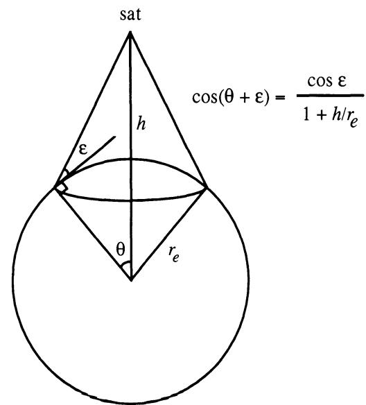  
Figure 2. Satellite Coverage Geometry

## Constellation Measure of Efficiency ( $\theta$ )

For circular orbits, the constellation optimization problem can be uncoupled from satellite altitude h and ground elevation angle $\varepsilon$ considerations by using the Earth central angle radius of coverage $\theta$ as the primary independent variable. The geometry is shown in Figure 2. For constellations of T circular orbit satellites, the goal is to find the arrangement which requires the smallest value of $\theta$ and still achieves continuous zonal or global coverage. The constellation with the lowest required value of $\theta$ will allow the lowest operating altitude for a fixed value of $\varepsilon$ . Conversely, if satellite altitude is fixed, the lower operating limits on ground elevation angle $\varepsilon$ will be maximized. The value of the Earth central angle radius of coverage $\theta$ which is required for the constellation to achieve continuous zonal or global coverage is regarded as a measure of efficiency of a constellation. The lower the value of $\theta$ for fixed T, the more efficient the constellation.

## SIMPLE COMPARISON OF SOC AND WALKER CONSTELLATIONS

Figure 3 shows the number of satellites required for continuous global coverage (1-through 4-fold) as a function of satellite altitude for both the Walker and SOC methods. The vertical axis in this plot is altitude and has been derived from the constellation measure of

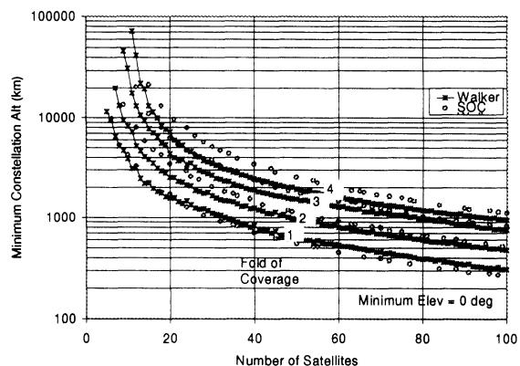  
Figure 3. Number of Satellites for Continuous Global Coverage (El > 0)

efficiency, $\theta$ (earth central angle radius of the coverage circle) using a ground elevation angle of zero and the equation in Figure 2. The same plot could be produced for other values of elevation angle, but the relative nature of the constellations would remain the same.

As expected, the number of satellites increases steadily (although not always monotonically) as the satellite altitude decreases. Note that 2-fold coverage of the globe does not require twice as many satellites as 1-fold. Sometimes an additional fold of coverage is available for a minor percentage increase in the number of satellites.

In comparing the optimal streets of coverage and Walker-type constellations as shown in Figure 3, several conclusions can be drawn. For single continuous global coverage with 20 or fewer satellites, the symmetric, inclined Walker-type constellations are more efficient. For the same number of satellites, Walker constellations offer continuous global coverage at a lower altitude (correspondingly lower $\theta$ ). Conversely, at the same altitude, Walker constellations can perform the same job with fewer satellites. For single continuous global coverage with more than 20 satellites, the optimally phased, non-symmetric polar SOC constellations are more efficient. For double or higher folds of continuous global coverage, the Walker constellations are always more efficient. In fact, in the region of 30 satellites, the inclined Walker constellations achieve 4-fold coverage at altitudes for which the polar SOC constellations cannot even achieve full 5-fold coverage. Table 1 contains a comparison of various aspects of the SOC and Walker constellations.

Table 1.  
Comparison of SOC and Walker Constellations

<table><tr><td>Parameter</td><td>Streets of Cov</td><td>Walker</td></tr><tr><td>Inclination</td><td>Polar</td><td>Inclined</td></tr><tr><td>Symmetry</td><td>Non-symmetrical</td><td>Symmetrical</td></tr><tr><td>Sats/plane</td><td>Many</td><td>Usually few</td></tr><tr><td>Coverage</td><td>Best coverage at poles</td><td>Best coverage at mid-lats</td></tr><tr><td>Optimality for Cont Global Cov</td><td>1-fold (20+ sats)</td><td>1-fold (&lt; 20 sats), 2-folds and up</td></tr></table>

## OTHER CONSIDERATIONS IN CONSTELLATION SELECTION

The previous section presents a simplistic view on selecting between the SOC and Walker methods for an optimal constellation. In the real world, the objective is to minimize the overall system cost, which may or may not be achieved by simply minimizing the number of satellites required to do the job at a specified altitude. In this section some other considerations will be examined which may drive the constellation selection process in order to reduce the overall system cost.

In some cases these other considerations will favor constellations which are not “optimal.” That is, we might want to select a constellation whose measure of efficiency, $\theta$ (earth central angle radius of the coverage circle) is not the lowest for that total number of satellites, but does offer a lower total system cost. In previously published tabulations of optimal constellations for both the SOC (Adams and Rider $^{6}$ ) and the Walker (Lang $^{17}$ ) methods, only the optimal constellation for each value of T (total number of satellites) was listed. A much more complete set of data is given in Tables 2, 3, and 4, which contain data for the best constellations of from 5 to 100 satellites for all possible number of planes (not just the “optimal” number of planes). Each entry represents a constellation optimized by the SOC or Walker method for the specified total number of satellites and specified number of planes. Table 2 lists the best SOC constellations for continuous global coverage (1- through 4-folds). Table 3 lists the best Walker constellations for continuous global coverage (1-through 4-folds). Table 4 lists the best Walker constellations for continuous coverage of the latitude band from 65°S to 65°N (1- through 4-folds). In following sections, some real world considerations will be examined to show how the more complete Tables 2, 3, and 4, can be used to reduce overall system cost (not just the total number of satellites). Supporting charts will be obtained by sorting and filtering the data in the tables. From these “best” constellations, a solution which meets the real world considerations of the constellation selection process will be sought.

Table 2. Optimal Streets of Coverage Constellations For Continuous Global Coverage

<table><tr><td>p</td><td>s</td><td>I</td><td>theta</td><td>1 FOLD alpha</td><td>omega</td><td>theta</td><td>2 FOLD alpha</td><td>omega</td><td>theta</td><td>3 FOLD alpha</td><td>omega</td><td>theta</td><td>4 FOLD alpha</td><td>omega</td></tr><tr><td>2</td><td>3</td><td>6</td><td>66.716</td><td>104.478</td><td>60.000</td><td>-</td><td>-</td><td>-</td><td>-</td><td>-</td><td>-</td><td>-</td><td>-</td><td>-</td></tr><tr><td>2</td><td>4</td><td>8</td><td>56.946</td><td>96.470</td><td>45.000</td><td>-</td><td>-</td><td>-</td><td>-</td><td>-</td><td>-</td><td>-</td><td>-</td><td>-</td></tr><tr><td>2</td><td>5</td><td>10</td><td>53.219</td><td>95.480</td><td>36.000</td><td>73.019</td><td>92.090</td><td>0.000</td><td>-</td><td>-</td><td>-</td><td>-</td><td>-</td><td>-</td></tr><tr><td>2</td><td>6</td><td>12</td><td>50.360</td><td>92.913</td><td>30.000</td><td>63.702</td><td>91.317</td><td>0.000</td><td>-</td><td>-</td><td>-</td><td>-</td><td>-</td><td>-</td></tr><tr><td>2</td><td>7</td><td>14</td><td>49.257</td><td>92.838</td><td>25.714</td><td>58.613</td><td>91.964</td><td>0.000</td><td>77.489</td><td>90.701</td><td>25.714</td><td>-</td><td>-</td><td>-</td></tr><tr><td>2</td><td>8</td><td>16</td><td>48.025</td><td>91.646</td><td>22.500</td><td>55.116</td><td>91.135</td><td>0.000</td><td>69.117</td><td>90.447</td><td>22.500</td><td>-</td><td>-</td><td>-</td></tr><tr><td>2</td><td>9</td><td>18</td><td>47.592</td><td>91.728</td><td>20.000</td><td>53.069</td><td>91.409</td><td>0.000</td><td>63.621</td><td>90.919</td><td>20.000</td><td>80.158</td><td>90.319</td><td>0.000</td></tr><tr><td colspan="15">SEE AUTHORS FOR FULL TABLE</td></tr><tr><td>9</td><td>8</td><td>72</td><td>22.500</td><td>22.500</td><td>22.500</td><td>26.241</td><td>40.000</td><td>20.000</td><td>34.278</td><td>60.746</td><td>19.687</td><td>42.726</td><td>80.000</td><td>20.000</td></tr><tr><td>9</td><td>9</td><td>81</td><td>20.088</td><td>22.012</td><td>20.000</td><td>24.917</td><td>40.000</td><td>17.778</td><td>33.344</td><td>60.597</td><td>20.000</td><td>42.144</td><td>80.000</td><td>17.778</td></tr><tr><td>9</td><td>10</td><td>90</td><td>18.301</td><td>21.660</td><td>18.000</td><td>23.974</td><td>40.000</td><td>16.000</td><td>32.732</td><td>60.474</td><td>15.750</td><td>36.175</td><td>40.000</td><td>0.000</td></tr><tr><td>9</td><td>11</td><td>99</td><td>16.939</td><td>21.379</td><td>16.364</td><td>23.278</td><td>40.000</td><td>14.546</td><td>32.233</td><td>60.398</td><td>16.364</td><td>33.326</td><td>40.000</td><td>0.000</td></tr><tr><td colspan="6">LEGEND:</td><td colspan="9">inclination = 90 degrees</td></tr><tr><td></td><td colspan="5">p = # planes</td><td colspan="9">Theta=Earth central angle radius of coverage circle</td></tr><tr><td></td><td colspan="5">s = # satellites/plane</td><td colspan="9">alpha=Delta RAAN between orbit planes</td></tr><tr><td></td><td colspan="5">T = total # satellites</td><td colspan="9">omega=Delta phasing between orbit planes</td></tr></table>

Table 3. Optimal Walker Constellations For Continuous Global Coverage

<table><tr><td rowspan="2">I</td><td rowspan="2">P</td><td rowspan="2">E</td><td rowspan="2">I</td><td colspan="3">1 FOLD</td><td colspan="4">2 FOLD</td><td colspan="4">3 FOLD</td><td colspan="4">4 FOLD</td></tr><tr><td>Theta</td><td>ngt</td><td>E</td><td>I</td><td>Theta</td><td>ngt</td><td>E</td><td>I</td><td>Theta</td><td>ngt</td><td>E</td><td>I</td><td>Theta</td><td>ngt</td><td></td></tr><tr><td>5</td><td>5</td><td>1</td><td>43.6</td><td>69.106</td><td>5</td><td>2</td><td>2.8</td><td>89.936</td><td>5</td><td>2</td><td>0.4</td><td>108.001</td><td>5</td><td>3</td><td>51.8</td><td>138.921</td><td>5</td><td></td></tr><tr><td>6</td><td>2</td><td>0</td><td>52.2</td><td>66.729</td><td>6</td><td>1</td><td>58.8</td><td>89.850</td><td>3</td><td>0</td><td>0.4</td><td>90.400</td><td>6</td><td>0</td><td>0.5</td><td>120.000</td><td>6</td><td></td></tr><tr><td>6</td><td>3</td><td>2</td><td>45.2</td><td>89.787</td><td>6</td><td>1</td><td>43.2</td><td>89.940</td><td>2</td><td>0</td><td>0.4</td><td>90.000</td><td>6</td><td>2</td><td>0.4</td><td>120.001</td><td>6</td><td></td></tr><tr><td>6</td><td>6</td><td>4</td><td>53.6</td><td>66.275</td><td>6</td><td>4</td><td>45.2</td><td>89.787</td><td>6</td><td>0</td><td>0.4</td><td>90.400</td><td>6</td><td>3</td><td>0.4</td><td>120.000</td><td>3</td><td></td></tr><tr><td>7</td><td>7</td><td>5</td><td>56.0</td><td>60.009</td><td>7</td><td>2</td><td>61.2</td><td>75.839</td><td>7</td><td>3</td><td>2.8</td><td>89.953</td><td>7</td><td>3</td><td>0.4</td><td>102.858</td><td>7</td><td></td></tr><tr><td colspan="18">SEE AUTHORS FOR FULL TABLE</td><td></td></tr><tr><td>100</td><td>10</td><td>1</td><td>71.2</td><td>20.122</td><td>100</td><td>2</td><td>69.8</td><td>21.496</td><td>50</td><td>7</td><td>62.0</td><td>29.450</td><td>100</td><td>5</td><td>60.9</td><td>31.240</td><td>20</td><td></td></tr><tr><td>100</td><td>20</td><td>6</td><td>70.7</td><td>20.318</td><td>100</td><td>8</td><td>69.3</td><td>21.864</td><td>100</td><td>12</td><td>63.6</td><td>27.936</td><td>100</td><td>3</td><td>62.4</td><td>29.653</td><td>25</td><td></td></tr><tr><td>100</td><td>25</td><td>16</td><td>71.7</td><td>18.609</td><td>20</td><td>7</td><td>68.8</td><td>21.865</td><td>100</td><td>18</td><td>65.0</td><td>27.000</td><td>100</td><td>10</td><td>63.7</td><td>29.581</td><td>100</td><td></td></tr><tr><td>100</td><td>50</td><td>43</td><td>74.6</td><td>17.429</td><td>20</td><td>19</td><td>71.8</td><td>21.920</td><td>100</td><td>45</td><td>65.9</td><td>26.562</td><td>100</td><td>36</td><td>62.6</td><td>29.569</td><td>50</td><td></td></tr><tr><td>100</td><td>100</td><td>92</td><td>81.8</td><td>17.947</td><td>100</td><td>63</td><td>69.5</td><td>21.492</td><td>25</td><td>96</td><td>76.1</td><td>27.314</td><td>100</td><td>12</td><td>62.2</td><td>29.444</td><td>100</td><td></td></tr></table>

Table 4. Optimal Walker Constellations

For Continuous Zonal Coverage of the Region 65S to 65N

<table><tr><td rowspan="2">I</td><td rowspan="2">P</td><td rowspan="2">E</td><td rowspan="2">l</td><td colspan="3">1 FOLD</td><td colspan="3">2 FOLD</td><td colspan="3">3 FOLD</td><td colspan="3">4 FOLD</td></tr><tr><td>Theta</td><td>ngt</td><td>E</td><td>l</td><td>Theta</td><td>ngt</td><td>E</td><td>l</td><td>Theta</td><td>ngt</td><td>E</td><td>l</td></tr><tr><td>5</td><td>5</td><td>1</td><td>43.6</td><td>69.106</td><td>5</td><td>2</td><td>0.4</td><td>82.609</td><td>5</td><td>2</td><td>0.4</td><td>108.001</td><td>5</td><td>3</td><td>51.8</td></tr><tr><td>6</td><td>2</td><td>0</td><td>44.8</td><td>63.372</td><td>6</td><td>1</td><td>74.8</td><td>89.850</td><td>3</td><td>0</td><td>0.4</td><td>90.363</td><td>6</td><td>0</td><td>37.1</td></tr><tr><td>6</td><td>3</td><td>0</td><td>64.9</td><td>71.446</td><td>6</td><td>0</td><td>49.5</td><td>89.934</td><td>6</td><td>0</td><td>0.4</td><td>90.000</td><td>6</td><td>2</td><td>0.4</td></tr><tr><td>6</td><td>6</td><td>4</td><td>46.8</td><td>65.978</td><td>6</td><td>1</td><td>0.4</td><td>77.801</td><td>3</td><td>2</td><td>0.4</td><td>90.181</td><td>2</td><td>3</td><td>0.4</td></tr><tr><td>7</td><td>7</td><td>1</td><td>46.0</td><td>59.062</td><td>7</td><td>1</td><td>0.4</td><td>75.060</td><td>7</td><td>3</td><td>0.4</td><td>84.683</td><td>7</td><td>3</td><td>0.4</td></tr><tr><td colspan="16">SEE AUTHORS FOR FULL TABLE</td></tr><tr><td>100</td><td>10</td><td>1</td><td>58.3</td><td>18.576</td><td>100</td><td>9</td><td>54.7</td><td>20.061</td><td>100</td><td>7</td><td>50.3</td><td>26.908</td><td>100</td><td>3</td><td>52.9</td></tr><tr><td>100</td><td>20</td><td>12</td><td>54.6</td><td>16.061</td><td>100</td><td>7</td><td>53.7</td><td>20.826</td><td>25</td><td>12</td><td>53.1</td><td>25.316</td><td>100</td><td>12</td><td>51.9</td></tr><tr><td>100</td><td>25</td><td>18</td><td>56.7</td><td>16.361</td><td>100</td><td>14</td><td>55.4</td><td>20.164</td><td>100</td><td>20</td><td>52.2</td><td>25.004</td><td>100</td><td>9</td><td>52.9</td></tr><tr><td>100</td><td>50</td><td>43</td><td>73.1</td><td>17.366</td><td>20</td><td>40</td><td>55.5</td><td>20.227</td><td>50</td><td>17</td><td>52.1</td><td>25.599</td><td>100</td><td>12</td><td>52.8</td></tr><tr><td>100</td><td>100</td><td>70</td><td>54.0</td><td>17.045</td><td>100</td><td>36</td><td>55.5</td><td>20.201</td><td>100</td><td>62</td><td>53.6</td><td>25.882</td><td>100</td><td>56</td><td>51.4</td></tr><tr><td colspan="16">LEGEND:</td></tr><tr><td></td><td colspan="5">T = Total # satellites</td><td colspan="10">I = Inclination (deg)</td></tr><tr><td></td><td colspan="5">P = # Planes</td><td colspan="10">Theta = Earth central angle radius of coverage circle</td></tr><tr><td></td><td colspan="5">F = Phasing parameter</td><td colspan="10">ngt = # independent groundtracks in geosync orbit</td></tr></table>

## Consideration 1: Coverage Location

## Need for Polar Coverage?

The first consideration pertains to the region of the earth the constellation is required to cover. If polar cap coverage is not required, then it may make no sense to consider the polar SOC constellations, which concentrate the coverage at the poles. A considerable number of satellites can be saved by using the Walker approach to optimize coverage over a latitude band. This has been done in Table 4 for the latitude band from 65°S to 65°N. Figure 4 shows the number of satellites required to continuously cover the latitude band from 65°S to 65°N (Table 4 data, Walker method) as compared to those required for global coverage (best of Tables 2 and 3, Walker and SOC methods, respectively). Note that the curve for zonal

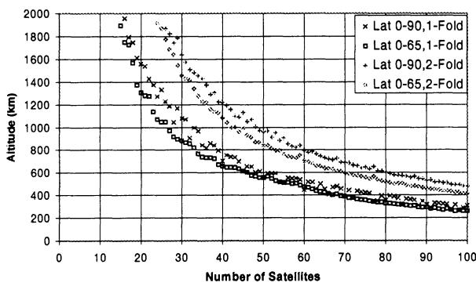  
Figure 4. Number of Satellites for Global and Zonal Coverage (El>0)

coverage lies below the global coverage curve, especially in the range of about 20 to 40 satellites. As much as a 20% savings in number of satellites can result by giving up coverage of the 9% of the earth near the poles. A similar result was noted in an earlier study (Lang $^{22}$ ) which examined optimal constellations for the mid-latitudes only. In this study it was found that continuous coverage of the 20° to 60° latitude band required only two-thirds to three-quarters the number of satellites as for continuous global coverage.

## Location of Higher Fold Coverage

A constellation of satellites which provides continuous 1-fold coverage will often provide 2-fold or even higher levels of coverage over some portions of the earth. In many cases the location of this higher fold coverage is important and could become an important criterion in the selection of a constellation. Mission designers could try to locate the “extra” coverage over high demand areas of the earth to provide extra capacity (e.g. more communication lines or sensors available). The higher fold coverage might be employed to allow users higher ground elevation angle coverage in mountainous terrain or rainy climates. If there is a concern of communication interference from other satellites at the same frequency, the higher fold coverage would allow the user to switch to an alternate satellite in the event that the first satellite is in an interference geometry. This concern has received widespread attention lately (Lang $^{24}$ addressed the frequency of LEO/GEO interference events). Similarly, the region of the earth with the higher fold of coverage would not be adversely affected in the event of a single satellite failure.

Normally, it is desirable to select a constellation with as much “extra” coverage as possible over the highest priority regions of the earth. The polar SOC constellations always concentrate the higher folds of coverage at the poles. The inclined Walker constellations usually have the higher folds of coverage near the latitude corresponding to the orbital inclination. Compare Figures 5a and 5b, which show the coverage provided by the best 28 satellite SOC and Walker constellations for 1-fold, continuous global coverage at an altitude of 1600 km. Note that 2-fold

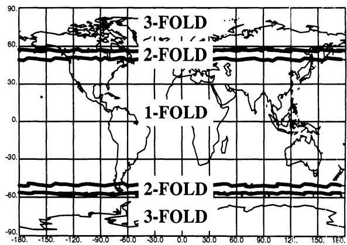  
Figure 5a. SOC 28 Satellites (4×7)
h = 1600 km, i = 90°, El > 0

and even 3-fold coverage is available near the poles for the SOC constellation ( $i = 90^{\circ}$ ). The Walker constellation ( $i = 59.1^{\circ}$ ), by comparison, offers 2-fold coverage in the mid latitudes. The location of the high priority latitudes for the mission could strongly influence the choice of constellation. If the mid latitudes are considered to be the highest priority, then the Walker constellation would be favored.

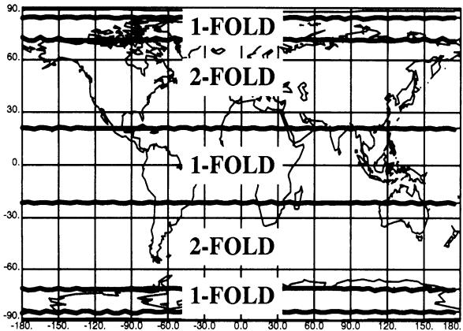  
Figure 5b. Walker 28/7/2 h=1600 km, i=59.1°, El>0

## Consideration 2: Launch Vehicle Capability

The choice of launch vehicle and satellite constellation are strongly related. Because of earth rotation effects, launch vehicle payload capability decreases as the orbital inclination is raised above the latitude of the launch site. Figure 6 shows the orbital inclination of the Walker constellations in comparison to the polar SOC constellations. In general, the

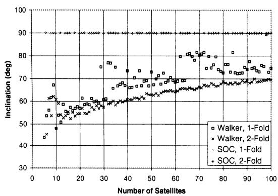  
Figure 6. Inclination for Continuous Global Coverage

inclination of the Walker constellations increases with the number of satellites (as $\theta$ decreases, the inclination must increase to insure coverage at the poles). The higher folds of coverage usually use orbits of lower inclination in the Walker case.

From the standpoint of orbital inclination and launch vehicle payload capability, the lower inclined Walker constellations might be preferred over the polar SOC constellations.

An even more important relationship between the launch vehicle and the constellation occurs when more than one satellite can be placed onto a single launch vehicle. If, for example, three satellites can be lofted atop the launch vehicle, then a compatible constellation would be one with three, or six, or nine, etc. satellites per plane. It is very inefficient to use a single launch vehicle to visit multiple satellite planes. In Figure 7 are displayed all SOC (Table 2) and Walker (Table 3) constellations for continuous 1-fold global coverage which have a multiple of 3 satellites per orbital plane. These would be the best constellations for a launch vehicle which can loft three satellites at a time. In this particular case, Figure 7 shows that the SOC constellations

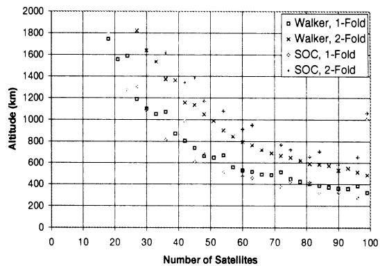  
Figure 7. Constellations with 3N Satellites per Plane

tend to be more efficient for 1-fold coverage, but not for 2-fold coverage. This consideration might consistently favor the SOC constellations which have few planes with many satellites per plane. The relationship between the number of satellites per launch vehicle and the number of satellites per plane (including spares) can be one of the main drivers of the overall system cost. This trade study can be conducted with several different launch vehicles, satellite altitudes, and constellations to arrive at the lowest cost system to perform the mission.

## Consideration 3: Sparing Strategy (Robustness)

Another significant factor in constellation selection is the sparing strategy. The sparing strategy is the method by which satellite failures are accommodated. In the past, several strategies have been identified for replacing failed satellites.

## On-Ground Spare

In this strategy a spare satellite is available on the ground for launch to replace a failed satellite. The primary benefit of this strategy is that the spare satellite is available for testing and improvements up to the time of launch. The drawback is that launch delays can cause long periods of service outage. Replacement times (and service outages) for this method typically are measured in weeks or months.

## On-Orbit, Out-of-Plane Spare

Another strategy is to place a spare satellite into orbit at an altitude different from the constellation altitude (usually lower). Because of differential nodal regression caused by earth oblateness, the plane of the spare satellite sweeps past all the planes in the constellation. When the plane of the spare coincides with the desired plane of the constellation, the spare can be raised to the constellation altitude and phased to the desired location in the plane with little fuel usage. In this manner a single satellite can be used to spare the entire constellation. For LEO applications, where the altitude differences are small, the differential nodal regression rate is also small and the replacement times (and service outages) can be many months.

## On-Orbit, In-Plane Spare

In this popular strategy, a spare satellite is placed into each plane of the constellation. In the event of a failure, the spare satellite is phased into the desired position. With reasonable fuel usage, the replacement can be accomplished in days. A variation on this strategy is to activate the spares and use them as part of the constellation. The constellation might be optimally phased so as to take best advantage of these active spares. In the event of a failure, however, many satellites in the constellation might have to be re-phased.

## Higher Fold of Coverage

With this strategy we optimize the constellation for an extra fold of coverage. If, for instance, 1-fold coverage is required, then the constellation is optimized to provide 2-fold coverage. If a failure occurs, no immediate action is required, since 1-fold coverage is still available. The failed satellite can then be replaced when convenient, with no service outage.

A summary of these robustness strategies is shown in Table 5. Depending on which robustness strategy is selected, we would seek to minimize different parameters in selecting constellations from the tables.

Table 5. Summary of Robustness Strategies

<table><tr><td>Strategy</td><td>Minimize Parameter</td><td>Service Outage months</td><td>Rephasing Required one sat</td></tr><tr><td>On-Ground Spare</td><td>T (total sats)</td><td></td><td></td></tr><tr><td>Out-of-Plane Spare</td><td>T (total sats)</td><td>weeks</td><td>cne sat</td></tr><tr><td>In-Plane Spare</td><td>T+P (total+1 sat/plane)</td><td>days</td><td>one sat (or all if active)</td></tr><tr><td>Higher Fold</td><td>T@ 1-fold higher</td><td>none</td><td>none</td></tr></table>

global coverage for the different robustness strategies. For the “on-ground spare” and “out of plane spare” strategies, the constellation contains T satellites, so we seek constellations of minimum T for 1-fold coverage from the tables. For the “in-plane spare” strategy, we seek constellations with a minimum value of $T+P$ , since there is an additional satellite in each of the P orbital planes. For the “higher fold of coverage” strategy, we want the constellation with the fewest number of satellites T, which offers 2-fold, continuous coverage. Figure 8

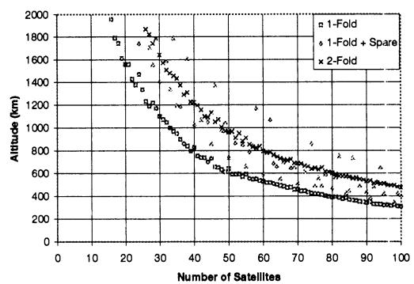  
Figure 8. Three Levels of Constellation Robustness(Walker Constellations, El>0)

shows that while the T (1-fold) and T (2-fold) curves are fairly smooth and well behaved, the $T+P$ (1-fold + spare) curve is much more erratic. Sometimes the $T+P$ curve lies close to the T (1-fold) curve, while other times it lies above the T (2-fold) curve. This means that sometimes providing a spare satellite for each orbital plane is relatively inexpensive, but other times it is more costly than providing double coverage.

## Consideration 4: Crosslinking

In many cases it is required to pass information between the satellites on crosslinks. These crosslinks should be continuously available and not involve making and breaking links throughout the day. For any crosslink to be continuously available, the two satellites which it links must remain close enough together during their orbital motion so that the earth does not obscure the line of sight. Let f be the earth central angle between any two satellites in the constellation. The critical value of earth central angle $(f_{c})$ between the two satellites in order to allow crosslinking can be computed from

$$
\cos \left(\frac {\phi_ {c}}{2}\right) = \frac {r _ {e} + h _ {g}}{r _ {e} + h}\tag{1}
$$

where

$$
\begin{array}{r l} r _ {e} & = \text { earth   radius } \\ h _ {g} & = \text { minimum } \quad \text { graze } \quad \text { altitude } \quad \text { for } \quad \text { the } \\ \text { crosslink } \end{array}
$$

$$
h = \mathrm{satellitealtitude}
$$

As long as $f < f_{c}$ , the crosslink can be achieved. For example, for a satellite altitude of h = 1600 km and a graze altitude of $h_{g} = 130$ km, the satellites must remain within an earth central angle $f_{c} = 70.7^{\circ}$ of each other in order to be crosslinked. For satellites within an orbital plane (in-plane link), there is no relative motion. In this case $f = 360^{\circ}/N$ , where N is the number of satellites in the plane. Each satellite simply points one antenna to the neighbor ahead of it and one antenna to the neighbor behind it in the plane. Gimballing these antennas is not required.

Crosslinks between satellites in different planes (cross-plane links) are not significantly more difficult. Speckman, Lang, and Boyce $^{23}$ have examined the problem of the angular distance between two satellites in common altitude, circular orbits. For orbits with the same inclination (i), the maximum and minimum values of angular separation are given by

$$
\cos \phi_ {\mathrm{max}} = \cos^ {2} (\Delta f / 2) \cos \beta - \sin^ {2} (\Delta f / 2)\tag{2}
$$

$$
\cos \phi_ {\mathrm{min}} = \cos^ {2} (\Delta f / 2) - \sin^ {2} (\Delta f / 2) \cos \beta\tag{3}
$$

where

$$
\begin{array}{r l} & {\cos \beta = \cos^ {2} i + \sin^ {2} i \cos \Delta \Omega} \\ & {\Delta f = \Delta m - 2 \tan^ {- 1} [ - \tan (\Delta \Omega / 2) \cos i ]} \\ & {\Delta \Omega = \mathrm{RAANdifferencebetweensatellites}} \\ & {\Delta m = \mathrm{meananomalydifferencebetweensatellites}} \end{array}
$$

For each pair of satellites in the constellation, the maximum and minimum values of angular separation can be easily computed. Pairs whose maximum value is less than the critical value can maintain a continuous crosslink. A minimum value of angular separation which is too close to zero would generally be unacceptable due to the high gimbal rates during close passages of the two satellites. Using these considerations, acceptable crosslink architectures can be constructed. Figure 9a and b show crosslink architectures for the 28 satellite SOC and Walker constellations examined earlier. These plots display the 28 satellite locations on a phasing (mean anomaly) versus right ascension of ascending node (RAAN) space. Satellites within the same orbital plane show up vertically on this plot, which represents the phasing at an instant in time.

The SOC constellation (Figure 9a) is clearly not symmetric because its planes encompass only a little more than $144^{\circ}$ of RAAN. It has 4 planes of 7 satellites each. Using the method described above, all acceptable (i.e., where the link remains above 130 km altitude) crosslink arrangements for satellite number 10 have been computed and are shown by dashed lines in Figure 9a. Three crosslink options exist for satellite number 10 (or any other satellite). It can link to the satellites ahead of and behind it in the same plane. This creates a loop of seven satellites linked together. It can link to the satellite “ahead and east” (at a higher phasing angle and a higher RAAN) and the satellite “behind and west” in the constellation. This creates a string (not a loop) of four satellites, one from each plane. The third choice is to link with the satellite “ahead and west” and the satellite “behind and east” in the constellation.

Again a string of four satellites, one from each plane, is created. Combinations of these various crosslinks are possible to link all the satellites together.

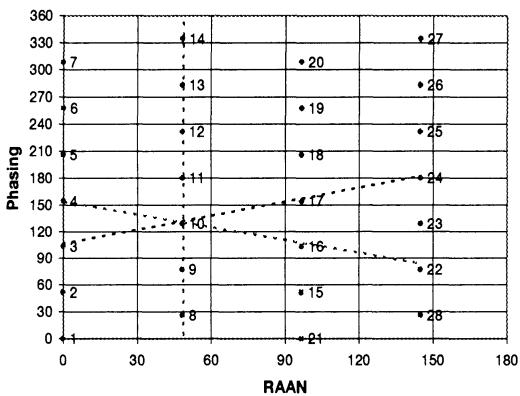  
Figure 9a. Phasing vs RAAN for SOC 28 Satellites (4×7), i=90°

The Walker constellation, by comparison, is fully symmetric. It has 7 planes (RAAN spread through 360°) of 4 satellites each. Crosslink analysis shows that in-plane links are not available in this case. The other two options discussed earlier are acceptable and are indicated by dashed lines in the figure. The “ahead and east” links can be continued through the

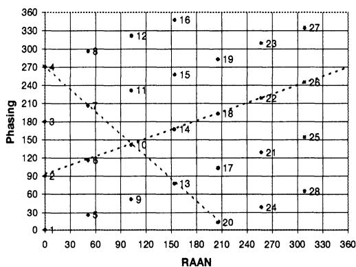  
Figure 9b. Phasing vs RAAN for Walker 28/7/2, $i=59.1^{\circ}$

constellation due to symmetry. In this case all the even numbered satellites can be connected. Two such loops would encompass the entire constellation. The “ahead and west” links, when extended through the constellation are found to include all the satellites in a single long loop. Architectures which link all the satellites in a single continuous loop or in multiple distinct loops are common options.

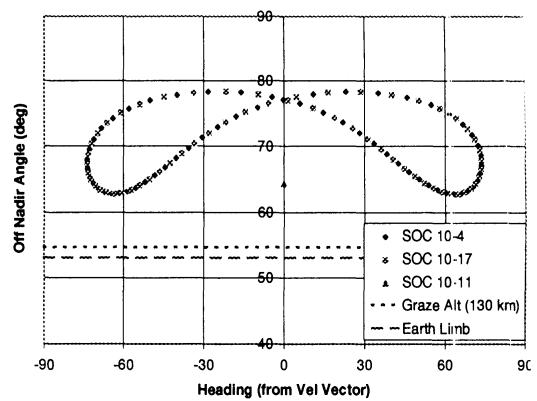

Figure 10a. Crosslink Gimbal Angles for SOC 28 Satellites (4×7), h=1600 km, i=90°  
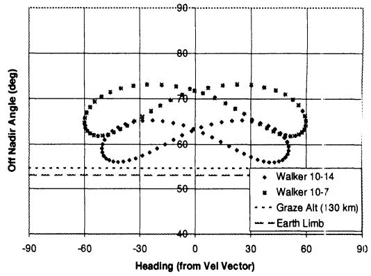  
Figure 10b. Crosslink Gimbal Angles for Walker 28/7/2, h=1600 km, i=59.1°

Figures 10a and 10b show the crosslink gimbal angles for the links discussed above. Figure 10a shows the three types of links for the 28 satellite SOC constellation as seen by satellite 10 of Figure 9a. The gimbal angles of satellites 4 (“ahead and west”), 17 (“ahead and east”), and 11 (ahead, in plane) as seen by satellite 10 are plotted. All links remain well above the earth limb. The “behind..” links would appear the same except centered $180^{\circ}$ from the velocity vector in heading. The in-plane link does not have any relative motion, as expected, and the other two links traverse the same gimbal path, but not at the same time. Figure

10b shows the same data for the 28 satellite Walker constellation. Again, satellite number 10 is taken as the reference satellite. The gimbal angles for satellites 14 (“ahead and east”) and 7 (“ahead and west”) are plotted. The 10-14 link is probably preferred since it remains higher above the earth limb (shorter crosslink range). This is the crosslink strategy which results in two distinct loops (one loop connects all even satellites, the second connects the odd). Again, the “behind..” links would appear the same except centered on $180^{\circ}$ heading.

## Consideration 5: Space Debris Mitigation and Collision Avoidance

In such large constellations of LEO satellites, there may well be concerns over the proliferation of space debris. For LEO orbits it is likely that controlled reentry of the satellites at end-of-life will be required. Some satellite failures, however, may involve loss of control of the satellite before reentry can be commanded. To avoid a buildup of such failed satellites in orbit, it might be wise to select an orbit low enough so that drag will cause the satellite to reenter within 10 (or so) years. A critically inclined, elliptical orbit with perigee in the southern hemisphere (where demand for services is less) might be similarly employed. Another concern would be close approaches by satellites in the same constellation. Any collision between satellites in LEO could trigger a chain reaction of fratricide in the constellation. For this reason, constellations with large miss distances (see calculation of minimum angular separation under crosslinking) would be favored. Constellations with a minimum of relative motion, like those with few orbital planes, might also be favored by this consideration.

## CONCLUSIONS

In the past, researchers using the streets of coverage (SOC) and the Walker method for generating optimal constellations have only published data for the constellations of the minimum total number of satellites. The current paper shows optimal constellations for up to 100 satellites for all numbers of orbital planes for both optimization methods. Data are shown for the problem of continuous global coverage and also continuous zonal coverage of the 65°S to 65°N latitude band for 1- through 4-folds of coverage. A number of considerations in the constellation selection process are examined in which this data are sorted and filtered to obtain constellations yielding the lowest overall system cost. In many cases, these constellations are not simply the ones with the lowest total number of satellites. One obvious example is where the sparing strategy calls for a spare satellite to be placed in each orbital plane. In this case we seek the constellation with the minimum value of $T+P$ (number of satellites plus 1 per plane), rather than T (number of satellites) which can perform the mission. Constellations with few orbital planes are favored in this case. Another example is where the launch vehicle can loft 3 satellites on one launch. Constellations with 3N satellites per plane would be strongly favored in this case to reduce the number of launch vehicles required. In both of these cases, simple sorting and filtering of the tabular data was used to generate favored constellations. More complicated situations can be envisioned with multiple considerations. Consider a launch vehicle which can carry 3 satellites and a sparing strategy of one spare per orbital plane. This problem could also be solved using the tables provided. It is intended that these tables of optimized constellations will offer mission designers greater flexibility in selecting constellations to reduce the overall system cost or to satisfy system linking or debris constraints.

## REFERENCES

1. Lüders, R.D., “Satellite Networks for Continuous Zonal Coverage,” American Rocket Society Journal, Vol. 31, Feb. 1961, pp. 179-84.

2. Lüders, R.D., Ginsberg, L.J., “Continuous Zonal Coverage—A Generalized Analysis,” AIAA Mechanics and Control of Flight Conference, AIAA Paper No. 74-842, Anaheim, CA, Aug. 5-9, 1974.

3. Rider, L., “Analytic Design of Satellite Constellations for Zonal Earth Coverage Using Inclined Circular Orbits,” The Journal of the Astronautical Sciences, Vol. 34, No. 1, Jan.-Mar. 1986, pp. 31-64.

4. Beste, D.C., “Design of Satellite Constellations for Optimal Continuous Coverage,” IEEE Transactions on Aerospace and Electronics Systems, May 1978.

5. Rider, L., “Optimized Polar Orbit Constellations for Redundant Earth Coverage,” The Journal of the Astronautical Sciences, Vol. 33, Apr. - Jun. 1985, pp. 147-161.

6. Adams, W.S. and Rider, L., "Circular Polar Constellations Providing Continuous Single

or Multiple Coverage Above a Specified Latitude," The Journal of the Astronautical Sciences, Vol. 35, No. 2, Apr.-Jun. 1987, pp. 155-192.

7. Walker, J.G., “Circular Orbit Patterns Providing Continuous Whole Earth Coverage,” Royal Aircraft Establishment Technical Report 70211, Nov. 1970.

8. Walker, J.G., “Some Circular Orbit Patterns Providing Continuous Whole Earth Coverage,” J. British Interplanetary Society, Vol. 24, 1971, pp. 369-384.

9. Walker, J.G., “Continuous Whole Earth Coverage by Circular Orbit Satellites,” Royal Aircraft Establishment Technical Memorandum Space 194, Apr. 1973.

10. Walker, J.G., “Continuous Whole Earth Coverage by Circular Orbit Satellite Patterns,” Royal Aircraft Establishment Technical Report 77044, Mar. 1977.

11. Walker, J.G., “Satellite Patterns for Continuous Multiple Whole-Earth Coverage,” Maritime and Aeronautical Satellite Communication and Navigation, IEEE Conference Publication 160, Mar. 1978, pp 119-122,.

12. Walker, J.G., “Coverage Predictions and Selection Criteria for Satellite Constellations,” Royal Aircraft Establishment Technical Report 82116, Dec. 1982.

13. Mozhaev, G.V., “The Problem of Continuous Earth Coverage and Kinematically Regular Satellite Networks, I,” Kosmicheskie Issledovaniya, Vol. 10, No. 6, Nov.-Dec. 1972, pp. 833-840.

14. Mozhaev, G.V., “The Problem of Continuous Earth Coverage and Kinematically Regular Satellite Networks, II,” Kosmicheskie Issledovaniya, Vol. 11, No. 1, Jan.-Feb. 1973, pp. 59-69. Translated in Cosmic Research, Vol. 11, No. 1, Jan-Feb. 1973, pp. 52-61.

15. Ballard, A.H., “Rosette Constellations of Earth Satellites,” IEEE Transactions on Aerospace and Electronic Systems, Vol. AES-16, No. 5, Sep. 1980, pp. 656-673.

16. Lang, T.J., "Symmetric Circular Orbit Satellite Constellations for Continuous

Global Coverage," paper AAS 87-499, AAS/AIAA Astrodynamics Specialist Conference, Kalispell, Montana, Aug. 10-13, 1987.

17. Lang, T.J., “Optimal Low Earth Orbit Constellations for Continuous Global Coverage,” paper AAS 93-597, AAS/AIAA Astrodynamics Specialist Conference, Victoria, B.C., Canada, Aug. 16-19, 1993.

18. Draim, J.E., “Three- and Four-Satellite Continuous Coverage Constellations,” AIAA Journal of Guidance, Control, and Dynamics, Vol. 6, Nov-Dec. 1985, pp. 725-730.

19. Draim, J.E., “A Common Period Four-Satellite Continuous Global Coverage Constellation,” AIAA preprint 86-2066-CP, AIAA/AAS Astrodynamics Conference, Williamsburg, VA, Aug. 18-20, 1986.

20. Draim, J.E., “A Six Satellite Continuous Global Double Coverage Constellation,” paper AAS 87-497, AAS/AIAA Astrodynamics Specialist Conference, Kalispell, Montana, Aug. 10-13, 1987.

21. Draim, J.E., “Continuous Global N-Tuple Coverage with (2N+2) Satellites,” Journal of Guidance, Control, and Dynamics, Jan.-Feb. 1991.

22. Lang, T.J., "Low Earth Orbit Satellite Constellations for Continuous Coverage of the Mid-Latitudes," paper AIAA-96-3638, AIAA/AAS Astrodynamics Specialist Conference, San Diego, California, July 29-31, 1996.

23. Speckman, L.E., Lang, T.J., Boyce, W.H., "An Analysis of the Line of Sight Vector Between Two Satellites in Common Altitude Circular Orbits," paper AIAA 90-2988, AIAA/AAS Astrodynamics Conference, Portland, Oregon, Aug. 20-22, 1990.

24. Lang, T.J., “Conjunction/Interference Between LEO and GEO Comsats.” paper AAS 97-668, AAS/AIAA Astrodynamics Conference, Sun Valley, Idaho, Aug. 4-7, 1997.