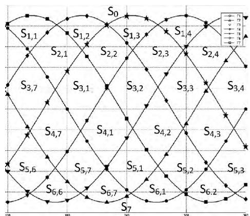
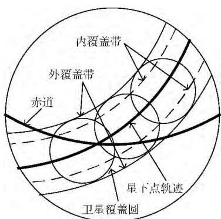
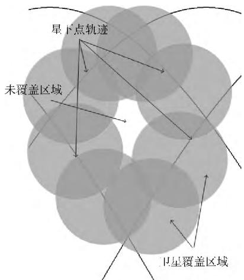
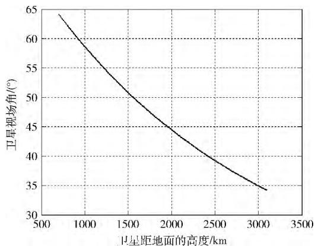
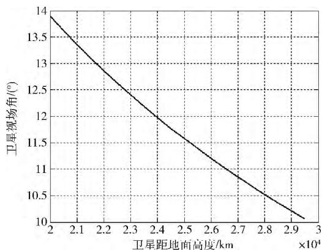
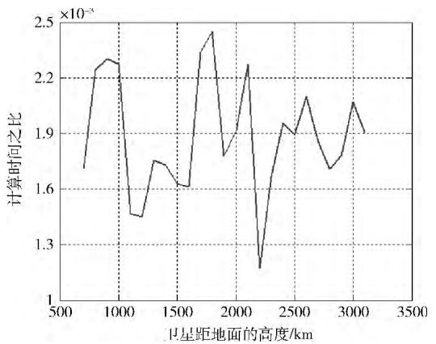
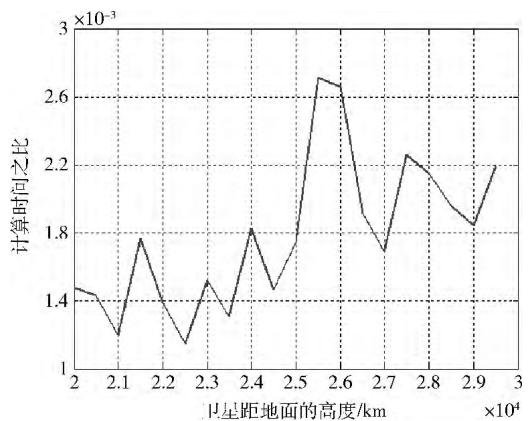

# Walker星座区域覆盖理论分析

宋志明 ， 戴光明＋ ， 王茂才 ， 彭 雷

（中国地质大学（武汉） 计算机学院 ， 湖北 武汉430074）

摘 要 ： 针对 $\mathrm { W a l k e r }$ 星座对纬度带目标或者全球目标的持续性覆盖问题 提出一组判定定理 得到一套求解该问题的方法 利用 Walker自身的对称性得到需要进行覆盖分析的最小时段 利用卫星星下点轨迹的拓扑关系得到其对地球表面的一个划分 得到需要分析的最小区域 ； 利用覆盖带方法求得对需要分析区域的覆盖的必要条件和充分条件 ； 得到一个关于连续性单重覆盖和 N重覆盖的充要条件 数值仿真结果表明 该套方法计算结果精确 计算效率较高

关键词 Walker星座 区域目标 卫星 区域划分 多重覆盖 持续性覆盖

中图法分类号 ： TP39 文献标识号 ： A 文章编号 ： 1000－7024 （2014） 10－3639－06

# TheoreticalanalysisofWalkerconstellationcoveragetoareatarget

SONGZhi－ming DAIGuang－ming＋ WANGMao－cai PENGLei

（ComputerCollege， ChinaUniversityofGeosciences， Wuhan430074， China）

Abstract TosolvetheproblemofWalkerconstellation’scontinuouscoverageonzonaltargetorglobaltarget agroupofjudg menttheoremwasputforward andamethodforsolvingtheproblemwasgiven．Firstly thesymmetryofWalkerconstellation wasusedtogettheminimumperiodoftimewhichneedtobeanalyzed．Thenaccordingtothetopologicalrelationsofthesatel litessub－traces adivisionoftheearthsurfacewasfound andtheminimumareathatneedtobeanalyzedwasgotten．Andthen anecessaryconditionandasufficientconditionoftheminimumarea’scoveragewerebroughtforward．Atlast anecessaryand sufficientconditionforcontinuoussinglecoverageandNlevelcoveragewasgiven．Thesimulationresultsshowthatthismethod hasaccuratecalculationresultandhighcomputationalefficiency

Keywords： Walkerconstellation； regionaltarget； satellite； areadivision； multiplecoverage； continuouscoverage

## 0 引 言

星座对区域的覆盖理论是指星座对区域的与覆盖相关的方法 判定定理 以及实现某种覆盖特性下的星座设计方法等。一般而言，一套覆盖理论往往只针对一类特定的［1，2］

对于覆盖理论 最常用的方法是网格点法［3，4］ 该方法是将区域按照某种规则划分为若干个网格点 通过卫星对网格点的覆盖情况来表示对整个网格的覆盖情况 从而计算对整个区域的覆盖情况 网格点可以对任何星座的任何区域进行覆盖 但网格点法的主要缺点是计算效率较低且无法得到对星座设计的一些指导性信息

覆盖理论中最经典方法有球面三角形外接圆法［5］ 与覆盖带法［6，7］ 球面三角形外接圆法可以针对具有相同半长轴和偏心率的卫星组成的星座对全球连续性覆盖进行分析，但效率较低 且只能用于圆形覆盖区域 覆盖带法在分析极轨道星座连续性覆盖问题上取得重要的成果 可以分析同构星座的全球或者纬度带连续性覆盖情况

文献 ［8］ 中采用一种基于概率的方法 可以针对具有相同半长轴和偏心率的非回归星座对区域的平均覆盖性能进行分析 但该方法对瞬时覆盖性能的评估不能求解flower星座的设计方法提供了一种针对回归轨道星座的共［9，10］ ［2］座或者同构星座的连续性或者间断性纬度带覆盖理论 但设计结果要求一颗卫星的覆盖区域就能够对区域完全覆盖使得设计方法在实际应有中受到一定限制

20世纪70年代 Walker星座的概念被提出 因为其具有良好的全球与纬度带覆盖性能而被许多大型星座系统所采用 如GPS全球导航系统 Galileo导航系统 Iridium系统和Globalstar系统［11］ 因此对 Walker星座覆盖性能的分析有重要意义

本文主要是对 Walker星座对全球或者纬度带的覆盖性能进行分析 得到一系列判定定理 以及一套求解方法使得在计算 Walker星座对地覆盖的过程大大简化

## 1 Walker星座概述

Walker星座可以由3个参数表示 $T / P / F$ 表示卫星总数 表示轨道面个数 其中 必须为 的因子表示相位参数 用来表征当一条轨道上的卫星恰好过升交点时 其右侧的一条轨道上的卫星的纬度幅角大小

对于以赤道作为参考平面的一个 Walker星座 ， 假设第一条轨道面上的升交点赤经为 $\Omega _ { 0 }$ 初始时刻该轨道面上命名一颗卫星为第一颗卫星 该卫星的初始相位为 $u _ { 0 }$ 则星座中第 条轨道面 （基于1索引） 上第 颗卫星 其升交点赤经 $\Omega$ 和相位 $u$ 分别为

$$
\left\{ \begin{array}{l} \Omega = \Omega_ {0} + (i - 1) \frac {2 \pi}{P} \\ u = u _ {0} + (i - 1) F \frac {2 \pi}{T} + (j - 1) P \frac {2 \pi}{T} \end{array} \right.\tag{1}
$$

Walker星座有一个优点是星座中每颗卫星受到的长期摄动项的主要因素相同 因此星座相对几何构型可以在较长时间内保持不变

对于 Walker星座 ， 常用到星座基本单位 （PU） 的概念 PU的定义如下

$$
P U = 2 \pi / T\tag{2}
$$

## 2 Walker星座覆盖理论

仿真时段为 $[ t S , t E ]$ Walker星座命名为 地面纬度带目标 （或者全球目标） 命名为 则对 ［ ］ 时段内卫星星座 对地面纬度带目标 的持续性覆盖情况进行分析

定理1性覆盖 那么在不考虑地球自转的情况下 星座对该目标也能够持续性覆盖 反之亦然

证明 ：

必要性 采用反证法 假设在不考虑地球自转的情况下，卫星星座不能够对目标提供持续性覆盖，必然3 $P \in$ $Z ~ , ~ \exists t \in [ t S , t E ]$ 在 时刻卫星星座 不能对 点进行覆盖 由于纬度带或者全球目标的旋转不变性 则 $\exists Q \in Z$ 在考虑地球自转时的点重合 则在考虑地球自转时卫星星座不能够覆盖 点 这与星座能够对目标提供持续性覆盖相矛盾 故假设不成立

充分性的证明同必要性证明 略

则根据定理1 如果要分析星座对全球或者某个纬度带的持续性覆盖情况 只需要分析星座对天球系下纬度带的持续性覆盖情况即可 即地球自转不会对纬度区间内的持续性覆盖情况有影响

定理1等价描述是 星座整体旋转任意一个角度后星座对目标的持续性覆盖特性不变 即星座是否对目标覆盖只取决于星座中各个卫星的相对位置 一种特定的卫星相互位置称为星座的一种覆盖模式 如果2个覆盖模式可以通过旋转或者对称变换相互转换 则称这2个全球覆盖模式相等

则对于 $\mathrm { W a l k e r }$ 星座有以下结论［12］ ：

定理2 如果 Walker星座中卫星总数 T为奇数 则星座的覆盖模式的最小变化周期是 ／4， 当星座中卫星总数T为偶数时 ， 星座的覆盖模式的最小变化周期是 ／2

则根据定理2 则要分析卫星对地面的持续性覆盖问题如果卫星总数为奇数 只需要分析只需要分析长度为 ／4的一个时间段即可 如果卫星总数为偶数 只需要分析长度为 ／2的一个时间段即可 这个时间段称之为特征时段

## 3 星座星下点对地球表面划分区域分析

对于一个由 $P$ 个轨道面的 Walker星座 在天球下投影到地球表面上可以得到 条星下点轨迹 将 条星下点轨迹分别命名为 $\Gamma _ { 1 } \sim \Gamma _ { P }$

对于有 个轨道面的 Walker星座 轨道面相互交错将整个天球划分为若干个区域 这些区域称为划分区域经过分析可知 天球系下 除去南极区域和北极区域 $P$ 个星下点轨迹在将地球划分为 －1层区域

将北极区域编号为第0层区域 南极区域则为第 层区域 其它依次编号为第1层到第 －1层 将北极区域命名为 南极区域命名为 $S _ { P }$ 对于除去南北极外的 －1层区域 中间的 $P -$ －1层划分区域每层都由 个划分区域组成 将第 层以 $\Gamma _ { k }$ 为左侧下降段的划分区域命名为 $S _ { j , k }$ 则第一层区域被记做 $S _ { 1 , 1 } ~ , ~ S _ { 1 , 2 } ~ \cdots , ~ S _ { 1 , P }$ 第二层区域被记做 $S _ { 2 , 1 } ~ , ~ S _ { 2 , 2 } ~ \cdots , ~ S _ { 2 , P }$ 如图1所示 为7个轨道面的Walker星座星下点轨迹对全球区域的划分。

  
图1 卫星星下点对全球区域的划分

第1层和第 －1层划分区域由3条星下点围绕而成区域 $S _ { 1 , k }$ 为相邻的3条星下点轨迹 $\Gamma _ { k } ~ , ~ \Gamma _ { k + 1 }$ 和 $\Gamma _ { k + }$ 2 围成的区域 区域 $S _ { P - 1 , k }$ 也为3条相邻的星下点轨迹 $\Gamma _ { k - 1 } \setminus \Gamma _ { k }$ 和$\Gamma _ { k + 1 }$ 围成的区域 其余层划分区域由4条星下点组成 ， 当$1 < j < P - 1$ 时 ， $S _ { j , k }$ 是由 $\Gamma _ { k } ~ , ~ \Gamma _ { k + 1 }$ 与 $\Gamma _ { j + k } ~ , ~ \Gamma _ { j + k + 1 }$ 这4条星下点围成的区域 则可知 第1层和第 $P - 1$ 层区域与$1 < j < P - 1$ 层区域满足相同的规律 则在以下分析中对第1层 第 $P - 1$ 层区域与 $1 < j < P - 1$ 层区域统一考虑不做区分

2条星下点轨迹如果相交 则必然为一个星下点轨迹的下降段和另一个星下点轨迹的上升段相交 而不可能是2个星下点轨迹在上升段相交 或者2个星下点轨迹在下降段相交 ， 则将下降段星下点轨迹 $\Gamma _ { m }$ 与上升段Γ 的交点命名 为 $V _ { m , n }$ 。 则 区 域 $S _ { j , \ast }$ 由 $V _ { k , k + j } ~ , ~ V _ { k + 1 , k + j } ~ , ~ V _ { k , k + j + 1 }$ 和$V _ { k + 1 , k + j + 1 }$ 这4个顶点组成

对 Walker星座 每条星下点的升交点赤经已知 假设Γ 的升交点赤经为 $\Omega _ { n }$ ， Γ 的升交点赤经为 $\Omega _ { m }$ 。 $\Gamma _ { n }$ 与 $\Gamma _ { m }$ 这2条星下点轨迹的交点经纬度为 $( \sigma , \phi )$ 则由球面三角形基本公式

$$
\begin{array}{c} \sin (\sigma - \Omega_ {n}) = \tan \phi / \tan i \\ \sin (\sigma - \Omega_ {m}) = \tan \phi / \tan i \\ \sin \phi = \sin i \sin \psi \end{array}
$$

其中

（3）

（4）

$$
\Omega_ {m} - \Omega_ {n} = \frac {2 (m - n) \pi}{P}\tag{5}
$$

则

$$
\left\{ \begin{array}{l} \sigma = \frac {\pi}{2} + \Omega_ {n} + \frac {(m - n) \pi}{P} \\ \phi = \tan^ {- 1} \left[ \cos \left(\frac {m - n}{P} \pi\right) \tan i \right] \end{array} \right.\tag{6}
$$

或者

$$
\left\{ \begin{array}{l} \sigma = \frac {3 \pi}{2} + \Omega_ {n} + \frac {(m - n) \pi}{P} \\ \phi = - \tan^ {- 1} \left[ \cos \left(\frac {m - n}{P} \pi\right) \tan i \right] \end{array} \right.\tag{7}
$$

假设 $n < m$ 通过式 （6） 计算出的交点经纬度对应于$V _ { n , m }$ 通过式 （7） 计算出的交点经纬度对应于 $V _ { m , n }$

## 4 卫星星座对特征区域覆盖理论

卫星星座为 Walker星座 具有较好的对称性 因此被卫星星座的星下点轨迹划分出的区域 首先 同一层的所有区域是全等的 比如 $S _ { 1 , 1 } ~ , ~ S _ { 1 , 2 } ~ \cdots , ~ S _ { 1 , P }$ 这 个区域是全等的 $S _ { 2 , 1 } ~ , ~ S _ { 2 , 2 } ~ , ~ \cdots , ~ S _ { 2 , P }$ 这 $P$ 个区域也是全等的其次 第 层区域与倒数第 层区域是全等的 即如果$m + n = P$ ，则 $S _ { m , i }$ 与 $S _ { n , i }$ 是2个全等的图形 则可知 如果 $m + n = P , S _ { m , 1 } , S _ { m , 2 }  \cdots \cdots , S _ { m , N } , S _ { n , 1 } , S _ { n , 2 } \cdots \cdots , S _ { n , N }$ 这 $2 P$ 个区域是全等的

对于被星下点轨迹划分出的2个全等的区域 有以下结论

定理3 如果对卫星星座对 $S _ { m , 1 }$ 能够实现持续性覆盖则卫星星座必然也能对被星下点划分出的与 $S _ { m , 1 }$ 全等的区域也能够实现持续性覆盖

证明 ： 区域 $S _ { m , 1 }$ 由 $\Gamma _ { 1 } \ , \ \Gamma _ { 2 }$ 与 $\Gamma _ { m + 1 }$ $\Gamma _ { m + 2 }$ 这4条星下点围成的区域 ， 与 $S _ { m , 1 }$ 全等的区域为 $S _ { m , j }$ 与 $S _ { n , k }$ ， 其中 $m +$ $n = P _ { \circ } S _ { m , j }$ 是由 $\Gamma _ { j } \mathrm { ~ . ~ } \Gamma _ { j + 1 }$ 与 $\Gamma _ { m + j } \setminus \Gamma _ { m + j + 1 }$ 这4条星下点围绕而成的区域 $S _ { n }$ 是由 $\Gamma _ { k } ~ , ~ \Gamma _ { k + 1 }$ 与 $\Gamma _ { n + k } ~ , ~ \Gamma _ { n + k + 1 }$ 。 根 据$W a l k e r$ 几何构型特征可知 当 $\Gamma _ { 1 } \ \cdot \ \Gamma _ { j }$ 和 $\Gamma _ { n - }$ 上一颗卫星相位相等时 $\Gamma _ { 2 } \mathrm { ~ } , \Gamma _ { j + }$ 1 和 $\Gamma _ { n + k + 1 }$ 上对应卫星的相位相等 ， $\Gamma _ { m + 1 } \setminus$ $\Gamma _ { m + j }$ 和 $\Gamma _ { k }$ 上对应卫星的相位相等 ， $\Gamma _ { m + 2 } ~ , ~ \Gamma _ { m + j + 1 }$ 1 和 $\Gamma _ { n + k + 1 }$ 上对应卫星的相位相等 则对任意时刻 $t$ 必然存在一个时刻 $t ^ { ' }$ 使得星座在时刻 对 $S _ { m , j }$ 或 $S _ { n , k }$ 的覆盖情况 与时刻$t ^ { ' }$ 下卫星星座对区域 $S _ { m , 1 }$ 的覆盖情况一致 由于对任意时刻 卫星星座对区域 $S _ { m } ,$ 1 都能完全覆盖 则任意时刻卫星星座对区域 $S _ { m , j }$ 或 $S _ { n , k }$ 也能完全覆盖 由3条星下点围成的区域可以认为是4条星下点围成区域的特例 证明方法相同 命题得证

则根据定理3 则要分析对全球的覆盖情况 只需要分析卫星星座对区域 $\begin{array} { r l } { S _ { 0 } } & { { } , S _ { 1 , 1 } \quad , S _ { 2 , 1 } \quad , \cdots \quad , S _ { A } , } \end{array}$ 1 的覆盖情况即可 ， 其中 ， $A = \left\lceil ( P - 1 ) / 2 \right\rceil$ 将这些 $A + 1$ 个相互之间不全等的区域命名为特征区域

对同一轨道面上覆盖带进行分析 如图2所示 将该轨道上卫星的覆盖带分为内覆盖带和外覆盖带 内覆盖带表示在任意时刻该轨道面上卫星都能覆盖的区域的集合外覆盖带表示存在一个时刻该轨道面上卫星能够覆盖的区域的集合 同轨道上相邻的2颗卫星覆盖范围的交点称为同轨覆盖圆交点

  
图2 卫星内外覆盖带

2条外覆盖带之间的球面距离叫做外覆盖带宽度 它等于卫星幅宽对应的地心角，即 $2 \alpha$ ，2条内覆盖带之间的球面距离叫做内覆盖带宽度 即2 的大小是由 和2颗相邻卫星之间的相位差 $\Delta u$ 决定 由球面三角形基本公式

$$
\left\{ \begin{array}{l} c = 0, \quad i f \Delta u \geqslant 2 \alpha \\ c = \cos^ {- 1} \left(\frac {\cos \alpha}{\cos (\Delta u / 2)}\right) \end{array} , e l s e \right.\tag{8}
$$

则可知 ， 要通过 $W a l k e r$ 星座实现对地面目标的持续覆盖的一个必要条件是 ： 内覆盖带宽度大于0， 即 $\Delta u \geqslant 2 \alpha$

对一个特定的特征区域进行分析 特征区域内的一点到特征区域边界的距离定义为到所有边界距离的最小值记为 $d _ { Q }$ 则在特征区域中必然存在一点 ， 该点到特征区域边界的距离最大 将该点称为球面多边形的最大距离点最大距离点 到区域边界的距离即为 $d _ { P }$ 则可知 对于北极区域 北极点必然是最大距离点 对于其它特征区域由定理2 该区域是左右对称的 则最大距离点必然在该特征区域的对称轴上

如果目标为全球范围 对于北极区域 最大距离点即为北极点 对于其它区域 最大距离点为该球面三角形或者球面四边形的每个角的垂直平分面的交点 可以证明左右球面三角形与左右对称的球面四边形每个角的垂直平分面的交点是相交于同一点的 即最大距离点 如果目标为纬度带范围 则仍然先计算出每个角的垂直平分面的交点 如果该点落在纬度带范围内 则该点即为最大距离点否则如果是一般区域 最大距离点为纬度带边界与特征区域的对称轴 北极区域则取任意一个角的垂直平分面与纬度带边界的交点

则有以下结论

定理4 卫星星座对特征区域 能够持续性覆盖的充分条件是 最大距离点 到特征区域边界的距离小于内覆盖带宽度的一半 即 $d _ { P } < c$

证明 如果在满足 $d _ { P } <$ 的情况下 $\exists Q \in S$ 且 点不能被持续覆盖 则 点不属于任何特征区域 的边界的内覆盖带 则由内覆盖带的定义可知 $d _ { Q } > c > d _ { P }$ 这与点为最大距离点相矛盾 故假设不成立 命题得证

定理5 卫星星座对特征区域 能够持续性覆盖的必要条件是 最大距离点 到特征区域边界的距离小于外覆盖带宽度的一半 即 $d _ { P } < \alpha$

证明 如果卫星星座对特征区域 能够持续性覆盖且 $d _ { P } > \alpha$ 则对任意时刻 卫星星座都不能覆盖 点 则卫星星座不能对特征区域S持续性覆盖，故假设不成立。命题得证

定理6 卫星星座对特征区域 能够持续性覆盖的充分必要条件是 如果2颗卫星的覆盖圆交点落在区域 内那么该点必然被另外一颗卫星覆盖

证明 ：

必要性 假设卫星星座对区域 能够持续性覆盖 但是存在2颗卫星的覆盖圆交点落在区域 内且未被另外一颗卫星覆盖 由于该覆盖圆交点是区域 的内点 则存在一个该点的临域 属于区域 同时由于该点是2个覆盖边界的交点 则对该交点的临域 都存在不能被这2颗卫星覆盖的点 则该点不能被任何卫星覆盖 这与假设矛盾。

充分性 假设所有落在区域 内的卫星覆盖圆交点必然被另外一颗卫星覆盖 但是卫星星座对特征区域 不能够完全区域 对于未覆盖区域 如图3所示 未覆盖区域的顶点必然由2颗卫星的覆盖圆交点组成 而且该交点在区域内部且不被另外一颗卫星覆盖 故假设不成立

命题得证。

  
图3 星座对区域有覆盖缝隙

根据定理6，则可以将卫星星座对特征区域S的持续性覆盖问题变为对几个点的持续性覆盖问题 因此会导致问题的计算复杂度大幅度下降

定理7卫星星座对特征区域 S 能够N重持续性覆盖的充分必要条件是 如果2颗卫星的覆盖圆交点落在区域内 那么该点必然被另外 颗卫星覆盖

证明方式同定理6的证明 ， 略

## 5 数值仿真

为验证试验结果，设计如下数值仿真试验

算例1 区域目标选择中国内陆所在的经纬度范围 即由18 与54 这2条纬线 以及73 和135 这2条经线之间的区域 卫星星座为星座构型40／4／3的 星座2013 1 1 00 00 00 （UTCG）真结束时间为2013年1月2日00 00 00 （UTCG） 仿真时长为24小时 已知卫星距地面的高度 要使得该 $W a l k e r$ 星座对区域在仿真时段内任意时刻都能达到无缝覆盖（1重） 卫星上自带传感器需要的视场角是多少

则要达到全球一重持续性覆盖时半长轴与最小观测仰角之间的关系如图4所示

则要由图4可知 随着卫星距地面高度增加 卫星要实现对纬度带的连续性覆盖需要的视场角逐渐减小

  
图4 40／4／3构型 Walker星座对区域  
单重覆盖时半长轴与最小观测仰角关系

算例2 卫星星座为星座构型18／3／0的 Walker星座仿真开始时间为2013年1月1日00： 00： 00 （UTCG） ，仿真结束时间为2013年1月1日06 00 00 （UTCG）仿真时长为6小时 已知卫星距地面的高度 要使得该Walker星座对全球在仿真时段内任意时刻都能达到4重覆盖 卫星上自带传感器需要的最小观测仰角多少

则要达到全球一重持续性覆盖时半长轴与最小观测仰角之间的关系如图5所示

  
图5 18／3／0构型 Walker星座对全球  
四重覆盖时半长轴与最小观测仰角关系

则要达到全球4重连续性覆盖时卫星距地面的高度与 最小观测仰角之间的关系如图5所示

图6 和图 7表示的是算例1与算例 2 情况下本文算法计算时间与经典网格点法的计算时间之比 网格点法的网格精度选择1km×1km 则可知 随着高度增加 2种算法计算时间比无明显的变化趋势 计算时间比在1．0×10－3到3．0×10－3之间 即计算时间可减少超过99．7％到99．9％之间 而且该算法的计算效率与网格点精度无关 则由网格点法特性可知 当要求更高的计算精度时 计算时间的减少比例可进一步增大 因此该算法具有较高的计算效率

  
图6 40／4／3构型 Walker星座2种算法计算时间比

  
图7 18／3／0构型 Walker星座2种算法计算时间比

## 6 结束语

本文针对 Walker星座对纬度带或者全球目标的连续性覆盖问题进行分析 利用 Walker自身的对称性得到特征时段 然后利用卫星星下点轨迹的拓扑关系得到其对地球表面的一个划分 得到特征区域 并得到结论 星座在一个时间段内对纬度带或者全球的覆盖问题可以转化为在特征时段内对特征区域的覆盖问题 同时 对星座对特征区域的覆盖特性进行分析 以覆盖带法为核心 得到对特征区域覆盖的必要条件和充分条件 最后给出一个判定星座一重连续性覆盖和多重连续性覆盖的充要条件

本文得到的结论 可以作为 Walker星座覆盖理论的一个重要补充 对星座设计与覆盖分析都有重要的指导意义

通过仿真实验对一系列判定定理和该问题的求解方法进行验证 ， 与传统网格点法想比较 ， 2种方法在计算结果上保持一致 可表明该算法的正确性 同时该算法计算效率较高

但相比网格点法之类的数值仿真方法而言，该方法只能判断是否完全覆盖 对于不能完全覆盖的情况 并不能得到覆盖率的结果 因此 通过对问题进行进一步研究使得算法不仅能够判定是否完全覆盖 同时还可以进行覆盖率计算 是下一步要进行的工作

## 参考文献 ：

［1］ HalimZ．PerformanceanalysisandroutingtechniquesinLEOsatellitesystems ［J］．IU－JournalofElectrical＆ ElectronicsEngineering， 2011， 5 （2） ： 1363－1372

［2］ UlybyshevY．Satelliteconstellationdesignforcomplexcove－ rage ［J］．JournalofSpacecraftandRockets 2008 45 （4） 843－849

［3］ JIAN Ping ZOU Peng XIONG Wei etal．ImprovedgridmethodforanalysisoncoverageperformanceofstaringsensorsbasedLEO ［J］．JournalofAirForceEngineeringUniversity（NaturalScience） 2012 13 （3） 35－39 （inChinese）． ［简平 邹鹏 熊伟 等．改进的低轨凝视传感器覆盖性能网格分析方法 ［J］．空军工程大学学报 （自然科学版） 2012 13（3） ： 35－39．］

［4］ Jiang Y YangS ZhangG etal．Coverageperformancesanalysisoncombined－GEO－IGSO satelliteconstellation ［J］JournalofElectronics（China） ， 2011， 28 （2） ： 228－234

［5］ WalkerJG．Coveragepredictionsandselectioncriteriaforsatellite constellations ［R］．NASASTI／ReconTechnicalReportN 1982

［6］ WUTingyong WUShiqi．Researchonthedesignoforthogo－nalcircularorbitsatelliteconstellation ［J］．SystemsEnginee－ringand Electronics 2008 30 （10） 1966－1972 （in Chi－nese）． ［吴廷勇 吴诗其．正交圆轨道星座设计方法研究

（上接第3557页）

［7］ HUANG Guo CHEN Qingli XU Li etal．Realizationof adaptiveimageenhancementwithvariablefractionalorderdiffe－ rential ［J］．JournalofShenyang University of Technology， 2012 34 （4） 446－454 （inChinese）． ［黄果 陈庆利 许 黎 等．可变阶次分数阶微分实现图像自适应增强 ［J］．沈阳 工业大学学报 2012 34 （4） 446454．］

［8］ CHEN Qingli HUANGGuo SUNRui etal．ARiemann Liouvillefractionaldifferentialimageenhancementalgorithm basedonhumanvisualcharacteristics ［J］．JournalofSichuan University （EngineeringScienceEdition） 2012 44 （1） 99 105 （inChinese）．［陈庆利 黄果 孙锐 等．基于视觉特性 的RiemannLiouville分数阶图像增强 ［J］．四川大学学报 （工

［J］．系统工程与电子技术 ， 2008， 30 （10） ： 1966－1972．］

［7］ GAO Huameng XU Xiaohan．Designofregionalcoveragesate－lliteconstellationbasedonanalyticalmethod ［J］．ModernDefenseTechnology， 2012， 40 （2） ： 24－26 （inChinese）． ［高化猛， 徐晓晗．解析法区域覆盖卫星星座设计 ［J］．现代防御技术，2012 40 （2） 2426．］

［8］ SeyediY SafaviSM．OntheanalysisofrandomcoveragetimeinmobileLEOsatellitecommunications ［J］．CommunicationsLetters， IEEE， 2012， 16 （5） ： 612－615

［9］ MortariD DeSanctisM LucenteM．Designofflowercon－stellationsfortelecommunicationservices ［J］．ProceedingsoftheIEEE 2011 99 （11） ： 2008－2019

［10］ AvendaoME DavisJJ MortariD．The2－Dlatticetheory offlowerconstellations ［J］．CelestialMechanicsandDynami－ calAstronomy 2013 1－13

［11］ YANGXiaolong LIUZhonghan．Walker－δconstellationcon－figuration maintenancebasedoncoverageperformance ［J］AerospaceControland Application 2012 38 （2） 53－57（inChinese）． ［杨晓龙 刘忠汉．基于覆盖性能的 Walker－δ星座构型保持 ［J］．空间控制技术与应用 2012 38 （2） ：53－57．］

［12］ BAIHefeng．Theresearchofanalysisandcontrolmethodforsatelliteconstellationdesign ［D］．Changsha NationalUni－versityofDefenseTechnology 1999 20－22 （inChinese）［白鹤峰．卫星星座的分析设计与控制方法研究 ［D］．长沙国防科技大学 1999 2022．］

程科学版） 2012 44 （1） 99－105．］

［9］ ZHANG Yong PU Yifei ZHOU Jiliu．Imageenhancementmasksbasedonfractionaldifferential ［J］．ApplicationResearchofComputers 2012 29 （8） 3195－3197 （inChinese）． ［张涌 蒲亦非 周激流．基于分数阶微分的图像增强模板 ［J］计算机应用研究 2012 29 （8） 3195－3197．］

［10］ ZHOUJiliu PU Yifei LIAO Ke．Thetheoryofthefrac－tionalcalculusandtheapplicationinmodernsignalanalysisandprocessing ［M］．Beijing SciencePress 2010 （inChinese）「周激流，薄亦非，廖科，分数阶微积分原理及其在现代信号分析与处理中的应用 ［M］．北京 科学出版社 2010．］