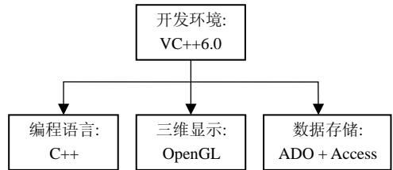
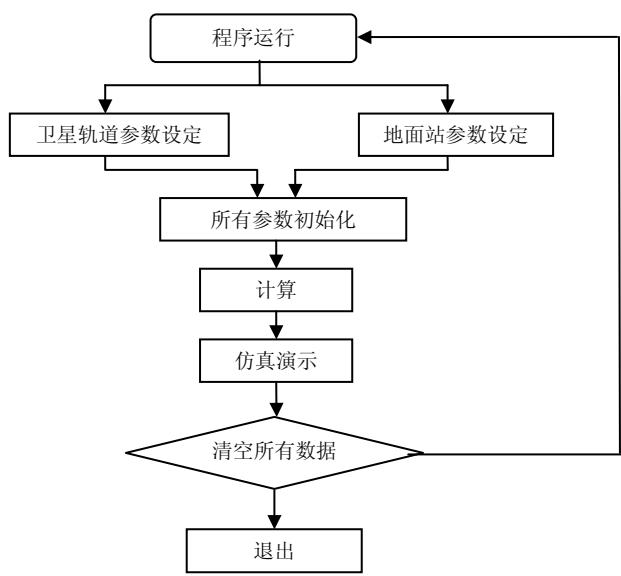
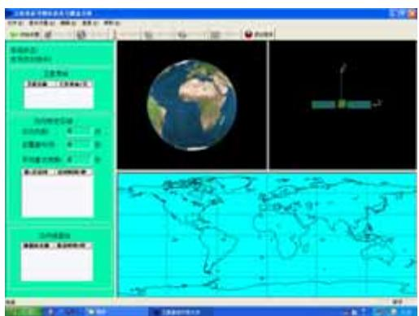
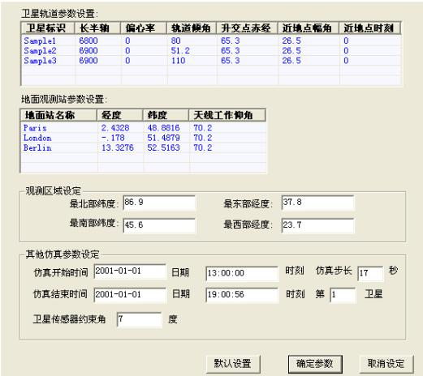
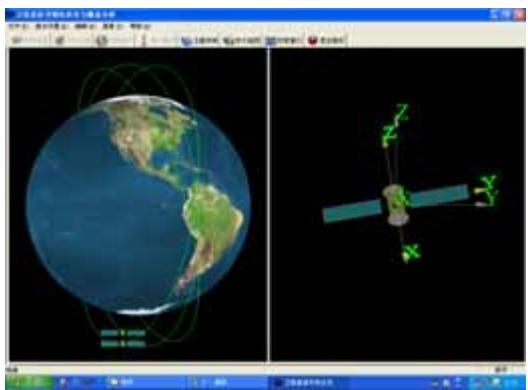
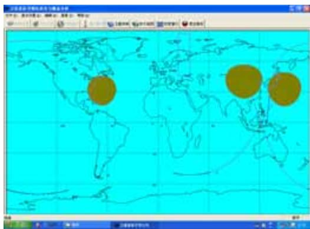
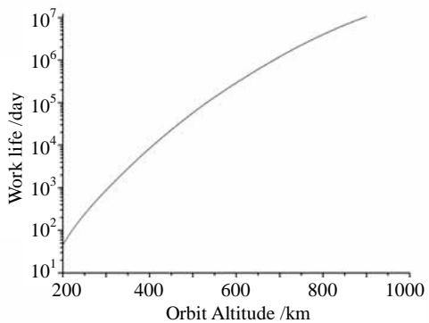
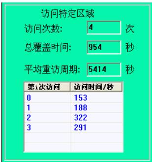
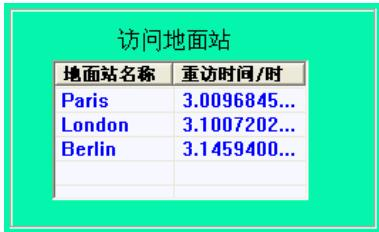

# 卫星星座及其覆盖问题建模与可视化仿真

王启宇，袁建平，朱战霞
(西北工业大学航天学院，陕西 西安 710072)

摘要：为了便于对卫星星座及其覆盖特性进行研究，笔者独立开发了一套卫星星座可视化仿真软件，该软件可以动态演示星座的三维几何构型、卫星的姿态运动以及相应的卫星星下点和覆盖区。该软件由存储、计算和结果显示模块组成。存储模块使用了数据库技术来对相应的初始参数进行操作；结果显示模块使用了OPENGL和简单GIS技术来演示星座运行、卫星姿态以及星下点轨迹和覆盖圆情况。并给出了计算模块所使用的轨道动力学模型、姿态模型以及覆盖模型。轨道动力学模型考虑了大气阻力和J2项摄动，并使用Cowell法建立轨道运动微分方程，利用Adams线性多步法进行求解，以保持较高的计算精度。姿态模型主要使用姿态四元数建立相应的姿态运动。覆盖模型则针对稀疏星座对固定目标的重访时间进行了建模，提出了数值法与解析法求解重访时间的方案。最后给出了程序运行效果与仿真算例。

关键词：卫星星座；覆盖；可视化；重访时间；仿真

中图分类号：TP391.9

文献标识码：A

文章编号：1004-731X(2007)15-3452-04

# Modeling and Visualized Simulation of Satellite Constellation and Its Coverage Problem

WANG Qi-yu, YUAN Jian-ping, ZHU Zhan-xia
(College of Astronautics, Northwestern Polytechnical University, Xi'an 710072, China)

Abstract: For researching satellite constellation and its coverage, a set of satellite constellation visualized simulation software was developed. This software can display the geometry of the constellation, satellite attitude motion, relevant groundtrack and coverage circle. This soft is made of storage, computation and result display module. Storage module uses database technology to handle the correlative initial parameter. Display module uses OpenGL and simple GIS technology to show constellation, satellite attitude and groundtrack and coverage circle. Orbit dynamics model, attitude model and coverage model used computation module were given. Atmospheric drag and J2 perturbation were taken into account in Orbit dynamics model. The Cowell method was used to set up orbit motion differential equations. For precision, the equations were solved by Adams linear multi-step method. To solve the sparse constellation's coverage problem, the coverage model was set up. Revisit time can be solved by numeric method or analytical method. The simulation sample and program running impression were given.

Key words: satellite constellation; coverage; visualization; revisit time; simulation

## 引言

将卫星星座以三维立体的方式进行可视化仿真演示，相比一般简单数据叠加，更加符合人类的思维习惯，可以帮助使用者获得更加直观的印象，提高卫星星座设计与分析的效率；另外评价星座设计的一项重要指标就是其覆盖性能，因此对星座的覆盖性能进行分析的能力也是卫星星座仿真软件的一项必备功能。

目前，国际上已出现了不少此类型的软件，如美国 AGI 公司出品的 STK (Satellite Tool Kit), Microcosm 公司的 OCK (Orbit Control Kit) 等，这类软件体积庞大功能完备，适合于进行航天器轨道设计、任务分析的专业人士使用，但是其价格昂贵，操作复杂，功能模块不透明，难于被初学者所掌握，并且也很难在其上针对特定任务进行二次开发。

因此笔者使用 Microsoft Visual C++6.0 独立开发了一套卫星星座可视化仿真与覆盖性能分析软件。下面就对在开发该软件中所使用的基本方法、数学模型以及功能模块进行简要介绍。

## 1 基本技术路线

C++是 C 语言的扩展，是 20 世纪 80 年代由贝尔实验室的 Bjarne Stroustrup 开发的，它的很多特性都是从 C 语言中派生的，提供了面向对象编程的功能，已成为当前最为流行、最受企业界和学术界欢迎的程序设计语言。目前，微软的 Visual C++ 已经成为在 Windows 操作系统中最重要的 C++ 编译工具。因此，本文中所设计的仿真软件采用该编译器来开发。

由于本文所设计的仿真软件需要进行三维可视化演示，因此还需要选取实现三维图形的方法。目前，微软Direct3D、OpenGL以及Glide是最重要的三大3D API应用程序接口，OpenGL比 DirectX 存在的时间更久，相对于 DirectX 只可以应用在微软的平台，OpenGL则可以应用在很多不同的操作系统上。另外 OpenGL 可以很方便的将 AutoCAD、3DS 等图形设计软件制作的模型转换成 OpenGL 顶点数据。由于其在企业界与学术界的广泛应用，它已经成为高性能图形和交互式视景处理的工业标准[4]。因此，本仿真演示软件的三维可视化部分采用OpenGL绘制而成。

另外，由于本软件需要对卫星星座进行仿真计算，而星座内卫星的数目往往是事先未知的，因此，本软件需要采用数据库的方式对卫星轨道参数、相关的地面观测站参数进行存储与调用。这里采用 ADO 数据库访问接口和 Microsoft Access 数据库。这样选择的原因是所要存储的数据规模并不庞大，并且在程序发布时不需要进行复杂的设置。

该仿真软件按功能可以分为三大模块，它们分为：

1) 存储模块：主要负责各种仿真参数的输入与存储；

2) 计算模块：根据各初始参数进行各种航天动力学计算；

3) 结果显示模块：以数字、二维、三维的方式，显示仿真模型与计算结果。

图 1 是该仿真演示软件设计中所采用的技术路线框图。该软件的工作流程如图 2 所示。

  
图 1 仿真软件开发基本技术路线

  
图 2 仿真软件运行流程图  
以上就是我们设计仿真演示软件时的基本设计思路。

## 2 数学模型

数学模型在这里主要是指该仿真软件中所使用到的相关模型，包括：轨道动力学模型、姿态模型以及覆盖模型。现在对这几种模型逐一进行简要介绍，如下：

## 2.1 轨道动力学模型

为了尽可能精确地模拟真实轨道特性，必须在轨道计算中考虑各主要摄动因素，并采用最常用的 Cowell 法求解运动微分方程 $^{[1,2]}$ ：

$$
\left\{ \begin{array}{l} \frac {d v _ {x}}{d t} = - \frac {\mu}{r ^ {3}} x + f _ {x}, \frac {d x}{d t} = v _ {x} \\ \frac {d v _ {y}}{d t} = - \frac {\mu}{r ^ {3}} y + f _ {x}, \frac {d y}{d t} = v _ {y} \\ \frac {d v _ {z}}{d t} = - \frac {\mu}{r ^ {3}} x + f _ {x}, \frac {d z}{d t} = v _ {z} \\ r = (x + y + z) ^ {\frac {1}{2}} \end{array} \right.\tag{1}
$$

该方程表示的是在地心赤道惯性系中的分量形式， $\mu$ 为地球引力场数。

由于近地轨道是我们仿真模拟中最常出现的情况，而在近地轨道摄动力影响中大气阻力和 J2 项占支配地位。因此我们的摄动力模型为大气阻力和 J2 项。即：

$$
f = f _ {J 2} + f _ {D}\tag{2}
$$

在地心赤道惯性系的 J2 项摄动力加速度为:

$$
\left\{ \begin{array}{l} f _ {J 2 x} = - \frac {3}{2} J _ {2} R _ {E} ^ {2} \mu \frac {x}{r ^ {5}} \left(1 - \frac {5 z ^ {2}}{r ^ {2}}\right) \\ f _ {J 2 y} = - \frac {3}{2} J _ {2} R _ {E} ^ {2} \mu \frac {y}{r ^ {5}} \left(1 - \frac {5 z ^ {2}}{r ^ {2}}\right) \\ f _ {J 2 x} = - \frac {3}{2} J _ {2} R _ {E} ^ {2} \mu \frac {z}{r ^ {5}} \left(1 - \frac {5 z ^ {2}}{r ^ {2}}\right) \end{array} \right.\tag{3}
$$

大气模型采用 USSA76 模型，详细模型可见 $^{[3]}$ 。

弹道系数为:

$$
\sigma = \frac {C _ {D} S}{2 m}
$$

其中 $C_{D}$ 为阻力系数，S 为迎风面积，m 为航天器质量。

$\omega_{E}$ 为地球自转角速度，在地心赤道惯性坐标系的相对速度和摄动加速度为：

$$
\left\{ \begin{array}{l} v _ {a x i} = v _ {x i} + y _ {i} \omega_ {E} - v _ {w x i} \\ v _ {a y i} = v _ {y i} - x _ {i} \omega_ {E} - v _ {w x i} \\ v _ {a z i} = v _ {z i} - v _ {w x i} \\ \left\{ \begin{array}{l} f _ {D x i} = - \sigma \rho v _ {a} v _ {a x i} \\ f _ {D y i} = - \sigma \rho v _ {a} v _ {a y i} \\ f _ {D z i} = - \sigma \rho v _ {a} v _ {a z i} \end{array} \right. \end{array} \right.\tag{4}
$$

(5)

这样在主要未知量已知的情况下，可以使用数值法直接求解运动微分方程。由于 Cowell 法对计算精度敏感，因此求解常微分方程组精度较高的线性多步法进行求解。我们采用 4 阶龙格—库塔法进行起步，先计算开始 4 步的未知函数值，然后再用积分一步的阿当姆斯预报矫正法求解常微分方程。在我们的仿真实践中证明，使用该方法计算轨道方程，可以在积分步数很大的情况下保持较好的精度。

## 2.2 姿态模型

利用欧拉四元素式表示姿态和四元素姿态阵：

$$
\begin{array}{l} q = \left[ e _ {x} \sin \frac {\Phi}{2} \quad e _ {x} \sin \frac {\Phi}{2} \quad e _ {x} \sin \frac {\Phi}{2} \quad \cos \frac {\Phi}{2} \right] ^ {T} \\ A (q) = \left[ \begin{array}{l l l} a 1 1 & a 1 2 & a 1 3 \\ a 2 1 & a 2 2 & a 2 3 \\ a 3 1 & a 3 2 & a 3 3 \end{array} \right] \end{array}\tag{6}
$$

(7)

其中，

$$
\begin{array}{l} a 1 1 = q _ {1} ^ {2} - q _ {2} ^ {2} - q _ {3} ^ {2} + q _ {4} ^ {2}, a 1 2 = 2 (q _ {1} q _ {2} + q _ {3} q _ {4}) \\ a 1 3 = 2 (q _ {1} q _ {3} - q _ {2} q _ {4}), a 2 1 = 2 (q _ {1} q _ {2} - q _ {3} q _ {4}) \\ a 2 2 = - q _ {1} ^ {2} + q _ {2} ^ {2} - q _ {3} ^ {2} + q _ {4} ^ {2}, a 2 3 = 2 (q _ {2} q _ {3} + q _ {1} q _ {4}) \\ a 3 1 = 2 (q _ {1} q _ {3} + q _ {2} q _ {4}), a 3 2 = 2 (q _ {2} q _ {3} + q _ {1} q _ {4}) \\ a 3 3 = - q _ {1} ^ {2} - q _ {2} ^ {2} + q _ {3} ^ {2} + q _ {4} ^ {2} \end{array}
$$

姿态四元素运动方程为:

$$
\left[ \begin{array}{l} \dot {q} _ {1} \\ \dot {q} _ {2} \\ \dot {q} _ {3} \\ \dot {q} _ {4} \end{array} \right] = \frac {1}{2} \left[ \begin{array}{c c c c} 0 & \omega_ {z} & - \omega_ {y} & \omega_ {x} \\ - \omega_ {z} & 0 & \omega_ {x} & \omega_ {y} \\ \omega_ {y} & - \omega_ {x} & 0 & \omega_ {z} \\ - \omega_ {x} & - \omega_ {y} & - \omega_ {z} & 0 \end{array} \right] \left[ \begin{array}{l} q _ {1} \\ q _ {2} \\ q _ {3} \\ q _ {4} \end{array} \right]\tag{8}
$$

其中 $\omega_{x}$ ， $\omega_{y}$ 和 $\omega_{z}$ 为姿态相对参考坐标系的转速 $\omega$ 在三个坐标轴上的投影。

## 2.3 覆盖模型

本文主要针对稀疏星座的非连续局部覆盖问题进行建模分析。对于这种间歇局部覆盖问题来说，卫星星座对地面上给定点的观测频率是对地观测任务中的一项重要性能指标。重访时间是对固定目标当前观测与下一次观测的时间间隔。平均重访时间用来衡量卫星对给定目标的观测性能。平均重访时间越短，观测性能越好 $^{[2,5]}$ 。

重访时间的计算有两种方法。

## 2.3.1 数值法求解重访时间

数值方法, 即用计算机仿真的方法来产生卫星星下点轨迹和对应时间的数据点, 根据这些数据点与目标区域的几何关系来确定覆盖情况, 根据覆盖情况与时间点的关系推算出相应的重访时间。

## 2.3.2 解析法求解重访时间

解析法是基于平均重访时间与在随机选择的路径上对将被重访目标的概率成反比的原理 $^{[6]}$ 。

在满足以下三条假设情况下：一、卫星在低高度近圆轨道运行；二、星下点轨迹不重复；三、传感器或天线不受天气或光照影响。重访时间与轨道周期及重访概率有如下关系：

$$
\mathrm{P} _ {\text { revisit }} = \frac {T _ {\text { period }}}{T _ {\text { revisit }}}\tag{9}
$$

由于重访概率为:

$$
\frac {S _ {\text { covered }}}{S _ {\text { Total }}} = P _ {\text { revisit }}\tag{10}
$$

这里 $S_{covered}$ 指覆盖面积， $S_{Total}$ 指总面积。

于是，根据卫星的传感器约束角 $\theta$ 、地面站所处纬度 lat 以及卫星所处的轨道倾角 i ，经过几何变换，就可以算出单颗卫星对该地面站的平均重访时间。对于多颗卫星组成的星座对该地面站的平均重访时间，则有：

$$
\frac {1}{T} = \frac {1}{T _ {1}} + \frac {1}{T _ {2}} + \dots + \frac {1}{T _ {i}}\tag{11}
$$

这里 T 为 i 颗卫星组成的星座对地面站的平均重访时间， $T_{1}$ 、 $T_{2}$ 、 $\cdots$ 、 $T_{i}$ 表示第 1 到 i 颗卫星对该区域的平均重访时间。

## 3 程序演示与仿真计算

该卫星星座可视化仿真与覆盖性分析程序界面如图 3 所示:

  
图 3 程序运行界面

仿真初始参数设定如图 4:

  
图 4 初始参数设置

完成初始化和计算后，可以得到如下的仿真演示结果。图 5 表示的是根据输入参数所得到的卫星三维轨道与姿态运动情况。图 6 根据计算结果给出了相应的卫星星下点轨迹。

  
图 5 卫星三维轨迹和姿态演示

  
图 6 卫星实时星下点轨迹与覆盖区域

利用本软件的计算模块, 可以求出考虑大气阻力影响的卫星工作寿命与轨道高度的关系如图 7 所示:

  
图 7 卫星轨道高度与工作寿命的关系

对地图中矩形方框所包含的特定区域, 使用前面所提到的数值法求解其覆盖情况如图 8:

  
图 8 星座对特定区域的覆盖情况

至于该星座对地面站的覆盖情况，则使用 2.3.2 所提出的解析法进行计算，所得结果如图 9:

  
图 9 星座对地面站的覆盖情况

设定不同数目的卫星、各种特定区域及地面观测站，经过多次仿真，根据所得到的覆盖性仿真结果，可以得出下列结论：星座对特定区域的重访时间与该区域所处的纬度范围、经度跨度、星座内卫星的数量以及卫星传感器的工作特性有关，经纬度范围越大、卫星数目越多、卫星传感器约束角越大，对该区域的重访时间越短；反之，则越长。对地面站来说，卫星星座对于该站的平均重访时间除了受卫星数目、卫星传感器特性影响以外，还由该地面站所处的纬度以及各卫星的轨道倾角所确定。当各卫星轨道倾角i、卫星传感器约束角θ以及地面站纬度lat存在以下关系时：

## $\mathrm{i} - \theta = \mathrm{lat}$

该星座对此地面站的平均重访时间最短。

## 4 结论

本文介绍了一种使用可视化仿真技术对卫星星座进行演示以及对其地面覆盖特性进行分析的方法，并完成了程序模块与框架的构建。下一步的工作是开发出针对更多特定航天动力学问题的子程序包，以使该仿真程序的功能得到进一步丰富和完善。

## 参考文献:

[1] Vallado D A. Fundamentals of astrodynamics and applications [M]. Dordrecht: Kluwer Academic, 2001.

[2] Pegher D J. Optimizing coverage and revisit time in sparse military satellite constellation [R]. CA: Naval Postgraduate School (S0704-0188), 2004.

[3] 肖业伦. 航空航天器运动的建模 [M]. 北京: 北京航空航天大学出版, 2003.

[4] 僧德文. 基于 OpenGL 的真实感图形绘制技术及应用 [J]. 计算机应用研究, 2005.

[5] Middour J W. Survey of orbit selection for satellite earth surveillance [C]//AIAA-1999-4637. AIAA Space Technology Conference and Exposition, Albuquerque, NM, 1999.

[6] Hayes E W. Computation of average revisit time for earth observing satellites [C]//AIAA-1988-574. Aerospace Sciences Meeting, Reno, NV, 1988.