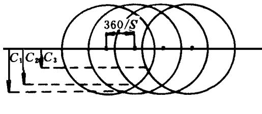
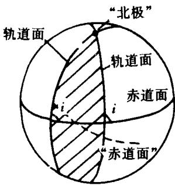
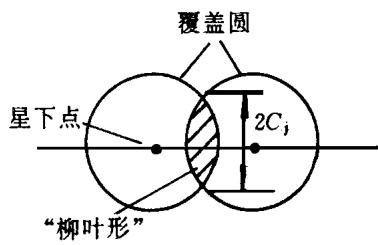
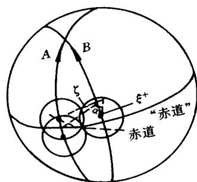
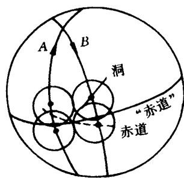
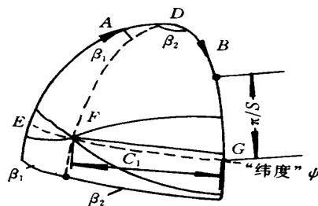
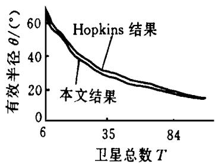
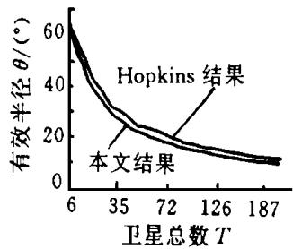
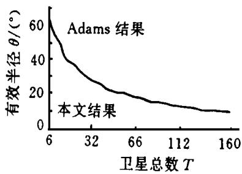

第 期 CHINESE SPACE SCIENCE AND TECHNOLOGY

# 多重覆盖的定倾角最佳星座设计

袁仕耿北京空间飞行器总体设计部，北京

摘要 采用覆盖带技术，在全球多重连续覆盖、 定倾角的条件下进行了星座设计。星座形式采用 °升交点分布，并考虑相邻轨道间的相对相位。文章介绍了覆盖带方法的基本概念，推导了同向区、 反向区的约束方程，给出了其它必要的约束条件和解算方法。并在设计结果上有了一定的改进。

主题词 卫星轨道 星座 最优设计 方法

## 1 引言

星座设计在国外最早开始于 年［1］。在如何有效地进行星座设计这个问题上，国外发表了许多文章。从收集的文献看，主要分为两种设计方法，一种是外接圆方法［2、3］，一种是覆盖带方法［4～6］。由于外接圆方法的算法效率不高，而覆盖带方法在这一方面具有一定的优势，因而最近几年，覆盖带方法逐渐占据了主导地位。

在覆盖带方法的利用上，文献 ［ ～ ］ 均是较为成功的例子。但是文献 ［ ］ 仅局限于研究全球单重覆盖的问题，并不考虑多重覆盖和相邻轨道间卫星的相对相位。文献 ［ ］ 研究了多重覆盖并考虑相对相位，但它仅针对极轨星座。文献 ［ ］ 考虑了多重覆盖，但没有考虑相邻轨道间卫星的相对相位，

本文将研究更一般化的问题，即： 一般倾斜轨道、 全球多重覆盖的最佳星座的设计，并且考虑相邻轨道间卫星的相对相位。设计结果比文献 ［ ］， ［ ］ 有较大的改进，而文献［ ］ 只是本文的一种特殊情况。

覆盖带方法最早见于文献 ［ ］。文献 ［ ］ 第一次作了较为深入和详细的研究。为了应用覆盖带方法，必须有： 每条轨道内的卫星在轨道面内均匀分布，并且每条轨道的卫星数不少于三颗，使它们的有效覆盖区在地面上能彼此重叠，以构成一条带 如图 所示 ，其中直线为轨道在地球上的投影，实线圆为卫星的有效覆盖圆。这样，半带宽 $C _ { j }$ 是覆盖圆半径θ和j 的函数 j 表示由同一条轨道上的卫星所能提供的覆盖重数 ，其大小为

$$
C _ {j} = \arccos [ \cos \theta / \cos (j \pi / S) ]\tag{1}
$$

其中 S 为轨道内的卫星数。

## 2 约束方程推导

如图 ，称阴影区为一个 “邻接区”。如果两条轨道中的卫星沿相同的方向运动，则称同向邻接区，简称同向区；反之，为反向邻接区。这样，如果一个一般倾斜轨道星座有 P 条轨道，可安排其升交点在赤道上的分布，使得在 °

  
图 覆盖带示意图

的范围内有 $P ^ { - 1 }$ 个相同的同向区，一个反向区。这样的星座将成为本文考虑的对象。

由于所讨论的对象是一般倾斜轨道星座，所以两条轨道的交点不一定是南北极点。如果把这两点看作地球的“南北”极点，则赤道就转变为图2所示的虚线“赤道"，同样的道理所有带引号的术语，象 “升交点”、 “降交点” 等，是对 “赤道” 而言的。另外， 如图 两覆盖圆的相交部分 阴影区 称为 “柳叶形”。如果 “柳叶形” 的宽度 从一顶点到另一顶点的距离 为 $2 C _ { j }$ ，则称为 $C _ { j }$ “柳叶形”。下文如果说 “柳叶形” 位于某处，是指 “柳叶形”垂直于轨道面的中心线位于某处。

  
图 区的示意图

  
图 “柳叶形” 示意图

## 2.1 同向区的约束方程

由于卫星沿相同的方向前进，两轨道面中的卫星的相对位置保持不变，所以覆盖最恶劣的情况发生在当 $\mathit { C _ { N } }$ “柳叶形” 恰好位于 “赤道” 上时如图 。设N 为所要求的覆盖重数， $\omega _ { , }$ 为两轨道间的卫星的相对相位 ω以“赤道”为基准衡量 ，取 $\delta = _ { \mathrm { m o d } \ ( \textit { N } , \mathrm { ~ 2 } ) }$ ， （ ） 为余函数。此时，轨道 有一颗星位于

$$
\varsigma^ {\prime} = \delta \pi / S
$$

  
图 同向区

（ 2）

如果轨道 的卫星的相位领先于轨道 的卫星

ω，则轨道 的卫星的位置，从 “升交点” 量度，可描述为

$$
\xi = \varsigma + \omega + m \frac {2 \pi}{S}
$$

其中 $m$ 为整数， $m \in \ [ 0 , \ s - 1 ]$ 。在这些卫星中，必定有一颗卫星离 “赤道” 最近，设为$\xi ^ { + }$ 。作为连续覆盖，“升交点” “赤经” 差 α应满足

$$
\alpha \leqslant C _ {N} + \arccos (\cos \theta / \cos \xi^ {+})\tag{3}
$$

同理，当轨道 中恰有一个 “柳叶形” 位于 “赤道” 时， 轨道中有一颗星距 “赤道” 最近，用 $\xi$ 表示。则 α还应满足

$$
\alpha \leqslant C _ {N} + \arccos (\cos \theta / \cos \xi)
$$

对于表达式

$$
\arccos (\cos \theta / \cos \xi^ {+})
$$

考虑轨道B中的所有卫星，必有一颗星的位置使得表达式的值为最大，则这颗星的位置即为 ${ \boldsymbol \xi } _ { , } ^ { * } \in \boldsymbol \xi$ 可仿之确定。容易证明， $\cos \xi ^ { + } , \cos \xi$ 是相等的。因而，同向区的约束方程可表达为式 （ 3） 。

## 2.2 反向区的约束方程

作为反向区，与同向区类似，首先应保证 “赤道” 的连续覆盖，因而一轨道的 “升交点” “赤经” 与另一轨道的 “降交点” “赤经” 差 β应满足

$$
\begin{array}{r l} & \beta \leqslant C _ {N} + \arccos (\cos \theta / \cos \xi^ {\prime}) \\ & \xi = \pi - [ \zeta + \omega^ {\prime} + m (2 \pi / S) ] \\ & \omega^ {\prime} = \operatorname{mod} [ (P - 1) \omega 2 \pi / S ] \end{array}\tag{4}
$$

ζ由式 （2） 决定。

但由于反向区两轨道的卫星沿相反方向运动，所以光满足上几式是不够的。图 就是这样的一个例子。它保证了 “赤道” 上的连续覆盖，但在 “赤道” 上方出现了一个洞，在卫星运动过程中不出现洞的充要条件［5］是： 当有一个 $C _ { N }$ “柳叶形” 在轨道 的 “赤道”上时，轨道 有一个离 “赤道” 最近的 $C 1$ “柳叶形”。两 “柳叶形” 相对运动，如果保证了它们不相错而过，也即它们在某一“纬度”ψ处相交，则在以后的过程中，$C 1$ 覆盖带和 $C _ { N }$ 覆盖带一直相交，就不会出现洞。这样如图 ，求解球面三角DEF 和DFG，即有 “赤经”β

  
图5 反向区的洞

$$
\beta = \beta_ {1} + \beta_ {2} \leqslant \arcsin (\sin C _ {1} / \cos \Psi) + \arcsin (\sin C _ {N} / \cos \Psi)\tag{5}
$$

## . ψ的确定

设 $\omega$ ′为反向区中轨道 和轨道 中卫星的相对相位，且轨道 的卫星领先于轨道的卫星。一般地，应确定四个 “纬度” $\Psi _ { \circ }$ 它们是

ψa： CN “柳叶形” 在轨道 A 升段， $\smash { \ u _ { 1 } } , \ v { C } _ { 1 }$ “柳叶形” 在轨道 降段；

ψb： $C 1$ “柳叶形” 在轨道 升段， $C _ { N }$ “柳叶形” 在轨道 降段；

ψc： $\mathit { C _ { N } }$ “柳叶形” 在轨道A 升段， $C 1$ “柳叶形” 在轨道B 升段；

$\Psi$ ： $C 1$ “柳叶形” 在轨道 升段， $C _ { N }$ “柳叶形” 在轨道 升段；

先确定 $\Psi _ { a }$ ，如果有 $C _ { N }$ “柳叶形” 在轨道 的 “赤道” 时，恰有一个轨道 的 $C 1$ “柳叶形” 位于 “降交点”，则有 $\Psi _ { \mathbf { \Omega } } = \operatorname { 0 } _ { \mathbf { \Omega } _ { \circ } }$ 此时轨道A 有一颗星位于 $\mathsf { S } ,$ 轨道B 有一颗星位于 （ 从“降升点” 量度）

$$
\xi^ {*} = \pi / S\tag{6}
$$

但一般地，卫星的分布不可能恰好同时满足式 $( \ 2 ) \ , \ ( \ 6 )$ 。可是，轨道 中必有一颗星位于“纬度” $\xi \_ \xi = \xi$ 且 $\xi - \xi$ 为最小。

ξ的确定方法如下： 轨道 中卫星的位置，从 “降交点” 量，可表达为

$$
\xi = \pi - \left(\varsigma + \omega^ {\prime} + m \frac {2 \pi}{S}\right), \qquad m \in [ 0, S - 1 ]\tag{7}
$$

又有

$$
0 \leqslant \xi - \xi^ {*} <   2 \pi / S\tag{8}
$$

从式 $( \mathit { \Omega } ^ { 6 } ) \ , ( \mathit { \Omega } ^ { 7 } ) \ , ( \mathit { \Omega } ^ { 8 } )$ 中可解出 $\xi$

设运动一段时间后，两 “柳叶形” 相交，此时两星的位置分别为 $\mathsf { \Sigma } ^ { \mathsf { \Sigma } ^ { \prime } , \mathsf { \Sigma } ^ { \prime } } \mathsf { S _ { \circ } } ^ { \prime }$ 由于轨道 、 轨道 中卫星的运动速度是一样的，所以应有

$$
\varsigma^ {\prime} + \xi^ {\prime} = \varsigma + \xi = k _ {1}
$$

如图 ，求解球面三角DEF、 $D F G$ ，即可得

$$
\varsigma^ {\prime} = \arcsin \frac {\sin k ^ {\prime} \cos (N \pi / S)}{\cos^ {2} \frac {\pi}{S} + \cos^ {2} \frac {N \pi}{S}} + \frac {\delta \pi}{S}
$$

$$
k ^ {\prime} = k _ {1} - (1 + \delta) \frac {\pi}{S}
$$

$$
\psi_ {a} = \arcsin \frac {\cos \theta \sin k ^ {\prime}}{\cos^ {2} \frac {\pi}{S} + \cos^ {2} \frac {N \pi}{S}}
$$

  
图 ψ约束示意图

容易证明 $\Psi _ { a } = \Psi , \Psi , \Psi _ { c } \ : , \ : \Psi _ { d }$ 只需将上述过程中的 $\omega$ 替换成

$- \boldsymbol { \omega }$ 即可；同样有 $\Psi ^ { = } \Psi _ { \circ }$ 这样，“纬度”

$$
\Psi = \min (\Psi_ {a} \quad \Psi_ {b} \quad \Psi_ {c} \quad \Psi_ {d}) = \min (\Psi_ {a} \quad \Psi_ {c})
$$

## 2.4 其它约束

赤道弧与 “赤道” 弧的转换关系

对同向区，“升交点” 间隔 α和真实的升交点间隔 α′满足

$$
\sin {\frac {\alpha^ {\prime}}{2}} = \sin i \sin {\frac {\alpha}{2}}
$$

对反向区，“升”、 “降” 交点间隔 β和真实升、 降交点间隔 β′应满足

$$
\cos \beta = - \cos^ {2} i + \cos \beta_ {\sin} ^ {\prime} i
$$

于是，对采用 °升交点分布有

$$
(P - 1) \alpha^ {\prime} + \beta^ {\prime} = \pi\tag{9}
$$

（2） 极点覆盖条件

$$
C _ {N} \geqslant \frac {\pi}{2} - i\tag{10}
$$

（3） 真实相对相位 F 与 $\omega _ { \ast }$ 之间的关系

$$
F = \mathrm{mod} \bigg [ 2 \arccos \left(\cos \frac {\alpha^ {\prime}}{2} / \cos \frac {\alpha}{2}\right) + \omega \frac {2 \pi}{S} \bigg ]
$$

（4） ω和 $\omega$ ′的关系

$$
\omega^ {\prime} = \mathrm{mod} \Big [ (P - 1) \omega \frac {2 \pi}{S} \Big ]
$$

## 3 最佳星座

现在，问题可描述为： 在约束条件式 （2） ，（3） ，（4） ，（9） ，（10） 下，在给定的卫星总数T 和覆盖重数N 下，求出最佳的P，S 解，使卫星的有效覆盖圆半径θ为最小。在求解过程中，取 $\omega = \frac { \delta \pi _ { [ ^ { 5 } , 7 ] } } { S }$ 同时，称这样的星座为总数T 和覆盖重数N 下的最佳星座。问题的求解采用梯度法。

  
图7 倾角为80°时的结果比较

  
图8 倾角为85°时的结果比较  
图 单重覆盖的结果比较

图 ，图 是倾角为 °和 °时，文献 ［ ］ 的结果与本文结果的比较，可以看出，本文结果要优于文献 ［ ］ 的结果 对文献 ［ ］ 的结果，此处不再讨论，因为文献 ［ ］ 的结果要优于文献 ［ ］ 。从计算得到的数据看，对于拥有相同数量的卫星的星座，本文的设计结果要比文献 ［ ］ 的结果减少 °到 °。这是因为本文考虑了相邻轨道间卫星的相对相位，从而更为充分地利用了卫星的有效覆盖圆的重叠部分图9是文献「5]的结果和本文结果在单重覆盖情况下的比较，可以得出，两者结果完全一样。对两重至四重覆盖 图略 ，除了文献［ ］ 用到了重数分解的某些情况有差别处，也完全一致。这样，有结论： 文献 ［ ］ 的结果只是本文结果的一种特殊情况。

表 至表 列出了单重覆盖时较为典型的数据。其中，θ，θ，θ分别表示文献 ［ ］、 文献［ ］ 和本文的结果。T 的含义不变。

表1 轨道倾角为80°时 的结果比较

<table><tr><td>T</td><td> $\theta$ </td><td> $\theta$ </td><td> $\theta$ </td></tr><tr><td>6</td><td>69.295</td><td>n/a</td><td>66.716</td></tr><tr><td>8</td><td>60.000</td><td>n/a</td><td>56.946</td></tr><tr><td>10</td><td>55.106</td><td>n/a</td><td>53.219</td></tr><tr><td>40</td><td>28.725</td><td>n/a</td><td>26.112</td></tr><tr><td>50</td><td>25.480</td><td>n/a</td><td>23.403</td></tr><tr><td>60</td><td>23.523</td><td>n/a</td><td>21.330</td></tr></table>

表2 轨道倾角为85°时 的结果比较

<table><tr><td>T</td><td> $\theta$ </td><td> $\theta$ </td><td> $\theta$ </td></tr><tr><td>6</td><td>69.295</td><td>n/a</td><td>66.716</td></tr><tr><td>8</td><td>60.000</td><td>n/a</td><td>56.946</td></tr><tr><td>10</td><td>55.106</td><td>n/a</td><td>53.219</td></tr><tr><td>40</td><td>28.566</td><td>n/a</td><td>26.822</td></tr><tr><td>50</td><td>25.298</td><td>n/a</td><td>23.125</td></tr><tr><td>60</td><td>23.327</td><td>n/a</td><td>20.970</td></tr></table>

表3 轨道倾角为90°时 的结果比较

<table><tr><td>T</td><td> $\theta$ </td><td> $\theta$ </td><td> $\theta$ </td></tr><tr><td>6</td><td>n/a</td><td>69.716</td><td>66.716</td></tr><tr><td>8</td><td>n/a</td><td>56.946</td><td>56.946</td></tr><tr><td>10</td><td>n/a</td><td>53.219</td><td>53.219</td></tr><tr><td>40</td><td>n/a</td><td>25.740</td><td>25.739</td></tr><tr><td>50</td><td>n/a</td><td>23.046</td><td>23.045</td></tr><tr><td>60</td><td>n/a</td><td>20.880</td><td>20.879</td></tr></table>

## 4 结束语

文章采用覆盖带方法，以一般倾斜轨道星座为对象，考虑相邻轨道间卫星的相对相位，进行了星座设计。星座采用 °升交点分布。在结果上较文献 ［ ］、 ［ ］、 ［ ］ 有了较大的改进。从计算结果看，对相同数目的卫星，较文献 ［ ］ 的结果，卫星的有效覆盖圆半径大约减小 °到 °。部分典型的数据可参见表 至表 。除了个别情况外，文献 ［ ］ 为本文的特殊情况。为解决这些 “个别” 情况，有必要对一般倾斜轨道星座是否可进行重数分解以及怎样进行重数分解作更进一步的研究。

## 参 考 文 献

1 Luders R D. Satellite networks for continuous zonal coverage. J ARS. 1961, 31: 179～184

2 Walker J G· Coverage prediction and selection criteria for satellite constellation· RAE Technical Report 82116.1986.

3 Walker J G. Satellite constellation· JBIS 37, 1984： 559～571

4 A dams W S，Hopkins R G．M inimal arbitrarily constellation w ith a given inclination providing single coverage．AAS Paper 91～508

Rider L· Analytic design of satellite for zonal earth coverage using incoined circular orbits, J Astro Scie， ： ～

6 A dams W S，Reder L ．Circular polar constellation providing continuous single or multiple coverage above a specified latitude: J Astro Scie, 1987, 35 (2) : 155\~192

7 Beste D C，Design of satellite constellations for optimal continuous coverage．IEEE T rans A ero Electron Syst, 1978, 14 (3)

## 作者简介

袁仕耿 年生， 年获空间飞行器总体设计专业硕士学位。现从事卫星总体设计工作。

（ 下转第55页）

# BRIDGMAN GROWTH OF HgCdTe UNDERMICROGRAVITY IN SPACE

Li Yijun Huang Liangfu T an Xiaochen Zhang Zhongli He Ping Cui Weixin (Lanzhou Institute of Physics, Lanzhou 730000

Abstract Bridgman crystal grow th of HgT eCd w as successfully finished under microgravity in space w ith the aid of a double heat zones crystal furnace piggyback on the Chinese returnable satellite．Some significant results w ere obtained．T his paper introduces the design and the test process of the furnace，the main analyzed results of the recovered samples，as w ell as the discussion of the design of materials processing facilities and some related technological problems

Subject Term M icrogravity environment Furnace Crystal grow th Bridgman method T est Analyzing

（ 上接第14页）

# SATELLITE CONSTELLATION DESIGN WITH INCLINED ORBITS PROVIDING MULTIPLE GLOBAL CONTINUOUS COVERAGE

Yuan Shigeng（ ， 100086）

Abstract More general inclined orbit and phased constellation of 180°nodal distribution which provides multiple global continuous coverage is investigated and designed using street-of-coverage technique．T he article drives and presents necessary constraint conditions．T he results of previous researches are improved

Subject Term Satellite orbit Constellation Optimum design Method