# Ultra-Dense LEO Satellite Constellations: How Many LEO Satellites Do We Need?

Ruoqi Deng, Graduate Student Member, IEEE, Boya Di, Member, IEEE, Hongliang Zhang, Member, IEEE, Linling Kuang, Member, IEEE, and Lingyang Song, Fellow, IEEE

Abstract—Recently, the ultra-dense low Earth orbit (LEO) satellite constellation over high-frequency band has served as a potential solution for high-capacity backhaul data services. In this paper, we consider an ultra-dense LEO-based terrestrialsatellite network where terrestrial users can access the network through the LEO-assisted backhaul. We aim to minimize the number of satellites in the constellation while satisfying the backhaul requirement of each user terminal (UT). We first derive the average total backhaul capacity of each UT, based on which a three-dimensional constellation optimization algorithm is proposed to minimize the number of satellites in the constellation. Simulation results verify our theoretical capacity analysis and show that for any given coverage ratio requirement, the corresponding optimized LEO satellite constellation can be obtained by the proposed three-dimensional constellation optimization algorithm. Given the same number of deployed LEO satellites, the average coverage ratio of the proposed LEO satellite constellation is at least 10 percentage points higher than that of Telesat constellation.

Index Terms—Ultra-dense LEO satellite network, LEO satellite constellations, number minimization

## I. INTRODUCTION

Nowadays, the explosive increasing data traffic created by the growing wireless devices and applications makes fifth generation networks have a stringent demand for seamless reliable global data services and massive connectivity [1] [2]. However, the unbalanced infrastructure deployment and unstable wireless environment limit traditional terrestrial networks to handle the exponentially increasing data traffic [3]. Besides, the limited backhaul capacity is another development bottleneck for traditional terrestrial networks due to the short of available bandwidth [4]. To solve the above issues, the ultradense low Earth orbit (LEO) satellite networks are developed with the promising of providing high-capacity backhaul, seamless global coverage, and much more flexible network access services [5] [6]. Specifically, in the ultra-dense LEO-based terrestrial-satellite network, the user terminal (UT) acting as the access point can not only connect to multiple satellites over Ka-band for backhaul but also support the user-UT links over the dedicated C-band1 [9] [10].

To further improve the system performance, one of the most important issues to be considered in the construction of an ultra-dense LEO satellite network is the constellation design [11]. The LEO satellite constellation contains a group of LEO satellites launched into pre-planned orbits by the ground control center to form a network [12]. A well-designed LEO satellite constellation can improve the QoS for terrestrial cellular networks with a proper constellation size without resource wasting. Although several typical satellite constellations have been proposed to achieve global coverage such as polar orbit constellation [13], Walker Delta constellation [14], and Flower constellation [15] [16], they can only satisfy basic communication needs2 without considering quality-of-service (QoS) of terrestrial users and the cost of LEO satellite deployment. Therefore, rather than satisfy basic communication needs, the main target of ultra-dense LEO satellite constellation design is to balance the terrestrial-satellite network performance (such as the backhaul capacity of the UT and the coverage ratio) and the cost of LEO satellite deployment [17].

In the literature, various aspects have been considered for LEO satellite constellation deployment such as satellite number minimization [18] [19], coverage maximization [20] [21], communication delay minimization [22], and heterogeneous networks construction [23]. Several intelligent algorithms are utilized for satellite constellation optimization such as the genetic algorithm (GA), differential evolution (DE), immune algorithm and particle swarm optimization (PSO) [24]. [18] has proposed a non-dominated sorting genetic algorithm for regional LEO satellite constellation design to meet the user requirements with lower satellite costs. In [19], a satellite constellation based on the evolutionary optimization method has been proposed for continuous mutual regional coverage. The relation between the coverage ratio and the number of satellites has been discussed. [20] and [21] both have adopted the genetic algorithm for regional satellite constellation design to maximize the coverage of target areas. In [22], a progressive satellite constellation network construction scheme has been developed to minimize the end-to-end delay. [23] has investigated the LEO satellite constellation-based Internet-of-Things system. The LEO satellite constellation, spectrum allocation scheme, and routing protocols have been discussed for such a heterogeneous network. In [24], the performance of different intelligent algorithms for satellite constellation design, i.e., GA, DE, immune algorithm, and PSO has been compared for satellite coverage capability enhancement.

However, several critical issues in LEO satellite constellation design have not been considered in most existing works. First, they mainly considered the case that satellites are uniformly distributed on orbital planes [18]. The coupling between neighboring orbits has been ignored, resulting in redundant satellite coverage. Second, some works mainly focused on the satellite constellation design to achieve regional coverage with static or quasi-static topology of LEO satellite constellation without considering LEO satellites’ highmobility [19] [20]. Third, the seamless global coverage (i.e., the coverage on the Earth is continuous) and the backhaul requirement of the UT3 have not been jointly considered due to the limited number of satellites [21]. Against this background, we mainly investigate two open issues in the literature.

• Considering the cost of LEO satellite deployment and LEO satellites’ high-mobility, how many LEO satellites are enough to achieve seamless global coverage while satisfying the backhaul requirement of each UT?

• For any given coverage ratio requirement4, how to design an ultra-dense LEO satellite constellation with the minimum number of LEO satellites?

To address the above issues, in this paper, we map such demands to multiple criteria in the ultra-dense LEO satellite constellation design, i.e., backhaul requirement satisfaction of UTs, seamless global coverage, and minimization of satellite number. We aim to propose a three-dimensional5 constellation optimization algorithm simultaneously handling these criteria to achieve an optimal trade-off between the cost of LEO satellite deployment and the LEO-based backhaul services provided to UTs.

This is a non-trivial task due to the following three reasons. First, since UTs are randomly distributed on the Earth, the distance between a UT and a LEO satellite varies according to the location of the UT. Therefore, the theoretical backhaul capacity analysis of each UT is difficult to conduct. Second, due to the satellite orbital motion, the topology of the LEO satellite constellation is time-varying. It is challenging to optimize the multi-parametric LEO satellite constellation targeting at seamless global coverage while satisfying the backhaul requirement of each UT. Third, since the satellites are distributed on a three-dimensional sphere, and the coverage area of each satellite is also a three-dimensional spherical cap, the geometric relation of different satellites’ coverage regions is hard to model.

By addressing the above challenges, we contribute to the research on ultra-dense LEO satellite constellation deployment in the following ways.

• We derive the average total backhaul capacity of each UT in the ultra-dense LEO-based terrestrial-satellite network, based on which a seamless global coverage problem considering the backhaul requirement of each UT is formulated to minimize the number of LEO satellites.

• We design a three-dimensional constellation optimization algorithm to solve the seamless global coverage problem. Specifically, for any given backhaul requirement and global coverage ratio requirement, the corresponding optimized LEO satellite constellation can be obtained by the proposed algorithm. The Cartesian coordinate of each satellite in the optimized LEO satellite constellation can also be given explicitly after the proposed algorithm is performed.

• Simulation results verify the theoretical backhaul capacity analysis and reveal the influence of the backhaul requirement and global coverage ratio requirement on the minimum number of LEO satellites. The stability of the proposed optimized LEO satellite constellation has also been verified. Moreover, it shows that compared with the Telesat constellation and the OneWeb constellation, the proposed LEO satellite constellation can meet the backhaul requirement with a lower cost of LEO satellite deployment.

The rest of this paper is organized as follows. In Section II, the ultra-dense LEO satellite constellation topology is presented. In Section III, we introduce the communication model for LEO-based backhaul and analyze the interference of the UT-satellite link, based on which the average total backhaul capacity of each UT is derived. In Section IV, we formulate a seamless global coverage problem while considering the backhaul capacity requirement of each UT to minimize the number of LEO satellites. A three-dimensional constellation optimization algorithm to solve such a problem is designed. The simulation results are presented in Section V. Finally, the conclusion is drawn in Section VI.

## II. ULTRA-DENSE LEO SATELLITE CONSTELLATION TOPOLOGY

In this section, we first describe the ultra-dense LEObased terrestrial-satellite network where terrestrial users can access the network through the LEO-based backhaul over the Ka-band spectrum. We then introduce the LEO satellite constellation topology including the orbit model and the orbital period. Finally, we present the coverage model for satellite communications.

As shown in Fig. 1, we consider an ultra-dense LEObased terrestrial-satellite network [10] consisting of multiple user terminals (UTs) as transmitters and a set of satellites as receivers. To support the seamless coverage for the UT, an ultra-dense LEO satellite constellation is configured to ensure that at least one satellite flies over the area of interest at each time slot. We assume that these satellites are operated in N orbital planes of altitude h, denoted by $\mathcal { N } = \{ 1 , 2 , \dots , N \}$ and orbital plane n consists of $M _ { n }$ LEO satellites, denoted by $\mathcal { M } _ { n } = \{ 1 , 2 , \dots , M _ { n } \}$ . Each satellite associates with all the UTs in its coverage area, and the UTs share the available bandwidth B over the Ka-band for each LEO satellite equally.

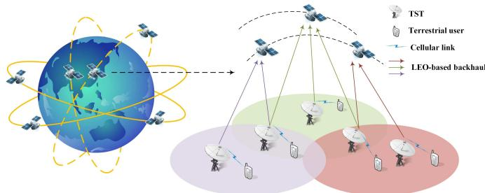  
Fig. 1. Ultra-dense LEO-based terrestrial-satellite network

## A. LEO Satellite Orbi

We assume that the orbit of a LEO satellite is circular [25]. In order to describe the orientation of the satellite with respect to the equatorial coordinate system, as illustrated in Fig. 2, the traditional six orbital parameters are introduced as follows.

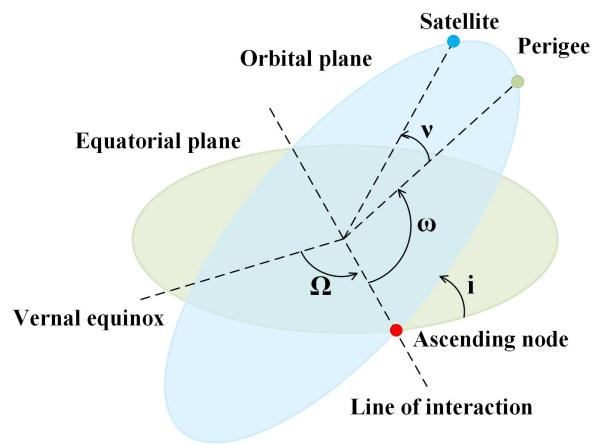  
Fig. 2. Illustration of the LEO satellite orbit

• Inclination angle i: the angle of intersection between the orbital plane and the equator. An inclination angle of more than 90◦ implies that the direction of the satellite’s motion is opposite to that of the Earth’s rotation.

• The right ascension of ascending node Ω: the angle between the vernal equinox and the interactions of the orbital and the equatorial planes.

• Argument of the perigee ω: the angle between the ascending node and the perigee, i.e., the point where the satellite is the closest to the Earth, measured along the orbital plane.

• Eccentricity e: the eccentricity of the orbital ellipse. Since the LEO satellite orbit is assumed to be circular, the eccentricity e is 0.

• Semi-major axis a: half of the length of the orbit’s major axis. In the circular orbit case, the semi-major axis a is equal to the radius of the orbit.

• True anomaly ν: the geocentric angle between perigee direction and satellite direction.

The position of each satellite can be expressed by a function of these angles. According to the results in [26], the Cartesian coordinate of each satellite can be given by

$$
\left( \begin{array}{c} x ^ {s} \\ y ^ {s} \\ z ^ {s} \end{array} \right) = (h + R _ {e}) \left( \begin{array}{c} \cos (\omega + \nu) \cos \Omega - \sin (\omega + \nu) \cos i \sin \Omega \\ \cos (\omega + \nu) \sin \Omega + \sin (\omega + \nu) \cos i \cos \Omega \\ \sin (\omega + \nu) \sin i \end{array} \right),\tag{1}
$$

where $R _ { e }$ is the radius of the Earth.

## B. Orbital Period

For convenience, we divide the timeline into multiple time slots with length $\Delta _ { T }$ , during each of which the position of a satellite is regarded to be unchanged. According to the results in [26], the orbital period, i.e., the time during which the mean anomaly changes by $2 \pi .$ , is $\frac { 2 \pi ( h + R _ { e } ) ^ { \frac { 3 } { 2 } } } { \sqrt { G M _ { e } } }$ , where G is the gravitational constant and $M _ { e }$ is the value of the Earth’s mass. Therefore, the number of time slots required for each revolution can be given by

$$
T = \frac {2 \pi (h + R _ {e}) ^ {\frac {3}{2}}}{\Delta_ {T} \sqrt {G M _ {e}}}.\tag{2}
$$

Since $T$ indicates how many time slots are required for each revolution, $T$ is an integer6.

Note that all the satellites will be in the same positions after $T$ time slots. We only need to consider the time window containing $T$ time slots, denoted by $\mathcal { T } = \{ 0 , \ldots , T - 1 \}$ . In time slot t, we can derive the position of satellite m in orbit n from (1) by setting $\Omega = \Omega _ { n } , i = i _ { n }$ , and $\omega = \omega _ { n } ^ { m } + 2 \pi t / T , t \in$ $\tau$

## C. Satellite Coverage

The coverage area served by a satellite is dependent on the line-of-sight (LoS) propagation and the minimum elevation angle $\theta _ { m i n }$ at the UT.

As shown in Fig. 3, the satellite is operating on the orbit with altitude h. The coverage of the satellite decreases with the minimum elevation angle. Assuming that the surface of the Earth is an ideal sphere, the included angle $\varphi$ from the point with the minimum elevation to the projection point of the satellite, i.e., the angular radius of the coverage circle can be calculated by

$$
\varphi = \arccos \left(\frac {R _ {e}}{R _ {e} + h} \cos \theta_ {m i n}\right) - \theta_ {m i n},\tag{3}
$$

and the coverage area S is

$$
S = 2 \pi R _ {e} ^ {2} (1 - \cos \varphi).\tag{4}
$$

Therefore, a higher altitude can provide larger coverage. Besides, a larger value of $\theta _ { m i n }$ implies the decrease in the coverage.

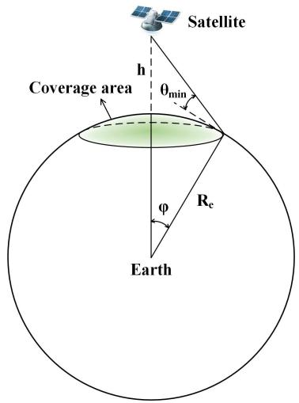  
Fig. 3. The coverage area of a satellite.

## III. LEO-BASED BACKHAUL CAPACITY ANALYSIS

In this section, we first introduce the communication models for LEO-based backhaul. We then present the interference analysis of UT-satellite links, based on which the average data rate of each UT-satellite link is derived. Finally, we give the average backhaul capacity of each UT.

## A. Communication Model for LEO-based Backhaul

In the ultra-dense LEO-based terrestrial-satellite network, each terrestrial user can access the UT with a large backhaul capacity supported by the satellite transmission over Ka-band. Each UT uploads the users’ data to the LEO satellite, and then the satellite forwards it to a terrestrial base station equipped with a communication interface over Ka-band (connected to the core network). The backhaul capacity of each UT is related to the transmission model of the LEO satellite over Ka-band, as given below.

In the following, we give the backhaul capacity over time slot t. For notation brevity, we omit index t. Define $P$ as the transmit power for a UT associating with one LEO satellite, and $g _ { m , q }$ as the channel gains of the UT q - satellite m link with only the large-scale fading taken into consideration7. Therefore, the channel gain can be expressed as

$$
g _ {m, q} = G d _ {m, q} ^ {- \alpha},\tag{5}
$$

where $d _ { m , q }$ is the distance between UT q and satellite m, α is the path loss exponent, G is the constant power gains factor introduced by amplifier and antenna. According to the results in [29], the distance $d _ { m , q }$ can be given by

$$
d _ {m, q} = - R _ {e} \sin \theta_ {m, q} + \sqrt {(R _ {e} \sin \theta_ {m , q}) ^ {2} + h ^ {2} + 2 h R _ {e}},\tag{6}
$$

where $\theta _ { m , q }$ is the elevation angle of UT q with respect to satellite m.

Without loss of generality, we assume that all satellites share the same frequency resource pool, which can be divided into J orthogonal channels. Each satellite allocates orthogonal frequency resources to UTs within its coverage for backhaul. Denote the number of UTs in the coverage of satellite m as $x _ { m }$ , the data rate for the link from UT q to satellite m can then be given by

$$
R _ {m, q} = \frac {B}{x _ {m}} \log_ {2} \left(1 + \frac {P g _ {m , q}}{\sigma^ {2} + I _ {m , q}}\right),\tag{7}
$$

where $\sigma ^ { 2 }$ is the additive white Gaussian noise (AWGN) variance at each LEO satellite and $I _ { m , q }$ is the interference of UT q - satellite m link. Define the set of satellites which can provide service to UT q as $S _ { q } = \{ m | \theta _ { m } \geq \theta _ { m i n } \}$ , where $\theta _ { m }$ is the elevation angle of satellite m. The total backhaul capacity of UT q can then be given by

$$
C _ {q} = \sum_ {m \in \mathcal {S} _ {q}} R _ {m, q}.\tag{8}
$$

## B. Interference Analysis

Without loss of generality, we assume that the UTs are distributed according to a homogeneous Poisson point process (HPPP) Φ with density λ UTs/km2. Since the LEO satellites allocate subchannels to UTs randomly, the possibility that other UTs occupy the same subchannel of UT q is $\textstyle { \frac { 1 } { J } } .$ Therefore, the interference of UT q - satellite m link can be given by

$$
I _ {m, q} = P \sum_ {q ^ {\prime} \in \Phi^ {\prime}} g _ {m, q ^ {\prime}} = P G \sum_ {q ^ {\prime} \in \Phi^ {\prime}} d _ {m, q ^ {\prime}} ^ {- \alpha},\tag{9}
$$

where $\Phi ^ { \prime }$ is a thinning homogeneous PPP of Φ with density $\frac { \lambda } { J }$

Denote $d _ { m }$ as the maximum communication distance of satellite m. According to eq. (6) and the definition of $s _ { q } , d _ { m }$ can be given by

$$
d _ {m} = - R _ {e} \sin \theta_ {m i n} + \sqrt {(R _ {e} \sin \theta_ {m i n}) ^ {2} + h ^ {2} + 2 h R _ {e}}.\tag{10}
$$

Based on this, we can have the following proposition.

Proposition 1. The average interference of UT q - satellite m link can be given by

$$
\mathbb {E} (I _ {m, q}) = \frac {2 \pi R _ {e} \lambda P G}{J (\alpha - 2) (R _ {e} + h)} [ d _ {m} ^ {2 - \alpha} - (2 R _ {e} h + h ^ {2}) ^ {\frac {2 - \alpha}{2}} ].
$$

Proof. See Appendix A.

(11)

## C. Average Data Rate and Backhaul Capacity

According to the property of HPPP, the number of UTs in the coverage of a satellite is a random variable following the

$$
\begin{array}{l} \Upsilon = \mathbb {E} \left[ \log_ {2} \left(1 + \frac {P g _ {m , q}}{\sigma^ {2} + \mathbb {E} (I _ {m , q})}\right) \right] = \frac {1}{2 \ln 2 \cdot R _ {e} (R _ {e} + h) (1 - \cos \varphi)} \cdot \left\{d _ {m} ^ {2} \left[ - \frac {\alpha}{2}   _ {2} F _ {1} \left(1, - \frac {2}{\alpha}; 1 - \frac {2}{\alpha}; - \frac {P G d _ {m} ^ {- \alpha}}{\sigma^ {2} + \mathbb {E} (I _ {m , q})}\right) \right. \right. \\ \left. \left. + \ln \left(1 + \frac {P G d _ {m} ^ {- \alpha}}{\sigma^ {2} + \mathbb {E} (I _ {m , q})}\right) + \frac {\alpha}{2} \right] - h ^ {2} \left[ - \frac {\alpha}{2}   _ {2} F _ {1} \left(1, - \frac {2}{\alpha}; 1 - \frac {2}{\alpha}; - \frac {P G h ^ {- \alpha}}{\sigma^ {2} + \mathbb {E} (I _ {m , q})}\right) + \ln \left(1 + \frac {P G h ^ {- \alpha}}{\sigma^ {2} + \mathbb {E} (I _ {m , q})}\right) + \frac {\alpha}{2} \right] \right\}. \end{array} \tag {14}\tag{14}
$$

$$
\rho = \frac {k _ {\mathrm{min}}}{2 \pi (R _ {e} + h) ^ {2} (1 - \cos \varphi)} = \frac {C _ {t h}}{2 \pi (R _ {e} + h) ^ {2} (1 - \cos \varphi) [ E i (\lambda S) - \ln (\lambda S) - \gamma ] e ^ {- \lambda S} B \Upsilon}.\tag{18}
$$

Poisson distribution. The probability of existing k UTs in the coverage can then be expressed as [30]

$$
f (x _ {m} = k) = (\lambda S) ^ {k} \frac {e ^ {- \lambda S}}{k !},\tag{12}
$$

where S is given in eq. (4). Therefore, based on the Poisson probability, the average data rate for the UT q - satellite m link can be given by

$$
\mathbb {E} (R _ {m, q}) = \sum_ {k = 1} ^ {\infty} (\lambda S) ^ {k}. \frac {e ^ {- \lambda S}}{k !}. \frac {B}{k}. \mathbb {E} \left[ \log_ {2} \left(1 + \frac {P g _ {m , q}}{\sigma^ {2} + \mathbb {E} (I _ {m , q})}\right) \right].\tag{13}
$$

Lemma 1. The expectation of log $\begin{array} { r } { \mathbf { \Sigma _ { 2 } } \left( 1 + \frac { P g _ { m , q } } { \sigma ^ { 2 } + \mathbb { E } \left( I _ { m , q } \right) } \right) } \end{array}$ can be given by eq. (14), where $\mathbb { E } ( I _ { m , q } )$ can be calculated by eq. (11) and $ _ 2 F _ { 1 } ( \cdot )$ is the generalized hypergeometric function [31]. Proof. See Appendix B.

The following proposition can be derived from Lemma 1. Proposition 2. The average data rate for the UT q - satellite m link can be given by

$$
\mathbb {E} (R _ {m, q}) = \left(E i (\lambda S) - \ln (\lambda S) - \gamma\right) e ^ {- \lambda S} B \Upsilon ,\tag{15}
$$

where $\begin{array} { r } { E i ( x ) = \int _ { - \infty } ^ { x } \frac { e ^ { t } } { t } d t } \end{array}$ is the exponential integral function (Chapter 5, [32]), γ is the Euler constant, and Υ can be obtained by eq. (14).

Proof. See Appendix C.

We assume that the average number of satellites in $ { \boldsymbol { S } } _ { q }$ is $k ,$ and the average total backhaul capacity of each UT can be given by

$$
\mathbb {E} (\tilde {C} _ {q}) = \sum_ {m \in \mathcal {S} _ {q}} \mathbb {E} (R _ {m, q}) = k (E i (\lambda S) - \ln (\lambda S) - \gamma) e ^ {- \lambda S} B \Upsilon .\tag{16}
$$

Remark 1. The average total backhaul capacity of each UT decreases as the density of UTs grows. Proof. See Appendix D.

## IV. ULTRA-DENSE LEO SATELLITE CONSTELLATION DESIGN

In this section, we first formulate the global $k _ { \mathrm { m i n } }$ -coverage problem of LEO satellite constellation deployment to satisfy the backhaul requirement of Poisson-distributed UTs. We then propose three LEO satellite constellation design criteria, based on which a three-dimensional constellation optimization algorithm to minimize the number of LEO satellites while guaranteeing seamless global coverage and satisfying the backhaul requirement of each UT is finally given.

A. Global $k _ { \mathrm { m i n } }$ -coverage Problem Formulation

We assume that the backhaul requirement for a UT is $C _ { t h }$ Therefore, the expectation of the backhaul capacity for a UT should satisfy the backhaul requirement for any time slot t ∈ T , i. $\mathsf { e } . , \mathbb { E } ( \tilde { C } _ { q } ^ { \bar { t } } ) \geq C _ { t h } , \forall t \in \mathcal { T } , \mathsf { \bar { \forall } } q$ . According to eq. (16), the minimum number of satellites providing service to each UT can be given by

$$
k _ {\mathrm{min}} = \frac {C _ {t h}}{(E i (\lambda S) - \ln (\lambda S) - \gamma) e ^ {- \lambda S} B \Upsilon}.\tag{17}
$$

Note that each satellite will associate with all the UTs in its coverage area, the first criterion for LEO satellite constellation design can then be given as follows.

Criterion 1 (Backhaul Requirement): Each UT should be covered by at least $k _ { \mathrm { m i n } }$ satellites in any time slot $t \in \mathcal T$

Moreover, since on the orbit sphere, the region where satellites are visible to the UT in one snapshot is $2 \pi ( R _ { e } +$ $h ) ^ { 2 } ( 1 - \cos \varphi )$ , the minimum density of LEO satellites can be given by $\mathrm { e q . ~ } ( 1 8 )$ , and the minimum number of LEO satellites guaranteeing seamless global coverage while satisfying the backhaul requirement of each UT can then be given by

$$
\begin{array}{l} (\sum_ {n = 1} ^ {N} M _ {n}) _ {\min} = \rho \cdot 4 \pi (R _ {e} + h) ^ {2} \\ = \frac {2 C _ {t h}}{(1 - \cos \varphi) [ E i (\lambda S) - \ln (\lambda S) - \gamma ] e ^ {- \lambda S} B \Upsilon}. \end{array}\tag{19}
$$

Definition 1. A point q in a region A is said to be k-covered if it is covered by at least k satellites, and k is said to be the coverage degree of point q. A region A is said to be k-covered if every point $q \in A$ is k-covered.

Since the UTs are distributed according to a HPPP, their locations are random points. We aim to minimize the number of LEO satellites under the constraint that the LEO satellite constellation deployment must guarantee the Earth is $k _ { \mathrm { m i n } ^ { - } }$ covered in any time slot $t \in \mathcal T$ . Such a global $k _ { \mathrm { m i n } } { - } c o { \nu } e r a g e$ problem can be formulated as

$$
\begin{array}{l l} & \min \sum_ {n \in \mathcal {N}} M _ {n} \\ s. t. & \mathcal {S} _ {q} ^ {t} \geq k _ {\min}, \forall t \in \mathcal {T}, \forall q. \end{array}\tag{20}
$$

Note that the problem of selecting a minimum subset of $\mathcal { M } _ { m i n } \subset \mathcal { M }$ of LEO satellites to achieve global $k _ { \mathrm { m i n } ^ { - } }$ coverage is NP-hard. To solve this global $k _ { \mathrm { m i n } }$ -coverage problem, we first give an initial constellation deployment which can guarantee global $k _ { \mathrm { m i n } } { \mathrm { - c o v e r a g e } }$ . Following that, we design a three-dimensional constellation optimization algorithm to find extra satellites that can be removed from the initial constellation deployment without degrading the global $k _ { \mathrm { m i n } } \mathrm { . }$ coverage.

## B. Initial LEO Satellite Constellation Deployment

We adopt the typical LEO polar-orbit constellation for the initial constellation deployment8 [13]. We first consider the global 1-coverage with polar orbits which has been investigated well in the previous work. Specifically, as shown in Fig. $4 ( \mathrm { a } )$ , each orbit consists of the same number of satellites, i.e., $M _ { 1 } = M _ { 2 } = \cdot \cdot \cdot = M _ { n } = M$ . Satellites in adjacent orbits move in the same direction with a phase difference of $\pi / M$ The number of orbital planes $N _ { 0 }$ and the angular radius of the coverage circle $\varphi$ satisfies

$$
(N _ {0} - 1) \varphi + (N _ {0} + 1) \Delta = \pi ,\tag{21}
$$

where $\Delta = \cos ^ { - 1 } [ \cos \varphi / \cos ( \pi / M ) ]$ , and $\varphi$ can be given by eq. (3). Therefore, the $N$ orbital planes are separated in angle by φ where $\phi = \varphi + \Delta$ , and the relation between the number of orbital planes $N$ , the number of satellites in each orbit $M$ the altitude of each satellite $h ,$ and the minimum elevation angle $\theta _ { \mathrm { m i n } }$ at the UT satisfy the following equation:

$$
\begin{array}{l} \left(N _ {0} + 1\right) \cos^ {- 1} \left\{\frac {\cos \left[ \cos^ {- 1} \left(\frac {R _ {e} \cos \theta_ {m i n}}{R _ {e} + h}\right) - \theta_ {m i n} \right]}{\cos (\frac {\pi}{M})} \right\} \\ + \left(N _ {0} - 1\right) \left[ \cos^ {- 1} \left(\frac {R _ {e} \cos \theta_ {m i n}}{R _ {e} + h}\right) - \theta_ {m i n} \right] = \pi . \end{array}\tag{22}
$$

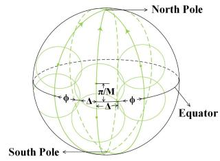

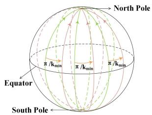  
(a) Global 1-coverage  
(b) Global kmin-coverage  
Fig. 4. Initial LEO satellite constellation deployment

Note that the satellites in adjacent orbits moving in the same direction can cover an area with a longitude span of $( \varphi + \Delta )$ while the satellites in adjacent orbits moving in the opposite direction can cover an area with a longitude span of 2∆ [13]. Therefore, the global 1-coverage can be guaranteed by the polar-orbit LEO satellite constellation satisfying eq. (21). After determining the global 1-coverage polar-orbit LEO satellite constellation deployment, we can copy the polar-orbit LEO satellite constellation illustrated above $k _ { \operatorname* { m i n } { } } - 1$ times on the same location, and then rotate the ith $( 1 \leq i \leq k _ { \operatorname* { m i n } } - 1 )$ duplicate around the north-south direction by an angle $i \pi / k _ { \mathrm { m i n } } .$ Therefore, as shown in Fig. 4(b), we obtain the initial polarorbit LEO satellite constellation consisting of $N = N _ { 0 } k _ { m i n }$ polar orbits and M satellites in each orbit, based on which the global $k _ { \mathrm { m i n } }$ -coverage can be ensured. The upper bound of the minimum number of LEO satellites guaranteeing global $k _ { \mathrm { m i n } ^ { - } }$ coverage can then be given by $\begin{array} { r } { ( \sum _ { n = 1 } ^ { N ^ { - } } M _ { n } ) _ { \operatorname* { m a x } } = M N _ { 0 } k _ { m i n } . } \end{array}$

## C. Three-Dimensional Constellation Optimization Algorithm

1) Eligibility of A Satellite: Note that for a given initial LEO satellite constellation as mentioned above, there are several unnecessary LEO satellites resulting in coverage redundant. In other words, the backhaul requirement of each UT can also be satisfied even if these LEO satellites are removed from the initial constellation. Therefore, we first determine the eligibility of each satellite in the initial constellation. For convenience, we define the following notations.

Definition 2. Satellite $m$ is ineligible and can be removed from the initial constellation, if every location within satellite m’s coverage is already $k _ { \mathrm { m i n } }$ -covered by other satellites in its neighborhood. Otherwise, satellite m is eligible and can be selected into the minimum subset of LEO satellites.

Definition 3. A point p on Earth is called an intersection point between two satellites, if $p$ is an intersection point of the coverage area’s boundaries of two satellites.

Specifically, the coordinate of the intersection point between two satellites located at $( x _ { 1 } , y _ { 1 } , z _ { 1 } )$ and $( x _ { 2 } , y _ { 2 } , z _ { 2 } )$ can be obtained by solving the following equations with respect to $( x , y , z )$

$$
\left\{ \begin{array}{c} x x _ {1} + y y _ {1} + z z _ {1} = R _ {e} (R _ {e} + h) \cos \varphi , \\ x x _ {2} + y y _ {2} + z z _ {2} = R _ {e} (R _ {e} + h) \cos \varphi , \\ x ^ {2} + y ^ {2} + z ^ {2} = R _ {e} ^ {2}. \end{array} \right.\tag{23}
$$

Without loss of generality, we assume that $x _ { 1 } y _ { 2 } \neq x _ { 2 } y _ { 1 }$ . The closed-form solution of the coordinate of the intersection point can be given by

$$
\left( \begin{array}{c} x \\ y \\ z \end{array} \right) = \left( \begin{array}{c} \frac {(y _ {2} - y _ {1}) R _ {e} (R _ {e} + h) \cos \varphi}{x _ {1} y _ {2} - x _ {2} y _ {1}} \\ \frac {(x _ {1} - x _ {2}) R _ {e} (R _ {e} + h) \cos \varphi}{x _ {1} y _ {2} - x _ {2} y _ {1}} \\ 0 \end{array} \right) + \kappa \left( \begin{array}{c} y _ {1} z _ {2} - y _ {2} z _ {1} \\ z _ {1} x _ {2} - z _ {2} x _ {1} \\ x _ {1} y _ {2} - x _ {2} y _ {1} \end{array} \right),\tag{24}
$$

where κ can be obtained by solving the following quadratic equation:

$$
\begin{array}{r l} & {\kappa^ {2} [ (y _ {1} z _ {2} - y _ {2} z _ {1}) ^ {2} + (z _ {1} x _ {2} - z _ {2} x _ {1}) ^ {2} + (x _ {1} y _ {2} - x _ {2} y _ {1}) ^ {2} ]} \\ & {+ \kappa \frac {2 R _ {e} (R _ {e} + h) \cos \varphi}{x _ {1} y _ {2} - x _ {2} y _ {1}} [ (y _ {2} - y _ {1}) (y _ {1} z _ {2} - y _ {2} z _ {1})} \\ & {+ (x _ {1} - x _ {2}) (z _ {1} x _ {2} - z _ {2} x _ {1}) ] + \left[ \frac {R _ {e} (R _ {e} + h) \cos \varphi}{x _ {1} y _ {2} - x _ {2} y _ {1}} \right] ^ {2}} \\ & {\cdot [ (y _ {2} - y _ {1}) ^ {2} + (x _ {1} - x _ {2}) ^ {2} ] - R _ {e} ^ {2} = 0.} \end{array}\tag{25}
$$

Before presenting the three-dimensional constellation optimization algorithm, we introduce the following proposition which states a sufficient condition for global $k _ { \mathrm { m i n } } { \mathrm { - c o v e r a g e . } }$ Proposition 3. The Earth’s surface is k-covered by a set of

LEO satellites if (a) there exist intersection points between two satellites; (b) all intersection points are at least k-covered [34]. Proof. See Appendix E.

According to Proposition 3, the $k _ { \mathrm { m i n } }$ -covered eligibility rule determining whether a satellite in the initial polar-orbit LEO satellite constellation should be removed can be obtained. Specifically, a satellite is ineligible and can be removed from the initial constellation if all the intersection points inside its coverage area are at least $k _ { \mathrm { m i n } }$ -covered. Otherwise, the satellite can not be removed. Therefore, we propose the second criterion for LEO satellite constellation design to determine whether a satellite should be removed from the initial constellation.

Criterion 2 (Satellite’s $k _ { \mathrm { m i n } }$ -covered Eligibility): For each LEO satellite in the initial polar-orbit LEO satellite constellation, whether it should be removed from the initial constellation is determined by the coverage-based eligibility rule.

2) Execution of Criterion 2: Note that if the eligibility of all satellites is determined based on this $k _ { m i n }$ -covered eligibility rule in the first time slot, the number of ineligible satellites flying over the high latitude area will be larger than that of the low latitude area. When satellites in the high latitude area fly over the low latitude area in later time slots, it is likely that global $k _ { \mathrm { m i n } } { \mathrm { - c o v e r a g e } }$ can not be achieved. Therefore, we consider reducing the number of ineligible satellites flying over the high latitude area to guarantee the global $k _ { \mathrm { m i n } }$ -coverage in any time slot $t \in \tau$ . Specifically, we define a larger required coverage degree over high latitude area $k _ { \mathrm { m a x } } \ : ( k _ { \mathrm { m a x } } \geq k _ { \mathrm { m i n } } )$ The eligibility of satellites flying over the high latitude area is determined based on the $k _ { \operatorname* { m a x } } .$ -covered eligibility rule.

Since the number of eligible satellites which can not be removed from the initial constellation increases with $k _ { \operatorname* { m a x } } ,$ the coverage ratio averaged over all time slots of the optimized LEO satellite constellation will increase correspondingly. Therefore, the value of $k _ { \mathrm { m a x } }$ can be determined by the coverage ratio requirement, and the third criterion for LEO satellite constellation design can then be given as follows.

Criterion 3 (Latitude-based k-covered Eligibility Selection): The eligibility of satellites flying over the high latitude area is determined by the $k _ { \mathrm { m a x } } { \mathrm { - c o v e r e d } }$ eligibility rule $( k _ { \operatorname* { m a x } } \geq k _ { \operatorname* { m i n } } )$ , while the eligibility of satellites flying over the low latitude area is determined by the $k _ { \mathrm { m i n } }$ -covered eligibility rule. The value of $k _ { \mathrm { m a x } }$ is determined by the coverage ratio requirement.

3) Three-Dimensional Constellation Optimization Algorithm Description: According to the above three criteria (i.e., backhaul requirement, satellite’s $k _ { \mathrm { m i n } }$ -covered eligibility, and latitude-based k-covered eligibility selection) for LEO satellite constellation design, the three-dimensional constellation optimization algorithm is summarized in Algorithm 1 where the bisection method [35] is adopted to find the proper value of $k _ { \operatorname* { m a x } } .$ In the initialization step (line 1), the LEO satellites are deployed according to the global k-coverage LEO polarorbit constellation shown in Section IV.B. The search interval of $k _ { \mathrm { m a x } }$ for the bisection method is set as $[ k _ { \operatorname* { m i n } } , k _ { M A X } ]$ The following LEO satellite constellation optimization process (line 2-23) consists of multiple iterations. In each iteration, the selection of a minimum subset of LEO satellites following the coverage-based eligibility rule (line 4-15) is performed, based on which the selection of the proper value of $k _ { \mathrm { m a x } }$ adopting the bisection method (line 16-22) is also performed. The iterations will not stop until the search interval width of the bisection method is reduced to 0, i.e., the average coverage ratio of the optimized constellation η meets the coverage ratio requirement $\eta _ { 0 }$ . Therefore, for any given coverage ratio requirement, the proposed three-dimensional constellation optimization algorithm can give a corresponding optimized LEO satellite constellation by choosing a proper value of $k _ { \operatorname* { m a x } } \mathrm { ^ { 9 } } .$

Algorithm 1: Three-Dimensional Constellation Optimization Algorithm

Input: Coverage degree for low latitude area  $k_{min}$ , coverage degree for high latitude area  $k_{max}$ , coverage ratio requirement  $\eta_{0}$ .

1 Initialization: Global k-coverage LEO polar-orbit constellation deployment shown in Section IV.B,  $k_{max}$ 's lower bound  $k_{m} = k_{min}$ ,  $k_{max}$ 's upper bound  $k_{M} = k_{MAX}$ ;

2 while  $k_{M} &gt; k_{m}$  do

3 Set  $k_{\max} = \left[\frac{k_{m} + k_{M} - 1}{2}\right] + 1$ ;

4 for Satellite m in M do

5 Find all intersection points inside the coverage area of m and calculate their coverage degrees;

6 if m flies over high latitude area then

7 Determine the eligibility of m based on the  $k_{\max}$ -covered eligibility rule.

8 end

9 else if m flies over low latitude area then

10 Determine the eligibility of m based on the  $k_{\min}$ -covered eligibility rule.

11 end

12 if m is ineligible then

13 Remove m from the satellite set M.

14 end

15 end

16 Calculate the average coverage ratio  $\eta$ ;

17 if  $\eta &lt; \eta_{0}$  or  $k_{\max} = k_{M}$  then

18 Set  $k_{m} = k_{max}$ ;

19 end

20 else

21 Set  $k_{M} = k_{max}$ ;

22 end

23 end

Output: The minimum subset  $M_{min} \subset M$  of LEO satellites guaranteeing the given coverage ratio requirement.

Although the eligibility of all satellites is determined in the first time slot, the seamless global $k _ { \mathrm { m i n } } { \mathrm { - c o v e r a g e } }$ can be guaranteed, which will be verified in Section V. Moreover, since the initial polar-orbit constellation is deterministic, the Cartesian coordinate of each satellite in the optimized LEO satellite constellation can be given explicitly after three-dimensional constellation optimization algorithm is performed.

TABLE I  
MAJOR PARAMETERS FOR SIMULATION

<table><tr><td>Parameters</td><td>Values</td></tr><tr><td>Pathloss exponent  $\alpha$ </td><td>2</td></tr><tr><td>Transmit power of each UT  $P$  (W)</td><td>2</td></tr><tr><td>Constant power gains factor  $G$  (dBi)</td><td>43.3</td></tr><tr><td>The minimum elevation angle  $\theta_{\text{min}}$  at the UT</td><td> $10^{\circ} \sim 18^{\circ}$ </td></tr><tr><td>The number of subchannels  $J$ </td><td>1000</td></tr><tr><td>Density of UTs  $\lambda$  (km $^{-2}$ )</td><td> $4 \times 10^{-6}$ </td></tr><tr><td>Backhaul requirement for each UT  $C_{th}$  (Mbps)</td><td>60 ~ 160</td></tr><tr><td>Altitude of LEO satellites (km)</td><td>900</td></tr><tr><td>Bandwidth for Ka-band communications  $B$  (MHz)</td><td>800</td></tr><tr><td>Noise density for Ka-band communications  $\sigma^{2}$  (dBm/Hz)</td><td>-203</td></tr></table>

4) Complexity Analysis: On the convergence of Algorithm 1, we observe the following facts. The complexity of Algorithm 1 is determined by the calculation of each intersection point’s coverage degrees of in line 5. We assume that the coverage area of each satellite is intersected with at most L coverage areas of other satellites. For each satellite, the complexity of finding all intersection points inside its coverage area is $\mathcal { O } ( N M L ^ { 2 } )$ , where N is the number of orbits and M is the number of satellites operated in each orbit in the initial polar-orbit constellation. The calculation of each intersection point’s coverage degree has a complexity of $\mathcal O ( L )$ . Therefore, the complexity of line 5 is $\mathcal { O } ( N M L ^ { 3 } )$ , and thus, the whole algorithm has a complexity of $\mathcal { O } ( N ^ { 2 } M ^ { 2 } L ^ { 3 } )$ .

## V. SIMULATION RESULTS

In this section, we present the simulation results of the LEO satellite constellation with a minimum number of satellites based on the proposed three-dimensional constellation optimization algorithm. Major simulation parameters are set up based on the 3GPP specifications [29] as given in Table I.

## A. The Average Total Backhaul Capacity of Each UT

Fig. 5 illustrates the average total backhaul capacity of each UT versus the density of UTs λ. It shows that the average total backhaul capacity of each UT decreases as λ grows, which verifies the statement in Remark 1. The main reason is that the available bandwidth for each UT decreases and more UTs result in more interference links. We also observe that the average total backhaul capacity of each UT increases with the number of satellites providing data services. It can also be seen that our theoretical result in (16) perfectly matches with the simulation results.

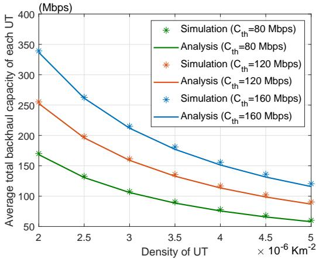  
Fig. 5. Average total backhaul capacity of each UT versus the density of UTs

## B. The Number of Deployed LEO Satellites

Note that there are various factors influencing the number of deployed (i.e., eligible) LEO satellites such as the backhaul requirement of each UT, the average coverage ratio requirement, the density of UTs, the initial constellation deployment, the altitude of satellites, and the minimum elevation angle at the UT. We first evaluate the influence of the required backhaul capacity of each UT $C _ { t h }$ and the coverage ratio averaged over all time slots and then investigate how the rest factors influence the number of deployed LEO satellites.

Fig. 6 shows a 3D surface plot of the deployed LEO satellite number versus the required backhaul capacity of each UT $C _ { t h }$ and the coverage ratio averaged over all time slots. The specific value of the minimum LEO satellite number guaranteeing coverage ratio over 90% and 95% is also given in Table II. It can be seen that the number of deployed LEO satellites increases with $C _ { t h } .$ . The coverage ratio averaged over all time slots also increases with the number of deployed LEO satellites when $k _ { \mathrm { m i n } }$ is fixed. Moreover, Fig. 6 shows that for any given coverage ratio requirement, the corresponding optimized LEO satellite constellation can be obtained by the proposed threedimensional constellation optimization algorithm.

TABLE II  
THE MINIMUM NUMBER OF LEO SATELLITES GUARANTEEING COVERAGE RATIO OVER 90% AND 95%

<table><tr><td colspan="2">Required coverage degree  $k_{\min}$ </td><td>3</td><td>4</td><td>5</td><td>6</td><td>7</td><td>8</td></tr><tr><td rowspan="2">Number of LEO satellites</td><td>Coverage ratio over 90%</td><td>193</td><td>259</td><td>311</td><td>389</td><td>440</td><td>503</td></tr><tr><td>Coverage ratio over 95%</td><td>202</td><td>270</td><td>328</td><td>408</td><td>468</td><td>528</td></tr></table>

TABLE III

THE RELATION BETWEEN $N _ { 0 }$ AND INITIAL NUMBER OF LEO SATELLITES MN

<table><tr><td colspan="2">Number of orbits for global 1-coverage  $N_0$ </td><td>5</td><td>6</td><td>7</td><td>8</td><td>9</td></tr><tr><td rowspan="2">Initial number of LEO satellites MN</td><td> $C_{th}=100Mbps$ </td><td>456</td><td>392</td><td>384</td><td>396</td><td>440</td></tr><tr><td> $C_{th}=140Mbps$ </td><td>570</td><td>490</td><td>480</td><td>495</td><td>550</td></tr></table>

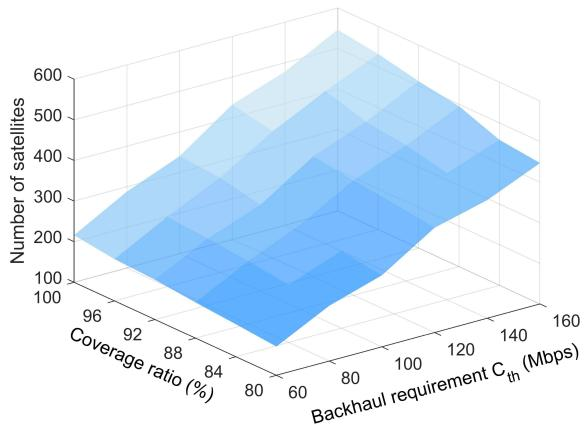  
Fig. 6. The number of deployed LEO satellite versus coverage degree

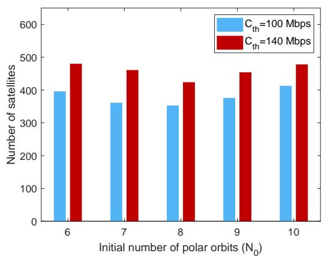  
Fig. 7. The number of deployed LEO satellite versus $N _ { 0 }$

Note that there is a close relation between the number of orbits in the initial global 1-coverage polar-orbit constellation, $\mathrm { i . e . , } N _ { 0 } ,$ the number of satellites in each orbit M , the satellites altitude $h ,$ and the minimum elevation angle $\theta _ { \mathrm { m i n } }$ at the UT as given in eq. (22). Since the satellites’ altitude h and the minimum elevation angle $\theta _ { \mathrm { m i n } }$ at the UT also influences the average total backhaul capacity of each UT, we consider evaluating the influence of $( N _ { 0 } , M )$ and $( h , \theta _ { \mathrm { m i n } } )$ separately. Fig. 7 illustrates the number of deployed LEO satellites versus $N _ { 0 }$ when h and $\theta _ { \mathrm { m i n } }$ are $\mathrm { { \ f i x e d } ^ { 1 0 } }$ . We observe that the number of deployed LEO satellites first decreases then increases as $N _ { 0 }$ grows. The main reason is that when $h$ and $\theta _ { \mathrm { m i n } }$ are fixed, based on the relation between $N _ { 0 }$ and M given in eq. (22), the total number of satellites in the initial constellation M N (i.e., $M N _ { 0 } k _ { \mathrm { m i n } } )$ first decreases then increases as $N _ { 0 }$ grows, as shown in Table III. This implies that the number of deployed LEO satellites in the optimized constellation has a close relation to the initial LEO satellite constellation. The initialization of LEO satellite constellation can be optimized to minimize the number of LEO satellites.

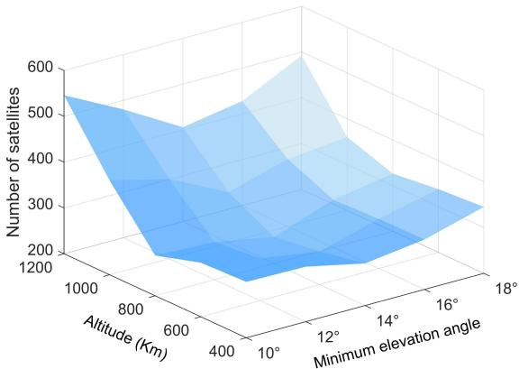  
Fig. 8. The number of deployed LEO satellite versus satellites’ altitude and minimum elevation angle

Fig. 8 shows a 3D surface plot of the deployed LEO satellite number versus the altitude of satellites h and the minimum elevation angle $\theta _ { \mathrm { m i n } }$ at the UT when the backhaul requirement for each UT $C _ { t h }$ is $1 0 0 \mathbf { M } \mathbf { b p s } ^ { 1 1 }$ . It can be seen that the number of deployed LEO satellites first increase and then decreases as h grows when $\theta _ { \mathrm { m i n } }$ is fixed. The main reason is that each satellite can provide services to more UTs as h grows. However, when h continues to grow, severe path loss results in the sharp decline of the backhaul capacity, and thus, more satellites are needed.

We can also observe from Fig. 8 that the number of deployed LEO satellites first increase and then decreases as $\theta _ { \mathrm { m i n } }$ grow when h is fixed. This is because the average data rate of the UT-satellite link increases with $\theta _ { \mathrm { m i n } }$ . However, the decline of the number of UTs within each satellite’s coverage becomes the main influencing factor when $\theta _ { \mathrm { m i n } }$ continues to grow. This implies there exists an optimal combination of the satellites’ altitude and minimum elevation angle at the UT minimizing the number of LEO satellites. Under the parameter settings in the simulation, the optimal combination of h and $\theta _ { \mathrm { m i n } }$ is (800Km, 14◦).

Fig. 9 depicts the number of deployed LEO satellites versus the density of UTs λ when the average data rate of the UTsatellite link and the backhaul requirement of each UT are fixed. We observe that the number of deployed LEO satellites increases with the density of UTs. The main reason is that the total backhaul capacity requirement of all UTs is higher. It can also be seen that the number of deployed LEO satellites increases with the minimum elevation angle $\theta _ { \mathrm { m i n } }$ at the UT. This is because the number of satellites which can provide service to each UT decreases with the minimum elevation angle $\theta _ { \mathrm { m i n } }$

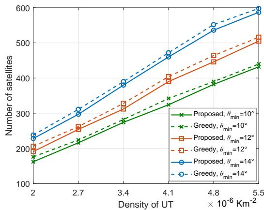  
Fig. 9. The number of deployed LEO satellite versus the density of UTs

Another important observation in Fig. 9 is that the proposed three-dimensional constellation optimization algorithm outperforms the greedy constellation algorithm, where the satellites in the initial constellation are removed based on the greedy method. Specifically, compared with the LEO satellite constellation optimized by the greedy algorithm, the satellite constellation optimized by the proposed three-dimensional constellation optimization algorithm can meet the backhaul requirement with a smaller number of satellites. This shows the effectiveness of our proposed three-dimensional constellation optimization algorithm.

## C. The Stability of the Proposed Optimized LEO Satellite Constellation

Since LEO satellites are under the influence of various perturbative forces such as the gravitation from other planets and the atmospherical drag, which affect their orbits and cause relative drifts [36], Fig. 10 evaluates the stability of the proposed optimized LEO satellite constellation in different coverage ratios. It can be seen that there is only a slight drop in the coverage ratio even the satellites’ maximum radial offset grows to $1 0 \bar { \mathsf { K } } \mathsf { m } ^ { 1 2 }$ , indicating the stability of the proposed optimized LEO satellite constellation.

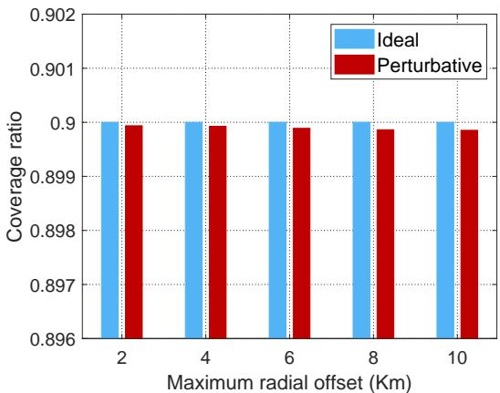  
(a) Coverage ratio of 90%

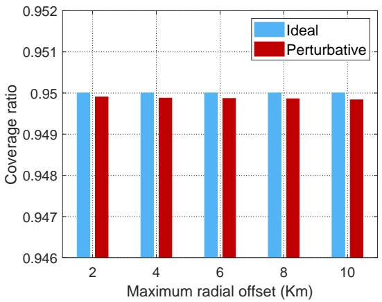  
(b) Coverage ratio of 95%  
Fig. 10. Coverage ratio versus the satellites’ maximum radial offset

## D. Comparison with Other LEO Satellite Constellations

To further evaluate the performance of the proposed threedimensional constellation optimization algorithm, we consider comparing the LEO satellite constellation optimized by the proposed three-dimensional constellation optimization algorithm with other representative global LEO satellite constellations.

TABLE IV  
AVERAGE COVERAGE RATIO OF THE ONEWEB CONSTELLATION

<table><tr><td>Backhual capacity requirement  $C_{th}$  (Mbps)</td><td>160</td><td>180</td><td>200</td><td>220</td><td>240</td></tr><tr><td>Average coverage ratio (%)</td><td>100</td><td>96</td><td>93</td><td>90</td><td>84</td></tr></table>

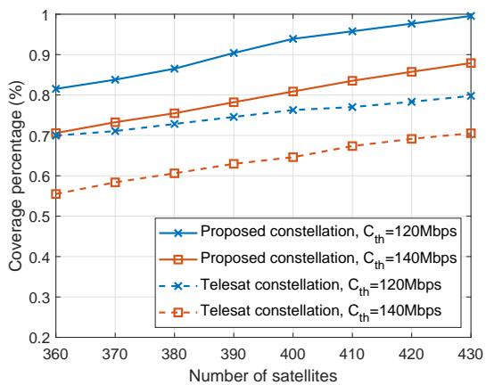  
Fig. 11. Comparison between the proposed constellation and the modified Telesat constellation

Fig. 11 compares the LEO satellite constellation optimized by the proposed three-dimensional constellation optimization algorithm with a modified Telesat constellation13. Specifically, the modified Telesat constellation consists of no less than 117 LEO satellites distributed on two sets of orbital planes. The first set consists of 6 polar orbits with at least 12 satellites on each orbital plane. The orbital inclination is $9 9 . 5 ^ { \circ }$ and the altitude is 1000Km. The second set consists of no less than 5 inclined orbits with a minimum of 10 satellites on each orbital plane. The orbital inclination is $4 5 ^ { \circ }$ and the altitude is 1200Km. It can be seen that for a given coverage degree and the total number of deployed LEO satellites, the average coverage ratio of the proposed optimized LEO satellite constellation is at least 10 percentage points higher than that of the modified Telesat constellation, indicating the effectiveness of the proposed three-dimensional constellation optimization algorithm.

Fig. 12 compares the LEO satellite constellation optimized by the proposed three-dimensional constellation optimization algorithm with the OneWeb constellation. The OneWeb constellation consists of 720 LEO satellites distributed on 18 near polar orbits. Each near polar orbit consists of 40 uniformly distributed LEO satellites. The orbital inclination is $8 7 ^ { \circ }$ and the altitude is 1200Km. Since the total number and the distribution of LEO satellites are fixed in the OneWeb constellation, the average coverage ratio of the OneWeb constellation varies with the backhaul capacity requirement of the UT. Specifically, the average coverage ratio corresponding to different backhaul capacity requirement of the UT is given in Table IV. For the fairness of the comparison, under the same backhaul capacity requirement $C _ { t h }$ , we set the average coverage ratio of the proposed constellation the same as that of the OneWeb constellation. It can be seen that for a given backhaul capacity requirement and average coverage ratio, the number of deployed LEO satellites in the proposed optimized LEO satellite constellation is smaller than that of the OneWeb constellation, which also verifies the effectiveness of the proposed threedimensional constellation optimization algorithm. Both Fig. 11 and Fig. 12 imply that a well-designed asymmetrical satellite constellation $( \mathrm { i . e . , }$ satellites are not uniformly distributed on orbits) can meet the backhaul requirement with a smaller number of deployed satellites than the traditional symmetrical satellite constellation (i.e., satellites are uniformly distributed on orbits).

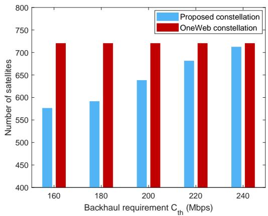  
Fig. 12. Comparison between the proposed constellation and the OneWeb constellation

## VI. CONCLUSION

In this paper, we have considered the ultra-dense LEO satellite constellation deployment to satisfy the backhaul capacity requirement of UTs. We have derived the average total backhaul capacity and the required coverage degree $( \mathrm { i } . \mathrm { e } . , k _ { \mathrm { m i n } } )$ of each UT, based on which an initial constellation deployment guaranteeing global $k _ { \mathrm { m i n } } { \mathrm { - c o v e r a g e } }$ has been given. To minimize the number of LEO satellites, a three-dimensional constellation optimization algorithm jointly considering the seamless global coverage and the backhaul requirement of UTs has been designed, based on which the corresponding optimized LEO satellite constellation can be obtained for any given coverage ratio requirement. Specifically, three design criteria about backhaul requirement satisfaction, satellite’s eligibility, and latitude-based eligibility selection have been applied to optimize the LEO satellite constellation. The Cartesian coordinate of each satellite in the optimized LEO satellite constellation can be given explicitly after the proposed algorithm is performed. Simulation results have shown that the coverage ratio of the proposed LEO satellite constellation remains almost unchanged even the satellites’ maximum radial offset is very large, thereby verifying the constellation’s stability. It has also been proved that the proposed LEO satellite constellation can improve the average coverage ratio of Telesat constellation by at least 10 percentage points.

Three conclusions can be drawn from the simulation results. First, the initialization of LEO satellite constellation can be optimized to minimize the number of LEO satellites. Second, there exists an optimal combination of the satellites’ altitude and minimum elevation angle at the UT minimizing the number of LEO satellites. Third, a well-designed asymmetrical satellite constellation can meet the backhaul requirement with a smaller number of deployed satellites than the traditional symmetrical satellite constellation.

## APPENDIX A

## PROOF OF PROPOSITION 1

Without loss of generality, we assume that UT q is located in the north pole. According to Campell’s theorem (Chapter $4 , \quad [ 4 0 ] )$ , the interference of UT q - satellite m link is $\begin{array} { r } { \mathbb { E } ( I _ { m , q } ) = \lambda ^ { \prime } P G \int _ { q ^ { \prime } \in D _ { m . q } } d _ { m , q ^ { \prime } } ^ { - \alpha } d q ^ { \prime } } \end{array}$ , where $D _ { m , q } = \{ q ^ { \prime } | d _ { m } \leq$ $d _ { m , q ^ { \prime } } \leq \sqrt { h ^ { 2 } + 2 \bar { R } _ { e } h } \}$ is the region with latitude between (arcsin $\frac { R _ { e } } { R _ { e } + h } )$ and $\left( { \frac { \pi } { 2 } } - \varphi \right)$ . We then use the spherical segments between latitude lines as the partition of the integral region, and thus, $\mathbb { E } ( I _ { m , q } )$ can be obtained by

$$
\mathbb {E} (I _ {m, q}) = \lambda^ {\prime} P G \int_ {\arcsin \frac {R _ {e}}{R _ {e} + h}} ^ {\frac {\pi}{2} - \varphi} 2 \pi R _ {e} ^ {2} \cos \beta \cdot [ R _ {e} ^ {2} + (R _ {e} + h) ^ {2} - 2 R _ {e} (R _ {e} + h) \sin \beta ] ^ {- \frac {\alpha}{2}} d \beta
$$

$$
\stackrel {(a)} {=} \lambda^ {\prime} P G \int_ {\frac {R _ {e}}{R _ {e} + h}} ^ {\cos \varphi} 2 \pi R _ {e} ^ {2} \cdot [ R _ {e} ^ {2} + (R _ {e} + h) ^ {2} - 2 R _ {e} (R _ {e} + h) u ] ^ {- \frac {\alpha}{2}} d u
$$

$$
\begin{array}{r l} & {\stackrel {(b)} {=} \frac {\lambda^ {\prime} P G}{2 R _ {e} (R _ {e} + h)} \int_ {d _ {m} ^ {2}} ^ {h ^ {2} + 2 R _ {e} h} 2 \pi R _ {e} ^ {2} v ^ {- \frac {\alpha}{2}} d v} \\ & {= \frac {2 \pi R _ {e} \lambda P G}{J (\alpha - 2) (R _ {e} + h)} [ d _ {m} ^ {2 - \alpha} - (2 R _ {e} h + h ^ {2}) ^ {\frac {2 - \alpha}{2}} ],} \end{array}\tag{26}
$$

where in (a) and (b) the substitutions $u \ = \ \sin \beta$ and $v =$ $R _ { e } ^ { 2 } + ( R _ { e } + h ) ^ { 2 } - 2 R _ { e } ( R _ { e } + h ) \iota$ are applied respectively.

## APPENDIX B PROOF OF LEMMA 1

Without loss of generality, we assume that UT q is located in the north pole and the satellites are uniformly distributed on the sphere with radius $R _ { e } ~ + ~ h$ . For simplicity, we denote the region where satellites are visible to the UT in one snapshot as $S _ { q } .$ The area of

$S _ { q }$ can then be given by $\begin{array} { r c l } { S _ { S _ { q } } } & { = } & { 2 \pi ( R _ { e } \ + \ h ) ^ { 2 } ( 1 \ - } \end{array}$ cos ϕ). Therefore, the expectation of log2 $\begin{array} { r } { \left( 1 + \frac { P g _ { m , q } } { \sigma ^ { 2 } + \mathbb { E } \left( I _ { m , q } \right) } \right) } \end{array}$ can be given by $\begin{array} { r l r } { \Upsilon } & { { } = } & { \mathbb { E } \left[ \log _ { 2 } \left( 1 + \frac { P g _ { m , q } } { \sigma ^ { 2 } + \mathbb { E } \left( I _ { m , q } \right) } \right) \right] \quad = } \end{array}$ $\begin{array} { r } { \frac { 1 } { S _ { S _ { q } } \ln 2 } \int _ { m \in S _ { q } } \ln \left( 1 + \frac { P g _ { m , q } } { \sigma ^ { 2 } + \mathbb { E } \left( I _ { m , q } \right) } \right) d m } \end{array}$ . Similar to the partition of the integral region utilized in the proof of Proposition 1, Υ can be calculated by

$$
\begin{array}{r l r} & & {\Upsilon = \frac {1}{S _ {S _ {q}} \ln 2} \int_ {\frac {\pi}{2} - \varphi} ^ {\frac {\pi}{2}} 2 \pi (R _ {e} + h) ^ {2} \cos \psi \ln \{1 + \frac {P G}{\sigma^ {2} + \mathbb {E} (I _ {m , q})}.} \\ & & {[ R _ {e} ^ {2} + (R _ {e} + h) ^ {2} - 2 R _ {e} (R _ {e} + h) \sin \psi ] ^ {- \frac {\alpha}{2}} \} d \psi} \\ & & {\overset {(a)} {=} \frac {\pi (1 + \frac {h}{R _ {e}})}{S _ {S _ {q}} \ln 2} \int_ {h ^ {2}} ^ {d _ {m} ^ {2}} \ln \left[ 1 + \frac {P G v ^ {- \frac {\alpha}{2}}}{\sigma^ {2} + \mathbb {E} (I _ {m , q})} \right] d v,} \end{array}\tag{27}
$$

where in (a) the substitution $\begin{array} { r l r } { v } & { { } = } & { R _ { e } ^ { 2 } + ( R _ { e } + } \end{array}$ $\begin{array} { r l r } { h ) ^ { 2 } } & { { } - } & { 2 R _ { e } ( R _ { e } \quad + \quad h ) u } \end{array}$ is applied. By utilizing the integral formula, $\begin{array} { r l r l r } { \mathrm { i . e . , } } & { { } \int \ln ( 1 } & { + } & { A v ^ { B } ) d v } & { { } } & { = } \end{array}$ $v \big [ B _ { \mathrm { \scriptsize ~ 2 } } F _ { 1 } ( 1 , { \textstyle \frac { 1 } { B } } ; 1 + { \textstyle \frac { 1 } { B } } ; - A v ^ { B } ) + \mathrm { \tilde { l o g } } ( \dot { A } v ^ { B } + 1 ) - \dot { B } \big ] , \qquad \Upsilon$ can then be obtained by setting $\begin{array} { r } { A = \frac { P G } { \sigma ^ { 2 } + { \mathbb E } ( I _ { m , q } ) } } \end{array}$ and $\bar { B } = - \frac { \alpha } { 2 }$ in the integral formula.

## APPENDIX C PROOF OF PROPOSITION 2

Proposition 2 can be derived from Lemma 1 by utilizing the Puiseux series of the exponential integral, i.e., $E i ( x ) =$ $\begin{array} { r } { \gamma + l n ( x ) + \sum _ { k = 1 } ^ { \infty } \frac { x ^ { k } } { k \cdot k ! } } \end{array}$ , where γ is the Euler constant. By substituting the expectation of log $\begin{array} { r } { \left( 1 + \frac { P g _ { m , q } } { \sigma ^ { 2 } + \mathbb { E } \left( I _ { m , q } \right) } \right) } \end{array}$ given in Lemma 1 into eq. (14), i.e., $\mathbb { E } ( R _ { m , q } ) = \sum _ { k = 1 } ^ { \infty } ( \lambda S ) ^ { k }$ $\begin{array} { r } { \frac { e ^ { - \lambda S } } { k ! } \cdot \frac { B } { k } \cdot \mathbb { E } \left[ \log _ { 2 } \left( 1 + \frac { P g _ { m , q } } { \sigma ^ { 2 } + \mathbb { E } \left( I _ { m , q } \right) } \right) \right] } \end{array}$ , we have $\mathbb { E } ( R _ { m , q } ) =$ $\sum _ { k = 1 } ^ { \infty } ( \lambda S ) ^ { k } \cdot \frac { e ^ { - \bar { \lambda } S } } { k ! } \cdot \frac { B } { k } \cdot \Upsilon \stackrel { \left( a \right) } { = } \left( E i ( \lambda S ) - \ln ( \lambda S ) - \gamma \right) e ^ { - \lambda S } B \Upsilon ,$ 2 where in (a) the Puiseux series of the exponential integral is applied.

## APPENDIX D PROOF OF REMARK 1

On the one hand, since the average interference of UT $q \mathrm { ~ - ~ }$ satellite m link given in eq. (11) increases with the density of UTs λ, $\begin{array} { r } { \Upsilon = \mathbb { E } \left[ \mathrm { \tilde { l o g } } _ { 2 } \left( 1 + \frac { \tilde { P } \tilde { g _ { m , q } } } { \sigma ^ { 2 } + \mathbb { E } \left( I _ { m , q } \right) } \right) \right] } \end{array}$ decreases as λ grows. On the other hand, we have $\frac { d \big [ ( E i ( \lambda S ) - \ln ( \lambda S ) - \gamma ) e ^ { - \lambda S } \big ] } { d ( \lambda S ) }$ $\begin{array} { r } { e ^ { - \lambda S } \left\lceil 1 - \sum _ { k = 1 } ^ { + \infty } \frac { ( \lambda S ) ^ { k } } { k ! k ( k + 1 ) } \right\rceil } \end{array}$ . Note that when $\lambda S \geq 2 ( \mathrm { i . e . , }$ there are no less than 2 UTs within each LEO satellite’s coverage, which is accordant with practical circumstances.), we have $\begin{array} { r } { 1 - \sum _ { k = 1 } ^ { + \infty } \frac { ( \lambda S ) ^ { k } } { k ! k ( k + 1 ) } < \bar { 1 } - \frac { \lambda S } { 2 } \leq 0 } \end{array}$ . Therefore, $( E i ( \lambda S ) - \ln ( \lambda S ) - \gamma ) \dot { e } ^ { - \lambda S }$ also decreases as λ grows, and the average total backhaul capacity of each UT given in eq. (16) decreases as the density of UTs grows.

## APPENDIX E PROOF OF PROPOSITION 3

We prove by contradiction. As shown in Fig. 13, assume that point q has the smallest coverage degree $k _ { q } < k$ on the

Earth surface, and all intersection points between two satellites on the Earth surface are at least k-covered. The set of LEO satellites’ coverage area can partition the Earth surface into a collection of coverage patches, which are bounded by arcs of the coverage area. Besides, all points in each coverage patch have the same coverage degree. Assume that point q is located in coverage patch S.

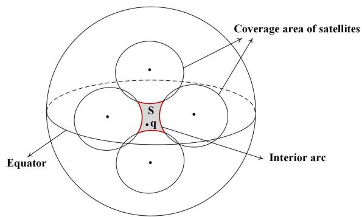  
Fig. 13. Illustration of the coverage patch bounded by exterior arcs of satellites’ coverage area

We first prove by contradiction that the interior arc of any coverage area cannot serve as the boundary of S. Assume that there exists an interior arc serving as the boundary of S. Note that crossing this arc can reach an area that has a smaller coverage degree than point q, which contradicts the assumption that point q has the smallest coverage degree on the Earth surface. Therefore, the boundary of S is consists of exterior arcs of the set of LEO satellites’ coverage area as illustrated in Fig. 13. Moreover, since the arcs of each LEO satellite’s coverage area are outside the satellite’s coverage range, the entire boundary of S, including the intersection points of between two satellites defining the boundary, has the same coverage degree as point q. This contradicts the assumption that q has a smaller coverage degree than k and all intersection points are at least k-covered. Proposition 3 can then be proved.

## REFERENCES

[1] U. Siddique, H. Tabassum, E. Hossain, and D. I. Kim, “Wireless backhauling of 5G small cells: challenges and solution approaches,” IEEE Wireless Commun., vol. 22, no. 5, pp. 22-31, Oct. 2015.

[2] T. Wang, S. Wang, and Z. Zhou, “Machine learning for 5G and beyond from model-based to data-driven mobile wireless networks,” China Commun., vol. 16, no. 1, pp. 165-175, Jan. 2019.

[3] X. Ge, H. Cheng, M. Guizani, and T. Han, “5G wireless backhaul networks: Challenges and research advances,” IEEE Netw., vol. 28, no. 6, pp. 6-11, Nov./Dec. 2014.

[4] Y. Ruan, Y. Li, C. Wang, R. Zhang, and H. Zhang “Performance evaluation for underlay cognitive satellite-terrestrial cooperative networks,” Sci. China Inf. Sci., vol. 61, no. 10, pp. 1-11, Oct. 2018.

[5] Z. Zhang, Y. Li, C. Huang, Q. Guo, L. Liu, C. Yuen and Y. Guan, “User activity detection and channel estimation for grant-free random access in LEO satellite-enabled Internet-of-Things,” IEEE Internet Things J., vol. 7, no. 9, pp. 8811-8825, Sep. 2020.

[6] N. UL Hassan, C. Huang, C. Yuen, A. Ahmad, and Y. Zhang, “Dense small satellite networks for modern terrestrial communication systems: benefits, infrastructure, and technologies,” Wireless Commun. Mag., vol. 27, no. 5, pp. 96-103, Oct. 2020.

[7] C. Huang, A. Zappone, G. C. Alexandropoulos, M. Debbah and C. Yuen, “Reconfigurable intelligent surfaces for energy efficiency in wireless communication,” IEEE Trans. Wireless Commun., vol. 18, no. 8, pp. 4157-4170, Aug. 2019.

[8] C. Huang et al., “Holographic MIMO surfaces for 6G wireless networks: opportunities, challenges, and trends,” IEEE Wireless Commun., vol. 27, no. 5, pp. 118-125, Oct. 2020.

[9] R. Deng, B. Di, and L. Song, “How capacity is influenced by ultra-dense LEO topology in multi-terminal satellite systems?,” in IEEE Wireless Commun. and Networking Conf. (WCNC), Seoul, Korea (South), 2020, pp. 1-6.

[10] B. Di, L. Song, Y. Li, and H. V. Poor, “Ultra-dense LEO: Integration of satellite access networks into 5G and beyond,” IEEE Wireless Commun., vol. 26, no. 2, pp. 62-69, Apr. 2019.

[11] M. Werner, A. Jahn, E. Lutz, and A. Bottcher, “Analysis of system parameters for LEO/ICO-satellite communication networks,” IEEE J. Sel. Areas Commun., vol. 13, no. 2, pp. 371-381, Feb. 1995

[12] Madhavendra Richharia, “Satellite constellations,” Mobile Satellite Communications: Principles and Trends, Wiley, 2013, pp.37-87

[13] D. C. Beste, “Design of satellite constellations for optimal continuous coverage,” IEEE Trans. Aerosp. Electron. Syst., vol. AES-14, no. 3, pp. 466-473, May 1978.

[14] C. J. Wang, “Structural properties of a low Earth orbit satellite constellation - the Walker delta network,” in Proc. MILCOM ’93 - IEEE Military Commun. Conf., Boston, MA, USA, 1993, pp. 968-972.

[15] D. Mortari and M. P. Wilkins, “Flower constellation set theory. Part I: Compatibility and phasing,” IEEE Trans. Aerosp. Electron. Syst., vol. 44, no. 3, pp. 953-962, Jul. 2008.

[16] M. P. Wilkins and D. Mortari, “Flower constellation set theory. Part II: Secondary paths and equivalency,” IEEE Trans. Aerosp. Electron. Syst., vol. 44, no. 3, pp. 964-976, Jul. 2008.

[17] D. Mortari, M. De Sanctis, and M. Lucente, “Design of Flower constellations for telecommunication services,” in Proc. the IEEE, vol. 99, no. 11, pp. 2008-2019, Nov. 2011.

[18] J. Jiang, S. Yan, and M. Peng, “Regional LEO satellite constellation design Based on user requirements,” in IEEE/CIC Int. Conf. Commun. in China (ICCC), Beijing, China, 2018.

[19] I. Mezianetani, G. Metris, G. Lion, F. T. Bendimerad, and M. Bekhti, “Optimization of small satellite constellation design for continuous mutual regional coverage with multi-objective genetic algorithm,” Int. J. of Comput. Intell. Syst., vol. 9, no. 4, pp. 627-637, Aug. 2016.

[20] C. Dai, G. Zheng, and Q. Chen, “Satellite constellation design with multi-objective genetic algorithm for regional terrestrial satellite network,” China Commun., vol. 15, no. 8, pp. 1-10, Aug. 2018.

[21] T. Savitri, Y. Kim, S. Jo, and H. Bang, “Satellite constellation orbit design optimization with combined genetic algorithm and semianalytical approach,” Int. J. of Aerosp. Eng., vol. 2017, pp. 1-18, May. 2017.

[22] Z. Liu, W. Guo, W. Hu, and M. Xia, “Delay minimization for progressive construction of satellite constellation network,” IEEE Commun. Lett., vol. 19, no. 10, pp. 1718-1721, Oct. 2015.

[23] Z. Qu, G. Zhang, H. Cao, and J. Xie, “LEO satellite constellation for Internet of things,” IEEE Access, vol. 5, pp. 18391-18401, 2017.

[24] X. Zhu and Y. Gao, “Comparison of Intelligent Algorithms to Design Satellite Constellations for Enhanced Coverage Capability,” in Int. Symp. Comput. Intell. and Design (ISCID), Hangzhou, 2017, pp. 223-226.

[25] Federal Communications Commissions, OneWeb non-geostationary satellite system (Attachment A), 2016.

[26] O. Montenbruck and E. Gill, Satellite orbits: models, methods and applications, Springer Science & Business Media, Berlin, Germany, 2012.

[27] J. Lopez-Fernandez, J. Paris, and E. Martos-Naya,“Bivariate Rician shadowed fading model,” IEEE Trans. Veh. Tech., pp. 378-384, vol. 67, no. 1, Jan. 2018.

[28] R. Deng, B. Di, S. Chen, S. Sun, and L. Song, “Ultra-Dense LEO satellite offloading for terrestrial networks: How much to pay the satellite operator?,” IEEE Trans. Wireless Commun., vol. 19, no. 10, pp. 6240- 6254, Oct. 2020.

[29] 3GPP TR 38.811 (V0.3.0), Study on new radio (NR) to support non terrestrial networks (Release 15), Dec. 2017.

[30] G. S. Grimmett, “Discrete random variables”, Probability and Random Processes. Oxford, UK: Oxford University Press, 2020.

[31] W. W. Bell, “Hypergeometric functions”, in Special Functions for Scientists and Engineers. North Chelmsford, MA: Courier Corporation, 2004.

[32] A. Jeffrey and H. Dai, Handbook of mathematical formulas and integrals, 4th edition. Academic Press, New York, USA, 2008.

[33] Y. Jia and Z. Peng, “The analysis and simulation of communication network in Iridium system based on OPNET,” in IEEE Int. Conf. Inform. Manage. and Eng., Chengdu, 2010, pp. 68-72.

[34] X. Wang, G. Xing, Y. Zhang, C. Lu, R. Pless, and C. Gill, “Integrated coverage and connectivity configuration in wireless sensor networks,” In Proc. 1st Int. Conf. Embedded Networked Sensor System, ACM, 2003, pp. 28-39.

[35] D. G. Luenberger and Y. Ye, “Basic descent methods,” Linear and nonlinear programming, 4th ed. Cham, Switzerland: Springer, 2016.

[36] P. E. Zadunaisky, “Small perturbations on artificial satellites as an inverse problem,” IEEE Trans. Aerosp. Electron. Syst., vol. 39, no. 4, pp. 1270- 1276, Oct. 2003.

[37] L. Pan, Z. Feng, G. Li, and M. Han, “Relative motion model of satellites formation flying base on the influence of the J2 perturbation,” in IEEE Int. Conf. Robotics and Biomimetics (ROBIO), Guilin, China, 2009, pp. 308-313.

[38] X. Cao, P. Zheng, and S. Zhang, “Atmospheric drag perturbation effect on the deployment of tether-assisted deorbit system,” in Int. Conf. Mechatronics and Automation, Changchun, China, 2009, pp. 4316-4321.

[39] I. D. Portillo, B. G. Cameron, and E. F. Crawley, “A technical comparison of three low Earth orbit satellite constellation systems to provide global broadband”, Acta Astronautica, vol. 159, pp. 123-135, 2019.

[40] M. Haenggi, “Sums and products over point processes,” in Stochastic Geometry for Wireless Networks. New York: Cambridge University Press, 2013.

  
Ruoqi Deng (S’19) received the B.S. degree in electronic engineering from Peking University, China, in 2019, where she is currently pursuing the Ph.D. degree with the Department of Electronics. Her current research interests include reconfigurable holographic metasurface, game theory, integrated aerial access, and satellite networks.

Boya Di (S’17-M’19) obtained her PhD degree from the Department of Electronics, Peking University, China, in 2019. Prior to that, she received the B.S. degree in electronic engineering from Peking University in 2014. Now she works as a postdoc researcher at Imperial College London. Her current research interests include integrated aerial access and satellite networks, reconfigurable intelligent surfaces, multi-agent systems, edge computing, vehicular networks. So far she has contributed as the first author for 11 journal articles and one of her

journal papers is currently listed as ESI highly cited papers. She serves as an associate editor for IEEE Transactions on Vehicular Technology. She has also served as a TPC member in GlobeCom 2016, GlobeCom 2020, ICCC 2017, ICC 2016, ICC 2018, ICC 2020, and VTC 2019.

Hongliang Zhang (S’15-M’19) received the B.S. and Ph.D. degrees at the School of Electrical Engineering and Computer Science at Peking University, in 2014 and 2019, respectively. He was a Postdoctoral Fellow in the Electrical and Computer Engineering Department at the University of Houston, Texas from Jul. 2019 to Jul. 2020. Currently, he is a Postdoctoral Associate in the Department of Electrical Engineering at Princeton University, New Jersey. His current research interest includes reconfigurable intelligent surfaces, aerial access networks,

and game theory. He received the best doctoral thesis award from Chinese Institute of Electronics in 2019. He is an exemplary reviewer for IEEE Transactions on Communications in 2020. He has served as a TPC Member for many IEEE conferences, such as Globecom, ICC, and WCNC. He is currently an Editor for IET Communications and Frontiers in Signal Processing. He also serves as a Guest Editor for IEEE IoT-J special issue on Internet of UAVs over Cellular Networks.

Linling Kuang (Member, IEEE) received the B.S.and M.S. degrees from the National University of Defense Technology, Changsha, China, in 1995 and 1998, respectively, and the Ph.D. degree in electronic engineering from Tsinghua University, Beijing, China, in 2004, where she has been with the Tsinghua Space Center since 2007. Her research interests include wireless broadband communications, signal processing, and satellite communication. She is a member of IEEE Communications Society.

Lingyang Song (S’03-M’06-SM’12-F’19) received his Ph.D. from the University of York, United Kingdom, in 2007, where he received the K. M. Stott Prize for excellent research. He worked as a research fellow at the University of Oslo, Norway, until rejoining Philips Research UK in March 2008. In May 2009, he joined the Department of Electronics, School of Electronics Engineering and Computer Science, Peking University, and is now a Boya Distinguished Professor. His main research interests include wireless communication and networks, sig-

nal processing, and machine learning. He was the recipient of the IEEE Leonard G. Abraham Prize in 2016 and the IEEE Asia Pacific (AP) Young Researcher Award in 2012. He has been an IEEE Distinguished Lecturer since 2015.