# Satellite Constellation Design Tradeoffs Using Multiple-Objective Evolutionary Computation

Matthew P. Ferringer∗

The Aerospace Corporation, Chantilly, Virginia 20151

and

David B. Spencer†

Pennsylvania State University, University Park, Pennsylvania 16802

Multiple-objective evolutionary computation provides the satellite constellation designer with an essential opti mization tool due to the discontinuous, temporal, and/or nonlinear characteristics of the metrics that architectures are evaluated against. In this work, the nondominated sorting genetic algorithm 2 (NSGA-2) is used to generate sets of constellation designs (Pareto fronts) that show the tradeoff for two pairs of conflicting metrics. The first pair replicates a previously published sparse-coverage tradeoff to establish a baseline for tool development, whereas the second characterizes the conflict between temporal (revisit time) and spatial (image quality) resolution. A thorough parameter analysis is performed on the NSGA-2 for the constellation design problem so that the utility of the approach may be assessed and general guidelines for use established. The approximated Pareto fronts generated for each tradeoff are discussed. and the trends exhibited by the nondominated designs are revealed.

## Nomenclature

a = semimajor axis, km e = eccentricity F = focal length, m i = inclination, deg K = units conversion constant M = mean anomaly, deg P = pixel size, μm ε = elevation, deg ρ = range, km  = right ascension of the ascending node, deg ω = argument of perigee, deg

## I. Introduction

optimally with respect to one or several metrics can be complicated by discontinuous, nondifferentiable, and/or noisy objective functions. Traditional calculus-based optimization methods fail when faced with problems of this type, whereas enumerative analysis is inefficient and, at times, not feasible due to computational resource limitations. Evolutionary algorithms (EAs) have been developed to find optimal solutions to problems that possess these characteristics.

Constellation designers are rarely concerned with optimizing performance with respect to a single objective. Rather, multiple competing requirements drive the design, resulting in a configuration that reflects a compromise between two or more metrics. Multipleobjective EAs (MOEAs) provide the decision maker with a tool to characterize the tradeoff between several conflicting objectives by finding a set of nondominated or Pareto-optimal designs.

An open-source MOEA called the nondominated sorting genetic algorithm 21 (NSGA-2) is used to approximate the Pareto fronts for several multiple-objective constellation design tradeoffs. (The NSGA-2 source code may be obtained from the Kanpur Genetic Algorithms Laboratory via their website, http://www.iitk.ac.in kangal/codes.shtml [cited 15 November 2005].) The first replicates a sparse coverage design tradeoff found in the literature2 and serves as a baseline test case for the modified NSGA-2. The second seeks the Pareto-optimal designs for the conflict between temporal and spatial resolution.

The results reported include a comparison between the approximated Pareto fronts obtained by the NSGA-2 and those found by Williams et al.2 and a presentation of the nondominated designs discovered for the resolution trade. The benefits of utilizing evolutionary computation (EC) as a tool for constellation design are highlighted when a computational cost analysis of a traditional enumerative approach is compared to the methodology used to obtain results for this study.

## II. Background

## A. EAs

EAs mimic the process of natural selection (reproduction, mutation, competition, and selection of the most fit) for the purpose of solving complex optimization problems where traditional methods typically fail.

The basic construct of an EA begins with a randomly generated population of individuals, each of which represents a point in the decision space of possible solutions.3 A chromosome of decision variables defines the genetic makeup of each population member. The fitness of an individual is determined using its objective function value. In a maximization problem, those population members with the greatest value of the objective function are deemed most fit and have a higher probability of being selected to participate in the reproduction process. The variation operators of mutation and recombination are applied to the fit members of each parent population to produce the children of the next generation. Mutation is a probabilistic modification to the encoding of an individual chromosome. In the context of a binary encoded individual, mutation is defined as a randomized bit flip. Recombination can be though of as the exchange of genetic information between individuals undergoing mating. Single-point crossover provides one example of a recombination operator, wherein the parents’ binary strings are swapped at a single, randomly chosen crossover point. There are many types of selection and mutation, and they take different forms depending on the encoding of the chromosome (real or binary). Variation operations are responsible for discovering new potential solutions to the optimization problem. Each generation experiences the recombination–mutation–selection loop, and the process is terminated when some convergence criterion is met or a maximum number of generations are reached. The basic single-objective EA may be modified such that a set of optimal solutions may be captured for a multiple-objective optimization problem.

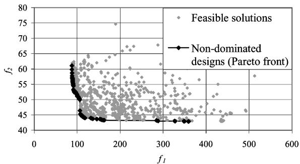  
Fig. 1 Pareto optimality.

## B. Multiple-Objective Optimization

The goal of multiple-objective optimization, in stark contrast to the single-objective case where the global optimum is desired (except in certain multimodal cases), is to maximize or minimize multiple measures of performance simultaneously3 whereas maintaining a diverse set of Pareto-optimal solutions. The concept of Pareto optimality was introduced by Pareto4 and refers to the set of solutions in the feasible objective space that is nondominated. A solution is considered to be nondominated if it is no worse than another solution in all objectives and strictly better than that solution in at least one objective.5 Consider Fig. 1 where both $f _ { 1 }$ and $f _ { 2 }$ are to be minimized. Because both objectives are important, there cannot be a single solution that optimizes $f _ { 1 }$ and $f _ { 2 }$ , rather a set of optimal solutions exists which depict a tradeoff.

Classical multiple-objective optimization techniques (weighted sum, ε constraint, weighted metric, Benson’s, value function, and interactive)5 are advantageous if the decision maker has some a priori knowledge of the relative importance of each objective. Because classical methods reduce the multiple-objective problem to a single objective, convergence proofs exist assuming traditional techniques are employed. Despite these advantages, real-world problems, such as satellite constellation design optimization, challenge the effectiveness of classical methods. When faced with a nonconvex objective space, not all Pareto-optimal solutions may be found. Additionally, the shape of the front may not be known. These methods also limit discovery in the feasible solution space by requiring the decision maker apply some sort of higher-level information before the optimization is performed. Furthermore, only one Paretooptimal solution may be found with one run of a classical algorithm.3 MOEAs have been developed that absolve the shortcomings of the classical methods.

## C. MOEAs

There are several advantages to using EAs over classical methods to solve multiple-objective problems. With a population-based search and selection based on domination, it is possible to converge to the Pareto-optimal front in a single run of the algorithm. The full tradeoff between objectives is evolved, and so questions of appropriate weighting, convexity, and scaling that typically arise in classical formulations need not be asked.5 Early $\mathbf { M O E A s ^ { 6 - 9 } }$ paved the way for the development of a class of elitist algorithms. An elite-preserving operator, as the name suggests, assures that the fitness of the best population members, at any given generation, will not deteriorate. The degree of elitism employed determines the balance between search and selection pressure. The $\mathrm { N S G A } – 2 , $ strength Pareto EA. 2 (SPEA-2),10 and Pareto-archived evolutionary strategy $( { \mathrm { P A E S } } ) ^ { 1 1 }$ all take a different approach to implementing elitism. These algorithms represent current state-of-the-art MOEAs and will likely be outdated shortly as the body of research matures. In spite of that reality, the NSGA-2 has been selected for use in this research because it has been shown (for most problems) to find a much better spread of solutions and better convergence near the true Pareto-optimal fron when compared to PAES and SPEA.5

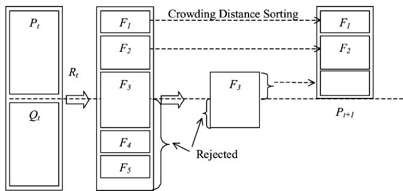  
Fig. 2 NSGA-2 schematic.5

## D. NSGA-2

The original NSGA had three common criticisms: high computational complexity, lack of elitism, and need for specifying a sharing parameter (a mechanism for ensuring diversity in a population). The NSGA-2 alleviates all three of these difficulties.1 Figure 2 shows the basic flow of events for one generation. The parent population $P _ { t }$ of N individuals creates an offspring population $Q _ { t }$ of N individuals through the usual tournament selection, recombination, and mutation operators. Thereafter, the population $R _ { t }$ of 2N individuals undergoes nondominated sorting where both children and parents are classified into fronts. After the first generation, crowded tournament selection is used to select the top N individuals from $R _ { t }$ to form the next generation $P _ { t + 1 } .$ A solution wins a tournament if it has the highest rank, or if the ranks are equal, the solution with the better crowding distance prevails. Crowding distance is defined as the largest cuboid surrounding a solution in which no other solutions are present.5 This operator guides the selection process so that solutions spread out across the Pareto front as the algorithm marches forward. At each generation, the nondominated set of solutions is archived, and the algorithm terminates when some convergence criterion has been met or a maximum number of generations has been reached.

## E. Earlier Work

Several researchers have used the heuristic optimization approach employed by EC to explore several constellation design optimization problems.12 In the single-objective domain, George13 utilized a simple genetic algorithm to design sparse-coverage constellations that outperform their Walker14 counterparts with respect to maximum revisit time (MRT). MRT measures the longest time that any ground point, in the region of interest, remains out of sight of the constellation. Work in the multiple-objective realm continued to focus on coverage metrics.2,15−19 These researchers2,15−19 wrote their own EAs (employing the basic principles of reproduction, mutation, competition, and selection) that were tailored to solve a specific problem. A more general approach was taken by Mason et al.,20 who demonstrated the benefit of incorporating preexisting commercial software (for the coverage function evaluations) with an open-source MOEA. Whereas they were demonstrating the utility of using EAs for the constellation design problems, researchers in the EC field were moving forward with the development of more portable, and what would become today’s stateof-the-art, MOEAs. Several modern MOEAs have been developed that address many of the problems (sizing of niching parameters, determining the niching neighborhood, etc.) that Mason et al. encountered with their research. Their efforts are expanded on in this research where the elitist NSGA-2 is used for constellation design optimization.

## III. Constellation Design Tradeoff Formulations

When an EA is used to explore a problem, it is wise to begin with a baseline test problem of a similar type, provided that one exists. This serves two primary purposes: the objective function construction may be tested and validated and ideal algorithmic parameter settings may be established before proceeding to an original problem. In what follows, a baseline multiple-objective satellite constellation design problem found in the literature2 is reconstructed and integrated into the NSGA-2 algorithm. Then the temporal vs spatial resolution tradeoff for constellations of Earth-observing satellites is considered.

## A. Sparse-Coverage Tradeoff

Williams et al.2 objective functions were to minimize both maximum and the area-weighted average revisit time (AWART) to a region of points representative of the entire Earth. The AWART is defined as the weighted average (by the cosine of the latitude) of average revisit time to all points in the region of interest. They published approximations of the Pareto fronts for three-, four-, five-, and six-satellite constellations (occupying circular orbits), each at a series of low-Earth-orbit (LEO) altitudes. Their objective function formulations are replicated in this research with a few notable enhancements in the coverage analysis software and chromosome representation.

Williams et al. used COVERIT21 to calculate revisit statistics to the region of points by discretizing the 24-h propagation time into 1- min increments and determining whether a particular ground point was covered by the constellation being studied. In this research, a software library developed at The Aerospace Corporation called Astrodynamics Library (ASTROLIB) is used for coverage analysis.22 This library was selected for two reasons. First, the limitations imposed by discretizing time into 1-min increments are eliminated. Second, ASTRLOIB is written in the C programming language, which eliminates the need for any interfacing modules between the C-coded NSGA-2 and the objective function evaluations. Recall that in 1998 Mason et al.20 used STK, a commercial-off-the-shelf, software package, for their global coverage calculations. They noted that there were inefficiencies associated with the objective function evaluations because STK was expending resources and time for unnecessary graphical operations.

The chromosome shown in Fig. 3, and whose variables are defined in Table 1, was used by Williams et al. in their problem formulation and is replicated in this study with one exception. In this formulation, the decision vector remains the same but the variables are real valued instead of binary. Real encoding eliminates the discretization problem encountered with the binary scheme. The NSGA-2 ability to encode real-valued variables is significant because a very smal change in the decision variable space could result in a large jump in the objective function space. When replicating previous work, a thorough testing regimen is necessary.

Table 1 Williams et al. decision variable ranges and constants

<table><tr><td>Variable</td><td>Range</td></tr><tr><td>i</td><td>0 ≤ i &lt; 180</td></tr><tr><td>Ω</td><td>0 ≤ Ω &lt; 360</td></tr><tr><td>M</td><td>0 ≤ M &lt; 360</td></tr><tr><td>a</td><td>Constant</td></tr><tr><td>e</td><td>Constant</td></tr></table>

To validate the regional MRT and AWART objective function construction, their return values are compared with those found by an internal coverage analysis software package (REVISIT, developed by The Aerospace Corporation) and those published by Williams et al.2 for several constellation designs. It has been shown that the objective function formulations return the correct values for a variety of test scenarios.12

NSGA-2 was written such that users’ objective functions may be coded directly into the source code. The objective functions are folded into the original NSGA-2 to create a standalone program without the need to call any external software package. The comparisons between the approximated Pareto fronts obtained by the NSGA-2 with those found by Williams et al. are outlined in what follows.

## B. Resolution Tradeoff

When constructing the orbits of Earth-observing satellites such as LANDSAT (http://landsat.gsfc.nasa.gov [cited 1 June 2005]) and IKONOS-2 (http://directory.eoportal.org/pres IKONOS2.htm [cited 1 June 2005]), a designer must be concerned with spatia (image quality) as well as temporal resolution (revisit time).23 A designer seeks to maximize image quality and, at the same time, minimize the MRT to any one point in a region of interest. As the altitude of a satellites orbit increases, the image quality decreases but the MRT improves. One could then hypothesize that these two objectives, best achievable image quality and MRT to a region, would be in conflict with one another.

The modified NSGA-2 is used to find sets of approximated Paretooptimal designs for these two objectives. Circular constellations with three, four, five, and six satellites are considered for the tradeoff. The continental United States (CONUS) has been arbitrarily selected as the region over which these objectives will be evaluated. The chromosome defined for this paper (Fig. 4) is different than that of the baseline test problem in that inclination is constrained, the semimajor axis is added, and the variables are scaled.

It is desirable for an Earth imaging satellite to occupy an orbit with a sun-synchronous inclination because the position of the sun with respect to the orbit plane remains approximately constant.24 In the context of imaging, this means that the satellite will achieve approximately the same solar illumination conditions for a given region over time, which makes it easier to observe changes in the collected images.25 Whereas the inclination is determined by the sun-synchronous constraint, the altitude decision variable may range between 185.2 and 1203.8 km (100 and 650 n mi). Although the lower bound altitude represents an orbit regime where satellites have a lifetime on the order of days (Ref. 25), it was selected to ensure that as much of the feasible decision space could be exploited as possible. An upper bound of 1203.8 km (650 n mi) was selected because that is approximately the altitude where the Van Allen radiation belts are no longer insignificant (Ref. 25). The altitude decision variable range (185.2–1203.8) is different than that of the angular variables (0–360). Because the NSGA-2’s genetic operators for crossover and mutation act on real numbers in the decision variable space,5 it is prudent to scale every variable to range between 0 and 1. The variables are scaled so that magnitudes are of equal order when the genetic action is taking place.

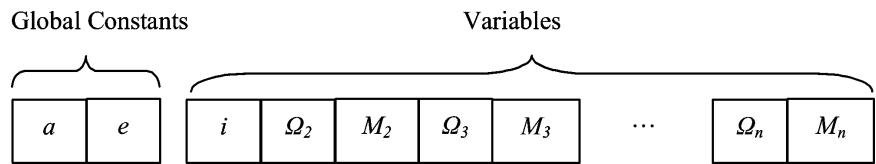  
Fig. 3 Williams et al. chromosome structure.2

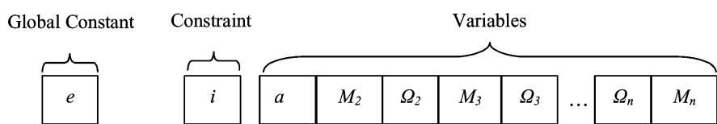  
Fig. 4 Resolution case study chromosome representation.

Table 2 IKONOS optical parametersa

<table><tr><td>Symbol</td><td>Value</td><td>Units</td></tr><tr><td>K</td><td>2.8706057</td><td>n/a</td></tr><tr><td>P</td><td> $12^b$ </td><td>μm</td></tr><tr><td>F</td><td>10</td><td>m</td></tr></table>

aURL: http://directory.eoportal.org/pres IKONOS2.html [cited 26 September 2004]. bPanchromatic sensor only.

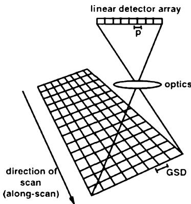  
Fig. 5 Detector sampling pitch projected onto the ground.26

A metric used to measure image quality of an Earth-observing space-based telescope is ground sample distance (GSD), which is the geometric mean (measured in distance units) of the projection of a single pixel of the focal plane onto the ground.26 Figure 5 shows this metric. Generally speaking, an image with a GSD of 1 m means that objects of that size or larger could be detected and interpreted from the image in question.27

The GSD, described by the following equation,26 is a function of the satellite geometry to a ground point at a specific moment in time as well as the physical properties of the telescope:

$$
\mathrm{GSD} = (K \cdot P) / F \cdot \rho \cdot \sqrt {1 / \sin (\varepsilon)}\tag{1}
$$

The pixel size P and focal length F make up the physical telescope parameters and vary from platform to platform. The constant K varies, depending on the units attached to the variables. The angle subtended by the pixel at its focal length is P/F. This case study uses the panchromatic sensor parameters from the IKONOS-2 camera telescope (Table 2). The range $\rho$ and elevation angle ε from the ground point to the telescope are dependent on the satellite’s position at any time during the propagation. The projected dimensions of a square pixel on the ground in the direction and normal to the line of sight, respectively, are given by

$$
(P / F) \cdot \rho \cdot [ 1 / \sin (\varepsilon) ] = \text { length   of   a   pixel }
$$

$$
P / F \cdot \rho = \text { width   of   a   pixel }\tag{2}
$$

(3)

The GSD equation is formulated by taking the square root of the product of these terms and assumes that the digital detector array is perpendicular to the line of sight.26 Over the course of a satellite’s propagation, the GSD will have a wide range of values for each of the points defining the region. The first objective function is then defined as the best achievable GSD by any satellite in the constellation to any point in the region during the course of the propagation. The best achievable GSD for a given visibility interva is found at approximately the midpoint of the satellite’s access.

The second objective function is calculated identically as before. This function is defined as the maximum of the MRT to any point in the region for the length of the 24-h propagation. The results from both the revisit and resolution trade studies are presented.

## IV. Results

## A. Sparse-Coverage Tradeof

To establish a baseline for comparison, the MRT and AWART objective functions are integrated into the NSGA-2 and the problem formulation posed by Williams et al.2 is replicated. The parameter settings for the NSGA-2, outlined in Table 3, are those recommended by Deb et al.28 (see also Ref. 29). The approximated Pareto fronts found by the NSGA-2 for three-, four-, five-, and six-satellite constellations are in Figs. 6, 7, 8, and 9, respectively. In most cases, the curves match those published by Williams et al.,2 but with several of the curves, the NSGA-2 is able to find constellations designs that perform better in both objectives. An example of these improved designs can be found when comparing the compromise region for the three-satellite constellation tradeoff at 1111.2 km (600 n mi). Designs in the compromise region occupy either the knee of a nonlinear front or the approximate midpoint of those tradeoff curves that take a nearly linear shape. The NSGA-2 found constellations that have smaller AWART and MRT than previously published. Another improvement may be noted when comparing the tradeoff curves for the six-satellite constellations at 740.8 km (400 n mi). Here, the NSGA-2 found a greater number of nondominated constellations and an increased spread of solutions when compared to those previously published.

Table 3 NSGA-2 recommended parameter settings28

<table><tr><td>Parameter</td><td>Value</td></tr><tr><td>Population size</td><td>100</td></tr><tr><td>Generations</td><td>250</td></tr><tr><td>Crossover probability</td><td>1.0</td></tr><tr><td>Mutation probability (n is the number of variables)</td><td>1/n</td></tr><tr><td>Crossover distribution index (for real-coded crossover) $^{29}$ </td><td>15.0</td></tr><tr><td>Mutation distribution index (for real-coded mutation)</td><td>20.0</td></tr><tr><td>Random seed</td><td>0.5</td></tr></table>

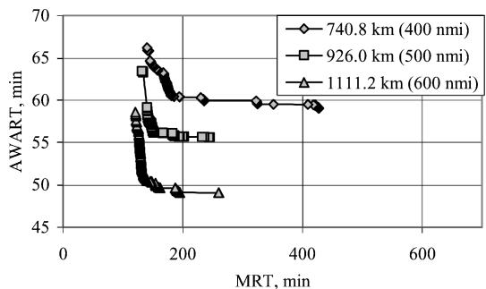  
Fig. 6 Three-satellite constellation tradeoff between MRT and AWART.

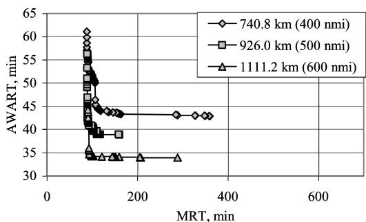  
Fig. 7 Four-satellite constellation tradeoff between MRT and AWART.

Table 4 Comparison of six-satellite constellation designs found in compromise region of AWART vs MRT curve

<table><tr><td>Parameter</td><td colspan="2">Williams et al. $^{2}$ </td><td colspan="2">NSGA-2</td></tr><tr><td>Altitude, km</td><td>926</td><td>1111.2</td><td>926</td><td>1111.2</td></tr><tr><td>Altitude, n mi</td><td>500</td><td>600</td><td>500</td><td>600</td></tr><tr><td>MRT, min</td><td>86</td><td>64</td><td>70.11</td><td>61.64</td></tr><tr><td>AWAR, min</td><td>21.20</td><td>18.28</td><td>22.37</td><td>18.91</td></tr><tr><td>i, deg</td><td>119.06</td><td>121.89</td><td>117.53</td><td>120.97</td></tr><tr><td> $Ω_{1}$ , deg</td><td>0.00</td><td>0.00</td><td>0.00</td><td>0.00</td></tr><tr><td> $Ω_{2}$ , deg</td><td>19.76</td><td>59.29</td><td>204.95</td><td>151.19</td></tr><tr><td> $Ω_{3}$ , deg</td><td>72.00</td><td>127.06</td><td>241.33</td><td>62.52</td></tr><tr><td> $Ω_{4}$ , deg</td><td>127.06</td><td>193.41</td><td>155.92</td><td>90.28</td></tr><tr><td> $Ω_{5}$ , deg</td><td>218.82</td><td>256.94</td><td>319.14</td><td>292.94</td></tr><tr><td> $Ω_{6}$ , deg</td><td>310.59</td><td>307.76</td><td>283.98</td><td>219.36</td></tr><tr><td> $M_{1}$ , deg</td><td>0.00</td><td>0.00</td><td>0.00</td><td>0.00</td></tr><tr><td> $M_{2}$ , deg</td><td>307.76</td><td>128.47</td><td>358.90</td><td>339.07</td></tr><tr><td> $M_{3}$ , deg</td><td>129.88</td><td>280.94</td><td>93.20</td><td>112.16</td></tr><tr><td> $M_{4}$ , deg</td><td>225.88</td><td>36.71</td><td>260.83</td><td>223.88</td></tr><tr><td> $M_{5}$ , deg</td><td>14.12</td><td>155.29</td><td>267.41</td><td>244.57</td></tr><tr><td> $M_{6}$ , deg</td><td>196.24</td><td>258.35</td><td>183.47</td><td>95.53</td></tr></table>

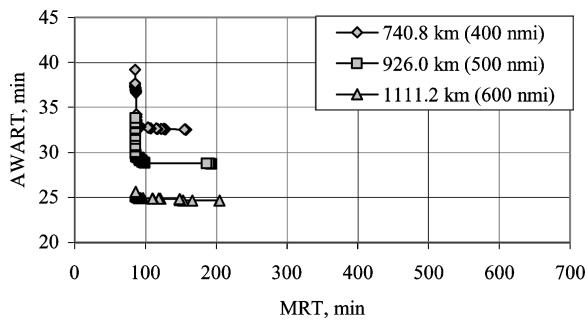  
Fig. 8 Five-satellite constellation tradeoff between MRT and AWART.

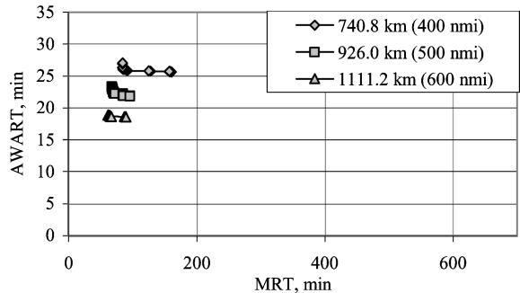  
Fig. 9 Six-satellite constellation tradeoff between MRT and AWART.

Of the constellation designs near the compromise region of the MRT vs AWART curves published by Williams et al., all possessed retrograde inclinations. Table 4 shows a comparison of the designs and performance of several six-satellite constellations (taken from the compromise region of each curve) found with each optimization approach. At both 926- and 1111.2-km (500 and 600 n mi) altitudes, the compromise designs found using the NSGA-2 exhibit an improvement in MRT. The AWART function calculated values that are slightly greater than those published by Williams et al. The details of their AWART objective function calculation were not published; however, several reasons might account for the difference. First, when grid points are not visible during the propagation, the NSGA-2 does not throw away these points, but, instead, assigns a value equal to the propagation time. This definition will produce slightly greater values of AWART than would a function definition that ignores points not covered in the region. Because minimization of both MRT and AWART is the goal, this definition penalizes constellation designs that do not provide global coverage. Second, recall that Williams et al. calculate gap intervals to the nearest minute and then take the average of the averages. The AWART calculated for the NSGA-2 takes the average of the true gap intervals for each poin without rounding to whole minutes.

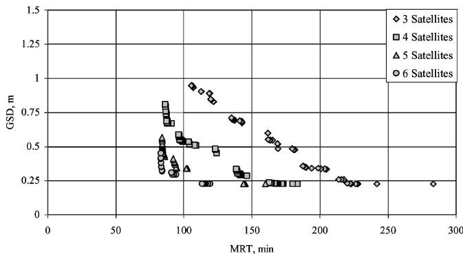  
Fig. 10 Nondominated fronts for a single random seed, single simula tion run for three-, four-, five-, and six-satellite constellations.

The fronts found by the NSGA-2, on average, have a greater spread consisting of more nondominated designs. Such full fronts give the decision maker more choices and, therefore, are more desirable. These results highlight the improvements that the NSGA-2 approach has over the previous two-branch tournament21 approach to multiple-objective optimization. Following the successful replication of a baseline problem, the tradeoff between spatial and tempora resolution is investigated.

## B. Resolution Tradeoff

As the altitude of a LEO satellite increases, a multiple-objective conflict emerges in the way of a decreasing image quality and an improving revisit time. Because there is no a priori knowledge of the shape or continuity of the Pareto front for this tradeoff, or of the ability of the NSGA-2 to converge to such a front, a preliminary simulation run is conducted using the Deb et al. recommended NSGA-2 parameter settings (Table 3).28 Single random seeds are used to generate the four nondominated sets of constellation designs shown in Fig. 10. The nondominated fronts exhibit discontinuous and nonlinear characteristics. To determine whether these preliminary results are accurate representations of the Pareto fronts, further simulation runs are conducted.

With a series of simulations performed that varies some of Deb’s recommended NSGA-2 parameter settings, it is possible to gain additional insight into the characteristics of the front. A reliability study, convergence analysis, and population doubling analysis all reveal that any change to the NSGA-2 parameter settings chosen for the original simulation runs would not necessarily improve the nondominated sets of data in Fig. 10.12 The approximated Pareto fronts are sensitive to the initial random seed. To maximize the number of non-dominated solutions in the final front, the preliminary simulation is reformulated. Each constellation class (three, four, five, and six satellites) undergoes 10 simulation runs each with a differen random seed. The nondominated designs from the collective 10 runs for each class are then sorted, the results of which are shown in Fig. 11.

One last study is undertaken, which further investigates the apparent discontinuities found along the fronts in Fig. 11. The foursatellite constellation nondominated front shown in Fig. 11 is selected for further consideration. When the nine decision variables for the four-satellite constellations (altitude, common to all satellites, and each platform’s right ascension and mean anomaly) are revealed, there are small altitude ranges (which are directly proportional to the GSD metric) where no nondominated designs could be discovered. To determine whether the NSGA-2 is converging to local optima, these altitude regions are explored by calculating the value of both objectives using the altitude from the start of the discontinuity with the constellation design (set of mean anomaly and right ascension decision variables) from the end of the discontinuity. The motivation behind this analysis is to discover how sensitive the constellation design’s MRT is to a small change in altitude. Table 5 summarizes the results of this study. Interestingly, when the altitude decision variables are shuffled with the orbital elements from the designs at each end of the discontinuity (and vice versa), the MRT increased by approximately 85 min. That is striking because at times the altitude difference is as small as 6 n mi. Of the cases studied, the orbital periods range from 89 to 95 min, indicating that a small change in altitude can impact the maximum revisit time statistic negatively by about one revolution. As the number of satellites increases, however, the discontinuities decrease in size and the penalty paid in MRT is less severe. This study dismisses the hypothesis that the NSGA-2 is converging to local optima. All of the previous analyses to this point built on each other and were conducted to establish the validity of the final nondominated results shown in Fig. 11.

Table 5 Discontinuity study

<table><tr><td>Case</td><td>MRT before swap, min</td><td>MRT after swap, min</td><td>Time difference, min</td><td>Altitude difference, km (n mi)</td></tr><tr><td>1</td><td>88.05</td><td>173.01</td><td>84.96</td><td>26.58 (14.35)</td></tr><tr><td>2</td><td>107.84</td><td>193.81</td><td>85.97</td><td>46.21 (24.95)</td></tr><tr><td>3</td><td>126.50</td><td>212.44</td><td>85.94</td><td>34.76 (18.77)</td></tr><tr><td>4</td><td>147.99</td><td>233.00</td><td>85.01</td><td>10.91 (5.89)</td></tr></table>

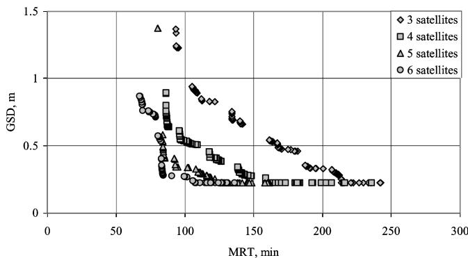  
Fig. 11 Resulting nondominated designs from 10 seeds.

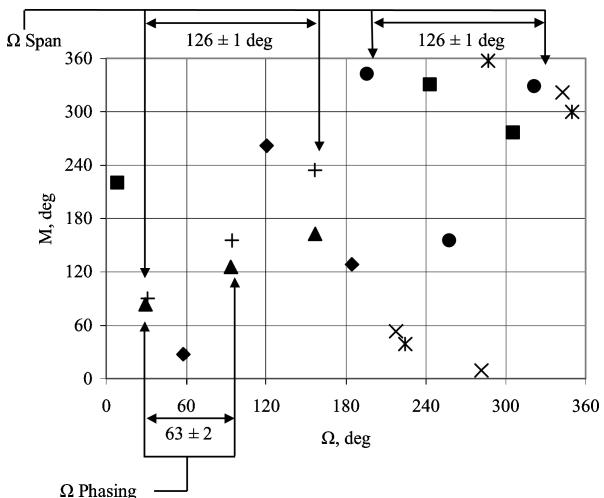  
Fig. 12 Selected three-satellite constellations: -, 210.21 min, 0.30 m; -, 190.88 min, 0.33 m; , 170.40 min, 0.48 m; •, 141.88 min, 0.66 m; ×| , 121.84 min, 0.83 m; ×, 105.57 min, 0.93 m; and +, 95.37 min, 1.23 m.

## C. Decision Variable Interpretations

Behind each data point that makes up the nondominated fronts in Fig. 11, there exists a set of decision variables that define a constellation design. To better understand the designs discovered by the algorithm, right ascension is plotted vs mean anomaly for several nondominated solutions for each constellation class. The solutions in Figs. 12–15 are a representative sampling of the entire nondominated set of solutions for each class. Consider the threesatellite constellation designs shown in Fig. 12. For each design, the right ascension spans a range of $1 2 6 \pm 1$ deg. Additionallv. the right ascension phasing for each design is essentially evenly spaced at $6 3 \pm 2$ deg. The mean anomaly ranges lack a consistent pattern. Some cases exhibit a tight cluster with even phasing where only 80 deg separates the first and third satellites (design 170.40 min, 0.48 m from Fig. 12). Design 170.40 min, 0.48 m refers to the constellation that has a MRT of 170.40 min and a best GSD of 0.48 m. Other designs reveal a mean anomaly range that is spread evenly across the entire domain (design 210.21 min, 0.30 m from Fig. 12. For some constellations, irregular phasing of the mean anomaly is evident (design 141.88 min, 0.66 m from Fig. 12). Now consider Figs. 13–15. In each constellation class, the behavior of the mean anomaly range and phasing continues to lack any pattern. Something much more interesting is found with a close inspection of the right ascension across classes. The right ascension spans $1 4 3 \pm 2$ 152 ± 2, and 158 ± 4 deg for the four-, five-, and six-satellite constellation designs, respectively. Additionally, as the number of satellites increases, the phasing of the right ascension for each design becomes increasingly uneven. These results indicate that the nondominated designs all exhibit a consistent pattern with respect to their right ascension span. Note that these spans appear independent of the actual longitude of the ascending node. These results would have been difficult to find without employing EC as a tool.

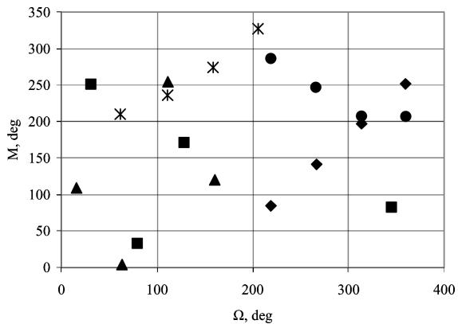  
Fig. 13 Selected four-satellite constellations: -, 158.63 min, 0.26 m; -, 140.60 min, 0.30 m; , 121.49 min, 0.41 m; •, 101.15 min, 0.53 m; and×| , 86.58 min, 0.72 m.

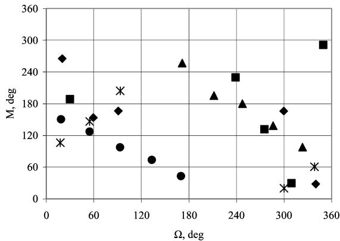  
Fig. 14 Selected five-satellite constellations: -, 119.02 min, 0.26 m; -, 110.72 min, 0.30 m; , 101.82 min, 0.34 m; •, 92.24 min, 0.41 m; and ×| , 80.32 min, 1.37 m.

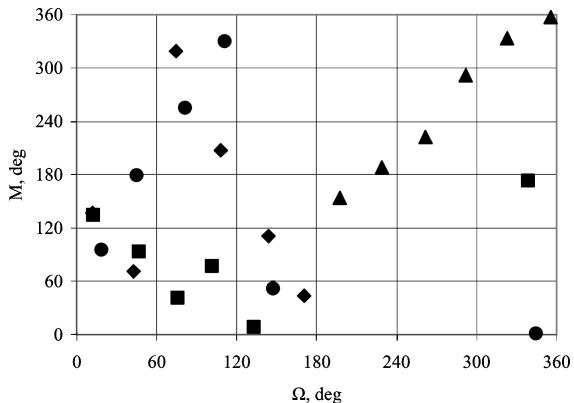  
Fig. 15 Selected six-satellite constellations: -, 110.95 min, 0.23 m; -, 99.92 min, 0.27 m; , 80.61 min, 0.57 m; and •, 69.41 min, 0.76 m.

## D. Computational Cost Savings

The cost savings in computational resources that an MOEA can provide are illustrated through the following example. Consider an enumerative analysis of the four-satellite constellation where MRT and GSD are evaluated for the CONUS region. One function evaluation takes approximately 0.5 s on an Intel Pentium III, 1200-MHz processor. The decision variables  and M are explored in 5-deg increments over their range resulting in 72 possible values for each of the 8 variables in the four-satellite constellation. A combination calculation for 72 variables taken 8 at a time yields $\phantom { + } . . 1 9 6 9 \times 1 0 ^ { 1 0 }$ function evaluations. Earlier, it was discovered that the metrics are highly sensitive to small changes in altitude. To obtain a reasonable sampling of the objective function space, the altitude decision variable is divided into 1.852-km (1-n mi) increments over the range from 185.2 to 1111.2 km (100 to 650 n mi). The resulting computation time for this enumerated analysis is then $( 1 . 1 9 6 9 ^ { - } \times 1 0 ^ { 1 0 }$ function evaluations)(0.5 s/evaluation)(550 altitudes), or just greater than 100,000 years. The MOEA that produced the nondominated data sets for the tradeoffs investigated in this work had a simulation time of several hours. Furthermore, the entire range of the decision variable space could be explored with the MOEA without the limitations imposed by discretized variables.

## V. Conclusions

The conclusions drawn from this work highlight important considerations when applying MOEAs to the constellation design problem and what was discovered about the selected tradeoffs as a result of that application.

The nondominated constellation designs discovered by the NSGA-2 were compared against a baseline sparse coverage trade study. The NSGA-2, for several approximated Pareto fronts, was able to find designs that wielded significant improvement in both MRT and AWART when compared to those obtained via the twobranch tournament approach. The real-valued encoding of decision variables is the likely reason for the discovery of the new designs. For problems such as constellation design, where a small change in the decision variable space results in a much larger change in the objective space, the resolution of each variable in the chromosome must be near continuous. Binary encoding limits the resolution of the search and, therefore, eliminates potential optimal designs.

Several algorithmic parameter studies revealed that the random seed had the greatest impact on the resulting set of nondominated designs that make up the final generation. Note, however, that each seed converged toward the same general region, but with each new seed came the discovery of several new nondominated designs. As a result, approximated Pareto fronts were formed from the nondominated designs from 10 simulation runs, each with a different random seed. To improve the efficiency of this optimization approach for real-world problems, MOEAs must be less sensitive to initial seed value so that a full approximated front may be obtained with a single simulation run.

In the baseline tradeoff. it was shown that the MRT metric is highly sensitive to small changes in altitude (at times as small as 11 km). The severity of the sensitivity decreases as the total number of satellites increases. The resolution and sparse-coverage fronts both exhibit discontinuous, nonlinear characteristics.

Once an MOEA has been used to find a nondominated set of data, the decision variables that define each design may be studied. For the resolution tradeoff, the right ascension was plotted against the mean anomaly for a representative set of designs across each front. The right ascension span, or the angular measure between the first and last satellite in the constellation, increased in a consistent fashion from 126 ± 1 deg for the three-satellite designs to 158 ± 4 deg for six satellites. Though the designs for each altitude regime shared a common span, the actual longitude of ascending nodes varied greatly, which is to be expected, given the 24-h propagation time. As the number of satellites increased, the variation in the span between nondominated designs for each design increased. The right ascension phasing was approximately equal to the span divided by one less than the total number of satellites in the constellation. The mean anomaly span and phasing lacked any consistent pattern across designs, which is expected given the circular geometry of the orbits and propagation time.

## Acknowledgments

The Aerospace Corporation is acknowledged for providing the financial means to complete this research. Thanks are extended to Patrick Reed for sharing his expertise on, and providing an excellent introduction to, evolutionary computation. The guidance of Thomas Starchville, Roger Thompson, Peter Palmadesso, and Ronald Clifton is greatly appreciated.

## References

1Deb, K., Pratap, A., Agarwal, S., and Meyarivan, T., “A Fast and Elitist Multi-Objective Genetic Algorithm: NSGA-II,” IEEE Transactions on Evo lutionary Computation, Vol. 6, No. 2, 2002, pp. 182–197.

2Williams, E. A., Crossley, W. A., and Lang, T. J., “Average and Maximum Revisit Time Trade Studies for Satellite Constellations Using a Multi Objective Genetic Algorithm,” Advances in the Astronautical Sciences, Vol. 105, Jan. 2000, p. 653.

3Baeck, T., Fogel, D. B., and Michalewicz, Z. (eds). Handbook of Evolutionary Computation, IOP Publ., Ltd., and Oxford Univ. Press, New York, 1997, Pts. A, B, and C.

4Pareto, V., Manuale di Economia Politica, Societa Editrice Libraria, Milan, Italy, 1906; translated to English by A. S. Schwier, Manual of Politica Economy, Macmillan, New York, 1971.

5Deb, K., Multi-Objective Optimization Using Evolutionary Algorithms, Wiley, Chichester, England, U.K., 2001, Chaps. 1–6.

6Schaffer, J. D., “Some Experiments in Machine Learning Using Vec tor Evaluated Genetic Algorithms,” Ph.D. Dissertation, Computer Science Dept., Vanderbilt Univ., Nashville, TN, Dec. 1984.

7Fonseca, C., and Fleming, P., “Genetic Algorithms for Multi-Objective Optimization: Formulation, Discussion, and Generalizations,” Proceed ings of the 5th International Conference on Genetic Algorithms, Morgan Kaufmann, San Mateo, CA, 1993, pp. 416–423.

8Horn, J., Nafpliotis, N., and Goldberg, D., “A Niched Pareto Genetic Algorithm for Multi-Objective Optimization,” Proceedings of the First IEEE Conference on Evolutionary Computation, IEEE World Congress on Computational Intelligence, Vol. 1, Inst. of Electrical and Electronics Engineers Piscataway, NJ, 1994, pp. 82–87.

9Srinivas, N., and Deb, K., “Multi-Objective Optimization Using Non-Dominated Sorting in Genetic Algorithms,” Evolutionary Computation, Vol. 2, No. 3, 1994, pp. 221–248.

10Zitzler, E., Laumanns, M., and Thiele, L., “SPEA-2: Improving the Strength Pareto Evolutionary Algorithm for Multiobjective Optimization,” Evolutionary Methods for Design, Optimization, and Control, Centre fo Numerical Methods in Engineering, Barcelona, 2002, pp. 95–100.

11Knowles, J., and Corne, D., “Approximating the Non-Dominated Front Using the Pareto Archived Evolution Strategy,” Evolutionary Computation, Vol. 8, No. 2, 2000, pp. 149–172.

12Ferringer, M. P., “Satellite Constellation Design via Multiple-Objective Evolutionary Computation,” M.S. Thesis, Aerospace Engineering Dept., Pennsylvania State Univ., University Park, PA, May 2005.

13George, E., “Optimization of Satellite Constellations for Discontinuous Global Coverage via Genetic Algorithms,” Advances in the Astronautical Sciences, Vol. 97, Aug. 1997, pp. 333–346.

14Walker, J. G., “Some Circular Orbit Patterns Providing Continuous Whole Earth Coverage,” Royal Aircraft Establishment, Technical Rept. 70211, Farnborough, England, U.K., Nov. 1970.

15Ely, T. A., Crossley, W. A., and Williams, E. A., “Satellite Constellation Design for Zonal Coverage Using Genetic Algorithms,” Advances in the Astronautical Sciences, Vol. 99, Feb. 1998, p. 443.

16Confessore, G., Di Gennaro, M., and Ricciardelli, S., “A Genetic Algorithm to Design Satellite Constellations for Regional Coverage,” Operations Research Proceedings, Springer, Berlin, 2000, pp. 35–41.

17Lang, T. J., “A Parametric Examination of Satellite Constellations to Minimize Revisit Time for Low Earth Orbits Using a Genetic Algorithm,” Advances in the Astronautical Sciences, Vol. 109, Aug. 2001, p. 625.

18Asvial, M., Tafazolli, R., and Evans, B. G., “Genetic Hybrid Satellite Constellation Design,” AIAA Paper 2003-2283, April 2003.

19Asvial, M., Tafazolli, R., and Evans, B. G., “Non-GEO Satellite Constellation Design with Satellite Diversity Using Genetic Algorithm,” AIAA Paper 2002-2018, May 2002.

20Mason, W. J., Coverstone-Carroll, V., and Hartmann, J. W., “Optimal Earth Orbiting Satellite Constellations via a Pareto Genetic Algorithm,” AIAA Paper 98-4381, Aug. 1998.

21Crossley, W., and Williams, E., “Simulated Annealing and Genetic Algorithm Approaches for Discontinuous Coverage Satellite Constellation Design,” Engineering Optimization, Vol. 32, No. 3, 2000, pp. 353–371.

22Elitzur, R., Gurlitz, T. R., Sedlacek, S. B., and Senechal, K. H., “ASTROLIB Users Guide,” Navigation and Geopositioning Systems Dept., Systems Engineering Div., Engineering and Technology Group, The Aerospace Corp., Technical Operating Rept. 93-(3917-1), Los Angeles, 1993.

23Rangaswamy, M., “Quickbird 2 Two-Dimensional On-Orbit Modulation Transfer Function Analysis Using Convex Mirror Array,” M.S. Thesis, Dept. of Electrical Engineering, South Dakota State Univ., Brookings, SD, Dec. 2003.

24Vallado, D., Fundamentals of Astrodynamics and Applications, 2nd ed., Space Technology Library, Microcosm Press, El Segundo, CA, 2001, pp. 782, 783.

25Wertz, J. R., Mission Geometry: Orbit and Constellation Design and Management, Microcosm Press, El Segundo, CA, 2001, pp. 58, 617, 618, 685.

26Fiete, R., “Image Quality and λFN/p for Remote Sensing Systems,” Optical Engineering, Vol. 38, No. 7, 1999, pp. 1229–1240.

27Campbell, J., Introduction to Remote Sensing, Guilford, New York, 1989, pp. 226–228.

28Deb, K., Mohan, M., and Mishra, S., “A Fast Multi-Objective Evolutionary Algorithm for Finding Well Spread Pareto Optimal Solutions,” Kanpur Genetic Algorithms Lab., KanGAL Rept. 2003002, Indian Inst. of Technology, Kanpur, India, Feb. 2003.

29Deb, K., and Agrawal, R., “Simulated Binary Crossover for Continuous Search Space,” Complex Systems, Vol. 9, No. 2, 1995, pp. 115–148.

C. McLaughlin

Associate Editor