Received 17 December 2025, accepted 5 January 2026, date of publication 12 January 2026, date of current version 23 January 2026. Digital Object Identifier 10.1109/ACCESS.2026.3652932

RESEARCH ARTICLE

# Critical-Point n-Fold Coverage Evaluation for Continuous Coverage in Mega-Constellation Design

MOJTABA NAMVAR, EBRAHIM AMIRI, AND MAHDI JAFARI-NADOUSHAN K. N. Toosi University of Technology, Tehran 19937-34499, Iran

Corresponding author: Mahdi Jafari-Nadoushan (mjafari@kntu.ac.ir)

ABSTRACT Coverage evaluation in the orbital design of satellite constellations is a major driver of project cost because it dictates the required number of satellites. This becomes particularly critical when the objective is continuous 24/7 coverage, which requires eliminating coverage gaps while maintaining an optimal satellite count. Numerous methods have been proposed for evaluating coverage, each involving trade-offs between accuracy and computational load. Considering the limitations of previous methods, this paper presents a critical-point-based approach that focuses on spatial boundary locations and footprint intersections where coverage loss within the target area is most likely. The method improves coverage-evaluation accuracy while reducing computational complexity and sensitivity to spatial and temporal discretization. After presenting the underlying theory, we assess performance through case studies. We define mission parameters and perform orbit design via numerical optimization using particle swarm optimization (PSO) under simultaneous n-fold coverage constraints. The resulting designs are re-evaluated with the conventional grid point approach (GPA), yielding consistent outcomes. Although the numerical evaluation in this paper focuses on Walker - Delta orbital patterns and conical sensor footprints, the proposed critical-point framework is conceptually general and can be applied to other orbit families and footprint geometries.

INDEX TERMS Continuous coverage, critical-point method, grid point approach, particle swarm optimiza tion, satellite constellations.

## I. INTRODUCTION

Due to diverse communication and imaging needs, the utilization of satellite constellations has become essential in modern space missions. Among various mission objectives, accurately calculating the coverage area is a critical aspect of constellation design. The problem of satellite continuous coverage arises when a specific target area on Earth must remain accessible to one or multiple satellites throughout the entire mission duration. Precise assessment of the coverage area is thus crucial for evaluating constellation performance [1]. Depending on the mission’s requirements, the coverage can be either continuous or discontinuous, and reliable evaluation directly impacts both effectiveness and cost-efficiency [2].

The associate editor coordinating the review of this manuscript and approving it for publication was Zhenbao Liu

A fundamental challenge in constellation design is accurately and rapidly evaluating satellite coverage of the target area to ensure mission requirements are consistently met. Selecting a suitable method for coverage assessment depends heavily on mission-specific factors, including target area characteristics, accuracy requirements, computational resources, and mission complexity.

Numerous methods have been proposed over the past decades to address the problem of satellite-constellation coverage evaluation. One widely adopted and traditional approach is the grid point approach (GPA), introduced by Morrison [3]. This method involves discretizing the continuous coverage area into multiple target points and assessing satellite accessibility to each discrete point [4]. GPA is versatile and applicable to a wide variety of problems; however, it has notable drawbacks, such as decreased efficiency with increasing accuracy demands and difficulty quantifying evaluation errors [2], [4]. Another method is Delaunay triangulation, which can test continuous coverage over complex ground regions but may face limitations for highly irregular geometries or large constellations [5].

Since 1977, Walker’s symmetrical configurations in circular orbits with common inclinations and altitudes have been used to achieve uniform and global coverage [6], [7]. A related geometric line of work includes coverage prediction and circumcircle-style analyses [8]. Ballard later introduced the Rosette method [9], providing improved global coverage metrics when satellite counts are modest. For larger constellations, computational complexity increases substantially; Lang examined symmetric satellite constellations with up to 100 satellites to determine how continuous global coverage can be achieved across different configurations, satellite counts, and placements, and compared the results with those of asymmetric polar constellations [10].

Several other innovative methods have emerged. Streetof-Coverage uses latitudinal bands to analytically ensure regional continuity under symmetry assumptions [11]. Cell-area-based analyses seek to reduce computation while maintaining fidelity [2], [4], and polygon-based intersection methods handle overlapping and irregular footprints with high geometric accuracy [12]. Elevation-angle effects can be incorporated explicitly to improve accuracy [13]. In mission-driven contexts, Flower Constellations provide flexibility in phasing and synchronization for large repeatable configurations [14], [15].

Coverage-evaluation techniques generally fall into two main groups, i.e., discretization methods and geometric or analytic approaches. Discretization methods, such as the grid point approach, evaluate visibility by sampling ground points and propagating satellite access over time; while straightforward to implement, their accuracy depends heavily on spatial and temporal resolution, and finer grids lead to rapidly increasing computational cost. Geometric and analytic approaches rely on satellite footprint geometry or inter-satellite spacing to infer continuity and can offer higher fidelity, but they become increasingly complex as footprint overlaps grow in large constellations. More specialized techniques, including polygon-intersection and cell-area methods, better handle irregular coverage patterns but introduce additional overhead when many satellites or high temporal resolution are involved.

The primary application of these evaluation methods lies in solving coverage problems for designing satellite-constellation orbital configurations; therefore, they serve as a key component in orbit optimization to meet coverage requirements. These optimizers are typically paired with a coverage-evaluation method to enforce constraints during search. Optimization frameworks have been widely applied to size and tune constellations while balancing coverage merits, including Genetic Algorithms [16], [17], multi-objective evolutionary approaches [18], Ant Colony Systems [19],

NSGA-II for regional coverage [20], and Particle Swarm Optimization (PSO), including the original formulation [21] and recent LEO design applications [22].

Accurate coverage evaluation is fundamental to constellation design optimization, guiding choices in orbital parameters, satellite counts, and phasing strategies and supporting rapid, reliable communications for disaster management [23]. Foundational visibility and revisit analyses further inform practical coverage-assurance considerations [24], [25], [26].

However, despite these advancements, each method has particular strengths and limitations depending on the intended constellation configuration, mission-specific constraints, and desired coverage type. Discretization methods such as GPA offer flexibility but impose rapidly increasing computational loads as spatial and temporal resolution rises [2], [4]. Geometric and analytical methods such as circumcirclestyle assessments [8] and Street-of-Coverage provide clarity yet become less practical when satellite numbers are large or geometries are complex [11], [27]. Techniques such as polygon intersection and cell-based analyses better handle irregular coverage patterns but can introduce substantial overhead for high temporal-resolution scenarios with many satellites [2], [12]. Taken together, these approaches form the foundation of modern coverage-evaluation practice but also highlight a persistent trade-off between analytical tractability, computational load, and reliable detection of worst-case gaps in continuous n-fold coverage.

Existing approaches do not fully meet this need in the mega-constellation regime. Grid-based methods distribute computational effort over the target region and, to resolve small coverage gaps, require very fine spatial and temporal discretization, which drives the number of evaluation points into the hundreds of thousands or millions for realistic LEO scenarios. Geometric techniques can offer higher local fidelity, but their complexity grows rapidly with the number of satellites and the density of footprint overlaps, making them increasingly difficult to apply as design spaces and constellation sizes expand. In practice, this leads to an unfavorable balance between computational cost and robust detection of worst-case gaps in continuous n-fold coverage.

Given the recent trend toward deploying large-scale satellite mega-constellations, achieving an efficient balance between computational load and evaluation accuracy has become increasingly important. Traditional approaches face significant burdens in preliminary design, where many configurations must be explored quickly [2], [4], [12]. Consequently, there is a clear need for a coverage evaluator that is explicitly optimized for mega-constellations, concentrates computational effort where coverage risk is highest, and provides a meaningful baseline improvement over existing discretization and geometric methods.

To address this gap, this paper presents a critical-point (CP) method for rapid and accurate evaluation of continuous n-fold coverage. Rather than exhaustively sampling the entire region, the CP approach concentrates on boundary locations, specifically the intersections of satellite-footprint edges where coverage loss is most likely, which reduces computation while preserving gap-detection precision. We embed the CP evaluator as the cost function in a particle swarm optimization loop, enabling the algorithm to identify the smallest constellation that still guarantees continuous coverage. The evaluator is verified under common assumptions, namely Walker-Delta symmetry and circular sensor footprints, and its results are cross-checked against the GPA under identical conditions. In addition, GPA and polygon-based methods are treated as explicit baselines, and we show how the CP method differs conceptually by focusing on failuredirected footprint-boundary intersections rather than uniform sampling. We then discuss improvements in both accuracy and computational load. Although this study focuses on the Walker-Delta constellations with conical sensors, the method can be extended to other orbit patterns and footprint shapes in future work.

This paper is organized as follows. Section II details the CP coverage method, presenting its theoretical background and evaluation algorithm. Section III introduces the optimization framework, embedding the CP evaluator in a Particle Swarm Optimization scheme to generate sample constellation designs. Section IV reports numerical results, quantifies accuracy and computational efficiency, and compares the CP method with the widely used GPA. Section V provides the conclusion.

## II. BASIS OF CRITICAL POINT COVERAGE METHOD

Considering the disadvantages of the previously discussed methods and using geometric approaches, we propose a method that overcomes these limitations and provides a more efficient solution to the coverage evaluation problem. The grid point approach (GPA) is widely adopted for solving coverage problems due to its simplicity and applicability to diverse mission scenarios. However, the GPA’s primary challenge is choosing appropriate spatial and temporal discretization intervals to achieve an accurate assessment of the target area’s satellite coverage. Additionally, GPA computations are repeated for every point in the target area at each time sample, without prioritizing points that are more prone to coverage gaps.

In contrast, our method focuses on critical points within the target area, i.e., points with the highest risk of coverage gaps, to evaluate continuous coverage relative to mission requirements. This method is well suited for integration into orbital design optimization algorithms aimed at solving continuous coverage problems. To demonstrate its effectiveness, the method’s performance must be evaluated within clearly defined assumptions and constraints.

The proposed critical point method substantially reduces the number of evaluation points by concentrating on boundary conditions. These critical points indicate coverage probability at a future time t + ε. For symmetric orbital patterns such as Walker-Delta constellations, where satellite positions remain symmetrically distributed, performing the optimization at a single epoch is sufficient to yield a reliable final orbital configuration.

For asymmetric orbital configurations, evaluation must be carried out by propagating satellite positions over time to ensure there are no temporal coverage gaps within the target area. Therefore, when satellite positions are considered dynamically, the proposed method imposes no inherent constraints on the orbital configuration. However, to clearly illustrate computational performance for mega-constellations, we focus our simulations and evaluations on symmetric Walker-Delta configurations.

A. CONSTRAINTS AND ASSUMPTIONS FOR SIMULATIONS The following constraints are adopted in our simulations for constellations designed to provide continuous coverage:

Distance between the access point and a satellite: This is determined based on link budget requirements and the sensitivity of transmitters and receivers to transmitted and received signals over long distances.

• Minimum elevation angle (MEA): This is set with consideration of the target area requirements, antenna beam pattern, or the payload field of view (FOV) characteristics.

Orbital altitude: As long as there is no other limiting parameter for altitude, the optimization algorithm will increase the orbital altitude to the maximum allowable range to reduce the number of satellites.

• Minimum n -fold coverage: Due to the mission necessities and the mission statement, the minimum number of satellites required to cover the target area at any given time is determined.

When the footprint below each satellite is conical along the nadir direction, such that the apex of the cone is at the satellite’s position, the footprint of each satellite forms a small circle on the Earth’s surface, resulting from the intersection of the cone with the Earth’s surface. In this case, a constant value is assumed for the minimum elevation angle. If the footprint of each satellite follows more complex geometric patterns rather than small circles on the Earth’s surface, the problem can be approximated using the worst, average, and best conditions, i.e., enclosed small circles. Alternatively, other geometric methods can be used to find critical points, and satellite position propagation over time can be added to the evaluations. Furthermore, we have added the following assumptions to the design constraints in the simulations performed in this paper:

• The constellation’s orbital configuration follows the Walker-Delta pattern.

• Each satellite footprint is approximated as a small circle on Earth’s surface.

• The target area must be larger than at least one satellite’s footprint.

• At least two critical points must arise from intersections of satellite footprints within the target area.

These assumptions and constraints may vary with mission specific requirements. However, fixed parameter values must be used for consistency when applying the evaluation and optimization method.

## B. CONTINUOUS COVERAGE EVALUATION ALGORITHM

In the proposed method, instead of calculating coverage for all points in the target area, we focus on critical points where the probability of coverage loss is higher. Under the stated assumptions, the coverage of a single satellite can be modeled as a cone whose axis is the satellite nadir. The geometric parameters for coverage and the constraints given by the fieldof-view (FOV) angle or elevation mask are shown in Figure 1.

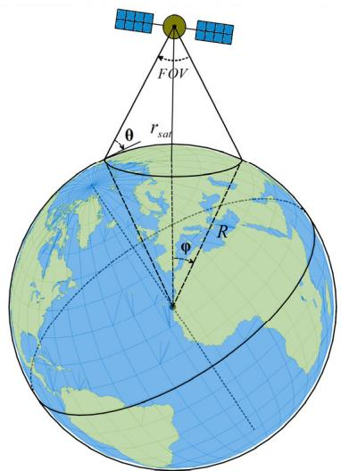  
FIGURE 1. Schematics of single satellite coverage geometry.

Considering mission limitations and requirements, and based on the footprint definition and payload constraints shown in Figure 1, where R denotes Earth’s radius, $r _ { \mathrm { s a t } }$ the geocentric orbital radius, θ the satellite elevation angle at the ground access point, i.e., the minimum elevation angle, MEA, when evaluated at its minimum, $\varphi$ the Earth-central angle to the footprint edge, FOV is the full payload cone angle, and $d _ { \mathrm { l o s } }$ the line-of-sight distance from the access point to the satellite. The relationships are given by [1]:

$$
F O V = 2 \times \sin^ {- 1} \left(\frac {R}{r _ {\mathrm{sat}}} \cos \theta\right)\tag{1}
$$

$$
\theta = \cos^ {- 1} \left(\frac {r _ {\mathrm{sat}}}{R} \sin (F O V / 2)\right)\tag{2}
$$

$$
\begin{array}{r} d _ {\mathrm{los}} = \sqrt {r _ {\mathrm{sat}} ^ {2} + R ^ {2} - 2 r _ {\mathrm{sat}} R c o s \varphi} \\ = \sqrt {r _ {\mathrm{sat}} ^ {2} - R ^ {2} c o s ^ {2} \theta} - R s i n \theta \end{array}\tag{3}
$$

To calculate coverage with the GPA, the target area is discretized in space and time. All points are evaluated at all time samples to determine accessibility to constellation satellites, as illustrated in Figure 2.

As shown in Figure 2, not all points in the target area have equal importance for access calculation; some pose greater challenges and are at higher risk of leaving coverage. Moreover, some points may not experience changes in access across future time samples. Both spatial and temporal discretization can lead to uncertainties and coverage gaps.

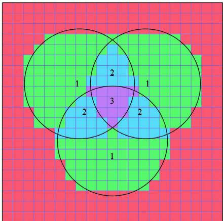  
FIGURE 2. Schematics of GPA coverage calculation.

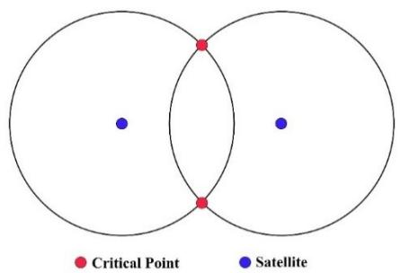  
FIGURE 3. Intersection of footprints for the CP method.

It is therefore reasonable to focus on points where access is most challenging. Given the relative motion of satellites and payload constraints, these critical points lie on the boundaries of each satellite’s coverage footprint. In assessing constellation coverage, the critical points are the intersections of satellite footprint boundaries. Ensuring accessibility at these points is the primary challenge for continuous coverage. By excluding interior points that do not stress the coverage constraint, the method improves computational performance at high accuracy, facilitating optimal orbital design solutions.

To determine the locations of critical points within the target area, it suffices to compute the satellite footprints at an initial epoch $t _ { 0 } .$ . Intersections of the small circles on the Earth’s surface are then found using spherical geometry, which identifies the critical points. For two neighboring satellites, each footprint is a small circle; the two circles intersect at two points, which serve as the critical points, as illustrated in Figure 3.

This occurs for each satellite pair, forming a set of critical points within the target area (see Figure 4).

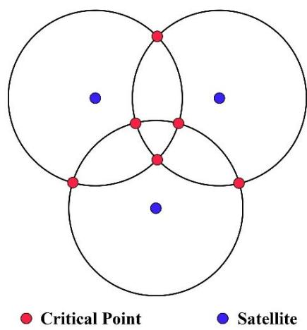  
FIGURE 4. Formation of a set of critical points.

For example, in Figure 5, four critical points emerge from the intersection of the footprints of three satellites. Among these four points, only one is expected to remain within at least one satellite’s coverage at time $t + \varepsilon .$ . Thus, we mark a covered critical point (green) and three uncovered, high risk critical points (red).

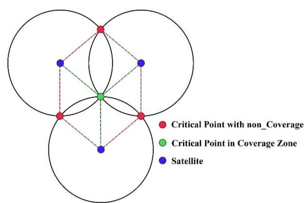  
FIGURE 5. Critical point coverage probability.

To determine the covered critical points, the relative positions of accessible satellites for each critical point are first established within the Azimuth-Elevation-Zenith (AEZ) coordinate system. Given azimuth value for each satellite, the angular difference relative to all neighboring satellites is calculated. If there is an angle greater than or equal to $1 8 0 ^ { \circ }$ , the critical point in question is likely to be outside the coverage area of the boundary satellites at time $t { + } \varepsilon .$ , as shown in Figure 6. Otherwise, the critical point will be covered by at least one satellite at time $t + \varepsilon$

To clarify the geometric basis for this $1 8 0 ^ { \circ }$ condition, we interpret the boundary satellites in the local AEZ frame of the critical point P, so that each satellite direction lies on the tangent plane at P. Let $\alpha _ { k }$ denote the azimuth of the k-th boundary satellite in this frame, and let its projected direction

on the tangent plane be

$$
u _ {k} = (c o s \alpha_ {k}, s i n \alpha_ {k})\tag{4}
$$

After sorting the azimuths so that $\alpha _ { k + 1 } > \alpha _ { k }$ and including the wrap-around from the last to the first satellite, we define the maximum azimuth gap as

$$
\Delta \alpha_ {m a x} = \underset {k} {m a x} (\alpha_ {k + 1} - \alpha_ {k})\tag{5}
$$

A standard planar-geometry result states that a finite set of directions $\{ { \mathrm { u } } _ { k } \}$ lies entirely within a single closed half-plane through the origin if and only if all $\alpha _ { k }$ lie in an interval of length at most π (180 ), i.e., if and only if $\Delta \alpha _ { \operatorname* { m a x } } \ge \pi$ . In that case, there exists a unit normal v = (cos $\beta ,$ sin $\beta )$ such that

$$
v \cdot u _ {k} \geq 0, \forall k\tag{6}
$$

meaning that all boundary directions are contained in one closed half-plane and the opposite half-plane through P is momentarily uncovered by the boundary satellites. At a critical point, the satellite footprints intersect on the common boundary of their visible regions; when all boundary directions lie in a single half-plane, the combined footprint boundary locally opens toward the uncovered half-plane, and as the footprints advance along their ground tracks the point $P$ is the first location at which coverage is lost. Conversely, when all azimuth gaps satisfy $\Delta \alpha _ { \mathrm { m a x } } ~ < ~ 1 8 0 ^ { \circ }$ , the set $\{ { \mathrm { u } } _ { k } \}$ cannot be contained in any half-plane, the boundary satellites surround P in azimuth, and at least one footprint continues to move toward the point for sufficiently small-time steps.

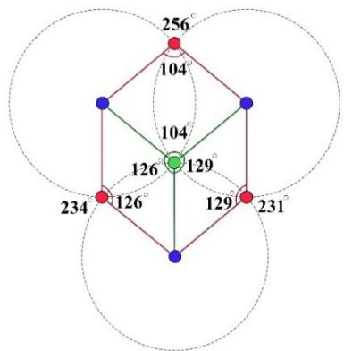  
FIGURE 6. Angular separation relative to neighboring satellites.

With this approach, we can predict coverage at future times for each critical point and assign a count equal to the number of satellites covering it. In Figure 6, green critical points covered by boundary satellites receive a value of one, while red points likely to lose access receive a value of zero. If an additional satellite lies between the boundary satellites and closer to the critical points (see Figure 7), it is considered internal for the green points $C _ { 1 } , C _ { 2 }$ . For $C _ { 1 }$ , whose coverage was already guaranteed by at least one boundary satellite $S _ { 1 } , S _ { 2 } , S _ { 3 }$ at $t + \varepsilon$ , the internal satellite $S _ { 4 }$ is also expected to provide coverage at $t + \varepsilon ,$ so the coverage count can reach two.

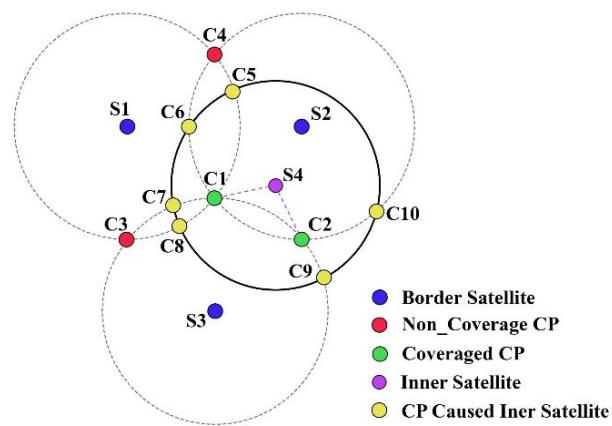  
FIGURE 7. Adding an internal satellite.

For $C _ { 2 }$ , although coverage was not expected at t+ε without $S _ { 4 } .$ , the presence of the internal satellite yields at least one access at $t + \varepsilon$ . The footprint of $S _ { 4 }$ also creates new critical points with other satellites (yellow $C _ { 5 } - C _ { 1 0 }$ in Figure 7). After updating both new and existing points, the coverage status is shown in Figure 8. For a symmetric Walker-Delta constellation, the continuous coverage evaluation begins by specifying the main orbital design parameters (altitude, inclination, payload FOV or MEA, and orbital configuration).

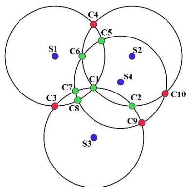  
FIGURE 8. Resulting status of critical points.

The evaluation process (see Figure 9) proceeds as follows:

1) Calculate Satellite Velocity and Positions: Compute the velocity and position of the satellites at a hypothetical time in the Earth fixed coordinate system according to the given configuration.

2) Compute Satellite Footprints: For each satellite, calculate the payload footprint and coverage areas as small circles on the Earth’s surface.

3) Determine Critical Points: Calculate the intersection points of these small circles, designate them as critical points, and determine their positions, i.e., latitude and longitude.

4) Relative Position Calculation: Calculation of the relative position of satellites with respect to the critical point in the AEZ coordinate system.

5) Categorize Satellites: Classify the satellites covering the critical point into boundary satellites and internal satellites.

6) Azimuth Distance Calculation: Calculate the azimuth angular distances between the boundary satellites relative to the critical point on the Earth.

7) Azimuth Angle Filtering: Filter out relative azimuth angles greater than 180 degrees $( \mathrm { A Z } > 1 8 0 ^ { \circ } )$ .

a) Coverage Evaluation: If angles greater than 180 degrees exist among the boundary satellites, they will not provide coverage for the critical point. Otherwise, at least one satellite will cover the critical point at the next instance.

b) Internal Satellite Contribution: Each internal satellite contributes as one satellite providing coverage for the critical point at the next time instance.

8) Cumulative Coverage Calculation: The total coverage obtained for the critical points to ensure continuous coverage for at least $t + \varepsilon .$

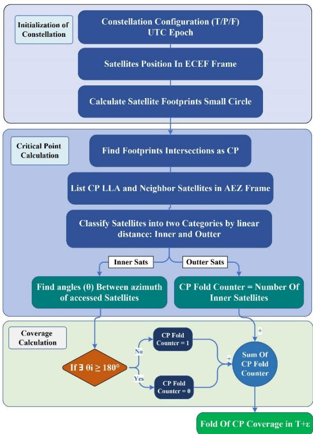  
FIGURE 9. Critical point function framework.

This Coverage evaluation method can be applied to assess continuous coverage from 1-fold to n-fold. Due to the symmetric distribution and motion of satellites in the Walker-Delta configuration, if the evaluation criteria are met at a single time instance, this coverage will be valid continuously for other times as well, which will be demonstrated in the results.

To evaluate the existence of coverage gaps for the continuous coverage problem using the proposed algorithm, the existence of critical points with values less than the desired number of satellites (n-fold) for the simulated constellation indicates the presence of coverage gaps. These gaps can be eliminated or minimized using optimization methods to achieve the satellite constellation orbit with the minimum number of satellites or any other objective.

## C. DEMONSTRATING EXAMPLES FOR PERFORMANCE EVALUATION

CP method calculations can be performed for all satellite pairs in a constellation, given payload characteristics (FOV or MEA) and orbital altitude. Coverage accuracy can be assessed by examining these critical points. As shown in Figure 10, intersections of neighboring payload footprint cones create critical points. Using the algorithm above, the coverage status of these points is determined: green points are covered and red points are uncovered for the 1-fold case. This demonstrates successful performance of the critical point evaluation method in target area assessment.

By employing this method within an orbital design optimization algorithm, we can minimize the number of satellites while satisfying continuous coverage requirements in the target area. The optimal configuration can then be determined, and the method’s performance evaluated.

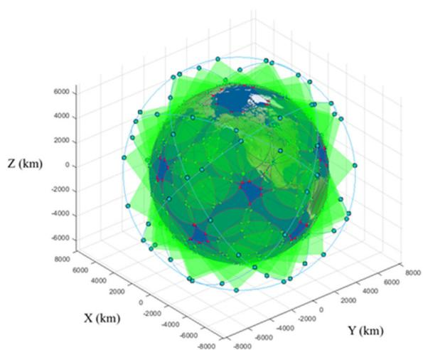  
FIGURE 10. Critical point method demonstration (inertial Cartesian coordinates).

## III. OPTIMAL CONSTELLATION DESIGN USING THE PROPOSED METHOD

We use particle swarm optimization (PSO), an evolutionary computation technique inspired by the social behavior of flocking birds [21], to solve the optimization problem. In satellite constellation design, PSO can be used to optimize key factors such as coverage and the required number of satellites. Each particle in the swarm represents a specific constellation configuration, and the objective function can include variables such as:

• Coverage performance to ensure target area coverage with minimal temporal gaps.

• Overall constellation cost, including launch and maintenance expenses, and the number of satellites required.

The PSO algorithm iteratively adjusts constellation configurations by simulating the swarm’s behavior based on individual and collective experience.

In this work, PSO is used to size the Walker-Delta constellation while enforcing continuous n-fold coverage over the target region. PSO is a population-based, derivative-free optimizer in which each particle encodes one candidate set of Walker-Delta parameters and updates its position according to its personal best and the global best solution found so far [21].

The underlying constellation-design problem is mixedinteger, nonconvex, and multimodal: the Walker-Delta parameters (T, P, F) are discrete, whereas the orbital inclination i is continuous, and the coverage evaluator is geometry-based and does not admit analytic gradients. Therefore, gradient-based methods are not suitable for this problem. Metaheuristic algorithms such as Genetic Algorithms, Simulated Annealing, and PSO are appropriate for such landscapes, and our preliminary experiments showed that PSO produced feasible constellations more consistently and with lower variability than the alternatives [28]. Combined with its modest parameter count and prior use in satellite coverage and constellation design problems [29], PSO is adopted as the primary optimizer in this study.

In the present implementation, each PSO particle represents the design vector

$$
x = (T, P, F, i)\tag{7}
$$

where $T$ is the total number of satellites, $P$ is the number of orbital planes, $F$ is the Walker phasing parameter, and i is the orbital inclination.

Let $N _ { s a t s } ( x )$ denote the total number of satellites, $\mathcal C ( x )$ is the set of critical points, fold $( c ; x )$ is the number of satellites covering critical point $c , n$ is the required coverage fold, and M is a large penalty constant. The objective function is then defined as

$$
J (x) = \left\{ \begin{array}{l l} N _ {s a t s} (x) & \text { if   fold } (c; x) \geq n \text { for   all } c \in \mathcal {C} (x) \\ M & \text { otherwise } \end{array} \right.\tag{8}
$$

This formulation minimizes the total number of satellites subject to the requirement that every critical point satisfies the n-fold coverage condition. During the PSO search, the same feasibility rule is applied: if any critical point is under covered, the design receives the penalty value M, ensuring that infeasible constellations are immediately discarded. The design variables are constrained

by

$$
\begin{array}{l} 6 \leq T \leq 3 6 0 0, T \in \mathbb {Z}, \\ 2 \leq P \leq 4 5, P \in \mathbb {Z}, \\ 0 \leq F \leq 4 4, F \in \mathbb {Z}, \\ 0 ^ {\circ} <   i <   9 0 ^ {\circ}, i \in \mathbb {R}. \end{array}\tag{9}
$$

After each PSO update, (T, P, F) are rounded to the nearest admissible integers and i is clamped to its bounds. Standard PSO velocity and position updates are used, with out-ofbounds moves corrected by reflection.

The PSO parameter settings used in all numerical experiments are summarized in Table 1.

TABLE 1. PSO algorithm parameters.

<table><tr><td>Parameter</td><td>Value</td></tr><tr><td>Swarm size</td><td>70</td></tr><tr><td>Maximum iterations</td><td>70</td></tr><tr><td>Inertia weight</td><td>1.0 with damping factor 0.99 per iteration</td></tr><tr><td>Cognitive coefficient</td><td>1.5</td></tr><tr><td>Social coefficient</td><td>2.0</td></tr><tr><td>Velocity clamp</td><td>10% of design-variable range</td></tr></table>

This process continues until the algorithm identifies an optimal or near-optimal constellation that minimizes the number of satellites while satisfying the continuous n-fold coverage requirement under mission-driven bounds on altitude, inclination, and Walker-Delta parameters. Satellite count is the primary optimization driver because it directly influences mission cost.

At each iteration, the optimizer generates a candidate constellation and evaluates it at a single epoch. If any critical point fails to meet the required coverage, the cost function assigns the penalty M , reinforcing strict coverage feasibility throughout the search.

Figure 11(a) illustrates that the evaluation algorithm requires at least two critical points formed by intersecting satellite footprints; configurations lacking sufficient overlap, such as the left panel, fail the coverage requirement. Figure 11(b) highlights an additional requirement: at least one satellite footprint must be fully enclosed within the target region.

Taking the above factors into account, the optimization algorithm for designing a satellite constellation with a Walker-Delta configuration is illustrated in Figure 12.

It is essential to define the design constraints, based on mission requirements and objectives, as input parameters. These constraints include the target area, MEA, coverage fold, and the altitude and eccentricity of the orbits.

Additionally, allowable ranges are set for the design variables, such as the total number of satellites, the number of orbital planes, the constellation phase (T/P/F), and the inclination of the orbital configuration. These inputs remain fixed during optimization, and are traded off against the coverage objective.

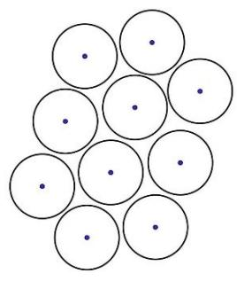

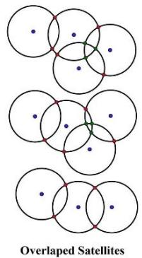  
(a)

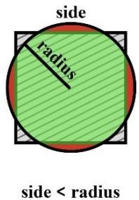

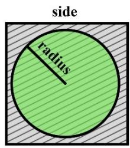  
(b)  
FIGURE 11. Acceptable and unacceptable footprint states. (a) Permissible satellite-footprint intersections required by the evaluation algorithm, (b) Permissible combinations of target area and satellite footprints.

Using these constraints and admissible ranges, the optimizer randomly generates initial configurations within the allowed bounds, and the critical point evaluation algorithm then assesses the satellite positions and constants of each configuration through the cost function. In the outputs of the evaluation algorithm, the set of critical points and their accessibility are assessed as described in the previous section.

The cost function outputs then drive the iterative PSO process, which, using feedback from the evaluations and while maintaining the required coverage, seeks the minimum feasible number of satellites. Given the discrete nature of the optimization, a global minimum may not have feasible neighbors in its vicinity, and exhaustive search may be necessary in principle. However, in the validation section we show that the optimization algorithm attains suitable solutions for sample designs without brute-force search.

## IV. RESULTS AND DISCUSSION

## A. EVALUATION OF RESULTS AND VALIDATION OF THE EVALUATION ALGORITHM

To demonstrate the performance of the evaluation algorithm, we applied the proposed optimization method with representative mission requirement inputs for various mission scenarios, and we summarize the results in Table 2. For each scenario, Table 2 reports the optimized Walker-Delta configuration, the corresponding inclination and altitude, the required n-fold coverage and target region, and the measured execution times of the CP, polygon, and GPA evaluators.

We considered four parameters as mission requirements for the simulations: (1) target area, (2) n-fold coverage, (3) minimum elevation angle (MEA), and (4) altitude. The three design variables obtained from the optimization are: (1) orbital inclination, (2) Walker-Delta constellation configuration, and (3) total number of satellites.

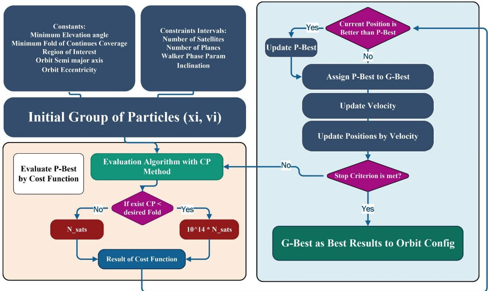  
FIGURE 12. Framework of critical point optimization.

The target-area cases include global, 50◦–70◦, 25◦–55◦, and +20◦ to –20◦ latitude bands. Latitude regions are used because the constellation is assumed symmetric, providing nearly uniform coverage across a latitude band. To demonstrate performance at different n-fold coverages, values of 1, 3, and 5 were selected for global coverage. Additionally, MEA values of 15 and 30 were used in all scenarios. Orbital altitudes were within LEO at 550, 700, 1,200, and 1,500 km for all scenarios.

All runtime values in Table 2 are wall-clock execution times obtained under a consistent computational environment, enabling a fair comparison across evaluators. For the global 1-fold scenarios, the CP evaluator is systematically the fastest, with runtimes on the order of a few tens to a few hundred milliseconds, whereas the polygon-based evaluator typically requires from a few seconds up to roughly ten seconds and the GPA remains in the many-seconds range. In the more demanding global 3-fold and 5-fold cases, polygon and GPA runtimes grow to several up to a few tens of seconds and to roughly one to a few minutes, respectively, while CP still remains below about one second. Regional scenarios (50◦–70◦, 25◦–55◦, and +20◦ to –20◦ latitude bands) reduce absolute runtimes for all methods but preserve the same hierarchy: CP completes in about one to a few tens of milliseconds, polygon in well under one second up to around ten seconds, and GPA in several seconds to a few tens of seconds. Overall, these results indicate that the CP evaluator achieves speedups on the order of roughly one to two orders of magnitude relative to the polygon method and about two to nearly four orders of magnitude relative to GPA, while producing identical continuous n-fold coverage decisions.

To assess the accuracy of the results, four samples from Table 2 were simulated using the GPA for different orbital altitudes under 3-fold, week-long (24/7) coverage. The results are shown in Figure 13. Each image uses a color gradient heatmap from red to blue to indicate the ratio of the minimum number of covering satellites, where a blue spectrum denotes a higher minimum number of covering satellites, and red indicates fewer covering satellites. On the left panel of the figures, values are plotted on a linear graph according to latitude.

Coverage for Walker-Delta constellations is lower in equatorial regions due to greater spacing between satellite ground tracks at low latitudes. Therefore, by achieving the mission’s minimum required coverage under the worst-case scenario near the equator, the configuration satisfies the mission requirements globally. As explained previously, comprehensive search methods may be required to ensure global optimality; nevertheless, the obtained results demonstrate adequate coverage.

TABLE 2. Results of various scenarios to validate CP method.

<table><tr><td colspan="5">INPUT DESIGN PARAMETERS</td><td colspan="4">RESULT OF OPTIMIZATION</td></tr><tr><td>TARGET REGION</td><td>FOLD</td><td>MINIMUM ELEVATION</td><td>ALTITUDE</td><td>INCLINATION</td><td>BEST RESULT (T/P/F)</td><td>GPA RUNTIME (S)</td><td>POLYGON RUNTIME (S)</td><td>CP RUNTIME (S)</td></tr><tr><td>GLOBAL</td><td>1</td><td>15</td><td>550</td><td>84.82</td><td>325/13/9</td><td>66.3828</td><td>7.5291</td><td>0.1014</td></tr><tr><td>GLOBAL</td><td>1</td><td>15</td><td>700</td><td>84.8</td><td>171/9/6</td><td>52.6857</td><td>4.2294</td><td>0.0151</td></tr><tr><td>GLOBAL</td><td>1</td><td>15</td><td>1200</td><td>82.93</td><td>91/7/6</td><td>49.9196</td><td>2.2929</td><td>0.0128</td></tr><tr><td>GLOBAL</td><td>1</td><td>15</td><td>1500</td><td>86.83</td><td>63/7/6</td><td>42.8413</td><td>1.5812</td><td>0.0104</td></tr><tr><td>GLOBAL</td><td>1</td><td>30</td><td>550</td><td>89.85</td><td>735/21/18</td><td>69.5930</td><td>15.5683</td><td>0.3415</td></tr><tr><td>GLOBAL</td><td>1</td><td>30</td><td>700</td><td>90</td><td>495/15/14</td><td>62.9963</td><td>10.7620</td><td>0.2240</td></tr><tr><td>GLOBAL</td><td>1</td><td>30</td><td>1200</td><td>81.62</td><td>325/13/12</td><td>70.8127</td><td>7.1594</td><td>0.1040</td></tr><tr><td>GLOBAL</td><td>1</td><td>30</td><td>1500</td><td>89.19</td><td>135/9/6</td><td>46.5817</td><td>3.4004</td><td>0.0148</td></tr><tr><td>GLOBAL</td><td>3</td><td>15</td><td>550</td><td>88.57</td><td>605/11/8</td><td>101.5071</td><td>13.1089</td><td>0.9810</td></tr><tr><td>GLOBAL</td><td>3</td><td>15</td><td>700</td><td>79.6</td><td>464/16/12</td><td>107.2382</td><td>11.1712</td><td>0.3229</td></tr><tr><td>GLOBAL</td><td>3</td><td>15</td><td>1200</td><td>85.82</td><td>204/17/16</td><td>77.6747</td><td>4.7707</td><td>0.2294</td></tr><tr><td>GLOBAL</td><td>3</td><td>15</td><td>1500</td><td>86.38</td><td>156/13/12</td><td>72.4428</td><td>3.6758</td><td>0.4384</td></tr><tr><td>GLOBAL</td><td>3</td><td>30</td><td>550</td><td>88.63</td><td>2040/40/20</td><td>157.3588</td><td>43.2491</td><td>1.1434</td></tr><tr><td>GLOBAL</td><td>3</td><td>30</td><td>700</td><td>89.52</td><td>1404/27/25</td><td>146.9097</td><td>30.9729</td><td>0.7173</td></tr><tr><td>GLOBAL</td><td>3</td><td>30</td><td>1200</td><td>89.98</td><td>544/17/16</td><td>109.1481</td><td>14.7398</td><td>0.3658</td></tr><tr><td>GLOBAL</td><td>3</td><td>30</td><td>1500</td><td>88.40</td><td>378/21/20</td><td>90.2903</td><td>9.2236</td><td>0.4711</td></tr><tr><td>GLOBAL</td><td>5</td><td>15</td><td>550</td><td>89.78</td><td>1007/19/18</td><td>154.9598</td><td>21.9715</td><td>0.5971</td></tr><tr><td>GLOBAL</td><td>5</td><td>15</td><td>700</td><td>87.52</td><td>675/15/5</td><td>139.5477</td><td>16.0253</td><td>0.4655</td></tr><tr><td>GLOBAL</td><td>5</td><td>15</td><td>1200</td><td>87.57</td><td>330/11/10</td><td>112.3824</td><td>7.6507</td><td>0.2406</td></tr><tr><td>GLOBAL</td><td>5</td><td>15</td><td>1500</td><td>86.72</td><td>243/9/8</td><td>102.8690</td><td>5.8482</td><td>0.2457</td></tr><tr><td>GLOBAL</td><td>5</td><td>30</td><td>1200</td><td>89.19</td><td>800/25/11</td><td>138.1632</td><td>18.0221</td><td>0.5872</td></tr><tr><td>GLOBAL</td><td>5</td><td>30</td><td>1500</td><td>86.87</td><td>615/15/5</td><td>136.4026</td><td>14.7258</td><td>0.4021</td></tr><tr><td>+50 +70</td><td>1</td><td>15</td><td>550</td><td>64.29</td><td>96/8/7</td><td>6.1264</td><td>2.1473</td><td>0.0015</td></tr><tr><td>+50 +70</td><td>1</td><td>15</td><td>700</td><td>79.78</td><td>96/6/5</td><td>6.8706</td><td>2.3800</td><td>0.0018</td></tr><tr><td>+50 +70</td><td>1</td><td>15</td><td>1200</td><td>78.94</td><td>44/4/3</td><td>5.6140</td><td>0.9880</td><td>0.0011</td></tr><tr><td>+50 +70</td><td>1</td><td>30</td><td>550</td><td>66.06</td><td>462/14/12</td><td>15.6660</td><td>10.0802</td><td>0.0249</td></tr><tr><td>+50 +70</td><td>1</td><td>30</td><td>700</td><td>66.30</td><td>286/11/10</td><td>11.4274</td><td>5.9248</td><td>0.0102</td></tr><tr><td>+50 +70</td><td>1</td><td>30</td><td>1200</td><td>65.78</td><td>90/5/4</td><td>6.4789</td><td>2.0201</td><td>0.0014</td></tr><tr><td>+50 +70</td><td>1</td><td>30</td><td>1500</td><td>62.73</td><td>75/5/4</td><td>5.6924</td><td>1.8565</td><td>0.0014</td></tr><tr><td>+25 +55</td><td>1</td><td>15</td><td>700</td><td>49.17</td><td>108/18/8</td><td>9.6979</td><td>2.6399</td><td>0.0023</td></tr><tr><td>+25 +55</td><td>1</td><td>15</td><td>1200</td><td>46.85</td><td>45/9/3</td><td>6.7184</td><td>1.0979</td><td>0.0018</td></tr><tr><td>+25 +55</td><td>1</td><td>15</td><td>1500</td><td>49.25</td><td>36/6/5</td><td>6.8055</td><td>0.9529</td><td>0.0017</td></tr><tr><td>+25 +55</td><td>1</td><td>30</td><td>550</td><td>49.77</td><td>690/23/17</td><td>23.5268</td><td>14.2455</td><td>0.0500</td></tr><tr><td>+25 +55</td><td>1</td><td>30</td><td>700</td><td>51.47</td><td>312/24/9</td><td>14.3249</td><td>6.8472</td><td>0.0135</td></tr><tr><td>+25 +55</td><td>1</td><td>30</td><td>1200</td><td>49</td><td>130/13/3</td><td>9.6141</td><td>2.7146</td><td>0.0023</td></tr><tr><td>+25 +55</td><td>1</td><td>30</td><td>1500</td><td>48.93</td><td>90/9/8</td><td>8.7568</td><td>2.2562</td><td>0.0020</td></tr><tr><td>+20 -20</td><td>1</td><td>15</td><td>550</td><td>16.19</td><td>48/16/0</td><td>8.8859</td><td>0.9772</td><td>0.0022</td></tr><tr><td>+20 -20</td><td>1</td><td>15</td><td>700</td><td>15.87</td><td>51/3/0</td><td>9.5035</td><td>1.2431</td><td>0.0024</td></tr><tr><td>+20 -20</td><td>1</td><td>15</td><td>1200</td><td>18.31</td><td>28/7/6</td><td>8.8546</td><td>0.7079</td><td>0.0022</td></tr><tr><td>+20 -20</td><td>1</td><td>15</td><td>1500</td><td>17.87</td><td>20/2/1</td><td>8.7491</td><td>0.5107</td><td>0.0019</td></tr><tr><td>+20 -20</td><td>1</td><td>30</td><td>550</td><td>18.85</td><td>288/12/11</td><td>15.4913</td><td>5.6633</td><td>0.0297</td></tr><tr><td>+20 -20</td><td>1</td><td>30</td><td>700</td><td>14.75</td><td>198/11/10</td><td>15.2592</td><td>4.3048</td><td>0.0048</td></tr><tr><td>+20 -20</td><td>1</td><td>30</td><td>1200</td><td>14.84</td><td>75/15/14</td><td>10.8038</td><td>1.6428</td><td>0.0025</td></tr><tr><td>+20 -20</td><td>1</td><td>30</td><td>1500</td><td>16.72</td><td>45/3/2</td><td>9.3591</td><td>1.1237</td><td>0.0024</td></tr></table>

Another example demonstrates the performance of the evaluation algorithm in the optimal design of a constellation with similar features (an altitude of 1,500 km, a global target area, and an MEA of 15◦). The key difference is that the required n-fold coverage was varied as an input parameter.

As shown in Figure 14, 243 satellites are required for 5-fold coverage, 156 satellites for 3-fold coverage, and 63 satellites for 1-fold coverage to meet the requirements.

## B. INVESTIGATION OF THE CP METHOD’S ACCURACY AND COMPUTATIONAL LOAD

As verified by the timings in Table 2, and especially when compared with the GPA and polygon-intersection baselines, the proposed evaluation approach is computationally more efficient under the assumptions of a symmetric Walker-Delta

550Km-3Fold  
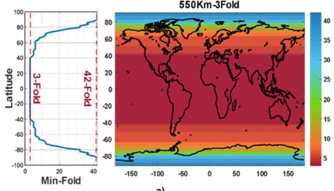  
a)

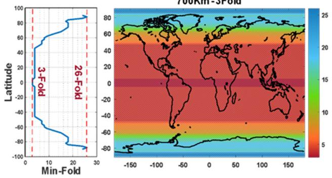  
(b)

1200Km-3Fold  
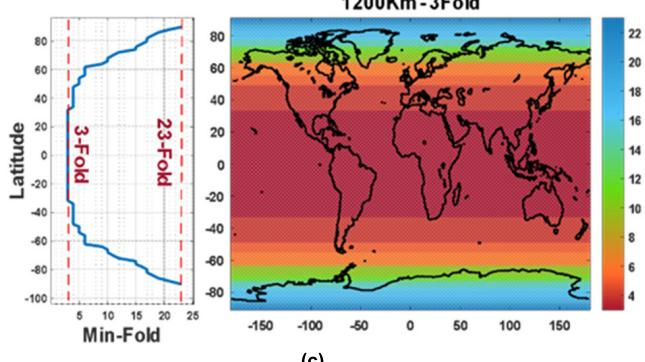  
(c)

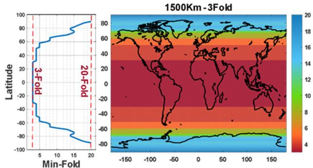  
(d)  
FIGURE 13. GPA coverage evaluation for constellations optimized using the critical point method, considering four scenarios of 3-fold continuous coverage at different altitudes: (a) 550 km, (b) 700 km, (c) 1,200 km, and (d) 1,500 km.

constellation and a target area covered by each satellite’s circular footprint. This makes it particularly suitable for designing mega-constellations. The reduction in computational burden arises from concentrating the evaluation on a small set of analytically defined critical coverage points on the footprint boundaries and thereby reducing the number of points that must be checked, instead of uniformly sampling a dense grid or repeatedly clipping overlapping polygons as in GPA and polygon-based methods. Furthermore, because the critical coverage points are determined analytically via spherical trigonometry, the CP evaluator preserves or improves accuracy relative to GPA at a fraction of the computational cost.

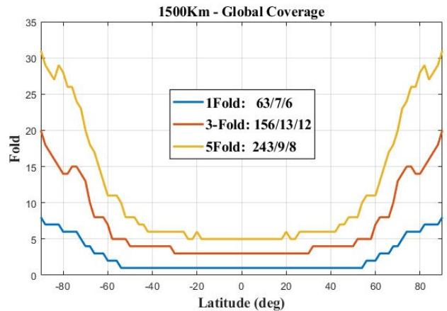

FIGURE 14. Coverage by latitude for 1, 3, and 5-fold configurations at an altitude of 1,500 kilometers resulting from optimization.  
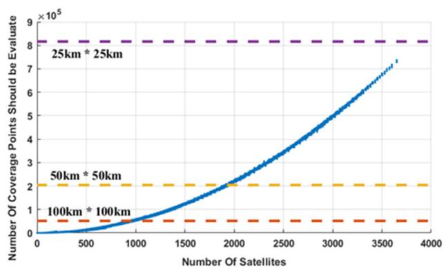  
FIGURE 15. Number of coverage evaluation points versus satellite count: the CP method varies with the number of satellites (solid curve), while the GPA remains fixed by the chosen grid resolution (dashed lines for 100 × 100 km, 50 × 50 km, and 25 × 25 km). The fixed values reflect constant accuracy, whereas the curved CP trend achieves higher accuracy with fewer evaluation points.

Given that the algorithm assumes a spherical Earth with equatorial radius, the likelihood of coverage gaps occurring at higher latitudes is reduced. For increased precision, and to potentially reduce the required number of satellites during detailed design, Earth models such as WGS 84 can be used. This ensures that, while maintaining analytical positioning accuracy similar to circumcircle-based methods, the approach incurs a lower computational load than GPA gridbased methods.

As shown in Figure 15, the number of GPA computation points is fixed by the chosen spatial resolution and does not depend on the number of satellites; in contrast, the proposed method produces a point count that scales with constellation size. For example, at 25-km spatial resolution, the CP evaluator requires fewer computation points than GPA when the constellation contains fewer than roughly 3,800 satellites. Under the assumption of Walker-Delta symmetry, these evaluations need not be repeated over time or along the satellite orbits. For asymmetric constellations with strict resolution requirements and large satellite counts, however, it becomes important to assess the trade-off between the computational demands of the CP method and GPA. The structural reduction in required evaluation points predicted by this analysis is reflected directly in the timing results of Table 2 and the point-count comparison in Figure 15, where the CP method achieves comparable or higher effective resolution with substantially fewer evaluation points and significantly reduced computation time relative to GPA.

## V. CONCLUSION

In this study, we introduce a new technique for evaluating continuous coverage in satellite constellations. The method focuses on critical points and employs simple geometric calculations to improve accuracy while reducing computational load. Unlike classical techniques such as the grid point approach )GPA( or the circumcircle method, which assess the entire target area, our approach concentrates on the specific locations where coverage gaps are most likely. This focus eliminates redundant computation and provides a simple geometric procedure that targets the points most susceptible to coverage uncertainty. Finally, the method combines these geometric characteristics with the constellation’s mission requirements to evaluate any candidate configuration.

Our method provides a highly accurate evaluation by removing unnecessary computation points in the target area, thereby increasing computational efficiency and preventing redundant processing, and by using simple geometric techniques to satisfy the desired coverage characteristics specified in the mission statement. By preserving the advantages and mitigating the disadvantages of previous methods, it is well suited for initial estimation and evaluation in the design of Mega-Constellations for continuous coverage. This is particularly important given the trend toward deploying constellations with a very large number of satellites in low Earth orbit (LEO) and the need to optimize the number of satellites required to achieve the desired coverage, thereby achieving significant cost savings.

The main strength of the method is its ability to efficiently identify the critical points that can create gaps in the target coverage area. It can therefore serve as a practical alternative to previous techniques for evaluating n-fold continuous coverage. Results from test scenarios show that the CP evaluator maintains coverage fidelity while reducing the computational load relative to GPA and polygon-based baselines. To demonstrate its effectiveness in producing optimal designs compared with previous approaches, we presented several case studies comparing the CP method with the conventional GPA for circular footprints and symmetric

Walker-Delta configurations. For these studies, we used the coverage-evaluation metric as the main term in the cost function of an optimization problem, solved using particle swarm optimization (PSO), with the objective of achieving continuous coverage while minimizing the number of required satellites. By assuming symmetry and circular sensor footprints, we could disregard the need for orbital propagation. This method can also be extended to cases with non-circular footprints and asymmetric orbital configurations; however, incorporating orbital propagation in such scenarios would partly offset the computational benefits. Nonetheless, for relatively small satellite constellations (fewer than about 5,000 satellites), the approach remains preferable; for megaconstellations, assuming global, circular coverage is both logical and appropriate.

In summary, the CP method represents a substantial improvement in the evaluation of satellite network coverage. Its focus on critical boundary intersections yields accurate and computationally efficient assessments, addressing key limitations of classical methods. Future work will extend this approach to broaden its applicability to a wider range of mission requirements.

## ACKNOWLEDGMENT

The authors used OpenAI’s ChatGPT (2025) for language polishing (grammar) only. No scientific content, analysis, figures, or code were generated by the AI. All technical statements, equations, assumptions, and conclusion are their own.

## REFERENCES

[1] J. R. Wertz, Mission Geometry; Orbit and Constellation Design and Man agement (Space Technology Library). Kluwer Academic Publishers, 2001.

[2] Z. Song, H. Liu, G. Dai, M. Wang, and X. Chen, ‘‘Cell area-based method for analyzing the coverage capacity of satellite constellations,’’ Int. J. Aerosp. Eng., vol. 2021, pp. 1–10, 2021.

[3] J. J. Morrison, ‘‘A system of sixteen synchronous satellites for worldwide navigation and surveillance,’’ Federal Aviation Administration, Washing ton, DC, USA, Tech. Rep. DOT-TSC-FAA-72-31, 1973.

[4] Z. Song, G. Dai, M. Wang, and X. Chen, ‘‘A novel grid point approach for efficiently solving the constellation-to-ground regional coverage prob lem,’’ IEEE Access, vol. 6, pp. 44445–44458, 2018.

[5] G. Dai, X. Chen, M. Wang, E. Fernández, T. N. Nguyen, and G. Reinelt, ‘‘Analysis of satellite constellations for the continuous coverage of ground regions,’’ J. Spacecraft Rockets, vol. 54, no. 6, pp. 1294–1303, Nov. 2017.

[6] J. G. Walker, ‘‘Continuous whole-Earth coverage by circular-orbit satellite patterns,’’ Royal Aircraft Establishment Farnborough, U.K., Tech. Rep. RAETR77044, 1977.

[7] J. G. Walker, ‘‘Satellite constellations,’’ J. Brit. Interplanetary Soc., vol. 37, p. 559, Jan. 1984.

[8] J. G. Walker, ‘‘Coverage predictions and selection criteria for satellite constellations,’’ Royal Aircraft Establishment Farnborough, U.K., Tech. Rep. RAETR82116, 1982.

[9] A. H. Ballard, ‘‘Rosette constellations of Earth satellites,’’ IEEE Trans. Aerosp. Electron. Syst.

[10] T. J. Lang, ‘‘Optimal low Earth orbit constellations for continuous global coverage,’’ Astrodynamics, vol. 1993, pp. 1199–1216, Jan. 1994.

[11] W. S. Adams and L. Rider, ‘‘Circular polar constellations providing con tinuous single or multiple coverage above a specified latitude,’’ J. Astron. Sci., vol. 35, pp. 155–192, Jan. 1987.

[12] S. M. Henn, J. A. Fraire, and H. Hermanns, ‘‘Polygon-based algorithms fo N-satellite constellations coverage computing,’’ IEEE Trans. Aerosp. Elec tron. Syst., vol. 59, no. 5, pp. 7166–7182, May 2023.

[13] Y. Gu, Y. Chen, Y. Zhang, G. Wu, and S. Bai, ‘‘Extended 2-D map for satellite coverage analysis considering elevation-angle constraint,’’ IEEE Trans. Aerosp. Electron. Syst., vol. 60, no. 5, pp. 6531–6549, Oct. 2024.

[14] D. Mortari and M. P. Wilkins, ‘‘Flower constellation set theory. Part I: Compatibility and phasing,’’ IEEE Trans. Aerosp. Electron. Syst., vol. 44, no. 3, pp. 953–962, Jul. 2008.

[15] M. P. Wilkins and D. Mortari, ‘‘Flower constellation set theory part II: Secondary paths and equivalency,’’ IEEE Trans. Aerosp. Electron. Syst., vol. 44, no. 3, pp. 964–976, Jul. 2008.

[16] T. A. Ely, W. A. Crossley, and E. A. Williams, ‘‘Satellite constellation design for zonal coverage using genetic algorithms,’’ J. Astron. Sci., vol. 47, nos. 3–4, pp. 207–228, Sep. 1999.

[17] G. Confessore, M. Gennaro, and S. Ricciardelli, ‘‘A genetic algorithm to design satellite constellations for regional coverage,’’ in Proc. Oper. Res. Proc., Sel. Papers Symp. Oper. Res., 2001, pp. 35–41.

[18] M. P. Ferringer and D. B. Spencer, ‘‘Satellite constellation design tradeoffs using multiple-objective evolutionary computation,’’ J. Spacecraft Rockets, vol. 43, no. 6, pp. 1404–1411, Nov. 2006.

[19] Q. He and C. Han, ‘‘Satellite constellation design with adaptively continuous ant system algorithm,’’ Chin. J. Aeronaut., vol. 20, no. 4, pp. 297–303, Aug. 2007.

[20] L. Wang, Y. Wang, K. Chen, and H. Zhang, ‘‘Optimization of regional coverage reconnaissance satellite constellation by NSGA-II algorithm,’’ in Proc. Int. Conf. Inf. Autom., Jun. 2008, pp. 1111–1116.

[21] J. Kennedy and R. C. Eberhart, ‘‘Particle swarm optimization,’’ in Proc. Int. Conf. Neural Netw., vol. 4, 2002, pp. 1942–1948.

[22] L. Wei, W. Dayang, C. Hao, J. Song, L. Pei, and J. Chunxia, ‘‘A method of constellation design based on PSO for 5G LEO satellite communication system,’’ in Proc. IEEE 4th Int. Conf. Power, Intell. Comput. Syst. (ICPICS), Jul. 2022, pp. 607–611.

[23] B. Ebrahimi, M. Jafari Nadoushan, and J. Roshanian, ‘‘Optimal design and reconfiguration of flower constellations: An application to global disaster management,’’ Acta Astronautica, vol. 198, pp. 550–563, Sep. 2022.

[24] Y. Ulybyshev, ‘‘Satellite constellation design for complex coverage,’’ J. Spacecraft Rockets, vol. 45, no. 4, pp. 843–849, Jul. 2008.

[25] Y. Ulybyshev, ‘‘Geometric analysis and design method for discontinuous coverage satellite constellations,’’ J. Guid., Control, Dyn., vol. 37, no. 2, pp. 549–557, Mar. 2014.

[26] T. Savitri, Y. Kim, S. Jo, and H. Bang, ‘‘Satellite constellation orbit design optimization with combined genetic algorithm and semianalytical approach,’’ Int. J. Aerosp. Eng., vol. 2017, pp. 1–17, 2017.

[27] L. Rider, ‘‘Optimized polar orbit constellations for redundant Earth coverage,’’ J. Astron. Sci., vol. 33, pp. 147–161, Jan. 1985.

[28] R. Poli, J. Kennedy, and T. Blackwell, ‘‘Particle swarm optimization: An overview,’’ Swarm Intell., vol. 1, no. 1, pp. 33–57, 2007.

[29] Y. Han, J. Luo, and X. Xu, ‘‘On the constellation design of multi-GNSS reflectometry mission using the particle swarm optimization algorithm,’ Atmosphere, vol. 10, no. 12, p. 807, Dec. 2019.

MOJTABA NAMVAR received the M.Eng. degree in aerospace engineering from the Faculty of Aerospace Engineering, K. N. Toosi University of Technology (KNTU), Tehran, Iran. His research interests include satellite constellation design, electro-optical orbit determination, neural networks and deep learning, image processing, and data-driven engineering applications.

EBRAHIM AMIRI received the M.Sc. degree in aerospace engineering from the Faculty of Aerospace Engineering, K. N. Toosi University of Technology (KNTU), Tehran, Iran, in 2021. His research interests include mission and trajectory design, satellite constellation design, space resource exploration and asteroid mining, and space systems engineering.

MAHDI JAFARI-NADOUSHAN received the Ph.D. degree in aerospace engineering (space engineering) from the Sharif University of Technology, Tehran, Iran, in 2015. He is currently an Assistant Professor with the Faculty of Aerospace Engineering, K. N. Toosi University of Technology, Tehran, and a Board Member of the Space Research Laboratory, where he leads deep-space research activities. He has published in venues, such as Acta Astronautica, Nonlinear Dynamics,

Icarus, Monthly Notices of the Royal Astronomical Society, and Astrodynamics. His research interests include solar-system dynamics, dynamics in and around small bodies, asteroid engineering and mining, trajectory and mission design, orbital and celestial mechanics, and nonlinear dynamics and chaos.