# Satellite Constellation Design for Complex Coverage

Yuri Ulybyshev

Rocket-Space Corporation Energia,

141070 Korolev, Moscow Region, Russia

DOI: 10.2514/1.35369

Most traditional satellite constellation design methods are associated with a simple zonal or global, continuous or’ discontinuous coverage connected with a visibility of points on the Earth s surface. A new geometric approach for more complex coverage of a geographic region is proposed. Full and partial coverage of regions is considered. It implies that, at any time, the region is completely or partially within the instantaneous access area of a satellite of the constellation. The key idea of the method is a two-dimensional space application for maps of the satellite constellation and coverage requirements. The space dimensions are right ascension of ascending node and argument of latitude. Visibility requirements of each region can be presented as a polygon and satellite constellation as a uniform moving grid. At any time, at least one grid vertex must belong to the polygon. The optimal configuration of the satellite constellation corresponds to the maximum sparse grid. The method is suitable for continuous and discontinuous coverage. In the last case, a vertex belonging to the polygon should be examined with a revisit time. Examples of continuous coverage for a space communication network and of the United States are considered. Examples of discontinuous coverage are also presented.

## Nomenclature

$F$ relative phasing between satellite in adjacent planes in units of $2 \pi / T$ $h$ orbit altitude, km $i$ orbit inclination, deg $P$ number of orbital planes $R _ { e }$ spherical radius of the Earth, 6378 km $S$ number of satellites per plane, T=P $T$ total number of satellites t time, min $t _ { \mathrm { R E V } }$ revisit time, min $u$ argument of latitude, deg $\Delta u$ parameter related with relative phasing F, deg $\varepsilon$ elevation angle, deg - coverage angle, deg ’ = latitude, deg  right ascension of ascending node in an inertial frame, deg ! 1 mean motion of circular orbit, $\sqrt { \mu / ( R _ { e } + h ) ^ { 3 } } , 1 / \mathrm { s }$

## I. Introduction

ATELLITE constellations in circular orbits are currently used in S many applications: communication, navigation, and remote sensing. Satellite constellation design for continuous single and multiple global coverage of the Earth s surface has been examined by many authors [1 12]. The introduction of kinematically regular constellations are independently given by Walker [2] and Mozhaev [3]. The expanded tables of Walker-type constellations for continuous single and multiple coverage for 5 100 satellites and all numbers of orbit planes have been given by Lang [10] and Lang and Adams [11]. Methods using street-of-coverage techniques with arbitrary and optimal interplane satellite phasing have been presented by Rider [5,6]. Another type of satellite constellation is a polar constellation [7] and its generalization is a near-polar constellation [12]. Constellations for continuous global, single above-the-horizon coverage, and global below-the-horizon coverage have been considered by Hanson and Linden [8]. Another class of satellite constellations is constellations which provide discontinuous coverage [13 18]. Many approaches for the constellations have used genetic algorithms [14 16,18].

Most of the previous work has focused on the satellite constellation design problem for a simple continuous coverage when it is merely ensured that for every point on the Earth s surface (globa or a latitude band) at least one satellite is visible above a minimum elevation angle. For a simple discontinuous coverage, it also implies every point is viewed, but with a revisit time. As an example of more complex coverage, an approach for determining the minimum required number of satellites in low-altitude circular orbits for a regional communication system can be cited [4]. Analysis methods for complex continuous coverage of communication networks have been developed in [19].

The contribution of the paper is twofold. First, it is an extension of the simple coverage to a more complex scenario associated with full or partial visibility of a geographic region by a satellite from a constellation. Second, it is the presentation of a new method for satellite constellation design. The key idea of the method is a two dimensional space application for combined maps of the satellite constellation and coverage requirements. The last section of the paper illustrates several applications of this method for continuous and discontinuous coverage.

## II. Satellite Constellation Design Based on Two-Dimensional Maps

## A. Geometrical Preliminaries

We will start our analysis from examination of known facts related to coverage geometry and will make some assumptions: 1) the Earth is considered a round body, 2) all satellites in a constellation will be at the same altitude, with the same number of satellites in each orbit plane, and 3) all orbit planes in a constellation will have the same orbit inclination. Figure 1 shows a typical satellite coverage for an observer on the Earth.

The satellite is located at orbital altitude h, and the projection of the footprint onto the Earth s surface defines a circle of coverage of angle . The well-known relation between the coverage angle ${ \bar { \theta } } ,$ , the orbit altitude h, and the elevation angle " is given by

$$
\theta = \cos^ {- 1} \left(\frac {R _ {e}}{R _ {e} + h} \cos \varepsilon\right) - \varepsilon
$$

(1)

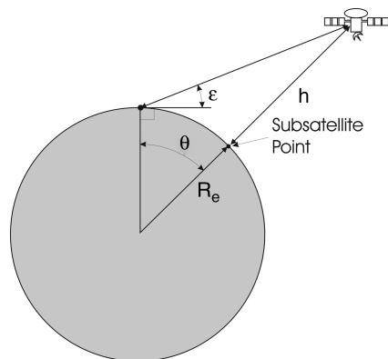  
Fig. 1 Satellite view geometry.

Note that the coverage circle size is dependent only on the satellite orbit altitude.

## B. Two-Dimensional Maps for Coverage Requirements

Define a two-dimensional space, associated with a satellite constellation: the x axis is the right ascension of ascending node  (in an inertial frame) and the y axis is the satellite argument of latitude u. Let us assume that the orbit inclination i, altitude $h ,$ and elevation angle " are specified. Let $f ( \Omega , u )$ be a coverage function which describes the requirements of the satellite constellation. Without loss of generality, let us suppose that all points $f ( \Omega , u ) \geq 0$ are required values and their map in the space is an area. In the general case, it can be a multiply connected area. Because, for the following analysis, only shape and size of the maps are important, the choice of righ ascension of ascending node is arbitrary.

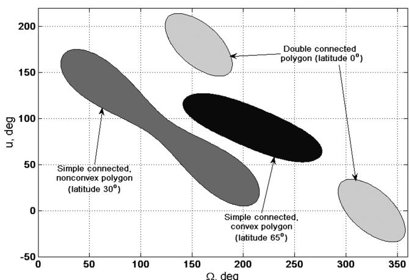  
Fig. 2 Polygon examples for simple coverage (h  1400 km, i  52 deg, "  10 deg).

The simplest case is the coverage of a point on the Earth s surface by a satellite. Figure 2 shows examples of such maps for points with different geographical latitudes. The maps are shown for one satellite revolution. On the next revolution, the maps would have shifted to the right by $\omega _ { e } \times P _ { n }$ (where $\omega _ { \epsilon }$ is the rotation rate of the earth and $P _ { n }$ is the orbital period), and so on for the next revolutions. From a geometric point of view, they can be convex or nonconvex, simple or multiply connected. For computational purposes, the coverage function is presented as a polygon of boundary points. It should be noted that in contrast to the coverage circle size on the Earth s surface, the size and shape of the polygon also depends on the point latitude and orbit inclination.

As the first case of complex coverage, let us consider full coverage of a geographical region by a satellite. It implies that the region is completely within the instantaneous access area of the satellite. This area represents the entire surface of the Earth that can be viewed for a minimum elevation angle, at this time. Such cases can be called ful region coverage (see Fig. 3a). The next case is the partial region coverage, i.e., only a part of the region is within the access area (see Fig. 3b).

Each region can be presented as a discrete set of inner and boundary points. For the full region coverage, the coverage function $f ( \Omega , U )$ is the intersection of the polygons (see Fig. 4a) and, for the partial region coverage, it is the union of the polygons (see Fig. 4b).

These problems can be solved using computational geometry methods [20], and modern scientific software have effective algorithms for such computations.

## C. Two-Dimensional Maps for Satellite Constellations

It is evident that for time intervals on the order of several orbital periods, a satellite trajectory in the introduced two-dimensional space is a straight line parallel to the y axis. For the space, any satellite constellation with a number of orbital planes and an equal number of satellites in each plane can be presented as a uniform moving grid. The satellites are the vertices of the grid. Examples of such grids for Walker-type [2] and near-polar [12] constellations are shown in Fig. 5. For time intervals more than several orbital periods, a similar map can also be produced, but the regression of the ascending node should be considered. In this case, the lines are slightly inclined to the y axis.

The further optimization is limited to symmetric Walker-type constellations [2]. The Walker approach uses symmetric arrangements of similarly inclined circular orbits at a common altitude. The standard notation $T / P / F$ will be used in this case. Here T is the total number of satellites, and P is the number of orbit planes at the same inclination and spread evenly around the equator. There are $T / P$ satellites evenly distributed in each plane. The integer parameter F describes the phasing of satellites in one plane relative to those in another. The satellites in a plane are shifted in phase by $F ( 2 \pi / T )$ relative to the plane to the west.

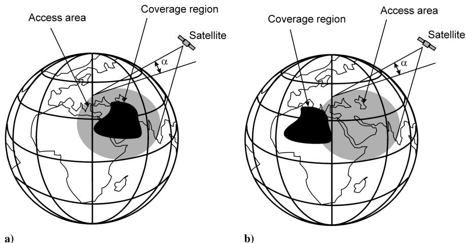  
Fig. 3 Geometry of coverage regions.

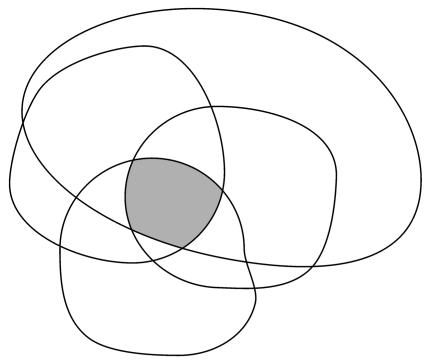  
a) Intersection of the polygons

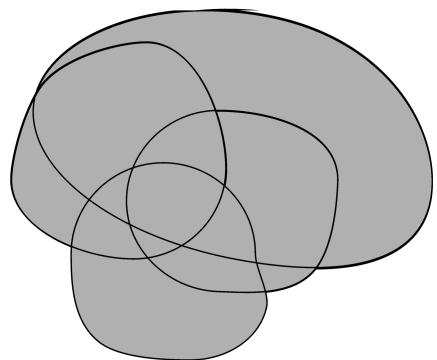  
b) Union of the polygons  
Fig. 4 Boolean operations with polygons.

The satellite constellation motion can be presented as a uniform moving grid. At any time, at least one grid vertex must belong to the polygon. The grid should also satisfy integer-value constraints for the numbers of orbit planes and satellites per plane. The optimal configuration of the satellite constellation corresponds to the maximum sparse grid. The method is suitable for continuous and discontinuous coverage. In the last case, a vertex belonging to the polygon should be examined with a revisit time. It is assumed that $\bar { f } ( \Omega , U )$ map is a convex polygon. Clearly, all of the grid cells are the same parallelograms (see Fig. 6) with the sides equal to $2 \pi / P$ (along the x axis) and $2 \pi ( T / P )$ (along the y axis), and a slope angle of u (in units of $2 \pi / T )$ . It follows that we can consider only one grid cell. Clearly, the optimal constellation with the minimum number of satellites corresponds to the maximum area parallelogram that can be placed (or inscribed for the limit case) into the polygon (see Fig. 6). The proof is simple and easy to understand. For the slope angle, the following inequality must be satisfied

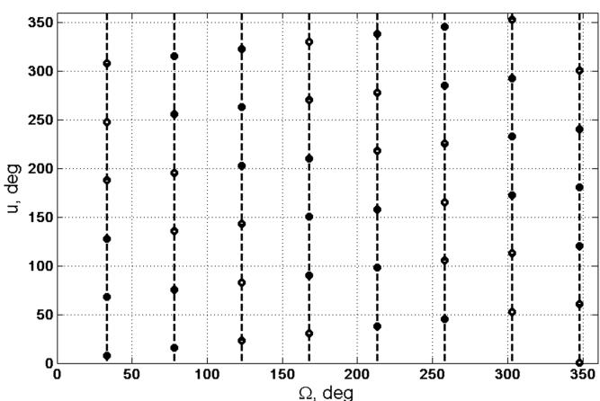  
a) Map of the Globalstar constellation 48/8/1

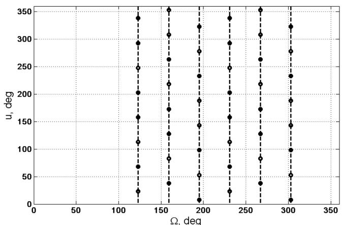  
b) Map of a near-polar constellation  
Fig. 5 Examples of satellite constellation maps.

$$
(k - 1) (2 \pi / S) \leq \Delta u = m (2 \pi / T) \leq k (2 \pi / S)\tag{2}
$$

where k and m are integer values. The phasing parameter is

$$
F = [ k (2 \pi / S) - m (2 \pi / T) ] / (2 \pi / T) = k P - m\tag{3}
$$

An enumerative approach follows. Specify the maximum numbers for orbital planes $P _ { \mathrm { m a x } }$ and satellites per plane $S _ { \mathrm { m a x } } ,$ , and a current optimal number of satellite $T _ { \mathrm { m i n } } = \hat { P _ { \mathrm { m a x } } } \mathrm { \hat { \times } } S _ { \mathrm { m a x } } .$ For each boundary point of the polygon $[ x _ { 0 } , y _ { 0 } ] .$ , construct all of the possible parallelograms. Determine the minimum value of P as

$$
P _ {\mathrm{min}} = \lceil 2 \pi / (x _ {\mathrm{max}} - x _ {\mathrm{min}},) \rceil + 1\tag{4}
$$

where $\lceil \dots \rceil$ round toward minus infinity and $x _ { \mathrm { m i n } } , x _ { \mathrm { m a x } }$ are extreme values of the polygon (Fig. 6). The potential values of $P _ { \mathrm { m a x } } \geq P \geq$ $P _ { \mathrm { m i n } }$ are examined in increasing order. For a selected value of P, all of the possible numbers of satellites per orbital plane $S _ { \mathrm { m a x } } \ge S \ge 3$ and u are considered. It is suggested that a corner point of the parallelogram coincides with a boundary point of the polygon. If all other corner points with coordinates $[ x _ { 0 } + 2 \bar { \pi } / P , y _ { 0 } - \Delta u ] ,$ $[ x _ { 0 } + 2 \pi / P , y _ { 0 } - \Delta u + 2 \pi / S ]$ , and $[ x _ { 0 } , y _ { 0 } + 2 \pi / S ]$ are inside of the polygon, then there exists an acceptable constellation because the polygon is a convex hull. If the value of T is determined to be larger than a previous value of $T _ { \mathrm { m i n } }$ computed for a previous boundary point, then the constellation cannot be optimal and is discarded. On the other hand, if the value of T is smaller than the current value of $T _ { \mathrm { m i n } } .$ , then the previous optimal constellation cannot be minimal and is discarded. For the next values of P, specify a new current value of $S _ { \mathrm { m a x } } = \lceil T _ { \mathrm { m i n } } / P \rceil$ (this minimizes the computations). The con stellation which remains after this discarding process is the optimal constellation for the polygon. It is evident that, for this solution type, the maximal multiplicity of coverage is quadruple. Allowable solution type is also an inscribed parallelogram with an angle of $\Delta u$ that is not divisible evenly by $( 2 \pi / T )$ . In this case, there is a set of constellations with an arbitrary phase parameter F. But for the last solution type, the maximum multiplicity of coverage can be less. As a rule, a distinction in the total number of satellites between these solution types is small.

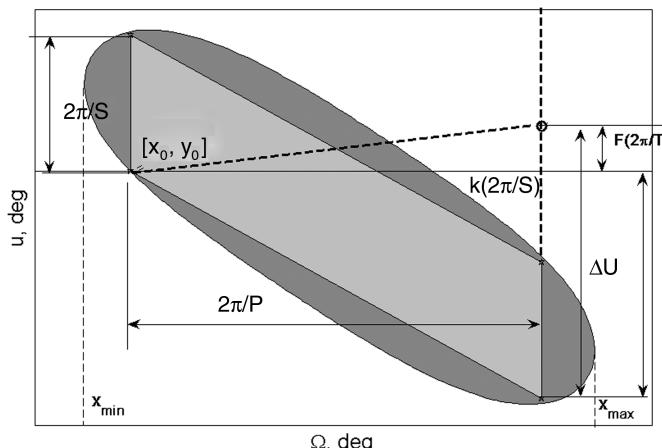  
Fig. 6 Geometry of optimal grid.

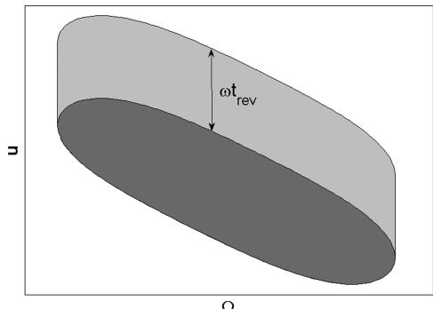  
Fig. 7 Polygon for discontinuous coverage.

In the case of discontinuous coverage, the polygon should be expanded along the y axis at an angle of $\omega t _ { \mathrm { R E V } } .$ , as it shown in Fig. 7 , where $t _ { \mathrm { R E V } }$ is the maximum revisit time.

There are some comments about computational aspects. The aforementioned algorithm is well suited for a simple connected convex polygon. Development of a unifying algorithm for the nonconvex cases is difficult because it should consider the shape o the polygon. Perhaps, special algorithms for each shape class are necessary. We use an algorithm in which the parallelogram is presented by a set of boundary points, not only including corner points. Suppose that a parallelogram point coinciding with a polygon boundary point may also be not only corner points. For this case, computational capacity will be substantially increased. Other difficulties are related with an application of the method for multiple connected polygons. As an example, even in the case of simple coverage of a point at latitude j for i  j’j, there are ascending and descending passes near the point, and, respectively, there are two coverage polygons (see example in Fig. 2 for $j = 0 )$ . Perhaps an exception is the double connected polygon with the same parts and double coverage. In a sense, it is equivalent to the single coverage and can be considered only one part of the polygon.

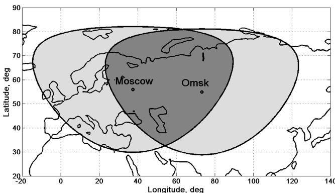  
Fig. 8 Coverage circles for Moscow and Omsk for $\pmb { h } = \pmb { 1 4 0 0 }$ km.

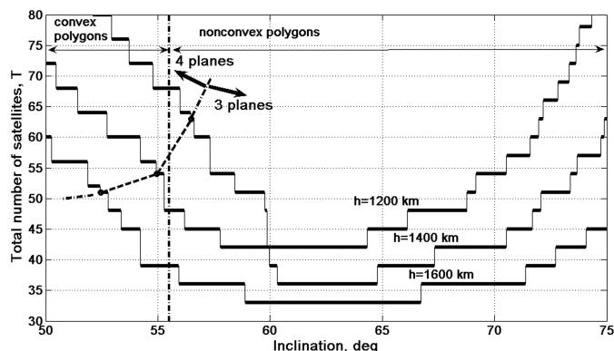  
Fig. 9 Solutions for communication network between Moscow and Omsk ("  10 deg).

As far as we consider a geometric problem in a two-dimensiona space, there are wide possibilities for their computer visualization and interactive algorithm development.

A typical solution requires less that 2 5 min of computation time using a MATLAB implementation on a Pentium IV processor.

The method could not be applied to a nonsymmetric satellite constellation, as an example, to a near-polar constellation such as that shown in Fig. 5b. For the examined solutions, we use only the geometric presentation as uniform grids with the same cells as parallelograms. Perhaps other types of geometric presentations can be applied to nonsymmetric constellation design. A study of this problem will be very useful.

It should be noted that the coverage function and corresponding polygon may be treated as a target function for satellite constellations. In the general case, the target function can be associated with not only the coverage function but also with other kinds of requirements for satellite constellations.

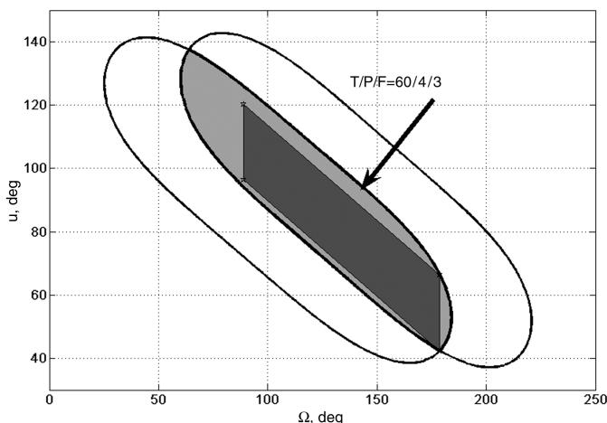  
Fig. 10 Example for convex polygon $\mathbf { \mathit { ( h = 1 4 0 0 } }$ km, $i = 5 0$ deg, $\varepsilon = 1 0$ deg).

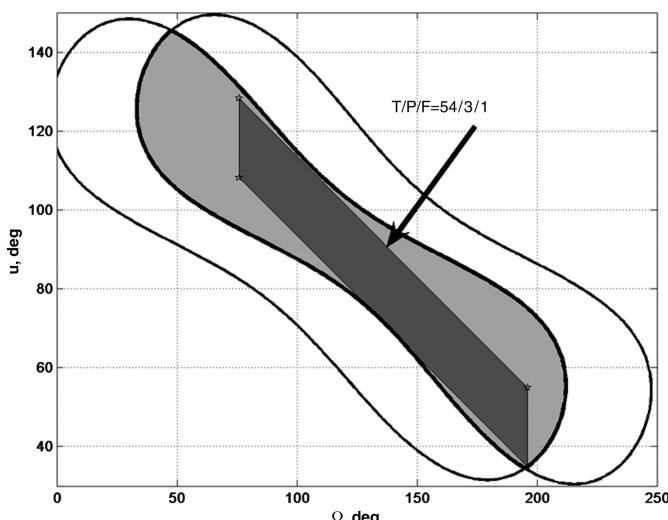  
Fig. 11 Example for nonconvex polygon $\mathbf { \mathit { ( 1 1 ) } = 1 4 0 0 }$ km, $i = 7 4$ deg, "  10 deg).

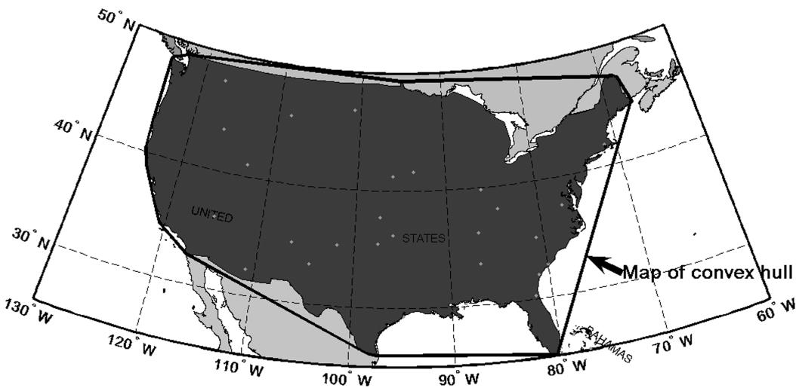  
Fig. 12 Convex hull for the United States.

## III. Examples of Continuous Coverage Problems

## A. Simplest Space Communication Network

As the first example, consider a communication network using the satellites as relays between two ground stations or users. At any time, the link between these stations is possible if they belong to the access area of a satellite from the constellation. Suppose that the stations are located in the Russian cities Moscow and Omsk. We consider possible constellations for an inclination range of $i = 5 0 – 7 5$ deg and three different orbit altitudes $h = 1 2 0 0 \mathrm { . }$ , 1400, and 1600 km. The coverage circles for the stations are overlapping and their geographical presentation is shown in Fig. 8.

The optimization results are shown in Fig. 9. Note that most of the solutions corresponded to constellations with three orbital planes. For $; < \sim 5 6$ deg, the coverage maps are convex polygons.

As inclination increases, the coverage polygons grow in size and the total number of satellites is decreased. Further, for each orbit altitude, there is an optimal inclination range. After that, the total number of satellites is increased. It is a superposition of two effects. First, it is an extension of the polygons (mainly along the x axis), and second, it is the influence of nonconvexity. The effects can be seen from examples for convex and nonconvex polygons which are given in Figs. 10 and 11, respectively.

## B. Continuous Coverage of the United States

As an application example of full region coverage, we consider a constellation for continuous coverage of the United States (without Alaska, Hawaii, and other islands; see Fig. 12). This implies that, at any time, there is at least one satellite from the constellation with the instantaneous access area involving the full region. Or in other words, at any time, at least one satellite is visible from all of the points in the United States. In such case, the coverage function can be computed based on a convex hull for a set of boundary points. The convex hull is the smallest convex set that contains the points (see Fig. 12).

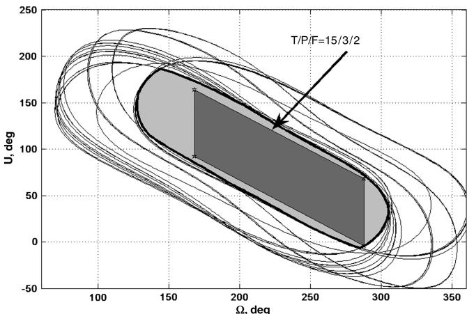  
Fig. 13 Solution for the United States.

Consider orbital elements near the ICO constellation orbit [21]: $h = 1 0 3 0 0$ km and $i = 4 5$ deg. The maps for visibility circles of the points and their intersection are shown in Fig. 13. The corresponding satellite constellation i $T / P / F = 1 5 / 3 / 2 .$

Numerical simulation shows that, for the orbit, the maximum possible access time with the full region is 93 min (for $\varepsilon = 1 0 \deg )$ . Statistical parameters of this constellation s coverage are given in Table 1.

## IV. Examples of Discontinuous Coverage Problem

## A. Discontinuous Coverage of Regions

To illustrate discontinuous complex coverage, we consider a satellite constellation for observation of a region near the equatorial plane (a spherical rectangle with boundary coordinates in geographic latitudes $- 1 0 , \ldots , - 3 0$ deg and longitudes $- 8 0 , \ldots , - 1 0 0$ deg). Coverage requirements are discontinuous coverage of an arbitrary part for the region with a revisit time no less than 40 min. Such constellations can be used for remote sensing or weather observations. The satellites are assumed in a circular orbit with 28 deg inclination and 1000 km altitude. The union of visibility circle maps for points of the region is presented in Fig. 14. This polygon corresponds to the continuous partial coverage of the region. The extension of the polygon for discontinuous coverage and a geometrical representation of the optimal solution are shown in Fig. 15. For comparison, simulation results for complex coverage and simple coverage of boundary points of the region are listed in Table 2. We remark that these results can be applied to all of the similar regions (i.e., with the same latitude bands in both hemispheres of the Earth and the same range in relative longitude).

Table 1 Simulation results for the United States

<table><tr><td rowspan="2">Multiplicity of coverage</td><td rowspan="2">Percentage, %</td><td colspan="2">Access time, min</td></tr><tr><td>Average</td><td>Maximum</td></tr><tr><td>1</td><td>33</td><td>24.8</td><td>86.2</td></tr><tr><td>2</td><td>65</td><td>30.5</td><td>73.0</td></tr><tr><td>3</td><td>2</td><td>2.2</td><td>4.9</td></tr></table>

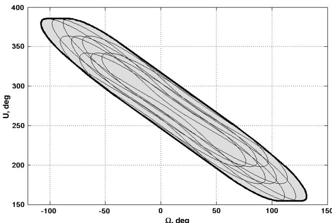  
Fig. 14 Polygon for partial region coverage.

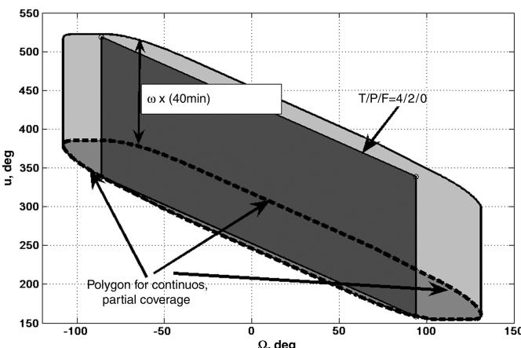  
Fig. 15 Solution for discontinuous coverage.

## B. Quick Analysis of Two-Satellite Constellation

In the last example, we return to a simple coverage problem and examine an inverse problem, i.e., perform coverage analysis for a specified constellation. Consider a two-satellite constellation $( T / P / F = 2 / 2 / 1 , h = 7 2 0$ km, and $i = 5 1 . 6 \deg , \varepsilon = 5$ deg) and discontinuous coverage for the points with the same latitude of 30 deg. The corresponding maps of the coverage circles for three orbital periods are shown in Fig. 16. It is clear that minimum and maximum revisit times are near to one-half and two orbital periods, respectively. The orbit with 14.517 revolutions per day is a not a ground-repeating orbit. The precession of the right ascension of the ascending node is 4:25 deg =day. The visibility map, such as in Fig. 16, depends only on the relative angle between the point longitude and right ascension of the ascending node. The variations of these parameters are independent. Therefore, for a long-term interval, we can assume that probability distribution of this relative angle is uniform. Then, revisit time probabilities will be in proportion to the ranges of corresponding revisit times. This implies that the most probable revisit time is nearly one orbital period (see dashed rectangles in Fig. 16). Long-term numerical simulation of the constellation validated the qualitative result and the probability of this revisit time is 89%.

Table 2 Revisit times for discontinuous coverage

<table><tr><td rowspan="2">Coverage</td><td colspan="3">Revisit time, min</td></tr><tr><td>Minimum</td><td>Average</td><td>Maximum</td></tr><tr><td>Region</td><td>35.6</td><td>36.1</td><td>36.7</td></tr><tr><td>Point at φ = 10 deg</td><td>43.4</td><td>43.5</td><td>47.0</td></tr><tr><td>Point at φ = 30 deg</td><td>42.7</td><td>43.4</td><td>44.3</td></tr></table>

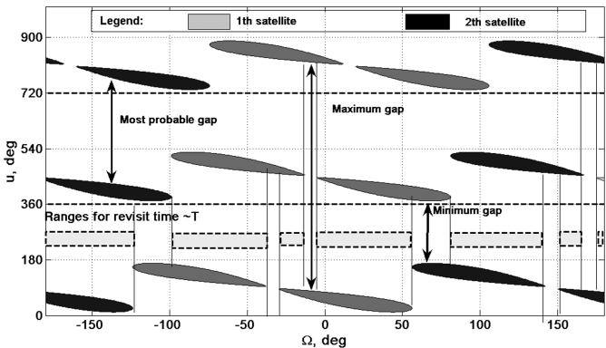  
Fig. 16 Maps for two-satellite constellation

## V. Conclusions

The purpose of this paper is to present a new satellite constellation design method for circular orbits and demonstrate the beneficial features of this approach. The key idea of the method is to use the two-dimensional space and combined maps for the satellite constellation and coverage functions. This method is attractive fo several reasons. First, it is probably the simplest and most obvious representation of satellite constellation motion in space. Second, there is the possibility of use for more complex coverage associated with full or partial coverage of a geographic region. That is, at any time, the region is completely or partially located within the instantaneous access area of a satellite from the constellation. Third, the method can be applicable not only for continuous coverage but for discontinuous cases. Note that there are also some application difficulties if the maps of the coverage functions are nonconvex and or multiple connected polygons. In future work, an application possibility of the two-dimensional maps for nonsymmetric satellite constellation design needs to be investigated. We believe that the method can be used for other applications in which a target function for a satellite constellation will be considered instead of the coverage function.

## Acknowledgment

The author thanks Jeff Samella of Boeing, Seattle, Washington, for his help in preparation of the paper.

## References

[1] Vargo, L. G., Orbital Patterns for Satellite Systems, Journal of the Astronautical Sciences, Vol. 7, No. 4, 1960, pp. 78 86.

[2] Walker, J. G., Some Circular Orbit Patterns Providing Continuous Whole Earth Coverage, Journal of the British Interplanetary Society, Vol. 24, July 1971, pp. 369 384.

[3] Mozhaev, G. V., Problem of Continuous Earth Coverage and Kinematically Regular Satellite Networks: 1, 2,” Kosmicheskie Issledovaniia, Vol. 10, No. 6, 1972, pp. 833 840; also Vol. 11, No. 1, 1973, pp. 59 69 (in Russian, English translation in Cosmic Research).

[4] Winn B. C., and Mennemeyer, P., Coverage Obtained by Controlled Satellite Constellations for Regional Communications, Journal of Spacecraft and Rockets, Vol. 9, No. 2, 1972, pp. 92 95.

[5] Rider, L., Optimized Polar Orbit Constellations for Redundant Earth Coverage, Journal of the Astronautical Sciences, Vol. 33, No. 2, 1985, pp. 147 161.

[6] Rider, L., Analytic Design of Satellite Constellations for Zonal Earth Journal of the Astronautica Sciences, Vol. 34, No. 1, 1986, pp. 31 64.

[7] Adams, W. S., and Rider, L., Circular Polar Constellations Providing Continuous Single or Multiple Coverage Above a Specified Latitude, Journal of the Astronautical Sciences, Vol. 35, No. 2, 1987, pp. 155 192.

[8] Hanson, J. M., and Linden, A. N., Improved Low-Altitude Constellation Design Methods, Journal of Guidance, Control, and Dynamics, Vol. 12, No. 2, 1989, pp. 228 236.

[9] Mozhaev, G. V., Synthesis of Satellite Network Orbital Structure (Group Theory Approach), Mashinostroenie, Moscow, 1989, Chaps. 1 5 (in Russian).

[10] Lang, T. J., Optimal Low Earth Orbit Constellations for Continuous Global Coverage, Astrodynamics, Vol. 85, Advances in the Astronautical Sciences, Pt. 2, 1993, pp. 1199 1216; see also American Astronautical Society Paper 1993-597, 1993.

[11] Lang T. J., and Adams, W. S., Comparison of Satellite Constellations for Continuous Global Coverage, IAF Workshop on Mission Design and Implementation of Satellite Constellations, International Astronautical Federation Paper 97-D4, 1997, pp. 1 9.

[12] Ulybyshev, Y., Near-Polar Satellite Constellations for Continuous Global Coverage, Journal of Spacecraft and Rockets, Vol. 36, No. 1, 1999, pp. 92 99.

[13] Hanson, J. M., Evans, M. J., and Turner, R. E., Designing Good Partial Coverage Satellite Constellations, Journal of the Astronautical Sciences, Vol. 40, No. 2, 1992, pp. 215 239.

[14] George, E., Optimization of Satellite Constellations for Discontinuous Global Coverage via Genetic Algorithms, Astrodynamics, Vol. 97, Advances in the Astronautical Sciences, Pt. 1, 1997, pp. 333 346; see also American Astronautical Society Paper 97-621, 1997.

[15] Williams, E. A., Crossley, W. A., and Lang, T. J., Average and Maximum Revisit Time Trade Studies for Satellite Constellations Using a Multiobjective Genetic Algorithm, Spaceflight Mechanics, Vol. 105, Advances in the Astronautical Sciences, Pt. 1, 2000, pp. 653 666; see also American Astronautical Society Paper 00-139, 2000.

[16] Lang, T. J., Parametric Examination of Satellite Constellations to Minimize Revisit Time for Low Earth Orbits Using a Genetic Algorithm, Astrodynamics, Vol. 109, Advances in the Astronautica

Sciences, Pt. 1, 2001, pp. 625 640; see also American Astronautica Society Paper 01-345, 2001.

[17] Lang, T. J., Walker Constellations to Minimize Revisit Time in Low Earth Orbit, Spaceflight Mechanics, Vol. 114, Advances in the Astronautical Sciences, Pt. 1, 2003, pp. 427 442; see also American Astronautical Society Paper 03-178, 2003.

[18] Ferringer, M. P., and Spencer, D. B., Satellite Constellation Design Trade-Offs Using Multiple-Objective Evolutionary Computation, Journal of Spacecraft and Rockets, Vol. 43, No. 6, 2006, pp. 1404 1411. doi:10.2514/1.18788

[19] Ulybyshev, Y., Geometric Analysis of Low Earth Orbit Satellite Communication Systems: Covering Functions, Journal of Spacecraf and Rockets, Vol. 37, No. 3, 2000, pp. 385 391.

[20] Berg, M., Kreveld, M., Overmars, M., and Schwarzkopf, O., Computational Geometry: Algorithms and Applications, 2nd ed., Spinger Verlag, New York, 2000, Chaps. 1 3, p. 367.

[21] Ghedia, L., Smith, K., and Titzer, G., Satellite PCN: the ICO System, International Journal of Satellite Communications, Vol. 17, No. 4, 1999, pp. 273 289. doi:10.1002/(SICI)1099-1247(199907/08)17:4<273::AID SAT621>3.0.CO;2-2

C. McLaughlin Associate Editor