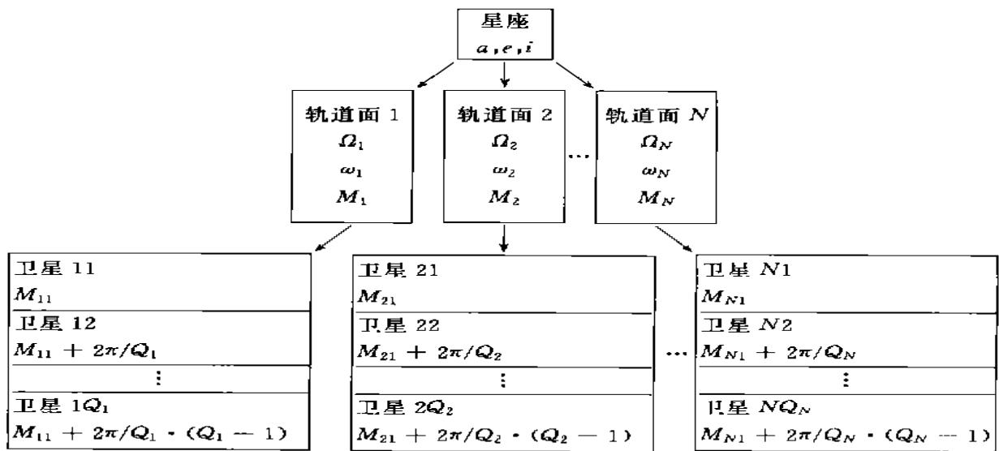
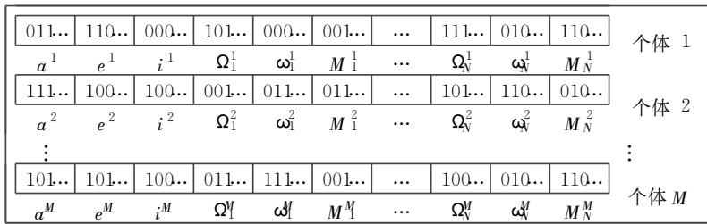
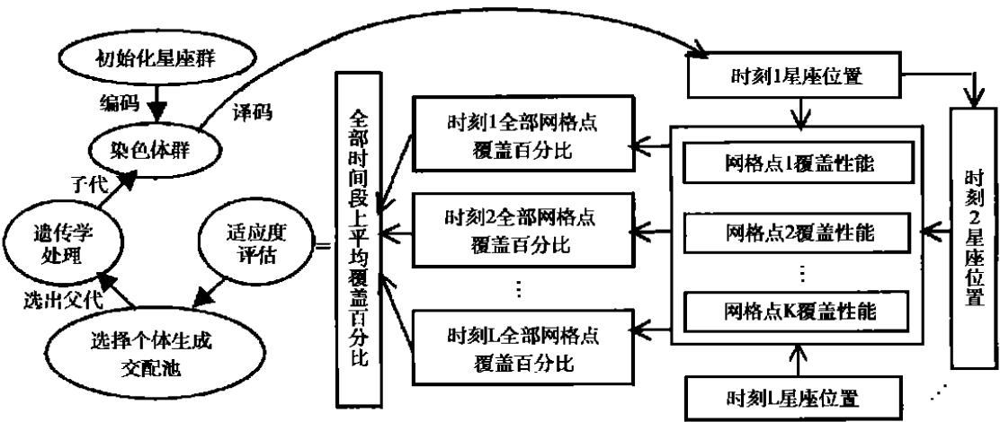
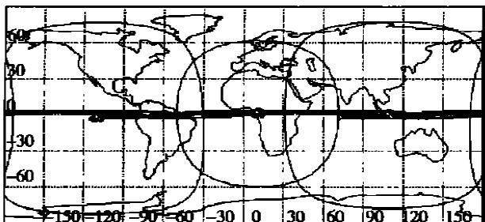
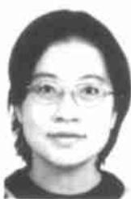

# 采用遗传算法进行区域覆盖卫星星座优化设计

王 瑞1，马兴瑞2，李 明1

.中国空间技术研究院，北京 ；.中国航天科技集团公司，北京

摘 要： 区域覆盖星座的研究具有很大的现实意义。 本文建立了一种比较通用的区域覆盖星座模型，将遗传算法用于该模型，建立了一整套区域覆盖星座的优化设计办法，算例表明了该算法的有效性。 这种优化设计法具有一定的理论和实用意义。

关键词： 卫星星座；优化；遗传算法

中图分类号： .

文献标识码：

文章编号： 1000-1328（ 2002） 03-0024-05

# Optimization of regional coverage satellite constellations by genetic algorithm

WANG Rui, MA Xing rui, LI M ing（ 1.Chinese A cademy of Space T echnology，Beijing 100086；2. ， 100830）

Abstract： T he research on regional coverage satellite constellations has much meaning．A general model of satellite constellations for regional coverage was established in this paper· The Genetic Algorithm was used to give the optimization results of regional coverage constellations．A practical method w as given．In this method，the bina- ry string was used to code the parameters of the constellation· There are many objective functions to choose, one of w hich, the coverage percentage, was used in this paper· The statistic of the objective function w as got from the grid points located in the region of interest· The analytic methods including different kinds of perturbation can be used to propagate the orbit ．For general use，the consideration of J2effect is enough．T he simulation results demon- strate the effect of the method

Key words: Satellite constellation; Optimization; Genetic algorithm

## 0 引言

星座设计是一个陈旧而崭新的问题。从 年． 提出位于静止轨道的三星组网开始，半个世纪以来，人们提出了各种各样的设计方法，并成功设计了数十个星座。对于全球或纬度带覆盖而言，Walker法和覆盖带法可以得到很好的结果，但对于区域覆盖，由于其多样性和灵活性，尚无比较通用的方法和结论。

遗传算法（ Genetic Algorithm，简称为 GA 法）也是一个陈旧而崭新的方法。遗传算法萌芽于 世纪 年代末 年代初， 和他的学生作了大量的工作［1］。遗传算法是受自然界生物由简单、低级到复杂、高级的进化过程的启迪，采用优胜劣汰、适者生存的原理，推演出的一套办法。它在优化领域得到了广泛的应用。

近年来，遗传算法被引入星座设计领域。［2］等人发现， 法在设计一种区域性美国及其临近地区和欧洲 非连续覆盖的数据收集服务系统及优化 系统时非常有效。 ．采用 法对间断全球覆盖星座进行了优化，他以 、 、 颗星为基础作了一些仿真，并将结果与 星座进行了比较［3］。

发射区域覆盖星座对中国具有很重要的意义这个领域有很大的实际需求，但所作的工作却远远不够。 作者在前人研究的基础上，作了大量的工作，建立了一整套实用的采用遗传算法进行区域覆盖星座优化设计的方法。

## 1 3＋4N 区域覆盖星座模型

对全球或纬度带覆盖来说， 类星座是目前使用最多的星座，其特点是：所有卫星采用高度相同、倾角相同的圆轨道；轨道平面沿赤道均匀分布；

只要它们共同完成某一特定的任务就可以认为是一个星座，但从实际应用的角度考虑，星座应具有一个稳定的构型以完成特定的任务，另外也应考虑一箭多星的发射方式，使布置易于进行。从设计的角度考虑，星座也应具有一定的通用性。因此考虑下列构造方式：星座中所有卫星的半长轴，倾角及偏心率都相同，不同轨道面的升交点赤经择优布置，不同轨道面内卫星数量可以不同，同一轨道面内卫星的近地点幅角相同，卫星平近点角均匀分布。 星座模型如图所示。

该星座模型作了一定的简化，但又具有较好的

  
图1 卫星星座模型

卫星在轨道平面内均匀分布；不同轨道面之间卫星的相位存在一定关系。 类星座概念明确、方法成熟、实用性好。区域覆盖的星座也具有很大的意义，值得好好研究。 首先，很多国家都需要建立自己国内应用的卫星星座，用于通信，导航，环境监测等等，建立全球覆盖的星座或者没有能力或者没有必要；其次，在地球上总是有一些地方是人们特别关注的，比如发生了战争、大的自然灾害的地区，区域覆盖星座的灵活性，快速建立能力就显得很重要；第三，研究区域覆盖星座对星座概念本身的发展有一定的完善意义，而且它需要对轨道理论有一些更深入的认识，因而具有一定的理论价值。

对区域覆盖星座来说， 类星座可能不再是最优星座，因而需对星座重新建模。 从概念上来说，包含在一个星座内的卫星可以位于任何轨道上，通用性，是本文仿真的基础

设星座共有N 个轨道面，每个轨道面内的卫星数为 $Q _ { j } ( j = 1 , 2 \cdots , N )$ ，则星座中共有卫星数： T$= \sum _ { j = 1 } ^ { N } Q _ { j }$ 。卫星的轨道要素 初始时刻的平均轨道要素） 为：

$$
\left. \begin{array}{l} a [ j, k ] = a \\ e [ j, k ] = e \\ i [ j, k ] = i \\ \Omega [ j, k ] = \Omega_ {j} \\ \omega [ j, k ] = \omega_ {j} \\ M [ j, k ] = M _ {j} + 2 \pi / Q _ {j} \cdot (k - 1) \end{array} \right\} \quad (k = 1, 2 \dots , Q _ {j}) \tag {1}
$$

从优化的角度考虑，优化参数包括： $ { \mathrm { : } } a , e , i , \Omega , \varphi _ { \mathrm { : } }$ $M _ { j } , Q _ { j } ( \boldsymbol { j } = 1 , 2 \cdots , N )$ ，它包括 ＋ N 个参数，因此本文称该模型为星座 ＋ N 模型。

## 2 遗传算法在星座优化设计中的实现

## 2．1 星座群体编码

法根源于进化论和自然选择，可望在非传统型星座优化设计中发挥较大作用。 法用一组群 字符串 染色体 对某一给定问题的研究空间进行取样，每一组代表一种可能的解，然后处理最有望改进结果的染色体，不断优化它们所代表的解。法按四步循环工作： 生产染色体组； 对每一染色体进行评估； 选择最合适的染色体； 遗传学处理产生新的组。 这种循环反复进行直到最优解被

$$
\bullet = \frac {U _ {\max} - U _ {\min}}{2 - 1}\tag{4}
$$

考虑升交点赤经、近地点幅角、平近点角等角度的变化范围为 ～ 度，如果精确到 . 度，则据上式k 约为 ；而如果 k 为 ，要求半长轴精度为 .，则半长轴变化范围约为 $2 0 0 0 \mathrm { k m }$ ；一般情况下，半长轴可根据某种具体应用限定在更小的变化范围内，因而精度可以更高。 对于变化范围为 的偏心率，则精度可达 . 。 故本文中选取k 为 。

按上述方法对星座模型进行二进制编码后，生成的群体可图示为：

  
图 星座群体示意图

发现 或满足结束条件 。

简单遗传算法用二进制进行编码，选择染色体时以适应度值为标准按比例进行选择，其遗传学处理主要包括交叉算子和变异算子。 交叉是指按一定概率将选定的两个染色体在某个位置截断，然后互换前半部分或后半部分；变异是指按一定概率对选定的染色体的某个位进行 、 变换。

理论研究表明，按上述规则计算的遗传算法不能收敛至全局最优值，但只需作一变动：选择后保留当前最优值，这样的遗传算法最终能收敛至全局最优值［1］。

对应于星座设计，将每个参数先进行二进制编码得到子串，再把这些子串连成一个完整的染色体。假如子串的长度为 k，则该子串对应的无符号整数范围为［ ，k－ ］。 用u 来代表被编码的参数，设其参数的范围为［U ，U ］

编码：

$$
x = \frac {(u - U _ {\min}) (2 - 1)}{U _ {\max} - U _ {\min}}\tag{3}
$$

译码：

$$
u = \frac {U _ {\max} - U _ {\min}}{2 - 1} \cdot x + U _ {\min}\tag{3}
$$

其中 M 为群体尺寸，取值范围可选为 到 之间，一般而言，M 越大，越可能得到最优值，但计算时间会相应增加。

## 2．2 网格点统计法

由于区域覆盖问题的非对称性，解析方法求解其覆盖特性是很难的。 本文采用网格点统计法来解决这一问题。

首先给定一个感兴趣的区域，在该区域内取一些有代表性的点来分析覆盖特性。 最简单的办法是用最小经度、最大经度、最小纬度、最大纬度定义一个矩形，然后将该矩形等分为一个个小的网格，以网格点作为特征点进行分析。 为了使每个点更具代表性，也可使其表示的地表面积大致相等，因此可使纬度带上的网格点数与该纬度的余弦成正比。 如果对地表某些面积的重视程度不同，也可以给每个点不同的权值。为了使网格点的选择更具灵活性，也可以通过文件输入网格点值。

优化目标可以根据具体应用从很多参数中选择：比如覆盖百分比，最大覆盖间隙，平均覆盖间隙平均响应时间等。 这里以覆盖百分比为例来说明问题：设总的网格点数为K，仿真时间点数为L。 定义

$$
i _ {n} = \left\{ \begin{array}{l l} 1 & \text {星座对该点} n \text {重覆盖} \\ 0 & \text {星座对该点未达到} n \end{array} \right.\tag{5}
$$

in 星座对该点未达到 n 重覆盖 （ 5）0

n 重覆盖百分比

$$
p _ {n} = \left[ \sum_ {j = 1} ^ {L} \left(\sum_ {i = 1} ^ {K} i _ {n} / K\right) \right] / L
$$

## 2．3 轨道模型

（ 6）

求解卫星运动方程的方法主要有两种：特殊摄动法和一般摄动法。 特殊摄动法是一种数值积分的方法，运动方程形式更一般，理论上可以提供最准确的解 计算步长和舍入误差对其精度产生影响 。 一般摄动法是一种解析求解的方法，代表性的方法有三种： ， 和 。

一种合适的模型进行计算。 当然，对于初步设计，只考虑 J 项对升交点赤经和近地点辐角的影响就够了。

## 2．4 仿真实现

整个仿真过程如图 示。

仿真结束条件为：当群体中最优适应度值相同的个体超过一定比例时或达到最大迭代代数时结束计算。如果事先知道目标函数的最优值，也可以在达到该值时结束计算。

  
图 使用遗传算法进行星座优化仿真示意图

由于遗传算法需要在大范围内搜索寻优，速度较慢，采用数值法是不现实的。 故应考虑使用解析法。

法没有考虑摄动影响，模型过于简单。

法通过求解 - 方程而得出结果，考虑了 J 、J 及 ％的 J 项影响，没有奇点问题及初始化的困难。

Brouwer 法使用运动正则方程的 Delaunay 形式，利用 平均化方法，通过一系列正则变换求解方程。 正则方程本质上是拉格朗日运动方程，后来发展成 法。临界倾角附近有奇点问题，初始化较困难。但 法考虑的摄动影响较多，除地球非球形带谐项 J ～J 外，还考虑到大气阻力、第三体摄动。

法及 4法各有其优缺点， 4法被 NORAD（ North American Aerospace DefenseCommand） 使 用 了 超 过 30年，而 Goddard SpaceFlight Center 则致力于发展 Vinti 法。

使用遗传算法优化星座时可根据具体应用选择

## 3 算例分析

对区域覆盖星座来说，椭圆轨道比圆轨道更具代表性，故本算例选择椭圆轨道星座来说明问题。假设约束条件如下：

$$
\begin{array}{l} a _ {\min} = 1 5 0 0 0 \mathrm{km}, a _ {\max} = 2 7 0 0 0 \mathrm{km} \\ e _ {\min} = 0. 5, e _ {\max} = 0. 7 3 \\ i _ {\min} = 0 ^ {\circ}, i _ {\max} = 7 0 ^ {\circ} \end{array}\tag{7}
$$

希望该星座对中国及其周边地区覆盖性能好，故选择覆盖区范围为：

$$
\begin{array}{l} \lambda_ {\min} = 7 5 ^ {\circ}, \lambda_ {\max} = 1 3 5 ^ {\circ} \\ \Phi_ {\min} = 0 ^ {\circ}, \Phi_ {\max} = 5 5 ^ {\circ} \end{array}\tag{8}
$$

网格点数 大致与该纬度的余弦成正比，即

$$
n _ {\Phi} ^ {\infty} \cos (\Phi)\tag{9}
$$

本文计算了非常简单的三颗星一重覆盖的情况。对初步设计而言，只考虑J 项摄动就可以了。为使摄动影响有所体现，仿真时间选择为 天。 遗传算法中的群体尺寸为100最大迭代次数为100. 结果如表 及图 所示。在假设的约束条件下，三颗星很容易就达到 ％的覆盖 仿真过程中发现在第二代个体中就有 100％覆盖的星座出现） 。

对区域覆盖来说，大椭圆轨道的远地点应当在所关心的区域附近，所得出的结果正符合这一点。对三星星座来说，三星轮流经过覆盖区上空的远地点，从而实现了无缝覆盖。

表 星座内卫星轨道要素值

<table><tr><td>卫星</td><td>a(km)</td><td>e</td><td>i(°)</td><td>Ω(°)</td><td>ω(°)</td><td>M(°)</td></tr><tr><td>1</td><td>26454.9450</td><td>0.5102</td><td>3.11</td><td>173.36</td><td>31.65</td><td>320.17</td></tr><tr><td>2</td><td>26454.9450</td><td>0.5102</td><td>3.11</td><td>184.00</td><td>39.29</td><td>210.20</td></tr><tr><td>3</td><td>26454.9450</td><td>0.5102</td><td>3.11</td><td>290.20</td><td>131.78</td><td>246.42</td></tr></table>

  
图 星座 三颗星 十天地面轨迹及某时刻地面覆盖圆

需要说明的一点是，本文仿真所采用的地面仰角为 °，对于大椭圆轨道，在远地点附近，地面覆盖圆半径是很大的，因此满足覆盖条件的星座应该有很多。另外由于计算量很大 得到该结果在Ⅲ- 的微机上约需 小时 ，仿真时间长度尚不足以反映升交点赤经和近地点辐角的长期变化。本算例只是用作验证该算法的一个极简单的例子，要将该方法用于工程实践，尚需根据实际使用目的做更多的考虑 比如约束限制、覆盖重数、摄动影响等 。 作者目前正在做进一步工作。

## 4 结论

遗传算法在区域覆盖星座优化设计中会是一个极有力的工具，它使得星座设计具有极大的灵活性，可以按照自己的需要定义星座，可以对星座参数作不同的约束，可以加入不同的摄动影响，可以选择不同的目标函数进行优化等等。 这正好与区域覆盖星座的多样性特点一致。 使用遗传算法有望发现一些区域覆盖星座的共性，也有望找到一些更有实际使用价值的具体星座。

该算法最大的不足之处是所用计算时间较长。但随着计算机技术的发展及并行算法等技术的应用，它可以在相对较短的时间内得到所需要的结果，因此，仍然是很有价值的一种方法。遗传算法可以从理论上保证获得最优值，但获得最优值所需的时间却没法确定，尤其是目标函数最优值未知的情况下，只能保证结果是接近最优的。

## 参考文献：

［ ］ 陈国良，王煦法，庄镇泉，王东生编著．遗传算法及其应用．北京：人民邮电出版社，

［ 2］ Eric Frayssinhes，A lcatel Espace．Investigating N ew Satellite Constellation Geometries w ith Genetic A lgorithms，A IA A - 96-3636€P

［ ］ 曾国强等译．采用遗传算法的星座间断全球覆盖最优化．现代小卫星技术 五 ，

[ 4] Zbigniew Michalewicz. Genetic Algorithms + Data Structres ＝Evolution Progress．Springer，1996

［ 5］ ， ． -tial Mechanics: USA :AIAA, 1998

6] Richard S Hujsak· A Restricted Four Body Solution for Res - onating Satellites without Drag· Spacetrack Report No. 1, AD A 081263 1979

[ 7] M ax H Lane, Felix R Hoots· General Perturbations Theories Derived from the 1965L ane Drag T heory．Spacetrack Report No: 2 AD A 081264 1979

  
作者简介：王 瑞 -，女，博士研究生，专业为飞行器总体设计，主要研究方向为航天动力学。