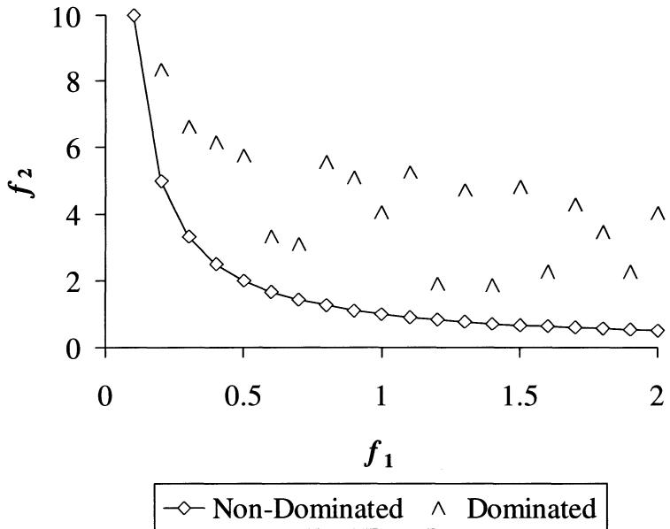
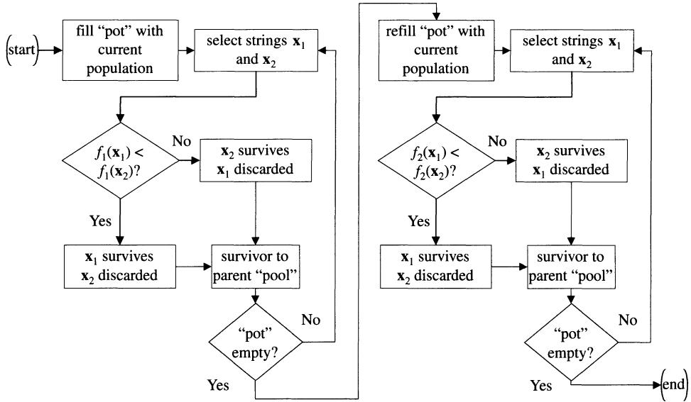
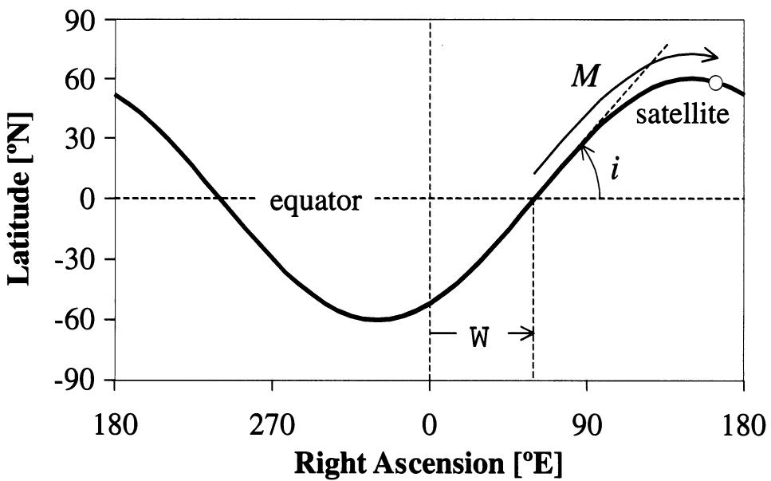
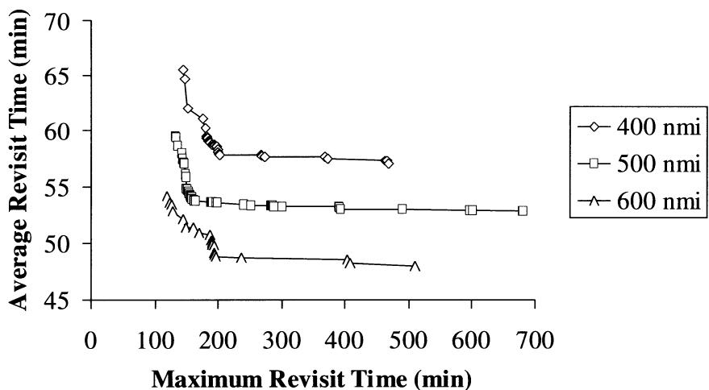
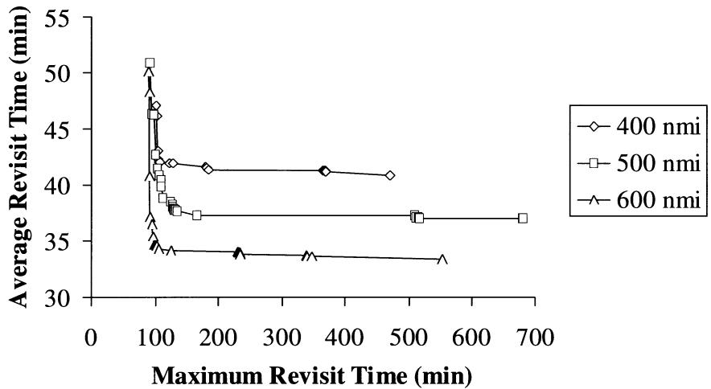
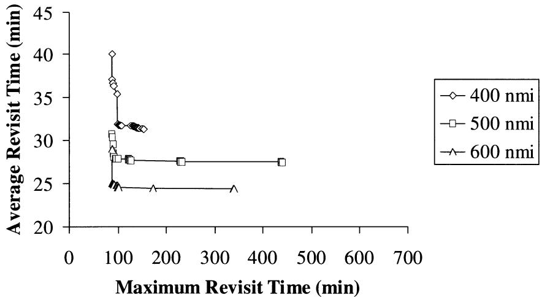
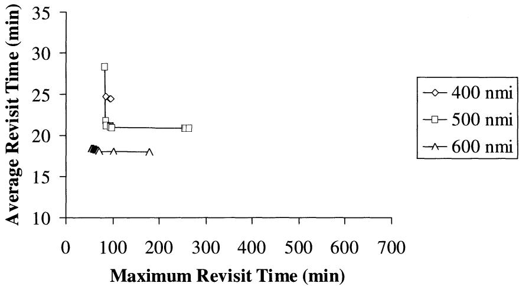
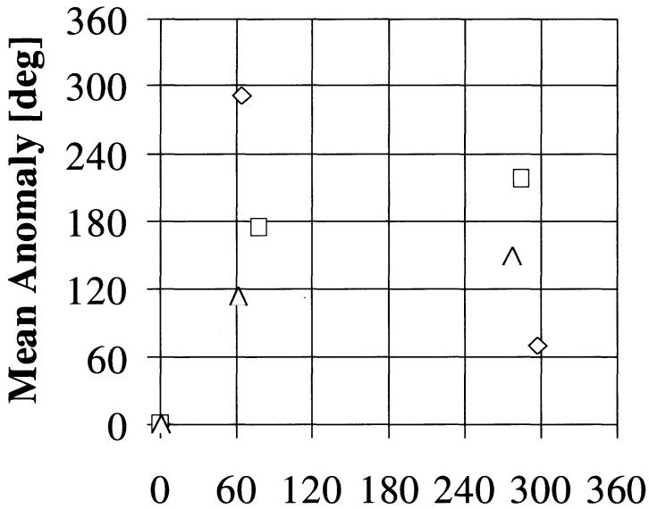
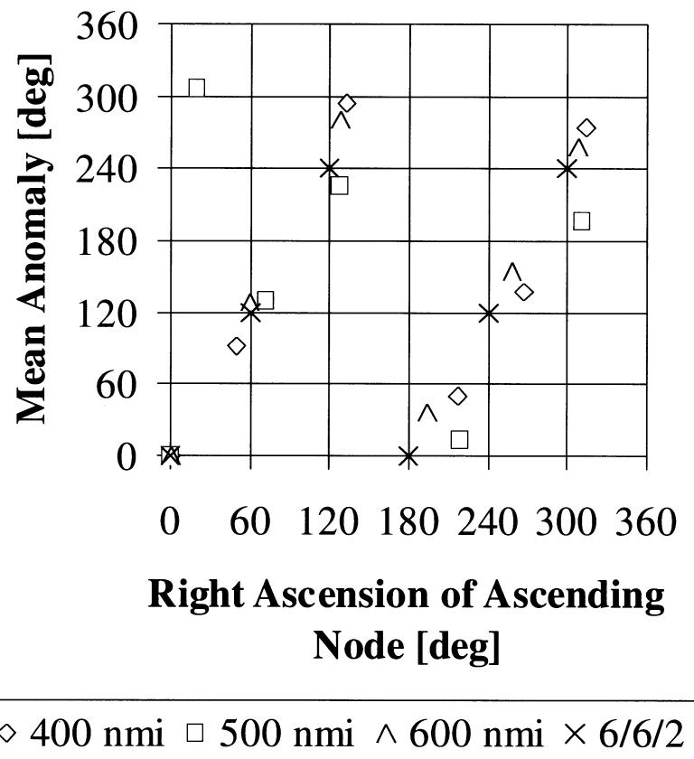

# Average and Maximum Revisit Time Trade Studies for Satellite Constellations Using a Multiobjective Genetic Algorithm

Edwin A. Williams, $^{1}$ William A. Crossley, $^{2}$ and Thomas J. Lang $^{3}$

## Abstract

Recently, versions of the Genetic Algorithm (GA) have successfully generated low-Earth orbit sparse coverage satellite constellations that appear to outperform traditionally developed constellations. The objective of these constellations was to minimize the maximum revisit time over a latitude band of interest. However, many constellation designers are also concerned with the average revisit time, and contrary to expectations, these two objectives often compete with each other. This paper presents a multiobjective GA approach to generate numerous constellation designs that show the trade-off between the revisit time objectives. These trade studies are conducted using a single run of the multiobjective GA. The designs generated using this approach are discussed and some trends are examined.

## Introduction

Revisit time is a metric used to evaluate satellite constellations that do not achieve continuous coverage of an area on the Earth's surface; these constellations are often called sparse coverage constellations. Revisit time is the time for which a given location on the Earth is not viewable by a satellite. For applications where sparse coverage is acceptable, it seems natural to design a constellation so that the longest time gap in coverage for any point on the Earth in the desired zone of latitudes is minimized. This is the approach pursued in most sparse coverage constellation design problems.

The sparse coverage constellation design problem can be posed as an optimization problem in which the objective is to minimize the maximum revisit time and the design variables are the constellation parameters (e.g. inclination, satellite right ascension, and mean anomaly). Researchers have successfully employed global optimization methods to generate satellite constellation designs for the single objective of maximum revisit time $[1,2]$ . Using this objective, the optimization routine concentrates on the coverage gaps that are the largest in duration and does not consider the average value of the revisit time. For this reason, it is not uncommon to find that by minimizing the maximum revisit time, the average revisit time has actually increased. Conversely, designing a constellation to minimize the average revisit time will reduce the revisit time for most points, but this may allow some locations to have large revisit times. Therefore, these two objectives (average and maximum revisit time) often compete with each other. For some applications, it may be possible to decide that either maximum revisit time or average revisit time is the appropriate objective. However, the design of sparse coverage constellations can also be posed as a multiobjective problem, in which both maximum revisit time and average revisit time are to be minimized. To find solutions to this problem, a version of the genetic algorithm was employed.

## Multiobjective Design Optimization

In multiobjective optimization, the goal is to minimize (or maximize) a vector-valued function, whose components are each of the objectives. There is seldom one optimal solution considering designs for several different goals or objectives; rather, a family of solutions exists. The solutions to the multiobjective problem are referred to as Pareto optimal designs $[3]$ . The Pareto optimal set is defined as the non-dominated designs in the design space. A design is non-dominated if no other solutions may be found that are superior in at least one objective and equal in all other objectives. In many multiobjective problems, including the sparse coverage constellation design problem examined in this paper, finding the set of Pareto optimal designs is desirable because the tradeoff among various objectives can be observed in this set.

A simple example is presented in Fig. 1. In this figure, the possible designs for a two-objective optimization problem are plotted based upon their performance in the two objectives, $f_{1}$ and $f_{2}$ . For this example, the non-dominated designs comprise the Pareto optimal set. The curve represented by these designs is often called the Pareto front. This curve illustrates the range of possible tradeoffs between $f_{1}$ and $f_{2}$ .

## The Genetic Algorithm

The Genetic Algorithm (GA) is a computational representation of Darwinian natural selection that has been adopted for search and optimization by making the analogy that an individual that is “more fit” to its environment is similar to a “more optimal” design $[4]$ . Genetic algorithms have been gaining recognition as solution techniques for many complex optimization problems and have been applied to numerous engineering design problems, including satellite constellation design problems $[1, 2, 5, 6]$ .

A GA is not truly an optimization technique; it is a computational representation of natural selection observed in biological populations. This mimicry of evolution includes representing many designs as individuals in a population. In a GA, the fittest individuals (designs that better meet the requirements) are more likely to survive. Surviving individuals mate and produce offspring, and these offspring inherit design features from their parents. In this process, features of good designs (the surviving parents) are combined to generate new designs (the offspring). If these new combinations are better designs, they will then be more likely to survive and pass on their design features to future generations. This repeated combination of good features leads towards better designs. When performed by a human designer, this is considered innovative or creative.

  
FIG. 1. Example Function Space Illustrating Dominance and the Pareto Front.

Following the analogy to nature, a chromosome represents the features of a design. Each design parameter is assigned to a gene, and the genes combine to form the chromosome. Several schemes for coding the design parameters into a chromosome have been employed. For the work described in this paper, a binary-alphabet scheme was employed with Gray coding $[4]$ . Using the chromosomes, rather than the parameters, to describe designs allows for mixed discrete, integer and continuous optimization problems to be solved by the GA. With the binary chromosomes used in these efforts, all variables were actually discretized. Upper and lower bounds are applied to continuous design variables along with the number of bits that represent these variables. The number of bits determines the resolution between values of these continuous variables, so a fine resolution can be obtained with longer string lengths.

A randomly generated population of designs provides the starting point for a GA's search. This precludes the need for an initial design point. Further, the GA performs its search by first determining which designs survive and then combining traits or features of those designs. No derivative or other calculus-based information is needed. Because of these features, the GA can work as a global optimization routine for non-convex, multimodal and/or discontinuous functions. It will avoid local minima and can discover areas of the design space that might have been overlooked. Additional details about genetic algorithms can be found in several textbooks, like reference [4].

Among its many features, the GA uses a population of points to conduct its search. Because the GA is evaluating an entire population each generation, this provides the opportunity to generate a set of non-dominated individuals in one run of the algorithm. Reference $[7]$ provides discussion and presents results of an effort to determine optimal solutions to a multiobjective problem in a single run of a GA using the “two-branch tournament” operator. This approach was utilized to address the multiobjective satellite constellation problems described in this paper.

## Traditional Sparse Coverage Constellation Design

It is common to select constellations for discontinuous coverage from the well-known Walker constellations. The Walker constellations were originally developed for continuous global coverage $[8]$ , but the T/P/F (T = total number of satellites, P = number of planes, F = inter-plane phasing parameter) three-parameter approach can be used to describe constellations for any given number of satellites. Using a number of satellites smaller than that required for continuous global coverage, the best “maximum revisit time” constellation is the Walker arrangement with optimized inclination that yields the shortest time gap in coverage for a specified satellite altitude and coverage circle size.

Searching through the Walker constellations to find the appropriate arrangement of satellites requires an enumerative approach. Given a desired number of satellites, T, there are a finite number of orbital planes, P, and phasing parameters, F, that describe the various Walker constellations. The inclination of the constellation's orbits has an infinite number of possible values ranging from $0^{\circ}$ to $180^{\circ}$ . For each Walker arrangement, a search is conducted to find the common value of inclination that yields the lowest maximum revisit time. This process is repeated for each possible combination of P and F. When all of these evaluations are complete, the constellation having the lowest maximum revisit time is selected as the best design. A similar approach allows designers to find Walker constellations with the best average revisit time.

This approach limits the designer to either a constellation with a good maximum revisit time or a good average revisit time. No compromise constellations can be discovered using this method. Use of Walker constellations further limits the designs to be symmetric arrangements of satellites. It has been shown that these limitations often do not result in optimal constellations $[1, 2]$ , especially if the revisit times exceed an orbital period.

## Solution Methods and Procedure

Previous work has indicated that zero-order optimization methods are needed for this type of satellite constellation design problem (for example, references $[1\ and\ 2]$ ). The genetic algorithm is one method that has been used to find sparse coverage constellations that minimize the maximum revisit time. While other approaches find only one solution for each execution of an optimization computer program, the two-branch tournament version of the GA is able to find an array of solutions to the multiobjective problem in just one computer run $[7]$ . The GA is able to do this using its population-based search, through which the GA is able to look at multiple, independent designs at the same time.

## Multiobjective GA

The difference between the multiobjective GA and a single-objective GA is in the selection algorithm. When the multiobjective GA selects individuals as possible parents, a modified tournament selection method is used. On the first pass through the tournament selection, the first objective is used as the fitness, so all designs in the current population compete two at a time and the better of the two competitors survives to become a parent. On the second pass, all designs in the current population compete again, this time with the second objective as the fitness. Each generation, the Pareto set is tracked and updated as new non-dominated designs are found. Eventually, the GA will generate a representation of the Pareto front. A flowchart of this two-branch tournament is shown in Fig. 2.

For the constellation problems addressed here, the GA uses a binary alphabet with Gray coding to develop the chromosomes that represent each individual design. This approach generally makes it easier for the GA to find “optimal” solutions for problems with many continuous design variables. The GA also uses uniform crossover. It has been shown that uniform crossover leads to more exploration of the design space. The mutation rate and population size are based upon empirical guidelines $[9]$ .

## Problem Statements

To investigate the utility of the multiobjective approach for satellite constellation design, multiple cases will be investigated. In this study, four different numbers of satellites were used: three, four, five, and six. The constellations were designed for coverage of the entire globe. Each of these constellations uses circular orbits at three altitudes, 400 nmi (741 km), 500 nmi (926 km), and 600 nmi (1,111 km). These low-Earth orbit altitudes are in the range where non-gradient-based optimization approaches provided constellations with shorter maximum revisit times than constellations designed using the Walker approach [1]. Each satellite is assumed to have a zero degree elevation angle, which helps defines its coverage.

The first design variable used to describe the constellation was the orbital inclination, i, which is allowed to vary between 0 and 180 degrees; this was assumed to be common for all constellation orbits. The first satellite variable was the right ascension of ascending node, $\Omega$ , which varied from 0 to 360 degrees; this denotes the right ascension location where the northbound orbit crosses the equator. For bookkeeping, the first satellite was assigned a fixed $\Omega$ of $0^{\circ}$ . The second satellite variable was the mean anomaly, M, which also varied between 0 and 360 degrees. This represents the angular distance in the orbit that the satellite has traveled since crossing the equator in the northbound direction. As with $\Omega$ of the first satellite, M of the first satellite was also assigned a fixed value of $0^{\circ}$ . A constellation of N satellites will have 2N-1 variables. Constellation design variables for one satellite orbit are presented in Fig. 3.

  
FIG. 2. Two-Branch Tournament Flow-Chart.

To create the chromosomes used by the genetic algorithm, each of the design variables was encoded into a binary string. With defined upper and lower bounds for each variable and a number of bits used to represent each variable, the resolution between the discrete values of each variable is readily determined. For the constellation problems, the inclination ranges from $0^{\circ}$ to $180^{\circ}$ with a resolution of $1.418^{\circ}$ using seven bits. The mean anomaly and right ascension of each satellite can vary from $0^{\circ}$ to $360^{\circ}$ , and each of these variables has a resolution of $1.412^{\circ}$ using eight bits. This encoding scheme for the three-satellite case is shown in Table 1.

Because the problem statement uses 2N-1 variables, where N is the number of satellites, increasing the number of satellites uses more variables, and longer chromosomes are needed. The three-satellite case has a chromosome length of 39 bits $(7 + 4 \times 8)$ ; using the guidelines of reference [9], this case has a population size of 156 members $(4 \times \text{chromosome length})$ and a mutation rate of 0.3287%. The GA parameters for all four different constellation sizes are shown in Table 2.

## Coverage Analysis

The fitness functions for each individual are determined by computing the maximum and average values of the revisit time for the constellation represented by the individual's chromosome. Because the genetic algorithm will require a very large number of coverage analyses during one run, considerations of computational efficiency and accuracy are important. Based on the description of a constellation, ephemeris tables are computed using equations for two-body motion for a period of orbit propagation using discrete time steps. The effects of Earth oblateness are considered by including the $J_{2}$ effects on the orbits at each time step.

  
FIG. 3. Constellation Design Variables (Shown for One Satellite Orbit).

TABLE 1. Design Variables for Three-Satellite Problems

<table><tr><td>Variable</td><td>Lower Bound</td><td>Upper Bound</td><td>Number of Bits</td><td>Resolution</td></tr><tr><td>Inclination</td><td> $0^{\circ}$ </td><td> $180^{\circ}$ </td><td>7</td><td> $1.418^{\circ}$ </td></tr><tr><td>Right Ascension (sat #2)</td><td> $0^{\circ}$ </td><td> $360^{\circ}$ </td><td>8</td><td> $1.412^{\circ}$ </td></tr><tr><td>Mean Anomaly (sat #2)</td><td> $0^{\circ}$ </td><td> $360^{\circ}$ </td><td>8</td><td> $1.412^{\circ}$ </td></tr><tr><td>Right Ascension (sat #3)</td><td> $0^{\circ}$ </td><td> $360^{\circ}$ </td><td>8</td><td> $1.412^{\circ}$ </td></tr><tr><td>Mean Anomaly (sat #3)</td><td> $0^{\circ}$ </td><td> $360^{\circ}$ </td><td>8</td><td> $1.412^{\circ}$ </td></tr></table>

For each fitness evaluation, the coverage calculation routine takes small steps (one minute was used here) in time through a user specified period (one day was used here). At each time step, the routine determines if a point on the ground is “covered” or “not covered” by any satellite in the constellation at that instant of time by comparing the angle between the ground point and a satellite to each satellite’s Earth central angle. If no satellite covers the ground point, the routine begins to sum the number of successive time steps that the point remains uncovered by any satellite. This is performed for each of a set of ground points specified by a user to represent his/her region of interest on the Earth. The largest number of successive time steps for which any ground point remains uncovered throughout the orbit propagation period multiplied by the length of the discrete time step is the maximum revisit time (maximum duration spent uncovered) for the constellation. The average revisit time (average duration spent uncovered) for each ground point is the sum of all coverage gap lengths divided by the number of coverage gaps experienced by each ground point during the orbit propagation period. The average revisit time for the constellation is the average of the average revisit times over all of the ground points. The predicted coverage gap time values are limited to multiples of the discrete time step over the specified length of propagation. This contributes to the solution space’s behavior as piecewise continuous without meaningful derivatives, so gradient-based optimization methods cannot solve this problem.

To reduce the cost of computing the fitness function, it is sufficient to model global coverage area by selecting ground points over only a portion of the Earth. Because the orbits are circular, the coverage provided north and south of the equator will be the same. Thus, limiting the ground points to the Northern Hemisphere is adequate.

TABLE 2. Genetic Algorithm Parameters for All Satellite Cases

<table><tr><td>Number of Satellites</td><td>Number of Bits in Chromosome</td><td>Population Size</td><td>Mutation Rate</td></tr><tr><td>3</td><td>39</td><td>156</td><td>0.3287%</td></tr><tr><td>4</td><td>55</td><td>220</td><td>0.2314%</td></tr><tr><td>5</td><td>71</td><td>284</td><td>0.1785%</td></tr><tr><td>6</td><td>87</td><td>348</td><td>0.1453%</td></tr></table>

It is also possible to limit the longitude range for the ground points by determining the longitudinal distance that a circular orbit's ascending node will shift each orbit as the Earth rotates beneath the orbital plane and as the orbital plane regresses westward. For example, the ground track of a satellite in a 400 nmi (741 km) altitude circular orbit with an inclination of $60^{\circ}$ would shift by just over $25.2^{\circ}$ in longitude after one orbital period. Placing grid points spanning a longitude range of about $60^{\circ}$ would place two ground consecutive ground tracks within this wedge; using a wedge with a $90^{\circ}$ -longitude range would encompass three consecutive ground tracks. Including more than one consecutive ground track in the wedge keeps the coverage analysis from allowing a repeating ground track coverage pattern to be considered highly fit.

Related to this wedge size is the choice of orbit propagation time for the analysis. By propagating the orbit and making coverage calculations for a one day period, a satellite in the 400 nmi (741 km) altitude circular orbit would complete just under 14.5 orbits, and this satellite's ground track would shift $364^{\circ}$ . A satellite that provided coverage of ground points in the wedge at the start of the orbit propagation would again provide coverage in the wedge by the end of the orbit propagation period.

The last consideration is the placement of grid points within the wedge. In latitude, a range of $0^{\circ}$ to $90^{\circ}$ N was used with ground points spaced every $5^{\circ}$ . In terms of longitudinal placement, ground points should be denser near the equator and sparser near the poles, reflecting the larger amount of surface area near the equator in a given latitude range (e.g. at the equator, longitude lines are most distant from each other). This allows an unbiased measure of the average revisit time for the constellation. In the cases that follow, the ground points were spaced over $0^{\circ}$ to $90^{\circ}$ E longitude, starting with points $5^{\circ}$ apart on the equator. Farther north of the equator, points were spaced more than $5^{\circ}$ apart in longitude by varying the number of grid points with the cosine of the latitude. The number of points was always rounded up to the next integer value, and one point was placed at the pole. This spacing placed several grid points between each consecutive ground track.

The choices of finite time step, length of orbit propagation, coverage wedge size, and grid point placement were made in an attempt to balance the need for accurate coverage predictions with low computational effort. To assess this, numerous analysis runs were conducted with the strategy described above and then repeated using longitude ranges of 0 to 180° with 2° spacing and latitude ranges of 0 to 90° with 2° spacing. Calculations of both MRT and ART by the more computationally intensive analyses were between -0 and +1 minute different from the more coarse approach used with the genetic algorithm. This observed error corresponds to the discrete time step used in the calculations for the GA and suggests that the analysis is more than sufficient for this application.

## Results

The two-branch tournament GA was run once for each combination of number of satellites and orbital altitude using the corresponding population sizes and mutation rates described in Table 2, above. The constellations were designed for global area coverage. In each case, the GA was allowed to run for 200 generations. Non-dominated designs encountered during each run of the GA were collected, and these designs provide an approximation of the Pareto front that illustrates the maximum revisit time (MRT) versus average revisit time (ART) tradeoffs.

First, the multiobjective GA generated results for the three-satellite constellations at 400, 500 and 600 nmi altitudes (741, 926 and 1,111 km). The non-dominated solutions are plotted in Fig. 4 and are connected by a line to indicate the Pareto front for these particular constellations. For each altitude, only one run of the multiobjective genetic algorithm was used. These runs generated thirty-one different non-dominated constellation designs for the 400 nmi case, forty-five designs for the 500 nmi case, and twenty-one designs for the 600 nmi case. In each of these three-satellite cases, 31,200 function evaluations (coverage analyses) were needed to generate these trade studies.

The curves in Fig. 4 illustrate the tradeoff that exists between minimizing the maximum revisit time and minimizing the average revisit time. As an example, the best MRT constellation for the 400 nmi altitude case using three satellites (farthest to the left on the curve with hollow diamonds) has a maximum revisit time value of 144 minutes and an average revisit time of 65.58 minutes. The best ART constellation for the 400 nmi altitude (farthest to the bottom on the plot) has a MRT value of 467 minutes and an ART of 57.02 minutes. Comparable tradeoffs are evident for the other two altitudes.

Similarly, the GA was used to generate solutions for four-satellite constellations. Again, using one run for each altitude, the multiobjective GA found sixteen non-dominated constellation designs for the 400 nmi altitude, twenty-three designs for the 500 nmi altitude, and twenty-one designs for the 600 nmi altitude. These solutions and the associated tradeoffs are presented in Fig. 5. Each curve in Fig. 5 required 44,000 fitness evaluations.

Figure 6 presents solutions generated for five-satellite constellations. In these cases, twenty-nine non-dominated designs were identified for the 400 nmi altitude; twenty-four, for the 500 nmi altitude; and thirteen, for the 600 nmi altitude. These runs required 56,800 function evaluations.

Finally, the multiobjective GA provided trade studies for six-satellite constellations; these are presented in Fig. 7. Here, only three non-dominated constellation designs were identified for the 400 nmi case; ten, for the 500 nmi case; and sixteen, for the 600 nmi case. The GA used 69,600 fitness evaluations to generate each of these curves.

  
FIG. 4. Three-Satellite Constellation Trade Studies Between MRT and ART.

  
FIG. 5. Four-Satellite Constellation Trade Studies Between MRT and ART.

## Discussion

In each of the above cases, one data point has been left out. The best average revisit time contains a case in which the maximum revisit time is equal to the full simulation duration. This occurs when the inclination is set to a retrograde orbit in which the coverage cone never passes over the poles. In doing so, the GA sacrifices coverage of a few points on the globe to improve the average revisit time.

This effect is seen in the figures above, particularly for the 500 nmi altitude cases where maximum revisit times can become quite large. A few outlying ground points are given sporadic coverage, while the majority of points receive a low revisit time. However, the designer is usually interested in the region of compromise between the average revisit time and the maximum revisit time. Most figures above show a distinct “knee” in each curve for the three altitudes shown. The knee indicates the region of best compromise, and a constellation in this area may be the design point for many applications.

  
FIG. 6. Five-Satellite Constellation Trade Studies Between MRT and ART.

  
FIG. 7. Six-Satellite Constellation Trade Studies Between MRT and ART.

For three- and four-satellite constellations there is visible curvature to the trade-off between ART and MRT (see Fig. 4 and Fig. 5), but for five and six satellites the tradeoff curves have nearly a sharp corner (Fig. 6 and Fig. 7). The sharp corner of the tradeoff curve and the fewer number of points on the Pareto front indicate that less of a tradeoff between ART and MRT exists as the number of satellites increases. In fact, a constellation with a maximum revisit time of zero will have an average revisit time of zero; this condition would have one optimal constellation for both MRT and ART objectives.

Table 3 shows design parameters for constellations taken from near the knee in each of the curves generated using the multiobjective GA. Note that in all cases the optimal inclination is retrograde (higher than $90^{\circ}$ ), reflecting the fact that the satellite has a larger area coverage rate when it moves counter to the Earth's rotation.

Another important transition is taking place as the number of satellites is increased from three to six. Note that for three and four satellites, the geometry of the constellation is highly nonsymmetric. This can be seen by examining the distribution of the satellite right ascension of ascending nodes ( $\Omega$ ) for each constellation in Table 3. For three and four satellites, the $\Omega$ values are distributed over a range covering about 180 degrees. Figure 8 illustrates the three-satellite “compromise” constellations, with each satellite plotted using right ascension of ascending node as the x-axis and mean anomaly as the y-axis. For six satellites, the $\Omega$ values are distributed nearly symmetrically over the full 360 degrees. For five satellites, the behavior is somewhere between these two cases.

The nonsymmetric three- and four-satellite constellations generated by the multi-objective GA show significantly better ART and MRT values than the corresponding best symmetrical Walker constellations. The six-satellite GA constellations for

TABLE 3. GA Constellation Designs near the Knee in the ART vs. MRT Curves

<table><tr><td># of sats</td><td>Alt. [nmi]</td><td>MRT [min]</td><td>ART [min]</td><td>i [deg]</td><td> $\Omega_2$  [deg]</td><td> $M_2$  [deg]</td><td> $\Omega_3$  [deg]</td><td> $M_3$  [deg]</td><td> $\Omega_4$  [deg]</td><td> $M_4$  [deg]</td><td> $\Omega_5$  [deg]</td><td> $M_5$  [deg]</td><td> $\Omega_6$  [deg]</td><td> $M_6$  [deg]</td></tr><tr><td rowspan="3">3</td><td>400</td><td>189</td><td>58.75</td><td>110.55</td><td>63.53</td><td>290.82</td><td>296.47</td><td>70.59</td><td></td><td></td><td></td><td></td><td></td><td></td></tr><tr><td>500</td><td>158</td><td>54.08</td><td>116.22</td><td>77.65</td><td>175.06</td><td>285.18</td><td>218.82</td><td></td><td></td><td></td><td></td><td></td><td></td></tr><tr><td>600</td><td>148</td><td>51.42</td><td>114.80</td><td>60.71</td><td>114.35</td><td>276.71</td><td>149.65</td><td></td><td></td><td></td><td></td><td></td><td></td></tr><tr><td rowspan="3">4</td><td>400</td><td>122</td><td>41.98</td><td>109.13</td><td>56.47</td><td>313.41</td><td>272.47</td><td>52.24</td><td>312.00</td><td>124.24</td><td></td><td></td><td></td><td></td></tr><tr><td>500</td><td>113</td><td>38.81</td><td>117.64</td><td>48.00</td><td>134.12</td><td>244.24</td><td>152.47</td><td>299.29</td><td>265.41</td><td></td><td></td><td></td><td></td></tr><tr><td>600</td><td>102</td><td>34.55</td><td>119.06</td><td>53.65</td><td>313.41</td><td>117.18</td><td>183.53</td><td>296.47</td><td>122.82</td><td></td><td></td><td></td><td></td></tr><tr><td rowspan="3">5</td><td>400</td><td>99</td><td>31.87</td><td>117.64</td><td>74.82</td><td>255.53</td><td>208.94</td><td>105.88</td><td>275.29</td><td>241.41</td><td>319.06</td><td>55.06</td><td></td><td></td></tr><tr><td>500</td><td>95</td><td>27.86</td><td>119.06</td><td>46.59</td><td>317.65</td><td>105.88</td><td>162.35</td><td>259.76</td><td>67.76</td><td>324.71</td><td>193.41</td><td></td><td></td></tr><tr><td>600</td><td>92</td><td>24.89</td><td>120.47</td><td>60.71</td><td>125.65</td><td>125.65</td><td>336.00</td><td>152.47</td><td>282.35</td><td>275.29</td><td>227.29</td><td></td><td></td></tr><tr><td rowspan="3">6</td><td>400</td><td>93</td><td>24.50</td><td>119.06</td><td>49.41</td><td>91.76</td><td>132.71</td><td>295.06</td><td>216.00</td><td>50.82</td><td>266.82</td><td>136.94</td><td>313.41</td><td>273.88</td></tr><tr><td>500</td><td>86</td><td>21.20</td><td>119.06</td><td>19.76</td><td>307.76</td><td>72.00</td><td>129.88</td><td>127.06</td><td>225.88</td><td>218.82</td><td>14.12</td><td>310.59</td><td>196.24</td></tr><tr><td>600</td><td>64</td><td>18.28</td><td>121.89</td><td>59.29</td><td>128.47</td><td>127.06</td><td>280.94</td><td>193.41</td><td>36.71</td><td>256.94</td><td>155.29</td><td>307.76</td><td>258.35</td></tr></table>

  
Right Ascension of Ascending Node [deg]  
FIG. 8. Three-Satellite “Compromise” Constellations.

400 and 600 nmi altitudes are suggestive of a Walker 6/6/2 arrangement and offer very similar ART and MRT performance. It was verified that the 6/6/2 arrangement is the optimal Walker constellation for the 600 nmi case. While the six-satellite 500-nmi constellation in Table 3 is not very close to the Walker 6/6/2 arrangement, its MRT and ART performance are very similar to the 6/6/2 arrangement. The six-satellite compromise constellations and the Walker 6/6/2 appear in Fig. 9.

It appears that the GA has found new nonsymmetric constellations for very sparse coverage cases (three and four satellites) that could have not been found using traditional symmetric techniques. In the cases where the symmetrical constellations are optimal, the GA converges towards those designs as well. This also reiterates previous observations $[1, 2]$ that nonsymmetric constellations are favored when the maximum revisit time of the constellation is longer than one orbital period and that symmetric constellations are favored when the MRT is shorter than one period.

Using the genetic algorithm allows a designer to generate constellations for the multiobjective problem of minimizing both maximum and average revisit times. However, the solutions found by the genetic algorithm should not be viewed as final constellation designs; rather, the GA-generated constellations should be used as starting points for further detailed design. One of the reasons for this is that the GA is not a mathematically based optimization routine, so it does not directly provide any information about the optimality of the designs. As with any genetic algorithm, the multiobjective GA used here will converge to “near” globally optimal solutions. For this work, the GA was stopped after a fixed number of generations; therefore, slightly better designs may be found by allowing longer time for the population to evolve. Additionally, the GA uses a binary chromosome to represent the design variables. While this could allow for a combination of discrete and continuous design variables, the problems addressed in this work used only continuous variables. As presented in Table 1, there is a discrete resolution between each value of inclination, right ascension of ascending node, and mean anomaly. These resolutions are small, but it is possible that better performing constellations could be found using values that lie between the discretized values.

  
FIG. 9. Six-Satellite “Compromise” and Walker 6/6/2 Constellations.

It should be emphasized that each curve shown in Figs. 4 through 7 was developed using only one computer run of the multiobjective GA. The benefit of this multiobjective GA approach can be illustrated using the five-satellite, 500 nmi altitude case as an example. The multiobjective GA generated twenty-four constellation designs as solutions to this MRT-ART problem. This used 56,800 coverage evaluations and required on the order of one day of run time using a Sun Ultra 450 workstation with a 300 MHz processor. With a more traditional approach for multiobjective problems in which one point on the Pareto front is found using a single-objective GA, each run would take 15,400 function evaluations (based upon the work in reference [1]). This could be accomplished by minimizing the maximum revisit time while enforcing a constraint upon the average revisit time; changing the limit for the average revisit time would result in a different solution for the Pareto front. Generating twenty-four points on the Pareto front using a single-objective GA would take 369,600 total function evaluations or about 6.5 times as long as the multiobjective GA. While each curve in Figs. 4 through 7 has different numbers of designs, similar comparisons can be made for computational effort.

## Conclusions

The multiobjective genetic algorithm approach generated many solutions to the problem of minimizing both the maximum revisit time and the average revisit time of sparse coverage constellations. The traditional approach of selecting the best Walker arrangement can only find a good maximum revisit time design or a good average revisit time design but no designs that lie between these two extremes.

Designers can use the resulting set of non-dominated designs to examine the tradeoffs between the two objectives and choose the most appropriate constellation design. For example, a constellation designer can present a customer with an array of possible solutions so that the customer knows what they might sacrifice for an improvement in one objective. This also gives the designer more knowledge about the nature of the design space, since the constellation design variables of the various solutions can be analyzed and insights about why tradeoffs exist can be gained.

In addition, the multiobjective GA approach to creating these trades is expected to save time for the designer. For a given altitude and number of satellites, only one run was needed to generate the representative Pareto set; generating these sets required run times on the order of one day. In this effort, the size of these representative sets ranged from three to forty-five different non-dominated designs.

As the number of satellites used in the constellation increased, the tradeoff between maximum revisit time and average revisit time lessened. This was observed in the sharp corner that developed in the plots of the Pareto set for the five- and six-satellite constellations. This trend of a sharpening corner with increasing number of satellites also reflects the fact that a constellation with a maximum revisit time of zero will have an average revisit time of zero. Therefore, the tradeoff of MRT and ART is of particular concern for constellations with small numbers of satellites. With large numbers of satellites, there may be only one optimal design for maximum and average revisit time.

The “compromise” constellation designs near the corner of the Pareto set plots all utilized inclinations in excess of $90^{\circ}$ . These GA-generated results reiterate the rule of thumb that retrograde constellations are better at sparse coverage than prograde constellations.

The multiobjective GA has shown the ability to find nonsymmetric constellations for very sparse coverage cases (particularly three- and four-satellite constellations) that are better than those found by using traditional techniques. In cases where the symmetrical constellations are optimal, the GA has demonstrated the ability to find solutions near those constellations.

## References

[1] CROSSLEY, W. A. and WILLIAMS, E. A. "Simulated Annealing and Genetic Algorithm Approaches for Discontinuous Coverage Satellite Constellation Design," Engineering Optimization, Vol. 32, 2000, pp. 353–371.

[2] GEORGE, E. “Optimization of Satellite Constellations for Discontinuous Global Coverage via Genetic Algorithms,” Paper No. AAS 97-621, AAS/AIAA Astrodynamics Specialist Conference, Sun Valley, ID, Aug. 1997.

[3] VINCENT, T. L. and GRANTHAM W. J. Optimality in Parametric Systems, John Wiley and Sons, New York, 1981, pp. 71–101.

[4] GOLDBERG, D. E. Genetic Algorithms in Search, Optimization, and Machine Learning, Addison-Wesley, Reading, MA, 1989.

[5] ELY, T. A., CROSSLEY, W. A., and WILLIAMS, E. A. "Satellite Constellation Design for Zonal Coverage Using Genetic Algorithms," AAS Paper 98-128, AAS/AIAA Space Flight Mechanics Meeting, Monterey, CA, Feb. 1998.

[6] FRAYSSINHES, E. “Investigating New Satellite Constellation Geometries with Genetic Algorithms,” Paper No. AIAA 96-3636, AAS/AIAA Astrodynamics Specialist Conference, San Diego, CA, Aug. 1996.

[7] CROSSLEY, W. A., COOK, A. M., FANJOY, D. W., and VENKAYYA, V. P. "Using the Two-Branch Tournament Genetic Algorithm for Multiobjective Design," AIAA Journal, Vol. 37, No. 2, Feb. 1999, pp. 261–267.

[8] WALKER, J. G. “Some Circular Orbit Patterns Providing Continuous Whole-Earth Coverage,” Journal of the British Interplanetary Society, Vol. 24, 1971, pp. 369–384.

[9] WILLIAMS, E. A. and CROSSLEY, W.A. "Empirically-Derived Population Size and Mutation Rate Guidelines for a Genetic Algorithm with Uniform Crossover," Soft Computing in Engineering Design and Manufacturing, P. K. Chawdhry, R. Roy and R. K. Pant (editors), Springer-Verlag, 1998, pp. 163–172.