Digital Object Identifier 10.1109/TVT.2021.3058126

# Analysis of Inter-Satellite Link Paths for LEO Mega-Constellation Networks

Quan Chen , Giovanni Giambene , Senior Member, IEEE, Lei Yang, Chengguang Fan, and Xiaoqian Chen

Abstract—Mega-constellation networks (MCNs) based on low earth orbit (LEO) satellites have become increasingly important with many projects in the design or implementation phase. For those MCN systems with inter-satellite links (ISLs), the large number of satellites increases the routing complexity and the required hop-count of ISL paths. This paper aims to provide insights into the topology and routing design in MCNs through the analysis of ISL paths. We propose a theoretical model to explicitly estimate the ISL hop-count between ground users in MCNs with inclined orbits. The spatial distribution properties of hop-count are derived based on the proposed method. Based on an exemplary constellation, that is Starlink, the global distribution patterns of hop-count and the path difference caused by different access satellites are illustrated for the first time. In Starlink, the difference of the paths from different starting satellites can be up to 45 hops. The numerical results show that optimizing the constellation phasing factor can effectively reduce the average hop-count, for both the whole network and specific regional users.

Index Terms—Mega-constellation networks, Inter-satellite link, Hop-count, Starlink, Routing design.

## I. INTRODUCTION

W ITH the development of low-cost small satellite plat-forms and advanced satellite communication equip- forms and advanced satellite communication equipment, mega-constellation networks (MCNs) have gained great popularity in recent years [1]. MCNs, with hundreds and thousands of satellites placed in low-earth orbit (LEO), can provide low latency, broadband communications and global coverage for ground users [2], and become an essential supplement for terrestrial networks. Several commercial enterprises have announced their detailed MCN plans, such as Starlink [3], OneWeb [4], and Kuiper [5].

Satellites in MCNs are envisioned to employ on-board processing (OBP) and inter-satellite links (ISLs), which greatly enhance the network connectivity and autonomy [6]–[8]. When two ground users are served by different satellites, they can still be connected through multiple ISL relays. ISLs have been adopted in existing constellations (e.g., Iridium), and are included in several new mega-constellation proposals [9].

The huge amount of satellites in MCNs not only augments system throughput but also brings challenges for the use of ISLs and routing issues. Due to the large satellite density of MCNs, the path connecting two fixed ground users requires more ISL relays, thus entailing extra processing cost and increasing the routing complexity. Therefore, the number of ISL relays (or hops) becomes a key indicator of system performance and complexity and is expected to be minimized. Accordingly, the minimum hop-count metric has been widely adopted in satellite network routing design [10], [11].

Besides, in the newly proposed MCNs, especially those adopting inclined orbits such as Starlink, multiple satellite visibility becomes quite common for ground users [3], [12]. A user can be covered by both ascending and descending satellites [6]. If a user changes its connected satellite among these satellites (i.e., satellite handover), a significant variation of the routing path and its performance may occur, which is poorly investigated.

The study of ISL relays represents a significant effort in the MCN network design, especially for routing aspects. Note that this paper is not dedicated to solve the routing problem directly in MCNs. This paper aims to draw insights on the network design through the analysis of the number of ISL hops. Related works can be found in recent years. Handley et al. [12] studied routing issues in Starlink constellation. Their work represents a preliminary evaluation of end-to-end latency in relation to multipath options. Bhattacherjee et al. [2] investigated the hop-count and latency between two specific locations in different constellations and compared the performance with ground fiber networks. In [5], the authors analyzed the effects of constellation size and orbit inclination on the hop-count metric. These studies reveal that the hop-count is related to the constellation configuration and the ISL connection mode, which needs in-depth theoretical investigations.

A key metric adopted by researchers is the hop-count between two ground users (e.g., users in London and Singapore, respectively), which can reflect the end-to-end performance [5], [12]. Therefore, it is essential to determine theoretically the number of hops required before the route is established [13].

However, because of the satellite movement and the switches of user-satellite connection, the hop-count between two users is time-varying and challenging to solve directly. The hop-count evaluation in existing studies mostly relies on complex network simulations [14], [15] that are usually computationally expensive, especially when the number of satellites in the constellation is large. Besides, some characteristics of ISL relays need a better explanation than studying them via simulations. Therefore, a theoretical approach for modeling the hop-count metric is necessary for MCNs. To the best of our knowledge, the theoretical approach to analyze the hop-count in MCNs is not yet available in the existing literature.

In this paper, we propose a theoretical model to derive the ISL hop-count between any two users on the ground and characterize the spatial distribution properties of the hop-count. Then, comparisons with simulations are used to validate the accuracy of the hop-count model for MCNs. With this study, we comprehensively analyze the global hop-count distribution and the effects of specific constellation parameters on the hop-count metric. Finally, ISL paths between the US and Europe are investigated as a regional case.

The contributions of this work are summarized as follows:

\- An explicit algorithm for the rapid estimation of the ISL hop-count between any ground users is proposed for MCNs, which offers a theoretical approach for the hop-count analysis and routing design. Comparisons with simulation results confirm the accuracy of the algorithm.

\- Several relationships and symmetries between hop-count and the user pair placement are derived based on the proposed algorithm. The theoretical analysis proves that in a given constellation the hop-count is only determined by users’ latitudes and the absolute value of their longitude difference, but independent of their relative orientation.

\- The hop-count distribution characteristics in Starlink and the effects of constellation parameters on them are investigated. We show that the overall average hop-count in Starlink can be effectively decreased by optimizing the phasing factor. Similar results can also be found in the US-to-Europe regional case.

\- Significant variations in the hop-count and routing can be found when users switch towards an adjacent access satellite. In Starlink, the hop-count difference can be up to 45 hops.

The rest of this paper is organized as follows: Section II describes the system model of MCNs with ISLs, and introduces the concepts of the minimum-hop path and ascending & descending satellites. The detailed model formulation and derivation are presented in Section III. Then, in Section IV, the hop-count distributions in various scenarios are discussed. Finally, Section V concludes the paper.

## II. SYSTEM MODEL

In this section, we describe the fundamental elements of the MCNs and ISL connecting mode. Then, the concepts of the minimum-hop path and ascending & descending satellites are explained.

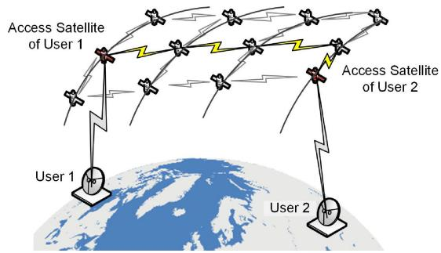  
Fig. 1. A multi-hop path connecting two ground users in MCNs.

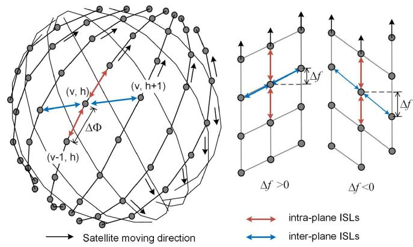  
Fig. 2. Constellation topology and ISLs.

## A. Network Model

As illustrated in Fig. 1, we consider the connection between ground users through an MCN. The user is covered and served by a satellite that is called its access satellite. ISL relays are needed when source and destination users are served by different access satellites.

Each forwarding is defined as a hop. In this paper, only hops via ISLs are counted; we do not consider satellite-to-ground links. Although ground users may switch their access satellites with the satellite movement, when the satellites are uniformly distributed, the topology variation of the network is regular [16]. Thus, the hop-count between two users can be relatively stable with minor fluctuations (supporting results will be provided in Section IV-A). Based on this consideration, this work aims to study the hop-count between two user locations in a theoretical way.

## B. Walker Constellation

Most of the proposed MCNs adopt single or multiple layers of Walker-type constellations in which satellites are regularly placed. Walker constellations can be classified into two types: Walker-Star and Walker-Delta [17]. In this paper, we focus on Walker-Delta constellations, which consist of $N _ { P } \times M _ { P }$ satellites, where $N _ { P }$ is the number of orbit planes and $M _ { P }$ is the number of satellites per plane (see Fig. 2). All the orbits have the same inclination α and are equally spaced along the equator. The difference of the right ascension of ascending node (RAAN) between adjacent planes is $\Delta \Omega = 2 \pi / N _ { P } . { \cal M } _ { P }$ satellites are evenly distributed in each plane with the phase difference between adjacent satellites $\Delta \Phi = 2 \pi / M _ { P }$ , while the phase offset between satellites in adjacent planes is given by $\Delta f = 2 \pi F / ( N _ { P } M _ { P } )$ , where F is a phasing factor. Then a Walker-Delta constellation can be formally represented by α: $N _ { P } M _ { P } / N _ { P } / F$ . Furthermore, each satellite is assigned a twodimension logical index $( v , h )$ , denoting the v-th satellite in the h-th orbit plane.

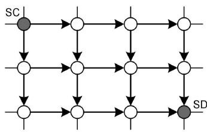  
Fig. 3. Possible paths from satellite SC to SD with the minimum number of hops.

## C. ISL Paths

Fig. 2 illustrates a widely adopted ISL connecting mode [18]– [21]. Each satellite establishes four permanent ISLs with its neighboring satellites: two intra-plane and two inter-plane ISLs. The phase difference between two satellites connected by an inter-plane ISL is $\Delta f$ . Negative $\Delta f$ values are also allowed [19], thus F belongs to the following range: $\{ 1 - N _ { P } , 2 -$ $N _ { P } , . . . , 0 , 1 , . . . , N _ { P } - 1 \}$

Any two-satellite pairs in the system can be connected by one or more multi-hop paths. To avoid ambiguity, in this work we adopt the criterion to select the path connecting satellites with a minimum number of hops. In what follows, the hop-count between two nodes only refers to the minimum value.

In a path with the minimum number of hops H from source to destination, the packets only have two candidate directions at each relay node, as shown in Fig. 3. Let $H _ { v }$ and $H _ { h }$ denote the number of intra-plane and inter-plane hops, respectively. $H _ { v }$ and $H _ { h }$ are directional values: $H _ { v } > 0$ means that packets are forwarded along the satellite moving direction, while $H _ { v } < 0 \mathrm { i n } -$ dicates the opposite forwarding direction. $H _ { h } > 0$ vand $H _ { h } < 0$ suggest the eastward and westward relays, respectively.

## D. Ascending Satellites and Descending Satellites

Based on the flying direction, all the satellites can be categorized into two types: ascending satellites and descending satellites [6]. The former flies towards the latitude-increasing direction, while the latter towards the latitude-decreasing direction, as illustrated in Fig. 4. When the orbit inclination α is between $0 ^ { \circ }$ and $9 0 ^ { \circ }$ , the directions of ascending and descending satellites are northeast and southeast, respectively. Note that the ascending or descending state of a satellite is not constant but changes with the satellite movement.

Due to the link instability caused by the relative high-speed movement, inter-plane ISLs between adjacent ascending and descending satellites are not established. Therefore, in most cases, an ascending satellite only connects to other ascending satellites, and likewise a descending satellite [22].

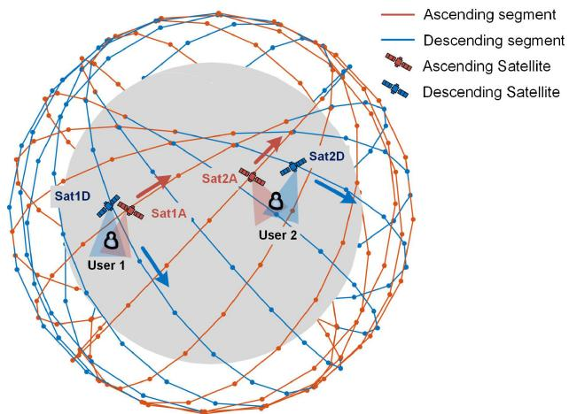  
Fig. 4. Ascending and descending satellites. Ground users are assumed covered by both an ascending and a descending satellite.

TABLE I  
NOTATIONS USED IN THE HOP-COUNT CALCULATION MODEL

<table><tr><td>Notation</td><td>Definition</td></tr><tr><td> $N_P$ </td><td>Number of orbit planes</td></tr><tr><td> $M_P$ </td><td>Number of satellites per plane</td></tr><tr><td> $\alpha$ </td><td>Orbit inclination with respect to the equator</td></tr><tr><td> $\Delta\Omega$ </td><td>RAAN difference between two planes</td></tr><tr><td> $\Delta\Phi$ </td><td>Phase difference between adjacent satellites within a plane</td></tr><tr><td> $\Delta f$ </td><td>Phase difference between satellites in adjacent planes</td></tr><tr><td> $F$ </td><td>Phasing factor</td></tr><tr><td> $\varphi, \lambda$ </td><td>Latitude and longitude of a generic ground user</td></tr><tr><td> $u$ </td><td>Satellite phase angle from the ascension node</td></tr><tr><td> $L_0$ </td><td>Initial longitude of the orbit ascending node</td></tr><tr><td> $\zeta(u)$ </td><td>Longitude difference from the orbit ascending node</td></tr><tr><td> $\omega_e$ </td><td>Angular velocity of earth rotation</td></tr><tr><td> $H_v, H_h$ </td><td>Number of intra-plane and inter-plane hops</td></tr><tr><td> $H^{X2X}$ </td><td>Hop-count for the X2X path mode; &#x27;X&#x27; stands for &#x27;A&#x27; or &#x27;D&#x27; in case of ascending or descending satellite, respectively</td></tr><tr><td> $H[(\varphi_1,\lambda_1), (\varphi_2,\lambda_2)]$ </td><td>Hop-count from  $(\varphi_1,\lambda_1)$  to  $(\varphi_2,\lambda_2)$ </td></tr></table>

## III. ISL HOP-COUNT MODEL

In this section, a general model is derived to estimate the required minimum ISL hop-count between two users. Then, the model is specified in different path modes. Based on this model, the hop-count geographical characteristics are derived.

The basic idea of this study is to establish a general model to estimate the hop-count based on the ground projection of the satellites and ISL connection mode. Then, considering the access satellite type, variables in the general model are further specified according to four potential path modes, which depends on whether the access satellite is ascending or descending. The final hop-count is the minimum of the four path modes. The main system parameters are listed in Table I.

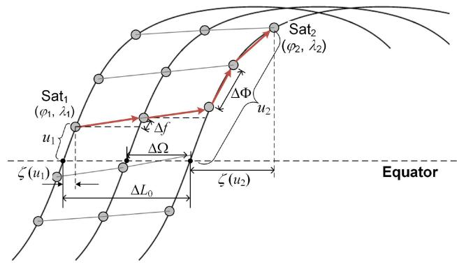  
Fig. 5. Ground track of a multi-hop path in the constellation network. In this case, $H _ { v } = 2$ and $H _ { h } = 2$

## A. Satellite Ground Location

The sub-satellite point (SSP) of a generic satellite on the ground is represented by its latitude $\varphi$ and longitude λ. At the generic time t, the SSP location can be given by

$$
\varphi = \arcsin (\sin \alpha \sin u),\tag{1}
$$

$$
\lambda = \zeta (u) + L _ {0} - \omega_ {e} t,\tag{2}
$$

$$
\zeta (u) = \left\{ \begin{array}{l} \arctan (\cos \alpha \tan u), \qquad \text { ascending   segment } \\ \arctan (\cos \alpha \tan u) + \pi , \text { descending   segment } \end{array} \right.,\tag{3}
$$

where α is the orbit inclination and $u \in [ - \pi , \pi ]$ is the satellite phase angle from its ascending node, which describes the satellite position in orbit. When $u \in [ - \pi / 2 , \pi / 2 ]$ , the satellite is in the ascending segment and flies towards the northeast, while $u \in [ - \pi , - \pi / 2 ) \cup ( \pi / 2 , \pi ]$ means the descending segment towards the southeast. $\zeta ( u )$ represents the longitude difference from the satellite to its ascending node, which varies with the satellite phase. $L _ { 0 }$ is the initial longitude of the orbit ascending node, which is an absolute parameter determining the orbit plane position. $\omega _ { e }$ is earth rotation speed.

Generally, in MCNs, multiple satellites are visible (line-ofsight, LOS) at a ground location [3]. Therefore, we assume that each user can be covered by at least one ascending and one descending satellite. Because of the dense satellite constellation and the relatively small coverage of a single satellite, the spherical distance between a user and its access satellite SSP is also small. Then, we assume that the access satellite is right over the user location so that they have the same λ and $\varphi .$

## B. General Model

Let us consider two user locations: User 1 $( \varphi _ { 1 } , \lambda _ { 1 } )$ and User $2 \left( \varphi _ { 2 } , \lambda _ { 2 } \right)$ where $\varphi _ { 1 } , \varphi _ { 2 } \in [ - \alpha , \alpha ]$ and $\lambda _ { 1 } , \lambda _ { 2 } \in [ - \pi , \pi ]$ . Based on the assumption, the access satellite SSPs are at the same locations as their users: Sat 1 and Sat 2 are also at $( \varphi _ { 1 } , \lambda _ { 1 } )$ and $( \varphi _ { 2 } , \lambda _ { 2 } )$ , respectively. Let Sat 1 be the one on the west, then the longitude difference is $\Delta \lambda = \lambda _ { 2 } - \lambda _ { 1 } , \Delta \lambda \in [ 0 , \pi ]$ . According to Fig. 5, the RAAN difference between Sat 1 and Sat 2 is

$$
\Delta L _ {0} = L _ {0, 2} - L _ {0, 1} = H _ {h} \Delta \Omega .\tag{4}
$$

Based on (2), we obtain another expression for $\Delta L _ { 0 }$ as

$$
\Delta L _ {0} = \Delta \lambda + \zeta (u _ {1}) - \zeta (u _ {2}).\tag{5}
$$

By combining (4) and (5), the inter-plane hop-count can be calculated by

$$
H _ {h} = \text { Round } \left[ \frac {\Delta L _ {0}}{\Delta \Omega} \right] = \text { Round } \left[ \frac {\Delta \lambda + \zeta (u _ {1}) - \zeta (u _ {2})}{\Delta \Omega} \right],\tag{6}
$$

where Round(x) denotes the standard rounding function that returns the integer closest to x.

Since each intra-plane and inter-plane relay respectively adds ΔΦ and $\Delta f$ to satellite phase angle, the phase angle difference between Sat 1 and Sat 2 is

$$
\Delta u = u _ {2} - u _ {1} = H _ {v} \Delta \Phi + H _ {h} \Delta f,\tag{7}
$$

where $u _ { 1 }$ and $u _ { 2 }$ satisfy

$$
\sin u = \sin \varphi / \sin \alpha .\tag{8}
$$

From (7), the intra-plane hop-count can be given by

$$
H _ {v} = \text { Round } \left[ \frac {\Delta u - H _ {h} \Delta f}{\Delta \Phi} \right].\tag{9}
$$

Finally, the total hop-count between two access satellites is

$$
H = | H _ {h} | + | H _ {v} |.\tag{10}
$$

Note that the network is torus-like: packets can also reach their destination via the reverse direction. If the path on a given direction is too long (e.g., $H _ { h } > N _ { P } / 2 )$ , the packets will go through the opposite direction. Hence, before equation (6) $\Delta L _ { 0 }$ should be normalized to $\overline { { \Delta L _ { 0 } } } \in [ - \pi , \pi ]$ using the following normalization function ${ \mathcal { N } } ( x )$

$$
\overline {{{x}}} = \mathcal {N} (x) = \operatorname{mod} \left(x + \pi , 2 \pi\right) - \pi .\tag{11}
$$

Similarly, before equation (9), $\Delta U = \Delta u - H _ { h } \Delta f$ also needs to be normalized to $[ - \pi , \pi ]$ by (11).

## C. Different Path Modes

The above formulas provide a general model to calculate the hop-count metric with given $( \varphi _ { 1 } , \lambda _ { 1 } )$ and $( \varphi _ { 2 } , \lambda _ { 2 } )$ . However, $u \in [ - \pi , \pi ]$ is multi-valued when explicitly solved from (8); u depends on the orbital segment where the satellite is. Similarly, $\zeta ( u )$ is also multi-valued according to (3). Thus, the specific values in the universal model need to be further discussed. Considering a satellite in different segments and hemispheres, its u can be specified as

$$
u = \left\{ \begin{array}{l l} \arcsin \frac {\sin \varphi}{\sin \alpha}, & \text {   ascending   segment   } \\ \frac {\varphi}{| \varphi |} \pi - \arcsin \frac {\sin \varphi}{\sin \alpha}, & \text {   descending   segment   } \end{array} \right.\tag{12}
$$

where $\varphi / | \varphi |$ indicates whether the satellite is in the northern or southern hemisphere. According to Fig. 4, since in MCNs a ground user can access either an ascending (A) or a descending (D) satellite, the hop-count between two locations depends on four path modes: A2A, A2D, D2A, and D2D (see Fig. 6). For instance, in the A2A mode, both User 1 and User 2 access to ascending satellites. Adopting the specified expressions of $u _ { 1 }$ , $u _ { 2 } , \zeta ( u _ { 1 } )$ , and $\zeta ( u _ { 2 } )$ from (3) and (12), we have

(b)  
TABLE II  
SPECIFIED VALUES OF u AND ζ(u) IN DIFFERENT PATH MODES

<table><tr><td>Path mode</td><td>A2A</td><td>A2D</td><td>D2A</td><td>D2D</td></tr><tr><td> $u_{1}$ </td><td> $u_{1} = \arcsin\frac{\sin\varphi_{1}}{\sin\alpha}$ </td><td> $u_{1} = \arcsin\frac{\sin\varphi_{1}}{\sin\alpha}$ </td><td> $u_{1} = \frac{\varphi_{1}}{|\varphi_{1}|}\pi - \arcsin\frac{\sin\varphi_{1}}{\sin\alpha}$ </td><td> $u_{1} = \frac{\varphi_{1}}{|\varphi_{1}|}\pi - \arcsin\frac{\sin\varphi_{1}}{\sin\alpha}$ </td></tr><tr><td> $u_{2}$ </td><td> $u_{2} = \arcsin\frac{\sin\varphi_{2}}{\sin\alpha}$ </td><td> $u_{2} = \frac{\varphi_{2}}{|\varphi_{2}|}\pi - \arcsin\frac{\sin\varphi_{2}}{\sin\alpha}$ </td><td> $u_{2} = \arcsin\frac{\sin\varphi_{2}}{\sin\alpha}$ </td><td> $u_{2} = \frac{\varphi_{2}}{|\varphi_{2}|}\pi - \arcsin\frac{\sin\varphi_{2}}{\sin\alpha}$ </td></tr><tr><td> $\zeta(u_{1})$ </td><td> $\arctan(\cos\alpha\tan u_{1})$ </td><td> $\arctan(\cos\alpha\tan u_{1})$ </td><td> $\pi + \arctan(\cos\alpha\tan u_{1})$ </td><td> $\pi + \arctan(\cos\alpha\tan u_{1})$ </td></tr><tr><td> $\zeta(u_{2})$ </td><td> $\arctan(\cos\alpha\tan u_{2})$ </td><td> $\pi + \arctan(\cos\alpha\tan u_{2})$ </td><td> $\arctan(\cos\alpha\tan u_{2})$ </td><td> $\pi + \arctan(\cos\alpha\tan u_{2})$ </td></tr></table>

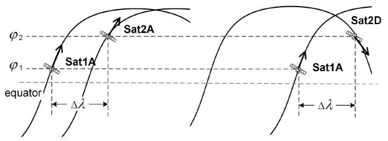  
(a)

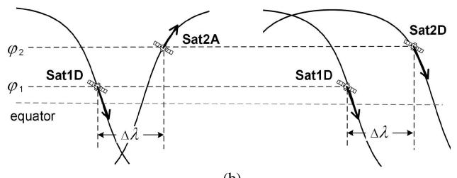  
Fig. 6. Illustration of different path modes using satellite ground tracks. Sat 1 A and Sat 2A are on the ascending orbit segment, while Sat 1D and Sat 2D are on the descending segment. (a) The access satellite of User 2 can be Sat 2A or Sat 2D, corresponding to A2A or A2D path mode, respectively. (b) The access satellite of User 1 is assumed at the descending segment, corresponding to D2A and D2D path mode. ‘A’ and ‘D’ stand for ascending and descending satellites, respectively.

$$
\begin{array}{l} H _ {h} ^ {\mathrm{A2A}} = \text { Round } \left(\left[ \Delta \lambda + \arctan \left(\cos \alpha \tan \left(\arcsin \frac {\sin \varphi_ {1}}{\sin \alpha}\right)\right) - \arctan \left(\cos \alpha \tan \left(\arcsin \frac {\sin \varphi_ {2}}{\sin \alpha}\right)\right) \right] / \left(2 \pi / N _ {P}\right)\right). \\ H _ {v} ^ {\mathrm{A2A}} = \text { Round } \left(\frac {\arcsin \frac {\sin \varphi_ {2}}{\sin \alpha} - \arcsin \frac {\sin \varphi_ {1}}{\sin \alpha} - H _ {h} ^ {\mathrm{A2A}} F \frac {2 \pi}{N _ {P} M _ {P}}}{2 \pi / M _ {P}}\right). \end{array} \tag {13}\tag{14}
$$

Both the numerators inside the Round function in (13) and (14) should be normalized to $[ - \pi , \pi ]$ by (11). Then, the total hop-count in A2A mode is

$$
H ^ {\mathrm{A2A}} = \left| H _ {h} ^ {\mathrm{A2A}} \right| + \left| H _ {v} ^ {\mathrm{A2A}} \right|.\tag{15}
$$

Similarly, the hop-count in other path modes can be calculated using the specific expressions listed in Table II. The final hopcount from User 1 to User 2 is the minimum of the four modes

$$
H = \min \left\{H ^ {\mathrm{A2A}}, H ^ {\mathrm{A2D}}, H ^ {\mathrm{D2A}}, H ^ {\mathrm{D2D}} \right\}.\tag{16}
$$

Algorithm 1: Hop-Count Estimation Between Two Ground Users.

Input:  $\varphi_{1}, \varphi_{2}, \Delta\lambda$ 

Output: H

1: for X2X in A2A, A2D, D2A, A2D do

2: Specify  $u_{1}, u_{2} \zeta(u_{1})$  and  $\zeta(u_{2})$  referring to Table II

3:  $\Delta L_{0} \leftarrow \Delta\lambda + \zeta(u_{1}) - \zeta(u_{2})$ 

4: if  $|\Delta L_{0}| &gt; \pi$  then

5:  $\overline{\Delta L_{0}} \leftarrow \text{mod}(\Delta L_{0} + \pi, 2\pi) - \pi$ 

6: end if

7:  $H_{h} \leftarrow \text{Round}(\overline{\Delta L_{0}}/\Delta\Omega)$ 

8:  $\Delta U \leftarrow u_{2} - u_{1} - H_{h}\Delta f$ 

9: if  $|\Delta U| &gt; \pi$  then

10:  $\overline{\Delta U} \leftarrow \text{mod}(\Delta U + \pi, 2\pi) - \pi$ 

11: end if

12:  $H_{v} \leftarrow \text{Round}(\overline{\Delta U}/\Delta\Phi)$ 

13:  $H^{X2X} = |H_{h}| + |H_{v}|$ 

14: end for

15:  $H \leftarrow \min\{H^{A2A}, H^{A2D}, H^{D2A}, H^{D2D}\}$ 

16: return H

Note that the path with a minimum number of hops may not be the optimal one from the routing and stability standpoints. However, this model does not directly solve the routing issue but can provide reference indicators (i.e., the minimum number of hops) for routing. The overall solution is summarized in Algorithm 1.

## D. Hop-Count Symmetry

Based on the hop-count estimation model, the hop-count from ground User 1 to 2 in any locations can be obtained with given $( \varphi _ { 1 } , \lambda _ { 1 } )$ and $( \varphi _ { 2 } , \lambda _ { 2 } )$ . Then, we will derive some properties of the hop-count and prove that the hop-count can be determined with less input information.

For ease of derivation, we use $H [ ( \varphi _ { 1 } , \lambda _ { 1 } ) , ( \varphi _ { 2 } , \lambda _ { 2 } ) ]$ (also $H _ { 1 1 - 2 2 }$ in the proofs for simplicity) to denote the hop-count from User $1 \ \left( \varphi _ { 1 } , \lambda _ { 1 } \right)$ to User $2 \ \left( \varphi _ { 2 } , \lambda _ { 2 } \right)$ . Based on the model above, when $\varphi _ { 1 } , \varphi _ { 2 } \in [ - \alpha , \alpha ]$ and $| \Delta \lambda | \le \pi$ , the following propositions are valid:

Proposition 1: Reciprocity:
 $H[(\varphi_{1}, \lambda_{1}), (\varphi_{2}, \lambda_{2})] = H[(\varphi_{2}, \lambda_{2}), (\varphi_{1}, \lambda_{1})]$ 
Proof: See Appendix.
Proposition 2: Commutativity:
 $H[(\varphi_{1}, \lambda_{1}), (\varphi_{2}, \lambda_{2})] = H[(\varphi_{2}, \lambda_{1}), (\varphi_{1}, \lambda_{2})]$ 
Proof: See Appendix.

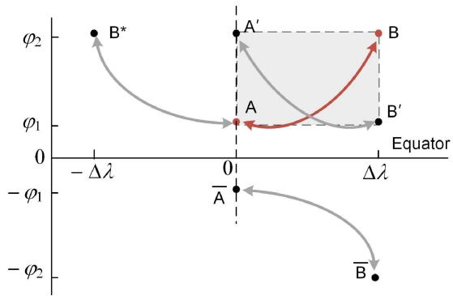  
Fig. 7. Hop-count symmetry. The paths between the four user pairs share the same hop-count. The dots represent the potential locations of User 1 or 2. A-B’-B-A’ forms a spherical rectangle.

Proposition 1 shows that the hop-count between two users is undirected, which is an essential attribute of the bidirectional multi-hop network; this means that the hop-count from a certain User 1 to a certain User 2 is the same as from User 2 to 1. Proposition 2 indicates that user pairs on the two diagonal vertexes of a spherical rectangle have the same hop-count. For instance, in Fig. 7, the required hop-count to connect User A and B is the same as that to connect User $\mathrm { A } ^ { \prime }$ and $\mathbf { B } ^ { \prime }$

From the hop-count estimation model, we can also find that H is independent of the specific values of $\lambda _ { 1 }$ and $\lambda _ { 2 }$ , but only depends on $\Delta \lambda = \lambda _ { 2 } - \lambda _ { 1 }$ . Then, we have:

Property 1: Lateral translation invariance:

$$
\begin{array}{c} \forall \ell \in [ - \pi , \pi ], H [ (\varphi_ {1}, \lambda_ {1}), (\varphi_ {2}, \lambda_ {2}) ] = H [ (\varphi_ {1}, \ell), (\varphi_ {2}, \ell + \\ \Delta \lambda) ]. \end{array}
$$

Property 2: Bilateral symmetry:

$$
H [ (\varphi_ {1}, 0), (\varphi_ {2}, \Delta \lambda) ] = H [ (\varphi_ {1}, 0), (\varphi_ {2}, - \Delta \lambda) ]
$$

Proof: See Appendix.

Property 3: Longitudinal symmetry:

$$
H [ (\varphi_ {1}, \lambda_ {1}), (\varphi_ {2}, \lambda_ {2}) ] = H [ (- \varphi_ {1}, \lambda_ {1}), (- \varphi_ {2}, \lambda_ {2}) ]
$$

Proof: See Appendix.

These properties are illustrated in Fig. 7. Property 1 indicates that the two users can shift in parallel along the latitude line while not changing the hop-count between them (e.g., from $\mathrm { B ^ { \prime } { \mathrm { - } } A ^ { \prime } }$ to A-B\*). Property 2 shows that the hop-count is essentially only dependent on the absolute longitude difference |Δλ|. When User 2 moves to the symmetric location over the meridian of User 1, the hop-count remains the same value (e.g., from A-B to A-B\*). Property 3 can be interpreted as the longitudinal symmetry about the equator. (e.g., from A-B to A-B).

Combining the propositions as mentioned earlier, we can summarize that for a given Walker-Delta constellation α: $N _ { P } M _ { P } / M _ { P } / F .$ , the hop-count between two ground users only depends on $\varphi _ { 1 } , \varphi _ { 2 }$ , and |Δλ|. Note that because of the constellation coverage constraint, the user latitude should satisfy $\varphi \in [ - \alpha , \alpha ]$ , while the remaining regions are not considered. For hybrid constellations with multiple layers such as Starlink, different layers may be designed to cover users at different latitudes, thus achieving global coverage. Our approach is applicable to each layer of the constellation.

## IV. CASE STUDY AND ANALYSIS

In this section, firstly, the proposed hop-count estimation method is verified by comparison with high-resolution simulations. Then, based on the Starlink phase I constellation example, the global hop-count distribution is investigated, and the effects of the constellation parameters on the hop-count distribution are discussed. Finally, the hop-count between two specific regions (i.e., the US and Europe) is analyzed extensively. In this section, unless differently stated, we have considered $F = 0$

## A. Model Verification

To verify the model accuracy, the estimated hop-count results are compared with simulation results for various constellation systems (see Table III). We generated 1000 uniformly and globally distributed ground users and calculated the hop-count metric between all the two-user pairs. Since those inclined constellations are not designed for strictly global coverage, here ‘global’ refers to the overall coverage regions, i.e., the latitudinal zone between $[ - \alpha , \alpha ]$ . The simulation experiments are run on STK/Matlab platform for 30 min in each scenario, and the time-average hop-count is adopted as the simulation result. In particular, when the user is covered by multiple satellites, the users select the top two satellites with highest elevation as candidate access satellites. For Starlink, phase I refers to the lowest layer of the hybrid constellation; moreover, ‘a’ and ‘b’ refer to the old and new versions of Starlink phase I, respectively [5].

To evaluate the error between the proposed hop-count derivation method and simulation experiments, we introduce the following metrics: average hop-count, average hop-count error, and relative hop-count error. Let $H ( U _ { i } , U _ { j } )$ denote the hop-count between User i and User $j$ according to our analytical model. Moreover, let $N _ { U }$ represent the total number of users. $\widetilde { H } ( U _ { i } , U _ { j } )$ represents the corresponding time-averaged hop-count value from simulations. Then, the average hop-count $H _ { a v g }$ and average hop-count error $E _ { a v g }$ are obtained as follows:

$$
H _ {a v g} = \frac {\sum_ {j = 1} ^ {N _ {U}} \sum_ {i = 1} ^ {j} H (U _ {i} , U _ {j})}{N _ {U} (N _ {U} - 1) / 2},\tag{17}
$$

$$
E _ {a v g} = \frac {\sum_ {j = 1} ^ {N _ {U}} \sum_ {i = 1} ^ {j} \left| H \left(U _ {i} , U _ {j}\right) - \widetilde {H} \left(U _ {i} , U _ {j}\right) \right|}{N _ {U} \left(N _ {U} - 1\right) / 2}.\tag{18}
$$

The relative error can be given by

$$
E _ {r} = E _ {a v g} / H _ {a v g}.\tag{19}
$$

The main characteristics of different inclined constellations are shown in Table III that also provides $H _ { a v g } , E _ { a v g } ,$ , and $E _ { r }$ whose behaviors are shown in Fig. 8, where to keep consistency, all the phasing factors of the compared constellations are set to 0. Generally, the relative hop-count error decreases with the increase in the number of satellites of the constellation. For systems with thousands of satellites like Starlink phase I, the relative error is only around 5%, and in most of the cases, the hop-count errors are no more than one hop. Although the mean values of absolute hop-count error (0.4–0.7 hops) do not exhibit significant differences among those listed systems, the relative errors are smaller in large constellations because their average hop-count values are much higher.

TABLE III  
MODEL ERROR COMPARISON IN VARIOUS CONSTELLATIONS

<table><tr><td></td><td>Celestri [18]</td><td>NeLS [19]</td><td>Quarter-Starlink</td><td>Kuiper phase A [5]</td><td>Starlink phase I-a [3]</td><td>Starlink phase I-b [5]</td></tr><tr><td># Satellites</td><td>63</td><td>120</td><td>400</td><td>1156</td><td>1600</td><td>1584</td></tr><tr><td># Planes</td><td>7</td><td>10</td><td>16</td><td>34</td><td>32</td><td>24</td></tr><tr><td># Satellites per plane</td><td>9</td><td>12</td><td>25</td><td>34</td><td>50</td><td>66</td></tr><tr><td>Orbit inclination</td><td> $48^{\circ}$ </td><td> $55^{\circ}$ </td><td> $53^{\circ}$ </td><td> $51.9^{\circ}$ </td><td> $53^{\circ}$ </td><td> $53^{\circ}$ </td></tr><tr><td>Average hop-count</td><td>2.45</td><td>3.38</td><td>6.52</td><td>10.68</td><td>12.73</td><td>13.62</td></tr><tr><td>Average hop-count error</td><td>0.38</td><td>0.45</td><td>0.55</td><td>0.71</td><td>0.56</td><td>0.67</td></tr><tr><td>Relative hop-count error</td><td>15.48%</td><td>13.18%</td><td>8.38%</td><td>6.41%</td><td>4.45%</td><td>4.93%</td></tr></table>

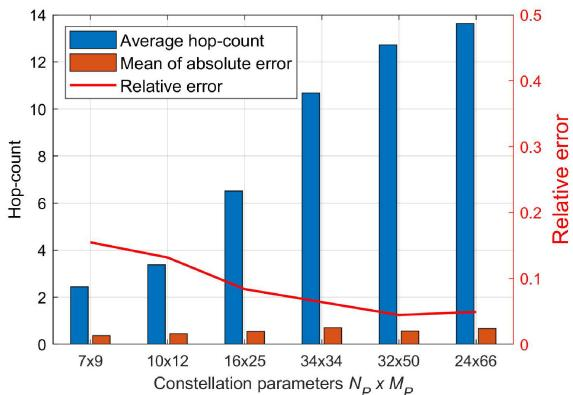  
Fig. 8. Hop-count error comparison in various constellations.

The difference between the proposed method and simulations comes from two aspects: One is the assumption that each user can be covered by both ascending and descending satellites. When the satellites in the sky are sparse (like in small constellations), in a particular time interval, a user can be covered only by one satellite. Then, the four-path-mode condition is not always available, thus causing an error. The other lies in the approximation of the rounding function in equations (6) and (9). When $N _ { P }$ and $M _ { P }$ become larger, the coverage of a single satellite becomes smaller, and the user is close to its serving satellite SSP, then the rounding function causes less error.

Therefore, the constellation scale is a critical factor affecting the accuracy of the proposed method. A higher accuracy can be achieved in larger constellation systems. In the following analysis, Starlink phase I-b version is the reference satellite system. Furthermore, the simulations running on simulators consume tens to thousands of minutes to obtain the results with the increase of constellation size. However, the proposed method takes only an average of 16.2 s to provide the overall results, and the time cost is independent of the number of satellites. Thus, the proposed method can achieve a rapid estimation with reasonable accuracy.

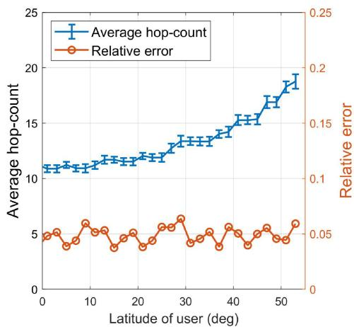  
Fig. 9. Hop-count error variation with user location (the error bar indicates the mean of absolute error between the proposed method and simulation results).

We further studied the error distribution within a constellation system. Fig. 9 gives the average hop-count and error information when users are in different locations. At each point on the line in Fig. 9, we fixed User 1 at a given latitude and calculated its hop-count value with all other users around the world. According to this figure, users at higher latitudes require more hops to access other locations, but the relative error remains within the range [0.04, 0.06]. The error results indicate no significant difference in geographical space; thus, the proposed method applies to the whole network.

The proposed method is based on the consideration that although the user switches the access satellite as time progresses, the hop-count keeps stable with small fluctuations, which has also been validated by simulations. We set two specific users at $\varphi _ { 1 } = 3 0 ^ { \circ } \mathbf { N } , \varphi _ { 2 } = 2 0 ^ { \circ } \mathbf { N } \mathrm { a n d } \Delta \lambda = 1 0 0 ^ { \circ }$ , and obtain the hop-count variation between them over time. It can be seen from Fig. 10 that the hop-count maintains stable over time in most cases and the change is no more than one hop.

The proposed hop-count estimation model can also be applied to Walker-Star constellations by modifying the definition of ΔΩ and updating equations (1)–(3) and (6) accordingly. The peculiarity of a Walker-Star constellation is that there is a seam dividing planes with ascending satellites from planes with descending satellites. When there is the seam between two users, they are served by access satellites with opposite flying directions. In this case, we can adopt the Walker-Delta hop-count method for A2D or D2A cases. With the above modifications, we have applied our hop-count approach to a OneWeb-like case with ISLs (OneWeb does not use ISLs; we just use OneWeb constellation configuration and assumed the use of ISLs). This system adopts a Walker-Star constellation with 648 satellites [23]. Applying our model, we have a relative hop-count error lower than 10%.

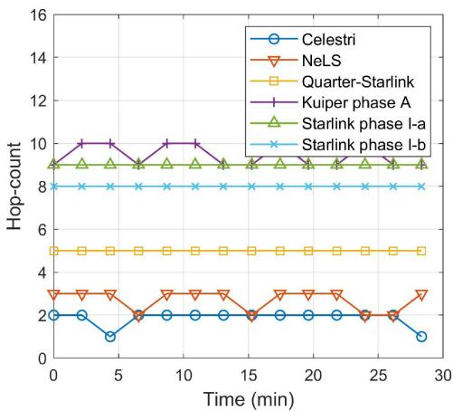  
Fig. 10. Variation of the hop-count between two specific users $( \varphi _ { 1 } = 3 0 ^ { \circ } \mathrm { N }$ $\bar { \varphi _ { 2 } } = 2 0 ^ { \circ } \mathrm { N }$ and Δλ = 100◦).

Moreover, the relative error trend in Fig. 8 roughly applies to this OneWeb-like case. Note that the relative error for our OneWeb case is larger than for Starlink because the error decreases with the number of satellites, although strictly speaking, it is unfair to compare two constellations with so many differences between them.

## B. Hop-Count Distribution

The hop-count distribution characteristics and its relationship with user location are studied in this subsection. We fix User 1 position at some latitude (at 20◦N in our numerical examples) and calculate the hop-count with User 2 at different relative locations. The resulting global hop-count distribution is shown in Fig. 11 for Starlink phase I-b. According to the translation invariance of Property 1, Fig. 11 can represent all the scenarios when User 1 moves along the latitude line. In general, the hop-count increases when User 2 is far from User 1, but the distribution is not uniform. User 2 at the north and south requires more ISL hops to reach User 1 than the east and west regions, which reveals that the hop-count estimation based only on the spherical distance between users is inaccurate. When User 1 is at 20◦N, User 2 at the southern end of User 1 requires the maximum number of hops, that is 28, to access User 1, while the average hop-count is 12.21.

Furthermore, when zooming in the local regions (see Fig. 11(b)), we can see that the hop-count in the northern regions is significantly higher than in other regions. This happens because the satellite orbit is inclined, the ground projection of intra-plane ISL is southwest-northeast (SW-NE), or northwestsoutheast (NW-SE), and the inter-plane ISL is west-to-east. Users in the north or south regions need extra inter-plane hops to visit User 1. Furthermore, since the satellites are denser in higher latitudes, the north regions require more relays than the south when User 1 is at the northern hemisphere. Similarly, based on the longitudinal symmetry of Property 3, if User 1 is located in the southern hemisphere, the high-hop regions will appear on its south side.

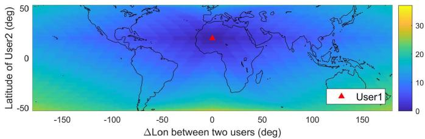  
(a)

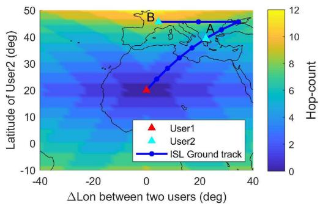

(b)  
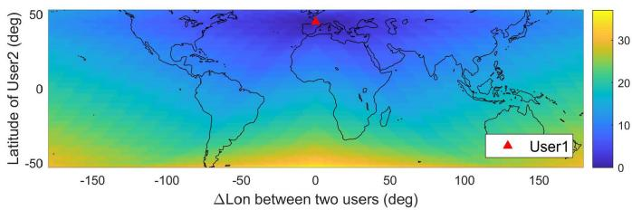  
(c)  
Fig. 11. Hop-distribution between two users. User 1 latitude is fixed, User 2 moves globally. Since the hop-count only depends on the longitude difference between User 1 and 2 but not on the specific longitude values, User 1 can move along its latitude line, while the distribution pattern translates with User 1. The color at each point indicates the hop-count value between the two users when User 2 is at this location. (a) Latitude of User 1 is 20°N. (b) Local enlarged par of (a). The blue line represents the ground track of a possible multi-hop path. When User 2 is at A or B, the required hopcount varies considerably, though their geographical distances from User 1 are similar. The range of the color bar is adaptively adjusted.

Fig. 11(b) also exemplifies the ground track of a possible ISL path connecting User 1 and 2. Regions along the ISL extension direction have relatively lower hop-count. Hence the dark regions also show a similar shape of the orbit track. If User 2 is at location A or B, although their geographical distances to User 1 are similar, location B requires more relays to access User 1. Accordingly, B may also have higher latency than A. In this drawn example, links from User 1 to location B need extra four hops (80%) than to A. Note that the potential paths connecting User 1 and B are not unique, but all of the minimal-hop paths have the same number of inter-plane and intra-plane hops.

The hop-count distribution also shows symmetry with respect to the meridian of User 1, which matches the Bilateral Symmetry of Property 2. Because the hop-count between two users is only determined by their latitudes and difference of longitudes, when User 1 moves along the latitude, the hop-count distribution results are still the same.

According to Fig. 11(c), when User 1 moves at latitudes higher than 45◦N, the overall hop-count distribution pattern is similar.

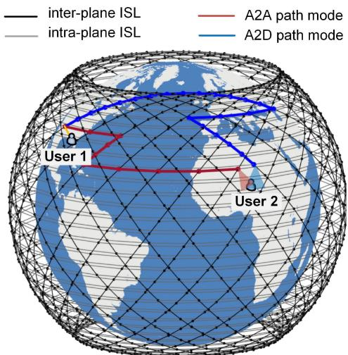  
Fig. 12. Path difference when a user is served by different types of access satellites. No ISL is established between an ascending and descending satellite. The hop-count is 9 for the red A2A path and 23 for the green A2D path.

Because now User 1 moves to the north, users in the far southern regions require more hops to reach User 1 (the corresponding max hop-count becomes 37). This also explains why the average hop-count increases with a higher user latitude in Fig. 9.

## C. Different Path Modes

In the earlier sections, we assume that ground users are aware of the types of satellites (i.e., ascending or descending) over both the source and destination. Then, the hop-count is the minimum of the four different path modes. Here, we study the hop-count when users randomly select their access satellite.

When a user is covered by multiple satellites, the ISL routing and the corresponding hop-count can be vastly different when changing the access satellite for the user. Fig. 12 shows two examples of different path modes $( \varphi _ { 1 } = 3 0 ^ { \circ } \mathrm { N } , \varphi _ { 2 } = 2 0 ^ { \circ } \mathrm { N }$ and $\Delta \lambda = 1 0 0 ^ { \circ } )$ . At the moment, User 1 is served by an ascending satellite. If User 2 also accesses to an ascending satellite, the required hop-count from User 1 to User 2 is 9 (6 inter-plane + 3 intra-plane hops). However, when User 2 switches to a nearby descending satellite, the required hop-count becomes 23 (3 inter-plane + 20 intra-plane hops). Generally, an ascending satellite can only connect to other ascending satellites [22]. Hence the A2D path has to detour around the high-latitude region (see Fig. 12), thus causing additional hops. Let us take $\varphi _ { 1 } = 3 0 ^ { \circ } \mathrm { N }$ and $\varphi _ { 2 } = 2 0 ^ { \circ } \mathrm { N }$ as an example. Fig. 13 compares the hop-count of the four path modes as a function of $\Delta \lambda$ In this case, A2A and D2D modes require fewer hops, which means that User 1 and 2 should both access the same type of satellites to reduce the number of hops needed. More specifically, when User 1 is on the east of User $2 ~ ( \Delta \lambda < 0 )$ , both users should select ascending satellites, whereas, when User 1 is on the west $( \Delta \lambda > 0 )$ , descending satellites are preferred. The gap between different path modes is significant. When $\Delta \lambda = 4 5 ^ { \circ }$ , the maximum hop-count difference between D2D and D2A is up to 29. That is, at this location User 2 switching from a descending satellite to an ascending satellite may suffer from extra 29 hops to reach User 1.

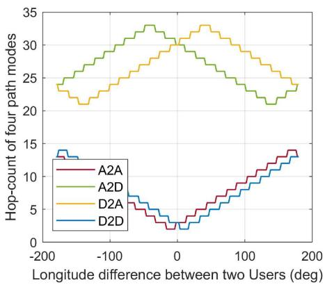  
Fig. 13. The hop-count difference between four path modes $( \varphi _ { 1 } = 3 0 ^ { \circ } \mathrm { N }$ and $\varphi _ { 2 } = 2 0 ^ { \circ } \mathrm { N } )$ .

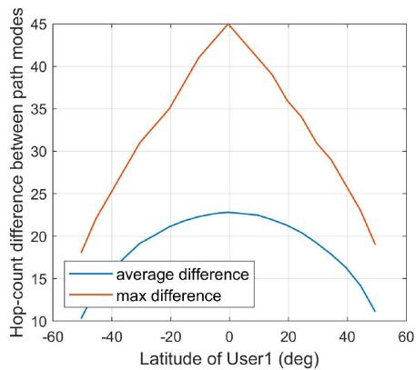  
Fig. 14. The hop-count difference caused by path modes in different user locations (User 1 and 2 are globally distributed).

The hop-count difference between path modes is also related to the user location. Fig. 14 shows that users at lower latitudes face larger variations. The peak hop-count difference is 45 and appears in the equatorial regions $( \varphi _ { 1 } = 2 ^ { \circ } \mathrm { S }$ $\varphi _ { 2 } = 0 ^ { \circ } , - 5 ^ { \circ } < \Delta \lambda < 5 ^ { \circ } )$ , where the two users are within a single satellite coverage but are respectively served by an ascending and a descending satellite. Although the two satellites are also close to each other, due to non-direct ISL between them, the path connecting them has to take a long detour. In this case, the two satellites are close in physical distance, but they are far away in the logical network topology. The peak value of 45 just equals to $( N _ { P } + M _ { P } ) / 2$ , which is the maximum hop P Pdistance in the mesh-like network. The average difference in Fig. 14 indicates that users may face an average uncertainty of 10–20 hops if they indiscriminately select their access satellite. But from the proposed method, we only keep the minimum of all the path modes.

To sum up, the results in this subsection reveal that the selection of the access satellite for ground users is also a significant issue, especially in inclined mega-constellation networks where multi-fold coverage is typical. The hop difference should be considered in the design of mobility management and routing protocols. In [24], the authors pointed out the path change caused by switches of user-satellite access in polar constellation networks. The path change is up to one hop. Our work demonstrates that the path change is more significant for inclined LEO constellations.

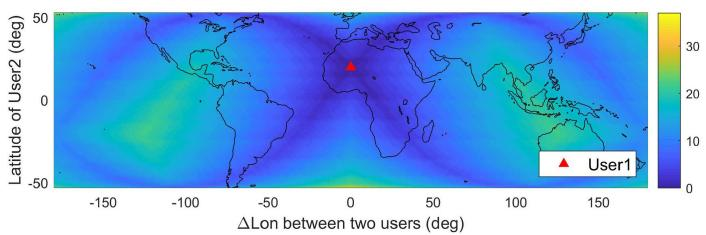  
Fig. 15. Hop-count distribution in Starlink phase I-72x22 version $( \varphi _ { 1 } = 2 0 ^ { \circ } \mathrm { N }$ $F = 0 )$

## D. Effects of Constellation Parameters

In this subsection, the effects of constellation parameters on the ISL hops are investigated, including orbit inclination $\alpha ,$ number of planes $N _ { P } ,$ number of satellites per plane $M _ { P } ,$ and phasing factor F . α mainly affects the coverage latitude range and the specific value of the hop-count calculation. Results show that α has a lower influence on the hop-count distribution pattern. Therefore, we focus on the other three parameters.

1) $N _ { P }$ and $M _ { P } \colon N _ { P }$ and $M _ { P }$ determine the total number of P P P Psatellites. They are vital parameters and are usually determined by a comprehensive balance of various factors such as the system capacity requirement, satellite performance, and cost. Even if the total number of satellites is fixed $( \mathrm { e . g . } , N _ { P } \times M _ { P } = 1 5 8 4 )$ different combinations of $N _ { P }$ and $M _ { F }$ would cause variations of the hop-count between two users. Recently, Starlink has proposed a modified version of its phase I-b constellation by using $N _ { P } = 7 2$ orbit planes and $M _ { P } = 2 2$ satellites/plane [22]. The hop-count distribution of this modified version is illustrated in Fig. 15 for User 1 at latitude $2 0 ^ { \circ } \mathbf { N } .$ . By comparing these results with Fig. 11 (a), the hop-count in the modified version shows a remarkable difference with respect to the previous version. Obviously, there are two dark blue belts crossing at the User 1 location. These belts match the satellite ground tracks. The reason is that the modified constellation has more planes and fewer satellites per plane. Hence, those regions along the tracks of intra-plane ISLs require relatively fewer hops. Compared to the 24x66 version, under the same conditions, the required inter-plane ISL hops increase, while the number of intra-plane hops decreases. Also, the distance of intra-plane ISLs is longer than inter-plane ISL. For users in the belt regions, their routes to User 1 mainly follow intra-plane ISLs. Therefore, they require fewer hops than nearby areas that need extra inter-plane hops.

According to results from the modified constellation, the overall average hop-count is 11.48, decreased by 15.4% as compared to the 24x66 version. The reason is that when satellites within a plane become sparse, with the same number of hops, users can reach further regions via intra-plane relays. The advantage over inter-plane relays is enhanced with a larger $N _ { P } / M _ { P }$ ratio.

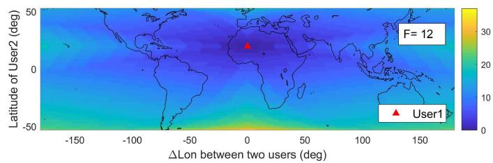  
Fig. 16. Hop-count distribution when phasing factor $F = 1 2$ for the Starlink phase I-24x66 version, $\varphi _ { 1 } = 2 0 ^ { \circ } \mathrm { N }$

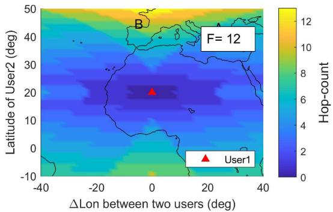  
Fig. 17. Local enlarged part of Fig. 16.

Therefore, more users prefer inter-plane ISLs, and the overall hop-count is reduced. From the perspective of ISL hops, the modified satellite constellation is better.

2) Phasing Factor F: Phasing factor F specifies the phase difference $\Delta f$ between two satellites connected by an interplane ISL and, consequently, affects the ground track direction of inter-plane ISLs. Currently, no public information about $F$ has been found for Starlink.

Let us consider the benchmark case in Fig. 11, by changing F to 12 as an example, we obtain a different hop-count distribution, as shown in Fig. 16. A User 1-centered butterfly-like can be found, which indicates a low-hop-count region. The dark blue color means that users in these regions require fewer hops to reach User 1. Based on the discussion in Section IV-B, from User 1 location, regions along ISL ground track directions require relatively fewer hops. When $F > 0$ , the angle between interplane and intra-plane ISLs becomes smaller. In the ascending orbit segment, the inter-plane and intra-plane ISLs are both southwest-northeast (SW-NE) direction, and in the descending segment they are both northwest-southeast (NW-SE) direction. When the angles between inter-plane and intra-plane ISLs decrease, their low-hop-count regions are merged, thus causing a butterfly-like region with low-hop-count (see Figs. 16 and 17). Here, $F = 1 2$ is half of $N _ { P }$ , corresponding to $\Delta f = \Delta \Phi / 2$ which means that the phase difference between satellites in adjacent planes is just half of the phase difference within a plane.

When $F = 1 2$ , the average hop-count all over the network is 12.4, which is 7.53% lower than for $F = 0 .$ . Fig. 18 gives the maximum and average hop-count variations when $F$ ranges in $[ - N _ { P } , N _ { P } ]$ . The average hop-count presents a decreasing trend with a larger F . When $F$ reaches about $N _ { P } / 2$ , the descending curve becomes flat. On the other hand, although the average hop-count decreases with $F ,$ , the max value shows an upward trend. When $F$ is around −20, the max hop-count reaches its lowest value. It is found that the max hop-count always happens when $\Delta \lambda = 0$ and $| \varphi _ { 1 } - \varphi _ { 2 } | = 2 \alpha , \mathrm { i . e . }$ , the two users are at the northernmost and southernmost locations on the same meridian, respectively. According to the discussion in Section IV-B, when $F < 0$ , the inter-plane ISL is along NW-SE direction. With the decrease of $F ,$ , the angle between inter-plane and intra-plane ISLs increases, then the required number of hops reduces. Therefore, the maximum hop-count of the global network increase with $F ,$ , especially when $F < 0$

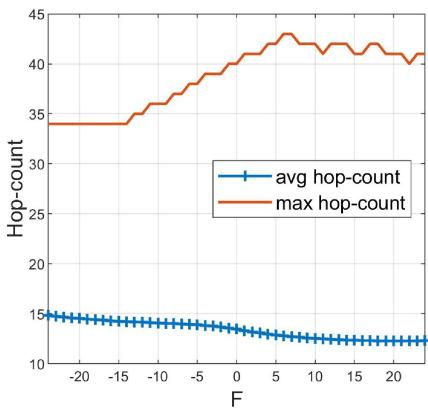  
Fig. 18. Average and max hop-count for different F values.

The results indicate that increasing F can effectively save more ISL hops, and a negative $F$ is preferred if the maximum of the hop-count metric is more important in the design requirements. Variations of $F$ will not change the network topology or graph topology, but the effects on the hop-count metric for ground users are remarkable. Since the other constellation parameters $( { \bf e } . { \bf g } . , \alpha , N _ { P } , M _ { P } )$ are determined after a comprehensive balance and are not easy to be changed, optimizing $F$ is a promising and practical approach to achieve fewer ISL hops.

## E. Number of ISL Hops Between the US and Europe

This subsection studies the multi-hop paths between two local regions. Define the region within [30◦N, 50◦N], [−125◦W, $- 7 0 ^ { \circ } \mathbf { W } ]$ as the US and the region within [35◦N, 55◦N], [10◦W, 30◦E] as the Europe. 100 users are randomly scattered in each region. For each US-EU user pair, the hop-count is calculated using the proposed method with the minimum among the four different paths. Fig. 19 illustrates an example of several paths between US and Europe in different path modes.

When $F = 0$ , the average hop-count between these two regions is 8.99 and the max value is 15. Among all the paths, interplane ISLs are preferred (68%) than intra-plane ISLs (32%). When F varies, Fig. 20 gives the corresponding behavior of the hop-count. Differently from the global hop-count variation, with the increase of $F$ from $1 - N _ { P }$ , the average hop-count first decreases and then slowly grows. When $F = 8 .$ , the average hop-count reaches the bottom 8.19, which is 8.82% lower than $F = 0$ . The maximum hop-count, in this case, shows a similar trend. Therefore, in this US-EU case, the optimal $F$ should be larger than zero (e.g., 5 to 8). It can be understood that Europe is to the northeast of the US, a small positive $F$ also results in northeastwards inter-plane ISLs, and the agreement of the two directions (both northeast) can reduce the total number of required hops. Based on the above analysis, optimizing $F$ is an effective way to improve network performance between two specific regions.

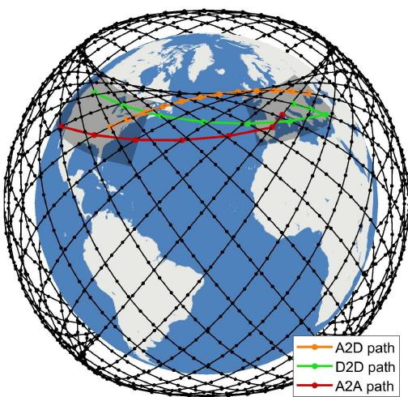  
Fig. 19. Possible paths between the US and Europe. The two regions are defined as the shadowed areas.

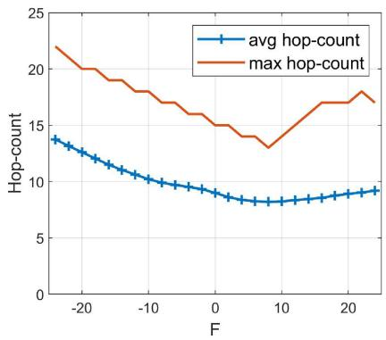  
Fig. 20. Average and max hop-count vs. phasing factor between the US and Europe.

## V. CONCLUSION

In this paper, the ISL hop-count is studied, referring to Walker-Delta mega-constellations. The goal is to provide insights into the topology and routing design in MCNs through the analysis of ISL relays. A rapid and straightforward hop-count estimation approach is proposed, avoiding running complex and costly simulations. Some explicable properties and the symmetry of the hop-count are then derived. It is found that in a given constellation the hop-count value is only determined by users latitudes and the absolute values of their longitude difference. The proposed method is validated through comparisons with high-resolution simulations of MCNs.

With our proposed method and derived properties, the ISL hop-count has been investigated in various scenarios. We have found a significant hop-count difference when users switch their access satellites. Moreover, we have obtained the spatial distribution of the hop-count that depends not only on the spherical distance between users but also on their latitudes. The effects of constellation parameters on ISL relays have also been studied. The results show that optimizing a phase factor is a promising approach to reduce the hop-count value, while not degrading other performance metrics. Similar results have been found in specific US-to-Europe user cases.

The full Starlink constellation will be much larger than that of phase I [5]. Although a single constellation layer of Starlink is considered in this work, our proposed approach for hop-count analysis can be applied to any layer of the future multiple-layer Starlink constellation.

Based on this work, we plan a further study on the impact on routing design, where not only the hop-count but also other aspects will be considered as the stability of the route. A routing scheme selecting the path mode with longer sustainable time as well as smaller hop-count will be a promising area for further investigation. In this regard, the study of the latency for MCNs with routing in the sky will be addressed.

## APPENDIX A

## PROOFS OF PROPOSITIONS AND PROPERTIES

Proposition 1: Reciprocity:

$$
H \left[ \left(\varphi_ {1}, \lambda_ {1}\right), \left(\varphi_ {2}, \lambda_ {2}\right) \right] = H \left[ \left(\varphi_ {2}, \lambda_ {2}\right), \left(\varphi_ {1}, \lambda_ {1}\right) \right]
$$

Proof: According to equation (13) and (14), by swapping the locations, $H _ { \mathrm { h } , 2 2 - 1 1 } ^ { \mathrm { A } \bar { 2 } \mathrm { A } } = - H _ { \mathrm { h } , 1 1 - 2 2 } ^ { \mathrm { A } 2 \mathrm { A } }$ and $H _ { \mathrm { v } , 2 2 - 1 1 } ^ { \mathrm { A } 2 \mathrm { A } } = - H _ { \mathrm { v } , 1 1 - 2 2 } ^ { \mathrm { A } 2 \mathrm { A } }$ can be obtained. Then $H _ { 2 2 - 1 1 } ^ { \mathrm { A 2 A } } = | \bar { H } _ { { \mathrm { h } } , 2 2 - 1 1 } ^ { \mathrm { A 2 A } } | + | \bar { H } _ { { \mathrm { v } } , 2 2 - 1 1 } ^ { \mathrm { \bar { A } } 2 \mathrm { \bar { A } } } | = H _ { 1 1 - 2 2 } ^ { \mathrm { \bar { A } } 2 \mathrm { \bar { A } } }$ Similarly, we have $\begin{array} { r } { H _ { 2 2 - 1 1 } ^ { \mathrm { D } \bar { 2 } \mathrm { D } } = H _ { 1 1 - 2 2 } ^ { \mathrm { D } \bar { 2 } \mathrm { D } } . } \end{array}$ For A2D and D2A modes, $H _ { \mathrm { h , 2 2 - 1 1 } } ^ { \mathrm { A 2 D } } = - H _ { \mathrm { h , 1 1 - 2 2 } } ^ { \mathrm { D \bar { 2 } A } }$ and $\bar { H } _ { \mathrm { v } , 2 2 - 1 1 } ^ { \mathrm { A } 2 \mathrm { D } } = - H _ { \mathrm { v } , 1 1 - 2 2 } ^ { \mathrm { D } 2 \mathrm { A } } .$ , then $H _ { 2 2 - 1 1 } ^ { \mathrm { A 2 D } } = | \tilde { H } _ { \mathrm { h } , 2 2 - 1 1 } ^ { \mathrm { A 2 D } } | + | \tilde { H } _ { \mathrm { v } , 2 2 - 1 1 } ^ { \mathrm { A 2 D } } | = H _ { 1 1 - 2 2 } ^ { \mathrm { D 2 A } }$ . Similarly, $\bar { H } _ { 2 2 - 1 1 } ^ { \mathrm { D 2 A } } =$ $H _ { 1 1 - 2 2 } ^ { \mathrm { A 2 D } }$ can be obtained. Since the final hop-count is $H =$ min $\{ H ^ { \mathrm { A 2 A } } , H ^ { \mathrm { A 2 D } } , H ^ { \mathrm { D 2 A } } , H ^ { \mathrm { D 2 D } } \}$ and the four-element sets for the two user pairs are equal in value, then $H _ { 2 2 - 1 1 } =$ min $\{ H _ { 2 2 - 1 1 } ^ { \mathrm { A 2 A } } , H _ { 2 2 - 1 1 } ^ { \mathrm { A 2 D } } , H _ { 2 2 - 1 1 } ^ { \mathrm { D 2 A } } , H _ { 2 2 - 1 1 } ^ { \mathrm { D 2 { \bar { D } } } } \} = H _ { 1 1 - 2 2 }$ -

Proposition 2: Commutativity:

$$
H [ (\varphi_ {1}, \lambda_ {1}), (\varphi_ {2}, \lambda_ {2}) ] = H [ (\varphi_ {2}, \lambda_ {1}), (\varphi_ {1}, \lambda_ {2}) ].
$$

Proof: Using the same method as proof in Proposition 1, we can get $H _ { \mathrm { h } , 2 1 - 1 2 } ^ { \mathrm { A } 2 \mathrm { A } } = H _ { \mathrm { h } , 1 1 - 2 2 } ^ { \mathrm { D } 2 \mathrm { D } }$ and $H _ { \mathrm { v } . 2 1 - 1 2 } ^ { \mathrm { A } 2 \mathrm { A } } =$ $H _ { \mathrm { v } , 1 1 - 2 2 } ^ { \mathrm { D } 2 \mathrm { D } }$ . Then $H _ { 2 1 - 1 2 } ^ { \mathrm { A } 2 \mathrm { A } } = | H _ { \mathrm { h } , 2 1 - 1 2 } ^ { \mathrm { A } 2 \mathrm { A } } | + | H _ { \mathrm { v } , 2 1 - 1 2 } ^ { \mathrm { A } 2 \mathrm { A } ^ { - } } | = H _ { 1 1 - 2 2 } ^ { \mathrm { D } 2 \mathrm { D } }$ . Similarly, $\mathrm { \bar { \Delta } } \bar { H } _ { 2 1 - 1 2 } ^ { \mathrm { D 2 D } } = \bar { H _ { 1 1 - 2 2 } ^ { \mathrm { A 2 \bar { A } } } }$ . For A2D and D2A modes, $\bar { H } _ { \mathrm { h } , 2 1 - 1 2 } ^ { \mathrm { A } 2 \mathrm { D } } =$ $H _ { \mathrm { h , 1 1 - } 2 2 } ^ { \mathrm { A 2 D } }$ and $H _ { \mathrm { v } , 2 1 - 1 2 } ^ { \mathrm { A 2 D } } = H _ { \mathrm { v } , 1 1 - 2 2 } ^ { \mathrm { A 2 D } }$ , then $H _ { 2 1 - 1 2 } ^ { \mathrm { A 2 D } } = H _ { 1 1 - 2 2 } ^ { \mathrm { A 2 D } }$ . In the same way, we have $H _ { 2 1 - 1 2 } ^ { \mathrm { D } 2 \mathrm { A } } = H _ { 1 1 - 2 2 } ^ { \mathrm { D } 2 \mathrm { A } }$ . Finally $H _ { 2 1 - 1 2 } =$ $\operatorname* { m i n } \{ H _ { 2 1 - 1 2 } ^ { \mathrm { A 2 A } } , H _ { 2 1 - 1 2 } ^ { \mathrm { A 2 D } } , H _ { 2 1 - 1 2 } ^ { \mathrm { D 2 A } } , H _ { 2 1 - 1 2 } ^ { \mathrm { D 2 D } } \} = H _ { 1 1 - 2 2 } .$

Property 2: Bilateral symmetry:

$$
H [ (\varphi_ {1}, 0), (\varphi_ {2}, \Delta \lambda) ] = H [ (\varphi_ {1}, 0), (\varphi_ {2}, - \Delta \lambda) ].
$$

Proof: Combining Proposition 1 and Proposition 2, we have $\begin{array} { r l } { H [ ( \varphi _ { 1 } , 0 ) , ( \varphi _ { 2 } , \Delta \lambda ) ] } & { = H [ ( \varphi _ { 2 } , \Delta \lambda ) , ( \varphi _ { 1 } , 0 ) ] } \end{array}$ $H [ ( \varphi _ { 1 } , \Delta \lambda ) , ( \varphi _ { 2 } , 0 ) ]$ . Then by using Property 1 and let $\ell = 0 .$ we can get $H [ ( \varphi _ { 1 } , \Delta \lambda ) , ( \varphi _ { 2 } , 0 ) ] = H [ ( \varphi _ { 1 } , 0 ) , ( \varphi _ { 2 } , - \Delta \lambda ) ]$ Finally, $H [ ( \varphi _ { 1 } , 0 ) , ( \varphi _ { 2 } , \Delta \lambda ) ] = H [ ( \varphi _ { 1 } , 0 ) , ( \varphi _ { 2 } , - \Delta \lambda ) ]$

Property 3: Longitudinal symmetry:

$$
H \left[ \left(\varphi_ {1}, \lambda_ {1}\right), \left(\varphi_ {2}, \lambda_ {2}\right) \right] = H \left[ \left(- \varphi_ {1}, \lambda_ {1}\right), \left(- \varphi_ {2}, \lambda_ {2}\right) \right].
$$

Proof: According to equation (13) and (14), we can get ${ \cal H } _ { h } ^ { \mathrm { A 2 A } } [ ( - \varphi _ { 1 } , \bar { \lambda _ { 1 } } ) , ( - \varphi _ { 2 } , \lambda _ { 2 } ) ] ~ = { \cal H } _ { h } ^ { \mathrm { D 2 B } } [ ( \varphi _ { 1 } , \lambda _ { 1 } ) , ( \varphi _ { 2 } , \lambda _ { 2 } ) ] ,$

$H _ { v } ^ { \mathrm { A 2 A } } [ ( - \varphi _ { 1 } , \lambda _ { 1 } ) , ( - \varphi _ { 2 } , \lambda _ { 2 } ) ] = H _ { v } ^ { \mathrm { D 2 D } } [ ( \varphi _ { 1 } , \lambda _ { 1 } ) , ( \varphi _ { 2 } , \lambda _ { 2 } ) ]$ , then $H ^ { \mathrm { A 2 A } } [ ( - \varphi _ { 1 } , \lambda _ { 1 } ) , ( - \varphi _ { 2 } , \lambda _ { 2 } ) ] = H ^ { \mathrm { D 2 D } } [ ( \varphi _ { 1 } , \lambda _ { 1 } ) , ( \varphi _ { 2 } , \lambda _ { 2 } ) ]$ . Similarly, ${ \cal H } ^ { \mathrm { D 2 D } } [ ( - \varphi _ { 1 } , \lambda _ { 1 } ) , ( - \varphi _ { 2 } , \lambda _ { 2 } ) ] = { \cal H } ^ { \mathrm { A 2 A } } [ ( \varphi _ { 1 } , \lambda _ { 1 } ) , ( \varphi _ { 2 } , \lambda _ { 2 } ) ]$ For A2D and D2A modes, by normalizing the numerators in (6) and $( 9 ) \mathrm { t o } \left[ - \pi , \pi \right]$ , we can obtain $H ^ { \mathrm { A 2 D } } [ ( - \varphi _ { 1 } , \lambda _ { 1 } ) , ( - \varphi _ { 2 } , \lambda _ { 2 } ) [ =$ $H ^ { \mathrm { D 2 A } } [ ( \varphi _ { 1 } , \lambda _ { 1 } ) , ( \varphi _ { 2 } , \lambda _ { 2 } ) ]$ and $H ^ { \mathrm { D 2 A } } [ ( - \varphi _ { 1 } , \lambda _ { 1 } ) , ( - \varphi _ { 2 } , \lambda _ { 2 } ) ] =$ $H ^ { \mathrm { A 2 D } } [ ( \varphi _ { 1 } , \lambda _ { 1 } ) , ( \varphi _ { 2 } , \lambda _ { 2 } ) ]$ . Since the final hop-count is $H =$ $\operatorname* { m i n } \{ \tilde { H } ^ { \mathrm { A 2 A } } , \tilde { H } ^ { \mathrm { A 2 \dot { D } } } , \tilde { H } ^ { \mathrm { D 2 \dot { A } } } , \tilde { H } ^ { \mathrm { D 2 D } } \}$ and the four-element sets for the two user pairs are equal in value, we obtain $H [ ( - \varphi _ { 1 } , \lambda _ { 1 } ) , ( - \varphi _ { 2 } , \lambda _ { 2 } ) ] = H [ ( \varphi _ { 1 } , \lambda _ { 1 } ) , ( \varphi _ { 2 } , \lambda _ { 2 } ) ]$ -

## REFERENCES

[1] S. C. Burleigh, T. De Cola, S. Morosi, S. Jayousi, E. Cianca, and C. Fuchs, “From connectivity to advanced internet services: A comprehensive review of small satellites communications and networks,” Wireless Commun Mobile Comput., vol. 2019, pp. 1–17, 2019.

[2] D. Bhattacherjee et al., “Gearing up for the 21st century space race,” in Proc. 17th ACM Workshop Hot Top. Netw. – HotNets ’18, pp. 113–119, 2018.

[3] I. d. Portillo, B. G. Cameron, and E. F. Crawley, “A technical comparison of three low earth orbit satellite constellation systems to provide globa broadband,” Acta Astronautica, vol. 159, pp. 123–135, 2019.

[4] T. Pultarova, “Mega-constellations: Will they bridge,” Eng. Technol., vol. 13, no. 1, pp. 66–69, 2018.

[5] D. Bhattacherjee and A. Singla, “Network topology design at 27000 km/hour,” in Proc. 15th Int. Conf. Emerg. Netw. Exp. Technol., 2019, pp. 341–354 .

[6] Y. Su, Y. Liu, Y. Zhou, J. Yuan, H. Cao, and J. Shi, “Broadband LEO satellite communications: Architectures and key technologies,” IEEE Wireless Commun., vol. 26, no. 2, pp. 55–61, Apr. 2019.

[7] T. de Cola et al., “Network and protocol architectures for future satellite systems,” Found. Trends Netw., vol. 12, no. 1/2, pp. 1–161, 2017.

[8] F. Babich, M. Comisso, A. Cuttin, M. Marchese, and F. Patrone, “Nanosatellite-5G integration in the millimeter-wave domain: A full topdown approach,” IEEE Trans. Mobile Comput., vol. 19, no. 2, pp. 390–404, Feb. 2020.

[9] M. Toyoshima, “Recent trends in space laser communications for smal satellites and constellations,” in Proc. IEEE Int. Conf. Space Opt. Syst. Appl., Conf. Proc., 2019, pp. 1–5.

[10] E. Ekici, I. F. Akyildiz, and M. D. Bender, “A distributed routing algorithm for datagram traffic in LEO satellite networks,” IEEE/ACM Trans. Netw., vol. 9, no. 2, pp. 137–147, Apr. 2001.

[11] Q. Chen, X. Chen, L. Yang, S. Wu, and X. Tao, “A distributed congestion avoidance routing algorithm in mega-constellation networks with multigateway,” Acta Astronautica, vol. 162, pp. 376–387, 2019.

[12] M. Handley, “Delay is not an option,” in Proc. 17th ACM Workshop Hot Topics Netw. – HotNets ’ 18, 2018, pp. 85–91.

[13] Y. Vasavada, R. Gopal, C. Ravishankar, G. Zakaria, and N. BenAmmar, “Architectures for next-generation high throughput satellite systems,” Int. J. Satell. Commun. Netw., vol. 34, no. 4, pp. 523–546, 2016.

[14] M. Mohorcic, A. Svigelj, G. Kandus, Y. F. Hu, and R. E. Sheriff, “Demographically weighted traffic flow models for adaptive routing in packet-switched non-geostationary satellite meshed networks,” Comput. Netw., vol. 43, no. 2, pp. 113–131, 2003.

[15] Q. Chen, L. Yang, X. Liu, J. Guo, S. Wu, and X. Chen, “Multiple gateway placement in large-scale constellation networks with inter-satellite links,” Int. J. Satell. Commun. Netw., vol. 39, no. 1, pp. 47–64, 2021.

[16] J. Wang, L. Li, and M. Zhou, “Topological dynamics characterization for LEO satellite networks,” Comput. Netw., vol. 51, no. 1, pp. 43–53, 2007.

[17] F. Ma et al., “Hybrid constellation design using a genetic algorithm for a LEO-based navigation augmentation system,” GPS Solutions, vol. 24, no. 2, pp. 1–14, 2020.

[18] A. Donner, M. Berioli, and M. Werner, “MPLS-based satellite constellation networks,” IEEE J. Sel. Areas Commun., vol. 22, no. 3, pp. 438–448, Apr. 2004.

[19] R. Suzuki and Y. Yasuda, “Study on ISL network structure in LEO satellite communication systems,” Acta Astronautica, vol. 61, no. 7/8, pp. 648–658, 2007.

[20] W. Zhou, Y. Zhu, Y. Li, Q. Li, and Q. Yu, “Research on hierarchical architecture and routing of satellite constellation with IGSO-GEO-MEO network,” Int. J. Satell. Commun. Netw., vol. 38, no. 2, pp. 162–176, 2019.

[21] G. Giuliari, T. Klenze, M. Legner, D. A. Basin, A. Perrig, and A. Singla, “Internet backbones in space,” ACM SIGCOMM Comput. Commun. Rev., vol. 50, no. 1, pp. 25–37, 2020.

[22] M. Handley, “Using ground relays for low-latency wide-area routing in mega-constellations,” in Proc. 18th ACM Workshop Hot Top. Netw., pp. 125–132, 2019.

[23] Q. Chen, J. Guo, L. Yang, X. Liu, and X. Chen, “Topology virtualization and dynamics shielding method for leo satellite networks,” IEEE Commun. Lett., vol. 24, no. 2, pp. 433–437, Feb. 2020.

[24] Y. Lu, Y. Zhao, F. Sun, and D. Qin, “Complexity of routing in store-andforward LEO satellite networks,” IEEE Commun. Lett., vol. 20, no. 1, pp. 89–92, Jan. 2016.

Lei Yang received the Ph.D. degree from the College of Aerospace Science and Engineering, National University of Defense Technology, Changsha, China, in 2008. He is currently a Member of the Chinese Society of Astronautics, and China Instrument and Control Society. His current research interests include satellite communication networks, measurement and control technology for microsatellite, on-board computer, spacecraft system modeling, and simulation.

Quan Chen received the B.E. and M.E. degrees in 2015 and 2017, respectively, from the National University of Defense Technology, Changsha, China, where he is currently working toward the Ph.D. degree. From 2019 to 2020, he was a Visiting Scholar with Katholieke Universiteit Leuven, Leuven, Belgium. His research interests include UAV communication networks, mega-constellation networks, and integrated space-terrestrial networks.

Giovanni Giambene (Senior Member, IEEE) received the Ph.D. degree in telecommunications and informatics from the University of Florence, Florence, Italy, in 1997. He was a Technical External Secretary of the European Community COST 227 Action (integrated space or terrestrial mobile networks). From 1997 to 1998, he was with the OTE (Marconi Group), Florence, Italy, working on a GSM development program. In 1999, he joined the Department of Information Engineering and Mathematical Sciences, University of Siena, Siena, Italy, where he

Chengguang Fan received the Ph.D. degree in instrumental science and technology from the National University of Defense Technology (NUDT), Changsha, China, in 2014. From 2011 to 2013, he was a Joint Ph.D. Student between NUDT and the University of Bristol, Bristol, U.K. His current research interests include microsatellite or nanosatellite and satellite communication networks.

is an Associate Professor of networking. He was the Vice-Chair of the COST 290 Action (2004–2008), entitled “Traffic and QoS Management in Wireless Multimedia Networks.” He participated in several EU projects (SatNEx I, II, III, IV RADICAL, COST Action WiNeMO, and RESPONSIBILITY). He is currently involved with the ESA SatNEX V and ESA-ARTES ROMANTICA projects. His research interests include wireless and satellite networking, cross-layer air interface design, and transport layer performance. Since January 2015, he has been the Editor of the IEEE TRANSACTIONS ON VEHICULAR TECHNOLOGY JOURNAL. Since February 2019, he has also been the Editor of the IEEE Wireless Communications Magazine.

Xiaoqian Chen received the M.S. and Ph.D. degrees in aerospace engineering from the National University of Defense Technology, Changsha, China, in 1997 and 2001, respectively. He is currently a Professor and the Dean of the National Institute of Defense Technology Innovation, Beijing, China. His current research interests include spacecraft systems engineering, advanced digital design methods of space systems, and multidisciplinary design optimization.