# A Distributed Routing Algorithm for Datagram Traffic in LEO Satellite Networks

Eylem Ekici, Student Member, IEEE, Ian F. Akyildiz, Fellow, IEEE, and Michael D. Bender, Senior Member, IEEE

Abstract—Satellite networks provide global coverage and support a wide range of services. Low Earth Orbit (LEO) satellites provide short round-trip delays and are becoming increasingly important. One of the challenges in LEO satellite networks is the development of specialized and efficient routing algorithms. In this work, a datagram routing algorithm for LEO satellite networks is introduced. The algorithm generates minimum propagation delay paths. The performance of the algorithm is evaluated through simulations. The robustness issues of the algorithm are also discussed.

Index Terms—Connectionless/datagram routing, low earth orbit (LEO), satellite networks.

## I. INTRODUCTION

ATELLITE networks can meet a variety of data communication needs of businesses, government, and individuals. Due to their wide-area coverage characteristics and ability to deliver wide bandwidths with a consistent level of service, satellite links are attractive for both developed and developing countries. There is no doubt that satellites (both LEO and GEO) will be an essential part of the Next-Generation Internet (NGI). There are several reasons why satellites will play a key role in the NGI [1].

• Satellite services can be provided over wide geographical areas including urban, rural, remote, and inaccessible areas. It should be noted that two-thirds of the world still does not have the infrastructure for the Internet.

• Satellite communication systems have very flexible bandwidth-on-demand capabilities.

• Alternative channels can be provided for connections that have unpredictable bandwidth demands and traffic characteristics, which may result in maximum resource utilization.

• New users can easily be added to the system by simply installing the Internet interfaces at customer premises. As a result, network expansions will be a simple task.

• Satellites can act as a safety valve for NGI. Fiber failure or network congestion problems can be recovered easily by routing traffic through a satellite channel.

• New applications such as “Digital Earth,” as well as teleeducation, telemedicine, entertainment, etc., can be realized through satellites.

There are many technical obstacles to be overcome to make satellite Internet systems commercially viable. One of the challenges in LEO satellite networks research is the development of specialized and efficient routing algorithms. In particular, the special design of Low Earth Orbit (LEO) satellite networks causes the packets to take multiple hops from source to destination. The interconnectivity pattern of LEO satellites forms different shapes depending on their movement. The satellites are connected to each other via intersatellite links (ISL). The so-called interplane ISLs connect satellites from different orbits (also called planes). On the other hand, the intraplane ISLs connect satellites in the same plane. While the distances between the satellites (vertical paths) in the same plane are fixed throughout the connections, the distances between satellites in different planes (horizontal paths) are different and vary with the movement of the satellites, e.g., the horizontal distances are longest when satellites are over the equator and shortest when they are over the polar region boundaries. Although the satellite movements cause changes in the network topology, the established connections must be maintained in the network. This is where efficient routing algorithms are needed, not only to establish the optimum path between source and destination, but also to maintain the path throughout the communication.

In recent years, some routing algorithms for LEO satellite networks have been developed assuming a connection-oriented network structure, e.g., ATM or ATM-type switches on-board satellites [2]–[6]. The developed algorithms focus mainly on the initial path setup phase. The paths are computed in a ground switch centrally and the routing tables on satellites are configured based on these computations. Satellites then only forward the packets according to their routing tables. As mentioned above, satellite movements cause changes in the network topology, and consequently these initial path assignments may also change with time and may not keep their initial optimality. To address this problem, the so-called “path handover” solution has been investigated in [7]. The performance of the existing path handovers depends heavily on the optimality of the initial path establishments.

As the Internet is becoming very popular and the efforts regarding NGI are on the way, there is an initiative in the commercial and also in the military world to push the IP technology to satellite networks. In other words, the switches on the satellites could be IP switches or IP-like switches which means we would have datagram (connectionless)-type network structure. The routing problem becomes especially interesting when we consider the changing distances between satellites in different planes as well as the movements of the satellites which cause a constant change in the network topology. In the literature, there are only few attempts to solve the connectionless-routing problem in satellite networks. The Darting algorithm [8] is designed to overcome the high topology update message overhead in the satellite network. However, the comparison of the Darting algorithm with the Extended Bellman–Ford algorithm (a modified version of the distance vector protocol) shows that the Darting algorithm induces multiple times more overhead, and provides the same end-to-end delay as its competitor [9].

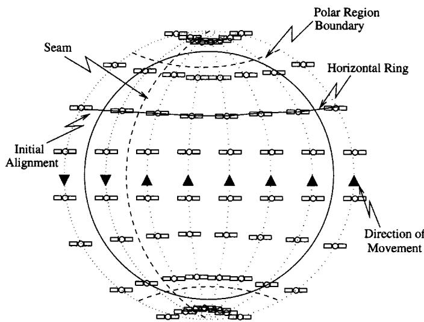  
Fig. 1. Orbital planes around the Earth.

In this work, we extend the datagram routing algorithm [10]. The new datagram routing algorithm generates minimum propagation delay paths between source and destination. The new routing algorithm is distributed, i.e., the routing decisions are made independently for each packet. The packets are routed between the logical locations, which are embodied by the closest satellites. The algorithm causes no overhead since the satellites do not exchange any topology information. Our algorithm also avoids congestions and failures at low cost making local decisions. Since the algorithm is datagram based, there is no need for handovers of established connection paths, as is the case for algorithms in connection-oriented networks mentioned above.

The paper is organized as follows. In Section II we explain the satellite network architecture, and in Section III we describe the new datagram routing algorithm. In Section IV we present performance analysis of the new algorithm and in Section V we conclude the paper.

## II. SATELLITE NETWORK ARCHITECTURE

The satellite network is composed of polar orbits (planes), each with satellites at low distances from the Earth as shown in Fig. 1. The planes are separated from each other with the same angular distance of $3 6 0 ^ { \circ } / ( 2 \times N )$ . They cross each other only over the North and South poles. The satellites in a plane are separated from each other with an angular distance of $3 6 0 ^ { \circ } / M$ Since the planes are circular, the radii of the satellites in the same plane are the same at all times and so are the distances from each other. This satellite constellation is classified as Walker type with parameters $M \times N / N / 0 ^ { \circ } \left[ 1 1 \right]$ .

The geographical location of a satellite is given by $[ l o n _ { S } , \mathrm { l a t } _ { S } ]$ indicating the longitude and latitude of the location of , respectively. We assume that the entire Earth is covered by logical locations of satellites. These logical locations do not move and are filled by the nearest satellite. Hence, the identity of the satellite is not permanently coupled with its logical location, which is taken over by the successor satellite in the same plane. The logical location of a satellite is given by $\langle p , s \rangle$ where , for $p = 0 , \ldots , N - 1$ , is the plane number and , for $s = 0 , . . . , M - 1$ , is the satellite number. The routing is performed basically by considering these logical locations as hops. By this way, we do not need to be concerned with the satellite movements.

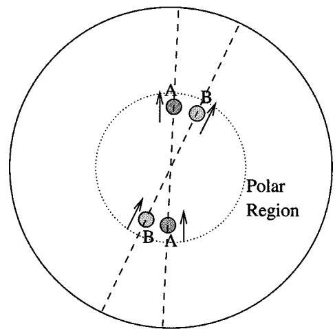  
Fig. 2. Switching of left and right neighbors in polar regions.

Each satellite has four neighboring satellites: two in the same plane and two in the left and right planes. The links between satellites in the same plane are called intraplane ISLs. The links between satellites in different planes are called interplane ISLs. On intra- and interplane ISLs, the communication is bidirectional.

The intraplane ISLs are maintained at all times, i.e., each satellite is always connected to the rest of the network through its up and down neighbors. The propagation delay on the intraplane links is always fixed. All satellites are moving in the same circular direction within the same plane. As a consequence, any satellite that is observed from the Earth moving from South to North will be observed to start moving from North to South when it crosses the North pole. Hence, the 0th and th planes rotate in opposite directions. The borders of counter-rotating satellites are called seams, as shown in Fig. 1.

The interplane ISLs are operated only outside the polar regions. When the satellites move toward the polar regions, the interplane ISLs become shorter. When two satellites in adjacent planes cross the poles, they switch their positions. In order to allow this switching, the interplane ISLs are shut down in polar regions and re-established outside of the polar regions, as shown in Fig. 2.

The length $L _ { v }$ of all intraplane ISLs is fixed and is computed by

$$
L _ {v} = \sqrt {2} R \sqrt {1 - \cos \left(\frac {3 6 0 ^ {\circ}}{M}\right)}\tag{1}
$$

where is the radius of the plane.

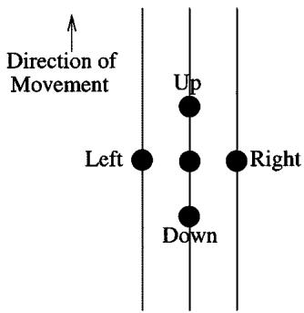  
Fig. 3. Neighbor concept.

The length $L _ { h }$ of interplane ISLs is variable and is calculated by

$$
L _ {h} = \alpha \times \cos (\mathrm{lat})\tag{2}
$$

where

$$
\alpha = \sqrt {2} R \sqrt {1 - \cos \left(\frac {3 6 0 ^ {\circ}}{2 \times N}\right)}
$$

with as the latitude at which the interplane ISL resides.

## III. DATAGRAM ROUTING ALGORITHM

The connection structure of the satellites and their deterministic movements around the Earth simplify the design of efficient and robust routing algorithms for datagram traffic. First, we give definitions and theorems which will be used for the new routing algorithm.

## A. Definitions

Definition 1: Neighbor Concept. Each satellite has two neighbors in the same plane and two neighbors in adjacent planes, as shown in Fig. 3. The neighbor in the direction of orbital movement is labeled as up and in the opposite direction as down. The satellites in adjacent planes are called left and right neighbors.

Definition 2: Eastern and Western Hemisphere. A point in space is considered in the Eastern (Western) hemisphere if it is located to the east (west) of the first half of the seam. The first half of the seam is the part of the boundary, where a satellite moving to North has a neighbor to its west, which is moving to South.

Definition 3: Initial Alignment. The satellite network is said to be in initial alignment if all satellites with satellite number (satellites on one side of the seam) and satellite number $( M - k - 1 )$ (satellites on the other side of the seam) are positioned at the same latitude as shown in Fig. 1. In this case, all interplane ISLs become parallel to the equator and all satellites are exactly in the centers of their logical locations.

Definition 4: Horizontal Ring. The satellites on the same latitude with the initial alignment and the ISLs connecting them constitute a horizontal ring as shown in Fig. 1. The two horizontal rings closest to the polar regions are positioned at the latitude $ { \mathrm { f } _ { \mathrm { m i n } } }$ . Note that the difference between the horizontal rings and latitudes is that the horizontal rings may have different latitude values as the satellites move.

Definition 5: Multihop Path. Any source–destination satellite pair in the network can be connected by using multihop paths. Let a multihop path $P _ { S _ { 0 } } \longrightarrow S _ { n }$ be defined as the ordered list of links $\{ l _ { S S ^ { \prime } } \}$ such that

$$
P _ {S _ {0}} \rightarrow S _ {n} = \{l _ {S _ {0} S _ {1}}, l _ {S _ {1} S _ {2}}, \dots , l _ {S _ {n - 1} S _ {n}} \}\tag{3}
$$

forms an -hop path from source satellite $S _ { 0 }$ to destination satellite $S _ { n }$

Definition $6 \cdot$ Total Propagation Delay. The total propagation delay $D _ { P }$ on the path $P$ is simply the sum of all individual propagation delays on each hop of the same path

$$
D _ {P} = \sum_ {i = 0} ^ {n - 1} \mathcal {D} (l _ {S _ {i} S _ {i + 1}})\tag{4}
$$

where $\mathcal { D } ( l _ { S S ^ { \prime } } )$ is the propagation delay on each hop, i.e., from satellite to satellite $S ^ { \prime }$

Definition 7: Minimum Propagation Delay Path. The minimum propagation delay path $P _ { S _ { 0 }  S _ { \uparrow } } ^ { * }$ between $S _ { 0 }$ and $S _ { n }$ is defined as

$$
P _ {S _ {0} \to S _ {n}} ^ {*} = \arg \min _ {P \in \{P _ {S _ {0} \to S _ {n}} \}} \{D _ {P} \}\tag{5}
$$

where $\{ P _ { S _ { 0 } \to S _ { \pi } } \}$ is the set of all multihop paths from $S _ { 0 }$ to $S _ { n }$ $P _ { S _ { 0 }  S _ { \it n } } ^ { V }$ is defined as the minimum propagation delay path among the set of paths from $S _ { 0 }$ to $S _ { n }$ that cross any polar region. Similarly, $P _ { S _ { 0 }  S _ { r } } ^ { H }$ is the minimum propagation delay path among the set of paths that do not cross a polar region. Note that

$$
P _ {S _ {0} \to S _ {n}} ^ {*} = \arg \min \left\{D _ {P _ {S _ {0} \to S _ {n}} ^ {V}}, D _ {P _ {S _ {0} \to S _ {n}} ^ {H}} \right\}.
$$

## B. Decision Maps

The decision map is used by each satellite to decide on the outgoing link for each packet such that the generated path has the minimum propagation delay. To create the decision map we derived the following lemmas and theorems where we used the assumption that the satellites are in the initial alignment (Definition 3).

At this point, we point out the grid structure of the satellites which cover the entire Earth. This grid structure could be regarded as a type of Manhattan Street Network [12], which has been researched extensively in the last decade. However, there is a major difference here. The distances between the satellites in different latitudes are changing, e.g., they become shorter in the latitudes closer to the poles and longer in the latitudes closer to equator [(2)]. Keeping this fact in mind, we need to design our new routing algorithm in such a way that the shortest end-to-end delay path between source and destination will be determined. Since we assume very minimal processing in the on-board switches, the delay caused by these events can be assumed to be negligible and the end-to-end delay will involve only the propagation delays between the satellites.

Lemma 1: Assume the source satellite $S _ { 0 }$ resides at $\langle p _ { S _ { 0 } } , s _ { S _ { 0 } } \rangle$ and the destination satellite $S _ { n }$ at $\langle p _ { S _ { \imath } } , s _ { S _ { \imath } } \rangle$ . Also assume that both satellites are outside of the polar regions. Further assume that $S _ { 0 }$ resides at a latitude higher than the latitude of $S _ { n } , { \mathrm { i . e . , } } \left| \operatorname { l a t } _ { S _ { 0 } } \right| > \left| \operatorname { l a t } _ { S _ { n } } \right.$ .

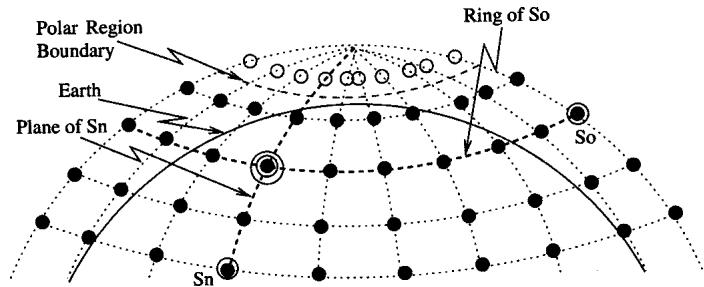  
Fig. 4. Example of Lemma 1.

1) If $S _ { 0 }$ and $S _ { n }$ are on the same side of the seam (in the same hemisphere), then the minimum propagation delay path from $S _ { 0 }$ to $S _ { n } ( P _ { S _ { 0 }  S _ { n } } ^ { * } )$ passes through the satellite at $\langle p _ { S _ { \imath } } , s _ { S _ { 0 } } \rangle$ , i.e., this satellite is in the same horizontal ring (Definition 4) as the source satellite $S _ { 0 }$ and is in the same plane as the destination satellite $S _ { n }$

2) If $S _ { 0 }$ and $S _ { n }$ are on different sides of the seam (in different hemispheres), then $P _ { S _ { 0 }  S _ { \uparrow } } ^ { * }$ passes through the satellite $\langle p _ { S _ { n } } , ( N - 1 - s _ { S _ { 0 } } ) \rangle$ , i.e., this satellite is in the same horizontal ring (Definition 4) as the source satellite $S _ { 0 }$ but on the other side of the seam and is on the same plane as the destination satellite $S _ { n }$

Proof:

1) Suppose $P _ { S _ { 0 }  S _ { \eta } } ^ { * }$ does not pass through the polar region. Then the horizontal hops of this path are either in the same ring as the source or in rings at higher latitudes. Taking these horizontal hops, eventually a satellite at $\langle p _ { S _ { \imath } } , s _ { S _ { 0 } } \rangle$ in the same ring as $S _ { 0 }$ and in the same plane as $S _ { n }$ will be reached. The satellite at $\langle p _ { S _ { \imath } } , s _ { S _ { 0 } } \rangle$ is shown in Fig. 4 as a node with two circles around it. From this satellite at $\langle p _ { S _ { \imath } } , s _ { S _ { 0 } } \rangle$ , the vertical hops will then lead to $S _ { n }$

Suppose $P _ { S _ { 0 }  S _ { \eta } } ^ { * }$ crosses the polar region. Then the horizontal hops are taken in the ring closest to the polar region until the plane of $S _ { n }$ is reached. Then the vertical hops take the packets through the polar region directly to $S _ { n }$ . Since $S _ { n }$ is at a lower latitude, the vertical hops would pass through the satellite at $\langle p _ { S _ { \imath } } , s _ { S _ { 0 } } \rangle$ , which is in the same horizontal ring as $S _ { 0 }$ and in the same plane as $S _ { n }$

2) Again here, $P _ { S _ { 0 }  S _ { \uparrow } } ^ { * }$ would pass through the satellite located in $\langle p _ { S _ { n } } , ( N - 1 - s _ { S _ { 0 } } ) \rangle$ , which is in the same ring as $S _ { 0 }$ and in the same plane as $S _ { n }$

From Lemma 1 it follows that all source–destination satellite pairs must pass through a satellite that is in the same ring as the source and in the same plane as the destination. The path from that satellite to the destination only involves vertical hops.

Lemma 2: Assume $S _ { 0 }$ and $S _ { n }$ are in the same horizontal ring outside of the polar regions. Also assume that the polar regions will not be crossed. Then $P _ { S _ { 0 }  S _ { n } } ^ { H }$ (Definition $7 )$ involves all horizontal hops on any ring between $S _ { 0 }$ and the polar region.

Proof: Since the polar regions are not crossed, the horizontal hops are taken on any ring between $S _ { 0 }$ and the polar regions because the interplane ISLs are longer in rings at lower latitudes than $S _ { 0 }$ . Consequently, the propagation delay is shorter in the rings at higher latitudes. Assume there is a path shown as dashed line in Fig. 5. We can find a shorter propagation delay path (solid line) by taking vertical hops in the same plane to the ring at the highest latitude close to the polar region, then take the horizontal hops in that ring, reaching the plane of $S _ { n }$ and take vertical hops to reach $S _ { n } .$ It is easy to see that the solid path is shorter than the dashed one because the horizontal hops are shorter. The lengths of vertical hops are equal for both paths.

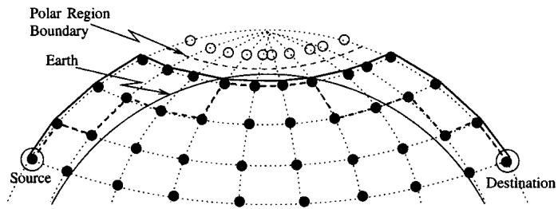  
Fig. 5. Example for Lemma 2.

According to Lemma 2, if $P _ { S _ { 0 }  S _ { n } } ^ { * }$ does not cross the polar region $( P _ { S _ { 0 }  S _ { n } } ^ { H ^ { - } } )$ , then horizontal hops are taken in a ring between the polar region and the ring of $S _ { 0 } .$ . If there are $A$ rings between the source satellite and the polar regions, then there are $A { + } 1$ candidates for $P _ { S _ { 0 }  S _ { \it n } } ^ { H }$ , including the possibility of taking all horizontal hops in the ring of the source satellite. If the polar regions are crossed, the $P _ { S _ { 0 }  S _ { 7 } } ^ { * }$ can easily be determined. In this case, the number of vertical hops is fixed and the horizontal hops are taken in the ring closest to the polar region where the interplane ISLs are the shortest. Comparing the lengths of the paths crossing the polar region and all other paths not crossing it, we can decide on the final path. The following theorems help us with these decisions.

Theorem $\boldsymbol { l } \boldsymbol { : }$ Let $S _ { 0 }$ and $S _ { n }$ be outside of the polar regions and $S _ { 0 }$ be at a higher latitude, , than $S _ { n }$ . Assume that $S _ { 0 }$ is $( A \ge 0 )$ hops away from the horizontal ring closest to the polar region and that the ring of $S _ { 0 }$ is the th $( k > 0 )$ horizontal ring when counted from the closest pole. $P _ { S _ { 0 }  S _ { \uparrow } } ^ { * }$ crosses the polar region if the number of horizontal hops $n _ { h }$ between $S _ { 0 }$ and $S _ { n }$ satisfies

$$
n _ {h} > \max _ {0 \leq a \leq A} \left\{\frac {N \cos (\mathrm{lat} _ {\min}) + \frac {L _ {v}}{\alpha} (2 (k - a) + 1)}{\cos \left(\mathrm{lat} + a \frac {3 6 0 ^ {\circ}}{M}\right) + \cos (\mathrm{lat} _ {\min})} \right\}\tag{6}
$$

where $L _ { v }$ and are given in (1) and (2), respectively, and $\mathrm { { l a t } } _ { \mathrm { { m i n } } }$ is the latitude of the ring closest to the polar region.

Proof: We compare the propagation delays of paths from $S _ { 0 }$ to $S _ { n }$ with and without crossing the polar region. The path over polar region takes the necessary $( N - n _ { h } )$ horizontal hops in the ring closest to the polar region at latitude $\mathrm { l a t } _ { \mathrm { m i n } }$ and has a propagation delay $D _ { v }$ . The path without the polar region takes the horizontal hops in a ring, which is $a$ hops closer to the polar region, for $a = 0 , . . . , A ,$ , with the propagation delay $D _ { h + a }$ The path crossing the polar region is shorter if $D _ { v }$ is less than $D _ { h + a }$ for all possible values of $a .$

$$
\begin{array}{l} D _ {v} <   D _ {h + a} \\ (N - n _ {h}) \alpha \cos (\mathrm{lat}) + L _ {v} (2 k + 1) \\ <   n \alpha \cos \left(\mathrm{lat} _ {\min} + a \frac {3 6 0 ^ {\circ}}{M}\right) + 2 a L _ {v}. \end{array}\tag{7}
$$

To guarantee that the path over polar regions is $P _ { S _ { 0 }  S _ { n } } ^ { * } , ( 7 )$ must hold for all possible values of . Solving the equation above for $n _ { h }$ , the statement in Theorem 1 can be reached. If $S _ { n }$ is at a higher latitude than $S _ { 0 } ,$ then a similar argumentation leads us to the same result.

In Theorem 2 below, we present a decision criterion for staying in the same horizontal ring or going to another ring at a higher latitude.

Theorem $2 { : }$ Let $S _ { 0 }$ and $S _ { n }$ be outside of the polar regions and $S _ { 0 }$ be at a higher latitude than $S _ { n } .$ . Assume that $S _ { 0 }$ is $A$ $( A \ge 0 )$ hops away from the horizontal ring closest to the polar region and that the ring of $S _ { 0 }$ is the th $( k > 0 )$ horizontal ring when counted from the closest pole. $P _ { S _ { 0 }  S _ { \eta } } ^ { * }$ has all horizontal hops in the same ring as $S _ { 0 }$ if the condition in Theorem 1 is not satisfied and if the number of horizontal hops, $n _ { h }$ , between $S _ { 0 }$ and $S _ { n }$ satisfies

$$
n _ {h} <   \min _ {1 \leq a \leq A} \left\{\frac {2 a L _ {v}}{\alpha} \frac {1}{\cos (\mathrm{lat}) - \cos \left(\mathrm{lat} + a \frac {3 6 0 ^ {\circ}}{M}\right)} \right\},\tag{8}
$$

Proof: Since we assumed that the condition in Theorem 1 is not satisfied, the path should not cross the polar regions. In order to take the horizontal hops in the same ring of $S _ { 0 } .$ , any path with horizontal hops at a higher latitude must have a longer propagation delay. If we denote the propagation delay of the path in the ring of $S _ { 0 }$ as $D _ { h }$ and the propagation delay of a path that takes the horizontal hops in a ring hops away from the th ring as $D _ { h + a } ,$ , then the following must be satisfied for all values of $a , 1 \leq a \leq A ;$

$$
\begin{array}{c} {D _ {h} <   D _ {h + a}} \\ {n _ {h} \alpha \cos (\mathrm{lat}) <   n _ {h} \alpha \cos \left(\mathrm{lat} + a \frac {3 6 0 ^ {\circ}}{M}\right) + 2 a L _ {v}.} \end{array}\tag{9}
$$

Solving (9) for $n _ { h }$ , the statement in Theorem 2 can be reached.

The criteria presented in Theorems 1 and 2 help us to decide on the next hop such that the packet is forwarded on $P _ { S _ { 0 }  S _ { \pi } } ^ { * }$ For this purpose, we created a decision map for the satellite network. Using the decision map, each satellite decides on whether a packet will cross a polar regions or not. In Fig. 6, we show the decision map for a particular network with $N = 1 2$ planes, each containing $M = 2 4$ satellites. The latitudes of the rings are indicated by $" \wedge '$ on the -axis. The latitude of the current satellite $S _ { c }$ and the remaining horizontal hop count to $S _ { n }$ identifies a point on the decision map. The area above the solid line is the region where (6) is satisfied. The area below the dashed line is the region where (8) is satisfied.

## C. Routing Algorithm

For any set of parameters that describes the satellite network, it is possible to find minimum propagation delay paths between all source–destination pairs that are outside of the polar regions. A careful consideration would lead to more generalized paths that would also include the satellites in the polar regions.

The new routing algorithm generates the paths in a different way, i.e., the satellites process every incoming packet independently, assuring that the packets will be forwarded on $P _ { S _ { 0 }  S _ { \uparrow } } ^ { * }$ as the result of their collective behavior. The next hop on the path is determined in three phases. In the direction estimation phase, possible next hops on the minimum-hop path are determined assuming that all ISLs have equal length. With this assumption, a minimum-hop path becomes also a minimum propagation delay path. However, this is not exactly what we are interested in because the lengths of ISLs are different in these networks, as we mentioned before. Thus, we have the direction enhancement phase, where we consider that the interplane ISLs have different lengths [(2)] and refine our decision made in the first phase about the next hop accordingly. The primary direction chosen in the direction enhancement phase ensures that the packets are routed on $P _ { S _ { 0 }  S _ { \it n } } ^ { * }$ . In the case of link congestions, the queueing delay has a larger effect on the end-to-end delay of the packets, hence, the packets sent on $P _ { S _ { 0 }  S _ { 7 } } ^ { * }$ may experience high delays. In order to reduce the negative effects of congested links, the routing decisions are revised in the congestion avoidance phase. These three phases are explained in detail in the following three subsections.

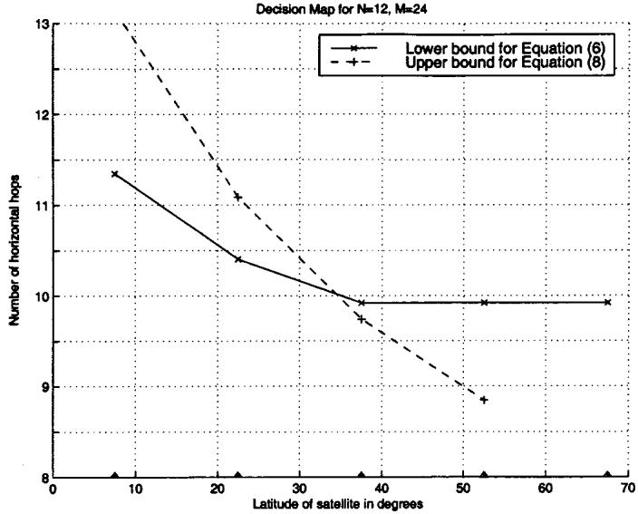  
Fig. 6. Decision map for a constellation with twelve planes and 24 satellites.

1) Direction Estimation: The direction estimation phase deals with the determination of the next hop on the minimum-hop path. The number and direction of hops on a minimum-hop path are called minimum hop metrics, which consist of a pair of direction indicators, $d _ { v }$ and $d _ { h }$ , and a pair of number of hops for each direction, ${ { n } _ { v } } \in \{ 0 , 1 , . . . , M \}$ and ${ { n } _ { h } } \in \{ 0 , 1 , . . . , N \}$ . The vertical movements are described by

$$
d _ {v} = \left\{ \begin{array}{l l} + 1, & \text { upward } \\ 0, & \text { no   vertical   movement } \\ - 1, & \text { downward }. \end{array} \right.\tag{10}
$$

The horizontal movements are described by

$$
d _ {h} = \left\{ \begin{array}{l l} + 1, & \text { right } \\ 0, & \text { no   horizontal   movement } \\ - 1, & \text { left. } \end{array} \right.\tag{11}
$$

To determine minimum hop metrics, we use the logical locations of the current satellite $S _ { c }$ and destination satellite $S _ { n }$ . Let $S _ { c }$ be at $\langle p _ { S _ { c } } , s _ { S _ { c } } \rangle$ on $P _ { S _ { 0 }  S _ { \eta } } ^ { * }$ and $S _ { n } \mathrm { a t } \langle p _ { S _ { n } } , s _ { S _ { n } } \rangle$ 1

TABLE I  
CALCULATION OF DIRECTIONS FOR $P _ { S _ { c }  S _ { \uparrow } } ^ { H }$

<table><tr><td colspan="6"> $S_c$  &amp;  $S_n$  in the Same Hemisphere</td></tr><tr><td colspan="3"> $ps_c$   $ps_n$ </td><td colspan="3"> $s_{S_c}$   $s_{S_n}$ </td></tr><tr><td>&lt;</td><td>&gt;</td><td>=</td><td>&lt;</td><td>&gt;</td><td>=</td></tr><tr><td> $d_h = +1$ </td><td> $d_h = -1$ </td><td> $d_h = 0$ </td><td> $d_v = -1$ </td><td> $d_v = +1$ </td><td> $d_v = 0$ </td></tr></table>

<table><tr><td colspan="6"> $S_c$  &amp;  $S_n$  in Different Hemispheres</td></tr><tr><td colspan="3"> $p_{S_c}$   $p_{S_n}$ </td><td colspan="3"> $(M - 1 - s_{S_c})$   $s_{S_n}$ </td></tr><tr><td>&lt;</td><td>&gt;</td><td>=</td><td>&lt;</td><td>&gt;</td><td>=</td></tr><tr><td> $d_h = -1$ </td><td> $d_h = +1$ </td><td>-</td><td> $d_v = +1$ </td><td> $d_v = -1$ </td><td> $d_v = 0$ </td></tr></table>

• If $s _ { S _ { c } } < M / 2$ and $s _ { S _ { \imath } } < M / 2$ with as the number of the satellites in a plane, then $S _ { c }$ and $S _ { n }$ are in the Eastern Hemisphere, on the same side of the seam.

• If $s _ { S _ { c } } \geq M / 2$ and $s _ { S _ { \imath } } \geq M / 2$ , then they both are in the Western Hemisphere, on the other side of the seam.

• Otherwise, $S _ { c }$ and $S _ { n }$ are on different sides of the seam. After determining the respective locations of $S _ { c }$ and $S _ { n } ,$ , the numbers of hops for $P _ { S _ { c }  S _ { \imath } } ^ { V }$ and $P _ { S _ { c }  S _ { \it n } } ^ { H }$ (Definition 7) are calculated assuming that all ISLs have the same length. The path with minimum number of hops is chosen as the minimum hop metrics. The procedure is as follows.

1) $\operatorname { I f } S _ { c }$ and $S _ { n }$ are on the same side of the seam:

a) The number of vertical hops for $P _ { S _ { c }  S _ { n } } ^ { H }$ is $n _ { v } =$ $| s _ { S _ { c } } - s _ { S _ { \imath } } |$ and the number of horizontal hops is $n _ { h } = | p _ { S _ { c } } - p _ { S _ { \imath } } |$ . Their sum gives the total hop number for $P _ { S _ { c }  S _ { \it n } } ^ { H }$

b) The number of horizontal hops for $P _ { S _ { c }  S _ { \eta } } ^ { V }$ is $n _ { h } =$ $\left( N - \left| p _ { S _ { c } } - p _ { S _ { \pi } } \right| \right)$ . If and $S _ { n }$ are in the Eastern Hemisphere, then number of vertical hops is $n _ { v } =$ min $\left[  ( s _ { S _ { c } } + s _ { S _ { n } } + 1 ) , M - ( s _ { S _ { c } } + s _ { S _ { n } } + 1 ) \right\}$ . If $S _ { c }$ and $S _ { n }$ are both in the Western Hemisphere, then the number of vertical hops is $n _ { v } = \operatorname* { m i n } \{ 2 \times M -$ $( s _ { S _ { c } } + s _ { S _ { n } } + 1 ) , ( s _ { S _ { c } } + s _ { S _ { n } } + 1 ) - M \}$ . The sum of the number of vertical and horizontal hops gives the total hop number for $P _ { S _ { c }  S _ { \imath } } ^ { V }$

2) If $S _ { c }$ and $S _ { n }$ are on different sides of the seam:

a) For $P _ { S _ { c }  S _ { \imath } } ^ { H }$ , the number of vertical hops is $n _ { v } =$ $| M - \bar { s } _ { S _ { c } } - \bar { s } _ { S _ { n } } - 1 |$ and the number of horizontal hops is $n _ { h } = ( M + | p _ { S _ { c } } - p _ { S _ { n } } | )$ . Their sum gives the total hop number for $P _ { S _ { c }  S _ { \it n } } ^ { H }$

b) For $P _ { S _ { c }  S _ { n } } ^ { V }$ , the number of horizontal hops is $n _ { h } =$ $| p _ { S _ { c } } - p _ { S _ { \imath } } |$ . The number of vertical hops is given by $n _ { v } = \operatorname* { m i n } \{ \vert s _ { S _ { n } } - s _ { S _ { c } } \vert , M - \vert s _ { S _ { n } } - s _ { S _ { c } } \vert \}$ . The sum of vertical and horizontal hop numbers gives the total hop number for $P _ { S _ { c }  S _ { \imath } } ^ { V }$

Among $P _ { S _ { c }  S _ { \uparrow } } ^ { H }$ and $P _ { S _ { c }  S _ { \it n } } ^ { V }$ , the one with minimum total hop number is chosen and their horizontal $n _ { h }$ and vertical hop numbers $n _ { v }$ are recorded. If $P _ { S _ { c }  S _ { \eta } } ^ { H }$ is the minimum-hop path, then the directions for horizontal $d _ { h }$ and vertical hops $d _ { v }$ are determined using Table I. If $P _ { S _ { c }  S _ { \eta } } ^ { V }$ is the minimum-hop path, then the directions $d _ { h }$ and $d _ { v }$ are determined using Table II.

The usage of the Tables I and II can be illustrated with the following example: Assume $S _ { c }$ is at $\langle 2 , 8 \rangle$ and $S _ { n }$ is at $\langle 5 , 6 \rangle$ in a network with $N = 1 2$ planes, each with $M = 2 4$ satellites. The portion of the network that contains $S _ { c }$ and $S _ { n }$ are shown in Fig. 7. Following the procedure described in this section, $P _ { S _ { c }  S _ { \it n } } ^ { H }$ is chosen as the minimum-hop path with ${ { n } _ { v } } = 2$ and $n _ { h } = 3$ . Since $P _ { S _ { c }  S _ { \uparrow } } ^ { H }$ is chosen, we use Table I. $S _ { c }$ and $S _ { n }$ 7 are in the same hemisphere, hence we use the upper part of the table. To determine the direction, the numbers in each cell of the second row are compared. We find that $p _ { S _ { c } } < p _ { S _ { n } } ( 2 < 5 )$ and $s _ { S _ { c } } > s _ { S _ { n } } ( 8 > 6 )$ , and hence the horizontal hops should be taken to right $( d _ { h } = + 1 )$ and the vertical hops should be taken upwards $( d _ { v } = + 1 )$ .

TABLE II  
CALCULATION OF DIRECTIONS FOR $P _ { S _ { c }  S _ { \uparrow } } ^ { V }$

<table><tr><td colspan="6"> $S_c$  &amp;  $S_n$  in Eastern Hemisphere</td></tr><tr><td colspan="3"> $p_{S_c}$   $p_{S_n}$ </td><td colspan="3"> $2(s_{S_n}+s_{S_c}+1)$  M</td></tr><tr><td>&lt;</td><td>&gt;</td><td>=</td><td>&lt;</td><td>&gt;</td><td>=</td></tr><tr><td> $d_h=-1$ </td><td> $d_h=+1$ </td><td> $d_h=+1$ </td><td> $d_v=+1$ </td><td> $d_v=-1$ </td><td> $d_v=+1$ </td></tr></table>

<table><tr><td colspan="6"> $S_c$  &amp;  $S_n$  in Western Hemisphere</td></tr><tr><td colspan="3"> $p_{S_c}$   $p_{S_n}$ </td><td colspan="2"> $2(s_{S_c}+s_{S_n}+1)$ </td><td>3M</td></tr><tr><td>&lt;</td><td>&gt;</td><td>=</td><td>&lt;</td><td>&gt;</td><td>=</td></tr><tr><td> $d_h=-1$ </td><td> $d_h=+1$ </td><td> $d_h=+1$ </td><td> $d_v=+1$ </td><td> $d_v=-1$ </td><td> $d_v=-1$ </td></tr></table>

<table><tr><td colspan="6"> $S_c$  in Eastern &amp;  $S_n$  in Western Hemisphere</td></tr><tr><td colspan="3"> $p_{S_c}$   $p_{S_n}$ </td><td colspan="3"> $2(s_{S_n}-s_{S_c})$  M</td></tr><tr><td>&lt;</td><td>&gt;</td><td>=</td><td>&lt;</td><td>&gt;</td><td>=</td></tr><tr><td> $d_h=+1$ </td><td> $d_h=-1$ </td><td> $d_h=0$ </td><td> $d_v=-1$ </td><td> $d_v=+1$ </td><td> $d_v=+1$ </td></tr></table>

<table><tr><td colspan="6"> $S_c$  in Western &amp;  $S_n$  in Eastern Hemisphere</td></tr><tr><td colspan="3"> $p_{S_c}$   $p_{S_n}$ </td><td colspan="3"> $2(s_{S_c}-s_{S_n})$  M</td></tr><tr><td>&lt;</td><td>&gt;</td><td>=</td><td>&lt;</td><td>&gt;</td><td>=</td></tr><tr><td> $d_h=+1$ </td><td> $d_h=-1$ </td><td> $d_h=0$ </td><td> $d_v=+1$ </td><td> $d_v=-1$ </td><td> $d_v=-1$ </td></tr></table>

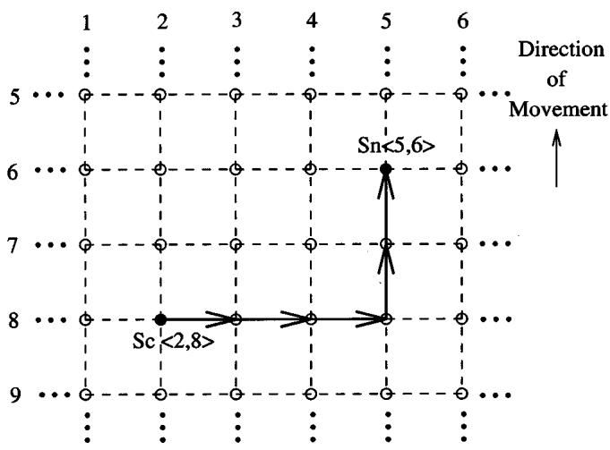  
Fig. 7. Example for calculation of directions for minimum-hop paths.

The assumption we made for this phase, i.e., that all ISLs have the same length, gives us the flexibility to take either the horizontal or vertical hop indicated by $d _ { v }$ , [(10)], and $d _ { h }$ , [(11)]. Taking the horizontal and vertical hops in any combination would produce a minimum-hop path. In fact, the ISLs have different lengths and the packets can be routed on $P _ { S _ { 0 }  S _ { \eta } } ^ { * }$ only if they are taken in a specific order. The next hop on $P _ { S _ { 0 }  S _ { r } } ^ { * }$ is uniquely determined in the direction enhancement phase. Other possible minimum-hop paths are used as backup paths in cases of congestion and satellite failure, which will be covered in Section III-C-3.

2) Direction Enhancement: In the direction enhancement phase, satellites label the directions calculated in the direction estimation phase as primary and secondary. If the packets follow only the primary directions, then they are routed on the minimum propagation delay path $P _ { S _ { 0 }  S _ { \pi } } ^ { * }$ . For this purpose, the minimum hop metrics described in Section III-C-1 and the decision map described in Section III-B are used together. The determination of the primary and secondary directions is accomplished as follows.

1) If $S _ { c }$ is in a polar region, then the next hop for the incoming packet should lead to a satellite in the same plane. If $d _ { v }$ [(10)] is not zero, then the direction indicated by $d _ { v }$ is marked as primary, and $d _ { h }$ is reset to zero. If $d _ { v }$ equals zero, that means that $S _ { n }$ is also in the same polar region. Thus, the packet must be forwarded toward the nearest satellite outside of the polar region. Hence, $d _ { v }$ is set such that it points to the nearest satellite outside of the polar region, marked as primary, and $d _ { h }$ [(11)] is reset to zero.

2) If $S _ { c }$ is in the last horizontal ring before the polar region, then the horizontal hops are given priority since the horizontal links are shortest in that ring. If $d _ { h }$ [(11)] is nonzero, meaning that the packet has to move horizontally, $d _ { h }$ is marked as primary, and $d _ { v } \left[ ( 1 0 ) \right]$ , as secondary if it is nonzero. If $d _ { h }$ equals zero, then $d _ { v }$ is marked as the primary direction.

3) In other parts of the network, $S _ { c }$ marks the directions of the incoming packets as follows:

a) If the number of horizontal hops $n _ { h }$ calculated in direction estimation phase satisfies $\left( 6 \right)$ , the packet must cross the polar region. Then $d _ { v }$ [(10)] becomes the primary direction. This assures that the packet takes the horizontal hops in the smallest ring, i.e., in the ring closest to the polar region. The horizontal direction, $d _ { h }$ [(11)] is marked as the secondary direction if it is nonzero.

b) If $n _ { h }$ does not satisfy (6) and (8) at the same time, then the horizontal hops should be taken in a ring closer to the polar region. Hence, the vertical direction $d _ { v }$ [(10)] is set such that it points to the neighboring satellite at a higher latitude, and marked as the primary direction. The horizontal direction $d _ { h }$ [(11)] is marked as the secondary direction.

c) In all other cases, the latitudes of $S _ { c }$ and $S _ { n }$ are compared. If $S _ { c }$ is at a higher latitude than $S _ { n } ,$ then the horizontal direction $d _ { h }$ [(11)] is marked as the primary direction. Otherwise, the packet should be forwarded vertically to the horizontal ring of $S _ { n } .$ hence the vertical direction $d _ { v } \ [ ( 1 0 ) ]$ is marked as primary. If $d _ { h }$ is zero, then the only choice is to forward the packet vertically, and therefore, $d _ { v }$ is marked as the primary direction.

To make the decisions in steps 3.a and 3.b, we can make use of the decision map generated for the network. The decision map of a satellite network can be stored on-board of each satellite since it does not change throughout the lifetime of the network.

3) Congestion Avoidance: In the datagram routing algorithm, the satellites do not exchange traffic load information. The routing decisions made in the first two phases are based on the propagation delay calculations. Therefore, congested links are not considered when the directions are calculated. If the packets are routed regardless of the congestions in the network, packets may suffer from long end-to-end delays. In the congestion avoidance phase, the routing decisions made in the first two phases are revised according to the congestion level of the incident ISLs.

Since no traffic load information is exchanged between the satellites, the congested links are detected by considering the fill levels of the output buffers. If the next hop of a packet is associated with an overloaded output buffer, i.e., if the output buffer has more than $\xi$ packets, then this situation is interpreted as a congestion occurrence. The main idea behind the congestion avoidance phase is to send the packets in their secondary directions, if the link in the primary direction is congested. The steps of this phase are as follows:

1) If $S _ { c } = S _ { n }$ , i.e., current satellite is the destination satellite, then the packet is not forwarded to neighboring satellites. It is sent to the gateway or any other appropriate receiver on the surface of the Earth.

2) If the secondary direction of a packet (either $d _ { v }$ or $d _ { h } )$ is zero, then the packet is sent in the primary direction, regardless of the number of the packets in the output buffers.

3) If the output buffer of the primary direction has less than packets, then it is sent in the primary direction.

4) If there are more than $\xi$ packets in the output buffer of the primary direction and less than $\xi$ packets in the output buffer of the secondary direction, then the packet is sent in the secondary direction. If output buffers of both primary and secondary directions have more than packets, then the packet is still sent in the primary direction.

As a result of this phase, the packets are routed on one of the minimum-hop paths. If a packet follows the primary directions in each hop, it is forwarded on the minimum propagation delay paths. Also note that, to ensure the loop-free routing, the packets are never sent back to satellites where they came from, unless the current satellite is in one of the polar regions.

The three phases of the next hop calculation are designed for networks which do not have any failed satellites. In case of a satellite failure, the steps above must be changed such that the neighboring satellites deflect the packets that pass through the failed satellite instead of dropping them. In other words, the packets are rerouted around the points of failure. In this case, the primary concern is not to drop the packets instead of reducing the queueing delay. In order to reroute packets destined to the failed satellite, they are deflected into orthogonal directions. The congestion avoidance phase has the following structure when a neighboring satellite fails:

1) If $S _ { c } = S _ { n }$ , i.e., the current satellite is the destination satellite, then the packet is not forwarded to neighboring satellites. It is sent to the gateway or any other appropriate receiver on the surface of the Earth.

Packet Processing Time of Bellman's Algorithm and Datagram Routing Algorithm

2) If the satellite in the primary direction of a packet has not failed, then the packet is sent in the primary direction.

3) If the current satellite is in the polar region and the next satellite has failed, the packet is sent back to the previous hop, which is the only available direction.

4) If the satellite in the primary direction has failed and the packet has a secondary direction, then it is sent in the secondary direction.

5) If the satellite in the primary direction has failed, but the packet has no secondary direction, then it is sent in a direction orthogonal to the primary direction, which is not the previous hop.

This rerouting strategy finds alternative routes for packets that would normally pass through a failed satellite. However, it does not guarantee that the packets are routed on a minimum-hop path.

## D. Time and Space Complexity

The packet processing time is one of the most important features of a datagram-based routing scheme. In static networks, routing information is stored in routing tables. Hence packets are forwarded to different interfaces after a table look-up operation. If we try to apply the same strategy for routing in satellite networks, we have to update the routing tables frequently in order to preserve path optimality in the presence of satellite mobility.

There are many ways of determining the shortest path between two nodes in a network. Most of these methods use a connection matrix reflecting the topology of the network. All these algorithms have high time complexities [Dijkstra’s Shortest Path Algorithm $O ( N ^ { 2 } )$ , Bellman’s Shortest Path Algorithm $O ( N ^ { 3 } )$ in the worst case, $O ( N \times \log ( N ) )$ on the average, where stands for the number of nodes in the network]. Therefore, conventional shortest path algorithms have scalability problem. A summary of the shortest path algorithms can be found in [13].

When small changes to network topology occur, incremental update algorithms [13] of lower time complexity are used to update the shortest paths. However, in satellite networks, the changes in link lengths occur constantly and effect more than half of all links. Therefore, the selected shortest path algorithm must be used very frequently to reflect those changes. This worsens the already high scalability problem.

On the other hand, our algorithm needs a very short time to process the packets independent of the network size. Simulation results have shown that deciding on the next hop of a packet takes $5 \mu \mathrm { s }$ with an Intel Pentium III 450 MHz processor. Hence, it is possible to use our algorithm for satellite networks with arbitrarily large number of satellites. The packet processing times of our algorithm and Bellman’s Algorithm are compared in Fig. 8. The packet processing delay of Bellman’s algorithm is the sum of the time needed to look up the next hop and fractional time share of recomputation of the shortest paths from a source to all possible destinations. As shown in Fig. 8, unless the number of satellites is very small, the packet processing delay of our algorithm is much less than the Bellman’s Algorithm.

Another important point is the storage complexity of the new algorithm. Given a specific satellite network, the decision map for that network can be generated and embedded into the routing code before deploying the satellites. Hence, no additional space for routing tables is needed. On the other hand, all the other shortest path algorithms need at least a connectivity matrix, which is of size $( M ^ { 2 } \times N ^ { 2 } )$ where is the number of planes and is the number of satellites in a plane. Furthermore, in order to process the incoming packets faster, a routing table of size $( M \times N )$ may be necessary. Therefore, our algorithm has much less space complexity than the other schemes.

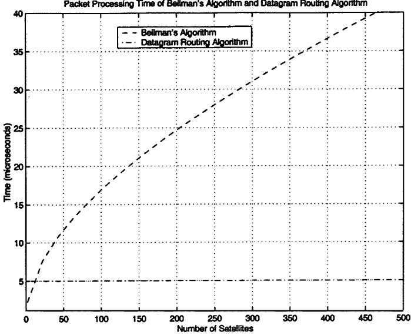  
Fig. 8. Packet processing time of algorithms.

## IV. PERFORMANCE OF DATAGRAM ROUTING ALGORITHM

For performance evaluation of the datagram routing algorithm we conducted four main experiments.

• Experiment I: We compare the length of the paths generated by our new algorithm with the paths generated by Bellman’s Shortest Path Algorithm [13].

• Experiment II: We discuss the effect of the direction enhancement phase.

• Experiment III: We discuss the behavior of our new algorithm in case of satellite failures.

• Experiment IV: We give an example of delay values for a typical connection and how this delay is affected by the satellite movement.

In all experiments, we generate a satellite constellation with $M = 1 2 { \mathrm { ~ p l a n e s } }$ and $N = 2 4$ satellites in each plane. The planes as well as the satellites within a plane are separated from each other by $1 5 . 0 ^ { \circ }$ . The polar regions are defined as regions between the latitudes $7 5 . 0 ^ { \circ }$ and $9 0 . 0 ^ { \circ }$ in the Northern and Southern hemispheres. The th and 23rd satellites in every plane are at latitude $8 2 . 5 ^ { \circ }$ North, inside the polar regions. The interplane links inside the polar regions are assumed to be disconnected. In the first three experiments, we computed the average values for all possible source–destination pairs. We assume that each source–destination pair occurs with the same probability. In this way, we cover all connection possibilities and do not favor any source or destination distribution.

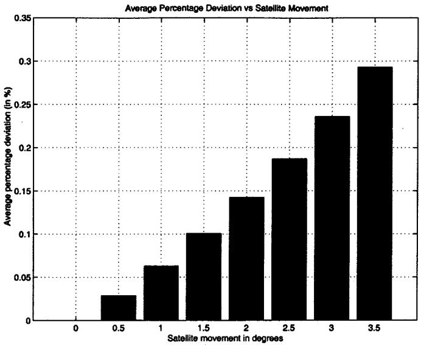  
Fig. 9. Average percentage deviation versus satellite movement.

## A. Path Optimality of Datagram Routing Algorithm

Our new algorithm has the advantage in terms of packet processing delay and storage space over conventional shortest path algorithms as presented in Section III-D. Our algorithm routes the packets between logical locations in the network, which are treated as hops for packet routing. Since the satellites move in their planes, they are not always in the centers of their logical locations. Therefore, the optimality of the paths generated by our new algorithm can be affected by the satellite movement. Here, we want to demonstrate that this effect is negligible.

In order to obtain minimum propagation delay paths even with the satellite movements, we can apply the Bellman’s Shortest Path Algorithm [13]. We use the Bellman’s Algorithm only to compare the length of the paths generated by our new algorithm.

When the satellites are not exactly at their logical locations, our new algorithm generates paths that have longer propagation delays than the minimum propagation delay paths created by the Bellman’s Shortest Path Algorithm. Within , the satellites take the place at their exact logical locations periodically. This periodic movement of satellites can be captured by 1/4 of this period. Thus, we examine the satellite movements between and deviations from their logical locations with a step size of .

Then we use our new algorithm and determine the minimum propagation delay paths between source and destination satellites. Similarly, we apply the Bellman’s Shortest Path Algorithm and create optimal paths. If the path obtained by our new algorithm is longer than the optimal path, then we record the differences as a percentage deviation, which are given in Fig. 9.

In Fig. 9, it is clear that as the satellites move further away from their logical locations, the average percentage deviation increases. The main cause for the deviations is based on the changing lengths of the ISLs. The length of the interplane ISLs within the same horizontal ring deviates from its original value at the initial alignment because half of the satellites move to North and half of them to South, and accordingly the ISL distances will be different. In the worst case ( ) in Fig. 9, the average difference between our algorithm and Bellman’s algorithm is less than 0.3%. This clearly shows that our new algorithm provides minimum propagation delay paths with the complexity and capturing the satellite movements by the logical location concept.

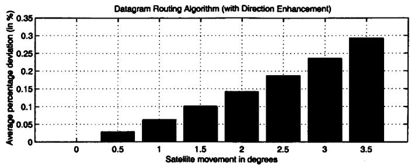  
(a)

Datagram Routing Algorithm (without Direction Enhancement)  
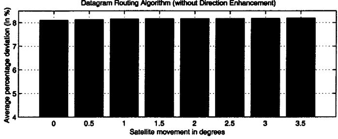  
(b)  
Fig. 10. Average percentage deviation versus satellite movement for datagram routing algorithm with and without enhancement phase.

## B. Effect of Enhancement Phase

If we apply only the direction estimation phase of our new algorithm, we determine the minimum hop number between source and destination satellites. The minimum-hop path is determined first by routing packets horizontally until the plane of destination satellite is reached, then taking the vertical hops to reach the destination.

In Fig. 10, we compare the average percentage deviation of the paths generated by our new algorithm with and without the enhancement phase. It is obvious that for any value of satellite movement, the version with enhancement phase results in much lower average deviation values than the version without enhancement phase. The worst average deviation for our new algorithm is less than 0.3%. On the other hand, if we only use the direction estimation phase, the average percentage deviation is always greater than 8.1%. This shows that the direction enhancement phase is an essential part of our algorithm to create minimum propagation delay paths.

## C. Effect of Satellite Failures

When a satellite fails, all minimum propagation delay paths passing through this satellite must be recreated. In our algorithm, the satellite failures are only known to the immediate neighbors. Thus, after the failure, the newly generated paths between all source and destination satellites may not always have minimum propagation delays. In this experiment, we compare all new paths generated by our algorithm with all paths generated by the Bellman’s Shortest Path Algorithm after the satellite failure.

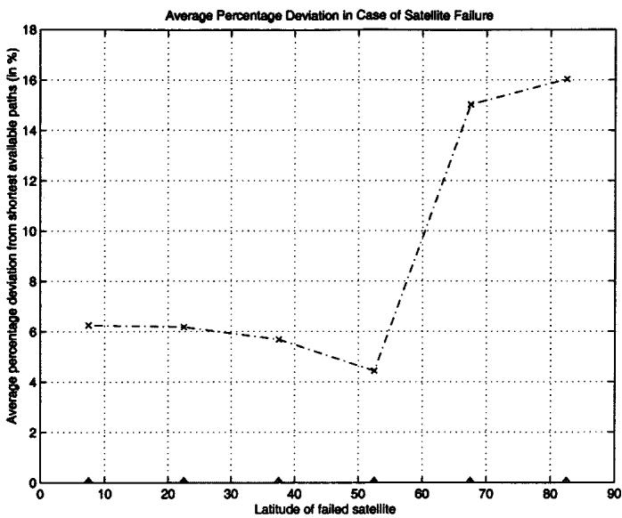  
Fig. 11. Average percentage deviation in case of satellite failure versus latitude of failing satellite.

In Fig. 11, we present the average percentage difference between the rerouted paths obtained by our algorithm and minimum propagation delay paths by Bellman’s Shortest Path Algorithm. The experiments are carried out for different latitudes of the failed satellite. When the failed satellite moves from the equator $( \mathrm { l a t } = 0 ^ { \circ } )$ toward the poles $( \mathrm { l a t } = 9 0 ^ { \circ } )$ , the average percentage deviation decreases from 6.25% to 4.4%. When the failed satellite is in the ring closest to the polar regions $( \mathrm { l a t } _ { \operatorname* { m i n } } =$ ), the average deviation increases to 15%. Similarly, the average deviation is 16% when failure is inside the polar region. The main reason for this behavior is that failures inside or next to the polar regions cause the packets to be sent back to the satellites where they entered the polar region. Recall that the interplane ISLs are not operational in this region. This increases percentage difference in the propagation delay between the rerouted paths and optimal paths. These increases in the overall average propagation delay are still negligible.

## D. Typical Delay Values and Effect of Satellite Mobility

In order to demonstrate typical propagation delays and their change due to satellite mobility in a real-life scenario, let us consider packets traveling from continental North America ( N, W) to central Europe ( N, E). The satellite constellation is identical to the one that is assumed for other experiments. The satellites are also assumed to reside at 1375 km above the surface of the Earth.

We start with the initial alignment of the satellites and examine the change in propagation delay for a quarter of the movement period. As shown in Fig. 12(a), the propagation delay increases for this source–destination pair as the satellites move. The minimum propagation delay path generated by Bellman’s Algorithm yields values between 43.5 to 47.1 ms (solid line), whereas our algorithm yields propagation delays that increase from 43.5 to 48 ms (dotted line). If the incoming packets are processed in parallel and fast transmission schemes are deployed, packet processing and transmission times become very small.

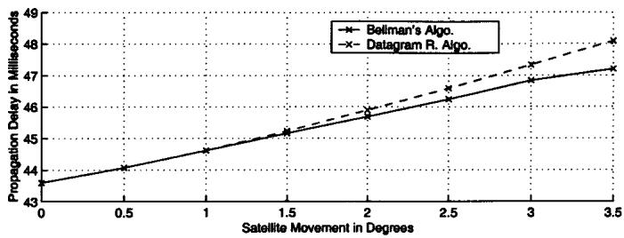  
(a)

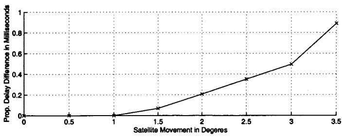  
(b)  
Fig. 12. Example of propagation delay values. (a) Propagation delay. (b) Difference in propagation delay.

Therefore, propagation delay can be regarded as the dominant factor of delay in satellite networks.

The delay difference between the path generated by Bellman’s Algorithm and our algorithm is shown in Fig. 12(b) for the same range of satellite movement. Until the satellites move from their initial alignment, our algorithm produces minimum propagation delay paths. When the satellites move further, our algorithm starts producing paths, which do not have minimum propagation delays. The deviation from the minimum propagation delay path, though, increases only up to 0.9 ms, which corresponds approximately to 2% of the total propagation delay. Note that this difference decreases as the satellites move further into the second quarter of their movement period.

## V. CONCLUSION

In this paper, we introduced a datagram routing algorithm for LEO satellite networks. The algorithm is distributed, and routing decisions are made on a per-packet basis. The generated paths are loop-free and satellite movements have negligible effect on the path optimality. Our new algorithm is capable of avoiding congested regions by making local decisions. In case of satellite failures, the protocol is also capable of routing packets around the location of failure with low degradation in performance.

## REFERENCES

[1] I. F. Akyildiz and S. Jeong, “Satellite ATM networks: A survey,” IEEE Commun. Mag., vol. 35, pp. 30–44, July 1997.

[2] G. Berndl, M. Werner, and B. Edmaier, “Performance of optimized routing in LEO intersatellite link networks,” in Proc. IEEE 47th Vehicular Technology Conf., vol. 1, May 1997, pp. 246–250.

[3] H. S. Chang, B. W. Kim, C. G. Lee, Y. Choi, S. L. Min, H. S. Yang, and C. S. Kim, “Topological design and routing for low-earth orbit satellite networks,” in Proc. IEEE GLOBECOM, 1995, pp. 529–535.

[4] H. Uzunalioglu, I. F. Akyildiz, and M. D. Bender, “A routing algorithm for LEO satellite networks with dynamic connectivity,” ACM–Baltzer J. Wireless Networks (WINET), vol. 6, no. 3, pp. 181–190, June 2000.

[5] M. Werner, C. Delucchi, H. Vogel, G. Maral, and J. De Ridder, “ATMbased routing in LEO/MEO satellite networks with intersatellite links,” IEEE J. Select. Areas Commun., vol. 15, pp. 69–82, Jan. 1997.

[6] R. Mauger and C. Rosenberg, “QoS guarantees for multimedia services on a TDMA-based satellite network,” IEEE Commun. Mag., vol. 35, pp. 56–65, July 1997.

[7] H. Uzunalioglu, I. F. Akyildiz, Y. Yesha, and W. Yen, “Footprint handover rerouting protocol for LEO satellite networks,” ACM–Baltzer J. Wireless Networks (WINET), vol. 5, no. 5, pp. 327–337, Nov. 1999.

[8] K. Tsai and R. Ma, “Darting: A cost effective routing alternative for large space-based dynamic topology networks,” in Proc. IEEE MILCOM, 1995, pp. 682–687.

[9] R. A. Raines, R. F. Janoso, D. M. Gallagher, and D. L. Coulliette, “Simulation of two routing protocols operating in a low earth orbit satellite network environment,” in Proc. IEEE MILCOM, vol. 1, Nov. 1997, pp. 429–433.

[10] E. Ekici, I. F. Akyildiz, and M. D. Bender, “Datagram routing algorithm for LEO satellite networks,” in Proc. IEEE INFOCOM, vol. 2, Mar. 2000, pp. 500–508.

[11] M. W. Lo, “Satellite-constellation design,” Comput. Sci. Eng., vol. 1, no. 1, pp. 58–67, Jan.–Feb. 1999.

[12] W. Dobosiewicz and P. Gburzynski, “A bounded-hop-count deflection scheme for Manhattan-street networks,” in Proc. IEEE INFOCOM, 1996, pp. 172–179.

[13] A. Kerschenbaum, Telecommunications Network Design Algorithms. New York: McGraw-Hill, 1993.

Eylem Ekici (S’99) received the B.S. and M.S. degrees in computer engineering from Bogaziçi University in 1997 and 1998, respectively. He is currently working toward the Ph.D. degree at the School of Electrical and Computer Engineering, Georgia Institute of Technology, Atlanta.

His research interests include satellite networks, wireless networks, routing protocols, and Internet.

Ian F. Akyildiz (M’86–SM’89–F’96) received the B.S., M.S., and Ph.D. degrees in computer engineering from the University of Erlangen-Nuernberg, Germany, in 1978, 1981, and 1984, respectively.

He is currently a Distinguished Chair Professor with the School of Electrical and Computer Engineering, Georgia Institute of Technology, Atlanta, and Director of the Broadband and Wireless Networking Laboratory. He has held Visiting Professorships at the Universidad Tecnica Federico Santa Maria, Chile, the Universite Pierre et Marie Curie

(Paris VI), the Ecole Nationale Superieure Telecommunications, Paris, France, the Universidad Politecnico de Cataluna, Barcelona, Spain, and the Universidad Illes Baleares, Palma de Mallorca, Spain. His current research interests are in wireless networks, satellite networks, Internet, and multimedia communication systems. He is an Editor for ACM-Springer Journal for Multimedia Systems, ACM-Baltzer Journal of Wireless Networks, and Journal of Cluster Computing.

Dr. Akyildiz is a Fellow of the Association for Computing Machinery (ACM). He received the “Don Federico Santa Maria Medal” for his services to the Universidad of Federico Santa Maria, Chile. He served for the ACM Distinguished Lecturer program from 1989 to 1997. He received the ACM Outstanding Distinguished Lecturer Award for 1994 and the 1997 IEEE Leonard G. Abraham Prize. He was an Editor for IEEE/ACM TRANSACTIONS ON NETWORKING from 1996 to 2001 and IEEE TRANSACTIONS ON COMPUTERS from 1992 to 1996. He is an Editor-in-Chief of Computer Networks (Elsevier) since 2000. He served as the Program Chair of the 9th IEEE Computer Communications workshop held in Florida in October 1994, as the Program Chair for the ACM/IEEE MO-BICOM’96 (Mobile Computing and Networking) conference, and for the IEEE INFOCOM’98.

Michael D. Bender (M’99–SM’00) received the B.S.E.E. degree from The Johns Hopkins University, Baltimore, MD, and M.S. degrees in electrical engineering and computer engineering from Loyola College, Baltimore, MD.

He is currently the Chief of Emerging Communications Technologies for the National Security Agency, where he serves as the Technical Program Director for Wireless Communications Research. He also teaches graduate courses in networking at Loyola College. He has made major contributions that resulted in the advancements in networking and signal processing that have improved understanding of emerging communications systems. His research interests include services infrastructures for telecommunications networks, broadband and multimedia for wireless and next generation communications.

Mr. Bender is a member of the Science and Engineering Society and a Senior Member of NSA’s Technical Track.