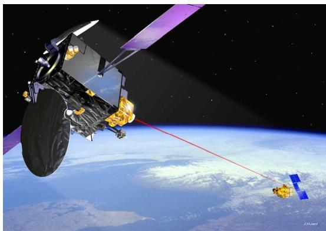
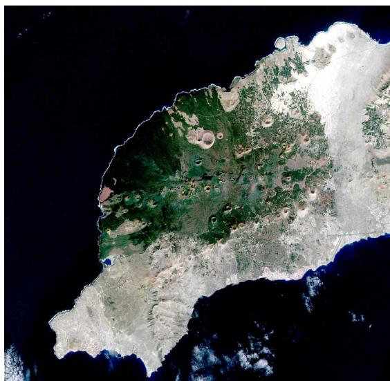
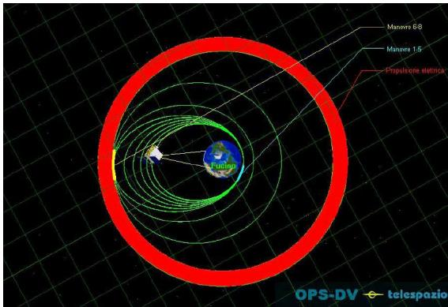
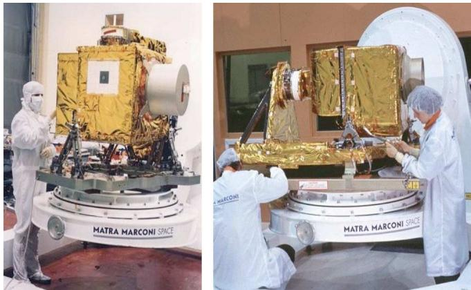
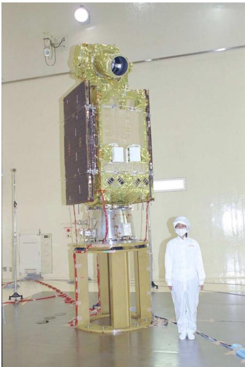
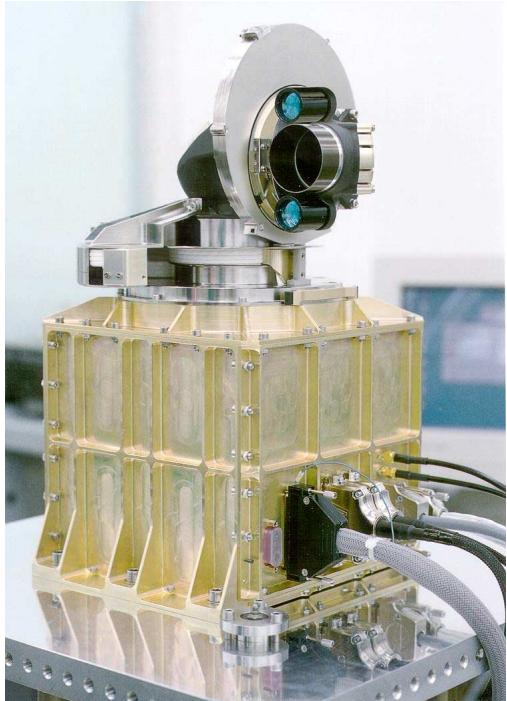
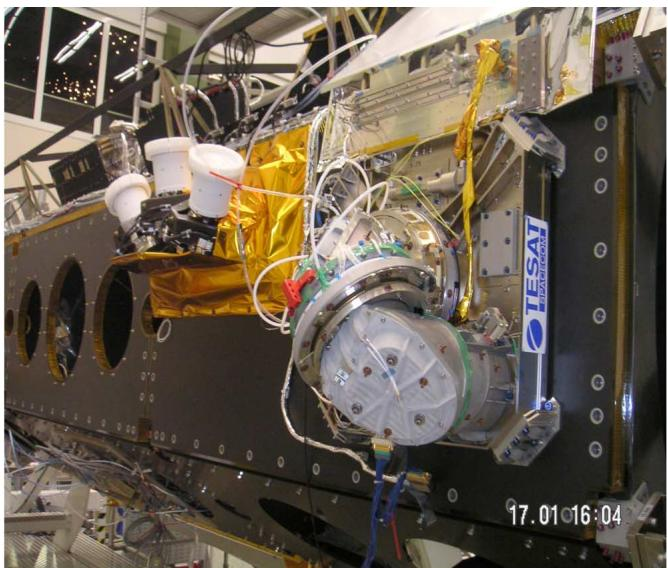
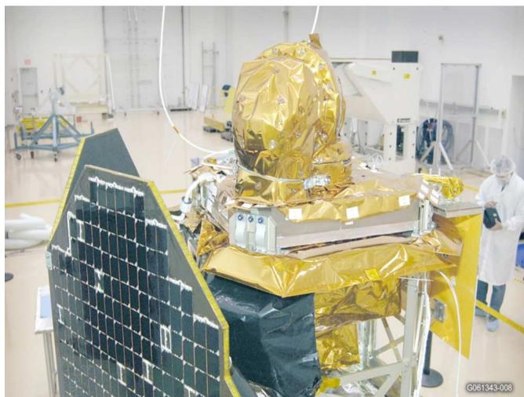
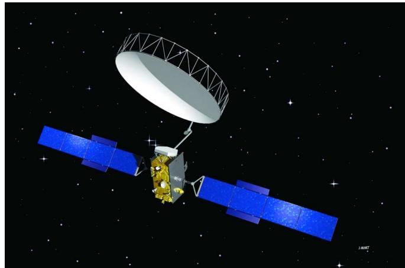

# Optical Intersatellite Communication

Zoran Sodnik, Bernhard Furch, and Hanspeter Lutz

(Invited Paper)

Abstract—This paper describes the achievements in optical intersatellite communication based on technology developments that started in Europe (European Space Agency) more than 30 years ago. In 2001, the world-first optical intersatellite communication link was established (between the SPOT-4 and Advanced Relay and TEchnology MIssion Satellite (ARTEMIS) satellites), proving that optical communication technologies can be reliably mastered in space. In 2006, the Japanese Space Agency (JAXA) demonstrated a bidirectional optical link between its Optical Inter-Orbit Communications Engineering Test Satellite and ARTEMIS, and in 2008, the German Space Agency (DLR) established an intersatellite link between the near-field infrared experiment and TerraSAR-X satellites already based on the second generation of laser communication technology.

Index Terms—Coherent modulation, free-space laser communication technology, intersatellite communication.

## I. INTRODUCTION

for the assessment of modulators for high data rate laser links in space. This marked the beginning of a long and sustained ESA involvement in space optical communications. A large number of study contracts and preparatory hardware developments followed, conducted under various ESA R&D activities. In the mid 1980s, ESA took an ambitious step by embarking on the semiconductor laser intersatellite link experiment (SILEX) program, to demonstrate a preoperational optical communication link in space. SILEX, which started routine operations in March 2003, has put ESA in a world leading position in optical intersatellite links.

In 1993, the Japanese Space Agency National Space Development Agency (NASDA) and ESA agreed on a cooperation to perform optical intersatellite communication experiments, and in 2006, communication links were established.

After having made the investment into SILEX and demonstrating the feasibility of optical communication technology ESA decided to leave the field to European industry pick up on the lessons learned and to develop laser communication terminal (LCT) for the commercial market.

This however turned out to be difficult because the GSM telephone network emerged, which became a strong competitor for satellite constellations based global telephone networks such as Iridium. Paired with an economic downturn this led to the subsequent cancellation of the Celestri and Teledesic satellite constellations, which would have required several hundreds of LCTs to establish high-speed data exchange between neighboring satellites in the constellation.

The German Space Agency [Deutsche Gesellschaft fur Luft- ¨ und Raumfahrt (DLR)] continued the development of laser communication technology, realizing the strategic importance for its industry. A second generation of terminals was developed, which are now operational in orbit, since 2008. They will form the backbone of the new European Data Relay Satellite (EDRS) system to be deployed in 2013.

## II. SILEX

## A. Early Years

When ESA started to consider optics for intersatellite communications, virtually no component technology was available to support space-system development. The available laser sources were rather bulky and primarily laboratory devices. Initially, carbon dioxide $\mathrm { ( C O _ { 2 } ) }$ gas lasers were selected, because these were the most efficient and reliable lasers at that time and Europe had a considerable background in $\mathrm { C O _ { 2 } }$ laser technology for industrial applications [1]. A detailed design study of a $\mathrm { C O _ { 2 } }$ LCT was undertaken and all critical subsystems were bread-boarded and tested [2].

This enabled ESA to get acquainted with the intricacies of coherent, free-space optical communication, but very early on, it became evident that the $1 0 . 6 \mathrm { - } \mu \mathrm { m } \mathrm { C O _ { 2 } }$ laser was not the winning technology for use in space because of weight, lifetime, and operational problems.

Toward the end of the 1970s, semiconductor diode lasers operating at room temperature became available, providing a very promising transmitter source for optical intersatellite links. In 1980, therefore, ESA placed the first studies to explore the potential of using this new device for intersatellite links. At the same time, the French National Space Study Center (CNES) started to look into a laser-diode-based optical data-relay system. This resulted in the decision, in 1985, to embark on the SILEX [3].

SILEX consists of two optical communication payloads embarked on the ESA Advanced Relay and TEchnology MIssion Satellite (ARTEMIS) spacecraft and on the French Earth observation spacecraft SPOT-4. It allows the transmission of the maximum data rate the Earth observation camera on SPOT-4 can provide, namely 50 Mb/s, from low-earth orbit (LEO) to geostationary orbit (GEO) using GaAlAs laser diodes and direct detection [4].

  
Fig. 1. Schematic depiction of the SILEX intersatellite link between SPOT-4 and ARTEMIS.

In 1997, both terminals underwent a stringent environmental test program and the first host spacecraft (SPOT-4) was launched in March 1998. The preshipment review of ARTEMIS took place in ESA at the end of 1999, but the launch of ARTEMIS, which was initially scheduled on the Japanese launcher H2 A for February 2000, had to be cancelled. Launcher problems made it necessary to look for an alternative launch option in order to avoid further delays and a dual launch option on an Ariane-5 was negotiated.

## B. ARTEMIS and SPOT-4

ARTEMIS was eventually launched on July 12, 2001, but due to underperformance the third stage of its Ariane-5 launcher, the satellite was injected into a too low elliptical geostationary transfer orbit with apogee perigee altitudes of 17 500 km 590 km instead of 36 000 km 860 km. Within 10 days, and by using most of its onboard propellant for a total of eight apogee motor firings, ARTEMIS was brought out of the radiation belts and into a circular, however, below GEO (with 31 000 km altitude, a 0.8◦ inclination and an orbital period of 20 h).

In order to check out as early as possible the health of the SILEX payload on ARTEMIS first tests with ESA’s optical ground station (OGS) on Tenerife were performed on November 15, 2001 [5]. Pointing, acquisition, and tracking (PAT) parameters of the SILEX payload were optimized and two link sessions of 20 min each, were performed. The PAT procedure is explained in [6]. Five days later the first intersatellite link between ARTEMIS and SPOT-4 was established of which a schematic is shown in Fig. 1.

Fig. 2 shows the first image, which was obtained on November 30, 2001 by SPOT-4, optically transmitted to ARTEMIS and relayed via Ka-band to a ground station in Toulouse. It shows the southern part of the island of Lanzarote [7].

With help of its ion thrusters—initially foreseen for north/south station keeping—ARTEMIS was spiraled out toward its nominal orbital position of 21.5◦ east in GEO. During the maneuver, which lasted from February 2002 until February 2003, no data-relay operations were possible, because the ionengines thrust direction required a spacecraft attitude different from its nominal Nadir pointing. The spiraling out by electric propulsion is indicated in Fig. 3 by the red band.

Fig. 2. First image transmitted by the SILEX optical data-relay system on November 30, 2001. It shows the Southern part of the island of Lanzarote, Canary Islands, and Spain.  
  
Fig. 3. ARTEMIS orbit raising maneuvers performed by chemical thruster firings (green) and by electrical propulsion (red).

## C. SILEX Technology

SILEX is based on ON–OFF keying modulation and direct detection of laser beams in the 800 nm wavelength range. Both SILEX terminals on ARTEMIS and on SPOT-4 use wavelength discrimination (819 and 847 nm) to isolate their respective transmit and receive beams.

SILEX demonstrated for the first time that the stringent PAT requirements associated with the extremely low divergence of optical communication beams can be reliably mastered in space.

The attitude uncertainty of the ARTEMIS satellite platform is $0 . 1 ^ { \circ } = 1 7 0 0 ~ \mu \mathrm { r a d }$ (standard for telecommunication satellites), which makes pointing with microradian accuracy (the divergence of the SILEX communication laser beam is 7 µrad) impossible. To establish contact the LCT on ARTEMIS first scans the 1700 µrad uncertainty cone with a wide beacon laser (750 µrad) and high laser power (>10 W). Scanning is done in a spiral fashion and upon detection of the ARTEMIS beacon by SPOT-4 within fractions of a second it sends a communication beam back to stop the beacon scan. The two terminals then track each other beams and optimize their angular alignment, after which the ARTEMIS communication beam is switched ON and the beacon OFF and data transmission begins. A sophisticated high-frequency beam steering mechanism ensures that mutual tracking on the incoming beams takes place. The performance data for the LCTs on ARTEMIS and SPOT-4, as well as some orbital data is given in the Appendix.

  
Fig. 4. ARTEMIS (left) and SPOT-4 (right) LCTs during assembly at Astrium SAS (former Matra Marconi Space) France.

The two terminals are shown in Fig. 4.

## D. Optical Intersatellite Communication Engineering Test Satellite

In 1993, the Japanese Space Agency NASDA and ESA agreed on a cooperation to perform optical intersatellite communication experiments and the preliminary design of Optical Intersatellite Communication Engineering Test Satellite (OICETS) and its LCT called laser utilizing communication equipment (LUCE) was finished in 1994. In September 2003, JAXA validated the performance of the engineering model of its LUCE terminal with ARTEMIS in a space to ground link experimental campaign from ESA’s OGS in September 2003 [8].

OICETS was launched by a Dniepr launcher from Baikonur (Kazakhstan) on August 23, 2005 into a circular sunsynchronous 610-km orbit and first laser communication experiments with ARTEMIS were performed on December 9, 2005. Unlike SPOT-4, OICETS is able to receive and transmit data, and thus, it demonstrated the world-first bidirectional optical intersatellite communication link receiving data at 2 Mb/s and transmitting at 50 Mb/s [9].

Fig. 5 shows the LUCE terminal on top of the OICETS satellite. The LUCE terminal was built by a Japanese consortium of NEC and Toshiba (NTSpace). The technical parameters are identical to the ones of the terminal on SPOT-4 with the following exceptions: the aperture diameter is 260 mm, the transmit beam diameter is 130 mm $( 1 / e ^ { 2 } )$ , the laser power is 100 mW, and the LUCE terminal weight is 170 kg.

When the intersatellite communication link campaign with ARTEMIS was completed successfully end of 2006, intersatellite operations were stopped. Only space-to-ground links were continued until September 2009.

  
Fig. 5. LUCE LCT on top of the OICETS spacecraft.

## E. SILEX Link Statistics

The SPOT-4/ARTEMIS intersatellite link statistics since March 2003 counts 1862 sessions of which 73 failed with an accumulated link duration of 377 h and 39 min, while the OICETS/ARTEMIS intersatellite link statistics counts 83 sessions of which two failed with accumulated link duration of 14 h and 21 min.

## F. Toward Smaller Terminals

SILEX has been a vital development step in Europe as it provided in-flight testing of a preoperational optical link in space. The program stimulated the development of many new spacequalified optical, electronic, and mechanical equipments and technologies, which can now form a core for future optical terminals. However, with its mass of 157 kg and 50-Mb/s data rate, SILEX was hardly an attractive alternative to a RF terminal of comparable transmission capability.

One must bear in mind that the SILEX terminal had to be dimensioned by using the limited laser diode power available at the end of the 1980s, namely 60 mW average power at 830 nm. The result was a 25 cm telescope aperture, both on the LEO and the GEO terminal (see Fig. 4).

For an inter-orbit link (IOL) user terminal to be attractive, it is important to keep mass, interface requirements to the host spacecraft, and cost to a minimum. Realizing this and anticipating the need for small data-relay LEO user terminals, ESA launched several activities to develop lightweight LCTs.

In the search for smaller and more efficient laser terminals, ESA continued to investigate other advanced system concepts and technologies. Optically preamplified direct detection systems operating at a wavelength of 1550 nm and return-to-zero (RZ) modulation were investigated and a test system was developed [10].

However, technology tradeoffs, which were performed at the time by ESA’s industrial partners, awarded higher marks to coherent communication systems based on Nd:YAG laser radiation. The main reasons were the maturity of the existing European developments, the lower risk of radiation darkening of amplifiers based on fibers and a coherent system’s false light immunity, the capability to operate with the Sun in the field of view.

## III. COHERENT LASER COMMUNICATION SYSTEMS

Since 1989, ESA has placed strong emphasis on the development of Nd-YAG laser-based coherent communication system technologies: As part of this effort, two parallel system design studies were placed in 1989 for the “Design of a Diode-Pumped Nd:Host Laser Communication System.” Funding difficulties prevented a full hardware implementation of such terminals, but a number of critical technology elements were bread-boarded and tested, including a diode-pumped Nd-YAG laser, a multichannel coherent optical receiver and an electrooptic phase modulator. Germany continued the activities under the German National solid-state laser communications in space (SOLACOS) program.

The coherent Nd-YAG laser communication effort also stimulated the investigation of advanced concepts, such as optical amplifiers in fiber and/or semiconductor technology and the possibility of synthesizing the input/output aperture of the terminal with the help of an array of smaller subapertures, coherently coupled among each other. Optical-phased arrays provide laser communication systems with inertia-free, hence ultrafast, beam scanning ability needed for accurate beam pointing, efficient area scanning, and reliable link tracking in presence of spacecraft attitude jitter [11].

Upto the early 1990s, ESA’s optical communication activities were dominated by the data-relay scenario. Over the time, however, some potential future users of a data-relay service disappeared and the interest in a near-term development of second generation user terminals dropped considerably. However, a new class of potential users of optical intersatellite links emerged with the intended deployment of extensive satellite networks for mobile communications and interactive multimedia services.

In April 1996, ESA placed a contract with an industrial team led by Oerlikon-Contraves Space (now Ruag Space AG) for the design, realization, and test of a demonstrator of a compact and lightweight optical terminal for short-range optical intersatellite links (SROIL). To achieve ultimate system miniaturization, highest transmit data rates and sufficient growth potential to comply also with extended link ranges, the SROIL terminal was designed using a laser-diode pumped Nd:YAG laser transmitter together with a coherent detection receiver. The pointing system of the SROIL terminal was based upon a periscope-type pointing assembly in front of a 35 mm diameter aperture telescope, allowing almost full hemispherical pointing. The SROIL terminal is shown in Fig. 6.

The communication subsystem was designed as a BPSK homodyne system for a data rate of 1.5 Gb/s. Due to the homodyne detection scheme, the communication signal is recovered at baseband, which simplifies considerably the communications electronics design.

  
Fig. 6. Engineering model of the SROIL terminal

On February 24, 1998 Oerlikon-Contraves Space (CH, Zurich, Switzerland) and Motorola (Schaumburg, IL) announced that they had signed a Strategic Alliance Agreement for the development and production of optical intersatellite link (OISL) terminals for the Celestri broadband satellite communication network in LEO.

After signature of this agreement, Motorola approached the U.S. authorities to obtain a Technology Assistance Agreement (TAA), which is the legal precondition to enter high-technology ventures with non-U.S. partners. Unfortunately, the U.S. State Department refused to grant such a TAA with Oerlikon– Contraves, while it had no objections to authorize dealings with the other European partners of Oerlikon–Contraves in the OISL industrial team, namely Bosch Telecom and Carl Zeiss.

Subsequently, Bosch Telecom took over the prime contractorship for the Celestri OISL terminal development from Oerlikon– Contraves with Carl Zeiss and Ball Aerospace as subcontractors.

However, very shortly, thereafter the Celestri program was cancelled, but the German Space Agency (DLR) continued funding of coherent LCTs under its LCTSX and TSX-LCT programs.

Two LCTs were built, one to be flown on TerraSAR-X, a German Earth observation satellite with a synthetic aperture radar payload operating in X-band, and a second one to be used as spare. Fortunately, a flight opportunity came up on the nearfield infrared experiment (NFIRE) satellite, developed by the American department of defense, when another NFIRE payload had been cancelled.

The two LCTs mounted onto the side panel of the TerraSAR-X satellite and on top of the NFIRE satellite are shown in Fig. 7.

The LCTs are based on BPSK modulation, where the phase of a laser beam instead of the intensity is used to transmit data.

  
Fig. 7. (Top) LCTs mounted on the side panel of the TerraSAR-X satellite and (bottom) on top of the NFIRE satellite already covered in MLI.

BPSK requires some complicated receiver technology, such as a local oscillator, which needs to be phase-locked to the incoming light, but it offers the maximum detection sensitivity in terms of photons required per bit.

To increase LCT reliability, a beaconless acquisition scheme is used, where the two terminals take turns scanning the uncertainty cones of their respective satellite platforms. Wavelength discrimination to isolate their respective transmit and receive beams cannot be used because the wavelengths are identical, however, polarization discrimination is applied [12]. More technical information is given in Table I.

## A. TerraSAR-X and NFIRE

The NFIRE satellite was launched on April 24, 2007 into a LEO orbit with 48.23◦ inclination and two month later, on June 15, 2007, the TerraSAR-X satellite was launch into a sunsynchronous LEO orbit with 510 km altitude and 97.45◦ inclination. After commissioning of both spacecraft, the first successful intersatellite communication link using coherent modulation techniques took place on February 21, 2008 [13].

  
Fig. 8. Alphasat spacecraft showing its large 11 m diameter L-band reflector.

Since then, 55 LEO-to-LEO bidirectional intersatellite communication links have been performed demonstrating net data rates of 5.6 Gb/s over link distances of up to 4900 km. At this distance, the optical link breaks down because the laser beam passes the upper layers of the earth’s atmosphere. While intensity fluctuations (scintillation) caused by atmospheric turbulence is already detectable in altitudes of 80 km above the earth, at 30 km, the link can no longer be maintained. Communication link sessions lasted between 50 and 650 s with an accumulated time of about 16 000 s. The acquisition time has been reduced to around 30 s from the start of acquisition until communication takes place by carefully determining the attitude error, and thus, minimizing the uncertainty cone of the acquisition scan on both spacecraft [14].

## B. Alphasat

The data-relay scenario has reemerged as the most important application for optical communication technology, because it is the only way to retrieve the data generated by today’s Earth observation satellites operating with synthetic aperture radars or multispectral imagers. Despite offering extremely large bandwidth LCTs require no license and their operation is interference free. The German Space Agency (DLR) seized the opportunity to embark on ESA’s latest telecommunication satellite Alphasat, a data-relay technology demonstration payload (TDP#1), which will consist of a LCT for intersatellite links and a Ka-band terminal for space to ground links. The LCT will be an updated version of the ones flown on TerraSAR-X and NFIRE with increased telescope diameter and transmit laser power (see the Appendix for more information). This will increase the link distance to 45 000 km (to cover the LEO–GEO intersatellite distance) and enable a net data rate of 2.8 Gb/s. The Ka-band terminal will support 600 Mb/s on the satellite to ground link.

The Alphasat satellite will be operated by Inmarsat Global Ltd. and will deliver new Broadband Global Area Network (BGAN) family of services, which provide a wide range of high-data rate applications to a new line of user terminals for aeronautical, land, and maritime markets. It will be positioned at 25◦ east, covering Europe, Middle East, Africa, and parts of Asia (see Fig. 8).

TABLE I  
TECHNICAL DATA OF LCTS FOR SPACECRAFT DESCRIBED IN THIS PAPER

<table><tr><td></td><td>ARTEMIS</td><td>SPOT-4, OICETS</td><td>TerraSAR-X, NFI RE</td><td>Alphasat, Sentinel 1+2</td></tr><tr><td>Rx diameter:</td><td>250mm</td><td>250mm, 260mm</td><td>125mm</td><td>135mm</td></tr><tr><td>Rx data rate:</td><td>50Mbps</td><td>None, 2Mbps</td><td>5.6Gbps</td><td>2.8Gbps</td></tr><tr><td>Rx wavelength:</td><td>847nm</td><td>819nm</td><td>1064nm</td><td>1064nm</td></tr><tr><td>Rx modulation:</td><td>NRZ</td><td>None, OOK-2PPM</td><td>BPSK, BPSK</td><td>BPSK, BPSK</td></tr><tr><td>Tx diameter (1/e2):</td><td>125mm</td><td>250mm, 130mm</td><td>125mm</td><td>135mm</td></tr><tr><td>Tx power:</td><td>35mW</td><td>70mW, 100mW</td><td>1 Watt</td><td>5 Watt</td></tr><tr><td>Tx data rate:</td><td>2Mbps</td><td>50Mbps</td><td>5.6Gbps</td><td>2.8Gbps</td></tr><tr><td>Tx wavelength:</td><td>819 nm</td><td>847 nm</td><td>1064 nm</td><td>1064nm</td></tr><tr><td>Tx modulation:</td><td>None</td><td>OOK-NRZ</td><td>BPSK</td><td>BPSK</td></tr><tr><td>Beacon wavelength:</td><td>801nm</td><td>None</td><td>None</td><td>None</td></tr><tr><td>Link distance:</td><td>&lt;45000km</td><td>&lt;45000km</td><td>&lt;6000km</td><td>&lt;45000km</td></tr><tr><td>Mass of terminal:</td><td>157kg</td><td>150kg, 170kg</td><td>35kg</td><td>45kg</td></tr><tr><td>Power consumption:</td><td>200W</td><td>150W</td><td>120W</td><td>140W</td></tr><tr><td>Launch date:</td><td>12.07.2001</td><td>24.03.1998 23.08.2005</td><td>15.06.2007, 24.04.2007</td><td>2013, 2012</td></tr><tr><td>Orbital location:</td><td>GEO 21.5°E</td><td>LEO 825 km LEO 610 km</td><td>LEO 508 km, LEO 350 km</td><td>GEO 25°E LEO 800 km</td></tr></table>

## C. EDRS System

Despite the present telecommunication capabilities, there are still a number of limitations that delay the delivery of timecritical data to users. With the implementation of the joint European Commission/ESA Global Monitoring for Environment and Security program, it is estimated that European space telecommunication infrastructure will need to transmit 6 TB of data every day from space to ground. The present telecom infrastructure is challenged to deliver such large data quantities within short delays, and conventional means of communication may not be sufficient to satisfy the quality of service required by users of Earth observation data. In addition, Europe currently relies on the availability of non-European ground station antennas to receive data from Earth observation satellites. This poses a potential threat to the strategic independence of Europe, as these crucial space assets effectively may not be under European control. The EDRS system offers a solution to these challenges.

There are a number of key services that will benefit from this systems infrastructure right from the start.

1) Earth observation applications in support of a multitude of time-critical services, e.g., monitoring of land-surface motion risks, forest fires, floods, and sea ice zones.

2) Government and security services that need images from key European space systems, such as Global Monitoring for Environment and Security (GMES).

3) Rescue teams that need Earth observation data within disaster-struck areas.

4) Security forces that transmit data to Earth observation satellites, aircraft, and unmanned aerial observation vehicles, to reconfigure such systems in real time.

5) Relief forces that operate among their units in the field and require telecommunication support in cutoff areas.

EDRS will consist of three GEO satellite, equipped with LCTs for intersatellite links and Ka-band terminals for the space to ground link. Its first customers will be the Sentinel 1 and 2 Earth observation satellites, which are being deployed within the GMES, a European initiative for the establishment of a European capacity for Earth Observation.

## IV. CONCLUSION

Today, the problem of optical free-space communication to enter the commercial payload market is not so much of technical nature, but rather the need to convince commercial satellite operators that optical communication systems are cost efficient and reliable. This will be demonstrated by the deployment of the EDRS system.

Thirty years of technology endeavors, sponsored by ESA and other European space agencies, has put Europe in a leading position in the domain of space laser communications. The most visible result of this effort is SILEX and the planned installation of optical communication technology on the EDRS system.

## ACKNOWLEDGMENT

The authors would like to thank Astrium SAS, Tesat Spacecom, Ruag Space, JAXA, National Institute of Information and Communication Technology, NTSpace, and DLR for their support and cooperation.

## REFERENCES

[1] W. Reiland, W. Englisch, and M. Endemann, “Optical intersatellite communication links: State of CO2 laser technology,” in Proc. SPIE, 1986, vol. 616, pp. 69–76.

[2] P. Huber, W. Reiland, V. Klein, and A. Popescu, “Full scale laboratory breadboard model (LBM) of a free space laser transceiver package,” in Proc. SPIE, 1990, vol. 1218, pp. 467–477.

[3] G. Oppenhauser, M. Wittig, and A. Popescu, “The European SILEX ¨ project and other advanced concepts for optical space communication,” in Proc. SPIE, 1991, vol. 1522, pp. 2–13.

[4] G. Oppenhauser, “Silex program status—A major milestone is reached,” ¨ in Proc. SPIE, 1997, vol. 2990, pp. 2–9.

[5] M. Reyes, Z. Sodnik, P. Lopez, A. Alonso, T. Viera, and G. Oppenhauser, ¨ “Preliminary results of the in-orbit tests of ARTEMIS with the optical ground station,” in Proc. SPIE, 2002, vol. 4635, pp. 38–49.

[6] J. Romba, Z. Sodnik, M. Reyes, A. Alonso, and A. Bird, “ESA’s bidirectional space to ground communication experiments,” in Proc. SPIE, 2004, vol. 5550, pp. 287–298.

[7] T. T. Nielsen and G. Oppenhaeuser, “In orbit test result of an operational intersatellite link between ARTEMIS and SPOT4, SILEX,” presented at the SPIE, San Jose, CA, vol. 4635, 2002.

[8] T. Yono, Y. Takayama, K. Shiratama, I. Mase, B. Demelenne, Z. Sodnik, A. Bird, M. Toyoshima, H. Kunimori, D. Giggenbach, N. Perlot, M. Knapek, and K. Arai, “Overview of the inter-orbit and orbit-to-ground laser communication demonstration by OICETS,” presented at the SPIE Conf., San Jose, CA, vol. 6457, 2007.

[9] Y. Takayama, T. Jono, Y. Koyama, N. Kura, K. Shiratama, B. Demelenne, Z. Sodnik, A. Bird, and K. Arai, “Observation of atmospheric influence on OICETS inter-satellite laser communication demonstration,” in Proc. SPIE, vol. 6709, 2007, pp. 67091B-1–67091B-9.

[10] P. Winzer, A. Kalmar, and W. Leeb, “Role of amplified spontaneous emission in optical free-space communication links with optical amplification—Impact on isolation and data transmission; utilization for pointing, acquisition, and tracking,” in Proc. SPIE, 1999, vol. 3615, pp. 134–141.

[11] W. Leeb, W. Neubert, K. Kudielka, and A. Scholz, “Optical phased array antennas for free space laser communications,” presented at the SPIE Conf., Garmisch, Federal Republic of Germany, vol. 2210, 1994.

[12] R. Lange and B. Smutny, “Homodyne BPSK-based optical inter-satellite communication links,” presented at the SPIE Conf., San Diego, CA, vol. 6457, 2007.

[13] B. Smutny, R. Lange, H. Kampfner, D. Dallmann, G. M¨ uhlnikel,¨ M. Reinhardt, K. Saucke, U. Sterr, B. Wandernoth, and R. Czichy, “Inorbit verification of optical inter-satellite communication links based on homodyne BPSK,” presented at the SPIE Conf., San Jose, CA, vol. 6877, 2008.

[14] B. Smutny, H. Kampfner, G. M¨ uhlnikel, U. Sterr, B. Wandernoth,¨ F. Heine, U. Hildebrand, D. Dallmann, M. Reinhardt, A. Freier, R. Lange, K. Bohmer, T. Feldhaus, J. M¨ uller, A. Weichert, P. Greulich, S. Seel,¨ R. Meyer, and R. Czichy, “5.6 Gbps optical inter-satellite communication link,” presented at the SPIE Conf., San Jose, CA, vol. 7199, 2009.

Zoran Sodnik was born in Rijeka, Croatia, in 1957. He received the M.Sc. degree in technical cybernetics from the Technical University Berlin, Berlin, Germany, and the Ph.D. degree in optical engineering from Stuttgart University, Stuttgart, Germany.

He was an Assistant Professor at the Institute for Applied Optics, Stuttgart and was a Postdoctoral Researcher in optical metrology using differential and two-wavelength interferometry. In 1993, he joined the European Space Agency (ESA), Space Research and Technology Centre (ESTEC), Noordwijk, The Netherlands, where he was involved in the development of ESA’s optical ground station (OGS) for testing laser communication terminals onboard satellites in space. He is supporting optical technology developments for future science projects of ESA, namely the Large Interferometer Space Antenna (LISA) and its precursor mission, LISA pathfinder, and is involved in the development of optical metrology systems for instrument alignment and formation flying in space.

Bernhard Furch was born in Vienna, Austria, in 1954. He received the Diploma degree in electrical engineering and the Ph.D. degree with a thesis on electrooptic waveguide modulators from the Technische Universitat Wien, Wien, Austria,¨ in 1978 and 1985, respectively.

From 1979 to 1984, he was a Research Assistant, and then from 1984 to 1986, he was an Assistant Professor at the Institut fur Nachrichtentechik und¨ Hochfrequenztechnik, Technische Universitat Wien. In 1986, he joined the Eu-¨ ropean Space Agency (ESA), Space Research and Technology Centre (ESTEC), Noordwijk, The Netherlands, where he was responsible for R&D and project support in optical communications and optical instrumentation. Since 1996, he has been the Head of the Optics Section in the Technical and Operational Support Directorate of ESA ESTEC.

Hanspeter Lutz was born in Buchs SG, Switzerland, in 1943. He received the M.Sc. degree from the Eidgenossische Technische Hochschule (ETH), Z¨ urich,¨ Switzerland and the Ph.D. degree from the Universite de Paris, Paris, France,´ both in natural sciences.

He was a Postdoctoral Researcher in molecular spectroscopy and laser instrumentation at Hebrew University, Jerusalem, Israel and the University of Pennsylvania, Philadelphia. In 1974, he joined Du Pont’s Research Centre, Geneva, Switzerland. In 1977, he joined the European Space Agency’s, Space Research and Technology Centre (ESTEC), Noordwijk, The Netherlands, where he was involved in the development of laser systems for use in space and retired in 2008 as a Head of the Mechanical Systems Division.