# A Dynamic Routing Concept for ATM-Based Satellite Personal Communication Networks

Markus Werner, Member, IEEE

Abstract— Satellite systems are going to build a part of the future personal communications infrastructure. The firstgeneration candidates for satellite personal communication networks (S-PCN) will rely on low earth orbit (LEO) and medium earth orbit (MEO) constellations. A noticeable trend in this field is toward broadband services and the use of ATM.

For LEO satellite systems employing intersatellite links (ISL’s), this paper proposes an overall networking concept that introduces the strengths of ATM to their operation. The core of the paper is the design of a new routing scheme for the periodically time-variant ISL subnetwork, discrete-time dynamic virtual topology routing (DT-DVTR), and its ATM implementation. DT-DVTR works completely off line, i.e., prior to the operational phase of the system. In a first step, a virtual topology is set up for all successive time intervals of the system period, providing instantaneous sets of alternative paths between all source–destination node pairs. In the second step, path sequences over a series of time intervals are chosen from that according to certain optimization procedures. An ATM-based implementation of DT-DVTR in LEO satellite ISL networks is presented with some emphasis on the optimization alternatives, and the performance in terms of delay jitter is evaluated for an example ISL topology.

Index Terms— ATM, dynamic routing, intersatellite links (ISL’s), LEO satellite systems, satellite PCN.

## I. INTRODUCTION

and switching principle for the future terrestrial B-ISDN infrastructure inherently provides strong concepts for efficient networking, namely, the ATM layer transport functions on virtual channel (VC) and virtual path (VP) levels. Moreover, due to the inherent statistical multiplexing capabilities, it effectively promotes service integration. Due to the likewise important internetworking between the diverse future telecommunication networks, one focus of recent research has been on the use of ATM and related concepts in wireless networks.

In the satellite world, the first LEO and MEO (low/medium earth orbiting) satellite systems will start commercial operation within the next years to provide global personal communication services. Compared to geostationary satellites, these constellations offer a significantly smaller round-trip delay between earth and space segment. Moving toward lower orbits—and thus more satellites for a globally operating system—we face the large-scale advent of real networks in the satellite communication world. Moreover, due to the permanent mobility of the whole satellite network itself, the operation of such systems entails many new challenges to be tackled, especially on the networking level. In particular, intersatellite link (ISL) subnetworks in space—as foreseen in the Iridium [1] and Teledesic [2] systems for the transport of longdistance traffic—are subject to permanent topological changes. Consequently, the routing task requires highly sophisticated approaches to provide the predominant connection-oriented services with acceptable quality of service (QoS) for the end user and efficient use of network resources.

From a networking point of view, a major benefit of a developed ISL subnetwork in space lies in the possibility to transport long-distance traffic over reliable and high-capacity connections, thus forming a good base for ATM operation. Several studies and field trials have already shown the feasibility of ATM transmission over (geostationary) earth–satellite links, e.g., [3], and these are deemed much more critical for the use of ATM than intersatellite links.

The focus of this paper is on a concept for dynamic routing in ISL networks with time-variant topology, operating in a connection-oriented mode. The respective considerations are based on two key inputs from existing system filings: 1) first, Iridium’s constellation parameters and especially its ISL topology are used as an illustrative example because it is well known and will be the first operational system employing ISL’s; and 2) second, the medium- and longterm trend toward broadband services via ISL-based satellite networks is perfectly reflected by Teledesic’s claim to operate on the basis of the asynchronous transfer mode. Therefore, all routing considerations are developed and expressed using ATM concepts and terminology.

Section II first provides a short overview about LEO/MEO satellite systems and ISL topology characteristics. In Section III, the overall ATM-based networking concept and a decomposition thereof are discussed. The heart of the paper is then formed by Section IV providing a detailed presentation of a new dynamic routing scheme for time-variant topology environments, discrete-time dynamic virtual topology routing (DT-DVTR); the treatment of this scheme will be first on a general level, i.e., being not limited to either ATM or ISL networks. Finally, Section V comprises the ATM-based DVTR implementation in the specific ISL network environment, together with a simulation-based performance evaluation.

TABLE I  
PROMISING CANDIDATES OF LEO/MEO SATELLITE SYSTEMS PROPOSED FOR FIRST-GENERATION S-PCN

<table><tr><td></td><td>ICO</td><td>Odyssey</td><td>Globalstar</td><td>Iridium</td><td>Teledesic*</td></tr><tr><td>Orbit classification</td><td>MEO</td><td>MEO</td><td>LEO</td><td>LEO</td><td>LEO</td></tr><tr><td>Orbit altitude</td><td>1354 km</td><td>10 354 km</td><td>1414 km</td><td>780 km</td><td>1600 km</td></tr><tr><td>Orbit period</td><td>360 min</td><td>360 min</td><td>114 min</td><td>100 min</td><td>118 min</td></tr><tr><td>Number of satellites</td><td>10</td><td>12</td><td>48</td><td>66</td><td>288</td></tr><tr><td>Number of orbits</td><td>2</td><td>3</td><td>8</td><td>6</td><td>12</td></tr><tr><td>Inclination</td><td> $45^{\circ}$ </td><td> $50^{\circ}$ </td><td> $52^{\circ}$ </td><td> $86.4^{\circ}$ </td><td> $98.2^{\circ}$ </td></tr><tr><td>Intraplane ISL&#x27;s per sat.</td><td>no</td><td>no</td><td>no</td><td>2 perman.</td><td>0–4 dynam.</td></tr><tr><td>Interplane ISL&#x27;s per sat.</td><td>no</td><td>no</td><td>no</td><td>0–4 dynam.</td><td>0–4 dynam.</td></tr><tr><td>Primary service</td><td>voice</td><td>voice</td><td>voice</td><td>voice</td><td>multimedia</td></tr><tr><td>Start of operation</td><td>1999/2000</td><td>2000</td><td>1998</td><td>1998</td><td>2001</td></tr></table>

\*Teledesic is a candidate for second-generation broad-band systems.

## II. SATELLITE SYSTEMS FOR PERSONAL COMMUNICATIONS

## A. Nongeostationary Satellite Systems

The most promising candidates for satellite PCN are listed in Table I. ICO (former Inmarsat-P) and Odyssey as outstanding MEO proposals and Globalstar and Iridium as two quite diverse LEO representatives form a group of systems that aim at near future narrowband personal communications with voice as the strong primary service. Compared to them, the Teledesic concept may be regarded as even more forward-looking, already envisaging broadband services and incorporating ATMlike operation. In fact, Teledesic is not classified as S-PCN; however, it is mentioned in this context since it indicates the future networking direction in the satellite world and is thus one driving motivation behind the networking concepts presented in this paper.

All of these LEO and MEO systems are based on satellite constellations with several circular common-period orbits of low (typically 700–1400 km) or medium (typically 10 000 km) altitude; all orbits in each constellation have the same inclination with respect to the equatorial plane. The same number of satellites circulate (usually with regular phasing, random phasing only in Teledesic) in each of the orbits, and so do the corresponding circular coverage areas (footprints) on earth, thus achieving continuous and worldwide coverage. More details on constellation geometry and system parameters can be found, for instance, in [4] and [5].

The relative movement of satellites and user location areas on earth leads to a complex combined spatial and timevariant traffic pattern collected and delivered by every single satellite in its footprint [6]. In systems providing an intersatellite link infrastructure, the long-distance share of this traffic is routed through the space segment. Characteristics of source/destination traffic variance are then transferred into the ISL traffic mix in a smoothened form because every single intersatellite link also carries a lot of transit traffic. Throughout this paper, only systems employing ISL’s are considered, and Iridium will be used as example. It should be explicitly noted in this context that the routing concept presented herein is indeed developed on top of Iridium-like dynamic ISL constellations, but it is definitely not the Iridium proprietary concept. Fig. 1(a) shows the 66-satellite constellation with six quasipolar orbits. The specific orbit pattern results in a longitude “seam” encountering between two neighboring orbits where satellites are moving in opposite directions.

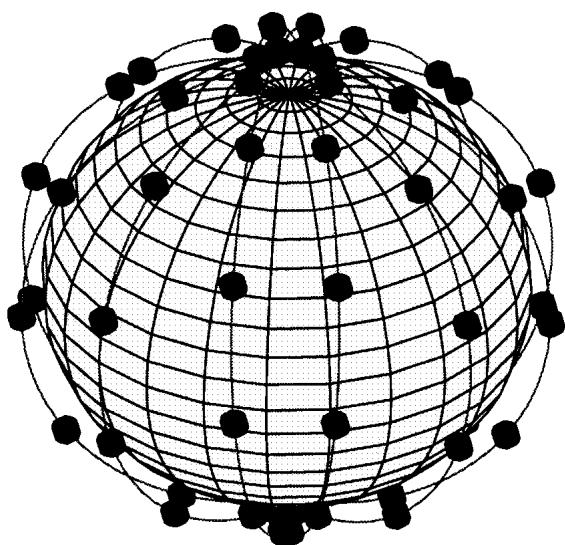  
(a)

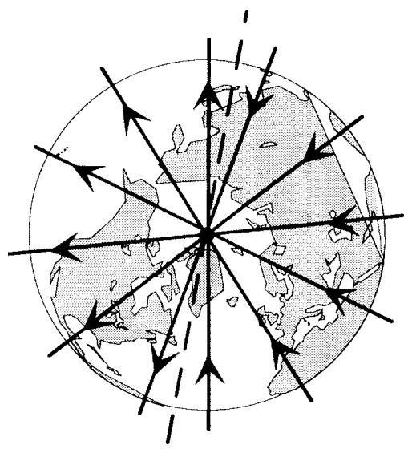  
(b)  
Fig. 1. Iridium. (a) Satellite constellation. (b) Schematic polar view on coand counterrotating orbits and the “seam,” with arrows indicating the orbital direction of satellite movement.

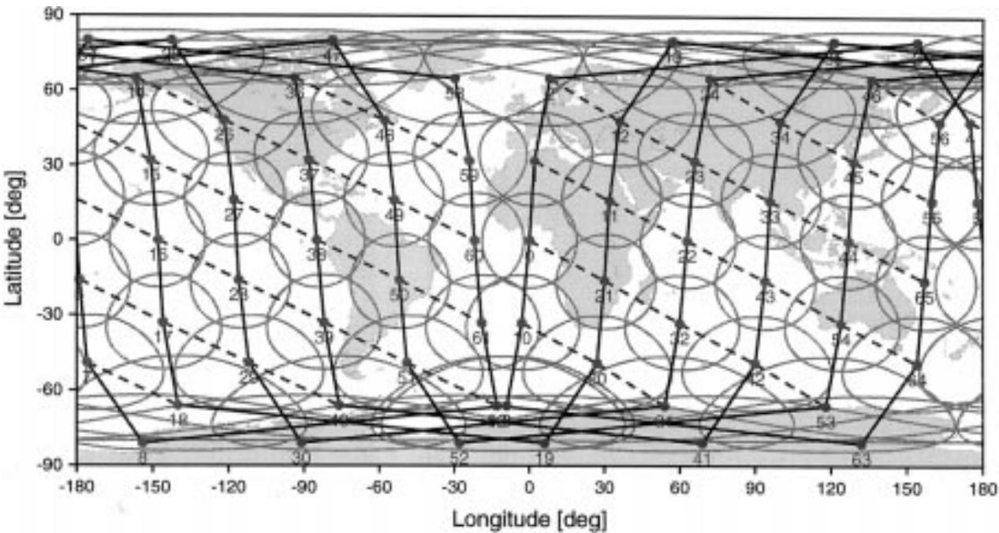  
Fig. 2. Snapshot of Iridium footprints and ISL topology; solid lines denote the intraplane, and dashed lines denote the interplane ISL’s. The seam encounters at a longitude of roughly 10 resp. 170 .

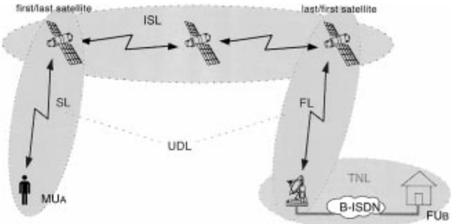  
Fig. 3. Segments of a typical end-to-end connection in a satellite personal communication network with intersatellite links.

With respect to this seam, the constellation comprises two hemispherical areas of corotating orbits, each extending from the north to the south pole. The polar view on the Iridium orbits in Fig. 1(b) illustrates this phenomenon.

## B. ISL Topology and Network Segmentation

The physical time-variant ISL topology of the system consists of all instantaneously existing direct links between pairs of satellites. Here, a distinction has to be made between intraplane ISL’s connecting successive satellites in the same orbit plane and interplane ISL’s connecting satellites in adjacent corotating orbits, as shown in the snapshot in Fig. 2. Whereas, in the first case the distance and the antenna pointing are fixed, interplane ISL’s are subject to continuous variations of both [6], with specific consequences for the networking and routing. In the extreme case of counterrotating orbits, moreover, a permanent switching of ISL’s would be necessary, a fact that has led to avoiding links across the seam in general; see Fig. 2. Besides the continuous distance changes on corotating interplane ISL’s, there is also a discrete-time contribution to the ISL topology dynamics: the effectively implemented interplane ISL’s (one per satellite and per neighboring corotating orbital plane) are deactivated in polar regions; this means on/off switching of certain links in the topology. As a result, the number of simultaneously operational ISL’s varies between two and four in the quasipolar Iridium constellation. This twofold (i.e., continuous-time and discrete-time) variance of the ISL subnetwork significantly increases the complexity of connection-oriented network operation, and has to be tackled by tailor-made routing strategies.

For the networking considerations in the following sections, it is helpful to take a simplified view of a typical end-to-end connection between a mobile user $\mathbf { M U } _ { A }$ and a fixed partner $\mathrm { F U } _ { B }$ , as illustrated in Fig. 3.

Three major connection segments can be clearly separated. The 1) intersatellite link (ISL) segment comprises the radio links between pairs of satellites, essentially forming a $\mathrm { { d y } \mathrm { { - } } }$ namically meshed subnetwork in space. The 2) up/downlink (UDL) segment incorporates the service link (SL) between mobile users and satellites, as well as the feeder link (FL) between satellites and fixed earth stations (gateways GW). The gateway stations act as an interface between the satellite system and the 3) terrestrial network link (TNL) segment. In the following, the satellites serving the SL and FL subsegments will be referenced to as first and last satellites, or in pairs as terminating satellites of a given connection. Considering bidirectional communication, clearly every first satellite in an ISL chain always acts simultaneously as a last satellite and vice versa.

## III. ATM-BASED NETWORKING CONCEPT

## A. Problem Formulation

ATM networking is essentially based upon the ATM layer transport functions on the VC and VP level. In essence, both concepts are called virtual since the channel, respectively, path, functionalities are defined on a logical level using dedicated identifiers, namely, the VC identifier (VCI) and the VP identifier (VPI). Each ATM cell contains both identifiers in dedicated fields within the cell header. Both are always valid and unique for only one physical link between directly connected network nodes. In this way, the ATM cells are defined to travel along certain VC’s or VP’s on a physical link. Specifically, this allows that cells using the same physical link can belong to different logical connections. Moreover, a VP may be regarded as a logical link that assembles a group of $\mathrm { v c } { \mathrm { : } } \mathrm { s }$ on a specific physical link, where the $\mathrm { v c } { } _ { \mathrm { s } }$ represent different (and potentially multiservice) end user connections using this physical link along their route. A virtual end-toend connection is consequently established as concatenation of VC’s or VP’s, forming a VC connection (VCC) or a VP connection (VPC), respectively. For a more detailed treatment of these shortly introduced concepts and of ATM in general, the interested reader is referred to [7].

The connection-oriented operation mode of virtual connections implies that cell sequence is preserved during their lifetime. Classically, one dedicated VCC between two ATM end users is established for the holding time of a call, and then used by all related ATM cells. Driven by survivability and fault tolerance requirements, however, redundant (standby) paths/VCC’s may be provided to allow hitless path switching either on demand (predictable) or as a reaction to path failures (unpredictable). In both cases, proper alignment of the ATM cell streams during the short switching period is essential for nondisruptive operation of the user connection. In [8], an alignment strategy for terrestrial ATM networks is proposed that requires duplication of the cell streams during the alignment phase, and thereby guarantees nearly optimal and error-free operation.

Considering now S-PCN employing ISL’s as presented in the previous section, we face the challenge of a multiply dynamic network topology. Inherently, this feature, in general, requires switching between subsequent different paths during the lifetime of a user connection. In the following, this is referenced to as virtual connection handover (HO). Obviously, such connection handovers may introduce severe delay jitter resulting from the difference in transmission delay on the old and new path.

Fortunately, the LEO/MEO “physical” topology dynamics—as experienced by two fictitious end user locations in the footprints of two specific satellites—is periodically deterministic, with the orbit period of the satellite constellation (100 min for Iridium). For a specific constellation, this allows us to set up a unique time-dependent virtual topology providing for continuous operation of end-to-end connections.

## B. Overall Networking Concept

The overall networking concept description serves as the basis for a sound problem decomposition and the in-depth discussion of the ISL subnetwork alone. The systematic approach toward an ATM-based networking concept for S-PCN considers ISL-based LEO satellite systems for bidirectional point-to-point communications between pairs of end users located on earth. To simplify the concept description, let us further assume “pure” VC connections between the two partners, i.e., no VCC aggregation into VPC’s is performed on an end-to-end level (as would be, for example, appropriate in the case of multiservice communication). However, this assumption is definitely not imperative for the concept. A mobile S-PCN user $M U _ { A }$ may communicate with a mobile partner $M U _ { B }$ or with a fixed partner in the terrestrial B-ISDN, $F U _ { B } ,$ , and the partner may be within the service area of the same satellite or remote. In the following, the most demanding case of a remote fixed partner is discussed in detail because this highlights the use of intersatellite links and the satellite/terrestrial interface at the same time.

Along with Fig. 4, the operation of the connection is sufficiently explained by a closer examination of the connection setup 1) and two different handover situations 2), 3).

1) Virtual Connection Setup: A $\mathrm { V C C } _ { A B } 1$ is established at $t = t _ { 0 }$ with a $\mathrm { V C } _ { A } 1$ entering the serving first satellite $\mathrm { S a t } _ { A } 1$ via a UNI port. After MAC/ATM protocol conversion, the aggregation into the applicable VP and the VP switching onto the outgoing VP on NNI port P1 are performed. A strictly VPCbased virtual topology in the ISL subnetwork now provides a certain ${ \mathrm { V P C } } _ { 1 1 } .$ between the first satellite $\mathrm { S a t } _ { A } 1$ and the last satellite $\mathrm { S a t } _ { B } 1$ . The $\mathrm { V C C } _ { A B } 1$ is completed through a VC/VP switch at $\mathrm { G W } _ { B } .$ , which is the dedicated satellite/terrestrial interface instance for $\mathrm { F T } _ { B } ,$ , and the terrestrial ATM tail in the TNL subnetwork.

The following procedures guarantee time continuity of the virtual connection over two different handover situations.

2) ISL Subnetwork Internal VPC Handover: $\mathbf { A } { \mathfrak { t } } \ t = t _ { 1 }$ , a handover from $\mathrm { { V P C } _ { 1 1 } 1 }$ toward $\mathrm { { V P C } _ { 1 1 } 2 }$ —using different paths between the same terminating satellites—becomes necessary due to some change in the ISL topology. Working around the instantaneous path delay difference between the old and new VPC requires hitless path switching with corresponding hardware complexity (cell stream alignment buffers, etc.). Following ATM terminology, the overall $\mathrm { v C C } _ { A B } 2$ is obviously different from earlier $\mathrm { V C C } _ { A B } 1$ , nevertheless continuing the same call.

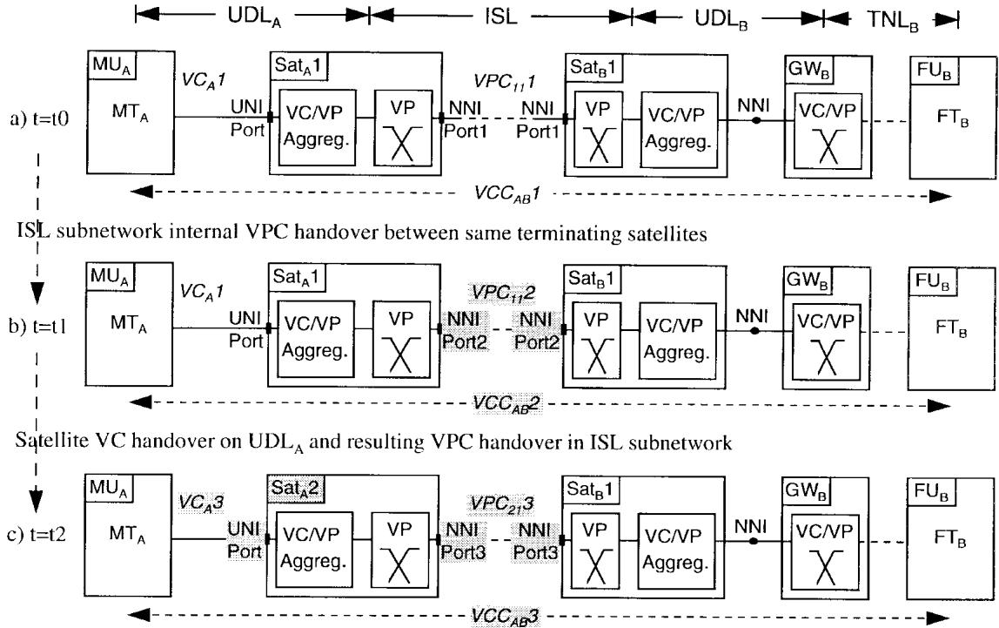  
Fig. 4. Call setup and continuous operation over two different virtual connection handover situations. Relevant changes due to the respective handover are emphasized in gray. MT, FT = mobile/fixed terminals.

3) VC Handover on UDL/SL: $\mathbf { A } \mathbf { t } ~ t = t _ { 2 }$ a satellite handover on $\mathrm { U D L } _ { A }$ is performed. A twofold consequence becomes obvious: first, a handover toward a new $\mathrm { V C } _ { A } 3$ in the incoming satellite’s mobile user link has to be performed, and second, within the ISL subnetwork, a new $\mathrm { V P C _ { 2 1 } 3 }$ will succeed $\mathrm { { V P C } _ { 1 1 } 2 , }$ , both actions contributing to new $\mathrm { V C C } _ { A B } 3 .$ A satellite handover for $\mathrm { G W } _ { B }$ works likewise, affecting a possibly large number of calls (transported through $\mathrm { U D L _ { B } ) }$ simultaneously.

## C. Decomposition

The networking tasks in the UDL, ISL, and TNL parts of the system can be considered separately. The TNL part is easily separable by assuming that the gateway either acts as a central VC/VP switch between the S-PCN internal part and the external terrestrial network or that it is implemented as an intermediate node between two different ATM networks. The networking of the TNL part itself turns out to be the “classical” terrestrial B-ISDN one and is not considered further in this paper.

The periodical topological changes within the ISL subnetwork are completely deterministic since they are only dependent on the respective satellite positions. Therefore, it is possible to set up off-line, i.e., prior to the operational phase of the system, a dynamic virtual cross-connect network incorporating all satellites as pure VP switches, thereby providing (a set of) VPC’s between any pair of terminating satellites at any time. This VPC topology is clearly decoupled from the VCbased UDL part by the VC/VP (de)aggregation interface in the terminating satellites, and, consequently does not affect UDL operation, even during a VPC handover of type 2). Likewise, satellite handover on either of the UDL parts is handled on the VC level by appropriate signaling between involved mobile user(s) and the gateway station; thus, it works transparently over any given dynamic VPC topology, and does not affect the setup of the latter.

In conclusion, the decomposition into UDL and ISL networking seems to be appropriate. The major task of ISL networking is, of course, the routing of information through the dynamically changing network, and then specifically the ATM implementation. This will be discussed in detail in Section V. As for the remaining UDL part, we have studied and elaborated a networking approach, reported in [9], which mainly extends the virtual connection tree (VCT) concept—originally suggested by Acampora and Naghshineh [10] for terrestrial cellular ATM networks—toward operation in an S-PCN environment including spot-beam antennas. According to this approach, fast spot-beam handovers within one satellite’s coverage area can be performed transparently for the network beyond this satellite. Furthermore, the concept includes the capability to hand over connections from one satellite to another by negotiated and controlled switching between subsequent VC’s.

## IV. DYNAMIC VIRTUAL TOPOLOGY ROUTING (DVTR)

Abstracting from the routing task in ISL subnetworks, this section presents and discusses a concept for routing in timevariant network topologies in general.

Classical routing strategies have traditionally more or less focused on some kind of shortest or multiple path search in networks with a fixed topology. Dynamic routing capabilities are then only required for traffic adaptive routing or in reaction to unpredictable link or node failures.

The situation encountered in ISL subnetworks of LEO satellite constellations is quite different with respect to network topology. Permanent topological changes are an inherent characteristic of those networks, and new routing strategies are required to enable continuous operation in the connectionoriented mode. In the following, a new routing concept, namely, dynamic virtual topology routing $( D V T R ) ,$ , is proposed for use in such environments. A first step will provide the detailed development of the general concept, being not limited to ATM and ISL networks. Section V will then deal with a possible implementation that exploits the potential and strengths of ATM virtual connection operation for the specific case of LEO satellite ISL subnetworks.

## A. Network Model

Let us consider arbitrarily meshed network topologies with the following characteristics.

• The number of network nodes is constant.

• A single node is never unconnected (in a graph-theoretical sense).

• With the above restrictions, the network topology is subject to changes due to

—discrete-time activation/deactivation of links,

—continuous-time distance variations between nodes.

• The complete topology dynamics is periodic with period .

The proposed routing concept does not only take into account the topology, but additionally reflects the following baseline assumptions for the communication system.

• The primary services to be provided are delay sensitive (e.g., telephony, video), and thus require clear priority for the QoS parameters delay and delay jitter; this is reflected in the link cost functions, and thereby drives path search.

• Information flows of a single end-to-end connection always use the same path in both directions.

• The system should inherently provide a straightforward and robust scheme to cope with path failures, i.e., disjoint backup paths are desired.

Starting from these assumptions, the proposed routing concept is based on a discrete-time topology approach as illustrated in Fig. 5. The dynamic network topology is considered as a periodically repeating series of topology snapshots separated by step width $\Delta t = T / K$ . Each of the snapshots at $t = k \Delta t , k = \{ 0 , \cdots , K - \mathrm { 1 } \}$ , is modeled as a graph $G ( k ) = ( V , E ( k ) )$ , where $V = \{ 1 , \cdots , N \}$ is the constant set of nodes and $E ( k )$ represents the set of undirected links $( i , j ) _ { k } = ( j , i ) _ { k }$ between neighboring nodes and $j ,$ existing at $t = k \Delta t$ . Associated with each link are its costs $c _ { i j } ( k )$ according to an appropriate cost metric. In the following, it is assumed that the link costs are mainly determined by node distance, respectively propagation delay.

With $G ( k )$ , the topological situation encountered in time interval $[ k \Delta t , ( k + 1 ) \Delta t [$ is explicitly fixed. Considering the network characteristics and assumptions summarized above, this is appropriate

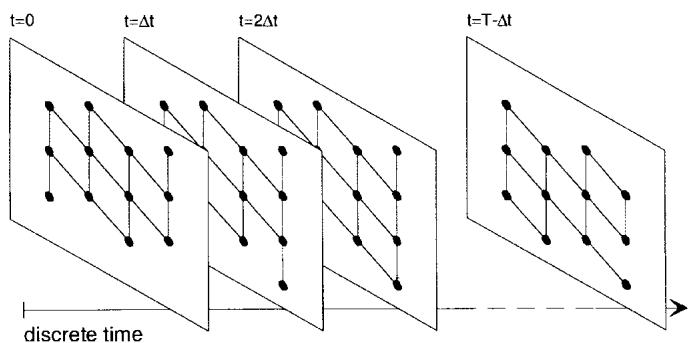  
Fig. 5. Discrete-time topology approach.

1) if $\Delta t$ is adapted to the discrete-time link activation/deactivation behavior $( \mathrm { e . g . }$ , “synchronized” with it) so as to guarantee that $G ( k )$ correctly reflects the physical topology throughout the interval, and

2) if stepping with is small enough to keep the slowly continuing distance (= cost) variations during $[ k \Delta t , ( k + 1 ) \Delta t [$ well below a “reasonable” limit with reference to the artificially fixed values at instant $t = k \Delta t$ . For monotonous cost variation, this condition becomes $( c _ { i j } ( ( k + 1 ) \Delta t - 0 ) - c _ { i j } ( k \Delta t ) ) / c _ { i j } ( k \Delta t ) \ll$ $1 , \forall ( i , j ) _ { k } \in E ( k )$

Whereas the first condition is hard, the second one leaves some freedom for an appropriate tradeoff: the choice of $\Delta t$ may, for example, be made as a compromise between achieving low distance variation within any single interval (small $\Delta t )$ and introducing as few as possible instantaneous distance offsets between subsequent intervals (large ).

## B. Discrete-Time Dynamic Routing Concept

Fig. 6 illustrates the overall discrete-time approach of the proposed routing concept, discrete-time dynamic virtual topology routing (DT-DVTR), which is discussed in depth in the following.

Throughout the period $T ,$ a constant set of $( N ( N { - } 1 ) / 2 )$ unordered origin–destination (OD) node pairs is given. A set $P _ { w } ( k )$ of up to distinct loopless paths is now assigned to each OD pair $w , w \in W$ . Every path $p ( k ) \in P _ { w } ( k )$ consists of a unique sequence of links $( i , j ) _ { k }$ . A link occupation indicator $\delta _ { ( i , j ) _ { k } } ^ { p ( k ) } = 1$ shows that $( i , j ) _ { k }$ belongs to path $p ( k )$ ; otherwise, $\delta _ { ( i , j ) _ { k } } ^ { \dot { p } ( k ) } = 0$

The assignment procedure reflects the setup of an instantaneous virtual topology VT(k) upon $G ( k )$ covered by module I-VTS( ) in Fig. 6. This task is performed by an iterative -best path search algorithm for every OD pair. The single shortest path search task can be formulated as finding the least cost path $p ( k )$ , i.e., the path with minimum path cost $C _ { p ( k ) } =$ $\Sigma _ { i , j } ~ c _ { i j } ( k ) \delta _ { ( i , j ) _ { k } } ^ { p ( k ) }$ . We suggest an iterative approach based on successive calls of the Dijkstra shortest path algorithm (DSPA) [11] because this allows us to introduce topology modifications in between. For instance, by “eliminating” already occupied links, one can force a set of disjoint paths, thus providing a base for simple and robust fault recovery mechanisms and building a sound framework for network traffic flow shaping at operation time.

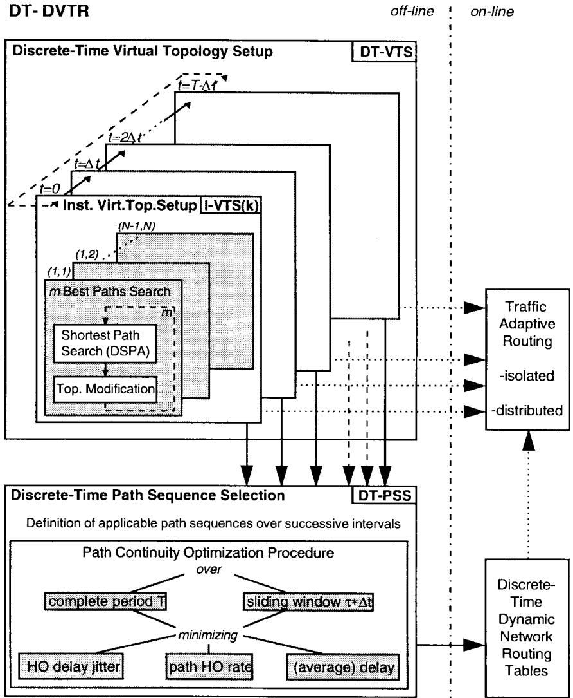  
Fig. 6. Discrete-time dynamic virtual topology routing (DT-DVTR): concept and implementation.

Performing I-VTS( ) for all $k = \{ 0 , \cdots , K - 1 \}$ completes the discrete-time virtual topology setup DT-VTS. The dynamic virtual topology given as result of the completely off-line DT-VTS procedure may be used for on-line traffic adaptive routing strategies as indicated in the figure, i.e., traffic adaptive routing can be performed within the limits of the given virtual topology.

DT-DVTR is extended in the basic form by another offline module, namely, discrete-time path sequence selection DT-PSS. It is obvious that a connection-oriented routing strategy adapted to such topology dynamics must also solve the problem of selecting for all OD pairs (virtual) path sequences over successive time intervals from the virtual topology provided by DT-VTS; this is the point where really dynamic routing is achieved, instead of independently solving a series of quasistatic routing tasks and then “living with” the consequences coming in due to path handover (instantaneous path delay offset, handover signaling complexity, etc.). DT-PSS is essentially performed for all OD pairs as a path continuity optimization procedure, where immediately promising variants are: 1) minimizing HO delay jitter (i.e., instantaneous delay offsets during path handover), and 2) minimizing path HO rate, with some restrictions also 3) minimizing (average) delay. Concerning the duration of the optimization interval, two main approaches are incorporated.

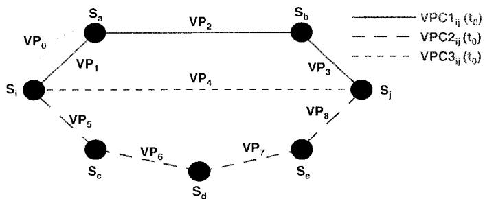  
Fig. 7. Set of three link-disjoint VPC’s between first satellite $S _ { i }$ and last satellite $S _ { j } . \mathsf { V P _ { 0 } }$ indicates that, in general, more than one VP is defined on a physical ISL, and it represents an element of any VPC (not depicted) between $\bar { \boldsymbol { S } } _ { k }$ and $S _ { l } ,$ ; where $( \boldsymbol { k } , l ) \neq ( i , j )$

1) The optimization is performed over the complete period $T ,$ then achieving an optimal network solution. The result is one unique first-choice path sequence $\begin{array} { r l } { S _ { T , 1 } } & { { } = } \end{array}$ $\{ p _ { 1 } ( 0 ) , p _ { 1 } ( 1 ) , \cdots , p _ { 1 } ( K - 1 ) \}$ out of $m ^ { K }$ possible ones, with $p _ { 1 } ( k ) \in P _ { w } ( k )$ , or a set of $Q$ ordered (i.e., prioritized: first-choice, second-choice, ) sequences of such kind, $S _ { T , q } = \{ p _ { q } ( 0 ) , p _ { q } ( 1 ) , \cdots , p _ { q } ( K - 1 ) \} , q = \{ 1 , \cdots , Q \}$

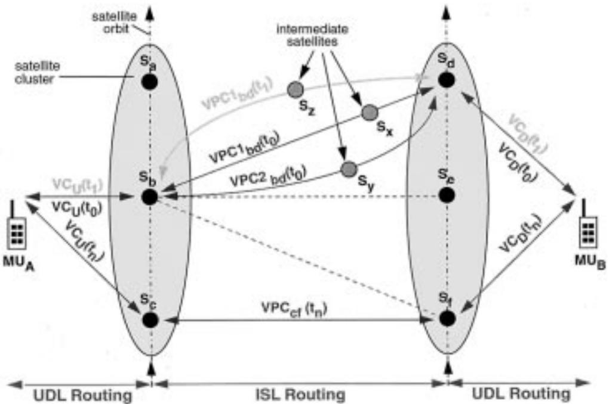  
Fig. 8. Virtual-connection-based routing concept in satellite systems with ISL’s. The continuous operation of an existing end user connection is illustrated for the case of VPC handover between the same first/last satellite pair from steps t0–t1.

2) The optimization is performed in a time-distributed manner within a sliding window of discrete-time duration $\tau ,$ i.e., extending over the interval $[ k \Delta t , ( k + \tau ) \Delta t [$ (modulo ), $k = \{ 0 , \cdots , K - 1 \} , \tau \in \{ 2 , \cdots , K - 1 \}$ . The results are - unique first-choice path sequences $S _ { \tau , 1 } ( \dot { k } ) = \{ p _ { 1 } ( k ) , p _ { 1 } ( k +$ $\operatorname { 1 ) , \cdots , } _ { p _ { 1 } } ( k + \tau - 1 ) \}$ (modulo ), $\forall k \in \{ 0 , \cdots , K - 1 \}$ respectively, sets of ordered sequences, $S _ { \tau , q } = \{ p _ { q } ( k ) , p _ { q } ( k +$ $1 ) , \cdots , p _ { q } ( k + \tau - 1 ) \} , q = \{ 1 , \cdots , Q \}$ , for all .

The graph-theoretical framework developed so far—comprising the network model and routing concept description—provides a sound basis to extend analytical work and formulate any minimax target functions that are related to optimized routing in a wider sense like, e.g., minimizing worst case link traffic throughout the network by means of traffic adaptive routing. However, such an analytical extension is beyond the scope of this paper and is envisaged for further work; here, we will restrict ourselves to a simulation-based performance evaluation of the presented off-line routing approach in an operational system.

## V. INTERSATELLITE LINK NETWORK ROUTING

## A. ATM-Based DVTR Implementation in ISL Subnetworks

The DVTR routing concept is essentially based on a predefinition of paths between end nodes of a connection, and inherently takes care of the time continuity by controlled path handover. The predefined paths, however, have to be “implemented” somehow in the operational system, and it makes good sense to do this in a distributed form in complex ISL networks extending over the whole earth.

Thinking in terms of ATM concepts, it is reasonable to pursue a fully VP/VPC-based solution, as already indicated in Section III. All end-to-end VCC’s sharing the same first and last satellites at arbitrary time can simply be aggregated in one common VPC across the ISL subnetwork, the latter being a unique concatenation of VP’s on the single ISL’s of the VPC. According to the DVTR concept presented above, in a first step, a set of link-disjoint VPC’s between every terminating satellite pair is defined; see Fig. 7. Based on certain optimization procedures, first choice and backup VPC’s are then, in a second step, selected over subsequent intervals. Fig. 8 visualizes how subsequent first-choice VPC’s serve a continuously operated end user connection.

Every transit satellite provides—on the basis of locally available switching tables—pure VP switching functionality between every pair of ISL ports, and thus the whole space segment becomes a pure fast operating cross-connect network. It may as well be regarded as a dynamic virtual trunk network for long-distance calls. Avoiding any switching on the VC level turns out to be especially favorable in the case of many simultaneous low-bit-rate connections on a trunk line; this situation is very likely to be the dominating one in S-PCN providing primarily voice services.

Assuming that the technological preconditions for realization of this concept are met (satellite onboard ATM switching, high-bit-rate ISL’s capable of multiplexed ATM cell stream transmission, etc.), one is left with two major concerns, namely, 1) fundamental limits of the concept, and 2) performance aspects, especially comparing the proposed optimization procedures. Concerning the latter, some example simulation results are given and discussed in Section V-C.

With respect to the conceptual limits, the major concern must be about the maximum number of $\mathrm { { V P } ^ { \bullet } \mathbf { s } }$ required on the

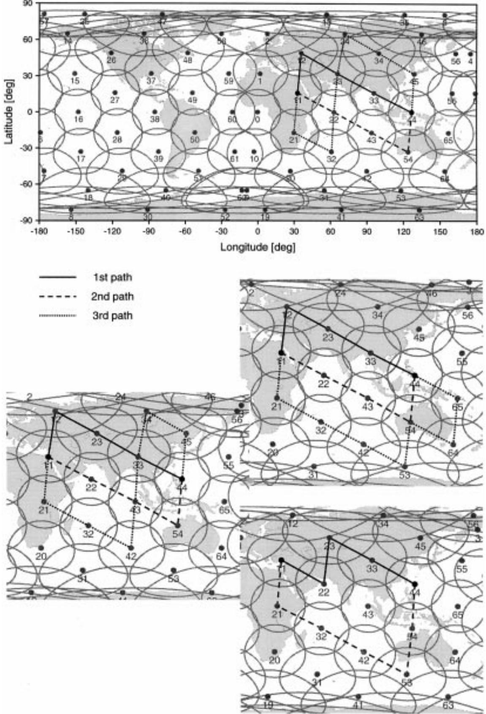  
Fig. 9. Instantaneous sets of link-disjoint shortest path VPC’s over four subsequent time intervals (t = 2 min) for terminating satellite pair $S _ { 1 1 } - S _ { 4 4 }$

worst case link, taking into account all ISL’s over the whole period . The ATM cell header contains 12 bits in the virtual path identifier (VPI) field, thus allowing a maximum of $2 ^ { 1 2 } =$ VP’s on a single ISL per step. Let us consider the case of period-based optimization and one unique path sequence $( \mathrm { i . e . , } Q = 1 )$ in the following. The number of instantaneously required $\mathrm { { V P } ^ { \prime } { s } }$ per link is determined by the number of VPC’s using this link. With the notation introduced in Section IV, path $p$ now being equivalent to a $\mathrm { { V P C } , }$ one can express the actual number of required $\mathrm { { V P } ^ { \bullet } \mathbf { s } }$ on link $( i , j )$ at interval $k ,$ as $v _ { i j } ( k ) = \Sigma _ { w \in W } \delta _ { ( i , j ) _ { k } } ^ { p _ { 1 } ( k ) } , \forall ( i , j ) \in E , \forall k \in \{ 0 , \cdots , K - 1 \}$

Since a further analytical evaluation of this sum is not possible, let us consider that an obvious (yet, of course, “very theoretical”) upper bound is given by the number of simultaneous ${ \displaystyle \mathrm { V P C } } ^ { \prime } { \bf s } ,$ equivalent to the number of terminating satellite pairs (= 2145 for Iridium, $N = 6 6 )$ In reality, one VPC affects one ISL link if the satellite is a VPC start/end point, and contributes on two of its ISL’s if the satellite is a transit node. Considering that the number of ISL’s of an Iridium satellite is between two and four—as explained in Section II-B and illustrated in Fig. 2—and taking into account the distributed connectivity of the Iridium ISL subnetwork, one may well guess that even the maximum number of VP’s on a single link at any time should be significantly below this theoretical upper bound. Consequently, for $N = 6 6 .$ there is no conceptual limitation in terms of required $\mathrm { { V P } ^ { \prime } \mathrm { { s } / \mathrm { { V P I } ^ { \prime } \mathrm { { s } . } } } }$

In fact, counting VP’s per link in computer simulations yields a maximum of roughly 400 $\mathrm { { V P } ^ { \prime } { s } }$ on such links that are in equatorial regions and just in the middle between the seam “boarders,” i.e., for instance, around satellites 22 and 43 in Fig. 2. This perfectly confirms the above estimation.

Observe, however, that short-term “overlapping” of successive VPC’s during controlled VPC handover (like in the alignment concept according to [8]) will also increase the worst case VPI requirements.

## B. Simulation Approach and Optimization Procedures

The DT-DVTR concept has been applied as baseline for VPC-based ISL routing studies focusing on the Iridium system. To this end, the software tool ISLSIM (C kernel and X/Motif graphical user interface) has been developed comprising module libraries for satellite geometry, shortest path search, path continuity optimization, statistical evaluation, and visualization. Fig. 9 gives an example of instantaneous VPC sets over subsequent time intervals as found by ISLSIM’s modified Dijkstra link-disjoint SPA module. In a first in-depth study [12], we have elaborated the complete period/minimize VPC HO rate approach for path continuity optimization, and have reported respective numerical results from extensive simulation runs. Fig. 10 illustrates the procedure: extending over the whole system period, one unique track of VPC’s is defined as a first-choice VPC sequence for each terminating satellite pair. The criterion for definition of this track is the minimum number of VPC handovers (VPC–HO) over the whole system period. All end user connections that are served by the respective satellite pair will use the same unique VPC in a given interval.

The rationale for this approach is to use a straightforward global minimization of the VPC handover rate, considering: 1) that the overall signaling complexity is reduced, and 2) that the critical HO delay jitter affecting single connections is reduced inherently, simply by minimizing the probability of an HO action to encounter at all.

In a second study reported in [13], we have extended the investigations adopting a sliding window/minimize HO delay jitter optimization. For typical delay-sensitive services like telephony, it is especially important to minimize the critical delay jitter caused by VPC–HO. The main objective here has been to extensively exploit the optimization potential with respect to single short-term connections, of course paying the price of increased operational complexity. This is illustrated in Fig. 11, again considering one terminating satellite pair: a sliding time window (with window size typically exceeding the mean call holding time $1 / \mu$ of the target service, e.g., telephony) is used as a discrete-time optimization interval, where the evaluation of the corresponding mathematical target function is performed. The latter is in essence a weighted sum of maximum and average delay jitter. In this way, optimal tracks through the “landscape” of alternative VPC’s are selected. These VPC tracks finally determine the routes, including all handovers, that any connection starting in the respective time interval will use in the operational phase of the system. In other words, different active connections at a certain time step will use completely different VPC’s (and consequently different $\mathrm { { V P } ^ { \prime } { s } }$ on all single links, even if physically the same!) if they have been set up in different intervals. This indeed requires an increased number of VPI’s; more specifically, the average number of VPI’s required per link grows proportionally with the sliding window size.

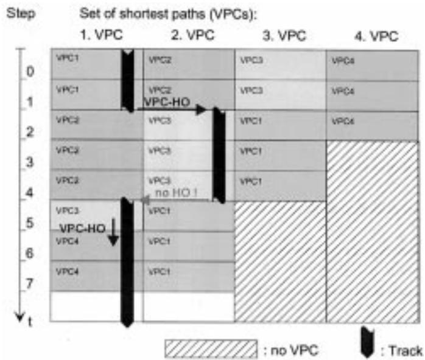  
Fig. 10. System period optimization approach for one terminating satellite pair. VPC handover situations are indicated. Same VPC numbers and gray-scale levels identify one unique physical path.

## C. Numerical Results

Several combinations of satellite systems, ISL topologies, optimization strategies, and service profiles have been simulated. Some representative results are reported for telephone service as target profile in the Iridium system. As one of the dominating delay-sensitive services within the expected service mix of first generation S-PCN users, telephony yields representative performance results in terms of handover delay jitter, which is the most critical parameter.

Set of shortest paths (VPCs):  
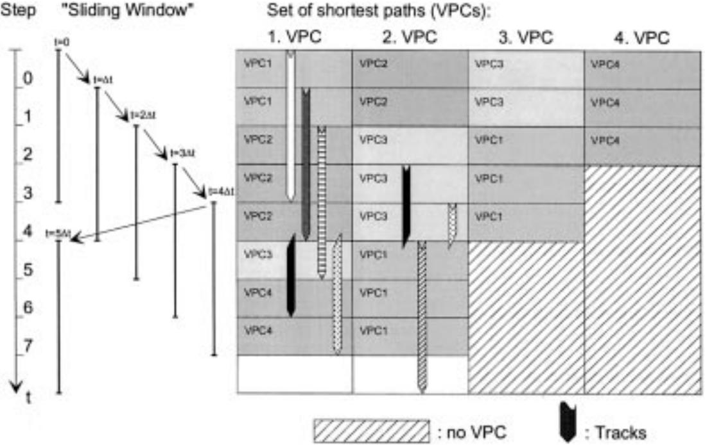  
Fig. 11. Sliding window optimization approach. Same VPC numbers and gray-scale levels identify one unique physical path.

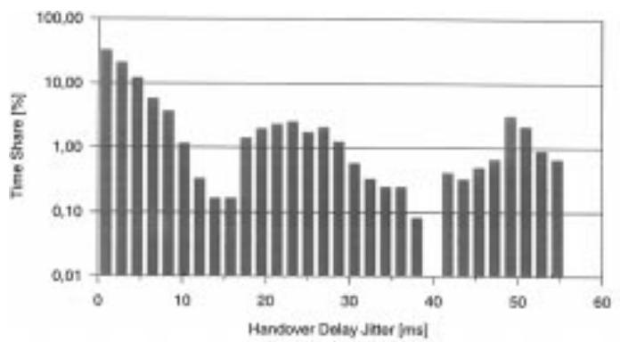  
(a)

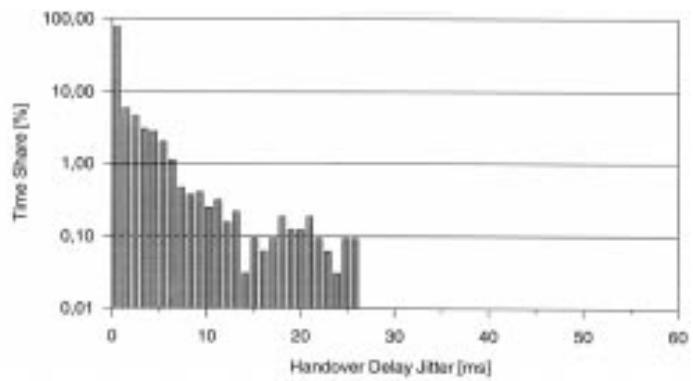  
(b)  
Fig. 12. Distribution of VPC-handover related delay jitter for a 2 min call from first satellite $S _ { 0 }$ in Iridium, averaged over all possible last satellites and one system period. Optimization strategy: (a) minimize number of VPC–HO during one system period, and (b) minimize HO delay jitter within a 2 min sliding window.

Fig. 12 illustrates a representative numerical performance comparison of the two proposed optimization approaches in terms of HO delay jitter distribution, experienced by a fixed-length 2 min call in the Iridium ISL subnetwork. The simulated calls are equally distributed over time and all possible first/last satellite pairs. Considering such 2 min fixedlength calls is, of course, not close to reality, but it is the only way to make a fair (and at least basic) comparison of both approaches with a discrete-time interval $\Delta t = 1$ min. The distributions emphasize the superior performance of the service adaptive sliding window approach over the simple period-based optimization scheme. The numerical results given in Fig. 13 are much more speaking because they are based on a realistic service scenario. It provides the distribution of VPC handover delay jitter for typical telephone service, i.e., showing a negative exponentially distributed call holding time with mean $T = 3$ min. The length of the sliding window for HO delay jitter minimization has been 5 min. Note that the shown distribution is conditional, normalizing with respect to the total number of encountered handover situations. With the given simulation parameters, in fact, only fewer than 20% of the calls are affected by a handover at all. Altogether, this results in a very low percentage of calls that have to cope with HO delay jitter larger than 20–30 ms. However, if one wants to guarantee optimal performance in light of ATM QoS, the remaining delay jitter values—which are minimized within the topology-specific limitations—represent critical requirements for any hitless path-switching functionality to operate in the ISL subnetwork.

## VI. CONCLUSION

The proper use of ATM concepts in future satellite personal communication networks has been shown to be feasible.

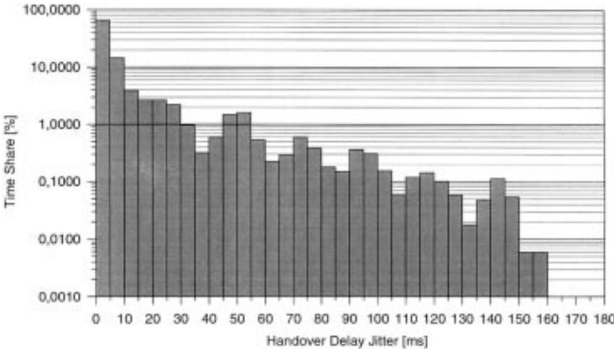  
Fig. 13. Distribution of VPC-handover related delay jitter for typical telephony service (negative exponentially distributed call holding time with mean $T = 3$ min), averaged over all first/last satellite pairs and one system period. Optimization strategy: minimize HO delay jitter within a 5 min sliding window (i.e., 80% of calls end within optimized track).

Specific strengths of ATM can be introduced to the networking of low earth orbiting satellite systems with intersatellite links. We have especially focused on routing in the ISL subnetwork, which shows a periodically time-variant topology. A dynamic routing concept, discrete-time dynamic virtual topology routing (DT-DVTR), has been developed to efficiently cope with this feature.

DT-DVTR works completely off-line, i.e., prior to the operational phase of the system. In a first step, a virtual topology is set up for all successive time intervals, providing instantaneous sets of alternative paths between all source–destination node pairs. In the second step, path sequences over a series of time intervals are chosen from that according to certain optimization procedures.

A VPC-based implementation of DT-DVTR in LEO satellite ISL networks has been discussed and evaluated by software simulation. It could be shown that appropriate optimization strategies are specifically capable of minimizing severe delay jitter which inevitably is encountered in path handover situations. The preferred option for routing optimization in the dynamic topology scenario is a sophisticated, serviceadaptive sliding window scheme. The higher implementation complexity of this scheme—compared to a simple reference approach—has been shown to be tractable; on the other hand, it clearly performs better than simpler schemes in terms of minimized delay jitter, which in turn reduces complexity of the ATM cell streams alignment. Since this is one of the most critical elements in an ATM-based operation of S-PCN, further work will extend the elaboration and performance evaluation of sophisticated delay jitter minimization schemes in combination with alignment procedures adapted to the LEO satellite environment.

In future work, we also intend to refine the traffic modeling with respect to both, an improved global geographic traffic distribution and realistic PCN user service/traffic profiles.

In the medium term, research on broadband aspects of the considered systems should also be intensified.

## ACKNOWLEDGMENT

The author would like to thank all colleagues at DLR who have contributed to this work with their expertise in fruitful discussions. Special thanks are due to C. Delucchi and G. Berndl, who have additionally developed the software and evaluated a variety of simulation runs. Last, but not least, the author appreciates the valuable comments from the anonymous reviewers who have helped to improve the comprehension and overall quality of the manuscript.

## REFERENCES

[1] J. Hutcheson and M. Laurin, “Network flexibility of the IRIDIUM global mobile satellite system,” in Proc. 4th Int. Mobile Satellite Conf. (IMSC’95), Ottawa, Canada, June 1995, pp. 503–507.

[2] M. A. Sturza, “Architecture of the TELEDESIC satellite system,” in Proc. 4th Int. Mobile Satellite Conf. (IMSC’95), Ottawa, Canada, June 1995, pp. 212–218.

[3] S. Agnelli and P. Mosca, “Transmission of framed ATM cell streams over satellite: A field experiment,” in Proc. IEEE Int. Conf. Commun. (ICC’95), Seattle, WA, June 1995, pp. 1567–1571.

[4] G. Maral, J.-J. De Ridder, B. G. Evans, and M. Richharia, “Low earth orbit satellite systems for communications,” Int. J. Satellite Commun., vol. 9, pp. 209–225, Sept./Oct. 1991.

[5] M. Werner, A. Jahn, E. Lutz, and A. B¨ottcher, “Analysis of system parameters for LEO/ICO-satellite communication networks,” IEEE J. Select. Areas Commun., vol. 13, pp. 371–381, Feb. 1995.

[6] M. Werner, “Analysis of system connectivity and traffic capacity requirements for LEO/MEO S-PCN’s,” in Mobile and Personal Commun., Proc. 2nd Joint COST 227/231 Workshop, E. Del Re, Ed., Florence, Italy, Apr. 1995, Elsevier, pp. 183–204.

[7] M. de Prycker, Asynchronous Transfer Mode: Solution for Broadband ISDN, 2nd ed., Ser. in Comput. Commun. and Networking. New York, London: Ellis Horwood Limited, 1993.

[8] B. Edmaier, J. Eberspacher, W. Fischer, and A. Klug, “Alignment server ¨ for hitless path-switching in ATM networks,” in Proc. 15th Int. Switching Symp. (ISS’95), Berlin, Germany, Apr. 1995, pp. 403–407.

[9] G. Luton, “An ATM based concept for handover operation in LEO/MEO satellite systems,” Master’s thesis, ENST Toulouse/DLR Oberpfaffenhofen, Toulouse, France/Weßling, Germany, Aug. 1995.

[10] A. S. Acampora and M. Naghshineh, “An architecture and methodology for mobile-executed handoff in cellular ATM networks,” IEEE J. Select. Areas Commun., vol. 12, pp. 1365–1375, Oct. 1994.

[11] E. W. Dijkstra, “A note on two problems in connection with graphs,” Numer. Math., vol. 1, pp. 269–271, 1959.

[12] C. Delucchi, “Routing strategies in LEO/MEO satellite networks with intersatellite links,” Master’s thesis, Inst. Commun. Networks, Tech. Univ. Munich, Munich, Germany, Aug. 1995.

[13] G. Berndl, “Ein Routingkonzept zur st¨orungsfreien ATM-Pfadumschaltung in LEO-Satellitennetzen mit Intersatellitenverbindungen,” Master’s thesis, Inst. Commun. Networks, Tech. Univ. Munich, Munich, Germany, June 1996.

Markus Werner (M’92) received the Dipl.-Ing. degree in electrical engineering from Darmstadt Technical University, Darmstadt, Germany, in 1991.

Since 1991, he has been a Research Scientist with the Institute for Communications Technology, German Aerospace Research Establishment (DLR), Oberpfaffenhofen, Germany. His project activities include participation in ESA studies and in European COST 227, COST 252, and ACTS programs. His research interests are in the areas of communication networks, traffic engineering, and networking

aspects of nongeostationary satellite systems. His current work focuses on routing and dimensioning in networks with dynamic topology. He is also a Lecturer at the Carl-Cranz-Gesellschaft.