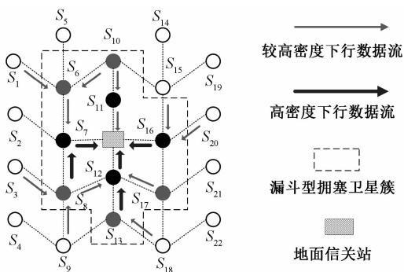
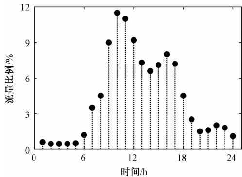
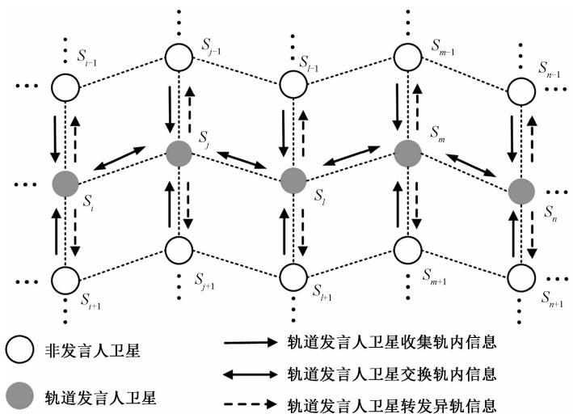
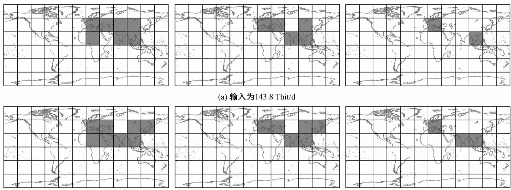
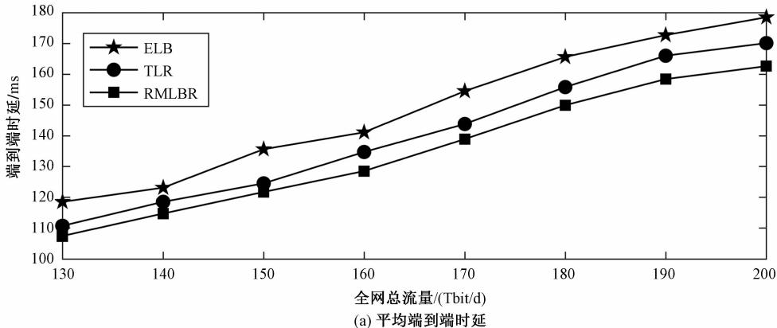
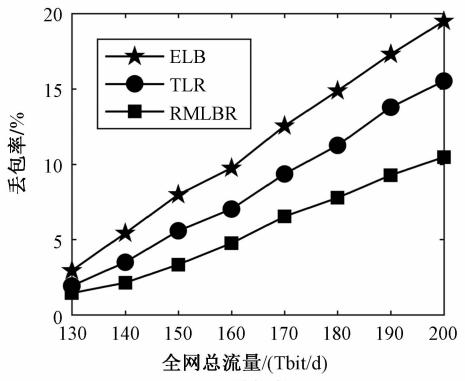
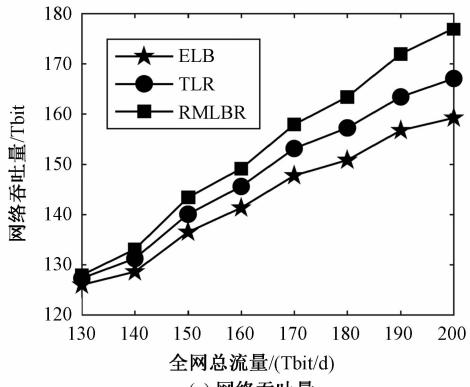

文章编号: 2095-6134( 2021) 05-0687-09

# 基于区域分流的低轨卫星星座星间负载均衡路由算法

周雅1，2，谢卓辰1，刘沛龙3，刘会杰1

( 1 中国科学院微小卫星创新研究院，上海 201203;2 中国科学院大学，北京 100049;3 清华大学北京信息科学与技术国家研究中心，北京 100084)( 2019 年 12 月 5 日收稿; 2020 年 2 月 28 日收修改稿)

Zhou Y, Xie Z C, Liu P L, et al. Inter-satellite load balancing routing algorithm for LEO satellite constellation based on regional-traffic-detour [] . Journal of University of Chinese Academy of Sciences ,2021 ,38( 5) : 687–695

摘 要 低轨卫星通信网络具有流量分布不均 地面站分布不均且网络负载随时间变化等特点。 卫星与就近地面站间的数据传输将会导致空间段动态漏斗型拥塞，进而引发馈线拥塞并劣化端到端通信指标。 提出基于区域分流的多径搜索负载均衡路由算法( regional-traffic-detour multipath search load balancing routing algorithm，RMLBR) ，RMLBR 根据卫星网络状态及目的节点距离计算转移概率，以实现区域分流，并以时延为约束进行多径搜索获得最佳路径及备选路径以缓解动态漏斗型拥塞。 仿真结果表明，与交通灯智能路由策略( traffic-light basedintelligent routing strategy，TLR) 和 显 式 负 载 均 衡 算 法 ( explicit load balancing，ELB ) 相 比，RMLBR 可以有效地缓解漏斗型拥塞，降低端到端延时延及丢包率，并缩小高流量区域范围

关键词 区域分流; 多径路由; 负载均衡; 地面站

中图分类号: TN927

文献标志码:A

doi: 10.7523/j. issn. 2095–6134.2021.05.013

# Inter-satellite load balancing routing algorithm for LEO satellite constellation based on regional-traffic-detour

ZHOU Ya1，2，XIE Zhuochen1，LIU Peilong3，LIU Huijie ( 1 Innovation Academy for Microsatellites，Chinese Academy of Sciences，Shanghai 201203，China; 2 University of Chinese Academy of Sciences，Beijing 100049，China; 3 Beijing National Research Center for Information Science And Technology，Tsinghua University，Beijing 100084，China)

Abstract The LEO ( low earth orbit) satellite communication networks are characterized by nonuniform traffic distribution，unevenly ground station distribution，and time-varying network load． The data transmission between satellites and the nearby ground stations may lead to dynamic funneltype congestion in the space segment. It will result in the congestion of the feeder link congestion and the worse end-to-end characteristics． In this article，a regional-traffic-detour multipath search load balancing routing algorithm ( RMLBR ) is proposed． RMLBR calculates the transition probability according to satellite network status and the source-to-destination distance to implement the regional-traffic-detouring. Under the constraint of path delay, the optimal path and alternative path are obtained by the multipath search to alleviate the dynamic funnel-type congestion. The simulation shows that RMLBR can alleviate the funnel-type congestion, reduce the end-to-end delay, the packet loss, and the size of the high flow area compared with TLR( traffic-light based intelligent routing strategy) and ELB (explicit load balancing).

regional-traffic-detour; multipath routing; load balancing; ground station

随着全球通信业务的迅速增长，卫星通信系统在各领域应用愈发广泛［1］。 未来低轨卫星网络可成为人们日常生活中的重要组成部分［］低轨卫星通信系统凭借其覆盖范围广 传播时延小和终端设备发射功率低等优势，使借助 LEO 卫星进行数据传输越发受到广泛关注［3］ 同时，星间链路的使用既满足高质量和高数据安全性等特殊应用需求，也引发了业内对卫星星座网络路由问题的持续关注，其中负载均衡问题是路由算法研究的重要部分，也是基于星间链路的卫星网络设计中的重要问题［4］

相较于中高轨卫星，低轨卫星具有低时延特征，理论上能够支持时延敏感型垂直应用，如实时视频传输 远程工业控制 远程医疗等 因此，端到端时延成为低轨卫星网络负载均衡路由算法设计中需要考虑的重要因素之一［］

为了满足卫星通信系统星上数据就近落地需求，提高系统总吞吐量，现有的卫星通信系统( 如OneWeb 等) 都具有分布在全球各地的地面信关站［6］。 由于全球用户的非均匀分布及其活跃度随时间动态变化，卫星系统数据流通过地面站就近下行会引发空间段拥塞并加重馈线负担，这种拥塞模式是一种漏斗型的新型拥塞模式且极易引起雪崩式拥塞，进而引起空间段端到端通信的性能劣化［7］。

漏斗型拥塞形态随着网络状态不断动态变化，图 以每个地面站同时跟踪 颗卫星为例给出一种特殊的漏斗型拥塞形态 如图 1 所示，由于卫星 $S _ { 7 } { \cdot } S _ { 1 1 } { \cdot } S _ { 1 2 } { \cdot } S _ { 1 6 }$ 与地面站之间的馈线传输能力有限，而各个方向通过地面站下行的非均匀数据流向地面站上方卫星簇不断汇聚，由此形成一个漏斗型拥塞区域 目前的负载均衡技术并未针对此类拥塞模式进行优化。

卫星网络多径路由策略利用卫星网络具有动态可预测的拓扑形态以及卫星节点间的天然多径的特点进行设计［8］ 相对单条路径的路由策略而言，多径路由的分流策略更加灵活 CEMR( compact explicit multi-path routing) 算法首先提出卫星网络中的多径路由策略，综合考虑排队时延与传播时延计算路由表，但具体的多径实现方式并未详述［9］ Taleb 等［10］给出一种显式负载均衡( explicit load balancing，ELB) 算法，该算法监控本地拥塞状态，当发生拥塞时及时通知上游将通过本地拥塞卫星的 χ%的流量通过备选路径进行转发 在此基础上 Song 等［ ］提出交通灯智能路由 策 略 ( traffic-light based intelligent routingstrategy，TLR) ，采用交通灯的“红绿灯”概念将本地队列与卫星整体队列的情况分为 3 级，综合考虑本地与下一跳节点的状态选择转发策略，如果最优路径及备选路径均为红灯则不适合转发，此时将数据分组存入等待区，直到任一路径恢复为非红灯状态后发出。 ELB 算法和 TLR 算法虽然能在一定程度上缓解拥塞，缩短端到端时延，但其分流策略不具有全局视野，容易陷入局部最优Liu 等［12］进一步提出一种基于混合分流策略的负载 均 衡 路 由 策 略 ( hybrid traffic detour loadbalancing routing，HLBR) ，该策略将长程绕行与分布式分流2 种方式相结合以实现高效自适应负载均衡 但 HLBR 算法的分流策略较为复杂，牺牲了一定的时间复杂度及空间复杂度

  
图 漏斗型拥塞形态示意图  
Fig. 1 Funnel-type congestion pattern

综上所述，已有的路由算法都没有针对性地解决地面站就近下行引起的漏斗型拥塞问题，而此类拥塞会严重影响低轨卫星通信系统空间段端到端通信的负载均衡及通信信息的时效性。 为了满足星地传输需求，保障通信时效性并实现空间段负载均衡，本文从全网链路代价计算与多径计算2 个方面对 TLR 算法进行改进，提出一种基于区 域 分 流 的 多 径 搜 索 负 载 均 衡 路 由 算 法( regional-traffic-detour multipath search loadbalancing routing algorithm，RMLBR) 。

## 1 系统模型

## 1. 1 星座模型

本文利用中国科学院微小卫星创新研究院某在研类铱星极轨道( walker polar) 星座构建星座模型并进行路由算法设计。 该星座包含 $\mathrm { { N u m } } _ { \mathrm { { t o t a l } } } =$ $\mathrm { N u m _ { o r b i t } { \times N u m } _ { \mathrm { s a t p e r o r b } } }$ 颗卫星及若干地面信关站，其中 $\mathrm { N u m } _ { \mathrm { o r b i t } }$ 代表轨道数目， $\mathrm { N u m } _ { \mathrm { s a t p e r o r b } }$ 代表每轨卫星数目，全网所有卫星节点构成卫星集合 $S = \left\{ S _ { i } \right.$ $\left| \begin{array} { l } { 1 } \end{array} \right| \leqslant i \leqslant \mathrm { N u m } _ { \mathrm { t o t a l } } \}$ 每颗卫星都具有4 条节点到节点的双工星间链路，最多可连接4 颗邻近卫星，其中2 条为同轨链路，2 条为轨间链路 当卫星经过极区上方与反向缝处时轨间链路关闭，且卫星可以与其覆盖范围内的终端设备及地面信关站建立星地链路 此外，每颗卫星各链路的发射机中均配置参数一致的缓存队列用于缓存数据分组。

由于卫星的动态运动及地球的自转，每个卫星覆盖的范围及卫星之间的连接关系持续变化为了便于研究，本文通过虚拟拓扑法将不断运动的实际卫星一一映射为静态的虚拟卫星，并将每颗虚拟卫星与一个固定的覆盖范围进行绑定 当实际卫星运动时，其对应的虚拟卫星也会随之变化 覆盖区域的划分与卫星星座构型有关，根据星座构型将地球表面划分为 $\mathrm { { N u m } _ { \mathrm { { t o t a l } } } }$ 个区域。

## 1. 2 流量模型

本文使用文献［14］中的数据及方法并结合中国科学院该在研星座试运营阶段的星座构型建立流量模型作为算法的参考输入

首先，根据该星座 Walker 72/6/3 型星座构， 72 30°$\times 3 0 ^ { \circ }$ 的区域，并为每一区域计算得到一个静态设备密度指数 SDI ( static device density index) 如图2 所示 此外，由于全网流量分布还具有时变性，因此计算流量比例 $\rho _ { \mathrm { h } }$ 随时间变化情况如图 3所示。

然后，为了有效缓解星地传输带来的空间段拥塞，使用文献［7］中的方法对不同目的节点的流量进行分类: 将需要通过地面信关站下行并接入地面核心网的流量称为星地流量( satellite toground traffic，SGT) ，而无需经过地面站传输的流量则称为端到端流量 ( satellite to satellite traffic，SST) 并根据文献［6］，对不同类型的流量分别计算对应的卫星 $S _ { i }$ 与卫星 $S _ { j }$ 间流量需求指数$\mathrm { T D I } _ { i j } ( \mathrm { \ t r a f f i c { \ d e m a n d \ i n d e x } , T D I ) }$ ，具体公式如下

<table><tr><td>65</td><td>10</td><td>10</td><td>10</td><td>10</td><td>10</td><td>80</td><td>80</td><td>45</td><td>45</td><td>30</td><td>10</td></tr><tr><td>30</td><td>80</td><td>350</td><td>340</td><td>80</td><td>130</td><td>520</td><td>250</td><td>300</td><td>460</td><td>530</td><td>50</td></tr><tr><td>10</td><td>15</td><td>300</td><td>460</td><td>50</td><td>100</td><td>200</td><td>120</td><td>160</td><td>400</td><td>220</td><td>40</td></tr><tr><td>15</td><td>10</td><td>10</td><td>150</td><td>150</td><td>10</td><td>60</td><td>60</td><td>20</td><td>60</td><td>160</td><td>45</td></tr><tr><td>10</td><td>10</td><td>10</td><td>80</td><td>50</td><td>10</td><td>30</td><td>15</td><td>10</td><td>20</td><td>60</td><td>35</td></tr><tr><td>10</td><td>10</td><td>10</td><td>10</td><td>10</td><td>10</td><td>10</td><td>10</td><td>40</td><td>10</td><td>10</td><td>10</td></tr></table>

图 地理区域划分及静态设备密度指数

Fig. 2 Earth zone division and static device density index  
  
图 流量比例变化图  
Fig. 3 Variation of the traffic ratio

$$
\mathrm{TDI} _ {i j} = \left\{ \begin{array}{l} \frac {\left(\mathrm{SDI} _ {i} \times \mathrm{SDI} _ {j}\right) ^ {\gamma}}{d _ {i j} ^ {\delta}}, \text {SGT}, \\ \left(\mathrm{SDI} _ {i} \times \mathrm{SDI} _ {j}\right) ^ {\gamma}, \text {SST}. \end{array} \right.\tag{1}
$$

其中: $d _ { i j }$ 为2 颗卫星间距离，设置星地流量系数$\gamma = 0 . 5 , \delta = 2 . 0 ;$ 设置端到端流量系数 $\gamma = 0 . 8$

最后，文献［12］中提出流量模型的建立还受到时间的影响，因此在卫星间流量需求指数 $\mathrm { T D I } _ { i j }$ 基础上计算卫星间实时流量需求，计算公式如下

$$
\lambda_ {\rho_ {h}, i, j} = \frac {\mathrm{TDI} _ {i , j}}{\sum_ {i = 1} ^ {\text {Num} _ {\text {total}}} \sum_ {j = 1} ^ {\text {Num} _ {\text {total}}} \mathrm{TDI} _ {i , j}} \times \rho_ {h} \times \frac {A}{3 6 0 0}, i \neq j, \tag {1}\tag{2}
$$

其中: A为全网全天流量总和，流量模型中单位时间产生的数据分组服从泊松分布，由此可得卫星平均数据生成率为 $\sum _ { j = 1 , i \ne j } ^ { \mathrm { { \scriptsize ~ N u m } _ { \mathrm { { t o t a l } } } } } \lambda _ { \rho _ { \mathrm { h } } , i , j }$

## 2 算法描述

本文提出的 RMLBR 算法分为全网信息收集 链路代价计算 多径计算以及多径转发策略 4个部分。 算法开始时先进行全网状态信息收集建立全网信息库，再根据收集得到的信息分区域计算链路代价作为多径计算的输入，然后结合约束条件进行搜索得到一条最优路径及一条备选路径，最后在转发过程中根据当前网络状态使用“红绿灯”策略选择下一跳

## 全网信息收集

有效准确地收集全网状态是保障分流策略及多径计算有效性的重要措施。 在全网信息收集阶段，使用文献［11］轨道发言人策略进行网络状态收集。 轨道发言人策略如图 4 所示，低轨卫星网络每个轨道均设置一颗发言人卫星，轨内非发言人卫星收集本地状态并发送至发言人卫星，发言人卫星收集本轨内信息后生成轨道信息包发送至其他轨道的发言人卫星，此外，发言人卫星接收其他轨道的信息包，并转发给轨内非发言人卫星，最后建立起全网信息库。

  
图 4 轨道发言人策略  
Fig. 4 Orbit speaker strategy

## 2. 2 链路代价计算

合理计算全网链路代价可以有效地描绘网络中各条链路及各区域状态，从而使算法具有全局视野并提高算法性能。 为了更加细致地反映全网状态以及地面站上方空间段的潜在拥塞可能，引导算法进行分流，在全网状态信息的基础上分区域计算链路代价，避免算法陷入局部最优

本文引用文献［7］中站域的概念，将地面站上方易拥塞的空间段区域称为站域( station area，SA) ，站域上方卫星集合称为站域卫星( stationarea satellite，SAS) ，其余卫星为非站域卫星( nonstation area satellite，nSAS) 。 对不同区域分别计算链路代价以实现多径计算

文献［7］中以站域指数 SI 来衡量当前区域受地面站就近星地传输的影响程度进而划分站域，其中站域指数 SI 的计算使用线性模型，这样虽然能够简化运算便于仿真，但难以准确地刻画各个因素与站域指数 SI 之间的关系，使得站域

的划分不够精确。

为了更准确地描绘站域形态及地面站就近星地传输对各个区域带来的潜在拥塞风险，本文对站域指数 SI 的计算方法进行改进 站域指数 SI取值受到静态设备密度指数 SDI 卫星覆盖区域中心与地面站之间的距离 SGd 以及地面用户活跃指数 UAI 这3 种因素的影响，其中距离地面站越近的区域汇聚的星地流量越多，发生拥塞的可能性就越大，因此站域指数 $\mathrm { S I } _ { i }$ 与卫星覆盖区域中心与地面站之间的距离 SGd 成反比; 而覆盖区域的静态设备越多，用户越活跃，则该区域产生的流量也相应较大，故站域指数 SI 与静态设备密度指数 SDI 及地面用户活跃指数 UAI 成正比综上所述对站域指数 SI 建模如下:

$$
\mathrm{SI} _ {i} = \frac {\mathrm{SDI} _ {i} ^ {\kappa} \times \mathrm{UAI} _ {i} ^ {\lambda}}{\mathrm{SGd} _ {i} ^ {\mu}},\tag{3}
$$

$$
\mathrm{UAI} _ {i} = \frac {\rho_ {\mathrm{h}} \times \mathrm{SDI} _ {i}}{\rho_ {\mathrm{h}} ^ {\max} \times \mathrm{SDI} _ {i} ^ {\max}},\tag{4}
$$

其中: $\kappa = 0 . 5 , \mu = 0 . 8 , \lambda = 0 .$ 5为以上3 种因素对站域指数 $\mathrm { S I } _ { i }$ 的贡献因子 $\ S \rho _ { \mathrm { h } } ^ { \mathrm { m a x } }$ 为静态设备随时间变化的流量比例的最大值; SDIi 为静态设备密度指数最大值。 当站域指数 SI $\mathrm { \cdot } ( \mathrm { \ S I } _ { i } > 0 )$ 大于阈值$\omega _ { \mathrm { s l } } ( \ 0 < \omega _ { \mathrm { s l } } < 1 0 0 \% )$ 时则认为该区域为站域，否则为非站域。

由于站域卫星存在比较大的拥塞可能性，而端到端流量无需经过地面站进行星地传输，因此在计算路径时尽可能少地使用站域卫星作为中间节点，减轻站域的流量负载。 为了区分不同链路的状态并实现分流，本文根据站域指数 SI 分区计算卫星 $S _ { i }$ 与卫星 $S _ { j }$ 之间链路代价 $\mathrm { c o s t } ^ { i j }$ ，链路代$\mathrm { c o s t } ^ { i j }$ 由链路队列排队代价 $\mathrm { c o s t } _ { \mathrm { q u e } } ^ { i j }$ 及链路传播代价 $\mathrm { c o s t } _ { \mathrm { p r o p } } ^ { i j }$ 共同决定:

$$
\mathrm{cost} ^ {i j} = \mathrm{cost} _ {\mathrm{que}} ^ {i j} + \mathrm{cost} _ {\mathrm{prop}} ^ {i j},\tag{5}
$$

其中链路传播代价 $\mathrm { c o s t } _ { \mathrm { p r o p } } ^ { i j }$ 为链路传播时延 $T _ { \mathrm { p r o p } } ^ { i j }$ 即

$$
\mathrm{cost} _ {\mathrm{prop}} ^ {i j} = T _ {\mathrm{prop}} ^ {i j},\tag{6}
$$

$$
T _ {\text { prop }} ^ {i j} = \frac {d _ {i j}}{c},\tag{7}
$$

式中: $d _ { i j }$ 为2 颗卫星间距离 $_ { \pmb { \mathscr { S } } } \pmb { \mathscr { C } }$ 为光速。

链路队列排队代价 $\mathrm { c o s t } _ { \mathrm { q u e } } ^ { i j }$ 主要由链路队列排队时延 $T _ { \mathrm { q u } } ^ { i j }$ e 决定:

$$
T _ {\text { que }} ^ {i j} = \frac {\mathrm{QOR} _ {i j}}{\nu},\tag{8}
$$

其中: $\mathrm { Q O R } _ { i j }$ 为卫星 $S _ { i }$ 与临近卫星 $S _ { j }$ 链接的星间链路的队列占用率， $\nu$ 为发送速率。 当站域发生拥塞时，链路排队时延 $T _ { \mathrm { q u e } } ^ { i j }$ 显著增大，进而引起链路队列排队代价 $\cos \mathfrak { t } _ { \mathrm { q u e } } ^ { i j }$ 增加 为了研究站域卫星潜在拥塞可能性对链路排队时延 $T _ { \mathrm { q u \epsilon } } ^ { i j }$ 的影响，引入站域潜在拥塞代价 $\varphi _ { i } { \big ( } \varphi _ { i } \geqslant 0 { \big ) }$ 来表示由站域卫星潜在拥塞可能性而带来的额外链路队列排队代价，对于非站域卫星不使用该参数，得到链路队列排队代价 $\mathrm { c o s t } _ { \mathrm { q u e } } ^ { i j }$ 计算如下

$$
\operatorname{cost} _ {\text {que}} ^ {i j} = \left\{ \begin{array}{c} T _ {\text {que}} ^ {i j} + \varphi_ {i}, S _ {i} \text {为SAS}, \\ T _ {\text {que}} ^ {i j}, S _ {i} \text {为nSAS}. \end{array} \right.\tag{9}
$$

站域指数 $\mathrm { S I } _ { i }$ 越高，则说明覆盖该区域的卫星越容易发生拥塞，故站域潜在拥塞代价 $\varphi _ { i }$ 计算如下

$$
\varphi_ {i} = S I _ {i} \times T _ {\mathrm{que}} ^ {i j}, S _ {i} \text {为SAS}.\tag{10}
$$

综上所述，可以计算得到全网链路代价并作为多径计算过程中链路权重因子 $\psi _ { i j }$ 计算的基础

## 2. 3 多径搜索算法

TLR 算法中使用最短路径算法进行多径计算得到一条最优路径及一条备选路径。 本文提出的RMLBR 算法在站域划分的基础上进行区域分流，尽可能选择链路代价 $\mathrm { c o s t } ^ { i j }$ 小的卫星作为中间节点，从而使较为空闲的卫星得到利用，缓解站域卫星的负担，实现负载均衡。 此外，RMLBR 算法以当前节点与目的节点之间距离 $d _ { i d }$ 的倒数作为转向因子 $\eta _ { i j }$ 并引入节点可见性参数 $\boldsymbol { { \Gamma } } _ { i }$ ，避免在多径搜索过程中出现绕行和环路。 最后，为了满足在实时视频传输等多种时延敏感型场景中卫星数据的时效性，RMLBR 算法以路径总时延 $T _ { \mathrm { p a t h } }$ 作为多径搜索的约束，进而保证数据传输的时效性综上所述，RMLBR 算法使用链路权重因子 $\psi _ { i j }$ 转向因子 及节点可见性参数 $\eta _ { i j }$ $\boldsymbol { { \Gamma } } _ { i }$ 计算多径搜索中由节点 $S _ { i }$ 到节点 $S _ { j }$ 的转移概率p ，选择转移概率 $p _ { i j }$ $p _ { i j }$ 最大且满足约束的节点进行多径搜索进而得到最优路径及备选路径。 具体过程详述如下:

首先，RMLBR 算法使用链路权重因子 $\psi _ { i j }$ 表示链路代价 $\mathrm { c o s t } ^ { i j }$ 对路径计算的影响。 链路代价$\mathrm { c o s t } ^ { i j }$ 描绘网络中各条链路及各区域的状态，链路代价 $\mathrm { c o s t } ^ { i j }$ 越大时，则说明该链路不适合用于数据传输，进而算法选择经过该链路的概率越低 由此本文使用链路代价 $\mathrm { c o s t } ^ { i j }$ 计算链路权重因子$\psi _ { i j }$ ，即

$$
\psi_ {i j} = \omega / 1 + \cos t ^ {i j},
$$

其中: $\omega$ 为常量，本文中取 $\omega = 1$

( 11)

其次，由于仅考虑链路代价而计算路径时容易舍近求远发生绕行，为减少冗余的中间节点并选择靠近目的节点的卫星作为中间跳，RMLBR 算法以当前节点 $S _ { i }$ 与目的节点 $S _ { d }$ 之间的距离的倒数作为转向因子 $\eta _ { i j }$ ，即

$$
\eta_ {i j} = 1 / d _ {i d}.\tag{12}
$$

此外，为避免在计算路径时出现环路，RMLBR 算法设置了节点可见性参数 $\boldsymbol { { \Gamma } } _ { i }$ 来标记该节点是否已被访问:

$$
\Gamma_ {i} = \left\{ \begin{array}{l l} 0, S _ {i} & \text { 已被访问 }, \\ 1, S _ {i} & \text { 未被访问 }. \end{array} \right.\tag{13}
$$

根据上述分析，RMLBR 算法定义由节点 $S _ { i }$ 到临近节点 $S _ { j }$ 的转移概率 $p _ { i j }$ 为

$$
p _ {i j} = \left\{ \begin{array}{c} \Gamma_ {i} \times [ \psi_ {i j} ] ^ {\alpha} \times [ \eta_ {i j} ] ^ {\beta} \\ \hline \sum_ {S _ {x} \in N (i)} [ \psi_ {i j} ] ^ {\alpha} \times [ \eta_ {i x} ] ^ {\beta}, S _ {j} \in N (i) \\ 0, S _ {j} \notin N (i). \end{array} \right.\tag{14}
$$

其中: $\psi _ { i j }$ 为链路权重因子; $\eta _ { i j }$ 为转向因子; $\boldsymbol { { \Gamma } } _ { i }$ 为节点可见性参数; $\alpha \bullet \beta$ 为链路权重因子 $\psi _ { i j }$ 与转向因子 $\eta _ { i j }$ 的贡献系数; N( i) 为当前节点 $S _ { i }$ 的临近节点集合。

在多径搜索策略开始时，将全网所有节点的可见性参数 $\boldsymbol { { \Gamma } } _ { i }$ 均设置为 1，表示所有节点均未被访问，并根据全网信息收集阶段得到的信息对链路权重因子 $\psi _ { i j }$ 及转向因子 $\eta _ { i j }$ 进行初始化。

最后，由于端到端时延是空间通信系统服务质量的重要影响因素［15］，为保证时延敏感型场景下的服务质量及数据分组时效性，RMLBR 算法引入路径时延约束。 RMLBR 算法将由源节点开始遍历后所经过的路径时延作为寻径约束，即已选择的节点组成的路径 $\mathrm { P a t h } _ { m }$ 中各条链路的传播时延和排队时延之和 $T _ { \mathrm { p a t h } }$ 不能超过规定的路径时延的门限 $T _ { \mathrm { l i m i t } }$ t，其中路径时延 $T _ { \mathrm { p a t h } }$ 计算公式如下

$$
T _ {\text { path }} = \sum T _ {\text { link }} ^ {i j},\tag{15}
$$

$$
T _ {\text { link }} = T _ {\text { que }} ^ {i j} + T _ {\text { prop }} ^ {i j},\tag{16}
$$

其中: $T _ { \mathrm { l i n k } } ^ { i j }$ 为遍历过程中各条链路的时延。 门限$T _ { \mathrm { l i m i t } }$ 由实际场景中的时延要求决定，当门限 $T _ { \mathrm { l i m i t } }$ 取值过大时会失去约束作用，而取值过小易导致多径计算的失败。

综上所述， 算法由当前节点 $S _ { i }$ 选择临近节点 $S _ { i }$ 进行遍历需满足以下条件

$$
\left\{ \begin{array}{l} \max p _ {i j} = \left\{ \begin{array}{c} \Gamma_ {i} \times [ \psi_ {i j} ] ^ {\alpha} \times [ \eta_ {i j} ] ^ {\beta} \\ \hline \sum_ {S _ {x} \in N (i)} [ \psi_ {i j} ] ^ {\alpha} \times [ \eta_ {i x} ] ^ {\beta}, S _ {j} \in N (i), \\ 0, S _ {j} \notin N (i). \\ \text {s. t.} T _ {\text {path}} \leqslant T _ {\text {limit}}. \end{array} \right. \end{array} \right.\tag{17}
$$

其中： $\alpha \bullet$ 为链路权重因子与转向因子的贡献系数，N( i) 为当前节点 $S _ { i }$ 的临近节点集合

文献［16］提出，当多径之间存在公共节点时，其链路失效的可能性较大，因此为保证多径算法的性能，RMLBR 算法中多径计算遵循最优路径及备选路径之间无公共节点的原则。在备选路径计算中屏蔽最优路径中选择的中间节点，使得构成最优路径的节点在备选路径计算中不可见，以此实现2 条路径间无公有节点 RMLBR 算法中的多径搜索策略具体步骤如下:

步骤1 对全网所有节点进行初始化: 将卫星集合 S 中所有节点 $S _ { i }$ 可见性参数 $\boldsymbol { { \Gamma } } _ { i }$ 均设置为1，并根据式( 11) 及式( 12) 对链路权重因子 $\psi _ { i j }$ 及转向因子 $\eta _ { i j }$ 进行初始化。

步骤2 搜索当前节点 $S _ { i }$ 的下一跳。 若当前节点 $S _ { i }$ 为目的节点则算法结束; 反之，根据式( 14) 计算转移概率 $p _ { i j }$ 并从节点 $S _ { i }$ 的临近节点集合 N( i) 中选择概率最大的节点 $S _ { j }$ 作为下一跳并转至步骤3。 当节点 $S _ { j } ~ \in ~ N ( ~ i )$ 对应可见性参数$T _ { j }$ 均为0 时，说明 N( i) 中节点均已被访问，则退至节点 $S _ { i }$ 的前一跳节点 $S _ { \mathrm { { p r e } } }$ 重复步骤 2 进行搜索。

步骤 3 对于已选择的下一跳节点 $S _ { j }$ ，计算从节点 $S _ { i }$ 到节点 $S _ { j }$ 的链路时延 $T _ { \mathrm { l i n k } } ^ { i j }$ ，若 $T _ { \mathrm { p a t h } } { + } T _ { \mathrm { l i n k } } ^ { i j }$ ${ > } T _ { \mathrm { l i m i t } }$ ，则节点 $S _ { j }$ 不满足约束，退回到节点 $S _ { i }$ 并转至步骤2 重新进行搜索; 若 $T _ { \mathrm { p a t h } } + T _ { \mathrm { l i n k } } ^ { i j } \leqslant T _ { \mathrm { l i m i t } }$ ，则更新 $T _ { \mathrm { p a t h } } = T _ { \mathrm { p a t h } } + T _ { \mathrm { l i n k } } ^ { i j } , \ : T _ { \mathrm { j } } = 0 ;$ 并对节点 $S _ { j }$ 执行与节点$S _ { i }$ 相同的搜索操作直至到达目的节点

步骤4 在得到最优路径之后，重复步骤 $2 \sim$ 3 计算备选路径 最终得到 2 条路径，即路径数目 $\mathrm { N u m } _ { \mathrm { p a t h } } = 2$

此外，RMLBR 算法中多径搜索策略伪代码如表 1 所示 。

## 表 1 多径搜索策略伪代码

Table 1 Pseudocode of the multipath search strategy
1 Initialization
2 for $S_i \in S$ do
3 $\Gamma_i \leftarrow 1$;
4 $\psi_{ij} \leftarrow \omega / 1 + \text{cost}^{ij}$;
5 $\eta_{ij} \leftarrow 1 / d_{id}$;
6 end for
7 end initialization
8 procedure
9 for $\text{Num}_{\text{path}} \leftarrow 1$ to 2 do
10 while $S_i \neq S_d$ do
11 for $S_j \in N(i)$ 且 $\Gamma_j = 1$ do
12 计算转移概率 $p_{ij}$;
13 if 节点 $S_i$ 到节点 $S_j$ 的转移概率 $p_{ij}$ 最大 then
14 选择节点 $S_j$ 为下一跳节点备选;
15 end if
16 end for
17 if $S_j \in N(i)$ 均不满足 $\Gamma_j = 1$ then
18 退回到当前节点 $S_i$ 的前一跳 $S_{\text{pre}}$;
19 break;
20 else if $T_{\text{path}} + T_{\text{link}}^{ij} \leqslant T_{\text{limit}}$, then
21 $T_{\text{path}} \leftarrow T_{\text{path}} + T_{\text{link}}^{ij}$;
22 选择节点 $S_j$ 为下一跳节点;
23 更新节点 $S_j$ 可见性参数: $\Gamma_j \leftarrow 0$
24 else
25 退回到节点 $S_i$;
26 break;
27 end if
28 end while
29 end for
30 end procedure

## 2. 4 多径转发策略

在多径搜索结束后，全网各节点均将最优路径及备选路径写入路由表用于后续转发。 由于在数据分组转发的过程中网络状态不断变化，因此需要在转发过程中根据当前的网络状态对路径做出调整，选择合适的下一跳节点进行分流，从而实现负载均衡

RMLBR 算法采用文献［11］中的 “红绿灯”策略选择下一跳，根据卫星 $S _ { i }$ 各条链路的队列占用$\mathrm { Q O R } _ { i j }$ 及卫星 $S _ { i }$ 整体队列占用率 TQORi 设置卫星 $S _ { i }$ 各个方向上的红绿灯状态 红绿灯为 “绿色”表示该方向未发生拥塞，“黄色”表示该方向即将拥塞，“红色”表示该方向已发生拥塞。 当数据分组到达卫星 Si 时，先从路由表中得到下一跳的候选，然后判断最优路径及备选路径中下一跳方向上的红绿灯状态选择合适的转发方式，规则如下:

) 当最优路径下一跳方向上的红绿灯状态为“绿色”时，无论备选路径方向上是何种状态均选择最优路径下一跳进行转发

2) 当最优路径下一跳方向上的红绿灯状态为“黄色”时，若备选路径下一跳方向上红绿灯状态为“绿色”或 “黄色”，则进行分流，一半数据分组使用最优路径下一跳进行转发，另一半使用备选路径下一跳进行转发; 若为 “红色”，则选择最优路径下一跳进行转发

3) 当最优路径下一跳方向上的红绿灯状态为“红色”时，若备选路径下一跳方向上红绿灯状态为“绿色”或“黄色”，则使用备选路径下一跳进行转发; 若为 “红色”，则令数据分组在缓存区等待至任一路径为非红色状态再进行转发。

## 3 算法仿真

## 仿真参数设置

为了研究本文提出的 RMLBR 算法在具有地面站的低轨卫星通信系统中的性能，利用 OPNET进行网络仿真，以中国科学院某在研类铱星极轨道试运行阶段的星座作为仿真背景，其中地面站位置根据该星座设计说明设置。 在多种网络总流量输入下，从高流区域形态、网络丢包率、端到端时延及网络吞吐量 个方面与 算法和 ELB 算法进行对比，分析算法特性。

此外，本文不考虑信道误码对系统性能产生的影响，仅分析路由层算法性能 仿真过程中将上文所述流量模型作为参考输入进行研究，全网星间链路均配置 200 Mbps 容量，各个队列容量均为66 Mbit。 并根据实际系统应用场景及服务质量需求将 RMLBR 算法中站域指数阈值 $\omega _ { \mathrm { S I } }$ 设置为0.6，路径时延门限 $T _ { \mathrm { l i m i t } }$ 设置为 280 ms，ELB 算法及 TLR 算法中的相关参数完全按照文献［10-11］设定。 由于文中流量模型周期为24h，故设置仿真时间为24 h 并多次运行取均值进行研究

## 仿真结果及分析

根据文献［4］，本文将卫星队列占用率TQOR ＞40%的区域视为高流区，图 5 中阴影部分表示在网络总流量输入为 148. 3 和 189. 5 Tbit /d时，3 种算法的实时高流区形态，其中 RMLBR 算法的高流区范围最小，表明该算法有着较好的分流性能且缓解了拥塞 站域的划分预测了潜在的易拥塞区域，链路代价的分区计算能够引导路径搜索时尽可能少地使用站域卫星作为中间节点，降低了站域卫星的负载，使得较为空闲的卫星得到使用，从而实现负载均衡。

  
自左向右依次为 ELB TLR 和 RMLBR  
图 种算法的实时高流区形态  
Fig. 5 Real-time high traffic area pattern of three algorithms

图6 展示多种不同的全网总流量输入下，3种算法平均端到端时延、丢包率及网络吞吐量情况。 从图 6( a) 可以看出，RMLBR 算法的平均端到端时延最低。 其中，在 148．3 Tbit/d 的输入下，ELB TLR RMLBR 算法的端到端时延分别为118. 8 、 110. 9 和 107. 3 ms，RMLBR 算法相对降低了端到端时延，其原因在于该算法在多径计算时加入了时延的约束并使用转向因子以减少路径中出现绕行的情况 端到端时延的缩短使算法在实时视频传输等多种时延敏感型场景下具有更高的实用性。

  
(b) 丢包率

  
(c) 网络吞吐量  
图 算法端到端时延 丢包率及网络吞吐量  
Fig. 6 The end-to-end delay, packet loss rate, and network throughput by RMLBR

此外，由图 6( b) 和 6( c) 可见，RMLBR 算法在丢包率及吞吐量方面也具有优势，以 148.3Tbit/d 输入为例，ELB TLR RMLBR 算法的丢包率分别为 6. 68% 5. 03%和 3. 38%，吞吐量分别为790. 41 811. 51 和 830. 51 Gbit RMLBR 算法的性能优势主要得益于算法的设计充分考虑站域带来的潜在拥塞可能性计算端到端链路代价，并进行区域分流，从而缩小高流区范围，缓解了星地传输引起的空间段动态漏斗型拥塞

综上所述，通过对 ELB TLR RMLBR 算法的高流区域形态 网络丢包率 端到端时延及网络吞吐量4 个方面的仿真验证了 RMLBR 算法的有效性。

## 4 总结

本文针对低轨卫星通信系统非均匀分布地面信关站就近传输引起的空间段动态漏斗型拥塞问题进行研究，提出一种适用于对时延要求较高的场景下的路由算法———RMLBR 仿真结果表明，相对于经典的 ELB 算法和 TLR 算法，该算法能够缩小高流区域范围，缓解站域拥塞，并有效地降低端到端时延及网络丢包率，提高了网络吞吐量

## 参考文献

［1］ 刘沛龙，陈宏宇，魏松杰，等． LEO 卫星网络海量遥感数据 下行的负载均衡多径路由算法［J］． 通信学报，2018，38 ( Z1) : 135-142

［2］ Wood L，Clerget A，Andrikopoulos I，et al． IP routing issues in satellite constellation networks［J］． International Journal of Satellite Communications，2001，19( 1) : 69-92．

［3］ 晏坚． 低轨卫星星座网络 IP 路由技术研究［D］． 北京: 清华大学，2010．

［4］ 刘沛龙． 低轨卫星星座网络分布式路由算法研究［D］． 北京: 中国科学院大学，2018

［5］ Lu Y ，Zhang J ，Zhang T ． UMR: a utility-maximizing routing algorithm for delay-sensitive service in LEO satellite networks［J］． Chinese Journal of Aeronautics，2015，28( 2) : 499-507．

［6］ 晓春． OneWeb 太空互联网低轨星座的新进展［J］． 卫星 应用，2016，6: 75-77

［7］ 周雅，刘沛龙，谢卓辰，等． 低轨卫星宽带网络空间段站域负载均衡路由算法研究［ ］∥第十五届卫星通信学术年会论文集． 北京: 中国通信学会，2019: 111-122

［8］ 卢勇，赵有健，孙富春，等． 卫星网络路由技术［J］． 软件学报，2014，25( 5) : 177-192．

［9］ Bai J，Lu X，Lu Z，et al． Compact explicit multi-path routing for LEO satellite networks［C］∥HPSR． 2005 Workshop on High Performance Switching & Routing. Hong Kong, China: IEEE，2005: 386-390．

［10］ Taleb T，Mashimo D，Jamalipour A，et al． Explicit load

balancing technique for NGEO satellite IP networks with onboard processing capabilities［J］． IEEE /ACM Transactions on Networking，2009，17( 1) : 281-293．

［11］ Song G，Chao M，Yang B，et al． TLR: a traffic-light-based intelligent routing strategy for NGEO satellite IP networks［J］． IEEE Transactions on Wireless Communications，2014，13 ( 6) : 3380-3393．

［12］ Liu P，Chen H，Wei S，et al． Hybrid-traffic-detour based load balancing for onboard routing in LEO satellite networks ［J］． China Communications，2018，15( 6) : 28-41．

［13］ Yan H ，Zhang Q ，Sun Y ． A novel routing scheme for LEO satellite networks based on link state routing［C］∥2014 IEEE 17 International Conference on Computational Science ＆ Engineering． Chengdu: IEEE，2014: 876-880．

［14］ Liu Z，Li J，Wang Y，et al． HGL: a hybrid global-local load balancing routing scheme for the Internet of Things through satellite networks［J］． International Journal of Distributed Sensor Networks，2017，13( 3) : 9-24

［15］ 李彪，张灿，付前程． 空间通信系统模拟与 QoS 性能的研究 ［J］． 中国科学院研究生院学报，2008，25( 4) : 530-537．

［16］ 王厚天． 基于 QoS 保证的卫星通信系统关键技术研究［D］． 北京: 北京邮电大学，2014．