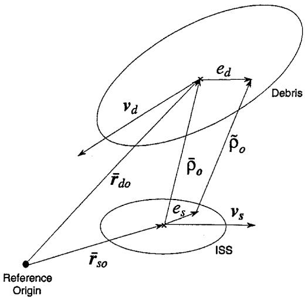
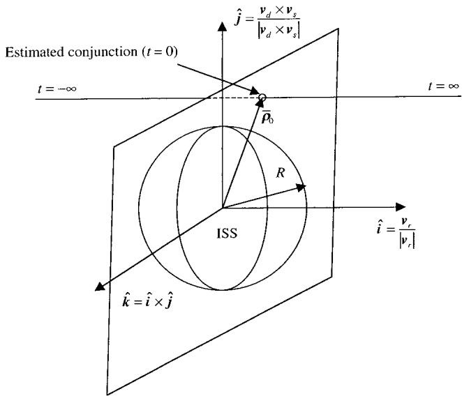
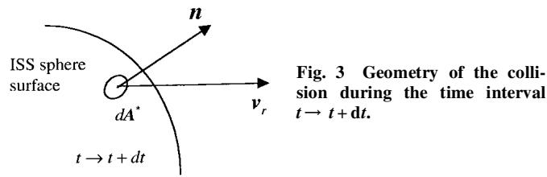

# Probability of Collision Between Space Objects

Maruthi R. Akella¤ and Kyle T. Alfriend†

Texas A&M University, College Station, Texas 77843-3141

The International Space Station is being designed to perform debris avoidance maneuvers based on certain criteria developed from the probability of collision $\mathcal { P } _ { c } .$ . Existing methods to determine the $\mathcal { P } _ { c }$ are based on the deŽ nitionof a collision/conjunction plane that containsall of the positionuncertainty associated with the problem.In this paper we develop a direct and more natural way of obtaining probability of collision and present an alternative but equivalent deŽ nition for $\mathcal { P } _ { c }$ that leads to the same results obtained earlier. Because debris avoidance is crucial for every orbiting asset in low Earth orbit, a study of this nature helps to establish the equivalence of different methods for risk assessment and evaluation.

## Introduction

HE International Space Station (ISS) shall continuously face T the threat of collision with orbiting debris. Hence, there needs to be a comprehensivemethodology that can assess the risks posed by individualdebris encountersand suggestmaneuverswhen necessary. Such a study shall not only beneŽ t the ISS, but also any future orbital asset placed in low Earth orbits. Thus, although we refer to the ISS in the rest of our paper, the analysis presented here holds true for any other orbiting asset of size and orbit comparable with that of the upcoming ISS.

Space shuttle (SS) maneuvers are commanded to avoid potential collisions with cataloged space objects (maintained by the U.S. Space Command) whenever the estimated conjunction with an object falls within a box centered on the estimated SS position. The dimensions of this conjunctionbox are 5 km in the in-track direction and 2 km in the radial and out-of-planedirections.The dimensions of such a conjunction box are probably based on prior estimates of position error covariances. The determination was made that this simple criterion, or any other known deterministiccriterion1,2 when applied to the ISS, would result in too many maneuvers.3 In addition, unnecessary maneuvers waste fuel and hamper the microgravity experiments onboard the ISS. Although the size of the conjunction box could be decreased to decrease the manuever rate, such a step clearly increases the risk to unacceptablelevels. Therefore, the ISS needs a more rigorous probability-basedapproach for collision avoidance.4

The calculation of the probability of collision requires the error covariance of the ephemerides of both the objects at conjunction. In Ref. 4 collision is considered as a single event, and there is just one value for the for the given encounter. Although this approach is very elegant and useful, there exists a more direct approach by Khutorovsky et al.,5 where the collision probability is obtained as a function of time. However, the method in Ref. 5 has an assumption that the size of the main object (station/asset) is small compared to the position uncertainty of the debris object. Although such an assumption gives reasonablymeaningful insights when both the colliding objects are small, it breaks down for objects not of negligiblesize compared to the ISS. In this paper we show that such an assumption is not necessary and thus extend the approach taken by Khutorovsky et al.5 to obtain the same result as given by Foster.4

## Derivation of Collision Probability

In this section we outline a detailed but slightly modiŽ ed development of Foster’s method4 of computing $\mathcal { P } _ { c }$ . The probability of collision $\mathcal { P } _ { c }$ for the entire encounter is deŽ ned to be the conditional probabilitywhen the minimum miss distanceoccurs at the estimated closest point of approach (CPA).

Let $t = 0$ at the CPA, i.e., at conjunction.Referring to Fig. 1, the nominal positionvectors for the ISS and debris at estimated CPA are given by $\bar { r } _ { \mathrm { { s o } } }$ and $\bar { r } _ { \mathrm { d o } }$ , respectively. Any set of perturbed trajectories for the ISS and debris given by $\ddot { r } _ { \mathrm { s o } }$ and $\tilde { r } _ { \mathrm { d o } }$ satisfy

$$
\tilde {\boldsymbol {r}} _ {\mathrm{so}} = \bar {\boldsymbol {r}} _ {\mathrm{so}} + \boldsymbol {e} _ {s}, \quad \tilde {\boldsymbol {r}} _ {\mathrm{do}} = \bar {\boldsymbol {r}} _ {\mathrm{do}} + \boldsymbol {e} _ {d}\tag{1}
$$

where $e _ { s }$ and $\scriptstyle { e _ { d } }$ are the uncertain variations in the position vectors for the space station and debris. Obviously, for this set of perturbed trajectories, the minimum miss-distance (conjunction) does not, in general, occur at time $t = 0$ . Also seen in Fig. 1 are the nominal velocity vectors for the ISS and debris denoted by $\nu _ { s }$ and $\nu _ { d } ,$ respectively. Given the extremely short duration of the encounter events, certain approximations can be justiŽ ed. All further developments assume the following:

1) The ISS and debris object nominal trajectories can be representedby straightlines with constantvelocitiesduringthe encounter. This is justiŽ ed because the time duration under considerationis no more than a few seconds.

2) There is no velocity uncertainty during the encounter. This is valid because typical velocity errors are of the order of few meters/second, and the time duration for the encounter is very small.

3) The position uncertainty during the encounter is constant and equal to the value at the estimated conjunction. This is a direct consequence of assumption 2.

4) The uncertainties in the positions of the ISS and debris are represented by Gaussian distributions. Although it is true that the assumed value of the position covariances signiŽ cantly affects the computed value of the probability of collision,6 in this paper we consider these error covariances to be true representativesof the state uncertainties at conjunction.

5) The ISS is much larger than the intercepting (debris) object so that the intercepting object can be considered a point mass.

The nominal trajectories near the estimated CPA for both objects are

$$
\bar {\boldsymbol {r}} _ {s} = \bar {\boldsymbol {r}} _ {\mathrm{so}} + \boldsymbol {v} _ {s} t, \quad \bar {\boldsymbol {r}} _ {d} = \bar {\boldsymbol {r}} _ {\mathrm{do}} + \boldsymbol {v} _ {d} t\tag{2}
$$

Including the position uncertainties in the debris and station, the actual (perturbed) positions are given by

$$
\tilde {\pmb {r}} _ {s} (t) = \tilde {\pmb {r}} _ {\mathrm{so}} + \pmb {v} _ {s} t, \qquad \tilde {\pmb {r}} _ {d} (t) = \tilde {\pmb {r}} _ {\mathrm{do}} + \pmb {v} _ {d} t\tag{3}
$$

The miss-vector between the space station and the debris object is deŽ ned as

$$
\begin{array}{r l} & {\tilde {\rho} (t) = \tilde {r} _ {d} (t) - \tilde {r} _ {s} (t) = \bar {r} _ {\mathrm{do}} - \bar {r} _ {\mathrm{so}} + (\nu_ {d} - \nu_ {s}) t + e _ {d} - e _ {s}} \\ & {\qquad = \bar {\rho} _ {o} + e _ {d} - e _ {s} + \nu_ {r} t = \tilde {\rho} _ {o} + \nu_ {r} t} \end{array}
$$

(4)

(14)

  
Fig. 1 Geometry of the encounter.

where v is the relative velocity vector and $\bar { \rho } _ { o }$ is the nominal missvector at conjunction seen in Fig. 1. These quantities are obtained by

$$
\bar {\rho} _ {o} = \bar {r} _ {\mathrm{do}} - \bar {r} _ {\mathrm{so}}, \qquad v _ {r} = v _ {d} - v _ {s}, \qquad \tilde {\rho} _ {o} = \bar {\rho} _ {o} + e _ {d} - e _ {s}\tag{5}
$$

From geometry the time of closest approach must satisfy d/ dt $( { \tilde { \rho } } ^ { \cdot }$ $\tilde { \rho } ) = 0$ leading to the following condition:

$$
\begin{array}{r l} \frac {\mathrm{d}}{\mathrm{d} t} (\tilde {\rho} \cdot \tilde {\rho}) & = \frac {\mathrm{d}}{\mathrm{d} t} [ (\tilde {\rho} _ {o} + v _ {r} t) \cdot (\tilde {\rho} _ {o} + v _ {r} t) ] \\ & = \frac {\mathrm{d}}{\mathrm{d} t} \left[ \tilde {\rho} _ {o} \cdot \tilde {\rho} _ {o} + 2 (\tilde {\rho} _ {o} \cdot v _ {r}) t + (v _ {r} \cdot v _ {r}) t ^ {2} \right] \\ & = 2 \tilde {\rho} _ {o} \cdot v _ {r} + 2 (v _ {r} \cdot v _ {r}) t = 0 \end{array}\tag{6}
$$

Solving Eq. (6), the time of CPA is

$$
t _ {\mathrm{cpa}} = - (\tilde {\rho} _ {o} \cdot \boldsymbol {v} _ {r}) / (\boldsymbol {v} _ {r} \cdot \boldsymbol {v} _ {r})\tag{7}
$$

By deŽ nition, when $\pmb { e } _ { d } = 0 , \pmb { e } _ { s } = 0$ , then $\tilde { \rho } _ { o } = \bar { \rho } _ { c }$ and $t _ { \mathrm { c p a } } = 0 .$ . Using this in Eq. (7), we obtain

$$
\bar {\rho} _ {o} \cdot v _ {r} = 0\tag{8}
$$

Next, using Eq. (7), we investigate the projection of the error in the closest approach vector onto the relative velocity vector at time $t = t _ { \mathrm { c p a } } .$

$$
\begin{array}{r l} & {\left[ \tilde {\rho} (t _ {\mathrm{cpa}}) - \bar {\rho} _ {o} \right] \cdot v _ {r} = (\tilde {\rho} _ {o} + v _ {r} t _ {\mathrm{cpa}} - \bar {\rho} _ {o}) \cdot v _ {r}} \\ & {\qquad = (\tilde {\rho} _ {o} \cdot v _ {r}) + (v _ {r} \cdot v _ {r}) t _ {\mathrm{cpa}} - \bar {\rho} _ {o} \cdot v _ {r} = - \bar {\rho} _ {o} \cdot v _ {r} = 0} \end{array}\tag{9}
$$

The preceding result is most signiŽ cant in the contextof this discussion because we can conclude from here that there is no uncertainty in the miss-vector in the direction of the relative velocity at the time of CPA. This result is true for all inŽ nity of perturbed trajectories of the station and debris. The quantity $t _ { \mathrm { c p a } }$ is a random quantity whose probability distribution can be derived from those of the space station and the debris. The resul ${ \bar { \rho } } _ { o } \cdot \nu _ { r } = 0$ motivates Foster to deŽ ne a new orthogonal coordinate system in terms of the space station and debris velocity vectors $\nu _ { s }$ and $\nu _ { d }$ and their difference $\mathbf { \delta } _ { \pmb { \nu } _ { r } } = \pmb { \nu } _ { d } - \pmb { \nu } _ { s }$ as

$$
\hat {\boldsymbol {i}} = \frac {\boldsymbol {v} _ {r}}{| \boldsymbol {v} _ {r} |}, \qquad \hat {\boldsymbol {j}} = \frac {\boldsymbol {v} _ {d} \times \boldsymbol {v} _ {s}}{| \boldsymbol {v} _ {d} \times \boldsymbol {v} _ {s} |}, \qquad \hat {\boldsymbol {k}} = \hat {\boldsymbol {i}} \times \hat {\boldsymbol {j}}\tag{10}
$$

The $\hat { j } - \hat { k }$ plane in Fig. 2 is known as the conjunction plane.4 Referring to $\mathrm { F i g } . 2 .$ , it is important to bear in mind that while the ISS is modeled as a sphere of radius R the Ž gure simply depicts a projection of this sphere onto the conjunction plane. Because there is no component for the miss-vector $\bar { \rho } _ { o }$ in the ˆi direction, all of the uncertainty in the problem is restricted to the conjunction plane, and we may treat the three-dimensional problem as a two-dimensional problem.

  
Fig. 2 DeŽ nition of the conjunction plane.

Implicit with this coordinate system, there exists an orthogonal transformation matrix C that maps this new set of unit vectors from the original coordinate system such that

$$
\left\{ \begin{array}{l} \hat {\boldsymbol {i}} \\ \hat {\boldsymbol {j}} \\ \hat {\boldsymbol {k}} \end{array} \right\} = \left[ \begin{array}{c c c} C _ {1 1} & C _ {1 2} & C _ {1 3} \\ C _ {2 1} & C _ {2 2} & C _ {2 3} \\ C _ {3 1} & C _ {3 2} & C _ {3 3} \end{array} \right] \left\{ \begin{array}{l} \hat {\boldsymbol {e}} _ {1} \\ \hat {\boldsymbol {e}} _ {2} \\ \hat {\boldsymbol {e}} _ {3} \end{array} \right\}, \quad C C ^ {T} = C ^ {T} C = I\tag{11}
$$

Now, we can project the uncertaintyat the CPA along these new unit vectors. The components along these directions may be obtained as

$$
\begin{array}{r l} \alpha (t _ {\mathrm{cpa}}) & = [ \tilde {\rho} (t _ {\mathrm{cpa}}) - \bar {\rho} _ {o} ] \cdot \hat {\boldsymbol {f}}, \quad \beta (t _ {\mathrm{cpa}}) = [ \tilde {\rho} (t _ {\mathrm{cpa}}) - \bar {\rho} _ {o} ] \cdot \hat {\boldsymbol {k}} \\ \gamma (t _ {\mathrm{cpa}}) & = [ \tilde {\rho} (t _ {\mathrm{cpa}}) - \bar {\rho} _ {o} ] \cdot \hat {\boldsymbol {i}} = 0 \end{array} \tag {12}
$$

Notice that Eq. (9) is anotherway of statingthat $\gamma ( t _ { \mathrm { c p a } } ) = 0$ . Through Eqs. (4) and (5) we have already deŽ ned

$$
\tilde {\rho} (t) = \bar {\rho} _ {o} + \pmb {e} _ {d} - \pmb {e} _ {s} + \pmb {v} _ {r} t\tag{13}
$$

${ \mathrm { S o } } ,$ at time $t = t _ { \mathrm { c p a } }$ we obtain

$$
\begin{array}{r l} \tilde {\rho} (t _ {\mathrm{cpa}}) & = \bar {\rho} _ {o} + \boldsymbol {e} _ {d} - \boldsymbol {e} _ {s} + \boldsymbol {v} _ {r} t _ {\mathrm{cpa}} \\ \tilde {\rho} (t _ {\mathrm{cpa}}) - \bar {\rho} _ {o} & = \boldsymbol {e} _ {d} - \boldsymbol {e} _ {s} + \boldsymbol {v} _ {r} t _ {\mathrm{cpa}} \\ & = \boldsymbol {e} _ {d} - \boldsymbol {e} _ {s} + \left[ \frac {- (\tilde {\rho} _ {o} \cdot \boldsymbol {v} _ {r})}{(\boldsymbol {v} _ {r} \cdot \boldsymbol {v} _ {r})} \right] \boldsymbol {v} _ {r} \\ & = \boldsymbol {e} _ {d} - \boldsymbol {e} _ {s} - \left[ \frac {(\bar {\rho} _ {o} + \boldsymbol {e} _ {d} - \boldsymbol {e} _ {s}) \cdot \boldsymbol {v} _ {r}}{(\boldsymbol {v} _ {r} \cdot \boldsymbol {v} _ {r})} \right] \boldsymbol {v} _ {r} \\ & = \boldsymbol {e} _ {d} - \boldsymbol {e} _ {s} - \left[ \frac {(\boldsymbol {e} _ {d} - \boldsymbol {e} _ {s}) \cdot \boldsymbol {v} _ {r}}{(\boldsymbol {v} _ {r} \cdot \boldsymbol {v} _ {r})} \right] \boldsymbol {v} _ {r} \end{array}
$$

Using Eq. (14) in the Ž rst of equations (12), we obtain

$$
\begin{array}{r l} \alpha (t _ {\mathrm{cpa}}) & = [ \tilde {\rho} (t _ {\mathrm{cpa}}) - \bar {\rho} _ {o} ] \cdot \hat {\boldsymbol {j}} = (\boldsymbol {e} _ {d} - \boldsymbol {e} _ {s}) \cdot \hat {\boldsymbol {j}} - \left[ \frac {(\boldsymbol {e} _ {d} - \boldsymbol {e} _ {s}) \cdot \boldsymbol {v} _ {r}}{(\boldsymbol {v} _ {r} \cdot \boldsymbol {v} _ {r})} \right] \boldsymbol {v} _ {r} \cdot \hat {\boldsymbol {j}} \\ & = (\boldsymbol {e} _ {d} - \boldsymbol {e} _ {s}) \cdot \hat {\boldsymbol {j}} - \left[ \frac {(\boldsymbol {e} _ {d} - \boldsymbol {e} _ {s}) \cdot \boldsymbol {v} _ {r}}{(\boldsymbol {v} _ {r} \cdot \boldsymbol {v} _ {r})} \right] | \boldsymbol {v} _ {r} | \hat {\boldsymbol {i}} \cdot \hat {\boldsymbol {j}} = (\boldsymbol {e} _ {d} - \boldsymbol {e} _ {s}) \cdot \hat {\boldsymbol {j}} \end{array} \tag {15}
$$

Similar to the preceding developments, we can obtain

$$
\beta (t _ {\mathrm{cpa}}) = (\pmb {e} _ {d} - \pmb {e} _ {s}) \cdot \hat {\pmb {k}}\tag{16}
$$

Using Eq. (11) in Eqs. (15) and (16), it is easy to obtain

$$
\left\{ \begin{array}{c} \alpha \\ \beta \end{array} \right\} = \underbrace {\left[ \begin{array}{c c c c c c} - C _ {2 1} & - C _ {2 2} & - C _ {2 3} & C _ {2 1} & C _ {2 2} & C _ {2 3} \\ - C _ {3 1} & - C _ {3 2} & - C _ {3 3} & C _ {3 1} & C _ {3 2} & C _ {3 3} \end{array} \right]} _ {T} \left\{ \begin{array}{c} \boldsymbol {e} _ {s} \\ \boldsymbol {e} _ {d} \end{array} \right\}\tag{17}
$$

One can easily observe that the matrix T can be factored as

$$
T = \underbrace {\left[ \begin{array}{c c c} 0 & 1 & 0 \\ 0 & 0 & 1 \end{array} \right]} _ {T ^ {*}} \left[ \begin{array}{c c} - C & C \end{array} \right]\tag{18}
$$

If $P _ { s }$ and $P _ { d }$ are the $3 \times 3$ covariance matrices correspondingto the position uncertaintyin the ISS and the debris respectively,from linear error theory the error covariance projected into the conjunction plane for a and b can be written as

$$
P ^ {*} = T \left[ \begin{array}{c c} P _ {s} & 0 \\ 0 & P _ {d} \end{array} \right] T ^ {T}\tag{19}
$$

Because the component of the uncertainty in the miss-vector in the direction of the relativevelocityis zero $[ \gamma ( t _ { \mathrm { c p a } } ) = 0 ]$ ], Foster4 obtains the $\mathcal { P } _ { c }$ for the encounter as

$$
\mathcal {P} _ {c} = \frac {1}{2 \pi | P ^ {*} | ^ {\frac {1}{2}}} \int_ {- R} ^ {R} \int_ {- \sqrt {R ^ {2} - y ^ {2}}} ^ {\sqrt {R ^ {2} - y ^ {2}}} \exp (- S ^ {*}) d z d y\tag{20}
$$

where

$$
S ^ {*} = \left(\tilde {\rho} ^ {*} - \bar {\rho} _ {o} ^ {*}\right) ^ {T} P ^ {* - 1} \left(\tilde {\rho} ^ {*} - \bar {\rho} _ {o} ^ {*}\right) / 2\tag{21}
$$

$$
\tilde {\rho} ^ {*} = T ^ {*} C \tilde {\rho}, \qquad \bar {\rho} _ {o} ^ {*} = T ^ {*} C \bar {\rho} _ {o}\tag{22}
$$

The integral in Eq. (20) is over the circle of radius R in the conjunction plane. In the following section we develop the same expression for $\mathcal { \hat { P } } _ { c }$ taking a completely different approach, similar to that in Ref. 5.

## Alternative Approach to $\mathcal { P } _ { c }$

Given the position covariances for the ISS and debris in the $( \hat { \pmb { e } } _ { 1 } , \hat { \pmb { e } } _ { 2 } , \hat { \pmb { e } } _ { 3 } )$ coordinate system, we can obtain the covariance of the miss-vector $\tilde { \rho } ( t )$ in the conjunction frame coordinate system by the identity

$$
P = \left[ \begin{array}{c c} - C & C \end{array} \right] \left[ \begin{array}{c c} P _ {s} & 0 \\ 0 & P _ {d} \end{array} \right] \left[ \begin{array}{c} - C ^ {T} \\ C ^ {T} \end{array} \right]\tag{23}
$$

For any given time t the probability distribution function that governs the relative motion between the ISS and debris object can be written as

$$
p [ \tilde {\rho} (t), t ] = \left[ 1 / (2 \pi) ^ {\frac {3}{2}} | P | ^ {\frac {1}{2}} \right] \exp (- S)\tag{24}
$$

$$
S = (\tilde {\rho} - \bar {\rho} _ {o}) ^ {T} P ^ {- 1} (\tilde {\rho} - \bar {\rho} _ {o}) / 2\tag{25}
$$

The probability of collision is deŽ ned as the probability that the debris object will intercept/pierce the sphere of radius R about the ISS during the encounter. Given a spherical geometry about the space station, for every trajectory that pierces into the volume of radius R there is a time interval following, which the CPA for that trajectory occurs within the sphere. Similarly, it is easy to visualize that every trajectory exiting the collision sphere would already have had a CPA within the region containing the ISS. This general idea holds only for spherical volumes and not necessarily for any other geometries, even convex regions. Hence considering an ensemble averageof all possibleeventsthat have a CPA with the ISS within the spherical region is geometrically and mathematically equivalent to considering the ensemble average of all possible trajectories either entering the collision volume or leaving the collision volume.

In the time interval(t, t + dt ) while leavingthe sphere of radius R about the ISS, as seen in Fig. 3, the boundary of the ISS sphere can be crossed by a point distant no more than $\mathbf { \Delta } _ { \nu _ { r } ^ { \dot { T } } } ^ { \dot { T } }$ n dt. The conditional probability of collision in the time interval $( t , t + \mathrm { d } t )$ so that the sphere is intersected can be written as

$$
\mathrm{d} P _ {c} = \frac {1}{(2 \pi) ^ {\frac {3}{2}} | P | ^ {\frac {1}{2}}} \int_ {A} \exp (- S) \boldsymbol {v} _ {r} \cdot \boldsymbol {n} \mathrm{d} t \mathrm{d} A ^ {*}\tag{26}
$$

where A denotes the surface of the ISS sphere (Fig. 3) and n is the unit normal vector to any differentialsurface element dA¤ . Note tha

$$
\pmb {v} _ {r} \cdot \pmb {n} \mathrm{d} A ^ {*} = v _ {r} \hat {\pmb {i}} \cdot \pmb {n} \mathrm{d} A ^ {*} = v _ {r} \mathrm{d} A = v _ {r} \mathrm{d} y \mathrm{d} z\tag{27}
$$

Following this, we can deŽ ne the probability of collision $\mathcal { P } _ { c }$ for the entire encounter to be

$$
\mathcal {P} _ {c} = \int_ {t = - \infty} ^ {t = \infty} \mathrm{d} P _ {c} = \frac {v _ {r}}{(2 \pi) ^ {\frac {3}{2}} | P | ^ {\frac {1}{2}}} \int_ {- \infty} ^ {\infty} \int_ {c} \exp (- S) \mathrm{d} y \mathrm{d} z \mathrm{d} t\tag{28}
$$

The expression for $\mathcal { P } _ { c }$ in Eq. (28) looks different from the one in Eq. (20). In the followingdevelopmentswe provetheir mathematical equivalence.

For notational compactness we deŽ ne

$$
\pmb {u} = \tilde {\rho} (t) - \bar {\rho} _ {o}\tag{29}
$$

$$
\pmb {v} = \tilde {\rho} ^ {*} - \bar {\rho} _ {o} ^ {*} \equiv [ \alpha (t _ {\mathrm{cpa}}), \beta (t _ {\mathrm{cpa}}) ] ^ {T}\tag{30}
$$

From Eq. (13) we can write the components of vector u to be

$$
\pmb {u} = [ (\pmb {e} _ {d} - \pmb {e} _ {s}) \cdot \hat {\pmb {i}} + v _ {r} t, (\pmb {e} _ {d} - \pmb {e} _ {s}) \cdot \hat {\pmb {j}}, (\pmb {e} _ {d} - \pmb {e} _ {s}) \cdot \hat {\pmb {k}} ] ^ {T}\tag{31}
$$

By virtue of the property of the conjunction plane, the quantity v is constant with time, whereas u is linearly dependent on time [from Eq. (4)]. To prove equivalence between Eq. (20) and Eq. (28), we have to show

$$
\int_ {- \infty} ^ {\infty} \exp \left(- \frac {1}{2} \boldsymbol {u} ^ {T} P ^ {- 1} \boldsymbol {u}\right) d t = \frac {\sqrt {2 \pi}}{v _ {r}} \sqrt {\frac {| P |}{| P ^ {*} |}} \exp \left(- \frac {1}{2} v ^ {T} P ^ {* - 1} v\right)\tag{32}
$$

For any $3 \times 3$ symmetric positive deŽ nite matrix $P$ such that

$$
P = \left[ \begin{array}{c c} \eta^ {2} & \boldsymbol {w} ^ {T} \\ \boldsymbol {w} & P ^ {*} \end{array} \right], \qquad \eta \in \mathcal {R},   \boldsymbol {w} \in \mathcal {R} ^ {2}\tag{33}
$$

we present the following identity:

$$
P ^ {- 1} = \left[ \begin{array}{c c} 0 & 0 \\ 0 & P ^ {* - 1} \end{array} \right] + \frac {| P ^ {*} |}{| P |} \left[ \begin{array}{c c} 1 & - \boldsymbol {w} ^ {T} P ^ {* - 1} \\ - P ^ {* - 1} \boldsymbol {w} & P ^ {* - 1} \boldsymbol {w} \boldsymbol {w} ^ {T} P ^ {* - 1} \end{array} \right]\tag{34}
$$

This expression for $P ^ { - 1 }$ is readily veriŽ ed by using it to conŽ rm that $P P ^ { \hat { - } 1 } = I _ { 3 } \times 3 .$ . The elegant identity of Eq. (34) is not restricted to just $3 \times 3$ matrices, but holds for all n n symmetric positive deŽ nite matrices; it is closely related and derivable from the matrix inversionlemma of Junkinsand Kim.7 Using the identityin Eq. (34), it is easy to factor the quadratic form

$$
\boldsymbol {u} ^ {T} P ^ {- 1} \boldsymbol {u} = \boldsymbol {v} ^ {T} P ^ {* - 1} \boldsymbol {v} + \frac {| P ^ {*} |}{| P |} \boldsymbol {u} ^ {T} \left[ \begin{array}{c c} 1 & - \boldsymbol {w} ^ {T} P ^ {* - 1} \\ - P ^ {* - 1} \boldsymbol {w} & P ^ {* - 1} \boldsymbol {w w} ^ {T} P ^ {* - 1} \end{array} \right] \boldsymbol {u}\tag{35}
$$

Making use of $\mathtt { E q }$ . (35) along with Eqs. (29) and (30) in the left-hand side of Eq. (32) and recognizing that

$$
\int_ {- \infty} ^ {\infty} \exp \left(- \frac {1}{2} \lambda^ {2}\right) d \lambda = \sqrt {2 \pi}\tag{36}
$$

we indeed obtain the right-hand side of Eq. (32), thus verifying the mathematical equivalence of the two approaches to obtaining the probability of collision $\mathcal { P } _ { c }$ from Eqs. (20) and (28).

## Conclusions

Two different approaches for obtaining the probability of collision of the ISS with any debris object are discussed. The notion of computing $\mathcal { P } _ { c }$ as an ensemble average of all possible trajectories at minimum miss-distance is geometrically very appealing while the direct approach presented in this paper establishes the collision event as a process evolving in time and space. The underlying mathematical treatment is very straightforward, and we prove that both approaches are equivalent in the sense that they yield the same formula for the probability of collision.

## Acknowledgment

This research was supported by United Space Alliance, Houston, Texas.

## References

1Berend, N., “A Deterministic Approach for Collision Risk Assessment and Determination of an Optimal Avoidance Maneuver,” Proceedings of the Second European Conference on Space Debris, European Space Agency, 1997, pp. 619–624.

2Vedder, J. D., and Tabor, J. L., “New Method for Estimating Low-Earth-Orbit Collision Probabilities,” Journal of Spacecraft and Rockets, Vol. 28, No. 2, 1991, pp. 210–215.

3Foster, J., “A 160 Day Simulation of Space Station Debris Avoidance Operations with USSPACECOM,” NASA JSC-DM3-95-2, European Space Agency, Feb. 1995.

4Foster, J., “A Parametric Analysis of Orbital Debris Collision Probability and Maneuver Rate for Space Vehicles,” NASA JSC-25898,European Space Agency, Aug. 1992.

5Khutorovsky, Z., Boikov, V., and Kamensky, S., “Direct Method for the Analysis of Collision Probability of ArtiŽ cial Space Objects in LEO: Techniques, Methods and Applications,” Proceedings of the First European Conference on Space Debris, European Space Agency, 1993, pp. 491– 499.

6Alfriend, K. T., Akella, M., Frisbee, J., Foster, J., Lee, D., and Wilkins, M., “Probability of Collision Error Analysis,” AIAA Paper 98-4279, Aug. 1998.

7Junkins, J. L., and Kim, Y., Introduction to Dynamics and Control of Flexible Structures, AIAA Education Series, AIAA, Washington, DC, 1993, pp. 115–132.