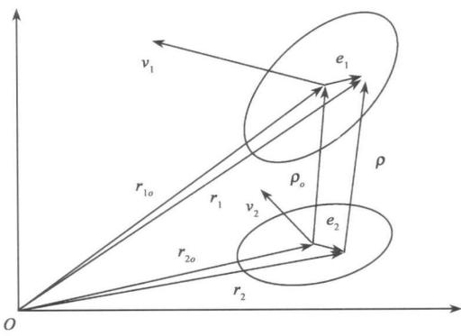
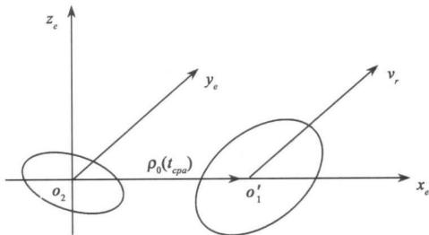
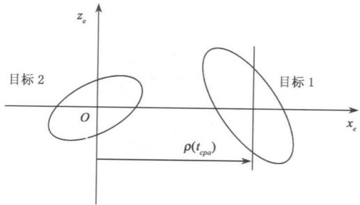
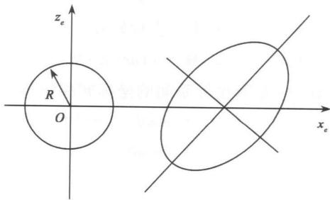
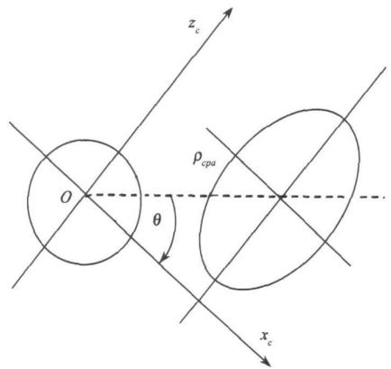
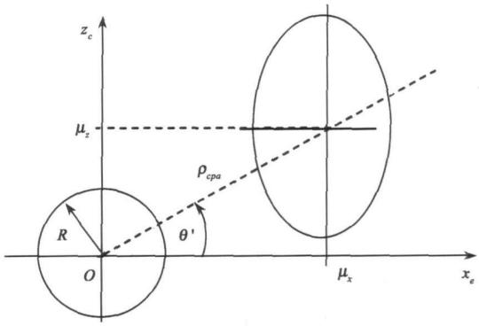
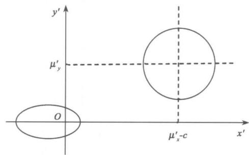
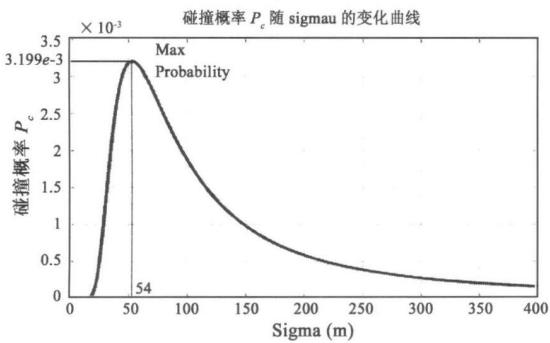
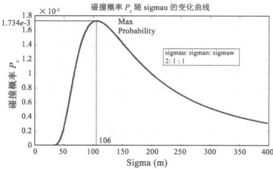
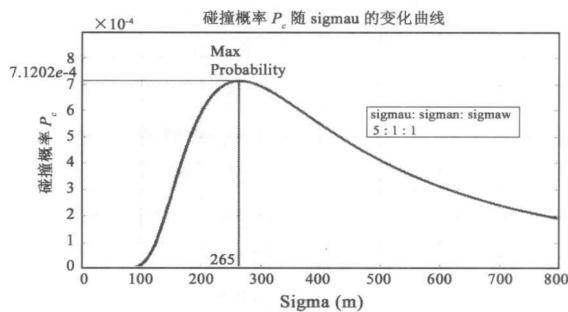

# 空间目标碰撞概率计算方法研究

白显宗 陈 磊国防科学技术大学航天与材料工程学院 长沙

摘 要 空间目标碰撞概率的计算是航天器进行空间碎片预警和规避机动的基础 提出了一种基于压缩空间和坐标旋转的碰撞概率计算方法，定义了相遇坐标系和积分计算坐标系，通过坐标转换关系将位置误差协方差投影到相遇坐标系中，旋转相遇坐标系后得到积分计算坐标系，将计算碰撞概率的问题转化为2维概率密度函数在圆域内的积分问题，通过压缩空间的方法，将不等方差概率密度函数在圆域内的积分化为等方差概率密度函数在椭圆域内的积分，然后通过极坐标变换将二重积分化为一重积分形式的概率表达式，对一次空间碎片碰撞的实例计算得到碰撞概率为 $1 0 ^ { - 3 }$ 量级 表明该方法是正确有效的

关键词 空间碎片 碰撞概率 空间压缩 概率密度函数

中图分类号：V528

文献标识码：A

文章编号：1000-1328（2008）04-1435-08

## 0 引言

目前直径超过 $1 0 \mathrm { { e m } }$ 的在轨空间物体总数已超过 个 而且其数目还在不断增加 同时还有数千万计的直径在 以下的微小碎片在空间存在，这些碎片主要分布在近地轨道随着空间碎片数目的增加 在轨航天器面临着越来越严重的威胁目前应用比较广泛的防护措施是屏蔽防护和规避机动 其中规避机动主要针对直径大于 $1 0 \mathrm { { e m } }$ 的可编目定轨的大空间碎片进行 空间目标碰撞概率的计算是进行航天器空间碎片预警和防撞规避机动的基础 我国对空间碎片预警和碰撞概率计算方法的研究才刚起步 国外一些机构和专家在这些方面进行了较深入的研究

空间目标碰撞概率的计算一般基于如下假设［1］ 已知两目标相遇期间某时刻在惯性坐标系中的位置速度矢量 两空间目标均等效为半径已知的球体 在相遇期间两目标的运动都是匀速直线运动并且没有速度不确定性 这样位置不确定椭球在相遇期间就保持不变 两目标的位置不确定性都服从3维正态分布，可以由分布中心和位置误差协方差矩阵描述 当两目标中心间的距离小于它们等效半径之和时发生碰撞 所以碰撞概率就是两目标间的最小距离小于等效半径之和的概率

文献 证明了距离最小时两目标的相对位置矢量与相对速度矢量相互垂直 并且定义了一种相遇坐标系 文献 在相遇坐标系中定义了联合位置误差椭球和联合半径球体 把求碰撞概率的问题转化为 维概率密度函数在圆域内的积分问题 然后经过两次近似 将积分运算化为代数表达式 得到碰撞概率近似值 本文将提出一种压缩空间和坐标旋转的积分计算方法 可以得到概率密度函数积分的一重积分解析表达式

## 1 问题的提出与基准坐标系定义

## 1．1 问题的描述

已知相遇期间的某时刻 在 地心惯性系 中 两空间目标分布中心位置矢量分别为r 和r 速度矢量分别为v 和v 两目标位置不确定性在星体 坐标系中描述 位置误差协方差阵为对角阵 三个方向的误差均方差分别为$\left( \begin{array} { c } { { \mathcal { O } _ { u } 1 , \sigma _ { n 1 } , \sigma _ { w 1 } } } \end{array} \right)$ 和 $\bar { \sigma } _ { u 2 } , \sigma _ { n 2 } , \sigma _ { w 2 } )$ 两目标等效半径分别为 $R 1$ 和 $R 2$ 需要求解这两个目标在相遇过程中发生碰撞的概率

## 1．2 星体 坐标系与 坐标系的关系

根据空间目标在 坐标系的位置速度矢量r$\begin{array} { r } { \mathbf { \Sigma } = [ \textbf { \textit { x } } \textbf { \textit { y } } \textbf { \textit { z } } ] ^ { \mathrm { ~ \tiny ~ { ~ T ~ } ~ } } \mathcal { \vec { H } } \mathbb { H } \boldsymbol { \nu } = [ \textbf { \textit { v } } \textbf { \textit { v } } \textbf { \textit { v } } _ { z } ] } \end{array}$ T 可以计算目标的 个吻切轨道根数 轨道倾角i 升交点赤经 Ω和纬度幅角u 由这三个根数可以得到从 坐标系到星体UNW 坐标系的转移矩阵 $M _ { U E }$ 为

$$
\boldsymbol {M} _ {U E} = \boldsymbol {M} [ 9 0 ^ {\circ} - u ] \boldsymbol {M} [ - 1 8 0 ^ {\circ} + i ] \boldsymbol {M} [ \Omega ]\tag{1}
$$

由两目标的位置速度矢量 $r _ { \mathrm { ~ l ~ o ~ } } J _ { \mathrm { ~ l ~ o ~ } }$ 和v $. . \nu 2$ 可以计算得到两目标的轨道根数 然后带入 式就得到坐标系到两目标星体 坐标系的转移矩阵$M _ { 1 E }$ 和 $M _ { 2 E }$

  
图 相遇时位置速度的几何关系  
Fig ．1 Geometry of the encounter

## 1．3 相遇坐标系的定义

碰撞概率定义为两目标质心的距离小于等效半径之和的概率 可以表示为 $P _ { c } = P ( \mathbf { \theta } ^ { \rho } \textless P )$ 两目标间的距离为 $\rho = \mid \mathbf { p } \mid = \mid _ { r _ { 1 } } - _ { r _ { 2 } } \mid , _ { r _ { 1 } }$ 和 $\mid r _ { \mathrm { ~ 2 ~ } }$ 分别为两目标的实际位置矢量 可以表示为两目标的分布中心矢量加上随机误差矢量 即 $_ { r \scriptscriptstyle 1 } = _ { r \scriptscriptstyle 1 _ { o } } + _ { e \scriptscriptstyle 1 } , { \scriptscriptstyle r \scriptscriptstyle 2 } =$ $r _ { \mathrm { ~ 2 ~ } } + e _ { \mathrm { ~ 2 ~ } }$ 如图 所示 令当前时刻为 $\mathbf { \Lambda } _ { t \mathrm { ~ 0 ~ } } = 0$ 那么在时刻t 两目标间的相对位置矢量为

$$
\begin{array}{r l} \mathbf {p} (t) & = \boldsymbol {r} _ {1} (t) - \boldsymbol {r} _ {2} (t) = \boldsymbol {r} _ {1} + \boldsymbol {v} _ {1 t} - \boldsymbol {r} _ {2} - \boldsymbol {v} _ {2 t} \\ & = \boldsymbol {r} _ {1 o} - \boldsymbol {r} _ {2 o} + \boldsymbol {e} _ {1} - \boldsymbol {e} _ {2} + (\boldsymbol {v} _ {1} - \boldsymbol {v} _ {2}) t \\ & = \boldsymbol {\rho} _ {o} + \boldsymbol {e} _ {1 2} + \boldsymbol {v} _ {t} = \boldsymbol {\rho} + \boldsymbol {v} _ {t} \end{array}\tag{2}
$$

两目标距离的平方为 $\boldsymbol { \rho } ^ { 2 } ( t ) = \boldsymbol { \rho } ( t ) \cdot \boldsymbol { \rho } ( t )$ ‚对时间求导 有

$$
\begin{array}{r l} \frac {\mathrm{d}}{\mathrm{d} t} [ \rho^ {2} (t) ] & = \frac {\mathrm{d}}{\mathrm{d} t} [ (\boldsymbol {\rho} + \boldsymbol {v} _ {, t}) \cdot (\boldsymbol {\rho} + \boldsymbol {v} _ {, t}) ] \\ & = 2 \boldsymbol {\rho} \cdot \boldsymbol {v} _ {r} + 2 \boldsymbol {v} _ {r} \cdot \boldsymbol {v} _ {, t} \end{array}\tag{3}
$$

令d［ $\rho ^ { 2 } ( t ) ] \mathrm { ~ } \forall t = 0$ ‚有

$$
\boldsymbol {\rho} \cdot \boldsymbol {v} _ {r} + \boldsymbol {v} _ {r} \cdot \boldsymbol {v} _ {t} = 0\tag{4}
$$

由式 可得两目标间的距离最小 即达到最接近点(Qosest Point of Approach ,CPA) 的时刻为

$$
t _ {c p a} = - \frac {\rho \cdot v _ {r}}{v _ {r} \cdot v}\tag{5}
$$

此时 两物体的相对位置矢量为

$$
\mathbf {p} \left(t _ {c p a}\right) = \mathbf {p} + v _ {r} t _ {c p a} = \mathbf {p} + \left(- \frac {\boldsymbol {\rho} \cdot v _ {r}}{v _ {r} \cdot v _ {r}}\right) v _ {r}\tag{6}
$$

上式两边点乘相对速度矢量 $\boldsymbol { \nu } _ { r }$ ‚得

$$
\boldsymbol {\rho} \left(t _ {c p a}\right) \cdot \boldsymbol {v} _ {r} = \boldsymbol {\rho} \cdot \boldsymbol {v} _ {r} - \boldsymbol {\rho} \cdot \boldsymbol {v} _ {r} = 0\tag{7}
$$

式 表明 两目标距离达到最小时 它们的相对位置矢量 $\textbf { \textsf { f } } _ { t _ { c p a } } )$ 和相对速度矢量 $\boldsymbol { \nu } _ { r }$ 互相垂直 也就是说 当两目标间的距离最近时 它们处在与相对速度矢量 $\boldsymbol { \nu } _ { r }$ 垂直的平面内 定义这个平面为相遇平面这样就可以把两物体的位置不确定性投影到相遇平面上 从而将 维问题化为维问题

定义相遇坐标系 $o \mathrm { ~ - ~ } x _ { e } y _ { e } z _ { e }$ 原点在目标 的分布中心 $o _ { \mathrm { ~ 2 ~ } } , y _ { \epsilon }$ 轴指向相对速度方向 $\nu _ { r } ~ , x _ { e }$ 轴和z 轴在相遇平面内 x 轴指向目标 的分布中心在相遇平面内的投影点 $z _ { e }$ 轴在相遇平面内与 $\mathrm { \Pi } _ { \mathrm { { \dot { { x } } } } _ { e } } ^ { }$ 轴垂直如图2所示。

  
图 相遇坐标系  
Fig ．2 Encounter coordinate

## 1．4 坐标系与相遇坐标系间的转换关系

两个目标的 坐标系分别为 $o  { 1 } ^ { - } u  { 1 } n  { 1 } w  { 1 }$ 和$o  { 2 } ^ { - } u  { 2 } n  { 2 } w  { 2 }$ EC坐标系与它们之间的坐标转移矩阵分别为 $M _ { 1 E }$ 和 $M _ { 2 E }$ 相遇坐标系 $o \mathrm { ~ - ~ } x _ { e } y _ { e } z$ 坐标轴单位矢量分别为

$$
\hat {\boldsymbol {i}} _ {e} = \frac {\boldsymbol {\rho} _ {o} (t _ {c p a})}{| \boldsymbol {\rho} _ {o} (t _ {c p a}) |}, \hat {\boldsymbol {j}} _ {e} = \frac {\boldsymbol {v} _ {r}}{| \boldsymbol {v} _ {r} |}, \hat {\boldsymbol {k}} _ {e} = \hat {\boldsymbol {i}} _ {e} \times \hat {\boldsymbol {j}} _ {e}\tag{8}
$$

其中 ${ \bf p } _ { o } ( t _ { c p a } )$ 是两物体分布中心最近时的相对位置矢量 $\mathbf p _ { o } ( t _ { c p a } ) = \mathbf p _ { o } + \left( - \frac { \mathbf p _ { o } \cdot \mathbf { \boldsymbol { v } } _ { r } } { \boldsymbol { v } _ { r } \cdot \boldsymbol { v } _ { r } } \right) \cdot \mathbf { \boldsymbol { v } } _ { r }$

坐标系坐标轴单位矢量分别为 $\hat { i } \hat { \textbf { \textit { j } } } \hat { \mathbf { k } }$ 令$E _ { e } \ = [ \hat { i _ { e } } \hat { j _ { e } } \hat { k _ { e } } ] ^ { \ T } , E \ = [ \hat { i } \hat { j } \hat { k } ] ^ { \ T }$ ‚由 $E _ { e } ~ = ~$ ME 则可得 坐标系到相遇坐标系 $o \mathcal { - } _ { \boldsymbol { x } _ { e } \boldsymbol { y } _ { e } } z$ e 的坐标转移矩阵 M 为

$$
\boldsymbol {M} _ {e} = \boldsymbol {E} _ {e} \boldsymbol {E} ^ {T} = \left[ \begin{array}{c c c c} \hat {\boldsymbol {i}} _ {e} & \cdot \hat {\boldsymbol {i}} & \hat {\boldsymbol {i}} _ {e} & \cdot \hat {\boldsymbol {j}} \\ \hat {\boldsymbol {j}} _ {e} & \cdot \hat {\boldsymbol {i}} & \hat {\boldsymbol {j}} _ {e} & \cdot \hat {\boldsymbol {j}} \\ \hat {\boldsymbol {k}} _ {e} & \cdot \hat {\boldsymbol {i}} & \hat {\boldsymbol {k}} _ {e} & \cdot \hat {\boldsymbol {j}} \end{array} \quad \begin{array}{c c c c} \hat {\boldsymbol {i}} _ {e} & \cdot \hat {\boldsymbol {k}} \\ \hat {\boldsymbol {j}} _ {e} & \cdot \hat {\boldsymbol {k}} \\ \hat {\boldsymbol {k}} _ {e} & \cdot \hat {\boldsymbol {k}} \end{array} \right]\tag{9}
$$

那么‚某一矢量在ECI 坐标系内表示为 $_ r$ ‚在相遇坐标系表示为 $r _ { e }$ 在 $\sigma _ { 1 } - u \ : _ { 1 } n \ : _ { 1 } w _ { 1 }$ 和 $\sigma _ { \mathrm { ~ 2 ~ } } - u \mathrm { ~ } _ { 2 } n \mathrm { ~ } _ { 2 } w \mathrm { ~ 2 ~ }$ 坐标系表示为 $r _ { \mathrm { ~ 1 ~ } }$ 和 $r _ { \mathrm { ~ 2 ~ } }$ 它们之间的关系为

$$
\begin{array}{l} \boldsymbol {r} _ {e} = \boldsymbol {M} _ {e} \boldsymbol {r} = \boldsymbol {M} _ {e} \boldsymbol {M} _ {1 E} ^ {T} \boldsymbol {r} _ {1} \\ \boldsymbol {r} _ {e} = \boldsymbol {M} _ {e} \boldsymbol {r} = \boldsymbol {M} _ {e} \boldsymbol {M} _ {2 E} ^ {T} \boldsymbol {r} _ {2} \end{array}\tag{10}
$$

显然 $o  { 1 } ^ { - } u  { 1 } n  { 1 } w  { 1 }$ 和 $_ { \textit { o } _ { 2 } } - { \boldsymbol { u } } _ { 2 } { n } _ { 2 } { w } _ { 2 }$ 与相遇坐标系之间的坐标转换矩阵为

$$
\begin{array}{c} \boldsymbol {M} _ {e 1} = \boldsymbol {M} _ {e} \boldsymbol {M} _ {1 E} ^ {T} \\ \boldsymbol {M} _ {e 2} = \boldsymbol {M} _ {e} \boldsymbol {M} _ {2 E} ^ {T} \end{array}\tag{11}
$$

## 2 位置误差的投影

## 2．1 协方差矩阵在坐标转换下的关系

随机列向量 X 的协方差阵 $V a r ( \pmb { X } )$ 定义为

$$
\operatorname{Var} (\boldsymbol {X}) = E \left[ \boldsymbol {X} - E (\boldsymbol {X}) \right] \left[ \boldsymbol {X} - E (\boldsymbol {X}) \right] ^ {T} \}\tag{12}
$$

随机列向量在 $\sigma _ { \textrm { 1 } } - u \ : _ { 1 } n \ : _ { 1 } w \ :$ 坐标系中表示为$X _ { 1 }$ 在相遇坐标系中表示为 $X _ { e 1 }$ 它们的关系为 $X _ { e 1 }$ $\mathbf { \Psi } = \pmb { M } _ { e 1 } \pmb { X } _ { 1 } \circ \pmb { X } _ { e 1 }$ 在相遇坐标系中表示的方差阵为

$$
\operatorname{Var} \left(\boldsymbol {X} _ {e 1}\right) = \boldsymbol {M} _ {e 1} \operatorname{Var} \left(\boldsymbol {X} _ {1}\right) \boldsymbol {M} _ {e 1} ^ {T}\tag{13}
$$

同样 Var X M Var X MT

这样就把星体 坐标系中表示的位置误差协方差阵变为在相遇坐标系中表示的位置误差协方差阵 然后将该协方差阵中与 $y _ { \epsilon }$ 有关的项去掉得到 阶矩阵 就把位置误差协方差投影到了相遇平面上 维问题化为 维问题

## 2．2 位置误差在坐标系中的投影

如图 所示 两个 维随机向量投影到了相遇平面上 两目标在相遇平面内的位置矢量 $X _ { 1 }$ 和 $X _ { 2 }$ 服从 维正态分布 分布中心分别为 和 $\boldsymbol { \mathrm { \Pi } } _ { c p a } ^ { 0 }$ 协方差矩阵分别为Var X 和Var X 由于两物体的位置随机矢量相互独立 故目标 对目标的相对位置矢量 $X = X _ { 1 } - X _ { 2 }$ 也是 维正态随机矢量 均值为

$$
E (\boldsymbol {X}) = E \left(\boldsymbol {X} _ {1} - \boldsymbol {X} _ {2}\right) = \left[ \begin{array}{l l} \rho_ {c p a} & 0 \end{array} \right] ^ {T}\tag{14}
$$

方差阵为

$$
\operatorname{Var} (\boldsymbol {X}) = \operatorname{Var} \left(\boldsymbol {X} _ {1} - \boldsymbol {X} _ {2}\right) = \operatorname{Var} \left(\boldsymbol {X} _ {1}\right) +\tag{15}
$$

由 $X _ { 1 }$ 和 $X _ { 2 }$ 相互独立得 $\quad G o v ( \pmb { X } _ { 1 } , \pmb { X } _ { 2 } ) = 0$ ‚那么

$$
\operatorname{Var} (\boldsymbol {X}) = \operatorname{Var} \left(\boldsymbol {X} _ {1}\right) + \operatorname{Var} \left(\boldsymbol {X} _ {2}\right)\tag{16}
$$

  
图 投影到相遇平面上  
Fiq . 3 Project position errors onto encounter plane

这样 就可以把相对位置矢量X 表示在相遇平面上

两目标发生碰撞的概率就是它们之间距离小于它们等效半径之和的概率 也即相对位置矢量的长度小于等效半径之和的概率 或者说是相对位置矢量落入以 $R = R _ { 1 } + R _ { 2 }$ 为半径的圆域的概率 这样 可以把两目标的大小联合到目标 上形成联合球体 把两目标的位置不确定椭圆联合到目标 上形成联合不确定椭圆 如图 所示

  
图 联合不确定椭圆和联合圆域  
Fiq·4 Combined error ellipsoid and combined circle

一般说来 X 的方差阵Var X 不是对角阵 即相遇坐标系的坐标轴与 X 的不确定椭球主轴方向并不一致 如图 所示 为了便于计算 需要将相遇坐标系 $\begin{array} { r l } { \sigma } & { { } - { x } _ { e } z . } \end{array}$ 转动一个角度 而且为了与后面的计算概率密度积分相协调 应该使转动后的 $x _ { c }$ 轴指向不确定椭球短半轴方向

定义计算坐标系 $\begin{array} { r l } { \mathbf { \nabla } _ { O } } & { { } - \mathbf { \nabla } _ { X } \mathcal { Z } _ { c } } \end{array}$ 原点与相遇坐标系的原点重合 $x _ { c }$ 轴指向投影在相遇平面内的联合不确定椭圆的短轴方向， $z _ { c }$ 轴指向长轴方向，在计算坐标系中 位置误差联合协方差阵是对角阵 如图 所示

设需要转动的角度为 $\theta _ { \mathrm { ~ o ~ } _ { 1 } }$ 在原相遇坐标系中

  
图 旋转相遇坐标系到计算坐标系  
Fig ．5 Rotate encounter coordinate to integral-calculatio nal coordinate

设 X 的方差阵是

$$
\operatorname{Var} (\boldsymbol {X}) = \left[ \begin{array}{c c} \sigma_ {x} ^ {2} & \rho \sigma_ {x} \sigma_ {z} \\ \rho \sigma_ {x} \sigma_ {z} & \sigma_ {z} ^ {2} \end{array} \right]\tag{17}
$$

在计算坐标系 $\begin{array} { r l } { \mathbf { \Phi } _ { O } } & { { } - \mathbf { \Phi } _ { X , Z _ { c } } } \end{array}$ 中 随机矢量 X 的方差矩阵 $V a r ( X )$ 是对角阵

$$
\operatorname{Var} (\boldsymbol {X}) _ {c} = \left[ \begin{array}{c c} \sigma_ {x} ^ {\prime 2} & 0 \\ 0 & \sigma_ {z} ^ {\prime 2} \end{array} \right]\tag{18}
$$

由位置误差方差阵在坐标转换下的关系 可得

$$
\operatorname{Var} (\boldsymbol {X}) _ {c} = \boldsymbol {M} (\theta) \operatorname{Var} (\boldsymbol {X}) \boldsymbol {M} ^ {T} (\theta)\tag{19}
$$

其中 $M ^ { \mathrm { ~  ~ } }$ 是两坐标系间的坐标转移矩阵

$$
\boldsymbol {M} (\theta) = \left[ \begin{array}{c c} \cos \theta & \sin \theta \\ - \sin \theta & \cos \theta \end{array} \right]\tag{20}
$$

所以有

$$
\begin{array}{l} \operatorname{Var} (\boldsymbol {X}) _ {c} = M (\theta) \operatorname{Var} (\boldsymbol {X}) M ^ {T} (\theta) \\ \left[ \begin{array}{l} \sigma_ {x} ^ {2} \cos^ {2} \theta + \rho \sigma_ {x} \sigma_ {z} \sin 2 \theta + \sigma_ {z} ^ {2} \sin^ {2} \theta \\ \frac {\sigma_ {z} ^ {2} - \sigma_ {x} ^ {2}}{2} \sin 2 \theta + \rho \sigma_ {x} \sigma_ {z} \cos 2 \theta \\ \frac {\sigma_ {z} ^ {2} - \sigma_ {x} ^ {2}}{2} \sin 2 \theta + \rho \sigma_ {x} \sigma_ {z} \cos 2 \theta \\ \sigma_ {x} ^ {2} \sin^ {2} \theta - \rho \sigma_ {x} \sigma_ {z} \sin 2 \theta + \sigma_ {z} ^ {2} \cos^ {2} \theta \end{array} \right] \\ = \left[ \begin{array}{c c} \sigma_ {x} ^ {\prime 2} & 0 \\ 0 & \sigma_ {z} ^ {\prime 2} \end{array} \right] \end{array}\tag{21}
$$

由Var X 是对角阵 得

$$
\frac {\sigma_ {z} ^ {2} - \sigma_ {x} ^ {2}}{2} \sin 2 \theta + \rho \sigma_ {x} \sigma_ {z} \cos 2 \theta = 0\tag{22}
$$

为使转动后的 $x _ { c }$ 轴指向不确定椭球短半轴方向‚应有 $\sigma _ { \mathrm { ~ x ~ } } ^ { \prime 2 } < { \sigma _ { \mathrm { ~ z ~ } } ^ { \prime 2 } }$ 也就是

$$
\begin{array}{r l} & {\sigma_ {x} ^ {2} \cos^ {2} \theta + \rho \sigma_ {x} \sigma_ {z} \sin 2 \theta + \sigma_ {z} ^ {2} \sin^ {2} \theta} \\ & {<   \sigma_ {x} ^ {2} \sin^ {2} \theta - \rho \sigma_ {x} \sin 2 \theta + \sigma_ {z} ^ {2} \cos^ {2} \theta} \\ & {\text {即} \frac {\sigma_ {z} ^ {2} - \sigma_ {x} ^ {2}}{2} \cos 2 \theta - \rho \sigma_ {x} \sigma_ {z} \sin 2 \theta > 0} \end{array}\tag{23}
$$

由式 和式 可得转动角度θ为

$$
\tan 2 \theta = \frac {- 2 \rho_ {x} \sigma_ {z}}{\sigma_ {z} ^ {2} - \sigma_ {x} ^ {2}}, \tan 2 \theta <   \frac {\sigma_ {z} ^ {2} - \sigma_ {x} ^ {2}}{2 \rho_ {x} \sigma_ {z}}\tag{24}
$$

相遇坐标系转动角度为θ 则分布中心在计算坐标系中的幅角为 $\theta ^ { \prime } = - \theta$ 如图 所示 则有

$$
\begin{array}{l} \mu_ {x} = \rho_ {c p a} \cos \theta^ {\prime} \\ \mu_ {z} = \rho_ {c p a} \sin \theta^ {\prime} \\ \sigma_ {x} ^ {\prime 2} = \sigma_ {x} ^ {2} \cos^ {2} \theta + \rho \sigma_ {x} \sigma_ {z} \sin 2 \theta + \sigma_ {z} ^ {2} \sin^ {2} \theta \\ \sigma_ {z} ^ {\prime 2} = \sigma_ {x} ^ {2} \sin^ {2} \theta - \rho \sigma_ {x} \sigma_ {z} \sin 2 \theta + \sigma_ {z} ^ {2} \cos^ {2} \theta \end{array}\tag{25}
$$

  
图 积分计算坐标系  
Fig ．6 Integral-calculational coordinate

维正态分布概率密度函数Function ,pdf）为

$$
\begin{array}{l} f (x, z) = \frac {1}{2 \pi \sigma_ {x} ^ {\prime} \sigma_ {z} ^ {\prime}} \cdot \\ \exp \left[ - \frac {1}{2} \left(\frac {(x - \mu_ {x}) ^ {2}}{\sigma_ {x} ^ {\prime 2}} + \frac {(z - \mu_ {z}) ^ {2}}{\sigma_ {z} ^ {\prime 2}}\right) \right] \end{array}\tag{26}
$$

碰撞概率可表示为 在圆域内的积分

$$
P _ {c} = \iint_ {x ^ {2} + z ^ {2} \leqslant R ^ {2}} f (x, z) \mathrm{d} x \mathrm{d} z\tag{27}
$$

这样 就把计算概率的问题化为求概率密度函数在圆域内积分的问题

## 3 积分计算方法

## 3．1 压缩空间将不等方差积分化为等方差积分

由积分变量记号无关性，为方便叙述，下面将变量z 换为变量y 不等方差概率密度函数为

$$
\begin{array}{r l} f (x, y) & = \frac {1}{2 \pi \sigma_ {x} \sigma_ {y}} \cdot \\ & \exp \left[ - \frac {1}{2} \left(\frac {(x - \mu_ {x}) ^ {2}}{\sigma_ {x} ^ {2}} + \frac {(y - \mu_ {y}) ^ {2}}{\sigma_ {y} ^ {2}}\right) \right] \end{array}\tag{28}
$$

其中 $\sigma _ { x } \neq \sigma _ { y }$ 定义压缩系数 $k \ : = \ : \sigma _ { x } / \sigma _ { y }$ 不失一般性‚有 $0 < k < 1 ($ 总可以旋转坐标系使得x 轴指向误差椭圆短轴方向 求该 $\mathrm { p d f }$ 在半径为 R 的圆域$D : x ^ { 2 } + y ^ { 2 } \leqslant R ^ { 2 }$ 内的积分

采用空间压缩的方法 令

$$
\begin{array}{l} x ^ {\prime} = x, y ^ {\prime} = k y \\ \mu_ {x} ^ {\prime} = \mu_ {x}, \mu_ {y} ^ {\prime} = k \mu_ {y} \end{array}\tag{29}
$$

将 式代入 式 经过整理 可以得到

$$
\begin{array}{r l} f (x, y) & = k \frac {1}{2 \pi \sigma_ {x} ^ {2}} \cdot \\ & \exp \left[ - \frac {\left(x ^ {\prime} - \mu_ {x} ^ {\prime}\right) ^ {2} + \left(y ^ {\prime} - \mu_ {y} ^ {\prime}\right) ^ {2}}{2 \sigma_ {x} ^ {2}} \right] \\ & = f ^ {*} \left(x ^ {\prime}, y ^ {\prime}\right) \end{array} \tag {1}\tag{30}
$$

将 式代入圆域 D 得到空间压缩后椭圆积分区域 椭圆方程的标准形式为

$$
D ^ {\prime}: \frac {x ^ {\prime 2}}{R ^ {2}} + \frac {y ^ {\prime 2}}{(k R) ^ {2}} \leqslant 1\tag{31}
$$

通过上面变换 可以将积分式 化为

$$
\begin{array}{l} P _ {c} = \iint_ {E} \frac {1}{2 \pi \sigma_ {x} ^ {2}} \cdot \\ \exp \left[ - \frac {\left(x ^ {\prime} - \mu_ {x} ^ {\prime}\right) ^ {2} + \left(y ^ {\prime} - \mu_ {y} ^ {\prime}\right) ^ {2}}{2 \sigma_ {x} ^ {2}} \right] d x ^ {\prime} d y ^ {\prime} \\ = \iint_ {E} f ^ {* *} \left(x ^ {\prime}, y ^ {\prime}\right) d x ^ {\prime} d y ^ {\prime} \end{array} \tag {3}\tag{32}
$$

这样就通过压缩空间的方法将不等方差 $\mathrm { p d f }$ 式在圆域内的积分 化为等方差 $\boldsymbol { f } ^ { \mathrm { ~ \scriptsize ~ * ~ * ~ } } ( \boldsymbol { x } ^ { \mathrm { ~ \scriptsize ~ \prime ~ } }$ $y ^ { \prime } )$ 在椭圆域 E 内的积分 令式 中椭圆长半轴$R = a$ 短半轴 $k R = b$ 就得到压缩空间后的被积函数和积分区域

$$
\left\{ \begin{array}{l} f _ {s c} \left(x ^ {\prime}, y ^ {\prime}\right) = \frac {1}{2 \pi \sigma_ {x} ^ {2}} \cdot \\ \exp \left[ - \frac {\left(x ^ {\prime} - \mu_ {x} ^ {\prime}\right) ^ {2} + \left(y ^ {\prime} - \mu_ {y} ^ {\prime}\right) ^ {2}}{2 \sigma_ {x} ^ {2}} \right] \\ D ^ {\prime}: \frac {x ^ {\prime 2}}{a ^ {2}} + \frac {y ^ {\prime 2}}{b ^ {2}} \leqslant 1 \end{array} \right.\tag{33}
$$

由椭圆几何关系可得椭圆的半通径为 $P =$ $\boldsymbol { b } ^ { 2 } / \boldsymbol { a } = \boldsymbol { k } ^ { 2 } \boldsymbol { R }$ 偏心率为 $e ~ = ~ \sqrt { 1 - { k } ^ { 2 } }$ 椭圆中心至焦点的距离即焦距为 $\varepsilon _ { \mathrm { A c a } } R _ { \mathrm { e n } } \sqrt { \cdot 1 _ { \mathrm { c } } \mathrm { { \overline { { { \mathrm { J } } } } } } _ { \mathrm { { o } } } \mathrm { { \overline { { { k } } } } } _ { \mathrm { { i r } } } ^ { 2 } }$

把坐标原点移至椭圆靠近分布中心的一个焦点上‚如图7所示 $\mathbf { \nabla } \cdot \mathbf { p d f }$ 和积分区间分别为

$$
\left\{ \begin{array}{l} f ^ {*} \left(x ^ {\prime}, y ^ {\prime}\right) = \frac {1}{2 \pi \sigma_ {x} ^ {2}} \cdot \\ \exp \left[ - \frac {\left(x ^ {\prime} - \left(\mu_ {x} ^ {\prime} - c\right)\right) ^ {2} + \left(y ^ {\prime} - \mu_ {y} ^ {\prime}\right) ^ {2}}{2 \sigma_ {x} ^ {2}} \right] \\ D ^ {\prime}: 0 \leqslant r \leqslant \frac {P}{1 + e \cos \theta}, 0 \leqslant \theta \leqslant 2 \pi \end{array} \right.\tag{34}
$$

这样‚碰撞概率可以表示为：

$$
P _ {c} = \iint_ {D} f (x, y) \mathrm{d} x \mathrm{d} y = \iint_ {D} f ^ {*} (x ^ {\prime}, y ^ {\prime}) \mathrm{d} x ^ {\prime} \mathrm{d} y ^ {\prime}\tag{35}
$$

  
图7 压缩空间  
Fig ．7 After space compression

3．2 等方差概率密度函数在椭圆域内的积分如图 所示 对等方差

$$
f (x, y) = \frac {1}{2 \pi \sigma} \exp \left[ - \frac {\left(x - \mu_ {x}\right) ^ {2} + \left(y - \mu_ {y}\right) ^ {2}}{2 \sigma^ {2}} \right]\tag{36}
$$

作极坐标变换 $\left\{ { \begin{array} { l } { x { \mathrm { ~ } } = { r { \mathrm { { c o s ~ } } } \theta } } \\ { y { \mathrm { ~ } } = { r { \mathrm { { s i n ~ } } } \theta } } \end{array} } \right.$ 椭圆域用极坐标表示为 $D ^ { ^ { \prime } } \colon 0 \leqslant r \leqslant \frac { P } { 1 + _ { e \cos \ } \theta } , \ 0 \leqslant \theta \leqslant 2 \pi$ 。

概率密度函数式 在椭圆域内的积分为

$$
\begin{array}{r l} P & = \iint_ {D} f (x, y) \mathrm{d} x \mathrm{d} y \\ & = \frac {1}{2 \pi \sigma^ {2}} \int_ {0} ^ {2 \pi} \int_ {0} ^ {\frac {P}{1 + e \cos \theta}} \cdot \\ & \exp \left[ - \frac {r ^ {2} + \mu_ {r} ^ {2} - 2 \mu_ {r} r \cos (\theta - \mu_ {\theta})}{2 \sigma^ {2}} \right] r \mathrm{d} r \mathrm{d} \theta \\ \text {令} I ^ {*} (\theta) & = \int_ {0} ^ {\frac {P}{1 + e \cos \theta}} \cdot \\ & \exp \left[ - \frac {r ^ {2} + \mu_ {r} ^ {2} - 2 \mu_ {r} r \cos (\theta - \mu_ {\theta})}{2 \sigma^ {2}} \right] r \mathrm{d} r \\ \text {则} P & = \frac {1}{2 \pi \sigma^ {2}} \int_ {0} ^ {2 \pi} I ^ {*} (\theta) \mathrm{d} \theta 。 \end{array}\tag{37}
$$

$$
\begin{array} { r l }I ^ { * } ( \theta )&{ } = \int _ { 0 } ^ { \frac { P } { H _ { e c o s } \theta } } \exp \left[ \frac { \left[ r - \mu _ { r } \cos ( \theta - \mu _ { \theta } ) \right] ^ { 2 } + \mu _ { r } ^ { 2 } \sin ^ { 2 } ( \theta - \mu _ { \theta } ) } { 2 \sigma ^ { 2 } } \right] r d r\\&{ } = \exp \left[ - \frac { \mu _ { r } ^ { 2 } \sin ^ { 2 } ( \theta - \mu _ { \theta } ) } { 2 \sigma ^ { 2 } } \right] \cdot \int _ { 0 } ^ { \frac { P } { H _ { e c o s } \theta } } \exp \left[ \frac { \left[ r - \mu _ { r } \cos ( \theta - \mu _ { \theta } ) \right] ^ { 2 } } { 2 \sigma ^ { 2 } } \right] .\\&{ } ( r - \mu _ { r } \cos ( \theta - \mu _ { \theta } ) + \mu _ { r } \cos ( \theta - \mu _ { \theta } ) ) d r\\&{ } = \exp \left[ - \frac { \mu _ { r } ^ { 2 } \sin ^ { 2 } ( \theta - \mu _ { \theta } ) } { 2 \sigma ^ { 2 } } \right] \cdot \left\{ \int _ { 0 } ^ { \frac { P } { H _ { e c o s } \theta } } \exp \left[ - \frac { \left[ r - \mu _ { r } \cos ( \theta - \mu _ { \theta } ) \right] ^ { 2 } } { 2 \sigma ^ { 2 } } \right] . \right.\\&{ } [ r - \mu _ { r } \cos ( \theta - \mu _ { \theta } ) ] d r + \mu _ { r } \cos ( \theta - \mu _ { \theta } ) \int _ { 0 } ^ { \frac { P } { H _ { e c o s } \theta } } \exp \left[ - \frac { [ r - \mu _ { r } \cos ( \theta - \mu _ { \theta } ) ] ^ { 2 } } { 2 \sigma ^ { 2 } } \right] d r\\&{ } = \exp \left[ - \frac { \mu _ { r } ^ { 2 } \sin ^ { 2 } ( \theta - \mu _ { \theta } ) } { 2 \sigma ^ { 2 } } \right] \cdot \left\{ \right. \sigma ^ { 2 } \left[ \right. \exp \left( - \frac { \mu _ { r } ^ { 2 } \cos ^ { 2 } ( \theta - \mu _ { \theta } ) } { 2 \sigma ^ { 2 } } \right) - \exp \left( \right. - \frac { [ r - \mu _ { r } \cos ( (\theta - \mu _ { \theta }) ] ^ { 2 } ] ^ { 2 }} { 2 \sigma ^ { 2 } } - [ r - p ] ^ { 2 } | z | ^ {\prime} | z | ^ {\prime} | z | ^ {\prime} | z | ^ {\prime} | z | ^ {\prime} | z | ^ {\prime} | z | ^ {\prime} | z | ^ {\prime} | z | ^ {\prime} | z | ^ {\prime} | z | ^ {\prime} | z | ^ {\prime} | z | ^ {\prime} | z | ^ {\prime} | z | ^ {\prime} | x , y , z , w , t , u , v , w , x , y , z , w , x , y , z , w , w , x , y , z , w , w , x , y , z , w , w , x , y , z , w , w , x , y , w , x , y , w , x , y , w , x , y , w , x , y , w , x , y , w , x , y , w , x , y , w , x , y , w , x , y , w , x , y , w , x , y , w , x , y , w , x , y , w , x , y , w , x , y , w , x , y , w , w , x , y , w , x , y , w , x , y , w , x , y , w , x , y , w , x , y , w , x , y , w , x , y , w , x , y , w , x , y , w , x , y , w , x , y , w , x , y , w , x , y , w , x , y , w , x , y , x , w , x , y , w , x , y , w , x , y , w , x , y , w , x , y , w , x , y , w   .\\&{ } = [ p ( p ( p ( p ( p ( p ( p ( p ( p ( p ( p ( p ( p ( p ( p ( p ( p ( p ( p ( p ( p ( p ( p ( p ( p ( p ( p ( p ( p ( p ( p ( p ( p ( p ( p ( p ( p ( p ( p ( p ( p ( p ( p ( p ( p ( p ( p ( p ( p ( p ( p (\ p ( p ( p ( p ( p ( p ( p ( p ( p ( p ( p ( p ( p ( p ( p ( p ( p ( p ( p ( p ( p ( p ( p ( p ( p ( p ( p ( p ( p ( p ( p ( p ( p ( p ( p ( p ( p ( p ( p ( p ( p ( p ( p ( p ( p ( p ( p ( p ( p ( p   [ e q : i n   k   o   s   [ e q : i n   k   o   s   [ e q : i n   k   o   s   [ e q : i n   k   o   s   [ e q : i n   k   o   s   [ e q : i n   k   o   s   [ e q : i n   k   o   s   [ e q : i n   k   o   s   [ e q : i n   m a t ] / e q : i n   m a t ] / e q : i n   m a t ] / e q : i n   m a t ] / e q : i n   m a t ] / e q : i n   m a t ] / e q : i n   m a t ] / e q : i n   m a t ] / e q : i n   m a t ] / e q : i n   m a t ] /e q : i n   m a t ] /e q : i n   m a t ] /e q : i n   m a t ] /e q : i n   m a t ] /e q : i n   m a t ] /e q : i n   m a t ] /e q : i n   m a t ] /e q : i n   m a t ] /e q : i n   m a t ] /eq : i n   m a t ] /eq : i n   m a t ] /eq : i n   m a t ] /eq : i n   m a t ] /eq : i n   m a t ] /eq : i n   m a t ] /eq : i n   m a t ] /eq : i n   m a t ] /eq : i n   m a t ] /eq: i n   m a t ] /eq : i n   m a t ] /eq : i n   m a t ] /eq : i n   m a t ] /eq :i n   m a t ] /eq :i n   m a t ] /eq :i n   m a t ] /eq :i n   m a t ] /eq :i n   m a t ] /eq :i n   m a t ] /eq :i n   m a t ] /eq :i n   m a t ] /eq :i n   m a t ] /eq :i in the case that the case is not satisfied, so we have been satisfied with the case is satisfied with the case is satisfied with the case is satisfied with the case is satisfied with the case is satisfied with the case is satisfied with the case is satisfied with the case is satisfied with the case is satisfied with the case is satisfied with the case is satisfied with the case is satisfied with the case is satisfied with the case is satisfied with the case is satisfied with the case is satisfied with the case is satisfied with the case is satisfied with the case is satisfied with the case is satisfied with the case of satisfaction, and it also satisfied with the case is satisfied with the case is satisfied with the case is satisfied with the case is satisfied with the case is satisfied with the case is satisfied with the case is satisfied with the case is satisfied with the case is satisfied with the case is satisfied with the case is satisfied with the case is satisfied with the case is satisfied with the case is satisfied with the case is satisfied with the case is satisfied with the case is satisfied with the case is satisfied with the case is satisfied with the case in satisfaction, and it also satisfied with the case is satisfied with the case is satisfied with the case is satisfied with the case is satisfied with the case is satisfied with the case is satisfied with the case is satisfied with the case is satisfied with the case is satisfied with the case is satisfied with the case is satisfied with the case is satisfied with the case is satisfied with the case is satisfied with the case is satisfied with the case is satisfied with the case is satisfied with the case is satisfied with the case in satisfaction, and it usually satisfied with the case is satisfied with the case is satisfied with the case is satisfied with the case is satisfied with the case is satisfied with the case is satisfied with the case is satisfied with the case is satisfied with the case is satisfied with the case is satisfied with the case is satisfied with the case is satisfied with the case is satisfied with the case is satisfied with the case is satisfied with the case is satisfied with the case is satisfied with the case is satisfied with the case is satisfied with the caseis satisfied with the caseis satisfied with the caseis satisfied with the caseis satisfied with the caseis satisfied with the caseis satisfied with the caseis satisfied with the caseis satisfied with the caseis satisfied with the caseis satisfied with the caseis satisfied with the caseis satisfied with the caseis satisfied with the caseis satisfied with the caseis satisfied with the caseis satisfied with the caseis satisfied with the caseis satisfied with the caseis satisfied with the caseis satisfied with the casei,satisfiedwiththecaseis,satisfiedwiththecaseis,satisfiedwiththecaseis,satisfiedwiththecaseis,satisfiedwiththecaseis,satisfiedwiththecaseis,satisfiedwiththecaseis,satisfiedwiththecaseis,satisfiedwiththecaseis,satisfiedwiththecaseis,satisfiedwiththecaseis,satisfiedwiththecaseis,satisfiedwiththecaseis,satisfiedwiththecaseis,satisfiedwiththecaseis,satisfiedwiththecaseis,satisfiedwiththecaseis,satisfiedwiththecases,satisfiedwiththecases,satisfiedwiththecases,satisfiedwiththecases,satisfiedwiththecases,satisfiedwiththecases,satisfiedwiththecases,satisfiedwiththecases,satisfiedwiththecases,satisfiedwiththecases,satisfiedwiththecases,satisfiedwiththecases,satisfiedwiththecases,satisfiedwiththecases,satisfiedwiththecases,satisfiedwiththecases,satisfiedwiththecases,satisfiedwiththsecases,satisfiedwiththsecases,satisfiedwiththsecases,satisfiedwiththsecases,satisfiedwiththsecases,satisfiedwiththsecases,satisfiedwiththsecases,satisfiedwiththsecases,satisfiedwiththsecases,satisfiedwiththsecases,satisfiedwiththsecases,satisfiedwiththsecases,satisfiedwiththsecases,satisfiedwiththsecases,satisfiedwiththsecases,satisfiedwiththsecases,satisfiedwiththsecases,sfailedwiththecases,sfailedwiththecases,sfailedwiththecases,sfailedwiththecases,sfailedwiththecases,sfailedwiththecases,sfailedwiththecases,sfailedwiththecases,sfailedwiththecases,sfailedwiththecases,sfailedwiththecases,sfailedwiththecases,sfailedwiththecases,sfailedwiththsecases,sfailedwiththsecases,sfailedwiththsecases,sfailedwiththsecases,sfailedwiththsecases,sfailedwiththsecases,sfailedwiththsecases,sfailedwiththsecases,sfailedwiththsecases,norssimultated by an approximate sum of all possible sums of all possible sums of all possible sums of all possible sums of all possible sums of all possible sums of all possible sums of all possible sums of all possible sums of all possible sums of all possible sums of all possible sums of all possible sums of all possible sums of all possible sums of all possible sums of all possible sums of all possible sums of all possible sums of all possible sums of all possible sums of all possible sums of all possible sums of all possible sums of all possible sums of all possible values for each outcome.\\&{ }\end{array}
$$

化简上式可以得到 $\boldsymbol { I } ^ { \mathrm { ~ \scriptsize ~ { ~  ~ } ~ } } ( \mathrm { ~ \scriptsize ~ { ~  ~ } ~ }$ 的表达式：

$$
\begin{array}{r l} I ^ {*} (\theta) & = \sigma^ {2} \exp \left(- \frac {\mu_ {r} ^ {2}}{2 \sigma^ {2}}\right) \Bigg \{1 - \exp \Big [ - \frac {P ^ {2} - 2 P \mu_ {r} \cos (\theta - \mu_ {\theta}) (1 + e \cos \theta)}{2 \sigma^ {2} (1 + e \cos \theta) ^ {2}} \Big ] \Bigg \} + \sqrt {2 \pi} \sigma \mu_ {r} \cos (\theta - \mu_ {\theta}) \\ & \quad \exp \Big [ - \frac {\mu_ {r} ^ {2} \sin^ {2} (\theta - \mu_ {\theta})}{2 \sigma^ {2}} \Big ] \Bigg [ \Phi \Bigg (\frac {P}{1 + e \cos \theta} - \frac {\mu_ {r} \cos (\theta - \mu_ {\theta})}{\sigma} \Bigg) - \Phi \Bigg (- \frac {\mu_ {r} \cos (\theta - \mu_ {\theta})}{\sigma} \Bigg) \Bigg ] \end{array}
$$

令 $I ( \theta ) = \frac { 1 } { 2 \pi \sigma ^ { 2 } } I ^ { \mathrm { ~ * ~ } } ( \theta )$ ‚则 $P _ { c } = \int _ { 0 } ^ { 2 \pi } I ( \mathrm {  ~ \theta ~ } \mathrm {  ~ \theta ~ } \mathrm {  ~ \theta ~ } , I ( \mathrm {  ~ \theta ~ } )$ 为下式：

$$
\begin{array}{r l} I (\theta) & = \frac {1}{2 \pi} \exp \left(- \frac {\mu_ {r} ^ {2}}{2 \sigma^ {2}}\right) \Bigg \{1 - \exp \left[ - \frac {P ^ {2} - 2 P \mu_ {r} \cos (\theta - \mu_ {\theta}) (1 + e \cos \theta)}{2 \sigma^ {2} (1 + e \cos \theta) ^ {2}} \right] \Bigg \} + \frac {1}{\sqrt {2 \pi} \sigma} \mu_ {r} \cos (\theta - \mu_ {\theta}) \\ & \quad \exp \left[ - \frac {\mu_ {r} ^ {2} \sin^ {2} (\theta - \mu_ {\theta})}{2 \sigma^ {2}} \right] \left[ \Phi \left(\frac {P}{1 + e \cos \theta} - \mu_ {r} \cos (\theta - \mu_ {\theta}){\sigma}\right) - \Phi \left(- \frac {\mu_ {r} \cos (\theta - \mu_ {\theta})}{\sigma}\right) \right] \end{array}
$$

其中 $\Phi _ { \textrm {  { x } } } ) = \int _ { - \infty } ^ { x } \frac { 1 } { \sqrt { \textrm { 2 } \pi } } e ^ { - \frac { u ^ { 2 } } { 2 } } \mathrm { d } u$ 为标准正态分布的分布函数 这样 就把二重积分化为一重积分表达式便于计算。

## 4 算例分析

由第 节的讨论结果 根据两空间目标相遇期间某时刻 坐标系内位置速度矢量坐标 两目标星体 坐标系三个方向的位置误差均方差和两目标的等效半径 可以将碰撞概率转化为一重积分‚这个过程在计算机上容易实现。本文基于 $\mathbb { M A T }$ -编写了碰撞概率计算软件 并以发生于 年月 日的空间碎片碰撞事件为例 验证以上方法的正确性 两空间碎片分别为 美国 $\mathrm { ~ F ~ } 5 \mathrm { R } /$ B（Thor Burner2A 末级),NORAD 编目号为07219，国际编号 近地点高度 $7 7 5 \mathrm { m }$ 远地点高度$8 8 \bar { 4 } \mathrm { { k m } }$ 轨道倾角 度 中国 $\mathrm { C Z ^ { - 4 } }$ 火箭第三级碎片 编目号为 国际编号 $1 9 9 9 - 0 5 7 \mathrm { C V }$ 近地点高度 $7 0 \mathrm { { q } _ { k m } }$ 远地点高度 $8 9 5 \mathrm { { k m } }$ 轨道倾角98.2度。

两目标碰撞前的两行轨道根数 已知 在STK 软件中载入 $\mathrm { { \mathrm { { I f g } } } } _ { \mathrm { { i j } } } { \mathrm { { s } } } _ { \mathrm { { i } } \mathrm { { s } } }$ ‚可以得到两碎片在J2000．0ECI坐标系中的位置速度矢量 $1 7 \mathrm { { J a n } \ 2 0 0 5 \ 0 2 _ { : } 1 4 _ { : } 3 7 . 0 0 }$ 时刻两目标的位置和速度坐标如表 所示 假设两碎片的等效半径均为 $5 _ { \mathrm { m } }$ 联合半径为 $R = 1 0 _ { m }$ 假设两碎片的位置误差椭球形状大小都相同 即位置误差方差阵相等

表 参考时刻两碎片的位置速度坐标  
Table 1 Position and velocity coordinate of t wo debris（in km、km/s）

<table><tr><td>编号</td><td>X</td><td>Y</td><td>Z</td></tr><tr><td>07219</td><td>-150.798437</td><td>1182.676987</td><td>-7143.77556</td></tr><tr><td>26207</td><td>-150.619960</td><td>1182.018386</td><td>-7143.78799</td></tr><tr><td>编号</td><td> $V_x$ </td><td> $V_y$ </td><td> $V_z$ </td></tr><tr><td>07219</td><td>7.290071</td><td>-1.126282</td><td>-0.354014</td></tr><tr><td>26207</td><td>5.915107</td><td>4.347936</td><td>0.643388</td></tr></table>

## 4．1 位置误差为球形分布

首先假设两目标位置误差为球分布 即 $\textstyle { \mathfrak { O } } _ { u } : { \mathfrak { O } } _ { n }$ $\sigma _ { w } = 1 ; 1 ; 1$ 经过计算得到如下结果

距离最小时间 $t _ { c p a } = 0 . 1 1 7 5 8$

$$
\begin{array}{r l} T _ {C P A} & = 1 7 \mathrm{Jan} 2 0 0 5 0 2: 1 4: 3 7. 0 0 + 0. 1 1 7 5 9 \\ & = 1 7 \mathrm{Jan} 2 0 0 5 0 2: 1 4: 3 7. 1 1 7 5 9 \\ \text {最近距离} \rho_ {0 c p a} & = 1 0 7. 2 2 8 6 \mathrm{m} = 0. 1 0 7 2 2 8 \mathrm{km}. \end{array}
$$

图 是碰撞概率 $P _ { c }$ 随 $\sigma _ { u }$ 的变化曲线 由曲线可以看出 两碎片发生碰撞的最大概率为 $P _ { c \mathrm { m a x } }$ 二$3 . 1 9 9 \times 1 0 ^ { - 3 }$ 使碰撞概率 $P _ { c }$ 取最大值的位置不确定均方差为 $\sigma _ { D } = 5 4 \mathrm { { m } = 0 . 0 5 4 \mathrm { { k m } } }$ 。

  
图 位置误差球分布时碰撞概率 $P _ { c }$ 随 $\sigma _ { u }$ 的变化曲线  
Fiq .8 Probability of collision vs uncertainty while iso tropic position error distribution

## 4．2 位置误差为椭球形分布

假设两目标位置误差均为椭球分布 即 $\textstyle { \mathfrak { O } } _ { u } : { \mathfrak { O } } _ { n }$ ${ \sigma _ { w } } \neq 1 . 1 . 1$

首先假设 $\sigma _ { u } : \sigma _ { n } : \sigma _ { w } = 2 . 1 { : } 1$ 经过计算得到如图所示的碰撞概率 $P _ { \mathcal { C } ] }$ 随 $^ { \mathcal { \hat { O } } _ { u _ { \Delta } } }$ 的变化曲线‚两碎片碰撞的最大概率为 $P _ { c \mathrm { m a x } } = 1 . 7 3 4 8 \times { 1 0 } ^ { - 3 }$ ‚使碰撞概率 $P _ { c }$ 取最大值的位置不确定均方差为 $\sigma _ { u D } = 1 0 6 \mathrm { { m } = 0 . 1 0 4 \mathrm { { m } } }$ 。

  
图9 $\sigma _ { u } : \sigma _ { n } : \sigma _ { w } = 2 : 1 : 1$ 时 $P _ { c }$ 随σu 的变化曲线  
Fig ．9 Probability of collision vs uncertainty while ell-iptic position error distribution

然后假设 $\sigma _ { u } : \sigma _ { n } : \sigma _ { w } = 5 : 1 : 1$ 经过计算得到如图 所示的碰撞概率 $P _ { c }$ 随σ 的变化曲线 两碎片碰撞的最大概率为 $P _ { c \mathrm { m a x } } ~ = 0 . 7 1 2 0 2 \times 1 0 ^ { - 3 }$ 使碰撞概率 $P _ { c }$ 取最大值的位置不确定均方差为 $\sigma _ { u D } = 2 6 5 \mathrm { m }$ $0 . 2 6 \mathbb { \bar { k } } \mathbf { m }$ 。

  
图 10 $\sigma _ { u } : \sigma _ { n } : \sigma _ { w } = 5 . 1 . 1$ 时 $P _ { c }$ 随 $\sigma _ { u }$ 的变化曲线  
Fig ．10 Probability of collision vs uncertainty while ell iptic position error distributior

可见 当最小距离一定时 碰撞概率的最大值$P _ { c \mathrm { m a x } }$ 与位置误差椭球的形状有很大关系 下表是位置误差椭球取三个不同形状时碰撞概率计算结果的比较

表 三个结果的比较  
Tahle 2 Compare of three results

<table><tr><td> $\sigma_{u}:\sigma_{n}:\sigma_{w}$ </td><td> $\sigma_{D}$ (km)</td><td> $P_{c\max}$ </td></tr><tr><td>1:1:1</td><td>0.054</td><td> $3.199\times 10^{-3}$ </td></tr><tr><td>2:1:1</td><td>0.106</td><td> $1.7348\times 10^{-3}$ </td></tr><tr><td>5:1:1</td><td>0.265</td><td> $0.71202\times 10^{-3}$ </td></tr></table>

## 4．3 结果讨论

根据计算结果‚可以得到如下结论：

碰撞概率 $P _ { c }$ 随位置不确定性的增大先增大 在 ${ \sigma } _ { u } = { \sigma } _ { D }$ 时达到极大值 $P _ { c \mathrm { m a x } }$ 之后就开始减小这与实际情况是相符合的 因为当位置不确定性很小时 只要轨道不相交 发生碰撞的概率是很小的当位置不确定性比较大时 发生碰撞的概率也相应增大 而当不确定性很大时 两目标的分布范围很广 即使轨道预报得到的最小距离很近 发生碰撞的概率也可能很小 可见 对一定的相遇几何条件和位置误差分布形状 有一个位置不确定性量 会使碰撞概率最大

位置误差呈球形分布时 得到的最大碰撞概率为 $3 . 1 9 9 \times { { 1 0 } ^ { - 3 } }$ 一般规避机动的概率黄限是$1 0 ^ { - 5 }$ 概率红限是 $1 0 ^ { - 4 }$ 计算得到的概率大于该门限值 由于实际上碰撞发生了 说明这种计算空间目标碰撞概率的方法是正确的 有效的

一般来说实际情况下空间目标位置误差在坐标系 U 方 向比较大 N W 方 向比较小 这样最大概率相应的减小了 从结果中可见 $\textstyle { \mathfrak { O } } _ { u } : { \mathfrak { O } } _ { n }$ $\sigma _ { w }$ 从 增大到 最大概率从 $3 . 1 9 9 \times { { 1 0 } ^ { - 3 } }$ 减小到了 $0 . 7 1 2 0 2 \times { { 1 0 } ^ { - 3 } }$ 减小了将近一个数量级

这里得到的碰撞概率是在 $\sigma _ { u }$ 变化时得到的最大概率 实际情况中的位置误差均方差不一定使碰撞概率最大 所以实际中碰撞概率总是小于该最大概率 这说明 当得到的最大概率很小时 比如说小于 $1 \times 1 0 ^ { - 4 }$ 这时可以肯定实际碰撞概率小于$\times 1 0 ^ { - 4 }$ 是安全的 而假如得到比较大的最大碰撞概率 $P _ { c \mathrm { m a x } }$ 并不一定实际碰撞概率很大 有可能小到规避机动门限以下

## 5 结论

本文对空间目标碰撞概率的计算方法进行了深入的探讨 提出了一种基于压缩空间和坐标旋转的碰撞概率计算方法，定义了相遇坐标系和积分计算坐标系 通过坐标转换关系将位置误差协方差阵投影到相遇坐标系中，旋转相遇坐标系后得到积分计算坐标系 将计算碰撞概率的问题转化为 维概率密度函数在圆域内的积分问题 并通过压缩空间的方法 将不等方差概率密度函数在圆域内的积分化为等方差概率密度函数在椭圆域内的积分，然后通过极坐标变换将二重积分化为一重积分形式的概率结果

通过空间碎片碰撞的实例对该方法进行了验证 结果表明 碰撞概率不仅仅取决于两目标间的最近距离 还与相遇时位置速度的几何关系和位置不确定性或位置误差协方差阵有密切的关系

对于实际发生的碎片碰撞 用本方法计算得到的碰撞概率为 $1 0 ^ { - 3 }$ 量级 远远超过了机动门限 这说明该方法在空间碎片碰撞预警和规避机动中的有效性

## 参考文献：

[ 1] Akella M R, Alfriend K T · The probability of collision bet ween space objects[ J] · Journal of Guidance , Control and Dynamics , 2000, 23 (5):9-10:769-772.

［ 2］ Chan F K．Collision probability analyses for earth-orbiting satellites［ J］ Advances in the Astronautical Sciences , 1997(96) : 1033—1048.

［ 3］ Salvatore Alfano ．Relating position uncertainty to maxi mum conjunction probability[ C] · Paper No · AAS 03—548, AAS /AI AA Astrodynanics Specialists Conference ‚Big Sky ‚Montana ‚August 3－7‚2003

［ 4］ Leleux D‚Spencer R．Probability-based space shuttle collision avoidance [C] · Space OPS 2002 Conference , Hbuston , TX, Otober , 2002.

马振华 等 现代应用数学手册 概率统计与随机过程卷第1版．北京：清华大学出版社‚2000‚7：76－84‚328－334．［ MAZhen hua , et al · Mbdern Applied Mat he matics Handbook : ProbabilityStatistics and Stochastic Process［ M］ ．Edit 1．Beijing ：Tsinghua UnivPress , 2000, 7:76—84,328—334.]

郗晓宁 王威 近地航天器轨道基础 第 版 长沙 国防科技大学出版社‚2003‚4．［ XI Xiao-ning ‚WANG Wei ．Fundamentalsof Near-earth Spacecraft Orbit［ M］ ．Edit 1．Changsha ：National Univof Defense Technology Press ‚2003‚4：85－121．］

［7］ 刘林．航天器轨道理论［ M］ ．第1版．北京：国防工业出版社2000‚6．［ LI U Lin ．Orbit Theory of Spacecraft ［ M］ ．Edit 1．Beijing ：National Defense Industry Press , 2000, 6.]

张金槐 蔡洪 飞行器试验统计学 第 版 长沙 国防科技大学出版社‚1995‚10：9－16．［ ZHANG Jin-huai ‚CAI HongAerocraft Experi mentation Statistics[ M] · Edit 1. Changsha : NationalUniv ．of Defense Technology Press ‚1995‚10：9－16．］

薛福兴 杨晓燕 空间碎片研究概况 国际太空19．［ XUE Fu-xing ‚YANG Xiao-yan ．Research summarize of spacedebris［ J］ ．International Space ‚2004‚5：14－19．］

  
作者简介 白显宗 男 硕士研究生 飞行器设计专业 研究方向为飞行器动力学 制导与控制  
通信地址 湖南长沙国防科技大学一院五队2006级410073

E-mail ：baixianzong ＠163．com

（ 下转第1456页）

# Stacki ng Sequence Opti mization of La mi nated Co mposite Panels for Maxi mum Flutter Speed

YANG Zhi-chun ‚ZHANG Li-xin ‚TAN Guang-hui (School of Aeronautics , Nort hwestern Polytechnical University , Xi 'an 710072, China)

Abstract ：A coupled method of genetic algorithm （ GA） and finite element analysis is introduced in the stacking sequence op ti mum design of laminated composite panels for maxi mumflutter speed ．Firstly ‚the flutter speeds of laminated panels with different stacking sequences are calculated to show the strong effects of stacking parameters on the flutter characteristics of laminated com posite panel · Then , the opti mum flutter speed desiqn of composite laminated panels subjected to the constraints on the critical bucklinq te mperature is conducted by usinq a genetic algorithmin which lamination confiquration is used as the desiqn variable · In this approach ‚the flutter speeds of the laminated composite panels with various stacking sequences were calculated by finite ele ment method ．During opti mization ‚the flutter speed was used as the fitness of genetic algorithm ．In order to reduce the searching ti me of opti mization , a self updatinq fit ness database is introduced to save the fit ness compution ti me of each indi vi dual durinq the opti mization ．A rectangular and a square laminated composite panels with the same area are taken as examples to demonstrate the effectiveness of the proposed opti mization met hod · The results show that usinq this met hod , the ther mal flutter speed of laminated composite panel can be maxi mized without increasing its total lavers

Key words ：Panel flutter ；Laminated composite panel ；Stacking sequence ；Opti mization design ；Genetic algorithm （ GA）

（ 上接第1442页）

# Research on Calculational Method of Collision Probability bet ween Space Objects

BAI Xian-zong ‚CHEN Lei （College of Aerospace and Material Engineering ‚National Univ ．of Defense Technology ‚Changsha 410073‚China）

Abstract :The calculation of collision probability bet ween space obiects is the foundation of collision detection and avoidance maneuver · In this paper one cal cul ational met hod based on space co mpression and coordinate rotation was presented . The encoun ter coordinate and the integral-calculation coordinate were defined ；position error covariance matrix was mapped to encounter coor dinate by coordinate transfor m · Wit h the help of integral calculation coordinate , the 3di mensional collision probability prohle m was deqraded to 2di mensional prohlem of inteqral of probability density function over the area of circle · Space compression was used to transfor m the integral of anisotropic probability density function over the area of circle to the integral of isotropic probability density function over the area of ellipse ‚and polar coordinate transfor m was used to degrade 2-di mensional integral to 1-di mension al integral ．Thus collision probability’s expression is obtained ．In the end ‚one case of space debris collision is analyzed with the met hod ;the results indicate that the met hod is accurate and efficient

Key words ：Space debris ；Collision probability ；Space compression ；Probability density function