# Optimal Impulsive Collision Avoidance in Low Earth Orbit

Claudio Bombardelli and Javier Hernando-Ayuso†

Universidad Politécnica de Madrid, E-28040 Madrid, Spain

DOI: 10.2514/1.G000742

This paper presents a high-accuracy fully analytical formulation to compute the miss distance and collision probability of two approaching objects following an impulsive collision avoidance maneuver. The formulation hinge on a linear relation between the applied impulse and the objects relative motion in the b-plane, which allows one to formulate the maneuver optimization problem as an eigenvalue problem coupled to a simple nonlinear algebrai equation. The optimization criterion consists of minimizing the maneuver cost in terms of delta-V magnitude to either maximize collision miss distance or to minimize Gaussian collision probability. The algorithm, whose accuracy is verified in representative mission scenarios, can be employed for collision avoidance maneuver planning with reduced computational cost when compared with fully numerical algorithms.

## I. Introduction

HE continuous growth of the space objects population in Earth T orbit can in principle be stabilized by preventing massive space objects such as satellites and rocket bodies from colliding with each other. Although for derelict objects this can only be done by physically removing them from crowded orbital regions (whenever that will be technologically feasible), a collision avoidance maneuver can be performed when at least one of the two objects has the capability of modifying its own orbit. These maneuvers are routinely conducted whenever a predicted conjunction exceeds a collision probability threshold established by the specific satellite operator (see [1] pp. 213–240).

Although avoidance maneuvers involve lower fuel expenditures compared with satellite deorbiting/reorbiting operations, they are conducted several times during the lifetime of a satellite and their frequency is expected to increase as the number of space debris increases and as ground-based tracking systems improve. It will therefore be paramount to devise high-fidelity and high-efficiency optimization strategies to be embedded into dedicated maneuver planning software tools (see, for instance, [2,3]). Typically, these tools perform an optimization analysis to minimize the maneuver cost, measured, for example, in terms of required delta-V, given a required upper limit for the collision probability. This process can be very demanding from the computational point of view because, in the most general case, the orbital motion of the satellites involved needs to be propagated numerically starting from a three-dimensional parameter space for the input variables (direction of the maneuver impulse in space and maneuver location along the orbit).

One fundamental aspect of the problem is the modeling of the relative dynamics of the two objects. Recent advances in this regard have been made by one of the authors [4], who derived an accurate analytical approximation of the b-plane relative motion of two colliding bodies in Keplerian orbits following a generic impulsive avoidance maneuver. That formulation, valid for a generic collision geometry and arbitrary eccentricity, was employed as a base for an optimization process aimed to maximize the collision miss distance between two colliding objects for a given magnitude of available delta-V, providing interesting and sometimes counterintuitive results. Nevertheless, to make the formulation applicable to a more realistic scenario, three additional steps are needed:

1) Consider collision probability, instead of collision miss distance, as the objective function of the optimization problem.

2) Generalize the optimization process to include the case of an initially nonzero miss distance vector at close approach.

3) Analyze the influence of environmental perturbations.

The article is organized as follows. First, we review the computation of the collision probability between two objects given their relative b-plane position and covariance matrices following the approach presented in [6]. Next, we develop our optimization strategy starting from the linear dynamics formulation of [4] and addressing the maximum distance and the minimum collision probability problems, including the generic case of nonzero miss distance. We then apply the proposed method to the 2009 Iridium– Cosmos collision and a recent conjunction between the Rapideye4 and the nonoperational UoSat2 satellite [3], comparing the maximum miss distance with the minimum collision probability scenario. Finally, we test the accuracy of the method with a numerical model, including the perturbing acceleration of the J2 gravitational harmonic and atmospheric drag.

The goal of the present work is to tackle these aspects using closed-form analytical expressions and to propose an efficient numerical scheme to solve the optimization problem in its most general form. One crucial advantage of the proposed formulation is the linear dependence between the applied Δv impulse and the displacement along the collision b-plane. This allows one to write the objective function (i.e., the collision miss distance or the collision probability) as a quadratic form, eventually reducing the optimization problem to the solution of a simple eigenvalue problem (see the work of Conway [5] for similar results applied to impulsive asteroid deflection) and the solution of a simple nonlinear algebraic equation. Note that this important property was not exploited in [4], where a quite time-consuming grid search was employed to determine the optimum maneuver impulse (restricted to the maximum miss distance optimization case and for initial zero miss distance).

## II. Collision Probability

Let us consider two objects $S _ { 1 }$ and $S _ { 2 }$ experiencing a conjunction event with an expected closest approach relative position $\mathbf { r } _ { e }$ . Let us assume that a collision would take place whenever the following condition is verified

$$
\| \mathbf {r} \| = \| \mathbf {r} _ {1} - \mathbf {r} _ {2} \| <   s _ {A}
$$

where $\mathbf { r } _ { 1 }$ and $\mathbf { r } _ { 2 }$ are the randomly distributed positions of $S _ { 1 }$ and $S _ { 2 }$ and $s _ { A }$ can be taken as the sum of the radii of the spherical envelopes centered at $S _ { 1 }$ and $S _ { 2 }$ , respectively.

The probability of collision between $S _ { 1 }$ and $S _ { 2 }$ can be written, in general terms, as the triple integral of the probability distribution function $f _ { \mathbf { r } } ( \mathbf { r } )$ of the relative position of $S _ { 1 }$ with respect to $S _ { 2 }$ over the volume V swept by a sphere of radius $s _ { A }$ centered at $S _ { 1 }$ :

$$
P = \int_ {V} f _ {\mathbf {r}} (\mathbf {r}) \mathrm{d} \mathbf {r}\tag{1}
$$

When the statistical distribution $f _ { \mathbf { r } } ( \mathbf { r } )$ is Gaussian, it can be written as

$$
f _ {\mathbf {r}} (\mathbf {r}) = \frac {\exp (- 1 / 2 (\mathbf {r} - \mathbf {r} _ {e}) ^ {T} \mathbf {C} _ {\mathbf {r}} ^ {- 1} (\mathbf {r} - \mathbf {r} _ {e}))}{(2 \pi) ^ {3 / 2} \sqrt {\det (\mathbf {C} _ {\mathbf {r}})}}\tag{2}
$$

where $\mathbf { C _ { r } }$ is the covariance matrix of r, which corresponds to the sum of the individual covariance matrices of $\mathbf { r } _ { 1 }$ and $\mathbf { r } _ { 2 } ,$ , expressed in the same orthonormal base, when the two (Gaussian) quantities are statistically independent.

In the case in which the temporal extent of the conjunction is small compared with the orbit period of the objects (short-term encounter hypothesis), one can consider the motion of the two objects $S _ { 1 }$ and $S _ { 2 }$ as uniform rectilinear with deterministically known velocities $\mathbf { v } _ { 1 }$ and $\mathbf { v } _ { 2 } ,$ , and compute the collision probability as a two-dimensional integral on the collision b-plane.

To this end, we define the $S _ { 2 }$ -centered b-plane reference system $< \xi , \eta , \zeta >$ as in [7] and with

$$
\mathbf {u} _ {\xi} = \frac {\mathbf {v} _ {2} \times \mathbf {v} _ {1}}{\| \mathbf {v} _ {2} \times \mathbf {v} _ {1} \|}, \quad \mathbf {u} _ {\eta} = \frac {\mathbf {v} _ {1} - \mathbf {v} _ {2}}{\| \mathbf {v} _ {1} - \mathbf {v} _ {2} \|}, \quad \mathbf {u} _ {\zeta} = \mathbf {u} _ {\xi} \times \mathbf {u} _ {\eta}
$$

Under the rectilinear approximation, V becomes a cylinder along the η axis and Eq. (1) can now be written in $< \xi , \eta , \zeta >$ axes and integrated $\mathrm { f o r } - \infty < \eta < + \infty$ to yield

$$
\begin{array}{l} P = \int_ {A} \frac {1}{2 \pi \sigma_ {\xi} \sigma_ {\zeta} \sqrt {1 - \rho_ {\xi \zeta} ^ {2}}} \exp \left\{- \left[ \left(\frac {\xi - \xi_ {e}}{\sigma_ {\xi}}\right) ^ {2} + \left(\frac {\zeta - \zeta_ {e}}{\sigma_ {\zeta}}\right) ^ {2} \right. \right. \\ \left. - 2 \rho_ {\xi \zeta} \frac {(\zeta - \zeta_ {e})}{\sigma_ {\zeta}} \frac {(\xi - \xi_ {e})}{\sigma_ {\xi}} \right] / 2 (1 - \rho_ {\xi \zeta} ^ {2}) \Bigg \} d \xi d \zeta \end{array}\tag{3}
$$

where $\mathbf { r } _ { e } = ( \xi _ { e } , 0 , \zeta _ { e } ) ^ { T }$ is the expected closest approach relative position in b-plane axes; A is a circular domain of radius $s _ { A } ;$ and $\sigma _ { \xi } ,$ $\sigma _ { \zeta } ,$ and $\rho _ { \xi \zeta }$ can be extracted from the relative position covariance matrix in b-plane axes whose ξ; ζ submatrix reads

$$
\mathbf {C} _ {\xi \zeta} = \left[ \begin{array}{c c} \sigma_ {\xi} ^ {2} & \rho_ {\xi \zeta} \sigma_ {\xi} \sigma_ {\zeta} \\ \rho_ {\xi \zeta} \sigma_ {\xi} \sigma_ {\zeta} & \sigma_ {\zeta} ^ {2} \end{array} \right]
$$

Using Chan’s approach (see [6] pp. 77–82 for details), the computation of Eq. (3) can be made equivalent to integrating a properly scaled isotropic Gaussian distribution function over an elliptical cross section. If the latter is approximated as a circular cross section of equal area, the final computation of the collision probability reduces to a Rician integral that can be computed with the convergent series‡

$$
P (u, v) = e ^ {- v / 2} \sum_ {m = 0} ^ {\infty} \frac {v ^ {m}}{2 ^ {m} m !} \left(1 - e ^ {- u / 2} \sum_ {k = 0} ^ {m} \frac {u ^ {k}}{2 ^ {k} k !}\right)\tag{4}
$$

where u is the ratio of the impact cross-sectional area to the area of the 1σ covariance ellipse in the b-plane

$$
u = \frac {s _ {A} ^ {2}}{\sigma_ {\xi} \sigma_ {\zeta} \sqrt {1 - \rho_ {\xi \zeta} ^ {2}}}\tag{5}
$$

and v

$$
v = \left[ \left(\frac {\xi_ {e}}{\sigma_ {\xi}}\right) ^ {2} + \left(\frac {\zeta_ {e}}{\sigma_ {\zeta}}\right) ^ {2} - 2 \rho_ {\xi \zeta} \frac {\xi_ {e}}{\sigma_ {\xi}} \frac {\zeta_ {e}}{\sigma_ {\zeta}} \right] / (1 - \rho_ {\xi \zeta} ^ {2})\tag{6}
$$

is the square of the depth of intrusion as defined in [8].

From the preceding equations, it appears that the collision probability is constant when the impact point $( \xi _ { e } , \zeta _ { e } )$ belongs to a fixed-size ellipse of semi-axes ratio ${ \sigma } _ { \xi } / { \sigma } _ { \zeta }$ and rotated by an angle

$$
\Theta = \frac {1}{2} \tan^ {- 1} \left(\frac {2 \rho_ {\xi \zeta} \sigma_ {\xi} \sigma_ {\zeta}}{\sigma_ {\xi} ^ {2} - \sigma_ {\zeta} ^ {2}}\right)
$$

In addition, the collision probability decreases for increasing v (i.e., as the size of the ellipse increases).

Note that the main reason for employing Chan’s method is to make the collision probability minimization problem, which will be developed in the remainder of the article, more straightforward. However, the method presented here is compatible with other collision probability calculation models in the literature (Akella and Alfriend [9], Foster and Estes [10], Alfano [11], and Patera [12]), which may offer a better accuracy in some cases, as pointed out by other authors (see, for instance, [3]).

Before concluding this section, a discussion on the validity of the short-term encounter hypothesis, which is the basis for the analytica treatment presented earlier, is added for completeness. A close encounter can be regarded as short-term depending not only on the relative encounter velocity but also on the size of the covariance ellipsoid. From a quantitative point of view, one can define a reference conjunction duratio $t _ { c }$ as the time required by $S _ { 1 }$ to move through the 1σ relative position uncertainty ellipsoid in the η direction:

$$
t _ {c} = \frac {2 \sigma_ {\eta}}{\| \mathbf {v} _ {1} - \mathbf {v} _ {2} \|}
$$

A short-term encounter is characterized by

$$
\varepsilon = \frac {t _ {c}}{T _ {1}} \ll 1
$$

where $T _ { 1 }$ is the orbital period of $S _ { 1 }$ . Based on numerical analyses conducted by other authors, one can consider $\varepsilon < 1 \times 1 0 ^ { - 3 }$ as a safe reasonable limit for the short-term encounter hypothesis (see [6] pp. 47–61). Cases in which this condition is not verified are extremely unusual in low Earth orbit.

For the case of a slow encounter, a considerably more complicated computation of the collision probability is required and goes beyond the scope of this work. The reader interested in these aspects should read previous work by Chan ([6] pp. 47–61, 153–189).

## III. Maneuver Optimization

In this section, the optimum direction for an impulsive collision avoidance maneuver for minimizing collision probability is computed. The optimization is based on a linear relation derived in [4] between the b-plane impact point displacement and the applied maneuver impulse. After recalling the previous relation, we analyze the optimum maneuver, maximizing the collision miss distance before considering the collision probability minimization problem. The two problems are compared. Finally, we generalize the optimization method for the case of nondirect impac $( \xi _ { e } , \zeta _ { e } \neq 0 )$

## IV. Collision Avoidance Dynamics

Following [4], let us suppose a collision $( \xi _ { e } = \zeta _ { e } = 0 )$ ) is predicted when the maneuverable satellite $S _ { 1 }$ has orbital true anomaly $\theta _ { c }$ , radia orbital distance $R _ { c }$ , and eccentricity $e _ { 0 } .$ . Let the velocity of $S _ { 2 }$ at collision be related to the velocity of $S _ { 1 }$ by a (positive) rotation of angle $- \pi < \phi < \pi$ around the $S _ { 1 }$ orbital plane normal ${ \bf u } _ { h 1 }$

$$
\phi = \text { a } \tan 2 [ (\mathbf {v} _ {1} \times \mathbf {v} _ {2}) \cdot \mathbf {u} _ {\mathrm{h} 1}, \mathbf {v} _ {1} \cdot \mathbf {v} _ {2} ]\tag{7}
$$

followed by an out-of-plane rotation $- \pi / 2 < \psi < \pi / 2$ in the direction approaching $\mathbf { u } _ { \mathrm { h l } }$

$$
\psi = \tan^ {- 1} \left[ \frac {(\mathbf {v} _ {2} \cdot \mathbf {u} _ {\mathrm{h} 1}) \| \mathbf {v} _ {2} \times \mathbf {u} _ {\mathrm{h} 1} \|}{v _ {2} ^ {2} - (\mathbf {v} _ {2} \cdot \mathbf {u} _ {\mathrm{h} 1}) ^ {2}} \right]\tag{8}
$$

and by rescaling its magnitude $v _ { 1 }$ by a factor $\chi = v _ { 2 } / v _ { 1 }$

The resulting relative position variation in b-plane axes $\mathbf { r } =$ $( \xi , \eta , \zeta ) ^ { T }$ after the maneuver impulse $\Delta \mathbf { v } = ( \hat { \Delta } v _ { r } , \Delta v _ { \theta } , \Delta v _ { h } ) ^ { T }$ performed at an angular distance $\Delta \theta = \theta _ { c } - \theta _ { m }$ from the expected collision obeys the linear relation

$$
\mathbf {r} = \mathbf {R K D} \Delta \mathbf {v} = \mathbf {M} \Delta \mathbf {v}\tag{9}
$$

where

$$
\mathbf {R} = \left[ \begin{array}{c c c} 0 & 0 & - 1 \\ \cos \beta & - \sin \beta & 0 \\ - \sin \beta & - \cos \beta & 0 \end{array} \right]\tag{10}
$$

$$
\mathbf {K} = \left[ \begin{array}{c c c} - \frac {v _ {1} \sqrt {R _ {c}}}{\sqrt {\mu}} & \sin \alpha_ {c} \sin \theta_ {c} & 0 \\ 0 & - \frac {\cos \alpha_ {c} \sin \phi \cos \psi}{\sqrt {1 - \cos^ {2} \psi \cos^ {2} \phi}} & \frac {\sin \psi}{\sqrt {1 - \cos^ {2} \psi \cos^ {2} \phi}} \\ 0 & \frac {\cos \alpha_ {c} \sin \phi}{\sqrt {1 - \cos^ {2} \psi \cos^ {2} \phi}} & \frac {\sin \phi \cos \psi}{\sqrt {1 - \cos^ {2} \psi \cos^ {2} \phi}} \end{array} \right]\tag{11}
$$

$$
\mathbf {D} = \sqrt {\frac {R _ {c} ^ {3}}{\mu}} \left[ \begin{array}{c c c} d _ {t r} & d _ {t \theta} & 0 \\ d _ {r r} & d _ {r \theta} & 0 \\ 0 & 0 & d _ {w h} \end{array} \right]\tag{12}
$$

In the preceding equations, $\beta$ represents the angle between $\mathbf { v } _ { 1 }$ and $\mathbf { v } _ { 1 } - \mathbf { v } _ { 2 }$ and obeys

$$
\cos \beta = \frac {1 - \chi \cos \psi \cos \phi}{\sqrt {1 - 2 \chi \cos \psi \cos \phi + \chi^ {2}}}, \quad \sin \beta = \sqrt {1 - \cos^ {2} \beta}\tag{13}
$$

where $\mu$ is the Earth gravitational parameter and $\alpha _ { c }$ is the flight-path angle of $S _ { 1 }$ at collision, which obeys

$$
\begin{array}{l} \sin \alpha_ {c} = \frac {e _ {0} \sin \theta_ {c}}{\sqrt {e _ {0} ^ {2} + 2 e _ {0} \cos \theta_ {c} + 1}}; \\ \cos \alpha_ {c} = \frac {1 + e _ {0} \cos \theta_ {c}}{\sqrt {e _ {0} ^ {2} + 2 e _ {0} \cos \theta_ {c} + 1}} \end{array}
$$

Finally, the terms $d _ { t r } , \ d _ { t \theta } , \ d _ { r r } , d _ { r \theta } ,$ , and $d _ { w h }$ are nondimensional functions of $e _ { 0 } , \theta _ { c }$ , and $\theta _ { m }$ derived in [4] and listed in Appendix $\mathbf { A } .$ For the singular case corresponding to cos $\psi$ cos $\phi = \pm 1$ , the matrix K needs to be recomputed [4].

## V. Maximum Miss Distance Maneuver

The maximum miss distance optimization problem corresponds to finding the direction of the applied Δv impulse, with $| \Delta \mathbf { v } | \leq \Delta \mathbf { v } _ { 0 } .$ that maximizes the squared distance of the b-plane intersection of $S _ { 1 }$ from the origin of the b-plane axes and can be formulated as follows:

$$
\begin{array}{l} \text { maximize } J _ {r} (\Delta \mathbf {v}) = \xi^ {2} + \zeta^ {2} \\ \text { subject   to } f (\Delta \mathbf {v}) = \Delta \mathbf {v} ^ {T} \Delta \mathbf {v} - \Delta v _ {0} ^ {2} \leq 0 \end{array}\tag{14}
$$

$J _ { r }$ can be written as

$$
J _ {r} = \mathbf {r} ^ {T} \mathbf {Q r}\tag{15}
$$

with

$$
\mathbf {Q} = \left[ \begin{array}{c c c} 1 & 0 & 0 \\ 0 & 0 & 0 \\ 0 & 0 & 1 \end{array} \right]\tag{16}
$$

and by use of Eq. (9):

$$
J _ {r} = \Delta \mathbf {v} ^ {T} \mathbf {M} ^ {T} \mathbf {Q} \mathbf {M} \Delta \mathbf {v} = \Delta \mathbf {v} ^ {T} \mathbf {A} \Delta \mathbf {v}\tag{17}
$$

The optimization problem can now be conveniently solved with the method of Lagrange multipliers. After introducing the Lagrange function

$$
L (\Delta \mathbf {v}, \lambda) = J _ {r} - \lambda f\tag{18}
$$

the necessary conditions for the existence of a maximum obey

$$
\frac {\partial L}{\partial \Delta \mathbf {v}} = 2 \mathbf {A} \Delta \mathbf {v} - 2 \lambda \Delta \mathbf {v} = 0\tag{19}
$$

which corresponds to an eigenvalue problem. After a quick inspection, it can be shown that

$$
\operatorname{rank} (\mathbf {A}) = \left\{ \begin{array}{l l} 1 & \text { for } \theta_ {c} - \theta_ {m} = 2 \pi n, n \in \mathbb {I} \\ 2 & \text { otherwise } \end{array} \right.
$$

meaning that there is always at least one impulse direction leaving the collision miss distance unchanged. When two nonzero eigenvalues are present, the optimal solution is associated with the maximum eigenvalue $\lambda _ { 1 }$ with the corresponding unit eigenvector ${ \bf s } _ { 1 }$ providing the direction of the optimal impulse

$$
\Delta \mathbf {v} _ {o p t} = \Delta v _ {0} \mathbf {s} _ {1}
$$

and the corresponding maximum miss distance

$$
\Delta r _ {\mathrm{max}} = \sqrt {\lambda_ {1}} \Delta v _ {0}
$$

Note that, for the direct-hit case analyzed here, the maximum distance can be obtained with both a positive and negative $\Delta v _ { 0 }$ impulse along the ${ \bf s } _ { 1 }$ direction. This will not be the case, as we shall see later, for a nonzero miss distance conjunction.

## VI. Minimum Collision Probability Maneuver

The minimum collision probability optimization problem can be formulated as follows:

$$
\begin{array}{l} \text { maximize } J _ {P} (\Delta \mathbf {v}) = \left(\frac {\xi}{\sigma_ {\xi}}\right) ^ {2} + \left(\frac {\zeta}{\sigma_ {\zeta}}\right) ^ {2} - 2 \rho_ {\xi \zeta} \frac {\xi \zeta}{\sigma_ {\xi} \sigma_ {\zeta}} \\ \text { subject   to } f (\Delta \mathbf {v}) = \Delta \mathbf {v} ^ {T} \Delta \mathbf {v} - \Delta v _ {0} ^ {2} \leq 0 \end{array}\tag{20}
$$

$J _ { P }$ can be written as

$$
J _ {P} = \mathbf {r} ^ {T} \mathbf {Q} ^ {*} \mathbf {r}
$$

with

$$
\mathbf {Q} ^ {*} = \left[ \begin{array}{c c c} \frac {1}{\sigma_ {\xi} ^ {2}} & 0 & - \frac {\rho_ {\xi \zeta}}{\sigma_ {\xi} \sigma_ {\zeta}} \\ 0 & 0 & 0 \\ - \frac {\rho_ {\xi \zeta}}{\sigma_ {\xi} \sigma_ {\zeta}} & 0 & \frac {1}{\sigma_ {\zeta} ^ {2}} \end{array} \right]
$$

and by use of Eq. (9)

$$
J _ {P} = \Delta \mathbf {v} ^ {T} \mathbf {M} ^ {T} \mathbf {Q} ^ {*} \mathbf {M} \Delta \mathbf {v} = \Delta \mathbf {v} ^ {T} \mathbf {A} ^ {*} \Delta \mathbf {v}
$$

Similar to the previous case, the optimization problem reduces to calculate the eigenvalues and eigenvectors of $\mathbf { A } ^ { * }$ . The eigenvector s	 associated with the maximum eigenvalue $\lambda _ { 1 } ^ { * }$ provides the direction of the optimal impulse for minimum collision probability

$$
\Delta \mathbf {v} _ {o p t} ^ {*} = \Delta v _ {0} \mathbf {s} _ {1} ^ {*}
$$

and the corresponding minimum collision probability can be computed by substituting

$$
v _ {\mathrm{max}} = \frac {\lambda_ {1} ^ {*}}{1 - \rho_ {\xi \zeta} ^ {2}} \Delta v _ {0} ^ {2}
$$

into Eq. (4).

## VII. Nondirect Impact

In this section, the general case of a nondirect impact $( \mathrm { i . e . }$ , a conjunction whose expected miss distance is not zero) is analyzed. Because it has been shown that the maximum miss distance and minimum collision probability are formally equivalent, we will refe to the first case.

When the impact is nondirect $( \mathbf { r } _ { e } \neq \mathbf { 0 } )$ , Eq. (9) is generalized to

$$
\mathbf {r} = \mathbf {r} _ {e} + \mathbf {M} \Delta \mathbf {v}\tag{21}
$$

The corresponding squared miss distance [Eqs. (15–17)] becomes

$$
\begin{array}{r l} & J _ {r} = (\mathbf {r} _ {e} + \mathbf {M} \Delta \mathbf {v}) ^ {T} \mathbf {Q} (\mathbf {r} _ {e} + \mathbf {M} \Delta \mathbf {v}) \\ & \qquad = \mathbf {r} _ {e} ^ {T} \mathbf {Q r} _ {e} + \Delta \mathbf {v} ^ {T} \mathbf {A} \Delta \mathbf {v} + 2 \mathbf {r} _ {e} ^ {T} \mathbf {Q M} \Delta \mathbf {v} \end{array}\tag{22}
$$

After dropping the constant term $\mathbf { r } _ { e } ^ { T } \mathbf { Q r } _ { e }$ and multiplying the objective function by $\Delta v _ { 0 } ^ { 2 } ,$ , the optimization problem can be con veniently rewritten as

$$
\begin{array}{l} \text { maximize } \tilde {J} _ {r} (\mathbf {u}) = \mathbf {u} ^ {T} \mathbf {A} \mathbf {u} + 2 \mathbf {b} ^ {T} \mathbf {u} \\ \text { subject   tof } (\mathbf {u}) = \mathbf {u} ^ {T} \mathbf {u} - 1 \leq 0 \end{array}\tag{23}
$$

where we set

$$
\mathbf {u} = \Delta \mathbf {v} / \Delta v _ {0}, \qquad \mathbf {b} ^ {T} = \mathbf {r} _ {e} ^ {T} \mathbf {Q M} / \Delta v _ {0}
$$

The problem is a nonconvex quadratic optimization problem, which can be reduced to the following convex problem ([13] p. 229):

Minimize

$$
\begin{array}{l} \text { minimize } \frac {(\mathbf {s} _ {1} ^ {T} b) ^ {2}}{\lambda - \lambda_ {1}} + \frac {(\mathbf {s} _ {2} ^ {T} b) ^ {2}}{\lambda - \lambda_ {1}} + \lambda \\ \text { subject   to } \lambda \geq \lambda_ {1} \end{array}\tag{24}
$$

where $\lambda _ { 1 } , \lambda _ { 2 }$ and ${ \bf s } _ { 1 } , { \bf s } _ { 2 }$ are the two nonzero eigenvalues of A, in descending order, and the corresponding eigenvectors, respectively. Equation (24) leads to the condition

$$
\left\{ \begin{array}{l} \left(\frac {\mathbf {s} _ {1} ^ {T} \mathbf {b}}{\lambda - \lambda_ {1}}\right) ^ {2} + \left(\frac {\mathbf {s} _ {2} ^ {T} \mathbf {b}}{\lambda - \lambda_ {2}}\right) ^ {2} - 1 = 0 \\ \lambda \geq \lambda_ {1} \end{array} \right.\tag{25}
$$

which can be easily solved with Newton’s method providing $\lambda _ { o p t } .$ Once $\lambda _ { o p t }$ has been determined, the corresponding Δv can be obtained as ([13] p. 229)

$$
\Delta \mathbf {v} _ {o p t} = - \Delta v _ {0} (\mathbf {A} - \lambda_ {o p t} \mathbf {I}) ^ {\dagger} \mathbf {b}\tag{26}
$$

where the dagger sign represents the pseudoinversion matrix operation. The maximum miss distance is finally obtained by substituting Eq. (26) into Eq. (22).

An a priori property of the optimal impulse may be obtained by recalling the objective function of the optimization problem (22). Let us evaluate the objective function $J _ { r }$ for a generic Δv and suppose that, by changing Δv by −Δv, an increase in the objective function is found:

$$
J _ {r} (- \Delta \mathbf {v}) > J _ {r} (\Delta \mathbf {v})
$$

This means that Δv cannot be an optimum.

By substituting the preceding expression into Eq. (22), we infer the existence of a zone that cannot contain optimal solutions, and obeys

$$
\mathbf {r} _ {e} ^ {T} \mathbf {Q M} \Delta \mathbf {v} _ {n o n - o p t} <   0\tag{27}
$$

In conclusion, an optimal solution $\Delta \mathbf { v } _ { o p t }$ needs to satisfy the following implicit constraint:

$$
\mathbf {r} _ {e} ^ {T} \mathbf {Q M} \Delta \mathbf {v} _ {o p t} \geq 0\tag{28}
$$

It is interesting to express the preceding condition as a function of the b-plane coordinates. According to Eq. (21), Eq. (28) reduces to

$$
\mathbf {r} _ {e} ^ {T} \mathbf {Q} (\mathbf {r} _ {o p t} - \mathbf {r} _ {e}) \geq 0\tag{29}
$$

The preceding equation indicates that the optimal solution is to be confined in the half-space delimited by the locus of the points $\mathbf { r } _ { o p t } - \mathbf { r } _ { e }$ that, transformed through the matrix $\mathbf { Q } ,$ , are orthogonal to the initial b-plane relative position $\mathbf { r } _ { e } .$ . For the maximum miss distance case, Q is the identity matrix and the locus is a straight line passing through $\mathbf { r } _ { e }$ and orthogonal to it. For the minimum probability case, the replacement of Q by $\mathbf { Q } ^ { * }$ is reflected by a change in inclination of the same straight line.

Furthermore, another interesting aspect of the optimum maneuver direction for the nondirect impact case is the presence of possible discontinuities in the optimal maneuver orientation as the angle $\Delta \theta = \theta _ { c } - \theta _ { m }$ varies. Correspondingly, the b-plane map of the point of closest approach may also be discontinuous. These discontinuities appear when, following a variation of the maneuver time, a local optimum branch of $\cdot \tilde { J } _ { r }$ increases until overcoming the previous global optimum. This is related to a prograde and retrograde maneuver exchanging global optimality. To illustrate this fact, it is more convenient to use a geometric approach. For a given $\Delta \theta ,$ , and owing to the maximum available impulse $\Delta v _ { 0 }$ , the possible variation in the b plane position must lay inside an elliptical reachable domain characterized by the positive semidefinite quadratic form (22) with semimajor axis $\Delta v _ { 0 } \mathbf { M } \mathbf { s } _ { 1 }$ and semiminor axis $\Delta v _ { 0 } \mathbf { M } \mathbf { s } _ { 2 }$ centered at $\mathbf { r } _ { e } .$ Maximizing the miss distance [Eq. (22)] may be regarded as finding the largest circumference that encloses the reachable domain and is tangent to it. As Δθ grows, the elliptical reachable domain will change in size and orientation, and if its semimajor axis becomes perpendicular to $\mathbf { r } _ { e }$ [parallel to the boundary of Eq. (29)], the b-plane map may present a discontinuity. This will happen only when the radius of curvature of the elliptical reachable domain is greater than the radius of the circumference (that is, if the origin lays inside the evolute of the ellipse). Because the size of the ellipse depends linearly on $\Delta v _ { 0 } .$ , discontinuities will appear for large enough values of $\Delta { v } _ { 0 } .$

A numerical example of the discontinuous b-plane map will be provided in the subsequent section.

## VIII. Numerical Cases

To illustrate the results of the proposed formulation and test its accuracy, we consider a hypothetical collision avoidance maneuver to be conducted before two selected conjunction events. The firs example is derived from the Iridium–Cosmos collision of February 2009 to which we add a nonzero minimum distance. The second example is a conjunction experienced in 2013 by the Rapideye4 satellite and described in [3]. In both examples, the impulsive maneuver is applied at an angular distance Δθ from the conjunction location. The radial, transversal, and out-of-plane components of the impulse maneuver of magnitude Δv are conveniently written as

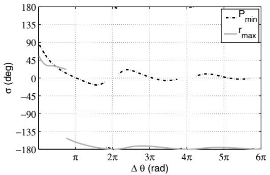  
a)

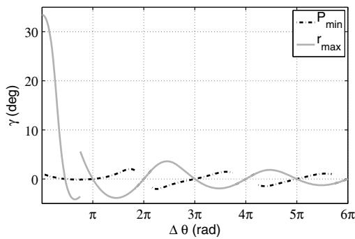  
b)  
Fig. 1 Iridium Cosmos conjunction optimal a) in-plane and b) out-of-plane maneuver orientation.

$$
\begin{array}{l} \Delta v _ {r} = \Delta v \cos \gamma \sin (\sigma + \alpha), \\ \Delta v _ {\theta} = \Delta v \cos \gamma \cos (\sigma + \alpha), \\ \Delta v _ {h} = \Delta v \sin \gamma \end{array}
$$

where α is the flight-path angle, σ is the in-plane rotation, opposite to the orbit angular momentum direction, of the maneuver velocity vecto with respect to the tangent to the orbit, and γ is the subsequent rotation along the out-of-plane direction (see [4]). A fully tangential impulse would correspond to $\sigma = \gamma = 0$

The proposed formulation was implemented in a software tool called Optimal Computation of Collision Avoidance Maneuver (OCCAM), employed to generate all the plots presented in the following. A simple OCCAM demonstration is available online.§

## IX. 2009 Iridium Cosmos Collision

The 2009 Iridium — Cosmos collision involved the active Iridium 33 spacecraft and the disabled Cosmos 2251 satellite colliding at roughly 788.6 km altitude above Siberia on 10 February 2009. The encounter geometry is summarized as follows, where Iridium is the maneuverable satellite $\begin{array} { r l } { S _ { 1 } \colon } & { { } a _ { 0 } = 7 1 5 5 . 8 } \end{array}$ km, $e _ { 0 } = 2 \times 1 0 ^ { - 4 } ,$ $\phi = 1 8 0 . 0$ deg, $\psi = 7 7 . 5$ deg, $\theta _ { c } = - 1 6 . 8 5$ deg, and $\chi = 1 . 0$ In addition, for the purpose of computing collision probabilities, the Cosmos and the Iridium satellites are modeled as a 4 and 3 m radius spherical envelope, respectively, which yields a combined crosssectional radius $s _ { A } = 7$ m. We then assume, for both objects, a diagonal covariance matrix with standard deviation of 1 km in the tangential direction and 100 m in both the normal and cross-track directions.¶ Employing the formulas of Appendix B for the covariance matrices summation, we obtain

$$
\mathbf {C} _ {\xi \zeta} = \left[ \begin{array}{c c} 0. 0 2 \mathrm{km} ^ {2} & 0 \\ 0 & 0. 8 0 \mathrm{km} ^ {2} \end{array} \right]
$$

Finally, we assume that a nondirect impact is expected with $\xi _ { e } = - 7 0$ and $\zeta _ { e } = - 7 0 ~ \mathrm { n }$ m. It is important to underline that a nonzero minimum distance has been included to highlight a richer dynamic behavior, including the presence of discontinuities as previously described. The reader interested in the direct-impact case should check the results of [14].

## X. RapidEye4 UoSat2 Conjunction

A recent avoidance maneuver was performed by the RapidEye4 satellite in May 2013 following a predicted conjunction with the nonoperational UoSat2 satellite. The interesting conjunction geometry and the maneuver optimization for this event was analyzed by Sanchez Ortiz et al. [3] using a validated in-house numerical tool. Although only approximate conjunction data could be retrieved from the previous reference (due to confidentiality reasons), the results could be qualitatively reproduced

The approximate encounter geometry is summarized as follows, where RapidEye4 is the maneuverable satellite $S _ { 1 } \colon a _ { 0 } = 7 0 0 4 . 7$ km, $e _ { 0 } = 1 . 3 \hat { 7 } \times \dot { 1 0 } ^ { - 3 } , \phi = 0$ deg, $\psi = - 2 6 . 4 9$ deg, $\theta _ { c } = 1 5 . 5$ deg, and $\chi = 1$ . In addition, a combined cross-sectional radius $s _ { A } =$ 1.58 m was assumed, as kindly provided by the authors of the previous reference. As for the covariance information, approximate diagonal covariance matrices were employed, with standard deviations of 326 and 362 m in the tangential, 8 and 10 m in the normal, and 3 and 12 m in the cross-track directions of the RapidEye4 and UoSat2 satellite, respectively. Employing the formulas of Appendix B for the covariance matrices summation, we obtain

$$
\mathbf {C} _ {\xi \zeta} = \left[ \begin{array}{c c} 1 6 4. 0 3 \mathrm{m} ^ {2} & - 8 5. 1 1 \mathrm{m} ^ {2} \\ - 8 5. 1 1 \mathrm{m} ^ {2} & 2 2 4 8 7 4. 0 8 \mathrm{m} ^ {2} \end{array} \right]
$$

Finally, approximate b-plane coordinates of $\xi _ { e } = - 2 1 . 7 5$ and $\zeta _ { e } =$ 356.77 m were used

## XI. Comparison of Minimum Collision Probability and Maximum Miss Distance Maneuvers

In this section, we analyze the optimal maneuver orientation angles for minimum collision probability and maximum miss distance, taking the Iridium–Cosmos conjunction as an example. A fixed Δv magnitude of 10 cm∕s is set for the maneuver.

Figures 1–3 compare the optimal maneuver angles, miss distance, collision probability, and b-plane map for varying Δθ in the case of minimum collision probability and maximum miss distance. Both the optimal maneuver angles and the b-plane map look quite different when $\Delta \theta$ is small, whereas they tend to converge to the same value as $\Delta \theta  \infty$ . The difference for small Δθ is because the b-plane relative covariance ellipse is very elongated in the direction of the $\zeta$ axis, so that a maneuver strategy minimizing collision probability tends to shift the b-plane position toward the ellipse edge rather than to move the furthest away from the center of the b-plane, as it occurs when miss distance is maximized. Note that, in the limit case, in which $\sigma _ { \zeta }  \sigma _ { \xi } .$ , the ellipse would become a circle and the two optimization problems would become equivalent.

Notably, there appear to be deep local minima in the collision probability curve, which are not so pronounced in the miss distance one. This suggests that, when collision probability has to be minimized, the satellite operator should perform the maneuver nea very specific “favorable” orbital positions to get the maximum benefit. Furthermore, there appears to be no relation between the collision miss distance local maxima and the collision probability local minima.

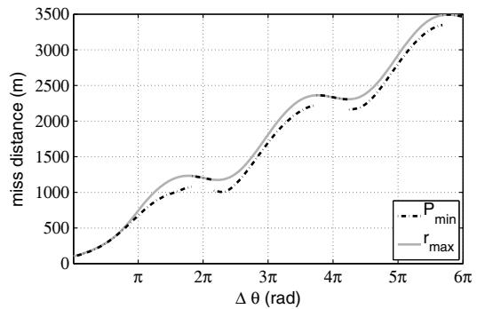  
a)

b)  
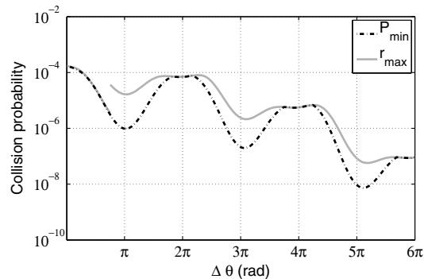  
Fig. 2 Iridium Cosmos conjunction a) miss distance b) and collision probability comparison.

Figure 4 shows the evolution of the b-plane map as the parameter Δθ increases in the case of maximum miss distance maneuver (note that, when $\Delta \theta \simeq 1 3 6$ deg, the solution is discontinuous, as can be seen in Figs. 1–3). When the semimajor axis of the elliptical reachable domain approaches the boundary defined by Eq. (29), a second tangent point to the ellipse appears, and a discontinuity appears in the b-plane map.

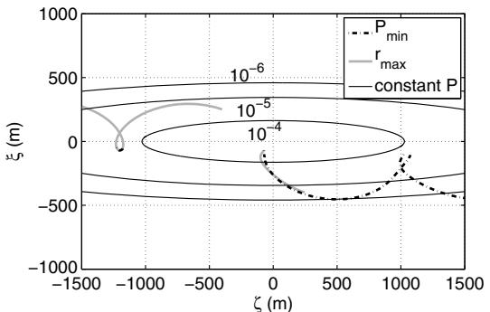  
Fig. 3 Comparison of Iridium Cosmos conjunction b-plane maps.

## XII. Delta-V Requirements for a Given Collision Probability

For the case of the of the RapidEye4–UoSat2 conjunction (see preceding section for encounter geometry), optimal angles and required impulse magnitude were calculated for given collision probabilities of $1 0 ^ { - 6 } , \ 1 0 ^ { - 8 }$ , and $1 0 ^ { - 1 0 }$ , reproducing the results of Sanchez-Ortiz et al. [3]. Figure 5 shows the optimal maneuver angles $( \sigma , \gamma )$ , whereas Fig. 6 displays the Δv magnitude. For each $\Delta \theta ,$ all quantities were computed by adjusting the maneuver size to obtain an optimal maneuver [Eq. (26)], providing the required collision probability as computed using Eq. (4). Note that, for the general case of nondirect impact, a dependence of the optimal direction angles and the magnitude of the maneuver appears due to the $\Delta v _ { 0 }$ influence on $\lambda _ { o p t }$ in Eq. (26).

The results are comparable with [3], except approximately one orbit before the conjunction, where we find a better solution along with a discontinuity in the orientation angles: the prograde maneuver is more efficient than the retrograde one. However, full conjunction data would be necessary to fully compare the results, because variations in the orbital data could eliminate the discontinuity. No discontinuity is reported in the aforementioned paper.

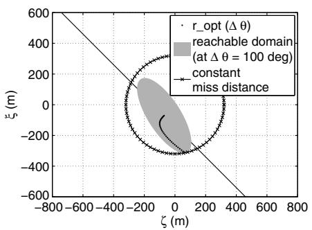  
a)

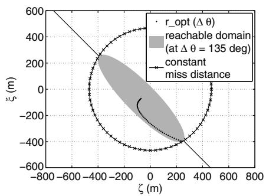  
b)

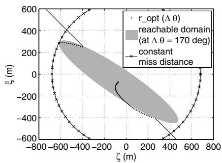  
c)  
Fig. 4 Iridium Cosmos conjunction b-plane maps after a) $\Delta \theta = 1 0 0 ,$ , b) $\Delta \theta = 1 3 5 ,$ and c) $ { \Delta \theta } = 1 7 0$ deg.

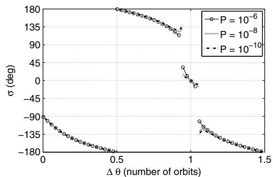  
a)

b)  
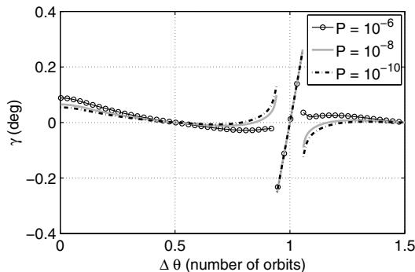  
Fig. 5 RapidEye4 UoSat2 conjunction optimal a) in-plane and b) out-of-plane maneuver orientation

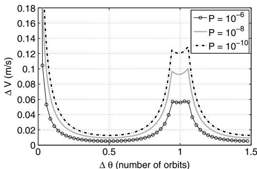  
Fig. 6 RapidEye4 UoSat2 conjunction optimal Δv.

## XIII. Accuracy of the Method

As mentioned earlier, the proposed formulation considers Keplerian orbits and neglects environmental perturbations. The approach is justified by the fact that the avoidance maneuver causes a relatively small deviation (relative to its orbital distance) of the maneuvered satellite path compared with its original trajectory. The effect of any perturbing acceleration is proportional to such displacement and scales as the acceleration gradient, which is orders of magnitude smaller than the main gravity gradient, even for the dominant perturbations in the densely populated part of the low Earth-orbit environment.

The error associated with the J2 gravitational harmonic has been investigated numerically and compared with the small error of the analytical model already proposed in [4]. To this end, each orbit has been propagated backward from the conjunction θc up to the maneuver point $\theta _ { m }$ including the J2 perturbation, and then propagated forward after applying the optimized Δv impulse (again with the J2 perturbation active) up to the collision point to finally compute the numerically accurate miss distance. A similar approach has been used to evaluate the error associated with the atmospheric drag. Formally, the miss distance error considered here can be written as

$$
\operatorname{error} (\%) = \frac {\left| \Delta r _ {a n} - \Delta r _ {n u m} \right|}{\Delta r _ {n u m}} \times 100
$$

where $\Delta r _ { a n }$ and $\Delta r _ { n u m }$ are the analytically and numerically computed miss distance, respectively. Special care was employed to minimize round-off and time discretization errors to guarantee a sufficiently high accuracy in the numerical evaluation of the miss distance.

Figures 7 and 8 show the error associated with a J2-perturbed and a Keplerian numerically propagated orbit for the Iridium–Cosmos collision case and for a similar case in which the angle ψ and the orbit inclination have been modified to lead to a near head-on collision (i.e., a collision in which the velocity vectors are almost parallel and opposite). The near head-on collision differs from the “real” Iridium– Cosmos collision by the angle ψ, set to 1 deg, and by the inclination of the maneuverable satellite (45 deg, to maximize the J2 effect). Although the Iridium–Cosmos collision shows negligible error (<0.25%), the near head-on collision exhibits error peaks reaching almost 9%. However, the peaks coincide with badly planned maneuvers, leading to low achievable miss distance (see Fig. 8b).

Similar to the previous cases, Fig. 9 shows the error associated with a drag-perturbed and a Keplerian numerically propagated orbit for a near head-on collision at an altitude of 350 km to obtain a significant effect from atmospheric drag. Even in this rather extreme case, the error remains small as long as the number of orbits is not too large. At higher and more relevant altitudes, say above 500 km, this effect would be completely negligible.

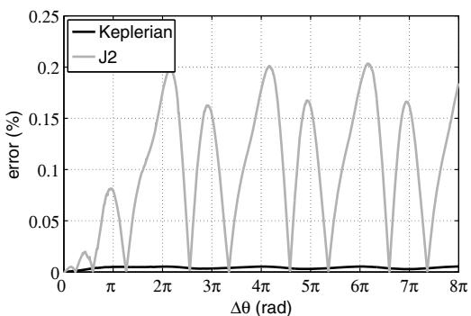

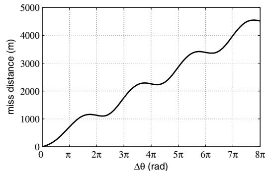  
b)  
Fig. 7 Iridium Cosmos conjunction a) J2-associated error and b) corresponding miss distance.

a)  
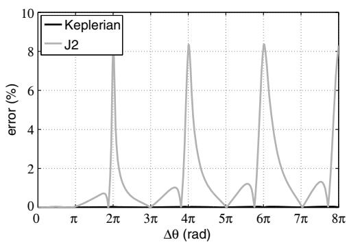  
a)

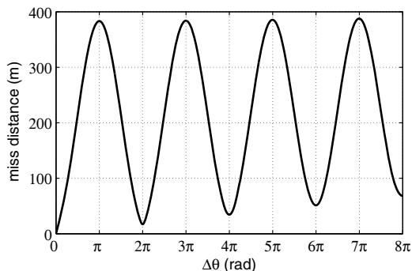  
b)  
Fig. 8 Near head-on conjunction a) J2-associated error and b) corresponding miss distance.

a)  
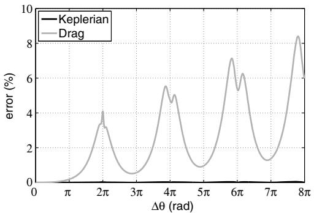

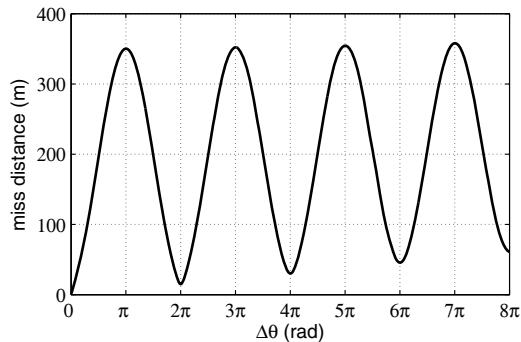  
b)  
Fig. 9 Near head-on a) high-drag error and b) corresponding miss distance.

## XIV. Conclusions

An accurate analytical formulation for the optimization of impulsive collision avoidance maneuvers in low Earth orbit has been presented. The use of a previously developed linear formulation linking the b-plane intersection to the applied Δv is shown to be crucial to reduce the optimization problem, for the most general case, to the solution of a simple eigenvalue problem and a nonlinear algebraic equation. The proposed algorithm works for both maximum miss distance and minimum collision probability optimization and fo generic orbital elements and collision geometry. In addition, it has been verified that the most relevant environmental perturbation (the J2 Earth gravitational harmonic) negligibly affects the accuracy of the method. Numerical examples reveal that, when the maneuver is conducted less than a few orbits in advance, the optimal impulse direction is far from tangential with a nonzero out-of-plane component (note that similar conclusions were obtained by Conway [5] for the asteroid deflection case), and there is a considerable difference between the minimum collision probability and the maximum miss distance case.

## Appendix A: D Matrix Coefficients

After setting

$$
q _ {1 0} = \frac {e _ {0}}{\sqrt {1 + e _ {0} \cos \theta_ {c}}}, \quad q _ {3 0} = \frac {1}{\sqrt {1 + e _ {0} \cos \theta_ {c}}}
$$

From [4], the coefficients of the D matrix [Eq. (12)] are

$$
\begin{array}{l} d _ {r \theta} = \frac {2 q _ {3 0} [ 1 - \cos (\theta_ {c} - \theta_ {m}) ] - q _ {1 0} \sin (\theta_ {m}) \sin (\theta_ {c} - \theta_ {m})}{q _ {3 0} (q _ {3 0} + q _ {1 0} \cos \theta_ {m}) (q _ {3 0} + q _ {1 0} \cos \theta_ {c}) ^ {2}}, \\ d _ {r r} = \frac {\sin (\theta_ {c} - \theta_ {m})}{q 3 0 (q _ {3 0} + q _ {1 0} \cos \theta_ {c}) ^ {2}}, \\ d _ {t \theta} = \frac {1}{q _ {3 0} (q _ {3 0} ^ {2} - q _ {1 0} ^ {2}) ^ {5 / 2} (q _ {3 0} - q _ {1 0} \cos E _ {m})} \times [ e _ {\theta 1} (E _ {c} - E _ {m}) \\ \quad + e _ {\theta 2} (\sin E _ {c} - \sin E _ {m}) + e _ {\theta 3} (\sin 2 E _ {c} - \sin 2 E _ {m}) \\ \quad + e _ {\theta 4} (\cos E _ {c} - \cos E _ {m}) + e _ {\theta 5} (\cos 2 E _ {c} - \cos 2 E _ {m}) ], \\ d _ {t r} = \frac {1}{q _ {3 0} (q _ {3 0} ^ {2} - q _ {1 0} ^ {2}) ^ {2} (q _ {3 0} - q _ {1 0} \cos E _ {m})} \times [ e _ {r 1} (E _ {c} - E _ {m}) \\ \quad + e _ {r 2} (\sin E _ {c} - \sin E _ {m}) + e _ {r 3} (\sin 2 E _ {c} - \sin 2 E _ {m}) \\ \quad + e _ {r 4} (\cos E _ {c} - \cos E _ {m}) + e _ {r 5} (\cos 2 E _ {c} - \cos 2 E _ {m}) ], \\ d _ {w h} = d _ {w h} \frac {\sqrt {q _ {3 0} ^ {2} + q _ {1 0} q _ {3 0} \cos \theta_ {c}}}{q _ {3 0} + q _ {1 0} \cos \theta_ {m}} \sin (\theta_ {c} - \theta_ {m}) \end{array}
$$

where

$$
\begin{array}{l} e _ {\theta 1} = 3 q _ {3 0} (q _ {3 0} ^ {2} - q _ {1 0} ^ {2}), \\ e _ {\theta 2} = \frac {1}{2} [ 3 q _ {1 0} ^ {3} - (2 q _ {3 0} ^ {2} - q _ {1 0} ^ {2}) (4 q _ {3 0} \cos E _ {m} - q _ {1 0} \cos 2 E _ {m}) ], \\ e _ {\theta 3} = \frac {q _ {1 0} q _ {3 0}}{4} [ 4 q _ {3 0} \cos E _ {m} - q _ {1 0} (3 + \cos 2 E _ {m}) ], \\ e _ {\theta 4} = q _ {3 0} [ (4 q _ {3 0} ^ {2} - 2 q _ {1 0} ^ {2}) \sin E _ {m} - q _ {1 0} q _ {3 0} \sin 2 E _ {m} ], \\ e _ {\theta 5} = - \frac {q _ {1 0}}{4} [ (4 q _ {3 0} ^ {2} - 2 q _ {1 0} ^ {2}) \sin E _ {m} - q _ {1 0} q _ {3 0} \sin 2 E _ {m} ], \\ e _ {r 1} = 3 q _ {1 0} q _ {3 0} \sin E _ {m}, \\ e _ {r 2} = - 2 (q _ {3 0} ^ {2} + q _ {1 0} ^ {2}) \sin E _ {m}, \\ e _ {r 3} = \frac {q _ {1 0} q _ {3 0}}{2} \sin E _ {m}, \\ e _ {r 4} = - 2 q _ {3 0} (q _ {3 0} \cos E _ {m} - q _ {1 0}), \\ e _ {r 5} = \frac {q _ {1 0}}{2} (q _ {3 0} \cos E _ {m} - q _ {1 0}) \end{array}
$$

where $E _ { c }$ and $E _ { m }$ are the eccentric anomalies corresponding to $\theta _ { c }$ and $\theta _ { m } .$ , respectively, and accounting for multiple revolutions.

## Appendix B: Computation of the Relative Position Covariance Matrix in b-Plane Axe

The rotation matrix from $S _ { 2 }$ to $S _ { 1 }$ Frenet axes is obtained as

$$
R _ {2 1} = \left[ \begin{array}{c c c} 1 & 0 & 0 \\ 0 & \cos \nu & \sin \nu \\ 0 & - \sin \nu & \cos \nu \end{array} \right] \left[ \begin{array}{c c c} \cos \psi & 0 & \sin \psi \\ 0 & 1 & 0 \\ - \sin \psi & 0 & \cos \psi \end{array} \right] \left[ \begin{array}{c c c} \cos \phi & \sin \phi & 0 \\ - \sin \phi & \cos \phi & 0 \\ 0 & 0 & 1 \end{array} \right]\tag{B1}
$$

where $\phi$ and ψ can be computed through Eqs. (7) and (8), and ν can be obtained with the following relation:

$$
\nu = \mathrm{a} \tan 2 [ (v _ {2} \times {\bf u} _ {\mathrm{h1}}) \cdot {\bf u} _ {\mathrm{h2}}, v _ {2} {\bf u} _ {\mathrm{h1}} \cdot {\bf u} _ {\mathrm{h2}} ]\tag{B2}
$$

The rotation matrix from $S _ { 1 }$ Frenet axes to b-plane axes reads

$$
\mathbf {R} _ {1 b} = \left[ \begin{array}{c} [ \mathbf {u} _ {\xi} ^ {T} ] _ {1} \\ [ \mathbf {u} _ {\eta} ^ {T} ] _ {1} \\ [ \mathbf {u} _ {\zeta} ^ {T} ] _ {1} \end{array} \right]\tag{B3}
$$

where u indicates the matrix representation of the unit vector u in $S _ { 1 }$ Frenet axes.

Under the (conservative) assumption that the Gaussian-distributed $S _ { 1 }$ and $S _ { 2 }$ positions are statistically independent, the relative position covariance matrix projected onto b-plane axes can be conveniently computed by summing up the individual covariance matrices expressed in $S _ { 1 }$ Frenet axes (tangential, normal, out-of-plane) and transforming the resulting matrix into b-plane axes. In this fashion, the b-plane relative position covariance matrix reads

$$
\mathbf {C} _ {b} = \mathbf {R} _ {1 b} (\mathbf {C} _ {1} + \mathbf {R} _ {2 1} \mathbf {C} _ {2} \mathbf {R} _ {2 1} ^ {T}) \mathbf {R} _ {1 b} ^ {T}
$$

where $\mathbf { C } _ { 1 }$ and $\mathbf { C } _ { 2 }$ are, respectively, the covariance matrices of the orbital positions of $S _ { 1 }$ and $S _ { 2 }$ projected onto the respective Frene reference systems.

## Acknowledgments

The research leading to these results has received funding from the European Union Seventh Framework Programme (FP7/2007-2013) under grant agreement 317185 (Stardust). The authors would like to thank Noelia Sánchez-Ortiz of Deimos-Space for providing usefu suggestions.

## References

[1] Klinkrad, H., Space Debris: Models and Risk Analysis, Springer– Verlag, New York, 2006, pp. 213–240.

[2] Alfano, S., “Collision Avoidance Maneuver Planning Tool,” 15th AAS/ AIAA Astrodynamics Specialist Conference, American Astronautical Soc. Paper 2005-308, 2005.

[3] Sanchez-Ortiz, N., Grande-Olalla, I., Pulido, J. A., and Merz, K., “Collision Risk Assessment and Avoidance Manoeuvres—The New CORAM Tool for ESA,” 64th International Astronautical Congress IAC Paper 13.A6.7.7, Curran Associates, Inc., Red Hook, NY, 2013, pp. 2390–2404.

[4] Bombardelli, C., “Analytical Formulation of Impulsive Collision Avoidance Dynamics,” Celestial Mechanics and Dynamical Astronomy, Vol. 118, No. 2, 2013, pp. 99–114. doi:10.1007/s10569-013-9526-3

[5] Conway, B. A., “Near-Optimal Deflection of Earth-Approaching Asteroids,” Journal of Guidance, Control, and Dynamics, Vol. 24,

No. 5, 2001, pp. 1035–1037.

doi:10.2514/2.4814

[6] Chan, F. K., Spacecraft Collision Probability, Aerospace Press, El Segundo, CA, 2008, pp. 13–97, 47–61.

[7] Valsecchi, G., Milani, A., Gronchi, G., and Chesley, S., “Resonant Returns to Close Approaches: Analytical Theory,” Astronomy and Astrophysics, Vol. 408, No. 3, 2003, pp. 1179–1196. doi:10.1051/0004-6361:20031039

[8] Lázaro, D., and Righetti, P., “Evolution of EUMETSAT LEO Conjunctions Events Handling Operations,” 12th International Conference on Space Operations, Swedish Space Corporation (SSC) and DLR, German Aerospace Center, Paper 1286508, 2012.

[9] Akella, M., and Alfriend, K., “Probability of Collision Between Space Objects,” Journal of Guidance, Control and Dynamics, Vol. 23, No. 5, 2000, pp. 769–772. doi:10.2514/2.4611

[10] Foster, J., and Estes, H. S., “Parametric Analysis of Orbital Debri Collision Probability and Maneuver Rate for Space Vehicles,” NASA JSC-25898, 1992

[11] Alfano, S., “Aerospace Support to Space Situational Awareness,” MIT Lincoln Laboratory Satellite Operations and Safety Workshop, 2002 (Oral presentation).

[12] Patera, R. P., “General Method for Calculating Satellite Collision Probability,” Journal of Guidance, Control, and Dynamics, Vol. 24, No. 4, 2001, pp. 716–722.

[13] Boyd, S. P., and Vandenberghe, L., Convex Optimization, Cambridge Univ. Press, New York, 2004, p. 229.

[14] Bombardelli, C., Hernando-Ayuso, J., and García-Pelayo, R., “Collision Avoidance Maneuver Optimization,” Advances in the Astronautical Sciences, American Astronautical Soc. Paper 2014-335, Jan. 2014.