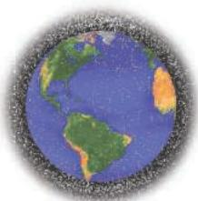
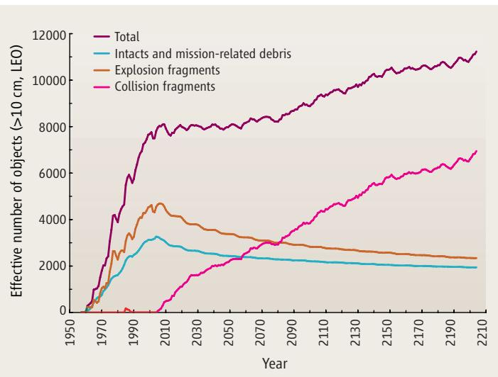
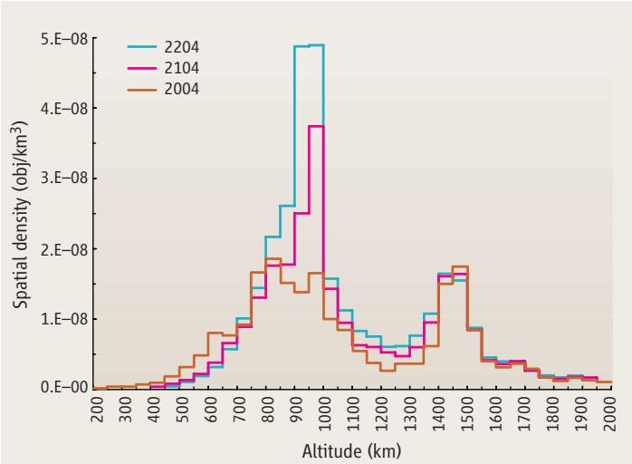
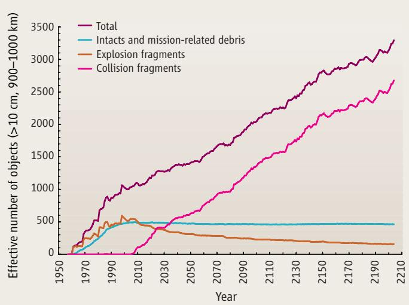

POLICYFORUM

PLANETARY SCIENCE

# Risks in Space from Orbiting Debris

J.-C. Liou1 and N. L. Johnson2

Since the launch of Sputnik I, space activi-ties have created an orbital debris environ- ties have created an orbital debris environment that poses increasing impact risks to existing space systems, including human space flight and robotic missions (1, 2). Currently, more than 9000 Earth-orbiting man-made objects (including many breakup fragments), with a combined mass exceeding 5 million kg, are tracked by the U.S. Space Surveillance Network and maintained in the U.S. satellite catalog (3–5). Three accidental collisions between catalogued objects during the period from late 1991 to early 2005 have already been docu-

mented (6), although, fortunately, none resulted in the creation of large, trackable debris clouds. The most recent (January 2005) was between a 31-year-old U.S. rocket body and a fragment from the third stage of a Chinese CZ-4 launch vehicle that had exploded in March 2000.

Several studies conducted during 1991–2001 demonstrated, with assumed future launch rates, the potential increase in the Earth satellite population, resulting from random, accidental collisions among resident space objects (7–13). In some low Earth orbit (LEO) altitude regimes, where the number density of objects is above a critical spatial density, the production rate of new debris due to collisions exceeds the loss of objects due to orbital decay.

LEGEND (LEO-to-GEO Environment Debris model), is a highfidelity three-dimensional physical model developed by the U.S. National Aeronautics and Space Administration (NASA) that is capable of simulating the historical environment, as well as the evolution of future debris populations (14, 15).

The LEGEND future projection adopts a Monte Carlo approach to simulate future onorbit explosions and collisions (16). A total of 50 (17), 200-year future projection Monte Carlo simulations were executed and evaluated, under the assumptions that no rocket bodies and spacecraft were launched after December 2004 and

that no future disposal maneuvers were allowed for existing spacecraft (few of which currently have such a capability) (18).

The simulated 10-cm and larger debris populations in LEO (defined as the region between altitudes of 200 and 2000 km) between 1957 and the end of a 200-year future projection period

  
Growth of future debris populations. Effective number of LEO objects, 10 cm and larger, from the LEGEND simulation. The effective number is defined as the fractional time, per orbital period, an object spends between 200- and 2000-km altitudes. Intacts are rocket bodies and spacecraft that have not experienced breakups.  
Space junk represents a growing threat to commercialization and other activities in space.

indicate that collision fragments replace other decaying debris (due to atmospheric drag and solar radiation pressure) through 2055, keeping the total LEO population approximately constant (see chart, above). Beyond 2055, however, the creation of new collision fragments exceeds the number of decaying debris, forcing the total satellite population to increase. An average of 18.2 collisions (10.8 catastrophic, 7.4 noncatastrophic) would be expected in the next 200 years (19, 20).

A detailed analysis indicates that the predicted catastrophic collisions and the resulting population increase are nonuniform throughout LEO (see chart on page 341, top left). About 60% of all catastrophic collisions occur between 900- and 1000-km altitudes. The number of

objects 10 cm and larger triples in 200 years, leading to a factor of 10 increase in collisional probabilities among objects in this region (see chart on page 341, top right). This population growth is

due to higher spatial densities, larger and more massive rocket bodies and spacecraft with near-polar inclinations, and longer orbit decay times in this region as compared with other parts of LEO.

The current debris population in the LEO region has reached the point where the environment is unstable and collisions will become the

most dominant debris-generating mechanism in the future. Even without new launches, collisions will continue to occur in the LEO environment over the next 200 years, primarily driven by the high collision activities in the region between 900- and 1000-km altitudes, and will force the debris pop ulation to increase. In reality, the sit uation will undoubtedly be worse because spacecraft and their orbital stages will continue to be launched.

Postmission disposal of vehicles (for example, by limiting postmission orbital lifetimes to less than 25 years) is now advocated by the major space-faring nations and organizations of the world, including NASA (21), the Department of Defense, the Department of Transportation, and the Federal Communications Com mission in the United States; the Inter-Agency Space Debris Coordination Committee (22); the European Space Agency (23); and the Japan Aerospace Exploration Agency (24). Postmission disposal will slow down the growth of future debris populations (25). However, this mitigation measure will be insufficient to constrain the Earth satellite population. Only remediation of the near-Earth environment—the removal of existing large objects from orbit—can prevent future problems for research in and commercialization of space.

For the near term, no single remediation tech nique appears to be both technically feasible and economically viable. Electrodynamic tethers or drag enhancement structures could rapidly accelerate the orbital decay of decommissioned spacecraft and rocket bodies, but attaching such devices to the satellites with conventional robotic means would incur excessive costs for the benefit gained. Even if a single remediating vehicle carried several deorbiting packages within the same altitude and inclination, the energy requirements to visit multiple target spacecraft would normally be high due to differences in target orbital planes (26, 27).

  
Projected environment. Spatial density distributions, for objects 10 cm and larger, for three different years.

  
The red zone. Effective number of objects, 10 cm and larger, between 900- and 1000-km altitudes from the LEGEND simulation.

The placement of ion engines on the satellites in order to direct them back to Earth would have the same problems as the previously mentioned strategies and, in addition, would require significant, long-term power and attitude control subsystems. Current manned spacecraft cannot reach the key orbital regimes above 600 km and are even more expensive than robotic missions. The use of ground-based lasers to perturb the orbits of the satellites is not now practical because of the considerable mass of the satellites and the consequent need to deposit extremely high amounts of energy on the vehicles to effect the necessary orbital changes.

Hence, the success of any environmental remediation policies will probably be dependent on the development of cost-effective, innovative ways to remove existing derelict vehicles. The development of this new technology may require both governments and the private sector working together. Without environment remediation and the wide implementation of existing orbital debris mitigation policies and guidelines, the risks to space system operations in near-Earth orbits will continue to climb.

## References and Notes

1. Interagency Report on Orbital Debris (Office of Science and Technology Policy, U.S. National Science and Technology Council, Washington, DC, 1995).

2. “Technical Report on Space Debris: Text of the Report adopted by the Scientific and Technical Subcommittee of the United Nations Committee on the Peaceful Uses of Outer Space” (United Nations, New York, 1999).

3. Orbital Debris Q. News 9 (1), 10 (2005), (www.orbitalde bris.jsc.nasa.gov/newsletter/newsletter.html).

4. Orbital Debris Q. News 9 (3), 10 (2005).

5. N. L. Johnson, D. O. Whitlock, P. D. Anz-Meador, E. M. Cizek. S. A. Portman, History of On-Orbit Satellite Fragmentations (SC-62530, NASA Johnson Space Center, Houston, TX, ed. 13, 2004).

6. Orbital Debris Q. News 9 (2), 1 (2005).

7. D. J. Kessler, Adv. Space Res. 11 (12), 63 (1991).

8. S.-Y. Su, Adv. Space Res. 13 (8), 221 (1993)

9. A. Rossi, A. Cordelli, P. Farinella, L. Anselmo, J. Geophys. Res. Planets 99 (E11), 23195 (1994).

10. L. Anselmo, A. Cordelli, P. Farinella, C. Pardini, A. Rossi, “Modelling the evolution of the space debris population: Recent research work in Pisa” [European Space Agency (ESA) SP-393, 339-344, European Space Operations Centre (ESOC), Darmstadt, Germany, 1997].

11. D. J. Kessler, “Critical Density of Spacecraft in Low Earth Orbit” (NASA JSC-28949, NASA Johnson Space Center, Houston, TX, 2000).

12. D. J. Kessler, P. D. Anz-Meador, “Critical number of space craft in Low Earth Orbit: Using satellite fragmentation data to evaluate the stability of the orbital debris envi ronment” (ESA SP-473, 265-272, ESOC, Darmstadt, Germany, 2001).

13. P. H. Krisko, J. N. Opiela, D. J. Kessler, “The critical density theory in LEO as analyzed by EVOLVE 4.0” (ESA SP-473, 273-278, ESOC, Darmstadt, Germany, 2001).

14. J.-C. Liou, D. T. Hall, P. H. Krisko, J. N. Opiela, Adv. Space Res. 34 (5), 981 (2004).

15. J.-C. Liou, Adv. Space Res., in press (doi:10.1016/j.asr.2005. 06.021).

16. Within a given projection time step, once the explosion probability is estimated for an intact object, a random number is drawn and compared with the probability to determine if an explosion would occur. A similar procedure is applied to collisions for each pair of target and projectile involved within the same time step. Because of the nature of the Monte Carlo process, multiple projection runs must be performed and analyzed before one can draw reliable and meaningful conclusions from the outcome.

17. A statistical analysis of LEGEND predictions, based on the bootstrap method, indicates that the average from 50 Monte Carlo runs leads to a standard error of the average on the order of 5% or less, which was sufficient for the recent study.

18. On the other hand, satellite explosions, the principal source of debris larger than 10 cm now in orbit about the Earth (5), were permitted at their current historical rates. All obiects were propagated forward in time while decayed objects were removed from the environment immediately. Perturbations included in the orbit propagator are Earth’s solar-lunar gravitational perturbations, atmospheric drag, and solar radiation pressure, as well as Earth’s shadow effects. The simulation program outputs the orbital elements and other physical properties of the objects at the end of each year for post processing analysis. The solar flux F10.7 values used in the projection period have two components: a short-term projection [2005–2007, obtained from U.S. National Oceanic and Atmospheric Administration (NOAA) Space Environment Center] and a long-term projection (2008–2204). The

long-term F10.7 projection is a repeat of a 13-month running smoothed average cycle derived from solar cycles 18 to 23. A simple smooth function is used to interpolate the two solar flux components during the transition. Explosion probabilities of future rocket bodies and spacecraft were based on an analysis of launch history and recent explosions. Vehicle types with a history of explosion, but which have had the breakup causes fixed, were not included. Collision probabilities among objects were estimated with a fast pair-wise comparison algo rithm, Cube (15). The size threshold of objects in collision considerations and in populations shown in the figures in this Policy Forum was selected to be 10 cm. Historically, this is the detection limit of the Space Surveillance Network sensors, and more than 95% of the debris population mass is in objects 10 cm and larger.

19. A catastrophic collision occurs when the ratio of impact energy to target mass exceeds 40 J/g. The outcome of a catastrophic collision is the total fragmentation of the target, i.e., resident space object, whereas a noncatastrophic collision only results in minor damage to the tar get and generates a small amount of debris that has min imal contribution to population growth.

20. N. L. Johnson, P. H. Krisko, J.-C. Liou, P. D. Anz-Meador, Adv. Space Res. 28 (9), 1377 (2001).

21. NASA Orbital Debris Program Office (www.orbitaldebris. jsc.nasa.gov/).

22 Inter-Agency Space Debris Coordination Committee (IADC) members include national space agencies of the United States, the Russian Federation, China, Japan, India, France, Germany, Italy, and the United Kingdom, as well as the ESA.

23. “ESOC: focal point for ESA space debris activities” (www.esa.int/SPECIALS/ESOC/SEMU2CW4QWD\_0.html).

24. “Space debris and space envionment” (www.jaxa.jp/missions/projects/engineering/space/debris/index\_e.html).

25. IADC Space Debris Mitigation Guidelines (IADC-02-01, Inter-Agency Space Debris Coordination Committee, 2002); (www.iadc-online.org).

26. The energy requirements to visit satellites at the same altitude and inclination in different orbital planes can be reduced by maneuvering the remediating vehicle to a different altitude, taking advantage of differential precession of the line of nodes due to the Earth’s oblateness, and then returning to the altitude of interest. This concept was described by one of the authors (Johnson) as means for more economically removing nuclear power reactors from Earth orbit (27). The amount of propellant savings derived from this technique is dependent upon the time one is willing to wait between remediation operations.

27. N. L. Johnson, Space Policy 2 (3), 223 (1986)].