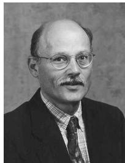
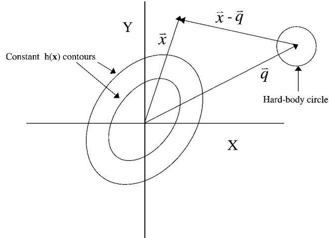
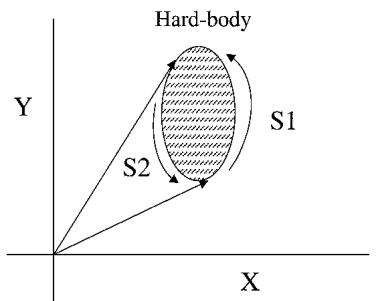
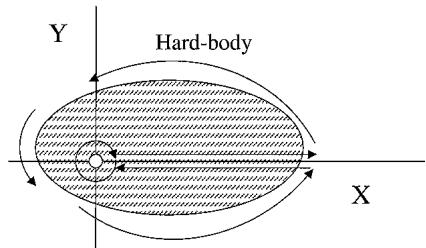
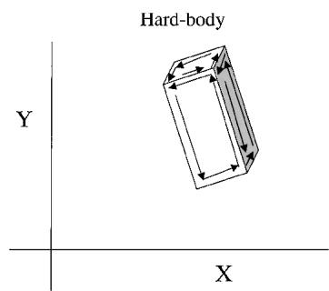

# General Method for Calculating Satellite Collision Probability

Russell P. Patera

The Aerospace Corporation, El Segundo, California 90245-4691

A method of calculating the collision probability between two orbiting objects given the respective state vectors and error covariance matrices is developed. The methodology is valid for the general case and does not require simplifying assumptions. It is computationally efŽ cient and applicable to satellites of irregular shape. Analytical techniques are used to reduce the problem to that of integrating a two-dimensional symmetric probability density over a region representing the combined hard body of the colliding objects. The symmetric form of the probability density enables the two-dimensional integral to be reduced to a one-dimensional path integral that permits easy numerical implementation and reduces computational effort. Test case results are in good agreement with those generated by other collision probability tools.

## Nomenclature

$a , c , d ,$ = auxiliary parameters $e , f , g$ $h$ = two-dimension probability density $J$ number of steps between vertices of asymmetric hard body $M$ matrix characterizing the size of the ellipse $n$ subinterval index between vertices of asymmetric hard body $\pmb q$ displacement vector between objects at closest approach $\pmb q _ { r }$ = q after a rotation to diagonalize the probability density $\pmb q _ { r s }$ q after a scale change $R$ rotation matrix for numerical integration $s$ initial hard-body radius of combined objects $T$ transformation matrix to diagonalized the two-dimensional probability density $U$ transformation matrix from encounter to diagonal frame $u$ = function deŽ ning hard-body radius $x , y , z$ coordinates used in probability density function $\mathbf { \boldsymbol { x } } \mathbf { 1 } , \mathbf { \boldsymbol { x } } 2$ = adjacent vertices of asymmetric hard-body $X _ { e }$ = distance from origin to surface of ellipse in the encounter frame $X _ { m }$ = distance from center of ellipse to a point on its surface $X _ { n } , X _ { n } ^ { \prime }$ = nth step between vertices of asymmetric hard body $\alpha$ = coefŽ cient deŽ ning probability density $\beta$ = coefŽ cient deŽ ning probability density $\varepsilon$ = small rotation angle for propagating around the hard-body ellipse $\theta$ = integration parameter $\rho$ = three-dimensionalprobability density function $\sigma _ { x , y , z }$ = standard deviations for each axis

rotation angle to eliminate the cross term in the two-dimensional probability density

## Introduction

HE possibility of a satellite colliding with space debris or an-T other satellite is becoming more likely as the number of ob- jects in Earth orbit increases. One method of mitigating the risk of an on-orbit collision is to perform a collision avoidance maneuver whenever a close approach with another tracked object is predicted. The space shuttle must perform a collision avoidance maneuver whenever a tracked object is predicted to violate a keep-out volume of $5 \times 2 \times 2$ km centered on the Orbiter.1 Because launch vehicles can pose risk to crewed and operational vehicles, ascent trajectories are checked for possible close approaches for a range of launch times spanning the launch window.2;3 A disadvantage of the keepout volume criterion is that it does not quantify the collision risk. It is preferable to compute a collision probability so that the collision risk can be traded off against the inherent risks of performing a collision avoidance maneuver. Such a calculation requires information on state vector accuracy characterized by the error covariance matrix of each object.

Some researchers have been searching for an effective formulation and computer implementation of this collision probability calculation problem,4 and signiŽ cant progress has been made in recent years. Chan showed that it is permissible to combine the error covariance matrices for two orbiting objects to obtain a relative covariance matrix as long as they are represented in the same coordinate frame.5 The combined covariance matrix has an associated three-dimensional probability density function that represents the uncertainty in relative position between the two objects.

Several analysts have found that the problem can be reduced to two dimensions by eliminating the dimension parallel to the relative velocity vecto $\cdot ^ { 5 - 9 }$ When each satellite is assumed to have a spherical shape, the collision probability can be reduced to a two-dimensionalintegral over a circular region in a plane normal to

Russell Patera received a B.A. and M.A. in physics from the State University of New York and a Ph.D. in physics from the University of Miami in 1979. He served as Assistant Professor of physics at the University of Miami and Florida International University prior to joining Vought Aerospace (previously LTV) in 1984. He joined the Aerospace Corporation in 1987, specializing in dynamics, guidance, and control of both launch vehicles and satellites. He joined the Center for Orbital and Reentry Debris Studies in 1997 and is currently involved in orbital and reentry debris hazard analysis.

the relative velocity vector referred to as the encounter frame.5¡9 If the probabilitydensityis nearly constantoverthe circularintegration region, then the probability is approximatelyequal to the area times the probability density at the center of the circular region.

Although the mathematical foundation of the two-dimensional integral is solid, Berend9 validated it with Monte Carlo simulations. When the two-dimensionalintegral was applied to the space station and several simplifying assumptionson the covariancematrices and encountergeometrywere made, Alfriend et al.7 showedthat the twodimensionalintegralcan be artiŽ ciallyreducedto a one-dimensional integral involving the error function.This reduction in dimensionality is artiŽ cial in that the error function itself is deŽ ned as an integral. Chan5 found a single integral involving the error function that is more generally applicable. In the region where probability density is nearly uniform and the error function has acceptable accuracy, Leclair8 found a simpler approximationto be useful. However, both Chan5 and LeClair8 point out that the error function formulation is not very useful because it converges too slowly in the region where the relativeseparationdistanceis greater than the standarddeviation of the probabilitydensity function. This can introduceunacceptably large numerical errors as well as sluggish computational performance. Thus, in practice the collision probability is obtained by numerically evaluating a two-dimensional integral of the combined probabilitydensity in the encounterplane. Collision probabilitypredictionsoftwarehas reachedoperationalstatusand is currentlybeing used to monitor satellite collision risk with tracked space objects.10

The purpose of this work is to provide an accurate and efŽ cient method to calculateorbital collisionprobabilitywithout making any simplifyingassumptions.A formulation was developedthat reduces the two-dimensional integral to a one-dimensional integral involving only a simple exponential function in the integrand. Instead of integrating over an area, one integrates around the perimeter of the area, thereby reducing the number of evaluations of the integrand and increasing the computational speed. This computational efŽ - ciency is particularlyadvantageouswhen large numbers of collision probability evaluations are performed.

This formulation differs from all others in that there is no need to assume a spherical shape to the space objects. Space objects of highly irregularshape can be handledreadily becauseit is easy to de-Ž ne the perimeter over which the integral is performed. This differs signiŽ cantly from the error function formulation, which assumes spherically symmetric space objects.5;7

The ability to handle asymmetric space objects is particularly helpful in computing collision probabilities of geostationary satellites that have large rectangularsolar panels that are required for the considerable power needed for transmitting signals. Launch vehicles, which are also nonsphericalin shape, can be handled with this formulation as well.

The inclusion of satellite shape tends to reduce the predicted collision probability, and using this general method one can determine satelliteor satelliteappendageorientationto minimize collisionrisk. Therefore,in many cases it is possible to mitigate collision risk by a reorientation of an entire satellite or its appendages. This is far less risky than performing a collision avoidance maneuver. In addition, one would expect fewer launch vehicle holds due to collision risk because the collision probabilityis typically signiŽ cantly lower and modeled more accurately using this formulation.

An efŽ cient computer numericalimplementationof the computation scheme was created and tested. Values of collision probability using this new method are in agreement with two probability estimation tools that are currently operational.

## Methodology Overview

The collision risk to a space object of interest is assessed by Ž rst screening out cataloged objects that have no possibility of collision based on their orbital elements. Each one of the remaining objects is propagated while its proximity to the object of interest is checked against a critical distance to determine if a probabilitycalculation is warranted. One such criterion is the overlapping of the three-sigma positional error ellipsoids of each space object. Once a potential collision is identiŽ ed, the error covariancesand state vectors of each object near the point of closest approach are used to compute the collisionprobability.The methodof computingcollisionprobability is the subject of this paper.

Because the relativevelocityof orbital objects at closest approach is very large compared to the relative accelerations, the relative velocity can be considered constant during the encounter period. The positionalerror of each object at closestapproachis represented by a three-dimensional Gaussian probability density. The relative positional error of the satellites can be obtained by simply adding the error covariance matrices. Because the objects pass each other at constant velocity, the three-dimensional probability density is reduced to a two-dimensional distribution. That is, the probability density as a function of position along the velocity direction can be integrated yielding a two-dimensional Gaussian distribution in the encounter plane that is normal to the relative velocity vector.

The physicalshape of each object is initially assumed to be spherical to be consistent with other probability estimation tools. The method is extended to irregularly shaped objects in a later section. The two spheres can be combined into one equivalent sphere having a radius equal to the sum of the radii of the two spheres. This equivalent sphere is termed a hard-body sphere because it represents the combined size of both objects. If the relative separation distance is less than the sum of the radii, a collision will occur. The combined hard-body sphere becomes a circle when projected onto the encounter plane. The hard-bodycircle is centered on the relative separation distance based on the state vectors of the objects at closest approach.The relativeseparationdistancecan be interpretedas a collision impact parameter. The hard-body circle can be interpreted as the collision cross section. The collision probability is obtained by integrating the probability density over the combined hard-body circle in the encounter frame.

A unique development of this work is the reduction of the area integralto a path integralabout the perimeterof the hard-bodycircle. This is achieved by performing a coordinate rotation and a scale change to make the density distribution symmetric. The coordinate rotation does not alter the shape of the hard-bodycircle but changes its location. The subsequent scale change transforms the circular hard-body region into an elliptical region and alters its position.

The problem is reduced to integrating a symmetric probability density over an elliptical region. The symmetric form of the probability density enablesthe two-dimensionalintegralto be reducedto a one-dimensionalintegral. The form of the resulting one-dimension integral enables it to be converted into a path integral that greatly facilitates computer implementation.

## Analysis

The uncertainty in the relative position between the objects is deŽ ned by a three-dimensionalGaussian distribution of the form

$$
\begin{array}{r l} \rho (\boldsymbol {x}) & = \left[ 1 / (2 \pi) ^ {\frac {3}{2}} \sigma_ {x} \sigma_ {y} \sigma_ {z} \right] \exp \left[ - \left(x ^ {2} / 2 \sigma_ {x} ^ {2}\right) \right. \\ & \left. - \left(y ^ {2} / 2 \sigma_ {y} ^ {2}\right) - \left(z ^ {2} / 2 \sigma_ {z} ^ {2}\right) \right] \end{array}\tag{1}
$$

When the distribution is transformed to the encounter frame and integrated along the relative velocity direction, which is taken to be along the $Z { \dot { } }$ axis, the three-dimensional Gaussian reduces to a two-dimensional Gaussian of the form

$$
h (\boldsymbol {x}) = \left(1 / 2 ^ {\frac {3}{2}} \pi \sigma_ {x} \sigma_ {y} \sigma_ {z} \sqrt {a}\right) \exp \left[ - e x ^ {2} - f y ^ {2} - g x y \right]\tag{2}
$$

The encounter coordinate frame in Eq. (2) is related to the frame deŽ ning the density in Eq. (1) by

$$
\boldsymbol {x} _ {\text { sigma }} = U \boldsymbol {x} _ {\text { encounter }}\tag{3}
$$

The parameters a; e; f , and $g$ are deŽ ned by

$$
a = \frac {U _ {1 3} ^ {2}}{2 \sigma_ {x} ^ {2}} + \frac {U _ {2 3} ^ {2}}{2 \sigma_ {y} ^ {2}} + \frac {U _ {3 3} ^ {2}}{2 \sigma_ {z} ^ {2}}\tag{4}
$$

$$
e = \frac {U _ {1 1} ^ {2}}{2 \sigma_ {x} ^ {2}} + \frac {U _ {2 1} ^ {2}}{2 \sigma_ {y} ^ {2}} + \frac {U _ {3 1} ^ {2}}{2 \sigma_ {z} ^ {2}} - \frac {c ^ {2}}{4 a}\tag{5}
$$

$$
f = \frac {U _ {1 2} ^ {2}}{2 \sigma_ {x} ^ {2}} + \frac {U _ {2 2} ^ {2}}{2 \sigma_ {y} ^ {2}} + \frac {U _ {3 2} ^ {2}}{2 \sigma_ {z} ^ {2}} - \frac {d ^ {2}}{4 a}\tag{6}
$$

  
Fig. 1 Collision probability density and relative position of the hardbody circle in the encounter plane.

$$
g = \frac {U _ {1 1} U _ {1 2}}{\sigma_ {x} ^ {2}} + \frac {U _ {2 1} U _ {2 2}}{\sigma_ {y} ^ {2}} + \frac {U _ {3 1} U _ {3 2}}{\sigma_ {z} ^ {2}} - \frac {c d}{2 a}\tag{7}
$$

where

$$
c = \frac {U _ {1 1} U _ {1 3}}{\sigma_ {x} ^ {2}} + \frac {U _ {2 1} U _ {2 3}}{\sigma_ {y} ^ {2}} + \frac {U _ {3 1} U _ {3 3}}{\sigma_ {z} ^ {2}}\tag{8}
$$

$$
d = \frac {U _ {1 2} U _ {1 3}}{\sigma_ {x} ^ {2}} + \frac {U _ {2 2} U _ {2 3}}{\sigma_ {y} ^ {2}} + \frac {U _ {3 2} U _ {3 3}}{\sigma_ {z} ^ {2}}\tag{9}
$$

where $U _ { i j } , i , j = 1 , 3$ , are the elements of the transformation matrix $U .$

The collision probability density per unit area is given by $h ( x )$ in Eq. (2) and is illustratedby the constantcontourlines in Fig. 1. All of the uncertainty in relative position between the two objects, which is represented by h.x/, can be attributed to the Ž rst object, which is nominally located at the origin. The second object’s location is deŽ ned by the relative displacement vector q which is obtained by transforming the relative position vector at closest approach to the encounter frame. There is no uncertainty in q because all of the uncertainty in relative position has been attributed to the Ž rst object for visualization purposes. The hard-body circle is centered on the second object located at $\pmb q .$ Because the actual position of the Ž rst object must lie within the hard-body circle for a collision to occur, the total collision probability is obtained by integrating the probability density over the hard-body circle. This is achieved by using a step function u $( x - \pmb q )$ , to deŽ ne the hard-body circle, where $u ( { \pmb x } - { \pmb q } ) = 1$ , if the absolutevalue of x q is less than the sum of the radii of the two objects and $u ( { \pmb x } - { \pmb q } ) = 0$ otherwise. The collision probability(prob) is obtained by integrating the product of h.x/ and $u ( { \pmb x } - { \pmb q } )$

$$
\operatorname{prob} = \iint h (\boldsymbol {x}) u (\boldsymbol {x} - \boldsymbol {q}) \mathrm{d} \boldsymbol {x}\tag{10}
$$

This problem has the property of reciprocity because the same answer results if the Ž rst and second objects are switched. That is, if all of the relative position uncertainty was attributed to the second object and the hard-body circle was centered on the Ž rst object, one would also obtain Eq. (10).

Equation (10) is equivalent to expressions obtained by other analysts.5¡9 In practice Eq. (10) is evaluated by two-dimensional numerical integration. Nevertheless, the collision probability calculation can be greatly simpliŽ ed by reducing the integration over the hard-body area to an integration about a contour enclosing the area. This is achieved by performing a rotation followed by a scale change in the encounter plane.

A coordinate rotation is performed to eliminate the cross term in h to yield

$$
h (\boldsymbol {x}) = \left(1 / 2 ^ {\frac {3}{2}} \pi \sigma_ {x} \sigma_ {y} \sigma_ {z} \sqrt {a}\right) \exp [ - \alpha x ^ {2} - \beta y ^ {2} ]\tag{11}
$$

where

$$
\alpha = (e + f) / 2 - \sqrt {g ^ {2} + (f - e) ^ {2}} / 2\tag{12}
$$

$$
\beta = (e + f) / 2 + \sqrt {g ^ {2} + (f - e) ^ {2}} / 2\tag{13}
$$

This rotation changes q to qr as given by

$$
\boldsymbol {q} _ {r} = T \boldsymbol {q}\tag{14}
$$

where $T$ is given by

$$
T = \left[ \begin{array}{c c} \cos (\phi) & \sin (\phi) \\ - \sin (\phi) & \cos (\phi) \end{array} \right]\tag{15}
$$

and

$$
\cos (\phi) = \sqrt {\frac {1}{2} \left[ 1 - \frac {(f - e)}{\sqrt {g ^ {2} + (f - e) ^ {2}}} \right]}\tag{16}
$$

$$
\sin (\phi) = \pm \sqrt {\frac {1}{2} \left[ 1 + \frac {(f - e)}{\sqrt {g ^ {2} + (f - e) ^ {2}}} \right]}\tag{17}
$$

The correct sign in Eq. (17) is determined by ensuring that the cross term in Eq. (11) is zero, that is,

$$
2 (f - e) \sin (\phi) \cos (\phi) + g [ \cos (\phi) ^ {2} - \sin (\phi) ^ {2} ] = 0\tag{18}
$$

A scale change in the y axis is made to make h.x/ symmetric:

$$
y = \sqrt {(\alpha / \beta)} y ^ {\prime}\tag{19}
$$

$$
h (\boldsymbol {x}) = \left(\sqrt {\alpha} / 2 ^ {\frac {3}{2}} \pi \sigma_ {x} \sigma_ {y} \sigma_ {z} \sqrt {a \beta}\right) \exp \left[ - \alpha x ^ {2} - \alpha y ^ {\prime 2} \right]\tag{20}
$$

The $y$ component of $\mathbf { \boldsymbol { q } } _ { r } , \boldsymbol { q } _ { r } ( 2 )$ , is multiplied by a scale factor given by

$$
q _ {r s} (2) = \sqrt {(\beta / \alpha)} q _ {r} (2)\tag{21}
$$

The y component of the hard-body circle is also multiplied by the scale factor resulting in

$$
(x / s) ^ {2} + (y / s) ^ {2} (\alpha / \beta) = 1\tag{22}
$$

where s is the initial hard-body radius of the combined objects.

Using Eq. (20) in Eq. (10) and converting to polar coordinates, one Ž nds

$$
\mathrm{prob} = \frac {\sqrt {\alpha}}{2 ^ {\frac {3}{2}} \pi \sigma_ {x} \sigma_ {y} \sigma_ {z} \sqrt {a \beta}} \iint_ {\text {ellipse}} \exp (- \alpha r ^ {2}) r d r d \theta\tag{23}
$$

Here the region of integration is deŽ ned by the ellipse given by Eq. (22). The advantage of having a symmetric probability density functionis now clearbecausethe integrationoverr can be performed immediately yielding,

$$
\operatorname{prob} = \frac {1}{4 \sqrt {2} \pi \sigma_ {x} \sigma_ {y} \sigma_ {z} \sqrt {a \beta \alpha}} \left(\int_ {s 2} \exp (- \alpha r ^ {2}) d \theta - \int_ {s 1} \exp (- \alpha r ^ {2}) d \theta\right)\tag{24}
$$

where s1 and s2 are contoursdeŽ ning the hard-bodyellipseas shown in Fig. 2. The usual integration technique involves solving for r for each value of µ along the contours s1 and s2 and determining the endpoints where s1 joins s2. These tedious computations can be avoided by noting that Eq. (24) is equivalent to the closed path integral deŽ ned by

$$
\mathrm{prob} = \frac {- 1}{4 \sqrt {2} \pi \sigma_ {x} \sigma_ {y} \sigma_ {z} \sqrt {a \beta \alpha}} \oint_ {\text {ellipse}} \exp (- \alpha r ^ {2}) d \theta\tag{25}
$$

  
Fig. 2 Contours s1 and s2 deŽ ned by the hard-body ellipse.

  
Fig. 3 Contour integration path for the case in which the origin lies within the hard body.

where the minus sign is introducedto be consistentwith integrating around the contourin the counterclockwisedirection.Equation (25) can be simpliŽ ed by evaluating the coefŽ cient of the integral, which resultsin Eq. (26a). If the originis containedin the hard-bodyellipse, the line integral includes an inŽ nitesimal circle about the origin that contributes a 2¼ to the value of the integral as shown in Fig. 3. In this case Eq. (26a) is replaced with Eq. (26b). When the origin is excluded from the hard-body ellipse,

$$
\mathrm{prob} = \frac {- 1}{2 \pi} \oint_ {\text {ellipse}} \exp (- \alpha r ^ {2}) \mathrm{d} \theta\tag{26a}
$$

When the origin is included in the hard-body ellipse,

$$
\mathrm{prob} = 1 - \frac {1}{2 \pi} \oint_ {\text {   ellipse   }} \exp (- \alpha r ^ {2})   \mathrm{d} \theta\tag{26b}
$$

The reduction of the probability calculation to a simple contour integral involving only a scalar exponential in the integrand given by Eq. (26) greatly increases computational efŽ ciency. In addition, the ease of deŽ ning the closed contour enables the methodology to be applied to the general case of non-sphericalobjects. An example of a non-sphericalproblem is presented in a subsequent section.

## Numerical Implementation

The form of the integral in Eq. (26) enables a very efŽ cient computational procedureto be employed. DeŽ ne a point on a unit circle as X .1; 0/. A second point is obtained by multiplying X by an inŽ nitesimal rotation matrix,

$$
X ^ {\prime} = R X\tag{27}
$$

$$
R = \left[ \begin{array}{c c} \cos (\varepsilon) & - \sin (\varepsilon) \\ \sin (\varepsilon) & \cos (\varepsilon) \end{array} \right]\tag{28}
$$

where " is a small angle.

Both vectors are multiplied by scale factors to deŽ ne the hardbody ellipse.

$$
\boldsymbol {X} _ {m} ^ {\prime} = M \boldsymbol {X} ^ {\prime}, \quad \boldsymbol {X} _ {m} = M \boldsymbol {X}\tag{29}
$$

$$
M = \left( \begin{array}{c c} s & 0 \\ 0 & s \sqrt {\beta / \alpha} \end{array} \right)\tag{30}
$$

The distance of each point on the ellipse to the origin of the encounter plane is found by adding the displacement vector to the ellipse vector:

$$
\boldsymbol {X} _ {e} ^ {\prime} = \boldsymbol {X} _ {m} ^ {\prime} + \left[ \begin{array}{c} q _ {r} (1) \\ q _ {r s} (2) \end{array} \right]\tag{31}
$$

$$
\boldsymbol {X} _ {e} = \boldsymbol {X} _ {m} + \left[ \begin{array}{c} q _ {r} (1) \\ q _ {r s} (2) \end{array} \right]\tag{32}
$$

The angle between the two vectors, dµ, is found by noting its relationship to the cross product between the two vectors:

$$
\boldsymbol {X} _ {e} \times \boldsymbol {X} _ {e} ^ {\prime} = | \boldsymbol {X} _ {e} | | \boldsymbol {X} _ {e} ^ {\prime} | \sin (\mathrm{d} \theta)\tag{33}
$$

After rearranging Eq. (33) one Ž nds

$$
\mathrm{d} \theta = \sin^ {- 1} \left(\frac {\boldsymbol {X} _ {e} \times \boldsymbol {X} _ {e} ^ {\prime}}{| \boldsymbol {X} _ {e} | | \boldsymbol {X} _ {e} ^ {\prime} |}\right)\tag{34}
$$

The integrand (int) is evaluated at the midpoint of the two vectors:

$$
\mathrm{int} = \exp \left\{- \alpha [ (X _ {e} + X _ {e} ^ {\prime}) / 2 ] ^ {2} \right\}\tag{35}
$$

The integral is evaluated by summing values of the integrand times dµ for each pair of points around the ellipse. This is accomplished by multiplying X and X0 by the rotation matrix R and repeating the steps from Eq. (29) as before.The numericalvalueof the closed-path integral (sum) is

$$
\mathrm{sum} = \mathrm{sum} + (\mathrm{int}) (\mathrm{d} \theta)\tag{36}
$$

Once one complete cycle about the ellipse is made, the probability when the origin is excluded from the hard body is given by Eq. (26) as

$$
\mathrm{prob} = - \mathrm{sum} / 2 \pi
$$

and when the origin is included in the hard-body as

(37a)

$$
\mathrm{prob} = 1 - \mathrm{sum} / 2 \pi\tag{37b}
$$

## Numerical Results

The computation technique was implemented on a computer and test cases were run. The collision probability between a launch vehicle with a 200-m keep-out radius and cataloged space objects was computed. The launch vehicle keep-out radius was artiŽ cially increased from 20 to 200 m to stress each algorithm. The radius of each space object was based on its radar cross section (RCS) as shown in Table 1. Results of the model presented here are in very close agreementwith results obtainedfrom an operationalcomputer simulation named PERFCT option 5, which is based on a NASA model. Results differ by less than 1% over a wide range of object size and error covariance matrices. PERFCT option 5 performs a two-dimensional numerical integration over the hard-body circle, which is equivalentto evaluatingEq. (10). Another model,PERFCT option 3, evaluates collision probability by assuming the collision probabilitydensity is constant over the hard-bodycircle and is equal to its value at the center of the hard-body circle. Thus, the collision probabilitydensity at the center of the hard-bodycircle is multiplied by the area of the circle. A comparison of model results is shown in Table 1.

Peterson (private communication) evaluated the computational efŽ ciency by executing both 1,000 and 10,000 collision probability evaluations and recording the associated CPU times obtained from a Sun Ultra 60 machine using a 360-MHz Ultra Sparc 2 processor. The PERFCT option 5 had CPU times of 5.60 and 57.52 s, respectively.The current model had CPU times of 0.99 and 10.12 s, respectively.Thus, the current model evaluatedcollisionprobability about 5.7 times faster. However, Peterson found that PERFCT option 5 had 720 function calls to evaluate the area integral, whereas the current model had 400 function calls to evaluate the contour integral. Because the perimeter is proportional to the square root of the area, the number of function calls was reduced from 400 to the square root of 400 or 27 to make the integration schemes more comparable. Using a case with a relatively high collisionprobability that might lead to a collisionavoidancemaneuver,PERFCT option 5 yields a collision probabilityof 0.00193, whereas the current model yields 0.001792 for 400 steps and 0.001791 for 27 steps. Thus, reducing the number of steps does not degrade accuracy signiŽ cantly. Peterson found that the CPU time is reduced from 0.99 to 0.26 s when 27 rather than 400 steps are used on the set of 1000 cases. Thus with 27 steps, the current model evaluates collision probability 21 times faster than PERFCT option 5.

Table 1 Collision probability resultsa

<table><tr><td>Trajectory</td><td>Catalog name</td><td>RCS, m</td><td>Miss range, km</td><td>PERFCT option 3, aerospace model</td><td>PERFCT option 5, based on NASA model</td><td>Current model</td><td>Current vs PERFCT option 5, %</td></tr><tr><td>1</td><td>SL-8 Deb</td><td>0.401</td><td>75.375</td><td>3.38E-06</td><td>3.57E-06</td><td>3.56E-06</td><td>0.28</td></tr><tr><td>2</td><td>Delta 1 Deb</td><td>0.479</td><td>59.824</td><td>5.27E-06</td><td>5.56E-06</td><td>5.54E-06</td><td>0.36</td></tr><tr><td>3</td><td>Cosmos 1452</td><td>23.129</td><td>67.429</td><td>4.32E-06</td><td>4.56E-06</td><td>4.55E-06</td><td>0.22</td></tr><tr><td>4</td><td>Delta 1 R/B(2)</td><td>58.091</td><td>46.031</td><td>3.81E-06</td><td>4.02E-06</td><td>4.01E-06</td><td>0.25</td></tr><tr><td>5</td><td>SL-6 R/B(2)</td><td>1000</td><td>22.821</td><td>1.16E-04</td><td>1.22E-04</td><td>1.22E-04</td><td>0.00</td></tr><tr><td>6</td><td>Okean 1</td><td>167.134</td><td>86.651</td><td>1.01E-05</td><td>1.06E-05</td><td>1.06E-05</td><td>0.00</td></tr><tr><td>7</td><td>Thorad Agena D Deb</td><td>0.167</td><td>78.478</td><td>4.82E-06</td><td>5.09E-06</td><td>5.08E-06</td><td>0.20</td></tr><tr><td>8</td><td>SL-14 R/B</td><td>100.531</td><td>23.683</td><td>9.53E-06</td><td>1.01E-05</td><td>1.00E-05</td><td>1.00</td></tr><tr><td>9</td><td>Cosmos 970 Deb</td><td>0.404</td><td>48.928</td><td>2.98E-06</td><td>3.15E-06</td><td>3.14E-06</td><td>0.32</td></tr><tr><td>10</td><td>Scout B Deb</td><td>1000</td><td>7.9235</td><td>1.22E-04</td><td>1.29E-04</td><td>1.28E-04</td><td>0.78</td></tr><tr><td>11</td><td>Delta 1 Deb</td><td>0.809</td><td>123.61</td><td>2.80E-06</td><td>2.95E-06</td><td>2.94E-06</td><td>0.34</td></tr><tr><td>12</td><td>Delta 1 Deb</td><td>0.866</td><td>80.144</td><td>5.70E-06</td><td>6.02E-06</td><td>6.00E-06</td><td>0.33</td></tr><tr><td>13</td><td>SL-14 Deb</td><td>0.011</td><td>45.256</td><td>5.33E-06</td><td>5.63E-06</td><td>5.61E-06</td><td>0.36</td></tr><tr><td>14</td><td>SL-14 Deb</td><td>0.071</td><td>66.094</td><td>1.65E-06</td><td>1.74E-06</td><td>1.73E-06</td><td>0.58</td></tr><tr><td>15</td><td>Thorad Agena D Deb</td><td>0.753</td><td>78.312</td><td>2.47E-06</td><td>2.61E-06</td><td>2.60E-06</td><td>038</td></tr><tr><td>16</td><td>Thorad Delta 1 Deb</td><td>0.135</td><td>29.489</td><td>4.55E-06</td><td>4.80E-06</td><td>4.79E-06</td><td>0.21</td></tr><tr><td>17</td><td>Cosmos 970</td><td>61.378</td><td>59.917</td><td>4.95E-06</td><td>5.22E-06</td><td>5.21E-06</td><td>0.19</td></tr><tr><td>18</td><td>Delta 1 Deb</td><td>3.766</td><td>42.657</td><td>6.19E-06</td><td>6.53E-06</td><td>6.51E-06</td><td>0.31</td></tr><tr><td>19</td><td>SL-16 Deb</td><td>0.206</td><td>140.074</td><td>2.41E-06</td><td>2.54E-06</td><td>2.54E-06</td><td>0.00</td></tr><tr><td>20</td><td>Cobe Deb</td><td>0.079</td><td>45.205</td><td>3.11E-06</td><td>3.28E-06</td><td>3.27E-06</td><td>0.31</td></tr><tr><td>21</td><td>Thor Ablestar Deb</td><td>0.388</td><td>85.418</td><td>2.89E-06</td><td>3.05E-06</td><td>3.04E-06</td><td>0.33</td></tr><tr><td>22</td><td>Salyut 7 Deb</td><td>1000</td><td>15.926</td><td>8.24E-05</td><td>8.70E-05</td><td>8.67E-05</td><td>0.35</td></tr><tr><td>23</td><td>Salyut 7 Deb</td><td>1000</td><td>133.990</td><td>5.51E-05</td><td>5.82E-05</td><td>5.80E-05</td><td>0.34</td></tr><tr><td>24</td><td>Cosmos 374 Deb</td><td>0.96</td><td>33.989</td><td>2.44E-06</td><td>2.58E-06</td><td>2.57E-06</td><td>0.39</td></tr><tr><td>25</td><td>Delta 1 Deb</td><td>0.603</td><td>17.699</td><td>3.34E-06</td><td>3.52E-06</td><td>3.51E-06</td><td>0.28</td></tr><tr><td>26</td><td>SL-12 R/B(1)</td><td>99</td><td>3.905</td><td>1.25E-05</td><td>1.32E-05</td><td>1.32E-05</td><td>0.00</td></tr></table>

aLaunch object radius: 200 m.

## Asymmetric Objects

The assumption that the object of interest is spherical in shape simpliŽ es the analysis because detailed geometry and attitude information is not required. Although this assumption is reasonable for compact objects, it introduces signiŽ cant error for objects with large geometric asymmetries such as launch vehicles or satellites with large solar panels. The secondary object is considered spherical in shape because its geometry and attitude are usually not known.

Except for the shape of the combined hard body, the method of calculating collision probability remains valid. Instead of a hardbody sphere, the physical shape of the primary object is deŽ ned by a grid of points referenced to its nominal position in the Earthcentered inertial (ECI) coordinate frame. The grid points deŽ ne the vertices of a set of polygons that form a completely closed surface. This closed surface is representative of the actual shape of the satellite.Each polygonis deŽ ned by a sequenceof pointsordered so that its perimeter is traversed in the counterclockwise direction when viewed from outside the closed surface. The combined hard body is found by adjusting the coordinate of each primary object grid point to account for the secondary object’s radius. Thus, the shape of the combined hard body represented by the grid points expands to enclose the true hard body, which actually has rounded corners. This adjustment results in a good approximation to the shape of the combined hard body, as long as the secondary object is smaller than the primary. For cases involving secondary objects signiŽ cantly larger than the primary objects, one can assume both objectsare sphericallysymmetricto simplifythe calculationwithout much loss of accuracy. The effect of secondary object radius on collision probability can be observed in the numerical test cases presented in Table 2.

Once the grid points are properly adjusted, the closed surface is then projected to the encounter plane. This is achieved by projecting each polygon to the encounter plane and retaining only those surfaceswhose sequenceof pointstraversethe perimeterin the counterclockwisedirection.Thus, only half of the polygonalsurfaces are retained. The relative displacement between the objects in the encounter frame is added to each grid point so that the projected hard body is referenced to the origin of the probability density. The resulting set of grid pointsrepresentthe combinedhard bodyprojected to the encounter frame.

Fig. 4 Integration contours for a rectangular solid pro jected to the encounter plane.  

The total probability is obtained by integrating the probability density over each projected polygonal surface and summing all of the contributions.As was done earlier, the computationis simpliŽ ed by performing a coordinate rotation and a scale change to make the probability density distribution symmetric. The coordinate rotation does not alter the shape of the polygonal surfaces, but changes their orientation and location. The subsequent scale change alters the position and shape of the polygons. The symmetric form of the probability density enables integration over each polygonal surface to be reduced to a one-dimensional integral. The form of the onedimension integral enables it to be converted into a path integral along the perimeter that greatly facilitates computer implementation. Figure 4 illustrates that a rectangular solid shape forms three polygonal surfaces when projected to the encounter plane. A counterclockwise path integral as indicated by the arrows is performed about each polygon.Contributionsfrom each polygonare combined to obtain the total collision probability:

$$
\mathrm{prob} = \sum \mathrm{prob} _ {i}\tag{38}
$$

Table 2 Collision probability results for an asymmetric launch vehicle

<table><tr><td>Trajectory</td><td>Catalog name</td><td>RCS, m</td><td>Miss range, km</td><td>Symmetric launch vehicle</td><td>Asymmetric launch vehicle</td><td>Fractional reduction</td></tr><tr><td>1</td><td>SL-8 Deb</td><td>0.401</td><td>75.375</td><td>3.55E-06</td><td>7.67E-7</td><td>0.22</td></tr><tr><td>2</td><td>Delta 1 Deb</td><td>0.479</td><td>59.824</td><td>5.54E-06</td><td>1.64E-6</td><td>0.30</td></tr><tr><td>3</td><td>Cosmos 1452</td><td>23.129</td><td>67.430</td><td>4.56E-06</td><td>1.21E-6</td><td>0.27</td></tr><tr><td>4</td><td>Delta 1 R/B(2)</td><td>58.091</td><td>46.031</td><td>4.01E-06</td><td>2.56E-6</td><td>0.64</td></tr><tr><td>5</td><td>SL-6 R/B(2)</td><td>1000</td><td>22.821</td><td>1.22E-04</td><td>2.20E-4</td><td>1.81</td></tr><tr><td>6</td><td>Okean 1</td><td>167.134</td><td>86.651</td><td>1.06E-05</td><td>9.46E-06</td><td>0.89</td></tr><tr><td>7</td><td>Thorad Agena D Deb</td><td>0.167</td><td>78.478</td><td>5.08E-06</td><td>1.49E-06</td><td>0.29</td></tr><tr><td>8</td><td>SL-14 R/B</td><td>100.531</td><td>23.683</td><td>1.00E-05</td><td>6.93E-06</td><td>0.69</td></tr><tr><td>9</td><td>Cosmos 970 Deb</td><td>0.404</td><td>48.928</td><td>3.14E-06</td><td>4.96E-7</td><td>0.16</td></tr><tr><td>10</td><td>Scout B Deb</td><td>1000</td><td>7.923</td><td>1.28E-04</td><td>1.92E-04</td><td>1.50</td></tr><tr><td>11</td><td>Delta 1 Deb</td><td>0.809</td><td>123.614</td><td>2.94E-06</td><td>8.11E-07</td><td>0.28</td></tr><tr><td>12</td><td>Delta 1 Deb</td><td>0.866</td><td>80.144</td><td>6.00E-06</td><td>1.78E-06</td><td>0.30</td></tr><tr><td>13</td><td>SL-14 Deb</td><td>0.011</td><td>45.256</td><td>5.61E-06</td><td>1.44E-06</td><td>0.26</td></tr><tr><td>14</td><td>SL-14 Deb</td><td>0.071</td><td>66.094</td><td>1.73E-06</td><td>4.47E-07</td><td>0.26</td></tr><tr><td>15</td><td>Thorad Agena D Deb</td><td>0.753</td><td>78.312</td><td>2.60E-06</td><td>7.08E-07</td><td>0.27</td></tr><tr><td>16</td><td>Thorad Delta 1 Deb</td><td>0.135</td><td>29.489</td><td>4.790E-06</td><td>1.42E-06</td><td>0.30</td></tr><tr><td>17</td><td>Cosmos 970</td><td>61.378</td><td>59.917</td><td>5.21E-06</td><td>2.27E-06</td><td>0.44</td></tr><tr><td>18</td><td>Delta 1 Deb</td><td>3.766</td><td>42.657</td><td>6.51E-06</td><td>2.06E-06</td><td>0.32</td></tr><tr><td>19</td><td>SL-16 DEB</td><td>0.206</td><td>140.074</td><td>2.54E-06</td><td>3.87E-07</td><td>0.15</td></tr><tr><td>20</td><td>Cobe Deb</td><td>0.079</td><td>45.205</td><td>3.27E-06</td><td>8.72E-07</td><td>0.27</td></tr><tr><td>21</td><td>Thor Ablestar Deb</td><td>0.388</td><td>85.418</td><td>3.04E-06</td><td>5.43E-07</td><td>0.18</td></tr><tr><td>22</td><td>Salyut 7 Deb</td><td>1000</td><td>15.926</td><td>8.67E-05</td><td>1.40E-04</td><td>1.61</td></tr><tr><td>23</td><td>Salyut 7 Deb</td><td>1000</td><td>133.990</td><td>5.80E-05</td><td>9.41E-05</td><td>1.62</td></tr><tr><td>24</td><td>Cosmos 374 Deb</td><td>0.96</td><td>33.989</td><td>2.57E-06</td><td>4.35E-07</td><td>0.17</td></tr><tr><td>25</td><td>Delta 1 Deb</td><td>0.603</td><td>17.699</td><td>3.51E-06</td><td>9.46E-07</td><td>0.27</td></tr><tr><td>26</td><td>SL-12 R/B(1)</td><td>99</td><td>3.905</td><td>1.32E-05</td><td>1.06E-05</td><td>0.81</td></tr></table>

When the origin is excluded from the hard body,

$$
\operatorname{prob} _ {i} = \frac {- 1}{2 \pi} \oint_ {\text { polygon }} \exp (- \alpha r ^ {2}) d \theta\tag{39a}
$$

When the origin is included in the hard-body,

$$
\mathrm{prob} _ {i} = 1 - \frac {1}{2 \pi} \oint_ {\mathrm{polygon}} \exp (- \alpha r ^ {2}) \mathrm{d} \theta\tag{39b}
$$

## Numerical Implementation

Numerical implementation for the asymmetric case is similar to that of the symmetric case except for the path of integration. In the symmetric case, one traverses an elliptical shape representing the combined hard body. For the asymmetrical case, one traverses a set of polygonal surfaces that represent the combined hard-body polygon. The path integral for each individual polygonal surface is evaluatedseparately.The evaluationof the path integralproceedsby considering two adjacent vertices x1 and x2 of a polygonal surface. Two adjacent vectors $X _ { n } ^ { \prime }$ and $X _ { n }$ lie between x1 and x2 and are deŽ ned by

$$
X _ {n} ^ {\prime} = \frac {\mathbf {x 2} (n) + \mathbf {x 1} (J - n - 1)}{J - 1}\tag{40}
$$

$$
X _ {n} = \frac {\mathbf {x 2} (n - 1) + \mathbf {x 1} (J - n)}{J - 1}\tag{41}
$$

where $J$ is the number of integration steps between x1 and x2. As n goes from 1 to $J - 1 , X _ { n } ^ { \prime }$ and $X _ { n }$ move from x1 to x2. The angle between the two vectors, dµ, is found by noting its relationship to the cross product between the two vectors:

$$
\boldsymbol {X} _ {n} \times \boldsymbol {X} _ {n} ^ {\prime} = | \boldsymbol {X} _ {n} | | \boldsymbol {X} _ {n} ^ {\prime} | \sin (\mathrm{d} \theta)\tag{42}
$$

After rearranging Eq. (42), one Ž nds

$$
\mathrm{d} \theta = \sin^ {- 1} \left(\frac {\boldsymbol {X} _ {n} \times \boldsymbol {X} _ {n} ^ {\prime}}{| \boldsymbol {X} _ {n} | | \boldsymbol {X} _ {n} ^ {\prime} |}\right)\tag{43}
$$

The integrand is evaluated at the midpoint of the two vectors:

$$
\mathrm{int} = \exp \left\{- \alpha \left[ \left(X _ {n} + X _ {n} ^ {\prime}\right) / 2 \right] ^ {2} \right\}\tag{44}
$$

The integral is evaluated by summing values of the integrand times dµ for each pair of points between the vertices. The same procedure is performed for each pair of vertices as the polygon perimeter is traversed in the counterclockwise direction. As before, the contributions are summed to obtain the total collision probability:

$$
\operatorname{sum} _ {i} = \operatorname{sum} _ {i} + (\operatorname{int}) (\mathrm{d} \theta)\tag{45}
$$

Once one complete cycle about each polygonalsurface is made, the probability when the origin is excluded from the hard body is given by Eq. (39) as

$$
\mathrm{prob} _ {i} = - \mathrm{sum} _ {i} / 2 \pi\tag{46a}
$$

and when the origin is included in the hard-body as

$$
\mathrm{prob} _ {i} = 1 - \mathrm{sum} _ {i} / 2 \pi\tag{46b}
$$

Equation (38) is then use to obtain the total collision probability.

## Asymmetric Example

The computation technique for the asymmetric case was im plemented on a computer and test cases were run. To illustrate differences in collision probability between the symmetric and asymmetric cases, the same set of cases involving the collision probability between a launch vehicle with a 200-m keep-out radius and cataloged space objects was computed. For the asymmetric case, the launch vehicle shape was deŽ ned as a rectangular solid $2 0 0 \times 3 5 \times 3 5$ m. The longitudinal axis (largest dimension) was initially aligned with the $Z$ axis in the ECI coordinate system. The other two dimensions were aligned with the X and Y axes. Note that only eight points are needed to deŽ ne this shape. The radius of each space object was based on its radar cross section as shown in Table 2. The grid points deŽ ning the launch vehicle were adjusted to account for the size of each space object. A single rotation was used to reorient the grid of points to align the longitudinal axis with the velocity vector. Table 2 illustrates the differences in collision probabilities between a spherically symmetric launch vehicle and an asymmetric launch vehicle. Notice that large space objects can greatly increase the probabilityfor the asymmetric case. This is due to the conservativemanner in which the launch vehicle’s grid points were adjusted to account for the size of each space object. In most cases, the asymmetric shape reduces the collision probability signiŽ cantly. Thus, one may expect fewer launch holds for collision avoidance when using the higher Ž delity asymmetric geometry.

## Conclusions

A general method for calculating satellite collision probability was developed. The probability calculation was reduced to a single closed-path integral of a form that allows efŽ cient numerical processing. The technique was implemented in a computer program, and a set of test cases involving spherically symmetric space objects were run. The results were found to be in very close agreement with those obtainedusing a NASA-based model. The computational speed was assessedby runninglarge numbers of test casesand found to be roughly 20 times faster than current operational codes.

The methodology, which is applicable to objects having complex geometric shapes, was applied to an asymmetric launch vehicle. Because this is the only formulation that treats asymmetric space objects, comparisons with other formulations could not be made. However, results were compared to those obtained assuming a spherically symmetric hard body and found to be lower in most cases. Therefore, fewer launch holds due to collision probabilityare expected for the more accurate asymmetric hard-body model.

The method also has advantages when applied to satellites with large appendages. Vehicle or appendage attitude of minimum collision probabilitycan be determined.In some cases,it may be possible to reduce collision probability by adjusting the attitude of the appendage or vehicle before closest approach. In this manner, a costly collision avoidance maneuver can be prevented.

## Acknowledgments

Thanks are extended to Glenn Peterson of The Aerospace Corporation for his private communication assessing the improved computational efŽ ciency resulting from this methodology. Thanks are extended for the private communications from D. L. Oltrogge of

The Aerospace Corporation,for providing information on the operational models, and J. L. Foster of the Barrios Corporation,for an informative discussion of the NASA model. Kenneth Chan, Vladimir Chobotov, and Robert Gist of The Aerospace Corporation are also acknowledgedfor carefullyreviewingthis paperand providingvaluable suggestions.

## References

1Committee on Space Shuttle Meteoroid/Debris Risk Management, “Protecting the Space Shuttle from Meteoroids and Orbital Debris,” National Academy Press, Washington, DC, 1997, pp. 36–41.

2Woodburn,J., “Determination of Close Approach for Earth Fixed Launch Trajectories,” American Astronautical Society, Rept. AAS 90-134, Feb. 1998.

3Gist, R. G., and Oltrogge, D. L., “The Collision Vision PrototypeAssessment System,” Proceedings of the 1998 Space Control Conference, Lincoln Lab., Massachusetts Inst. of Technology, Lexington, MA, 1998, p. 23.

4Alby, F., and Mesnard, R., “Monitoring of On-Orbit Collision Risk,” International Academy of Astronautics, Rept. IAA-97-IAA.6.4.05, International Astronautical, Oct. 1997.

5Chan, K., “Collision Probability Analysis for Earth Orbiting Satellites,” Advances in the Astronautical Sciences, Vol. 96, Univelt, San Diego, CA, 1997, pp. 1033–1048.

6Chobotov, V. A. (ed.), Orbital Mechanics, 2nd ed., AIAA, Reston, VA, 1996, p. 313.

7Alfriend, K. T., Akella, M. R., Lee, D., Frisbee, J., and Foster, J. L., “Probability of Collision Error Analysis,” Space Debris, Vol. 1, No. 1, 1999, pp. 21–35.

8LeClair, R. A., “Probability of Collision in the Geostationary Orbit,” Proceedings of the 2000 Space Control Conference, Lincoln Lab., Massachusetts Inst. of Technology, Lexington, MA, 2000, p. 85.

9Berend, N., “Estimation of the Probability of Collision Between Two Catalogued Orbiting Objects,” Advances in Space Research, Vol. 23, No.1, 1999, pp. 243–247.

10Gist, R. G., and Oltrogge, D. L., “Collision Vision: Covariance Modeling and Intersection Detection for Spacecraft Situational Awareness,” American Astronautical Society, Rept. AAS-351, Aug. 1999.