# Staged Deployment of Communications Satellite Constellations in Low Earth Orbit

Olivier de Weck,\* Richard de Neufville,† and Mathieu Chaize‡ Massachusetts Institute of Technology, Cambridge, Massachusetts 02139

The “traditional” way of designing constellations of communications satellites in low Earth orbit is to optimize the design for a specified global capacity. This approach is based on a forecast of the expected number of users and their activity level, both of which are highly uncertain. This can lead to economic failure if the actual demand is significantly smaller than the one predicted. This paper presents an alternative flexible approach. The idea is to deploy the constellation progressively, starting with a smaller, more affordable capacity that can be increased in stages as necessary by launching additional satellites and reconfiguring the existing constellation in orbit. It is shown how to find the best reconfigurable constellations within a given design space. The approach, in effect, provides system designers and managers with real options that enable them to match the system evolution path to the actual unfolding demand scenario. A case study demonstrates significant economic benefits of the proposed approach, when applied to Low Earth Orbit (LEO) constellations of communications satellites. In the process, life cycle cost and capacity are traded against each other for a given fixed per-channel performance requirement. The benefits of the staged approach demonstrably increase, with greater levels of demand uncertainty. A generalized framework is proposed for large capacity systems facing high demand uncertainty.

## Nomenclature

$A _ { u s e r }$ Average user activity, [min/month] $C a p$ Capacity, [# of users] $C a p _ { m a x }$ Maximum capacity, [# of users] $D _ { A }$ Antenna diameter, [m] $D _ { i n i t i a l }$ Initial demand, [# of users] $I D C$ Initial development costs, [\$] $I S L$ Inter satellite links, [0,1] $L C C$ Life cycle cost, [\$B] $L C C ^ { * }$ Life cycle cost of optimal path, [\$B] $N _ { u s e r }$ Number of system users (subscribers) $N _ { c h }$ Number of (duplex) channels $O M$ Operations and maintenance costs, [\$] $P V$ Present Value (FY2002), [\$] $P _ { t }$ Satellite transmit power, [W] $S$ Stock price, [\$] $T _ { s y s }$ System lifetime, [years] $U _ { s }$ Global system utilization [0...1]

h Orbital altitude, [km] $p a t h ^ { * }$ Optimal path of architectures $r$ Discount Rate, [%] $\mathbf { X }$ Design vector $\mathbf { X } ^ { t r a d }$ Best traditional design vector $\Delta C$ Evolution costs (transition matrix), [\$] $\Delta t$ Time step for the binomial tree, [years] $\varepsilon$ = Minimum elevation angle, [deg] $\mu$ Expected return per unit time, [%] O = Volatility, [%]

## Introduction

n 1991, the forecasts for the U.S. terrestrial cellular telephone market were optimistic and up to 40 million subscribers were expected by the year 2000. Similar projections were made for the potential size of the mobile satellite services (MSS) market. The absence of common terrestrial standards such as GSM in Europe and the modest development of cellular networks at that time encouraged the development of “big” Low Earth Orbit (LEO) constellations of communications satellites such as Iridium and Globalstar with initial FCC license applications in December 1990 and June 1991, respectively. The original target market for those systems was the global business traveler, out of range of terrestrial cellular networks. However, by the time the aforementioned constellations were deployed in 1998 and 2000, the marketplace had been transformed. The accelerated development and standardization of terrestrial cellular networks resulted in over 110 million terrestrial cellular subscribers in 2000 in the U.S. alone. This exceeded the 1991 projections by more than 100%. The original market predictions for satellite services, on the other hand, proved to be overly optimistic.

The coverage advantage of satellite telephony was not able to offset the higher handset costs, service charges and usage limitations relative to the terrestrial competition. As a result of lacking demand, both, Iridium and Globalstar had to file for bankruptcy in August 1999 (>\$4 billion debt) and February 2002 (\$3.34 billion debt), respectively. Nevertheless, a steady demand for satellite based voice and data communications exists to this day, albeit at a significantly lower subscriber level than originally expected.

## Traditional Approach

The cases of Iridium and Globalstar illustrate the risks associated with the traditional approach to designing high capital investment systems with high future demand uncertainty. The traditional approach first establishes a capacity requirement based on market studies and “best guess” extrapolations of current demand. The two quantities that have to be estimated are the expected global number of subscribers, $N _ { u s e r } ,$ as well as their average individual activity level, $A _ { u s e r } .$ . The number of (duplex) channels that the system has to provide to satisfy this demand, $N _ { c h } ,$ , represents the instantaneous capacity requirement:

$$
N _ {c h} = \frac {N _ {\text {user}} \cdot A _ {\text {user}}}{U _ {s} \cdot \frac {3 6 5}{1 2} \cdot 2 4 \cdot 6 0}\tag{1}
$$

where $U _ { s }$ is the global system utilization, a fraction between 0 and 1. Substituting numbers that are representative of Iridium one might have expected a global subscriber base, $N _ { u s e r } = 3 \cdot 1 0 ^ { 6 }$ , and an average monthly user activity of $A _ { u s e r } = 1 2 5$ †  [min/month]. Global system utilization, $\mathrm { { U } } _ { \mathrm { { s } } } ,$ is typically around 0.1 according to Lutz, Werner, and Jahn.2 This number captures the fact that only a fraction of satellites is over inhabited, revenue generating terrain at any given time. Substituting these values in Eq. (1) results in a constellation capacity of $\mathrm { N _ { c h } } ~ = 8 5 , 6 1 6$ . The capacity of Iridium is quoted as 72,600 channels.4

Next comes the process of designing a constellation that meets this capacity requirement, $\mathrm { N _ { c h } } ,$ while minimizing life cycle cost, $L C C .$ Life cycle cost includes RDT&E, satellite manufacturing and test, launch, deployment and checkout, ground stations, operations and replenishment. A trade space exploration for LEO satellite constellations was previously developed by de Weck and Chang.3 The most important \`\`architectural” design decisions for the system are captured by a design vector, $\mathbf { x } = [ \mathrm { h } , \varepsilon , P t , D _ { A } , I S L ]$ . Each entry of the design vector is allowed to vary between reasonable upper and lower bounds. The constellation is defined by its circular orbital altitude, h, and minimum elevation angle, . The communications satellite design is defined by the transmitter power, $P _ { t } ,$ the service antenna diameter, $D _ { A } ,$ and the use of intersatellite links (ISL = 1 or 0).

Other parameters, such as the constellation type (polar), system lifetime, $T _ { s y s } { = } 1 5 [ \mathrm { y r } ]$ , or the multi-access scheme $( \mathrm { M F - T D M A } ) ^ { 2 }$ are held constant. The communications quality (performance) is also held constant for all systems with a per-channel data rate of 4.8 [kbps], a bit-error-rate of 0.001 and a link margin of 16 [dBi]. A multidisciplinary simulation of the system maps x to the corresponding capacity, $N _ { c h } ,$ and life cycle cost, $L C C .$ The simulation is benchmarked against Iridium and Globalstar to validate the underlying models.3 One may explore this design space, also called “trade space,”' using optimization9 or a full factorial numerical experiment as defined in Table 1. The result of this analysis is shown in Fig. 1.

Table 1 Definition of assumed full factorial trade space (size 600) for Low Earth Orbit communications satellite constellations

<table><tr><td> $\chi_i$ </td><td>Allowed values</td><td>Units</td></tr><tr><td>h</td><td>400, 800, 1200, 1600, 2000</td><td>[km]</td></tr><tr><td>ε</td><td>5 , 20 , 35</td><td>[deg]</td></tr><tr><td> $P_t$ </td><td>200, 600, 1000, 1400, 1800</td><td>[W]</td></tr><tr><td> $D_A$ </td><td>0.5, 1.5, 2.5, 3.5</td><td>[m]</td></tr><tr><td>ISL</td><td>1,0</td><td>[-]</td></tr></table>

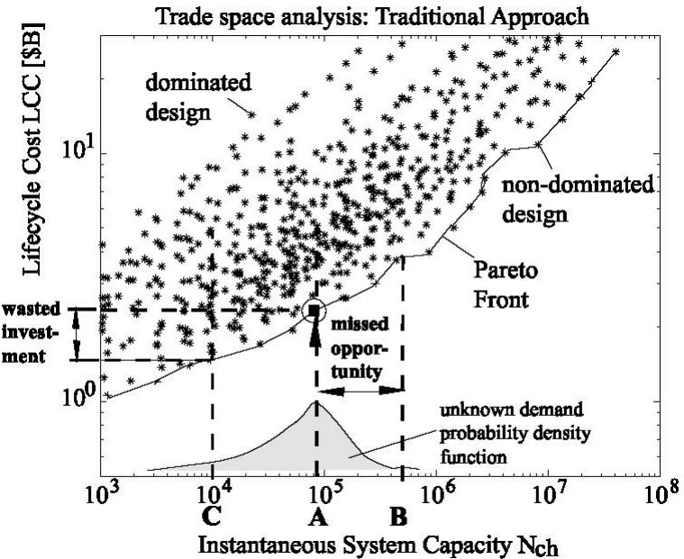  
Fig. 1 Trade space of 600 LEO constellation architectures.

Each asterisk in Fig. 1 corresponds to a particular LEO constellation design. The non-dominated designs approximate the Pareto front17 and are the most interesting, since they represent the best achievable tradeoff between capacity and life cycle cost. For a target capacity $\mathrm { N _ { c h } = 8 6 , 0 0 0 ~ ( s c e n a r i o }$ A) we find the intercept of the vertical dashed line and the Pareto front. The design $\bar { \mathbf { x } } ^ { t r a d } \bar { \mathbf { \Sigma } } = \mathbf { x } _ { 1 8 4 } = [ 8 0 0 , 5 , 6 0 0 , 2 . 5 , 1 ]$ is the best choice for this requirement and the simulator predicts a capacity, $\mathrm { N _ { c h } } = 8 0 , 7 1 3$ and life cycle cost $\angle C C = 2 . 3 3 ~ [ \mathbb { S } \mathrm { B } ]$ (with $r = 0 )$ for this solution. Note that this constellation is quite similar to Iridium, $\mathbf { x } _ { I r i d i u m } = [ 7 8 0 , 8 . 2 , 4 0 0 , 1 . 5 , 1 ]$ . Satellite Constellation $\mathbf { X } _ { 1 8 4 }$ has 5 circular polar orbits at an altitude of $h = 8 0 0 ~ [ \mathrm { k m } ]$ and a minimum elevation angle of $\varepsilon = 5$ . The 50 satellites have a transmitter power of $P _ { t } = 6 0 0 ~ [ \mathrm { W } ]$ , an antenna diameter of $D _ { A } = 2 . 5$ [m] and intersatellite links. This constellation has a capacity of $\mathrm { N _ { c h } } = 8 0 \mathrm { , } 7 1 3$ channels and an expected life cycle cost of $\angle C C = 2 . 3 3 ~ [ \mathbb { S } \mathbf { B } ]$

In the traditional approach one would select this design and implement the constellation accordingly, see Fig. 2. The traditional approach for selecting architectures (designs) thus implies designing for a fixed target capacity. When demand is uncertain, this required capacity can be difficult to estimate and the risks can be significant. In reality, future demand should be described by a (unknown) probability density function.

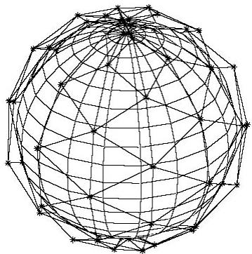  
Fig. 2 Satellite constellation x184 – optimized for a fixed capacity of 80, 713 channels.

Consider scenario B in Fig. 1. If the actual demand is larger than that of the nominal scenario A, requiring a capacity $N _ { c h }$ on the order $5 \cdot 1 0 ^ { 5 }$ , there will be a missed opportunity. The chosen system, $\mathbf { x } ^ { t r a d } = \mathbf { x } _ { 1 8 4 }$ will be saturated and cannot satisfy the excess demand estimated at 14.72 million users. Competitors will gladly fill the gap.

A more serious situation is scenario C in Fig. 1, where significant excess capacity is available in the system. In that case (see Iridium, Globalstar) the revenue stream may not be sufficient to recuperate the initial investment. If the actual market is only, $N _ { u s e r } \approx 3 5 0 \textcircled { , } 0 0 0$ instead of the 3 million expected, a capacity of $N _ { c h } \approx 1 0 \small { , } 0 0 0$ would have sufficed to provide service. The difference in life cycle cost between $\mathbf { x } ^ { t r a d } = \mathbf { x } _ { 1 8 4 }$ and the most affordable low capacity system $\mathbf { x } _ { 3 4 } = [ 8 0 0 , 5 , 2 0 0 , 1 . 5 , 1 ]$ with a capacity of $N _ { c h } , \ _ { 3 4 } = 9 , 6 9 2$ and life cycle cost of $L C C _ { 3 4 } = 1 . 4 7 ~ [ \mathbb { S } \mathrm { B } ]$ is \$860 million. This must be viewed as a wasted investment into architecture $\mathbf { X } _ { 1 8 4 }$ . Ideally, one would want the ability to adjust the capacity of the system to the evolving demand. This is the main subject of this article.

## Flexible Approach

This article introduces a staged deployment approach for designing constellations of communications satellites in order to reduce the economic risks. Staged deployment is a particular way of introducing flexibility in a system. It reduces the economic risks of a project by deploying it progressively, starting with a smaller and more affordable capacity than the one required by the traditional approach. When there is enough money to increase the capacity or if demand for the service exceeds the current capacity, the system is upgraded to a new stage with a higher capacity. This approach does not design for a target capacity but tries to find an initial architecture that will give system managers the flexibility to adapt to market conditions. This, however, poses new challenges to designers. A first issue is that the possible evolutions from an initial architecture to higher capacity ones have to be identified and understood. An ideal staged deployment would follow the Pareto front of Fig. 1. This, however, is not necessarily feasible. Fundamentally this is true because staged deployment implies the use of legacy components (the previously deployed stages), which reduces the number of design degrees of freedom in subsequent stages of the system. Consequently, the structure of the trade space and the relationship between architectures has to be clearly defined and modeled. A second issue is that the price to pay to embed flexibility into the design is not easily determined. The reason is that the technologies involved may not be known or accurately modeled. A last issue is that the requirements are not an expected level of demand that is fixed through time but an uncertain demand. This uncertainty has to be modeled and integrated in the design process. This marks a distinct departure from the traditional approach because market conditions are directly taken into account by designers. The key idea is to consider the ability to stage deploy in the future as a “Real Option.”

## Literature Review

## Economics of constellations of communications satellites

The technical principles of communications satellites are relatively well known and are presented by Lutz, Werner, and Jahn,2 among others. To compare the performances of constellations with different architectures, Gumbert5 and Violet6 developed a “cost per billable minute” metric. Six mobile satellite telephone systems were analyzed with this metric.7 The set of systems studied contained LEO, MEO, GEO and elliptical orbit systems. A methodology called the Generalized Information Network Analysis (GINA) was developed by Shaw, Hastings, and $\mathrm { M i l l e r } ^ { 8 }$ to assess the performance of distributed satellite systems. GINA was applied to broadband satellite systems and is being extended to evaluate scientific missions. Jilla9 refined the GINA methodology to account for multidisciplinary design optimization (MDO) and proposed a case study for broadband communications satellites. Kashitani10 proposed an analysis methodology for broadband satellite networks based on the works of Shaw and Jilla. The study compared LEO, MEO and elliptic systems and showed that the best architecture depends on customer demand levels. An architectural trade methodology has been developed by de Weck and Chang3 for the particular case of LEO communication systems. The simulator implemented by de Weck and Chang has been used to generate the results shown in Fig. 1.

## Flexibility in space systems

The vast majority of space systems are designed without any consideration of flexibility. One of the main reasons is that operations in space are difficult and expensive. Also, it is difficult to convince designers to incorporate flexibility when the requirement for it cannot absolutely be proven a priori. Moreover, it must be said that flexibility is not for free and that various forms of upfront performance, mass, reliability and cost penalties must often be accepted in order to embed flexibility in a complex, technical system. Saleh11 and Lamassoure12 studied onorbit servicing for satellites and the potential economic opportunity it might represent. On-orbit servicing provides the flexibility to increase the lifetime of the satellites or to upgrade their capabilities. Lamassoure proposed to consider the decision of using on-orbit servicing as a real option.

## Staged deployment for space systems

Staging the deployment of a space system to reduce the economic and technological risks has been envisioned for both military and scientific missions. Miller, Sedwick, and Hartman13 studied the possibility of deploying distributed satellite sparse apertures in a staged manner. The first stage serves as a technology demonstrator. Additional satellites are added to increase the capability of the system when desired. The Pentagon also plans to deploy space-based radars (SBR) in a staged manner.14 A first SBR constellation will be launched in 2012, but will not provide full coverage. This will allow the tracking of moving targets in uncrowded areas. To enhance the capability of this constellation, a second set of satellites could be launched in 2015, “as-needed and as-afforded.” The Orbcomm constellation is an example of a constellation of communications satellites that was deployed in a staged manner. A short history of this system is presented by Lutz, Werner, and Jahn.2 The Orbcomm constellation started its service even though not all of its satellites were deployed. Satellites were added through time, in accordance with a predefined schedule. The advantage of this approach is that the system started to generate revenue very early. However, decision makers did not take into account the evolution of the market and did not adapt their deployment strategy accordingly.

Kashitani10 compared the performances of systems in LEO and MEO orbit and their behavior with respect to different levels of demand. His conclusion was that elliptical systems were more likely to adapt to market fluctuations because they could adjust their capacity by deploying sub-constellations. Having the ability to add “layers” to a constellation with sub-constellations could enable an efficient staged deployment strategy.

## Staged deployment in other domains

The staged deployment strategy has been considered in different domains. Ramirez15 studied the value of staged deployment for Bogota's water-supply system. Three valuation frameworks were compared: net present value (NPV), decision analysis (DA) and real options analysis (ROA). The flexible approach allowed a decrease in the expected life cycle costs of the system. Takeuchi et al.16 proposed to build the International Fusion Materials Irradiation Facility (IFMIF) in a staged manner. The full performance of the facility is then achieved gradually in three phases. The claim is that this approach reduces the overall costs for IFMIF from M \$797.2 to M \$487.8.

## Staged Deployment Strategy

## Economic Opportunity

Embedding flexibility in a system allows the existence of decision points through time. At a decision point, the values of parameters that were uncertain are analyzed. Depending on these values, a decision is made to adapt to them in the best possible manner. Since uncertain parameters are observed through time, uncertainty is reduced, thus reducing the risks of the project.

Decisions can be of various types, ranging from extending the life of a project to canceling its deployment. This article focuses on the flexibility provided by staged deployment when demand is the uncertain parameter. The decision in this case is about whether or not to move to the next stage in the deployment process. This approach represents an economic opportunity compared to the traditional way of designing systems because it takes current market conditions into account. Two mechanisms explain this advantage. The staged deployment strategy tries to minimize the initial deployment costs by deploying an affordable system but the expenditures associated with transition between two stages can be large. However, since those expenditures are pushed towards future times, they are discounted. Indeed, if r is the discount rate, Q the cost for deploying a new stage and t the number of years between the initial deployment of the system and the time the new stage is deployed, the present value (PV) of the cost considered is given by Eq. (2)

$$
P V (Q) = \frac {Q}{(1 + r) ^ {t}}\tag{2}
$$

The higher t is, the smaller the cost for deploying a new stage is in terms of present value. Consequently, the first economic advantage of staged deployment is that it spreads expenditures in time.

† The second mechanism is that the stages are deployed with respect to market conditions. If the market conditions are unfavorable, there is no need to deploy additional capacity. Expenditures are kept low to avoid economic failure. On the other hand, if demand is large enough and revenues realized are sufficient, the capacity can be increased. The economic risks are considerably decreased with this approach since stages can be deployed as soon as they can be afforded and when the market conditions are good.

## Paths of Architectures

The flexible approach implies that elements of the system can be modified after initial deployment. This concept can still be represented in a trade space such as the one of Fig. 1. With the traditional approach, architectures were considered “fixed” that is to say that their design vector, x, could not evolve after the initial deployment of the system. With staged deployment, evolutions of those variables are allowed. For technical or physical reasons, certain design variables of a system may not be changed after its deployment. This motivates a decomposition of the design vector into two parts [see Eq. (3)]

1) ${ \bf { X } } _ { f l e x }$ gathers all the design variables that are allowed to change after the deployment of the system. Those design variables are the ones that provide flexibility to the system.

$2 ) \quad \mathbf { x } _ { \mathrm { b a s e } }$ represents all the design variables that cannot be modified after the deployment of the system. Those design variables thus represent the common base that the stages will share.

$$
x = \left[ \frac {x _ {f l e x}}{x _ {b a s e}} \right]\tag{3}
$$

The deployment of a new stage will be reflected by a change in $\mathbf { x } _ { f l e x } .$ This implies that a staged deployment strategy will move from architecture to architecture in the trade space as new stages are deployed. The evolutions † that are of interest increase the capacity of the system. These “paths of architectures” can be notionally represented in the original trade space such as the one represented in Fig. 3.

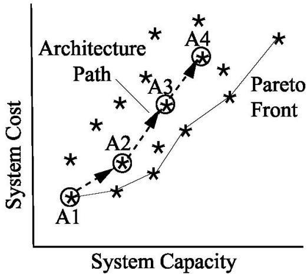  
Fig. 3 Example of a path of architectures in a Trade Space. The series of architectures $( \mathbf { A } _ { 1 } {  } \mathbf { \Delta } \mathbf { A } _ { 2 } {  } \mathbf { A } _ { 3 } {  } \mathbf { A } _ { 4 } )$ represents a valid path. In order to be valid all four architectures have to share the same sub-vector $\mathbf { X } _ { b a s e . }$

The life cycle cost of a staged deployed system, however, does not correspond to the sum of the pro-rated LCC of the individual systems $\mathbf { A } _ { 1 }$ through $\mathbf { A } _ { 4 } .$ . This will be discussed further. The selection of a system differs from the traditional approach with staged deployment. Instead of a fixed architecture one selects an architectural path, and most importantly the initial stage, $\mathbf { A } _ { 1 }$ . Whether or not the architecture path is actually followed, depends on the evolution of uncertain parameters over time as well as the decisions made by system managers

## Identifying Sources of Flexibility

Potential sources of flexibility must first be identified, by selecting the elements of the design sub-vector, ${ \bf { X } } _ { f l e x } ,$ as well as their range (or \`\`bandwidth”) of flexibility. This was applied to the case of LEO constellations with the aforementioned design vector, $\mathbf { x } = [ \mathrm { h } , \varepsilon , P t , D _ { A } , I S L ]$ and the allowable values shown in Table 1.

On-orbit modification of satellites is virtually impossible, even though there is increasing interest in reconfigurable spacecraft. On-orbit servicing is not yet sufficiently developed to consider satellite hardware modification or swap-out. Consequently, design variables such as $P _ { t } , D _ { A } ,$ or ISL have to be considered fixed. These three design variables define the individual satellite design. An advantage of keeping the satellites identical across stages are manufacturing economies of scale and learning curve savings.

The remaining design variables are h and $\varepsilon _ { \ast }$ they drive the constellation arrangement.18 The altitude h can be changed after the satellites are deployed because it does not necessitate any changes in the hardware of the system. This will, however require carrying additional fuel and phased array antennas in order to adjust the size and shape of the beam pattern at various altitudes. These two variables form ${ \bf { X } } _ { f l e x }$ and we may write:

$$
x = \left[ \frac {x _ {f l e x}}{x _ {b a s e}} \right] = \left[ \underbrace {h \varepsilon} _ {x _ {f k e x}} \quad \underbrace {P _ {t} D _ {A} I S L} _ {x _ {b a s e}} \right] ^ {T}\tag{4}
$$

An example of a path in the trade space is given in Fig. 4. Note that all satellites in stages 1, 2, and $^ 3$ are identical: $\mathbf { x } _ { b a s e } = [ P _ { t } , D _ { A } , I S L ] = [ 2 0 0 , 0 . 5 , 1 ]$ . The minimum elevation angle is held constant at $\varepsilon = 5$ . Here, $C a p =$ $N _ { u s e r }$ † is used as capacity, rather than the number of channels, $N _ { c h } . \ N _ { u s e r }$ can be solved from Eq. (1) and is more convenient to use as a capacity metric from here on out, since it can directly be related to the uncertain market demand.

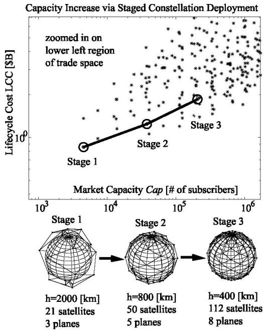  
Fig. 4 Staged deployment path at the low capacity end of the trade space.

It can be noted that the number of satellites increases with each additional stage. Also, Stage 1 is non-dominated and corresponds to design vector $\mathbf { X } _ { 1 }$ in the trade space, however, the system becomes “suboptimal” as it grows, i.e. its distance from the Pareto front grows. There also exist paths that start sub-optimal and become more optimal as the system grows. Moreover, as h or are modified, the configuration of the satellites in the system changes. Consequently, the staged deployment strategy consists of two parts: the launch of additional satellites and the reconfiguration of on-orbit satellites from the previous stage to form a new constellation. The flexibility that has to be brought to the system is thus the ability to add satellites and to move on-orbit satellites to increase the capacity. The technical feasibility, astrophysical constraints and optimization of such maneuvers are currently under investigation. It is important to know if this flexibility can indeed reduce the economic risk compared to the traditional approach, even if an upfront penalty (e.g. extra fuel) must be incurred. This means that the value of this flexibility has to be estimated. Real Options Analysis (ROA) is helpful in this context, since it can provide the value of flexibility without having to consider the technical details of how to embed it.

## Real Options Analysis

A real option is a technical element embedded initially into a design that gives the right but not the obligation to decision makers to react to uncertain conditions. In this study, it is considered that flexibility is provided by real options that give the ability to change h and after a constellation is deployed. Therefore, the real options give the opportunity to reconfigure constellations after they have been deployed. The key technical elements of the real option are additional propellant and phased array antennas for beam pattern tuning. Consequently, there exist different technical solutions to embed this flexibility. However, they will not be considered in the first phase of the approach. Indeed, the real options approach allows designers to focus on the value of flexibility without having any technical knowledge of the way to embed it. It is assumed that it is feasible to embed this flexibility and the price to pay for it is neglected initially. From there, the cost of a flexible system that can adapt to an uncertain environment is compared to the life cycle cost of the best traditional system, xtrad. The difference between those costs will define the value of flexibility. If the life cycle costs of the flexible approach are smaller than the life cycle costs obtained with the traditional approach, an economic opportunity is revealed and the difference between those costs defines a maximum price one would be willing to pay to embed flexibility. From there, technical ways to implement those real options could be sought, priced and compared with this maximum price. On the other hand, if the flexible solution does not present any value, then other sources of flexibility should be envisioned. The steps of this approach are summarized in Fig. 5.

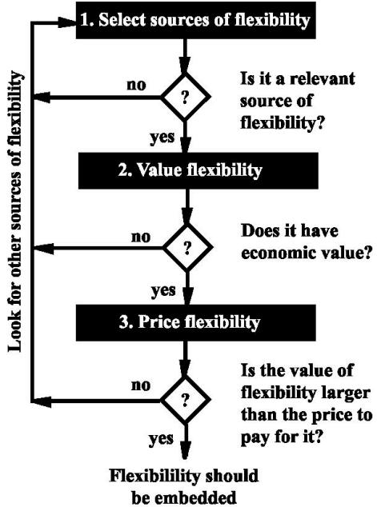  
Fig. 5 General real options for reasoning framework.

This article only focuses on the first two steps of the framework. The identification and selection of sources of flexibility has already been discussed. The valuation methodology for a staged deployment strategy will be discussed in the next section. None of these steps consider detailed technical ways of embedding the real options. For satellite constellation reconfiguration, these aspects are being addressed by Scialom and will be discussed in the future.19 The main interest of this methodology is that it can prevent seeking technical solutions that provide flexibility without economic value. On the other hand, if an economic opportunity is revealed for a particular type of flexibility, it can motivate research into new technical solutions

## Flexibility Valuation Framework

## Assumptions

To find the best staged deployment strategy, a framework has been developed to seek paths of architectures with the greatest values. This framework implicitly assumes that a simulator exists that achieves a mapping between x and system capacity, $C a p ,$ and life cycle cost, $L C C . ^ { 3 }$ Moreover, the sources of flexibility should already have been identified through partitioning of the design vector, see Eq. (4).

Flexibility has value in the presence of uncertainty. In this study, the uncertain parameter is demand. Several assumptions were made. First, the system should be able to provide service for a certain maximum, target demand. This means that a targeted capacity $C a p _ { m a x }$ is set and that a path can be considered if and only if at least one of the architectures in the path has a capacity higher or equal to $C a p _ { m a x }$ . This assumption sets constraints on the paths to consider but also defines the traditional design with which the final solution is going to be compared with, $\mathbf { x } ^ { t r a d } .$

A second assumption is that the flexible system tries to adapt to demand. As soon as demand is higher than the current capacity, the next stage of the system is deployed. This can be represented by a decision tree.20 This assumption is natural for systems that provide a service without trying to generate profits. For instance, for a water supply system, it is vital that the system adapts to demand. A third assumption is that the price to embed flexibility into existing designs is not taken into account. This is because the value of a real option is considered first, and not its price. A last assumption is that demand follows a geometric Brownian motion, which is represented as a binomial model in discretized time. This assumption will be explained in the presentation of the model for demand.

The organization of the flexibility valuation framework for staged deployment has been summarized in Fig. 8. This section will present each step of the process.

## Definition of Parameters

The maximum achievable capacity that the system should provide, $C a p _ { m a x }$ should be defined. In this study, the capacity corresponds to a certain number of users, $N _ { u s e r } $ , to which the system can ultimately provide service. $C a p _ { m a x }$ is usually only achieved after a number of stages. A minimum capacity, $C a p _ { m i n } ,$ can also be defined. This is a conservative lower bound on the capacity that will certainly be needed. A path of architectures can be selected if and only if the smallest capacity it provides (given by the first architecture) is higher than $C a p _ { m i n }$ and the highest capacity it can provide (given by the last architecture) is higher than $C a p _ { m a x } .$ These considerations will thus reduce the number of paths to consider. The discount rate, r, also has to be set as well as several parameters that allow modeling the demand: $\mu ,$ , $\Delta _ { t } ,$ and $D _ { i n i t i a l }$ . Finally, the total lifetime of the system considered, $T _ { s y s } ,$ has to be defined.

## Best Traditional Architecture, $\mathbf { x } ^ { t r a d }$

The framework compares the staged deployment strategy with the traditional approach as explained above. The traditional approach will select the non-dominated architecture that is closest to $C a p _ { m a x } ,$ but generally with a slightly higher capacity. The first step of the framework is to determine this architecture denoted $\textbf { X } ^ { t r \bar { a } d }$ as discussed earlier in the article. The life cycle cost of this architecture is $L C C ( \mathbf { x } ^ { t r a d } )$ and it will eventually be compared with the life cycle cost of the best path. If the Pareto front is already known, xtrad can be easily obtained. Otherwise, an optimization algorithm9 can determine $\textbf { X } ^ { t r a d }$ by searching for the architecture with minimal life cycle costs among the architectures with a capacity greater than $C a p _ { m a x } .$

## Identification of the Feasible Paths

From the decomposition of the design vector presented in Eq. (3), paths of architectures can be generated.20 These need to satisfy certain conditions. First, it is assumed that the deployment of a new stage always implies an increase in system capacity. A better way to adapt would be to increase or decrease capacity to get as close as possible to the actual demand (with some safety margin). The systems concerned by this research, however, are large capacity systems with low operations costs relative to the initial deployment (investment) cost. In this situation, decreasing the capacity does not present any value since the reduction of the operations costs expected may be smaller than the investments necessary to decrease capacity. This is in contrast with capacity adaptation in the airline industry, where operations costs are a major concern, where the Cash Airplane Related Operating Costs (CAROC) represent 60% of the operating budget. In that case the decommissioning of assets during low demand periods can be beneficial. The expense of operating a reliable satellite constellation with 21 satellites is not too different from operating one with 50 satellites. Consequently, it is assumed that the capacity of the system increases as new stages are deployed. A second condition that paths need to meet is that the initial capacity of the path is higher than $C a p _ { m i n }$ and that the last architecture has a capacity higher than $C a p _ { m a x }$ . The details of finding feasible paths, starting from a family of architectures that share a common $\mathbf { X } _ { b a s e }$ are discussed by Chaize.20

## Modeling of Demand Uncertainty

To represent the uncertainty in the size of the market and its evolution, it is assumed that demand follows a geometric Brownian motion. This assumption is commonly used in the financial domain to model the price of a stock, S. The discrete-time version of this model is given by the following equation:

$$
\frac {\Delta S}{S} = \mu \Delta t + \sigma \Gamma \sqrt {\Delta t}\tag{5}
$$

S represents the current stock price, G is a random variable with a standardized normal distribution and $\Delta t$ the time step of the discretization. Consequently, $\frac { \Delta S } { S }$ represents the rate of change of the stock price during a small interval of time Dt. $\mu$ and are constants in this formula. Their meaning can be understood with simple mathematical considerations. The expected value and the variance of the rate of change of S are:

$$
E \left[ \frac {\Delta S}{S} \right] = \mu \Delta t\tag{6}
$$

$$
v a r \left(\frac {\Delta S}{S}\right) = \sigma^ {2} \Delta t\tag{7}
$$

Consequently, if the current value of the stock is S, the expected variation of it in the time interval Dt is $\mu S \Delta t .$ Therefore, $\mu$ is the expected return per unit time on the stock, expressed in a decimal form. It can also be noted that $\sigma ^ { 2 }$ †  is the variance rate of the relative change in the stock price, whereby is usually called the volatility of the stock price. The volatility, $\sigma ,$ “scales” uncertainty in future prices. Moreover, the bigger the time step considered is, the bigger the variance of the relative change in stock prices will be. This mathematical property reflects the fact that uncertainty increases with a receding time horizon.

The Wiener model involves random variables, consequently a common method consists in running a Monte-Carlo simulation over the price of the stock (here the demand, $N _ { u s e r } ( t )$ replaces S). Figure 6 shows an example of such a demand simulation. The starting demand is 50,000 subscribers (similar to Iridium in 1999). In the first two years the demand remains flat. Two sharp increases in demand in years 3 and 10 could potentially trigger deployment of additional stages.

Using Monte Carlo simulation, there is an infinite number of potential future demand scenarios to consider. When the time intervals considered are big enough, however, a binomial model can be used as a time discrete representation of the stock price. The binomial model simplifies the Wiener model by stating that the stock price S can only move up or down during an interval of time leading to a new price Su or Sd. There is a probability p to move up and a probability $1 \textrm { - } p$ to move down. To be consistent with the Wiener model, this representation needs to provide the same expected return and variance when Dt approaches zero. $\mathrm { H u l l } ^ { 2 1 }$ demonstrates that it can be achieved by setting $p , u ,$ and d in the following manner:

$$
u = e ^ {\sigma \sqrt {\Delta t}}\tag{8}
$$

$$
d = \frac {1}{u}\tag{9}
$$

$$
p = \frac {e ^ {u \Delta t} - d}{u - d}\tag{10}
$$

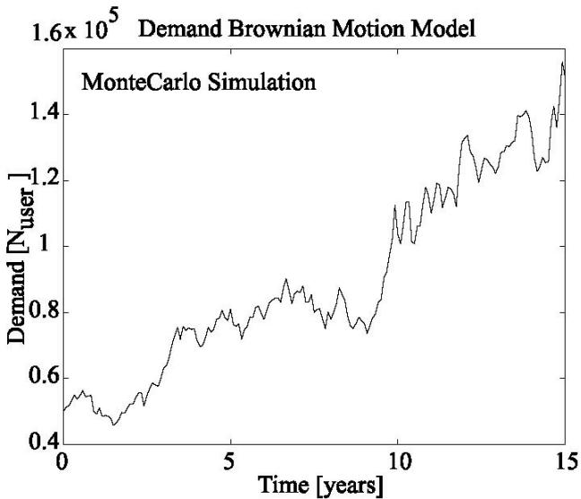  
Fig. 6 Wiener stochastic demand model with $\mathrm { \bf ~ S } \left( \bf 0 \right) = { \bf D } _ { i n i t i a l } = 5 0 , 0 0 0$ $\pmb { \mu } = \mathbf { 0 . 0 8 }$ ,  = 0.4 (per annum), and $\pmb { \Delta } t = 1$ month. System lifetime, $\mathbf { T } _ { s y s }$ is 15 years.

When used over many periods, the binomial model provides a tree for the price of the stock. The binomial tree can also be used to represent the potential evolutions of the level of demand over time. To do so, the lifetime of the system needs to be divided into a certain number of time intervals, and need to be defined and an initial value for demand $D _ { i n i t i a l }$ has to be chosen. An example is given in Fig. 7.

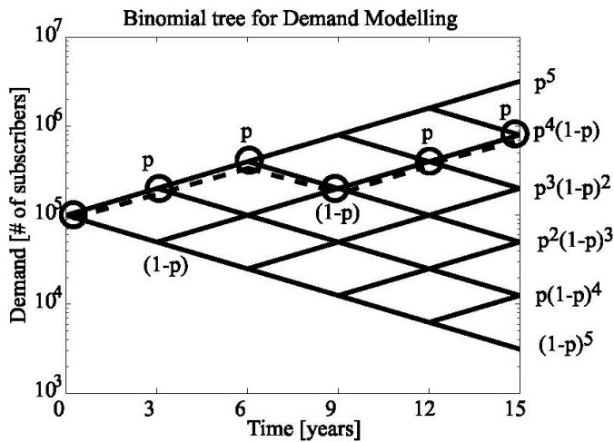  
Fig. 7 Example of one scenario out of $2 ^ { 5 } = 3 2$ in the binomial tree (n=5) for a 15-year lifetime with 3-year intervals.

In a binomial tree, a particular series of up and down movements will be called a scenario. An example of a scenario has been represented in Fig. 7. The set of all the possible scenarios will be noted as D. If there are n periods, a scenario will be a series of n up and down movements of demand. Consequently, there are $2 ^ { n }$ possible scenarios. Since the up and down movements are independent events in terms of probability, the probability of a scenario will be:

$$
P (s c e n a r i o) = p ^ {k} (1 - p) ^ {n - k}\tag{11}
$$

where p is the probability of going up [given by Eq. (10)] and k is the number of up movements in the scenario. To model uncertainty it is thus sufficient to know the set of all the possible scenarios D and their associated probabilities.

## Life Cycle Costs of Flexible Architectures

For a flexible architecture, the actual life cycle cost will depend on the evolution of demand and the resulting additional deployments. Different life cycle costs will therefore be obtained for each demand scenario. To compare a path of architectures with a traditional architecture, only one life cycle cost should be considered. To solve this issue, an average life cycle cost is defined for each feasible path of architectures based on the probabilities of the different scenarios; if LCC $\left( s _ { p a t h _ { j } } ^ { i } \right)$ is the life cycle cost of pathj for scenario $s ^ { i }$ then, the expected life cycle cost of this path is:

$$
E \Big [ L C C \Big (p a t h _ {j} \Big) \Big ] = \Sigma_ {i = 1} ^ {n} P \Big (s ^ {i} \Big) L C C \Big (s _ {p a t h _ {j}} ^ {i} \Big)\tag{12}
$$

Since an average value is considered, the results will have to be interpreted with caution. In particular, the fact that the average life cycle cost of a path is smaller than the life cycle cost of the optimal traditional design, $\textbf { X } ^ { t r a d }$ does † not imply that it is true for all possible demand scenarios. However, this framework always considers a worst-case situation for staged deployment since it is assumed that a new stage is deployed every time demand exceeds the capacity of the system. In reality, decision makers take into account other parameters than the level of demand and an increase in capacity will be decided only if it is judged profitable. Therefore, even though the life cycle costs can get higher than the traditional life cycle cost for certain demand scenarios, one has to keep in mind that in reality, the decision of deploy a next stage depends not only on the demand level at decision time. Moreover, if a deployment is decided, this implies that demand exceeded the capacity of the system and that there are a significant number of potential customers. Even though the deployment of a new stage implies a cost, the fact that the level of demand is large enough to warrant it, ensures that revenues will be significant too.

It is essential to understand how the life cycle costs of a path for a particular scenario of demand are computed. For a flexible system, three types of expenditures can be identified:

1) Initial development costs (IDC). This corresponds to the price of deploying the first constellation in the path, A1. Of course, these costs do not include the price of the real options considered since these have been neglected up to this point

2) Operations and maintenance costs (OM). These costs capture the operational costs of a deployed constellation, including orbital maintenance, servicing of ground stations as well as replenishment of failed satellites.

3) Evolution costs (DC). These correspond to the necessary investments to deploy the next stage of the path. For instance, in the case of LEO constellations, the deployment of a new stage will imply the manufacture and launch of new satellites. The costs associated with this evolution will thus be taken into account in DC.

Once IDC, OM, and DC are known for a path, the life cycle costs can be computed for a given scenario. These expenditures are spread over time according to certain principles and discounted to obtain their present value, see Eq. (2). In year one, the expenditures are IDC and OM. They correspond to the initial deployment of the system and the beginning of operations. Then, if no deployment decision is made, the additional costs are equal to OM for every subsequent year. When demand exceeds the current capacity of the system, a new stage is deployed. The additional costs are then equal to the evolution costs DC between the “old” and “new” architectures as well as the OM costs for that year. When the capacity is increased, OM generally has to be increased as well because the system gets larger and requires more maintenance and monitoring. Consequently, from the knowledge of IDC, OM, and $\Delta \mathrm { C } ,$ the life cycle costs of a path, given a particular demand scenario, can be computed.

## Comparison of the Traditional and the Flexible Approach

The average life cycle costs of the paths that satisfy the requirements are computed. The path that provides the minimum average life cycle cost is identified. This life cycle cost is denoted as $L C C ^ { * }$ and the optimal path is called path\*. From there, $L C \bar { C } ( \mathbf { x } ^ { t r a d } )$ and $L C C ^ { * }$ are compared. The difference between those two values reveals the magnitude of the economic opportunity associated with staged deployment.

The different steps of the flexibility valuation framework are summarized in Fig. 8. This framework has been applied to the particular context of reconfigurable constellations of communications satellites in LEO. The results obtained with this framework are presented in the next section.

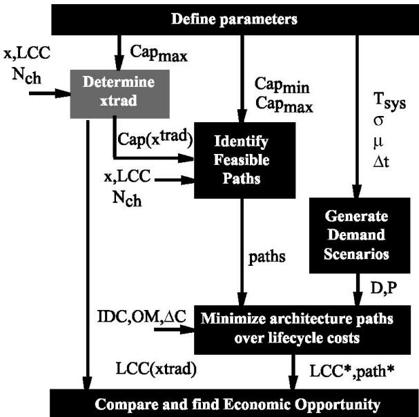  
Fig. 8 Flexible architecture valuation process for staged deployment.

## Case Study Results

## Presentation of the Case

The framework has been applied to the particular case of LEO constellations of communications satellites. It is assumed that real options are initially embedded in the design that allows constellations to be reconfigured after their initial deployment. This section presents a particular case study in which the size of the market considered is close to the one Iridium originally expected. However, the average life cycle costs obtained will not be compared with Iridium (ª5\$B) for two reasons. First, as explained by de Weck and Chang,3 $\because L C C$ is difficult to determine exactly. Moreover, according to the same study, the Iridium constellation is not Pareto optimal and the framework compares the staged deployment strategy with a best traditional design. Consequently, an architecture that is Pareto optimal and that can provide the same capacity as the Iridium constellation needs to be determined first. This architecture will then be compared to the relevant paths of architectures for different values of the discount rate r. The influence of r on the value of flexibility will then be analyzed. Initially the discount rate is set to r = 0.1 (nominal case).

## Determination of $\textbf { X } ^ { t r a d }$

The Iridium constellation was originally designed with a 10-year lifetime. $T _ { s y s }$ is thus set to 10 years. About 3 millions subscribers were expected, so $C a p _ { m a x }$ is set to $2 . 8 { \cdot } 1 0 ^ { 6 }$ subscribers. The best traditional architecture $\textbf { X } ^ { t r a d }$ can be determined from the trade space for these particular values as discussed in the introduction. This architecture is $\mathbf { x } ^ { t r a d } = \mathbf { x } _ { 1 8 4 } = [ 8 0 0 , 5 , 6 0 0 , 2 . 5 , 1 ]$ with a capacity, $N _ { c h } = 8 0 \AA \mathrm { , } 7 1 3$ , and discounted life cycle cost of $L C C { = } 2 . 0 1$ [\$B] (with $r { = } 1 0 \% )$ . Note that this constellation is shown in Fig. 2 and is quite similar to Iridium, $\mathbf { x } _ { I r i d i u m } = [ 7 8 0 , 8 . 2 , 4 0 0$ 1.5, 1]. This architecture has a “market” capacity of $C \bar { a p } ( { \bf x } ^ { t r a d } ) = 2 . 8 2 \cdot 1 0 ^ { 6 }$ subscribers. This particular architecture will be compared to the staged deployment strategy. Hence, demand scenarios need to be generated.

## Binomial Tree Demand Model

To generate the binomial tree, $D _ { i n i t i a l } , \mu , \sigma ,$ and Dt need to be defined. The time step Dt is set to 2 years. Consequently, decisions concerning the deployment of the constellation will be taken every two years. Moreover, the expected increase in demand per time unit is assumed constant. It is set to $\mu = 2 0 \%$ per year. The volatility is set to $\sigma = 7 0 \%$ . The parameter directly affects the span of the binomial tree. For values of smaller than 70%, the maximum demand that can be attained is smaller than $C a p _ { m a x }$ and the probability to have a demand higher than the one targeted is equal to zero. That is why is set to this particular value. The Iridium constellation only had 50000 subscribers after almost one year of service. This value will be considered for $D _ { i n i t i a l } .$ Also, the initial architectures are constrained to deliver a capacity at least equal to the initial demand and $C a p _ { m i n } = D _ { i n i t i a l } .$ From there, the binomial tree can be generated and the demand scenarios are obtained

## Value of Flexibility

The value of flexibility can a priori be defined as the discounted money saved compared to the traditional approach that is to say the difference between the life cycle cost of $\textbf { X } ^ { t r a d }$ with the average life cycle cost of the optimal path, $L C C ^ { * }$ . This difference is shown in Fig. 9.

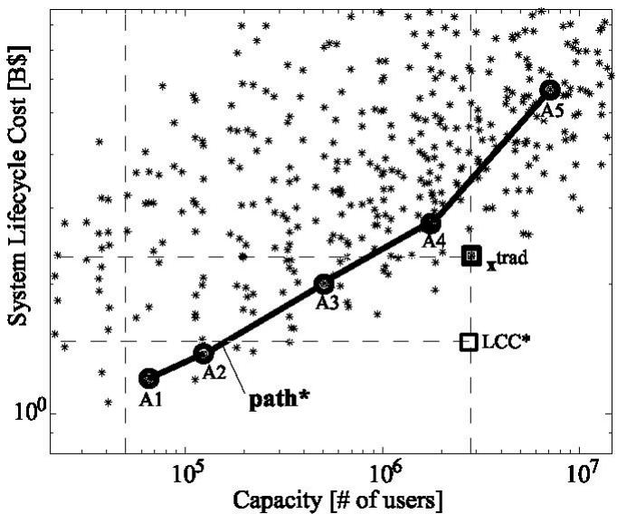  
Fig. 9 Difference between the life cycle cost of the optimal traditional design $\mathrm { ~ \bf ~ X ~ } ^ { t r a d }$ and the average life cycle cost of the optimal path LCC\*: $\mathrm { \bf A } _ { 1 } {  } \mathrm { \bf A } _ { 2 } {  } \mathrm { \bf A } _ { 3 } {  } \mathrm { \bf A } _ { 4 } {  } \mathrm { \bf A } _ { 5 } ,$

This difference is $L C C ( x ^ { t r a d } ) \cdot \mathrm { L C C } ( p a t h ^ { * } ) = 2 . 0 1 \cdot 1 . 4 6 = . 5 5$ [\$B]. This economic opportunity of nearly \$550 million represents a quarter of the life cycle cost of the traditional architecture. The key characteristics of the fixed traditional architecture and the optimal staged deployment path are shown in Table 2.

Table 2 Comparison of traditional architecture $\mathrm { ~ \bf ~ X ~ } ^ { t r a d }$ and optimal reconfiguration path, path\*.

<table><tr><td></td><td>#</td><td>h</td><td> $\varepsilon$ </td><td> $P_t$ </td><td> $D_A$ </td><td>ISL</td><td>Cap</td></tr><tr><td> $\mathbf{x}^{trad}$ </td><td>184</td><td>800</td><td>5</td><td>600</td><td>2.5</td><td>1</td><td>2.8E6</td></tr><tr><td> $A_1$ </td><td>32</td><td>1600</td><td>5</td><td>200</td><td>1.5</td><td>1</td><td>6.6E4</td></tr><tr><td> $A_2$ </td><td>33</td><td>1200</td><td>5</td><td>200</td><td>1.5</td><td>1</td><td>1.2E5</td></tr><tr><td> $A_3$ </td><td>38</td><td>1200</td><td>20</td><td>200</td><td>1.5</td><td>1</td><td>5.1E5</td></tr><tr><td> $A_4$ </td><td>39</td><td>800</td><td>20</td><td>200</td><td>1.5</td><td>1</td><td>1.8E6</td></tr><tr><td> $A_5$ </td><td>44</td><td>800</td><td>35</td><td>200</td><td>1.5</td><td>1</td><td>7.1E6</td></tr></table>

The optimal staged deployment path in terms of satellite constellations is shown in Fig. 10. Generally, the number of satellites increases with each stage. Interestingly, the optimization chooses satellites of relatively low capability (e.g. small transmitter power, $P _ { t } = 2 0 0 [ \mathrm { W } ] )$ relative to other choices in the design space. It appears to be better to launch a set of small, light weight, affordable satellites and to add more of them as needed, rather than deploying a constellation with few, high-powered $( { \mathrm { e . g . ~ } } P _ { t } = 1 , 8 0 0 ~ [ \mathrm { W } ] )$ , heavy satellites. This supports the arguments of those who claim that “swarms” of smaller satellites provide more flexibility than constellations with few, extremely capable satellites. It is noteworthy that not every stage transition requires an altitude change. Most reconfigurations require plane changes, but not all of them, e.g. for $A _ { 1 }  A _ { 2 }$ both constellations have four (4) planes. This information provides the basis for optimizing the constellation reconfiguration process and for estimating the amount of extra fuel to carry onboard the satellites.19

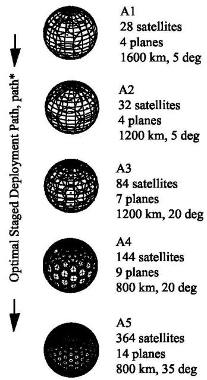  
Fig. 10 Optimal staged deployment path, $p a t h ^ { * }$ for a discount rate of $r = 1 0 \%$

## Influence of the Discount Rate r

The value of flexibility and the optimal path, $p a t h ^ { * }$ , may change for different values of the discount rate, r. To gauge the effect of the discount rate it is necessary to scale the value of flexibility with respect to the life cycle cost of the traditional design. Consequently, the value of flexibility will be computed as the percentage of money saved with respect to the traditional approach:

$$
\text { Value } = \frac {L C C \left(x ^ {\text { trad }}\right) - L C C \left(\text { path } *\right)}{L C C \left(x ^ {\text { trad }}\right)}\tag{13}
$$

To study the influence of the discount rate on the economic opportunity of staged deployment, an optimization is run over the paths of architectures for values of r ranging from $0 \%$ to 100% with a step of 5%. For each value of the discount rate, the optimal path is obtained as well as the value of flexibility associated with it. The results obtained are presented in Fig. 11.

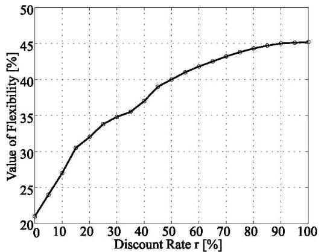  
Fig. 11 Value of flexibility in % of money saved with respect to r.

It can be seen that the value of flexibility increases with the discount rate. The reason is that the higher r is, the less expensive the deployment of additional stages appears in terms of net present value and the more valuable it is. This is the first mechanism that justifies the value of flexibility.

Surprisingly, for a discount rate equal to zero, the staged deployment strategy still presents an economic value. The reason is that average life cycle costs are considered. Consequently, for certain demand scenarios, a reconfiguration may not be necessary and the life cycle costs corresponding to the initial architecture, $A _ { 1 } ,$ are typically smaller than the life cycle cost of the traditional architecture, $\stackrel { \cdot } { \mathbf { x } } ^ { t r a d }$ . However, even though the average life cycle cost considered are smaller than $L C C ( { \bf x } ^ { t r a d } )$ , the actual life cycle costs during the life of the system may be higher for certain demand scenarios. This does not imply that flexibility has no value in this case. Indeed, the framework considers a worst case scenario for staged deployment that is to say that adaptation to demand is done whenever possible. In reality, the decision of increasing the capacity depends on other factors, in particular the availability of money to achieve the evolution. Consequently, even though the staged deployment solution could ultimately reveal to be more expensive for a discount rate of 0% and a significant increase in demand, it should be kept in mind that the decision to deploy the next architecture belongs to the managers and is not an automatic process.

Also, the value of flexibility can be over 30%, which is a significant value. Moreover, this is an average value, which means that for situations where demand does not grow, the economic risk is lowered at least by 30%. This article does not claim that Iridium could have avoided bankruptcy by applying staged deployment, since low market demand was a consequence of competing terrestrial networks - a fact that would have been unaltered by staged deployment. Rather, the claim is that the economic risk could have been reduced by an amount close to 30% (roughly \$1.8B out of the total loss of \$5.5B) with a staged deployment strategy. This, however, must be further substantiated, since the price of technically embedding flexibility (additional fuel, reconfigurable electronics, radiation hardening for higher orbital altitudes) must be subtracted from the difference in life cycle cost computed in Eq. (13).

For high discount rates, the curve flattens out. Even though the value of flexibility increases with the discount rate, it cannot go over a certain limit. Indeed, since the architectures considered are constrained to provide an initial capacity at least equal to $C a p _ { m i n } = D _ { i n i t i a l } ,$ the life cycle costs of the paths will always be greater or equal to the life cycle cost of the Pareto optimal architecture that provides a capacity greater than $D _ { i n i t i a l }$ . Consequently, there is always an asymptote for the value of flexibility created by staged deployment.

## Conclusions

## Value of Staged Deployment

This paper demonstrates the value of staged deployment for LEO constellations of communications satellites. In particular, a case study revealed how this strategy could lower the life cycle costs of Iridium-like systems by more than 20%. This is achieved by spreading the cost of adding more capacity over time and by giving system managers the flexibility to adapt system capacity to the unfolding market demand. This approach asks designers of communications systems to think differently about the trade space. Indeed, it proposes to seek “paths of architectures” in the trade space rather than Pareto optimal architectures. Moreover, it takes into account technical data and a probabilistic representation of demand through time. Consequently, the staged deployment strategy represents a real challenge for designers. It does not ask them to design a fixed system from a specific set of requirements, a well accepted practice, but to design a flexible system that can adapt to highly uncertain market conditions. It may be hypothesized that the success of terrestrial cellular networks in the 1990s can be attributed, at least in part, to staged deployment, where revenues from initial high-demand areas were used to gradually increase capacity and coverage. The contribution of this article is to present such an approach and methodology for spacebased communications systems.

Due to launch requirements, the flexibility needs to be embedded before the deployment of the system. This implies that a real options thinking is adopted. Real options are not necessarily used after the deployment of the system. Designing elements into a system that may not be used conflicts with established practices in engineering. In conclusion, designers will need to understand the value of designing a system with real options and decision makers should seek to quantify the value of investing in such flexibility.

The principles of the approach presented in this paper go beyond satellite constellations. The general framework can be applied to systems with similar characteristics. Future studies could focus on the value of staged deployment for different systems facing a high uncertainty in future demand with important non-recurring costs. If economic opportunities are revealed, such studies could motivate the search for innovative, flexibility-enabling technical solutions.

## Future Work: Orbital Reconfiguration

Orbital reconfiguration has revealed itself as valuable for constellations of satellites. To determine if orbital reconfigurations, such as the ones required by the path shown in Fig. 10, are feasible with onboard propellant or other means, the flexibility will have to be priced. Optimization of satellite constellation reconfiguration is therefore becoming an important, if poorly explored, research topic.19 Other issues will have to be studied. Indeed, if the altitude of the satellites is changed, the hardware of the satellites requires modifications. To produce a particular beam pattern on the ground, the characteristics of the antenna vary with the altitude of the satellites. Reconfiguration within the satellites themselves will thus have to be considered in more detail. Actually, significant interest now exists for intra-satellite flexibility (within a single spacecraft) and this topic may reveal more challenging technically. This article, on the other hand, focused on inter-satellite flexibility.

## Other Opportunities for Satellite Constellations

The flexibility that was studied concerned a possible increase of the capacity of a constellation. It would be interesting to study the value of having the flexibility to change the functionality of the constellations, i.e. the type of service offered (voice, data, internet connectivity/IP, paging, multimedia, Earth observation...) and to develop a similar framework for this purpose. Indeed, the Iridium constellation was designed primarily for mobile telephone communications at a data rate of 4.8Kbps per duplex channel. If it had possessed the flexibility to change its perchannel bandwidth or modulation, it might have provided a different type of service and attracted new revenue streams.

If orbital reconfiguration appears too expensive due to excessive DV (fuel) for plane and altitude changes, another type of constellations could be considered to achieve staged deployment. For instance, hybrid constellations that consist of multiple layers of satellites at different altitudes could be envisioned. Those constellations could be deployed in a staged manner, one layer at a time. Moreover, elliptical layers or those with resonant orbits could be deployed to increase the capacity only for certain parts of the globe, thus adapting to the variations in the geographic distribution (latitude and longitude) of demand.

## Acknowledgments

This research was supported by the Alfred P. Sloan Foundation under grant number 2000-10-20. The grant is administered by Prof. Richard de Neufville and Dr. Joel Cutcher-Gershenfeld of the MIT Engineering Systems Division with Mrs. Ann Tremelling serving as fiscal officer. Dr. Gail Pesyna from the Sloan Foundation is serving as the technical monitor. Mr. Darren Chang was helpful in understanding the LEO constellation simulator used in this study.

## References

1Ciesluk, W. J., Gaffney, L. M., Hulkover, N. D., Klein, L., Olivier, P. A., Pavloff, M. S., Pomponi, R. A., and Welch, W. A, “An Evaluation of Selected Mobile Satellite Communications Systems and their Environment,” MITRE Corporation, ESA contract 92BOOOOO60, April 1992.

2Lutz, E., Werner, M., and Jahn, A., Satellite Systems for Personal and Broadband Communications, Springer, Berlin, Germany, 2000.

3de Weck, O. L., and Chang, D. D., “Architecture Trade Methodology for LEO Personal Communication Systems,” Proceedings of the 20th AIAA International Communications Satellite Systems Conference, AIAA Paper 2002-1866, May 2002.

4Fossa, C. E., “An Overview of the Iridium Low Earth Orbit (LEO) Satellite System,” Proceedings of IEEE 1998 National Aerospace and Electronics Conference, A99-17228 03-01, 1998, pp.152-159.

5Gumbert, C. C., “Assessing the Future Growth Potential of Mobile Satellite Systems Using a Cost per Billable Minute Metric,” M.S. Thesis, Massachusetts Institute of Technology, Dept. of Aeronautics and Astronautics, 1996.

6Violet, M. D., “The Development and Application of a Cost per Minute Metric for the Evaluation of Mobile Satellite Systems in a Limited-Growth Voice Communications Market” M.S. Thesis, Massachusetts Institute of Technology, Dept. of Aeronautics and Astronautics, 1995.

7Gumbert, C. C., Violet, M. D., and Hastings, D. E., “Cost per Billable Minute Metric for Comparing Satellite Systems,” Journal of Spacecraft and Rockets, Vol. 34, No. 6, Nov.-Dec. 1997.

8Shaw, G. B., “The Generalized Information Network Analysis Methodology for Distributed Satellite Systems,” Ph.D. Dissertation, Massachusetts Institute of Technology, Dept. of Aeronautics and Astronautics, 1999.

9Jilla, C., “A Multiobjective, Multidisciplinary Design Optimization for the Conceptual Design of Distributed Satellite Systems,” Ph.D. Dissertation, Massachusetts Institute of Technology, Dept. of Aeronautics and Astronautics, May 2002.

10Kashitani, T., “Development and Applications of an Analysis Methodology for Satellite Broadband Network Architectures,” Proceedings of the 20th AIAA International Communications Satellite Systems Conference, AIAA Paper 2002-2019, May 2002.

11Saleh, J. H., “Weaving Time into System Architecture: New Perspectives on Flexibility, Spacecraft Design Lifetime, and On-orbit Servicing,” Ph.D. Dissertation, Massachusetts Institute of Technology, Dept. of Aeronautics and Astronautics, 1999.

12Lamassoure, E. S., “A Framework to Account for Flexibility in Modeling the Value of On-orbit Servicing for Space Systems,” M. S. Thesis, Massachusetts Institute of Technology, Dept. of Aeronautics and Astronautics, May 2001.

13Miller, D. W., Sedwick, R. J., and Hartman, K., “Evolutionary Growth of Mission Capability Using Distributed Satellite Sparse Apertures: Application to NASA's Soil Moisture MISSION (EX-4),” Internal Memorandum of the Space Systems Laboratory, Massachusetts Institute of Technology, 2001.

14Singer, J., “Space Based Tracking Radar Will Have Hurdles,” Space News, April 2003.

15Ramirez, N., “Valuing Flexibility in Infrastructure Developments: The Bogota Water Supply Extension Plan,” M. S. Thesis, Massachusetts Institute of Technology, Technology and Policy Program, May 2002.

16Takeuchi, H., Sugimoto, M., Nakamura, H., Yutani, T., Ida, M., Jitsukawa, S., Kondo, T., Matsuda, S., Matsui, H., Shannon, T. E., Jameson, R. A., Wiffen, F. W., Rathke, J., Piaszczyk, C., Zinkle, S., Möslang, A. M., Ehrlich, K., Cozzani, F., Klein, H., Lagniel, J-M, Ferdinand, R., Daum, E., Martone, M., Ciattaglia, I. \~S., and Chernov, V., “Staged Deployment of the International Fusion Materials Irradiation Facility (IFMIF),” Proceedings of the 18th International Atomic Energy Agency Fusion Energy Conference, IAEA-CN-77-FTP2/03. Oct. 2000.

17Steuer, R. E., Multiple Criteria Optimization: Theory, Computation, and Application, John Wiley & Sons, New York, 1986.

18Adams, W.S., and Lang, T. J., “A Comparison of Satellite Constellations for Continuous Global Coverage,” “Mission Design and Implementation of Satellite Constellations,” No. 1, Space Technology Proceedings, ESA/ESOC, Kluwer Publishers, Darmstadt, Germany, Oct. 1998, pp. 51-62.

19Scialom, U., “Optimization of Satellite Constellation Reconfiguration,” S.M. Thesis, Massachusetts Institute of Technology, Aug. 2003

20Chaize, M., “Enhancing the Economics of Satellite Constellations via Staged Deployment and Orbital Reconfiguration,” S.M. Thesis, Massachusetts Institute of Technology, June 2003

21Hull, J., Options, Futures and Other Derivatives Securities, 2nd ed., Prentice Hall, Englewood Cliffs, N.J., 1989.