# A Fast and Elitist Multiobjective Genetic Algorithm: NSGA-II

Kalyanmoy Deb, Associate Member, IEEE, Amrit Pratap, Sameer Agarwal, and T. Meyarivan

Abstract—Multiobjective evolutionary algorithms (EAs) that use nondominated sorting and sharing have been criticized mainly for their: 1) ( ) computational complexity (where is the number of objectives and is the population size); 2) nonelitism approach; and 3) the need for specifying a sharing parameter. In this paper, we suggest a nondominated sorting-based multiobjective EA (MOEA), called nondominated sorting genetic algorithm II (NSGA-II), which alleviates all the above three difficulties. Specifically, a fast nondominated sorting approach with $O ( M \bar { N } ^ { 2 } )$ computational complexity is presented. Also, a selection operator is presented that creates a mating pool by combining the parent and offspring populations and selecting the best (with respect to fitness and spread) solutions. Simulation results on difficult test problems show that the proposed NSGA-II, in most problems, is able to find much better spread of solutions and better convergence near the true Pareto-optimal front compared to Pareto-archived evolution strategy and strength-Pareto EA—two other elitist MOEAs that pay special attention to creating a diverse Pareto-optimal front. Moreover, we modify the definition of dominance in order to solve constrained multiobjective problems efficiently. Simulation results of the constrained NSGA-II on a number of test problems, including a five-objective seven-constraint nonlinear problem, are compared with another constrained multiobjective optimizer and much better performance of NSGA-II is observed.

Index Terms—Constraint handling, elitism, genetic algorithms, multicriterion decision making, multiobjective optimization, Pareto-optimal solutions.

## I. INTRODUCTION

principle, gives rise to a set of optimal solutions (largely known as Pareto-optimal solutions), instead of a single optimal solution. In the absence of any further information, one of these Pareto-optimal solutions cannot be said to be better than the other. This demands a user to find as many Pareto-optimal solutions as possible. Classical optimization methods (including the multicriterion decision-making methods) suggest converting the multiobjective optimization problem to a single-objective optimization problem by emphasizing one particular Pareto-optimal solution at a time. When such a method is to be used for finding multiple solutions, it has to be applied many times, hopefully finding a different solution at each simulation run.

Over the past decade, a number of multiobjective evolutionary algorithms (MOEAs) have been suggested [1], [7], [13], [20], [26]. The primary reason for this is their ability to find multiple Pareto-optimal solutions in one single simulation run. Since evolutionary algorithms (EAs) work with a population of solutions, a simple EA can be extended to maintain a diverse set of solutions. With an emphasis for moving toward the true Pareto-optimal region, an EA can be used to find multiple Pareto-optimal solutions in one single simulation run.

The nondominated sorting genetic algorithm (NSGA) proposed in [20] was one of the first such EAs. Over the years, the main criticisms of the NSGA approach have been as follows.

1) High computational complexity of nondominated sorting: The currently-used nondominated sorting algorithm has a computational complexity of (where is the number of objectives and is the population size). This makes NSGA computationally expensive for large population sizes. This large complexity arises because of the complexity involved in the nondominated sorting procedure in every generation.

2) Lack of elitism: Recent results [25], [18] show that elitism can speed up the performance of the GA significantly, which also can help preventing the loss of good solutions once they are found.

3) Need for specifying the sharing parameter $\sigma _ { \mathrm { s h a r e } } .$ Traditional mechanisms of ensuring diversity in a population so as to get a wide variety of equivalent solutions have relied mostly on the concept of sharing. The main problem with sharing is that it requires the specification of a sharing parameter $( \sigma _ { \mathrm { s h a r e } } )$ . Though there has been some work on dynamic sizing of the sharing parameter [10], a parameter-less diversity-preservation mechanism is desirable.

In this paper, we address all of these issues and propose an improved version of NSGA, which we call NSGA-II. From the simulation results on a number of difficult test problems, we find that NSGA-II outperforms two other contemporary MOEAs: Pareto-archived evolution strategy (PAES) [14] and strength-Pareto EA (SPEA) [24] in terms of finding a diverse set of solutions and in converging near the true Pareto-optimal set.

Constrained multiobjective optimization is important from the point of view of practical problem solving, but not much attention has been paid so far in this respect among the EA researchers. In this paper, we suggest a simple constraint-handling strategy with NSGA-II that suits well for any EA. On four problems chosen from the literature, NSGA-II has been compared with another recently suggested constraint-handling strategy. These results encourage the application of NSGA-II to more complex and real-world multiobjective optimization problems.

In the remainder of the paper, we briefly mention a number of existing elitist MOEAs in Section II. Thereafter, in Section III, we describe the proposed NSGA-II algorithm in details. Section IV presents simulation results of NSGA-II and compares them with two other elitist MOEAs (PAES and SPEA). In Section V, we highlight the issue of parameter interactions, a matter that is important in evolutionary computation research. The next section extends NSGA-II for handling constraints and compares the results with another recently proposed constraint-handling method. Finally, we outline the conclusions of this paper.

## II. ELITIST MULTIOBJECTIVE EVOLUTIONARY ALGORITHMS

During 1993–1995, a number of different EAs were suggested to solve multiobjective optimization problems. Of them, Fonseca and Fleming’s MOGA [7], Srinivas and Deb’s NSGA [20], and Horn et al.’s NPGA [13] enjoyed more attention. These algorithms demonstrated the necessary additional operators for converting a simple EA to a MOEA. Two common features on all three operators were the following: i) assigning fitness to population members based on nondominated sorting and ii) preserving diversity among solutions of the same nondominated front. Although they have been shown to find multiple nondominated solutions on many test problems and a number of engineering design problems, researchers realized the need of introducing more useful operators (which have been found useful in single-objective EA’s) so as to solve multiobjective optimization problems better. Particularly, the interest has been to introduce elitism to enhance the convergence properties of a MOEA. Reference [25] showed that elitism helps in achieving better convergence in MOEAs. Among the existing elitist MOEAs, Zitzler and Thiele’s SPEA [26], Knowles and Corne’s Pareto-archived PAES [14], and Rudolph’s elitist GA [18] are well studied. We describe these approaches in brief. For details, readers are encouraged to refer to the original studies.

Zitzler and Thiele [26] suggested an elitist multicriterion EA with the concept of nondomination in their SPEA. They suggested maintaining an external population at every generation storing all nondominated solutions discovered so far beginning from the initial population. This external population participates in all genetic operations. At each generation, a combined population with the external and the current population is first constructed. All nondominated solutions in the combined population are assigned a fitness based on the number of solutions they dominate and dominated solutions are assigned fitness worse than the worst fitness of any nondominated solution. This assignment of fitness makes sure that the search is directed toward the nondominated solutions. A deterministic clustering technique is used to ensure diversity among nondominated solutions. Although the implementation suggested in [26] is $O ( M N ^ { 3 } )$ , with proper bookkeeping the complexity of SPEA can be reduced to $O ( M N ^ { 2 } )$ .

Knowles and Corne [14] suggested a simple MOEA using a single-parent single-offspring EA similar to (1 1)-evolution strategy. Instead of using real parameters, binary strings were used and bitwise mutations were employed to create offsprings. In their PAES, with one parent and one offspring, the offspring is compared with respect to the parent. If the offspring dominates the parent, the offspring is accepted as the next parent and the iteration continues. On the other hand, if the parent dominates the offspring, the offspring is discarded and a new mutated solution (a new offspring) is found. However, if the offspring and the parent do not dominate each other, the choice between the offspring and the parent is made by comparing them with an archive of best solutions found so far. The offspring is compared with the archive to check if it dominates any member of the archive. If it does, the offspring is accepted as the new parent and all the dominated solutions are eliminated from the archive. If the offspring does not dominate any member of the archive, both parent and offspring are checked for their nearness with the solutions of the archive. If the offspring resides in a least crowded region in the objective space among the members of the archive, it is accepted as a parent and a copy of added to the archive. Crowding is maintained by dividing the entire search space deterministically in $d ^ { n }$ subspaces, where is the depth parameter and is the number of decision variables, and by updating the subspaces dynamically. Investigators have calculated the worst case complexity of PAES for evaluations as $O ( a M N )$ , where is the archive length. Since the archive size is usually chosen proportional to the population size , the overall complexity of the algorithm is $O ( M N ^ { 2 } )$ .

Rudolph [18] suggested, but did not simulate, a simple elitist MOEA based on a systematic comparison of individuals from parent and offspring populations. The nondominated solutions of the offspring population are compared with that of parent solutions to form an overall nondominated set of solutions, which becomes the parent population of the next iteration. If the size of this set is not greater than the desired population size, other individuals from the offspring population are included. With this strategy, he proved the convergence of this algorithm to the Pareto-optimal front. Although this is an important achievement in its own right, the algorithm lacks motivation for the second task of maintaining diversity of Pareto-optimal solutions. An explicit diversity-preserving mechanism must be added to make it more practical. Since the determinism of the first nondominated front is $O ( M N ^ { 2 } )$ , the overall complexity of Rudolph’s algorithm is also $O ( \dot { M } N ^ { 2 } )$

In the following, we present the proposed nondominated sorting GA approach, which uses a fast nondominated sorting procedure, an elitist-preserving approach, and a parameterless niching operator.

## III. ELITIST NONDOMINATED SORTING GENETIC ALGORITHM

## A. Fast Nondominated Sorting Approach

For the sake of clarity, we first describe a naive and slow procedure of sorting a population into different nondomination levels. Thereafter, we describe a fast approach.

In a naive approach, in order to identify solutions of the first nondominated front in a population of size , each solution can be compared with every other solution in the population to find if it is dominated. This requires $O ( M N )$ comparisons for each solution, where is the number of objectives. When this process is continued to find all members of the first nondominated level in the population, the total complexity is $O ( M N ^ { 2 } )$ At this stage, all individuals in the first nondominated front are found. In order to find the individuals in the next nondominated front, the solutions of the first front are discounted temporarily and the above procedure is repeated. In the worst case, the task of finding the second front also requires $O ( M N ^ { 2 } )$ computations, particularly when $O ( N )$ number of solutions belong to the second and higher nondominated levels. This argument is true for finding third and higher levels of nondomination. Thus, the worst case is when there are fronts and there exists only one solution in each front. This requires an overall $O ( M N ^ { 3 } )$ computations. Note that $O ( N )$ storage is required for this procedure. In the following paragraph and equation shown at the bottom of the page, we describe a fast nondominated sorting approach which will require $O ( M N ^ { 2 } )$ computations.

First, for each solution we calculate two entities: 1) domination count $n _ { p } ,$ the number of solutions which dominate the solution $p ,$ and $2 ) S _ { p } ,$ a set of solutions that the solution dominates. This requires $O ( M N ^ { 2 } )$ comparisons.

All solutions in the first nondominated front will have their domination count as zero. Now, for each solution with $n _ { p } = 0 { ; }$ we visit each member $( q )$ of its set $S _ { p }$ and reduce its domination count by one. In doing so, if for any member the domination count becomes zero, we put it in a separate list . These members belong to the second nondominated front. Now, the above procedure is continued with each member of and the third front is identified. This process continues until all fronts are identified.

For each solution in the second or higher level of nondomination, the domination count $n _ { p }$ can be at most . Thus, each solution will be visited at most $N - 1$ times before its domination count becomes zero. At this point, the solution is assigned a nondomination level and will never be visited again. Since there are at most $N - 1$ such solutions, the total complexity is $O ( N ^ { 2 } )$ . Thus, the overall complexity of the procedure is $O ( M N ^ { 2 } )$ . Another way to calculate this complexity is to realize that the body of the first inner loop (for each $p \in \mathcal { F } _ { i } )$ is executed exactly $N$ times as each individual can be the member of at most one front and the second inner loop (for each $q \in S _ { p } )$ can be executed at maximum $( N - 1 )$ times for each individual [each individual dominates $( N { - } 1 )$ individuals at maximum and each domination check requires at most comparisons] results in the overall $O ( M N ^ { 2 } )$ computations. It is important to note that although the time complexity has reduced to $O ( M N ^ { 2 } )$ , the storage requirement has increased to $O ( N ^ { 2 } )$

## B. Diversity Preservation

We mentioned earlier that, along with convergence to the Pareto-optimal set, it is also desired that an EA maintains a good spread of solutions in the obtained set of solutions. The original NSGA used the well-known sharing function approach, which has been found to maintain sustainable diversity in a population with appropriate setting of its associated parameters. The sharing function method involves a sharing parameter $\sigma _ { \mathrm { s h a r e } } ,$ which sets the extent of sharing desired in a problem. This parameter is related to the distance metric chosen to calculate the proximity measure between two population members. The parameter $\sigma _ { \mathrm { s h a r e } }$ denotes the largest value of that distance metric within which any two solutions share each other’s fitness. This parameter is usually set by the user, although there exist some guidelines [4]. There are two difficulties with this sharing function approach.

$\frac{\text{fast-non-dominated-sort}(P)}{\text{for each } p \in P}$ $S_p = \emptyset$ $n_p = 0$

for each $q \in P$

if $(p \prec q)$ then

If $p$ dominates $q$ $S_p = S_p \cup \{q\}$

Add $q$ to the set of solutions dominated by $p$

else if $(q \prec p)$ then

$n_p = n_p + 1$

Increment the domination counter of $p$

if $n_p = 0$ then

$p_{\text{rank}} = 1$ $\mathcal{F}_1 = \mathcal{F}_1 \cup \{p\}$ $i = 1$

Initialize the front counter

while $\mathcal{F}_i \neq \emptyset$ $Q = \emptyset$

Used to store the members of the next front

for each $p \in \mathcal{F}_i$

for each $q \in S_p$ $n_q = n_q - 1$

if $n_q = 0$ then

$q_{\text{rank}} = i + 1$ $Q = Q \cup \{q\}$ $i = i + 1$ $\mathcal{F}_i = Q$

1) The performance of the sharing function method in maintaining a spread of solutions depends largely on the chosen $\sigma _ { \mathrm { s h a r e } }$ value.

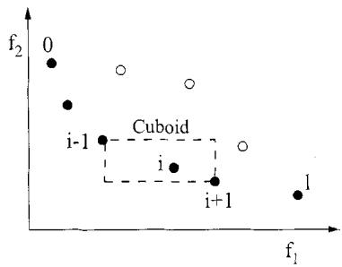  
Fig. 1. Crowding-distance calculation. Points marked in filled circles are solutions of the same nondominated front.

2) Since each solution must be compared with all other solutions in the population, the overall complexity of the sharing function approach is $O ( N ^ { 2 } )$

In the proposed NSGA-II, we replace the sharing function approach with a crowded-comparison approach that eliminates both the above difficulties to some extent. The new approach does not require any user-defined parameter for maintaining diversity among population members. Also, the suggested approach has a better computational complexity. To describe this approach, we first define a density-estimation metric and then present the crowded-comparison operator.

1) Density Estimation: To get an estimate of the density of solutions surrounding a particular solution in the population, we calculate the average distance of two points on either side of this point along each of the objectives. This quantity serves as an estimate of the perimeter of the cuboid formed by using the nearest neighbors as the vertices (call this the crowding distance). In Fig. 1, the crowding distance of the th solution in its front (marked with solid circles) is the average side length of the cuboid (shown with a dashed box).

The crowding-distance computation requires sorting the population according to each objective function value in ascending order of magnitude. Thereafter, for each objective function, the boundary solutions (solutions with smallest and largest function values) are assigned an infinite distance value. All other intermediate solutions are assigned a distance value equal to the absolute normalized difference in the function values of two adjacent solutions. This calculation is continued with other objective functions. The overall crowding-distance value is calculated as the sum of individual distance values corresponding to each objective. Each objective function is normalized before calculating the crowding distance. The algorithm as shown at the bottom of the page outlines the crowding-distance computation procedure of all solutions in an nondominated set .

$$
\mathcal {I} [ i ] _ {\mathrm{distance}} = 0
$$

$$
\mathcal {I} [ 1 ] _ {\mathrm{distance}} = \mathcal {I} [ l ] _ {\mathrm{distance}} = \infty
$$

Here, refers to the th objective function value of the th individual in the set and the parameters $f _ { m } ^ { \mathrm { m a x } }$ and $f _ { m } ^ { \operatorname* { m i n } }$ are the maximum and minimum values of the th objective function. The complexity of this procedure is governed by the sorting algorithm. Since independent sortings of at most solutions (when all population members are in one front ) are involved, the above algorithm has computational complexity.

After all population members in the set $\mathcal { T }$ are assigned a distance metric, we can compare two solutions for their extent of proximity with other solutions. A solution with a smaller value of this distance measure is, in some sense, more crowded by other solutions. This is exactly what we compare in the proposed crowded-comparison operator, described below. Although Fig. 1 illustrates the crowding-distance computation for two objectives, the procedure is applicable to more than two objectives as well.

2) Crowded-Comparison Operator: The crowded-comparison operator $( \prec _ { n } )$ guides the selection process at the various stages of the algorithm toward a uniformly spread-out Paretooptimal front. Assume that every individual in the population has two attributes:

1) nondomination rank $( \romannumeral 3, \mathbf { a n k } ) ;$

2) crowding distance $( i _ { \mathrm { d i s t a n c e } } )$

We now define a partial order $\prec _ { n }$ as

$$
\begin{array}{l} i \prec_ {n} j \quad \text {if} (i _ {\mathrm{rank}} <   j _ {\mathrm{rank}}) \\ \text {or} ((i _ {\mathrm{rank}} = j _ {\mathrm{rank}}) \\ \text {and} (i _ {\mathrm{distance}} > j _ {\mathrm{distance}})) \end{array} .
$$

That is, between two solutions with differing nondomination ranks, we prefer the solution with the lower (better) rank. Otherwise, if both solutions belong to the same front, then we prefer the solution that is located in a lesser crowded region.

With these three new innovations—a fast nondominated sorting procedure, a fast crowded distance estimation procedure, and a simple crowded comparison operator, we are now ready to describe the NSGA-II algorithm.

## C. Main Loop

Initially, a random parent population $P _ { 0 }$ is created. The population is sorted based on the nondomination. Each solution is assigned a fitness (or rank) equal to its nondomination level (1 is the best level, 2 is the next-best level, and so on). Thus, minimization of fitness is assumed. At first, the usual binary tournament selection, recombination, and mutation operators are used to create a offspring population $Q _ { 0 }$ of size . Since elitism

$$
\mathcal {I} [ i ] _ {\mathrm{distance}} = \mathcal {I} [ i ] _ {\mathrm{distance}} + (\mathcal {I} [ i + 1 ]. m - \mathcal {I} [ i - 1 ]. m) / (f _ {m} ^ {\max} - f _ {m} ^ {\min})
$$

$$
\mathcal {I}
$$

$R_{t} = P_{t}\cup Q_{t}$ combine parent and offspring population $\mathcal{F} =$ fast-non-dominated-sort $(R_{t})$ $\mathcal{F} = (\mathcal{F}_1,\mathcal{F}_2,\dots)$ , all nondominated fronts of $R_{t}$ $P_{t + 1} = \emptyset$ and $i = 1$ until $|P_{t + 1}| + |\mathcal{F}_i|\leq N$ until the parent population is filled crowding-distance-assignment $(\mathcal{F}_i)$ calculate crowding-distance in $\mathcal{F}_i$ $P_{t + 1} = P_{t + 1}\cup \mathcal{F}_i$ include ith nondominated front in the parent pop $i = i + 1$ check the next front for inclusion Sort $(\mathcal{F}_i,\prec_n)$ sort in descending order using $\prec_{n}$ $P_{t + 1} = P_{t + 1}\cup \mathcal{F}_i[1:(N - |P_{t + 1}|)]$ choose the first $(N - |P_{t + 1}|)$ elements of $\mathcal{F}_i$ $Q_{t + 1} =$ make-new-pop $(P_{t + 1})$ use selection, crossover and mutation to create a new population $Q_{t + 1}$ $t = t + 1$ increment the generation counter

is introduced by comparing current population with previously found best nondominated solutions, the procedure is different after the initial generation. We first describe the th generation of the proposed algorithm as shown at the bottom of the page.

The step-by-step procedure shows that NSGA-II algorithm is simple and straightforward. First, a combined population $R _ { t } =$ $P _ { t } \cup Q _ { t }$ is formed. The population $R _ { t }$ is of size . Then, the population $R _ { t }$ is sorted according to nondomination. Since all previous and current population members are included in $R _ { t } ,$ elitism is ensured. Now, solutions belonging to the best nondominated set $\mathcal { F } _ { 1 }$ are of best solutions in the combined population and must be emphasized more than any other solution in the combined population. If the size of $\mathcal { F } _ { 1 }$ is smaller then $N ,$ we definitely choose all members of the set $\mathcal { F } _ { 1 }$ for the new population $P _ { { t + 1 } }$ . The remaining members of the population $P _ { t + 1 }$ are chosen from subsequent nondominated fronts in the order of their ranking. Thus, solutions from the set $\mathcal { F } _ { 2 }$ are chosen next, followed by solutions from the set ${ \mathcal { F } } _ { 3 } ,$ , and so on. This procedure is continued until no more sets can be accommodated. Say that the set $\mathcal { F } _ { l }$ is the last nondominated set beyond which no other set can be accommodated. In general, the count of solutions in all sets from $\mathcal { F } _ { 1 }$ to $\mathcal { F } _ { \ell }$ would be larger than the population size. To choose exactly $N$ population members, we sort the solutions of the last front $\mathcal { F } _ { l }$ using the crowded-comparison operator $\prec _ { n }$ in descending order and choose the best solutions needed to fill all population slots. The NSGA-II procedure is also shown in Fig. 2. The new population $P _ { t + 1 }$ of size is now used for selection, crossover, and mutation to create a new population $Q _ { t + 1 }$ of size . It is important to note that we use a binary tournament selection operator but the selection criterion is now based on the crowded-comparison operator $\prec _ { n }$ . Since this operator requires both the rank and crowded distance of each solution in the population, we calculate these quantities while forming the population $P _ { t + 1 }$ , as shown in the above algorithm.

Consider the complexity of one iteration of the entire algorithm. The basic operations and their worst-case complexities are as follows:

1) nondominated sorting is $O ( M ( 2 N ) ^ { 2 } ) ;$

2) crowding-distance assignment is $O ( M ( 2 N ) \log ( 2 N ) ) ;$

3) sorting on $\prec _ { n }$ is $O ( 2 N \log ( 2 N ) )$

The overall complexity of the algorithm is $O ( M N ^ { 2 } )$ , which is governed by the nondominated sorting part of the algorithm. If performed carefully, the complete population of size need not be sorted according to nondomination. As soon as the sorting procedure has found enough number of fronts to have members in $P _ { t + 1 }$ , there is no reason to continue with the sorting procedure.

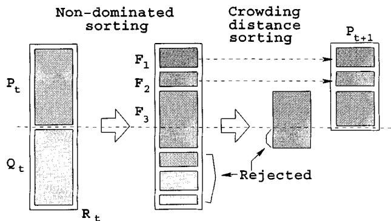  
Fig. 2. NSGA-II procedure.

The diversity among nondominated solutions is introduced by using the crowding comparison procedure, which is used in the tournament selection and during the population reduction phase. Since solutions compete with their crowding-distance (a measure of density of solutions in the neighborhood), no extra niching parameter (such as $\sigma _ { \mathrm { s h a r e } }$ needed in the NSGA) is required. Although the crowding distance is calculated in the objective function space, it can also be implemented in the parameter space, if so desired [3]. However, in all simulations performed in this study, we have used the objective-function space niching.

## IV. SIMULATION RESULTS

In this section, we first describe the test problems used to compare the performance of NSGA-II with PAES and SPEA. For PAES and SPEA, we have identical parameter settings as suggested in the original studies. For NSGA-II, we have chosen a reasonable set of values and have not made any effort in finding the best parameter setting. We leave this task for a future study.

TABLE I TEST PROBLEMS USED IN THIS STUDY

<table><tr><td>Problem</td><td>n</td><td>Variable bounds</td><td>Objective functions</td><td>Optimal solutions</td><td>Comments</td></tr><tr><td>SCH</td><td>1</td><td> $[-10^{3}, 10^{3}]$ </td><td> $f_{1}(x) = x^{2}$  $f_{2}(x) = (x - 2)^{2}$ </td><td> $x \in [0, 2]$ </td><td>convex</td></tr><tr><td>FON</td><td>3</td><td> $[-4, 4]$ </td><td> $f_{1}(x) = 1 - \exp\left(-\sum_{i=1}^{3}\left(x_{i} - \frac{1}{\sqrt{3}}\right)^{2}\right)$  $f_{2}(x) = 1 - \exp\left(-\sum_{i=1}^{3}\left(x_{i} + \frac{1}{\sqrt{3}}\right)^{2}\right)$ </td><td> $x_{1} = x_{2} = x_{3}$  $\in [-1/\sqrt{3}, 1/\sqrt{3}]$ </td><td>nonconvex</td></tr><tr><td>POL</td><td>2</td><td> $[-\pi, \pi]$ </td><td> $f_{1}(x) = \left[1 + (A_{1} - B_{1})^{2} + (A_{2} - B_{2})^{2}\right]$  $f_{2}(x) = \left[(x_{1} + 3)^{2} + (x_{2} + 1)^{2}\right]$  $A_{1} = 0.5 \sin 1 - 2 \cos 1 + \sin 2 - 1.5 \cos 2$  $A_{2} = 1.5 \sin 1 - \cos 1 + 2 \sin 2 - 0.5 \cos 2$  $B_{1} = 0.5 \sin x_{1} - 2 \cos x_{1} + \sin x_{2} - 1.5 \cos x_{2}$  $B_{2} = 1.5 \sin x_{1} - \cos x_{1} + 2 \sin x_{2} - 0.5 \cos x_{2}$ </td><td>(refer [1])</td><td>nonconvex, disconnected</td></tr><tr><td>KUR</td><td>3</td><td> $[-5, 5]$ </td><td> $f_{1}(x) = \sum_{i=1}^{n-1}\left(-10 \exp\left(-0.2\sqrt{x_{i}^{2} + x_{i+1}^{2}}\right)\right)$  $f_{2}(x) = \sum_{i=1}^{n}\left(|x_{i}|^{0.8} + 5 \sin x_{i}^{3}\right)$ </td><td>(refer [1])</td><td>nonconvex</td></tr><tr><td>ZDT1</td><td>30</td><td> $[0, 1]$ </td><td> $f_{1}(x) = x_{1}$  $f_{2}(x) = g(x) \left[1 - \sqrt{x_{1}/g(x)}\right]$  $g(x) = 1 + 9 \left(\sum_{i=2}^{n} x_{i}\right) / (n - 1)$ </td><td> $x_{1} \in [0, 1]$  $x_{i} = 0,$  $i = 2, \ldots, n$ </td><td>convex</td></tr><tr><td>ZDT2</td><td>30</td><td> $[0, 1]$ </td><td> $f_{1}(x) = x_{1}$  $f_{2}(x) = g(x) \left[1 - (x_{1}/g(x))^{2}\right]$  $g(x) = 1 + 9 \left(\sum_{i=2}^{n} x_{i}\right) / (n - 1)$ </td><td> $x_{1} \in [0, 1]$  $x_{i} = 0,$  $i = 2, \ldots, n$ </td><td>nonconvex</td></tr><tr><td>ZDT3</td><td>30</td><td> $[0, 1]$ </td><td> $f_{1}(x) = x_{1}$  $f_{2}(x) = g(x) \left[1 - \sqrt{x_{1}/g(x)} - \frac{x_{1}}{g(x)} \sin(10\pi x_{1})\right]$  $g(x) = 1 + 9 \left(\sum_{i=2}^{n} x_{i}\right) / (n - 1)$ </td><td> $x_{1} \in [0, 1]$  $x_{i} = 0,$  $i = 2, \ldots, n$ </td><td>convex, disconnected</td></tr><tr><td>ZDT4</td><td>10</td><td> $x_{1} \in [0, 1]$  $x_{i} \in [-5, 5],$  $i = 2, \ldots, n$ </td><td> $f_{1}(x) = x_{1}$  $f_{2}(x) = g(x) \left[1 - \sqrt{x_{1}/g(x)}\right]$  $g(x) = 1 + 10(n - 1) + \sum_{i=2}^{n} \left[x_{i}^{2} - 10 \cos(4\pi x_{i})\right]$ </td><td> $x_{1} \in [0, 1]$  $x_{i} = 0,$  $i = 2, \ldots, n$ </td><td>nonconvex</td></tr><tr><td>ZDT6</td><td>10</td><td> $[0, 1]$ </td><td> $f_{1}(x) = 1 - \exp(-4x_{1}) \sin^{6}(6\pi x_{1})$  $f_{2}(x) = g(x) \left[1 - (f_{1}(x)/g(x))^{2}\right]$  $g(x) = 1 + 9 \left[(\sum_{i=2}^{n} x_{i}) / (n - 1)\right]^{0.25}$ </td><td> $x_{1} \in [0, 1]$  $x_{i} = 0,$  $i = 2, \ldots, n$ </td><td>nonconvex, nonuniformly spaced</td></tr></table>

All objective functions are to be minimized.

## A. Test Problems

We first describe the test problems used to compare different MOEAs. Test problems are chosen from a number of significant past studies in this area. Veldhuizen [22] cited a number of test problems that have been used in the past. Of them, we choose four problems: Schaffer’s study (SCH) [19], Fonseca and Fleming’s study (FON) [10], Poloni’s study (POL) [16], and Kursawe’s study (KUR) [15]. In 1999, the first author suggested a systematic way of developing test problems for multiobjective optimization [3]. Zitzler et al. [25] followed those guidelines and suggested six test problems. We choose five of those six problems here and call them ZDT1, ZDT2, ZDT3, ZDT4, and ZDT6. All problems have two objective functions. None of these problems have any constraint. We describe these problems in Table I. The table also shows the number of variables, their bounds, the Pareto-optimal solutions, and the nature of the Pareto-optimal front for each problem.

All approaches are run for a maximum of 25 000 function evaluations. We use the single-point crossover and bitwise mutation for binary-coded GAs and the simulated binary crossover (SBX) operator and polynomial mutation [6] for real-coded GAs. The crossover probability of $p _ { c } ~ = ~ 0 . 9$ and a mutation probability of $p _ { m } = 1 / n$ or $1 / \ell$ (where is the number of decision variables for real-coded GAs and is the string length for binary-coded GAs) are used. For real-coded NSGA-II, we use distribution indexes [6] for crossover and mutation operators as $\eta _ { c } ~ = ~ 2 0$ and $\eta _ { m } ~ = ~ 2 0$ , respectively. The population obtained at the end of 250 generations (the population after elite-preserving operator is applied) is used to calculate a couple of performance metrics, which we discuss in the next section. For PAES, we use a depth value equal to four and an archive size of 100. We use all population members of the archive obtained at the end of 25 000 iterations to calculate the performance metrics. For SPEA, we use a population of size 80 and an external population of size 20 (this 4 : 1 ratio is suggested by the developers of SPEA to maintain an adequate selection pressure for the elite solutions), so that overall population size becomes 100. SPEA is also run until 25 000 function evaluations are done. For SPEA, we use the nondominated solutions of the combined GA and external populations at the final generation to calculate the performance metrics used in this study. For PAES, SPEA, and binary-coded NSGA-II, we have used 30 bits to code each decision variable.

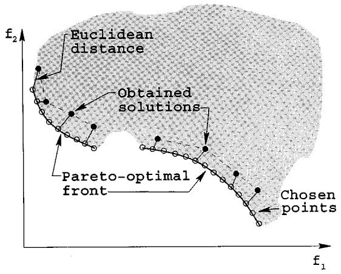  
Fig. 3. Distance metric $\Upsilon .$

## B. Performance Measures

Unlike in single-objective optimization, there are two goals in a multiobjective optimization: 1) convergence to the Pareto-optimal set and 2) maintenance of diversity in solutions of the Pareto-optimal set. These two tasks cannot be measured adequately with one performance metric. Many performance metrics have been suggested [1], [8], [24]. Here, we define two performance metrics that are more direct in evaluating each of the above two goals in a solution set obtained by a multiobjective optimization algorithm.

The first metric measures the extent of convergence to a known set of Pareto-optimal solutions. Since multiobjective algorithms would be tested on problems having a known set of Pareto-optimal solutions, the calculation of this metric is possible. We realize, however, that such a metric cannot be used for any arbitrary problem. First, we find a set of $H = 5 0 0$ uniformly spaced solutions from the true Pareto-optimal front in the objective space. For each solution obtained with an algorithm, we compute the minimum Euclidean distance of it from chosen solutions on the Pareto-optimal front. The average of these distances is used as the first metric $\Upsilon$ (the convergence metric). Fig. 3 shows the calculation procedure of this metric. The shaded region is the feasible search region and the solid curved lines specify the Pareto-optimal solutions. Solutions with open circles are chosen solutions on the Pareto-optimal front for the calculation of the convergence metric and solutions marked with dark circles are solutions obtained by an algorithm. The smaller the value of this metric, the better the convergence toward the Pareto-optimal front. When all obtained solutions lie exactly on chosen solutions, this metric takes a value of zero. In all simulations performed here, we present the average $\overline { { \Upsilon } }$ and variance $\sigma _ { \Upsilon }$ of this metric calculated for solution sets obtained in multiple runs.

Even when all solutions converge to the Pareto-optimal front, the above convergence metric does not have a value of zero. The metric will yield zero only when each obtained solution lies exactly on each of the chosen solutions. Although this metric alone can provide some information about the spread in obtained solutions, we define an different metric to measure the spread in solutions obtained by an algorithm directly. The second metric $\Delta$ measures the extent of spread achieved among the obtained solutions. Here, we are interested in getting a set of solutions that spans the entire Pareto-optimal region. We calculate the Euclidean distance $d _ { i }$ between consecutive solutions in the obtained nondominated set of solutions. We calculate the average of these distances. Thereafter, from the obtained set of nondominated solutions, we first calculate the extreme solutions (in the objective space) by fitting a curve parallel to that of the true Pareto-optimal front. Then, we use the following metric to calculate the nonuniformity in the distribution:

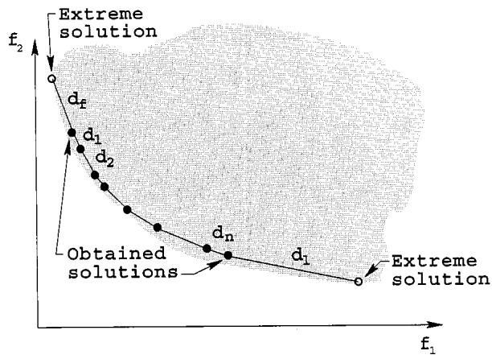  
Fig. 4. Diversity metric .

$$
\Delta = \frac {d _ {f} + d _ {l} + \sum_ {i = 1} ^ {N - 1} \left| d _ {i} - \overline {{d}} \right|}{d _ {f} + d _ {l} + (N - 1) \overline {{d}}}.\tag{1}
$$

Here, the parameters $d _ { f }$ and $d _ { l }$ are the Euclidean distances between the extreme solutions and the boundary solutions of the obtained nondominated set, as depicted in Fig. 4. The figure illustrates all distances mentioned in the above equation. The parameter $\overline { { d } }$ is the average of all distances $d _ { i } , i = 1 , 2 , \ldots , ( N -$ , assuming that there are solutions on the best nondominated front. With solutions, there are $( N - 1 )$ consecutive distances. The denominator is the value of the numerator for the case when all $N$ solutions lie on one solution. It is interesting to note that this is not the worst case spread of solutions possible. We can have a scenario in which there is a large variance in $d _ { i }$ In such scenarios, the metric may be greater than one. Thus, the maximum value of the above metric can be greater than one. However, a good distribution would make all distances $d _ { i }$ equal to $\overline { { d } }$ and would make $d _ { f } = d _ { l } = 0$ (with existence of extreme solutions in the nondominated set). Thus, for the most widely and uniformly spreadout set of nondominated solutions, the numerator of $\Delta$ would be zero, making the metric to take a value zero. For any other distribution, the value of the metric would be greater than zero. For two distributions having identical values of $d _ { f }$ and $d _ { l } ,$ the metric $\Delta$ takes a higher value with worse distributions of solutions within the extreme solutions. Note that the above diversity metric can be used on any nondominated set of solutions, including one that is not the Pareto-optimal set. Using a triangularization technique or a Voronoi diagram approach [1] to calculate $d _ { i }$ , the above procedure can be extended to estimate the spread of solutions in higher dimensions.

TABLE II  
MEAN (FIRST ROWS) AND VARIANCE (SECOND ROWS) OF THE CONVERGENCE METRIC 

<table><tr><td>Algorithm</td><td>SCH</td><td>FON</td><td>POL</td><td>KUR</td><td>ZDT1</td><td>ZDT2</td><td>ZDT3</td><td>ZDT4</td><td>ZDT6</td></tr><tr><td>NSGA-II</td><td>0.003391</td><td>0.001931</td><td>0.015553</td><td>0.028964</td><td>0.033482</td><td>0.072391</td><td>0.114500</td><td>0.513053</td><td>0.296564</td></tr><tr><td>Real-coded</td><td>0</td><td>0</td><td>0.000001</td><td>0.000018</td><td>0.004750</td><td>0.031689</td><td>0.007940</td><td>0.118460</td><td>0.013135</td></tr><tr><td>NSGA-II</td><td>0.002833</td><td>0.002571</td><td>0.017029</td><td>0.028951</td><td>0.000894</td><td>0.000824</td><td>0.043411</td><td>3.227636</td><td>7.806798</td></tr><tr><td>Binary-coded</td><td>0.000001</td><td>0</td><td>0.000003</td><td>0.000016</td><td>0</td><td>0</td><td>0.000042</td><td>7.30763</td><td>0.001667</td></tr><tr><td rowspan="2">SPEA</td><td>0.003403</td><td>0.125692</td><td>0.037812</td><td>0.045617</td><td>0.001799</td><td>0.001339</td><td>0.047517</td><td>7.340299</td><td>0.221138</td></tr><tr><td>0</td><td>0.000038</td><td>0.000088</td><td>0.00005</td><td>0.000001</td><td>0</td><td>0.000047</td><td>6.572516</td><td>0.000449</td></tr><tr><td rowspan="2">PAES</td><td>0.001313</td><td>0.151263</td><td>0.030864</td><td>0.057323</td><td>0.082085</td><td>0.126276</td><td>0.023872</td><td>0.854816</td><td>0.085469</td></tr><tr><td>0.000003</td><td>0.000905</td><td>0.000431</td><td>0.011989</td><td>0.008679</td><td>0.036877</td><td>0.00001</td><td>0.527238</td><td>0.006664</td></tr></table>

TABLE III  
MEAN (FIRST ROWS) AND VARIANCE (SECOND ROWS) OF THE DIVERSITY METRIC 

<table><tr><td>Algorithm</td><td>SCH</td><td>FON</td><td>POL</td><td>KUR</td><td>ZDT1</td><td>ZDT2</td><td>ZDT3</td><td>ZDT4</td><td>ZDT6</td></tr><tr><td>NSGA2R</td><td>0.477899</td><td>0.378065</td><td>0.452150</td><td>0.411477</td><td>0.390307</td><td>0.430776</td><td>0.738540</td><td>0.702612</td><td>0.668025</td></tr><tr><td>Real-coded</td><td>0.003471</td><td>0.000639</td><td>0.002868</td><td>0.000992</td><td>0.001876</td><td>0.004721</td><td>0.019706</td><td>0.064648</td><td>0.009923</td></tr><tr><td>NSGA-II</td><td>0.449265</td><td>0.395131</td><td>0.503721</td><td>0.442195</td><td>0.463292</td><td>0.435112</td><td>0.575606</td><td>0.479475</td><td>0.644477</td></tr><tr><td>Binary-coded</td><td>0.002062</td><td>0.001314</td><td>0.004656</td><td>0.001498</td><td>0.041622</td><td>0.024607</td><td>0.005078</td><td>0.009841</td><td>0.035042</td></tr><tr><td rowspan="2">SPEA</td><td>1.021110</td><td>0.792352</td><td>0.972783</td><td>0.852990</td><td>0.784525</td><td>0.755148</td><td>0.672938</td><td>0.798463</td><td>0.849389</td></tr><tr><td>0.004372</td><td>0.005546</td><td>0.008475</td><td>0.002619</td><td>0.004440</td><td>0.004521</td><td>0.003587</td><td>0.014616</td><td>0.002713</td></tr><tr><td rowspan="2">PAES</td><td>1.063288</td><td>1.162528</td><td>1.020007</td><td>1.079838</td><td>1.229794</td><td>1.165942</td><td>0.789920</td><td>0.870458</td><td>1.153052</td></tr><tr><td>0.002868</td><td>0.008945</td><td>0</td><td>0.013772</td><td>0.004839</td><td>0.007682</td><td>0.001653</td><td>0.101399</td><td>0.003916</td></tr></table>

## C. Discussion of the Results

Table II shows the mean and variance of the convergence metric obtained using four algorithms NSGA-II (real-coded), NSGA-II (binary-coded), SPEA, and PAES.

NSGA-II (real coded or binary coded) is able to converge better in all problems except in ZDT3 and ZDT6, where PAES found better convergence. In all cases with NSGA-II, the variance in ten runs is also small, except in ZDT4 with NSGA-II (binary coded). The fixed archive strategy of PAES allows better convergence to be achieved in two out of nine problems.

Table III shows the mean and variance of the diversity metric obtained using all three algorithms.

NSGA-II (real or binary coded) performs the best in all nine test problems. The worst performance is observed with PAES. For illustration, we show one of the ten runs of PAES with an arbitrary run of NSGA-II (real-coded) on problem SCH in Fig. 5.

On most problems, real-coded NSGA-II is able to find a better spread of solutions than any other algorithm, including binary-coded NSGA-II.

In order to demonstrate the working of these algorithms, we also show typical simulation results of PAES, SPEA, and NSGA-II on the test problems KUR, ZDT2, ZDT4, and ZDT6. The problem KUR has three discontinuous regions in the Pareto-optimal front. Fig. 6 shows all nondominated solutions obtained after 250 generations with NSGA-II (real-coded). The Pareto-optimal region is also shown in the figure. This figure demonstrates the abilities of NSGA-II in converging to the true front and in finding diverse solutions in the front. Fig. 7 shows the obtained nondominated solutions with SPEA, which is the next-best algorithm for this problem (refer to Tables II and III).

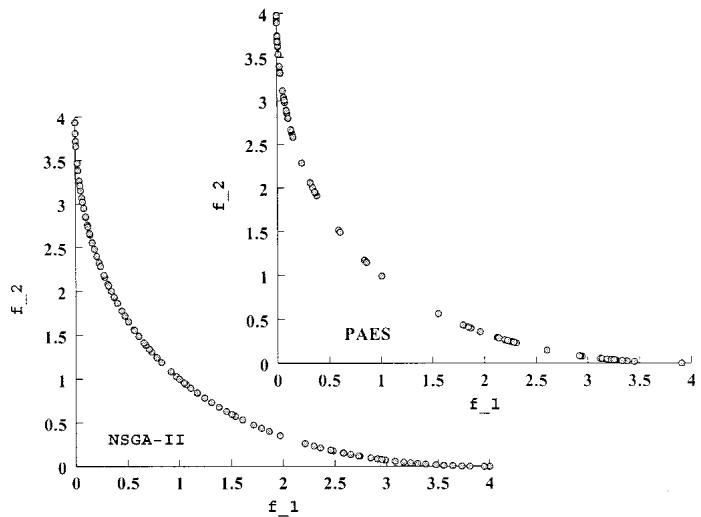

Fig. 5. NSGA-II finds better spread of solutions than PAES on SCH.  
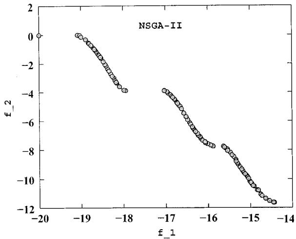  
Fig. 6. Nondominated solutions with NSGA-II (real-coded) on KUR.

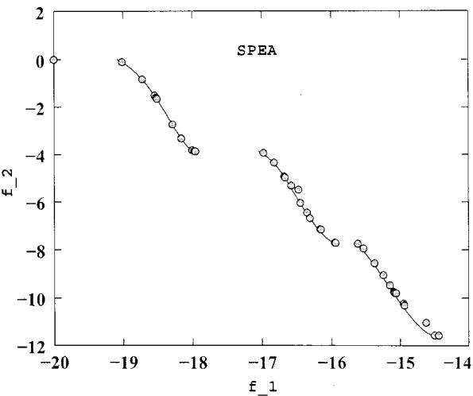

Fig. 7. Nondominated solutions with SPEA on KUR.  
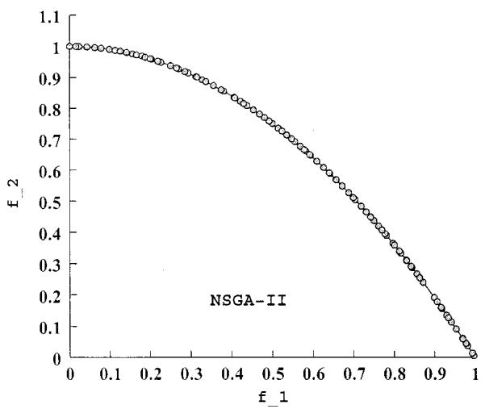  
Fig. 8. Nondominated solutions with NSGA-II (binary-coded) on ZDT2.

In both aspects of convergence and distribution of solutions, NSGA-II performed better than SPEA in this problem. Since SPEA could not maintain enough nondominated solutions in the final GA population, the overall number of nondominated solutions is much less compared to that obtained in the final population of NSGA-II.

Next, we show the nondominated solutions on the problem ZDT2 in Figs. 8 and 9. This problem has a nonconvex Pareto-optimal front. We show the performance of binary-coded NSGA-II and SPEA on this function. Although the convergence is not a difficulty here with both of these algorithms, both real- and binary-coded NSGA-II have found a better spread and more solutions in the entire Pareto-optimal region than SPEA (the next-best algorithm observed for this problem).

The problem ZDT4 has $2 1 ^ { 9 }$ or $7 . 9 4 ( 1 0 ^ { 1 1 } )$ different local Pareto-optimal fronts in the search space, of which only one corresponds to the global Pareto-optimal front. The Euclidean distance in the decision space between solutions of two consecutive local Pareto-optimal sets is 0.25. Fig. 10 shows that both real-coded NSGA-II and PAES get stuck at different local Pareto-optimal sets, but the convergence and ability to find a diverse set of solutions are definitely better with NSGA-II. Binary-coded GAs have difficulties in converging near the global Pareto-optimal front, a matter that is also been observed in previous single-objective studies [5]. On a similar ten-variable Rastrigin’s function [the function $g ( \mathbf { x } )$ here], that study clearly showed that a population of size of about at least 500 is needed for single-objective binary-coded GAs (with tournament selection, single-point crossover and bitwise mutation) to find the global optimum solution in more than 50% of the simulation runs. Since we have used a population of size 100, it is not expected that a multiobjective GA would find the global Pareto-optimal solution, but NSGA-II is able to find a good spread of solutions even at a local Pareto-optimal front. Since SPEA converges poorly on this problem (see Table II), we do not show SPEA results on this figure.

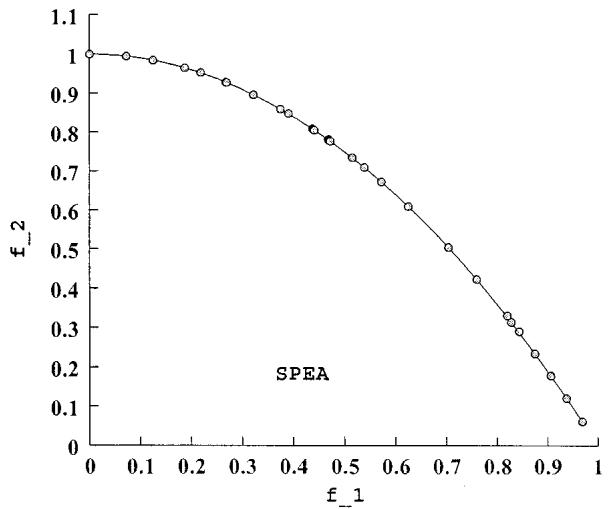  
Fig. 9. Nondominated solutions with SPEA on ZDT2.

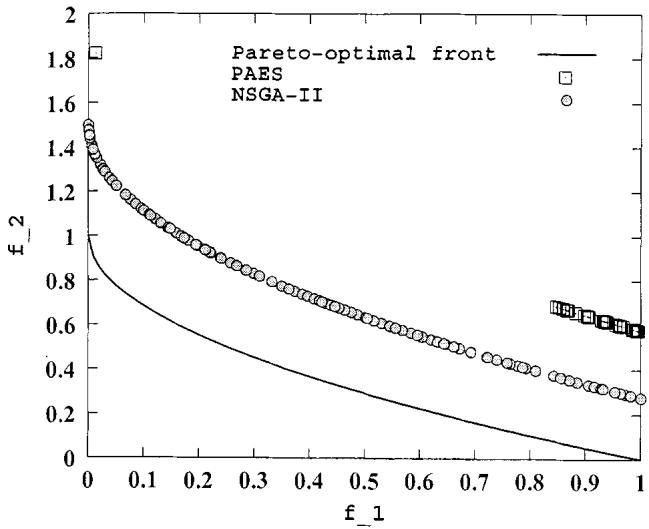  
Fig. 10. NSGA-II finds better convergence and spread of solutions than PAES on ZDT4.

Finally, Fig. 11 shows that SPEA finds a better converged set of nondominated solutions in ZDT6 compared to any other algorithm. However, the distribution in solutions is better with real-coded NSGA-II.

## D. Different Parameter Settings

In this study, we do not make any serious attempt to find the best parameter setting for NSGA-II. But in this section, we perform additional experiments to show the effect of a couple of different parameter settings on the performance of NSGA-II.

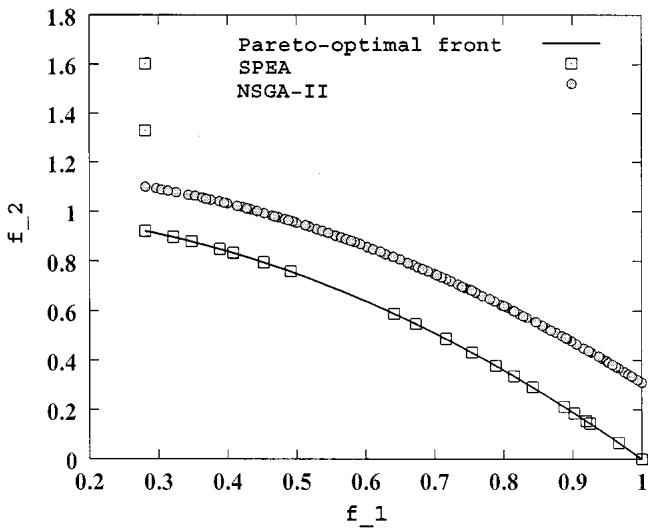  
Fig. 11. Real-coded NSGA-II finds better spread of solutions than SPEA on ZDT6, but SPEA has a better convergence.

TABLE IV  
MEAN AND VARIANCE OF THE CONVERGENCE AND DIVERSITY METRICS UP TO 500 GENERATIONS

<table><tr><td colspan="6">Convergence metric,  $\Upsilon$ </td></tr><tr><td></td><td>POL</td><td>KUR</td><td>ZDT3</td><td>ZDT4</td><td>ZDT6</td></tr><tr><td>Mean</td><td>0.015882</td><td>0.026544</td><td>0.018510</td><td>0.090692</td><td>0.276609</td></tr><tr><td>Variance</td><td>0.000001</td><td>0.000017</td><td>0.000227</td><td>0.053460</td><td>0.015843</td></tr><tr><td colspan="6">Diversity metric,  $\Delta$ </td></tr><tr><td></td><td>POL</td><td>KUR</td><td>ZDT3</td><td>ZDT4</td><td>ZDT6</td></tr><tr><td>Mean</td><td>0.467022</td><td>0.418889</td><td>0.688218</td><td>0.440022</td><td>0.655896</td></tr><tr><td>Variance</td><td>0.002186</td><td>0.000530</td><td>0.000610</td><td>0.026729</td><td>0.003302</td></tr></table>

First, we keep all other parameters as before, but increase the number of maximum generations to 500 (instead of 250 used before). Table IV shows the convergence and diversity metrics for problems POL, KUR, ZDT3, ZDT4, and ZDT6. Now, we achieve a convergence very close to the true Pareto-optimal front and with a much better distribution. The table shows that in all these difficult problems, the real-coded NSGA-II has converged very close to the true optimal front, except in ZDT6, which probably requires a different parameter setting with NSGA-II. Particularly, the results on ZDT3 and ZDT4 improve with generation number.

The problem ZDT4 has a number of local Pareto-optimal fronts, each corresponding to particular value of . A large change in the decision vector is needed to get out of a local optimum. Unless mutation or crossover operators are capable of creating solutions in the basin of another better attractor, the improvement in the convergence toward the true Pareto-optimal front is not possible. We use NSGA-II (real-coded) with a smaller distribution index $\eta _ { m } = 1 0$ for mutation, which has an effect of creating solutions with more spread than before. Rest of the parameter settings are identical as before. The convergence metric and diversity measure $\Delta$ on problem ZDT4 at the end of 250 generations are as follows:

$$
\begin{array}{r l} \overline {{\Upsilon}} = 0. 0 2 9 5 4 4 & \sigma_ {\Upsilon} ^ {2} = 0. 0 0 2 1 4 5 \\ \overline {{\Delta}} = 0. 4 9 8 4 0 9 & \sigma_ {\Delta} ^ {2} = 0. 0 0 3 8 5 2. \end{array}
$$

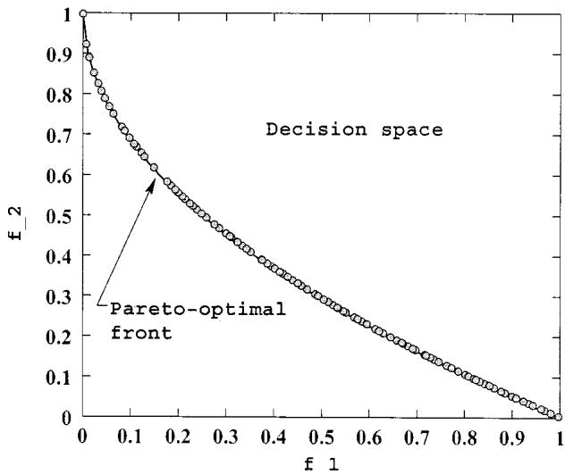  
Fig. 12. Obtained nondominated solutions with NSGA-II on problem ZDT4.

These results are much better than PAES and SPEA, as shown in Table II. To demonstrate the convergence and spread of solutions, we plot the nondominated solutions of one of the runs after 250 generations in Fig. 12. The figure shows that NSGA-II is able to find solutions on the true Pareto-optimal front with $g ( \mathbf { x } ) = 1 . 0$

## V. ROTATED PROBLEMS

It has been discussed in an earlier study [3] that interactions among decision variables can introduce another level of difficulty to any multiobjective optimization algorithm including EAs. In this section, we create one such problem and investigate the working of previously three MOEAs on the following epistatic problem:

$$
\begin{array}{l l}\text {minimize}&f _ {1} (\mathbf {y}) = y _ {1}\\\text {minimize}&f _ {2} (\mathbf {y}) = g (\mathbf {y}) \exp (- y _ {1} / g (\mathbf {y}))\\\text {where}&g (\mathbf {y}) = 1 + 1 0 (n - 1)\\&\qquad + \sum_ {i = 2} ^ {n} \left\lceil y _ {i} ^ {2} - 1 0 \cos (4 \pi y _ {i}) \right\rceil\\\text {and}&\mathbf {y} = \mathcal {R x}\\&- 0. 3 \leq x _ {i} \leq 0. 3, \quad \text {for i = 1, 2, ..., n}.\end{array}\tag{2}
$$

An EA works with the decision variable vector $\mathbf { x } ,$ but the above objective functions are defined in terms of the variable vector , which is calculated by transforming the decision variable vector by a fixed rotation matrix . This way, the objective functions are functions of a linear combination of decision variables. In order to maintain a spread of solutions over the Pareto-optimal region or even converge to any particular solution requires an EA to update all decision variables in a particular fashion. With a generic search operator, such as the variablewise SBX operator used here, this becomes a difficult task for an EA. However, here, we are interested in evaluating the overall behavior of three elitist MOEAs.

We use a population size of 100 and run each algorithm until 500 generations. For SBX, we use $\eta _ { c } = 1 0$ and we use $\eta _ { m } =$ for mutation. To restrict the Pareto-optimal solutions to lie within the prescribed variable bounds, we discourage solutions with $\left| f _ { 1 } \right| > 0 . 3$ by adding a fixed large penalty to both objectives. Fig. 13 shows the obtained solutions at the end of 500 generations using NSGA-II, PAES, and SPEA. It is observed that NSGA-II solutions are closer to the true front compared to solutions obtained by PAES and SPEA. The correlated parameter updates needed to progress toward the Pareto-optimal front makes this kind of problems difficult to solve. NSGA-II’s elite-preserving operator along with the real-coded crossover and mutation operators is able to find some solutions close to the Pareto-optimal front [with $g ( \mathbf { y } ) = 1$ resulting $f _ { 2 } = \exp ( - f _ { 1 } ) ]$ This example problem demonstrates that one of the known difficulties (the linkage problem [11], [12]) of single-objective optimization algorithm can also cause difficulties in a multiobjective problem. However, more systematic studies are needed to amply address the linkage issue in multiobjective optimization.

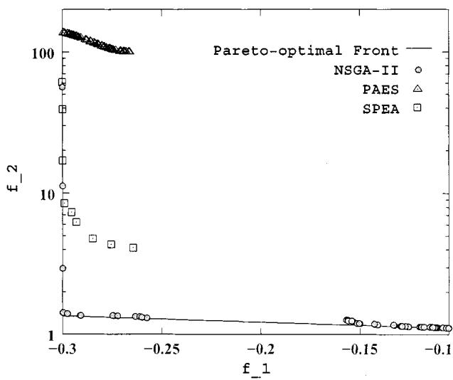  
Fig. 13. Obtained nondominated solutions with NSGA-II, PAES, and SPEA on the rotated problem.

## VI. CONSTRAINT HANDLING

In the past, the first author and his students implemented a penalty-parameterless constraint-handling approach for singleobjective optimization. Those studies [2], [6] have shown how a tournament selection based algorithm can be used to handle constraints in a population approach much better than a number of other existing constraint-handling approaches. A similar approach can be introduced with the above NSGA-II for solving constrained multiobjective optimization problems.

## A. Proposed Constraint-Handling Approach (Constrained NSGA-II)

This constraint-handling method uses the binary tournament selection, where two solutions are picked from the population and the better solution is chosen. In the presence of constraints, each solution can be either feasible or infeasible. Thus, there may be at most three situations: 1) both solutions are feasible; 2) one is feasible and other is not; and 3) both are infeasible.

For single objective optimization, we used a simple rule for each case.

Case 1) Choose the solution with better objective function value.

Case 2) Choose the feasible solution.

Case 3) Choose the solution with smaller overall constraint violation.

Since in no case constraints and objective function values are compared with each other, there is no need of having any penalty parameter, a matter that makes the proposed constraint-handling approach useful and attractive.

In the context of multiobjective optimization, the latter two cases can be used as they are and the first case can be resolved by using the crowded-comparison operator as before. To maintain the modularity in the procedures of NSGA-II, we simply modify the definition of domination between two solutions and $j .$

Definition 1: A solution is said to constrained-dominate a solution $j ,$ , if any of the following conditions is true.

1) Solution is feasible and solution $j$ is not.

2) Solutions and are both infeasible, but solution has a smaller overall constraint violation.

3) Solutions and $j$ are feasible and solution dominates solution $j .$

The effect of using this constrained-domination principle is that any feasible solution has a better nondomination rank than any infeasible solution. All feasible solutions are ranked according to their nondomination level based on the objective function values. However, among two infeasible solutions, the solution with a smaller constraint violation has a better rank. Moreover, this modification in the nondomination principle does not change the computational complexity of NSGA-II. The rest of the NSGA-II procedure as described earlier can be used as usual.

The above constrained-domination definition is similar to that suggested by Fonseca and Fleming [9]. The only difference is in the way domination is defined for the infeasible solutions. In the above definition, an infeasible solution having a larger overall constraint-violation are classified as members of a larger nondomination level. On the other hand, in [9], infeasible solutions violating different constraints are classified as members of the same nondominated front. Thus, one infeasible solution violating a constraint marginally will be placed in the same nondominated level with another solution violating a different constraint to a large extent. This may cause an algorithm to wander in the infeasible search region for more generations before reaching the feasible region through constraint boundaries. Moreover, since Fonseca–Fleming’s approach requires domination checks with the constraint-violation values, the proposed approach of this paper is computationally less expensive and is simpler.

## B. Ray–Tai–Seow’s Constraint-Handling Approach

Ray et al. [17] suggested a more elaborate constraint-handling technique, where constraint violations of all constraints are not simply summed together. Instead, a nondomination check of constraint violations is also made. We give an outline of this procedure here.

TABLE V  
CONSTRAINED TEST PROBLEMS USED IN THIS STUDY

<table><tr><td>Problem</td><td>n</td><td>Variable bounds</td><td>Objective functions</td><td>Constraints</td></tr><tr><td>CONSTR</td><td>2</td><td> $x_{1} \in [0.1, 1.0]$  $x_{2} \in [0, 5]$ </td><td> $f_{1}(\mathbf{x}) = x_{1}$  $f_{2}(\mathbf{x}) = (1 + x_{2})/x_{1}$ </td><td> $g_{1}(\mathbf{x}) = x_{2} + 9x_{1} \geq 6$  $g_{2}(\mathbf{x}) = -x_{2} + 9x_{1} \geq 1$ </td></tr><tr><td>SRN</td><td>2</td><td> $x_{i} \in [-20, 20]$  $i = 1, 2$ </td><td> $f_{1}(\mathbf{x}) = (x_{1} - 2)^{2} + (x_{2} - 1)^{2} + 2$  $f_{2}(\mathbf{x}) = 9x_{1} - (x_{2} - 1)^{2}$ </td><td> $g_{1}(\mathbf{x}) = x_{1}^{2} + x_{2}^{2} \leq 225$  $g_{2}(\mathbf{x}) = x_{1} - 3x_{2} \leq -10$ </td></tr><tr><td>TNK</td><td>2</td><td> $x_{i} \in [0, \pi]$  $i = 1, 2$ </td><td> $f_{1}(\mathbf{x}) = x_{1}$  $f_{2}(\mathbf{x}) = x_{2}$ </td><td> $g_{1}(\mathbf{x}) = -x_{1}^{2} - x_{2}^{2} + 1 + 0.1\cos(16\arctan(x_{1}/x_{2})) \leq 0$  $g_{2}(\mathbf{x}) = (x_{1} - 0.5)^{2} + (x_{2} - 0.5)^{2} \leq 0.5$ </td></tr><tr><td>WATER</td><td>3</td><td> $0.01 \leq x_{1} \leq 0.45$  $0.01 \leq x_{2} \leq 0.10$  $0.01 \leq x_{3} \leq 0.10$ </td><td> $f_{1}(\mathbf{x}) = 106780.37(x_{2} + x_{3}) + 61704.67$  $f_{2}(\mathbf{x}) = 3000x_{1}$  $f_{3}(\mathbf{x}) = (305700)2289x_{2}/(0.06 \times 2289)^{0.65}$  $f_{4}(\mathbf{x}) = (250)2289\exp(-39.75x_{2} + 9.9x_{3} + 2.74)$  $f_{5}(\mathbf{x}) = 25(1.39/(x_{1}x_{2}) + 4940x_{3} - 80)$ </td><td> $g_{1}(\mathbf{x}) = 0.00139/(x_{1}x_{2}) + 4.94x_{3} - 0.08 \leq 1$  $g_{2}(\mathbf{x}) = 0.000306/(x_{1}x_{2}) + 1.082x_{3} - 0.0986 < 1$  $g_{3}(\mathbf{x}) = 12.307/(x_{1}x_{2}) + 49408.24x_{3} + 4051.02 \leq 50000$  $g_{4}(\mathbf{x}) = 2.098/(x_{1}x_{2}) + 8046.33x_{3} - 696.71 \leq 16000$  $g_{5}(\mathbf{x}) = 2.138/(x_{1}x_{2}) + 7883.39x_{3} - 705.04 \leq 10000$  $g_{6}(\mathbf{x}) = 0.417(x_{1}x_{2}) + 1721.26x_{3} - 136.54 \leq 2000$  $g_{7}(\mathbf{x}) = 0.164/(x_{1}x_{2}) + 631.13x_{3} - 54.48 \leq 550$ </td></tr></table>

All objective functions are to be minimized.

problems, particularly from the point of view of computational burden associated with the method.

In the following section, we choose a set of four problems and compare the simple constrained NSGA-II with the $\mathrm { R a y - T a i - S e o w ^ { \prime } s }$ method.

Three different nondominated rankings of the population are first performed. The first ranking is performed using objective function values and the resulting ranking is stored in a -dimensional vector $R _ { \mathrm { o b j } }$ . The second ranking $R _ { \mathrm { c o n } }$ is performed using only the constraint violation values of all ( of them) constraints and no objective function information is used. Thus, constraint violation of each constraint is used a criterion and a nondomination classification of the population is performed with the constraint violation values. Notice that for a feasible solution all constraint violations are zero. Thus, all feasible solutions have a rank 1 in $R _ { \mathrm { c o n } }$ . The third ranking is performed on a combination of objective functions and constraint-violation values [a total of $( M + J )$ values]. This produces the ranking $R _ { \mathrm { c o m } } .$ . Although objective function values and constraint violations are used together, one nice aspect of this algorithm is that there is no need for any penalty parameter. In the domination check, criteria are compared individually, thereby eliminating the need of any penalty parameter. Once these rankings are over, all feasible solutions having the best rank in $R _ { \mathrm { c o m } }$ are chosen for the new population. If more population slots are available, they are created from the remaining solutions systematically. By giving importance to the ranking in $R _ { \mathrm { o b j } }$ in the selection operator and by giving importance to the ranking in $R _ { \mathrm { c o n } }$ in the crossover operator, the investigators laid out a systematic multiobjective GA, which also includes a niche-preserving operator. For details, readers may refer to [17]. Although the investigators did not compare their algorithm with any other method, they showed the working of this constraint-handling method on a number of engineering design problems. However, since nondominated sorting of three different sets of criteria are required and the algorithm introduces many different operators, it remains to be investigated how it performs on more complex

## C. Simulation Results

We choose four constrained test problems (see Table V) that have been used in earlier studies. In the first problem, a part of the unconstrained Pareto-optimal region is not feasible. Thus, the resulting constrained Pareto-optimal region is a concatenation of the first constraint boundary and some part of the unconstrained Pareto-optimal region. The second problem SRN was used in the original study of NSGA [20]. Here, the constrained Pareto-optimal set is a subset of the unconstrained Pareto-optimal set. The third problem TNK was suggested by Tanaka et al. [21] and has a discontinuous Pareto-optimal region, falling entirely on the first constraint boundary. In the next section, we show the constrained Pareto-optimal region for each of the above problems. The fourth problem WATER is a five-objective and seven-constraint problem, attempted to solve in [17]. With five objectives, it is difficult to discuss the effect of the constraints on the unconstrained Pareto-optimal region. In the next section, we show all $\left( ^ { 5 } _ { 2 } \right)$ or ten pairwise plots of obtained nondominated solutions. We apply real-coded NSGA-II here.

In all problems, we use a population size of 100, distribution indexes for real-coded crossover and mutation operators of 20 and 100, respectively, and run NSGA-II (real coded) with the proposed constraint-handling technique and with Ray–Tai–Seow’s constraint-handling algorithm [17] for a maximum of 500 generations. We choose this rather large number of generations to investigate if the spread in solutions can be maintained for a large number of generations. However, in each case, we obtain a reasonably good spread of solutions as early as 200 generations. Crossover and mutation probabilities are the same as before.

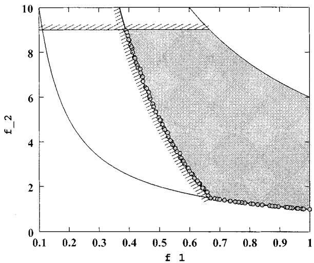  
Fig. 14. Obtained nondominated solutions with NSGA-II on the constrained problem CONSTR.

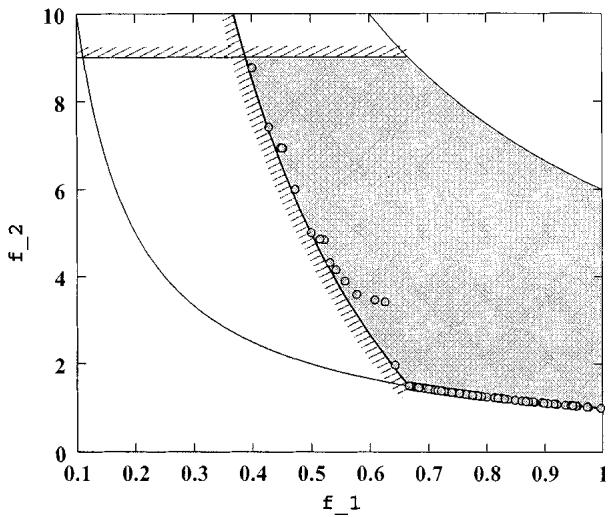  
Fig. 15. Obtained nondominated solutions with Ray-Tai-Seow’s algorithm on the constrained problem CONSTR.

Fig. 14 shows the obtained set of 100 nondominated solutions after 500 generations using NSGA-II. The figure shows that NSGA-II is able to uniformly maintain solutions in both Pareto-optimal region. It is important to note that in order to maintain a spread of solutions on the constraint boundary, the solutions must have to be modified in a particular manner dictated by the constraint function. This becomes a difficult task of any search operator. Fig. 15 shows the obtained solutions using Ray-Tai-Seow’s algorithm after 500 generations. It is clear that NSGA-II performs better than Ray–Tai–Seow’s algorithm in terms of converging to the true Pareto-optimal front and also in terms of maintaining a diverse population of nondominated solutions.

Next, we consider the test problem SRN. Fig. 16 shows the nondominated solutions after 500 generations using NSGA-II.

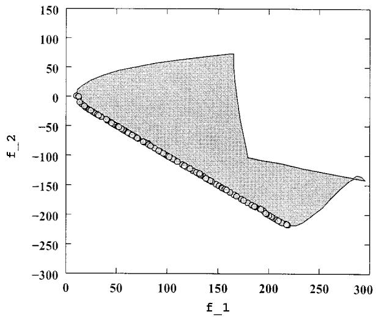  
Fig. 16. Obtained nondominated solutions with NSGA-II on the constrained problem SRN.

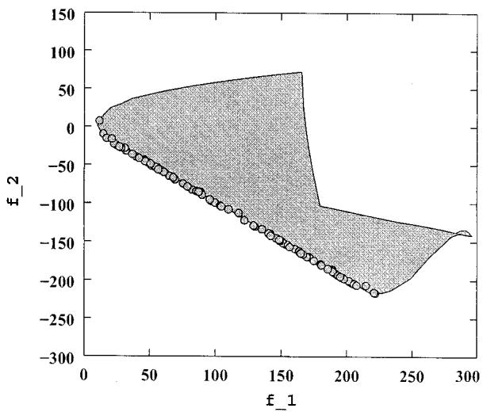  
Fig. 17. Obtained nondominated solutions with Ray–Tai–Seow’s algorithm on the constrained problem SRN.

The figure shows how NSGA-II can bring a random population on the Pareto-optimal front. Ray–Tai–Seow’s algorithm is also able to come close to the front on this test problem (Fig. 17).

Figs. 18 and 19 show the feasible objective space and the obtained nondominated solutions with NSGA-II and Ray–Tai–Seow’s algorithm. Here, the Pareto-optimal region is discontinuous and NSGA-II does not have any difficulty in finding a wide spread of solutions over the true Pareto-optimal region. Although Ray–Tai–Seow’s algorithm found a number of solutions on the Pareto-optimal front, there exist many infeasible solutions even after 500 generations. In order to demonstrate the working of Fonseca–Fleming’s constraint-handling strategy, we implement it with NSGA-II and apply on TNK. Fig. 20 shows 100 population members at the end of 500 generations and with identical parameter setting as used in Fig. 18. Both these figures demonstrate that the proposed and Fonseca–Fleming’s constraint-handling strategies work well with NSGA-II.

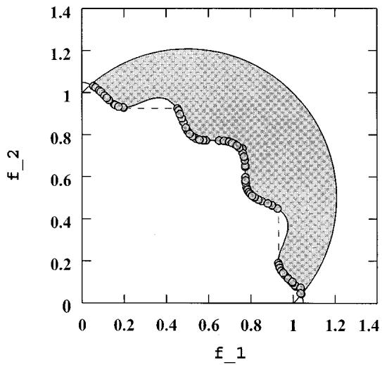  
Fig. 18. Obtained nondominated solutions with NSGA-II on the constrained problem TNK.

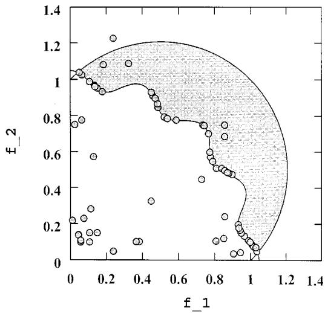  
Fig. 19. Obtained nondominated solutions with Ray–Tai–Seow’s algorithm on the constrained problem TNK.

Ray et al. [17] have used the problem WATER in their study. They normalized the objective functions in the following manner:

$$
f _ {1} / 8 (1 0 ^ {4}), f _ {2} / 1 5 0 0, f _ {3} / 3 (1 0 ^ {6}), f _ {4} / 6 (1 0 ^ {6}), f _ {5} / 8 0 0 0.
$$

Since there are five objective functions in the problem WATER, we observe the range of the normalized objective function values of the obtained nondominated solutions. Table VI shows the comparison with Ray–Tai–Seow’s algorithm. In most objective functions, NSGA-II has found a better spread of solutions than Ray–Tai–Seow’s approach. In order to show the pairwise interactions among these five normalized objective functions, we plot all $\binom { 5 } { 2 }$ or ten interactions in Fig. 21 for both algorithms. NSGA-II results are shown in the upper diagonal portion of the figure and the Ray–Tai–Seow’s results are shown in the lower diagonal portion. The axes of any plot can be obtained by looking at the corresponding diagonal boxes and their ranges. For example, the plot at the first row and third column has its vertical axis as $f _ { 1 }$ and horizontal axis as $f _ { 3 } .$ Since this plot belongs in the upper side of the diagonal, this plot is obtained using NSGA-II. In order to compare this plot with a similar plot using Ray–Tai–Seow’s approach, we look for the plot in the third row and first column. For this figure, the vertical axis is plotted as $f _ { 3 }$ and the horizontal axis is plotted as $f _ { 1 }$ . To get a better comparison between these two plots, we observe Ray–Tai–Seow’s plot as it is, but turn the page $9 0 ^ { \circ }$ in the clockwise direction for NSGA-II results. This would make the labeling and ranges of the axes same in both cases.

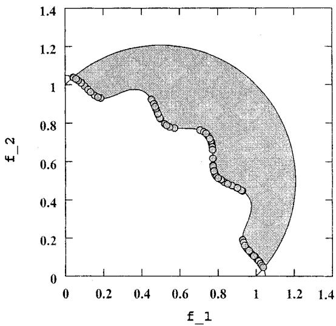  
Fig. 20. Obtained nondominated solutions with Fonseca–Fleming’s constraint-handling strategy with NSGA-II on the constrained problem TNK.

We observe that NSGA-II plots have better formed patterns than in Ray–Tai–Seow’s plots. For example, figures $f _ { 1 } - f _ { 3 } ,$ $f _ { 1 } - f _ { 4 } ,$ , and $f _ { 3 ^ { - } } f _ { 4 }$ interactions are very clear from NSGA-II results. Although similar patterns exist in the results obtained using Ray–Tai–Seow’s algorithm, the convergence to the true fronts is not adequate.

## VII. CONCLUSION

We have proposed a computationally fast and elitist MOEA based on a nondominated sorting approach. On nine different difficult test problems borrowed from the literature, the proposed NSGA-II was able to maintain a better spread of solutions and converge better in the obtained nondominated front compared to two other elitist MOEAs—PAES and SPEA. However, one problem, PAES, was able to converge closer to the true Pareto-optimal front. PAES maintains diversity among solutions by controlling crowding of solutions in a deterministic and prespecified number of equal-sized cells in the search space. In that problem, it is suspected that such a deterministic crowding coupled with the effect of mutation-based approach has been beneficial in converging near the true front compared to the dynamic and parameterless crowding approach used in NSGA-II and SPEA. However, the diversity preserving mechanism used in NSGA-II is found to be the best among the three approaches studied here.

On a problem having strong parameter interactions, NSGA-II has been able to come closer to the true front than the other two approaches, but the important matter is that all three approaches faced difficulties in solving this so-called highly epistatic problem. Although this has been a matter of ongoing research in single-objective EA studies, this paper shows that highly epistatic problems may also cause difficulties to MOEAs. More importantly, researchers in the field should consider such epistatic problems for testing a newly developed algorithm for multiobjective optimization.

TABLE VI  
LOWER AND UPPER BOUNDS OF THE OBJECTIVE FUNCTION VALUES OBSERVED IN THE OBTAINED NONDOMINATED SOLUTIONS

<table><tr><td>Algorithm</td><td> $f_1$ </td><td> $f_2$ </td><td> $f_3$ </td><td> $f_4$ </td><td> $f_5$ </td></tr><tr><td>NSGA-II</td><td>0.798 - 0.920</td><td>0.027 - 0.900</td><td>0.095 - 0.951</td><td>0.031 - 1.110</td><td>0.001 - 3.124</td></tr><tr><td>Ray-Tai-Seow</td><td>0.810 - 0.956</td><td>0.046 - 0.834</td><td>0.967 - 0.934</td><td>0.036 - 1.561</td><td>0.211 - 3.116</td></tr></table>

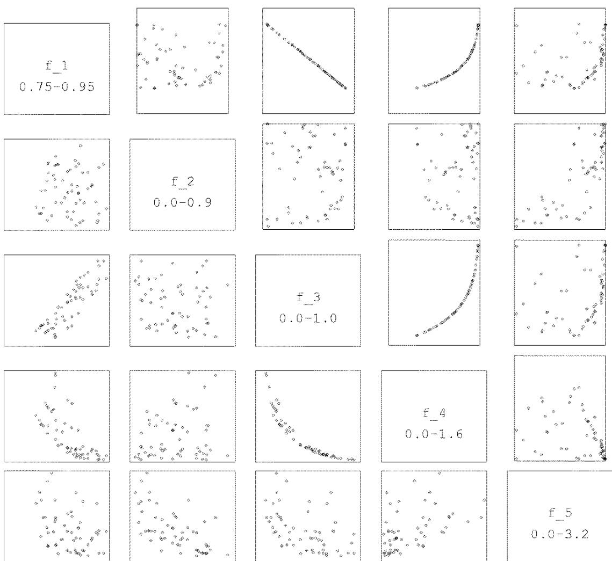  
Fig. 21. Upper diagonal plots are for NSGA-II and lower diagonal plots are for Ray–Tai–Seow’s algorithm. Compare (i; j) plot (Ray–Tai–Seow’s algorithm with i > j) with (j; i) plot (NSGA-II). Label and ranges used for each axis are shown in the diagonal boxes.

We have also proposed a simple extension to the definition of dominance for constrained multiobjective optimization. Although this new definition can be used with any other MOEAs, the real-coded NSGA-II with this definition has been shown to solve four different problems much better than another recently-proposed constraint-handling approach.

With the properties of a fast nondominated sorting procedure, an elitist strategy, a parameterless approach and a simple yet efficient constraint-handling method, NSGA-II, should find increasing attention and applications in the near future.

## REFERENCES

[1] K. Deb, Multiobjective Optimization Using Evolutionary Algorithms. Chichester, U.K.: Wiley, 2001.

[2] , “An efficient constraint-handling method for genetic algorithms,” Comput. Methods Appl. Mech. Eng., vol. 186, no. 2–4, pp. 311–338, 2000.

[3] , “Multiobjective genetic algorithms: Problem difficulties and construction of test functions,” in Evol. Comput., 1999, vol. 7, pp. 205–230.

[4] K. Deb and D. E. Goldberg, “An investigation of niche and species formation in genetic function optimization,” in Proceedings of the Third International Conference on Genetic Algorithms, J. D. Schaffer, Ed. San Mateo, CA: Morgan Kauffman, 1989, pp. 42–50.

[5] K. Deb and S. Agrawal, “Understanding interactions among genetic algorithm parameters,” in Foundations of Genetic Algorithms V, W. Banzhaf and C. Reeves, Eds. San Mateo, CA: Morgan Kauffman, 1998, pp. 265–286.

[6] K. Deb and R. B. Agrawal, “Simulated binary crossover for continuous search space,” in Complex Syst., Apr. 1995, vol. 9, pp. 115–148.

[7] C. M. Fonseca and P. J. Fleming, “Genetic algorithms for multiobjective optimization: Formulation, discussion and generalization,” in Proceedings of the Fifth International Conference on Genetic Algorithms, S. Forrest, Ed. San Mateo, CA: Morgan Kauffman, 1993, pp. 416–423.

[8] , “On the performance assessment and comparison of stochastic multiobjective optimizers,” in Parallel Problem Solving from Nature IV, H.-M. Voigt, W. Ebeling, I. Rechenberg, and H.-P. Schwefel, Eds. Berlin, Germany: Springer-Verlag, 1996, pp. 584–593.

[9] , “Multiobjective optimization and multiple constraint handling with evolutionary algorithms—Part I: A unified formulation,” IEEE Trans. Syst., Man, Cybern. A, vol. 28, pp. 26–37, Jan. 1998.

[10] , “Multiobjective optimization and multiple constraint handling with evolutionary algorithms—Part II: Application example,” IEEE Trans. Syst., Man, Cybern. A, vol. 28, pp. 38–47, Jan. 1998.

[11] D. E. Goldberg, B. Korb, and K. Deb, “Messy genetic algorithms: Motivation, analysis, and first results,” in Complex Syst., Sept. 1989, vol. 3, pp. 93–530.

[12] G. Harik, “Learning gene linkage to efficiently solve problems of bounded difficulty using genetic algorithms,” llinois Genetic Algorithms Lab., Univ. Illinois at Urbana-Champaign, Urbana, IL, IlliGAL Rep. 97005, 1997.

[13] J. Horn, N. Nafploitis, and D. E. Goldberg, “A niched Pareto genetic algorithm for multiobjective optimization,” in Proceedings of the First IEEE Conference on Evolutionary Computation, Z. Michalewicz, Ed. Piscataway, NJ: IEEE Press, 1994, pp. 82–87.

[14] J. Knowles and D. Corne, “The Pareto archived evolution strategy: A new baseline algorithm for multiobjective optimization,” in Proceedings of the 1999 Congress on Evolutionary Computation. Piscataway, NJ: IEEE Press, 1999, pp. 98–105.

[15] F. Kursawe, “A variant of evolution strategies for vector optimization,” in Parallel Problem Solving from Nature, H.-P. Schwefel and R. Männer, Eds. Berlin, Germany: Springer-Verlag, 1990, pp. 193–197.

[16] C. Poloni, “Hybrid GA for multiobjective aerodynamic shape optimization,” in Genetic Algorithms in Engineering and Computer Science, G. Winter, J. Periaux, M. Galan, and P. Cuesta, Eds. New York: Wiley, 1997, pp. 397–414.

[17] T. Ray, K. Tai, and C. Seow, “An evolutionary algorithm for multiobjective optimization,” Eng. Optim., vol. 33, no. 3, pp. 399–424, 2001.

[18] G. Rudolph, “Evolutionary search under partially ordered sets,” Dept. Comput. Sci./LS11, Univ. Dortmund, Dortmund, Germany, Tech. Rep. CI-67/99, 1999.

[19] J. D. Schaffer, “Multiple objective optimization with vector evaluated genetic algorithms,” in Proceedings of the First International Conference on Genetic Algorithms, J. J. Grefensttete, Ed. Hillsdale, NJ: Lawrence Erlbaum, 1987, pp. 93–100.

[20] N. Srinivas and K. Deb, “Multiobjective function optimization using nondominated sorting genetic algorithms,” Evol. Comput., vol. 2, no. 3, pp. 221–248, Fall 1995.

[21] M. Tanaka, “GA-based decision support system for multicriteria optimization,” in Proc. IEEE Int. Conf. Systems, Man and Cybernetics-2, 1995, pp. 1556–1561.

[22] D. Van Veldhuizen, “Multiobjective evolutionary algorithms: Classifications, analyzes, and new innovations,” Air Force Inst. Technol., Dayton, OH, Tech. Rep. AFIT/DS/ENG/99-01, 1999.

[23] D. Van Veldhuizen and G. Lamont, “Multiobjective evolutionary algorithm research: A history and analysis,” Air Force Inst. Technol., Dayton, OH, Tech. Rep. TR-98-03, 1998.

[24] E. Zitzler, “Evolutionary algorithms for multiobjective optimization: Methods and applications,” Doctoral dissertation ETH 13398, Swiss Federal Institute of Technology (ETH), Zurich, Switzerland, 1999.

[25] E. Zitzler, K. Deb, and L. Thiele, “Comparison of multiobjective evolutionary algorithms: Empirical results,” Evol. Comput., vol. 8, no. 2, pp. 173–195, Summer 2000.

[26] E. Zitzler and L. Thiele, “Multiobjective optimization using evolutionary algorithms—A comparative case study,” in Parallel Problem Solving From Nature, V, A. E. Eiben, T. Bäck, M. Schoenauer, and H.-P. Schwefel, Eds. Berlin, Germany: Springer-Verlag, 1998, pp. 292–301.

Kalyanmoy Deb (A’02) received the B.Tech degree in mechanical engineering from the Indian Institute of Technology, Kharagpur, India, 1985 and the M.S. and Ph.D. degrees in engineering mechanics from the University of Alabama, Tuscaloosa, in 1989 and 1991, respectively.

He is currently a Professor of Mechanical Engineering with the Indian Institute of Technology, Kanpur, India. He has authored or coauthored over 100 research papers in journals and conferences, a number of book chapters, and two books:

Multiobjective Optimization Using Evolutionary Algorithms (Chichester, U.K.: Wiley, 2001) and Optimization for Engineering Design (New Delhi, India: Prentice-Hall, 1995). His current research interests are in the field of evolutionary computation, particularly in the areas of multicriterion and real-parameter evolutionary algorithms.

Dr. Deb is an Associate Editor of IEEE TRANSACTIONS ON EVOLUTIONARY COMPUTATION and an Executive Council Member of the International Society on Genetic and Evolutionary Computation.

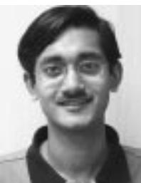  
machine learning, and neural networks.

Amrit Pratap was born in Hyderabad, India, on August 27, 1979. He received the M.S. degree in mathematics and scientific computing from the Indian Institute of Technology, Kanpur, India, in 2001. He is working toward the Ph.D. degree in computer science at the California Institute of Technology, Pasadena, CA.

He was a member of the Kanpur Genetic Algorithms Laboratory. He is currently a Member of the Caltech Learning Systems Group. His current research interests include evolutionary computation,

Sameer Agarwal was born in Bulandshahar, India, on February 19, 1977. He received the M.S. degree in mathematics and scientific computing from the Indian Institute of Technology, Kanpur, India, in 2000. He is working toward the Ph.D. degree in computer science at University of California, San Diego.

He was a Member of the Kanpur Genetic Algorithms Laboratory. His research interests include evolutionary computation and learning both in humans as well as machines. He is currently developing learning methods for learning by imitation.

T. Meyarivan was born in Haldia, India, on November 23, 1977. He is working toward the M.S. degree in chemistry from Indian Institute of Technology, Kanpur, India.

He is a Member of the Kanpur Genetic Algorithms Laboratory. His current research interests include evolutionary computation and its applications to biology and various fields in chemistry.