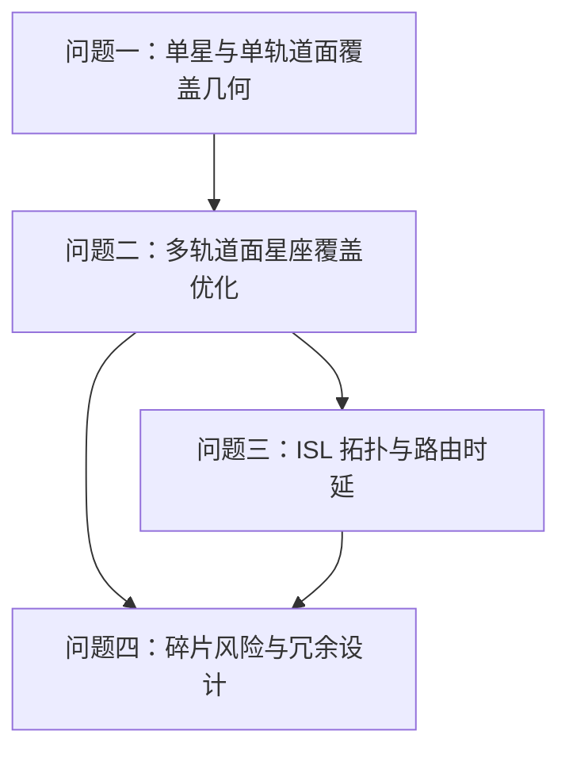

# 星链系统 — 题目要求分析（文献驱动版）

> 本文件只做**问题分析**：明确题目到底要求什么、哪些量要建模、哪些结论必须由论文或后续推导支撑。  
> 暂不直接给出最终模型、参数方案或未经检验的数值结论。

## 0. 本版与旧版的区别

旧版 [[01-基本要求分析|01-基本要求分析]] 已经给出了一些直观估计和初步判断，但其中不少内容属于**启发式判断**，还没有逐条绑定论文依据或经过仿真检验。

本版采用更保守的流程：

1. 先把题目要求拆成可验证的子问题；
2. 标出每个子问题需要哪些论文依据；
3. 暂不把“可能正确的直觉”写成结论；
4. 后续每建立一个模型，都必须补上“文献依据 + 推导 + 可检验指标”。

## 1. 题目核心任务重述

题目要求为一个区域服务型 LEO 通信星座建立设计与评估模型。目标区域为：

$$
4^{\circ}\mathrm{N}\sim 53^{\circ}\mathrm{N},\quad 73^{\circ}\mathrm{E}\sim 135^{\circ}\mathrm{E}
$$

星座需要同时满足三类要求：

| 要求 | 题面表述 | 建模含义 |
|:--|:--|:--|
| 覆盖 | 区域内任意地点、任意时刻至少被 1 颗卫星覆盖 | 建立连续覆盖判据，判断给定星座在时空采样或解析条件下是否无覆盖空洞 |
| 时延 | 区域内端到端通信时延不超过 30 ms | 建立 ISL 时变图和最短时延路由模型，计算传播时延与处理时延 |
| 鲁棒性 | 任意单星故障或避让碎片临时退出时仍维持基本覆盖 | 建立单星退出下的覆盖降级评估，以及备用/冗余策略模型 |

因此，本题不是单一的覆盖优化题，而是一个**覆盖—网络—风险—成本耦合**的系统设计题。

## 2. 已知条件与可控变量

### 2.1 题目给定参数

| 参数 | 题给值 | 用途 |
|:--|:--|:--|
| 轨道高度 | 550 km | 决定轨道半径、周期、单星覆盖几何、ISL 距离 |
| 轨道类型 | 近圆轨道 | 可先按圆轨道建模，但需在假设中说明 |
| 倾角范围 | $40^{\circ}\sim60^{\circ}$ | 问题二优化变量之一 |
| 对地天线半锥角 | $40.46^{\circ}$ | 单星覆盖边界计算 |
| 地面覆盖半径 | 约 506 km | 可作为题给校验值，需与几何推导相互验证 |
| ISL 最大距离 | 5000 km | 星间链路通断判据 |
| 星间连接规则 | 同轨前后 + 相邻轨道面最近星，最多 4 条 | 时变拓扑构造规则 |
| 单星容量 | 20 Gbps | 问题三流量/拥塞模型 |
| 星上处理时延 | 0.5 ms/跳 | 端到端时延模型 |
| 单星成本 | 500 万元/颗 | 问题二、四成本比较 |
| 发射成本 | 一箭 60 星，2 亿元/次 | 星座总成本计算 |
| 避撞成本 | 2 万元/次 | 问题四避撞经济损失 |
| 碎片密度 | $10^{-8}$ 个/km³ | 碰撞概率近似模型 |
| 调整耗时 | 故障后填补空缺约 7 天 | 鲁棒性/可用性模型 |

### 2.2 主要决策变量

| 符号 | 含义 | 所属问题 |
|:--|:--|:--|
| $M$ | 轨道面数 | 问题二、三、四 |
| $N$ | 每轨道面卫星数 | 问题一、二、三、四 |
| $i$ | 轨道倾角 | 问题一、二 |
| $\Omega_m$ | 第 $m$ 个轨道面的升交点赤经/经度布局 | 问题二、三 |
| $u_{m,n}(0)$ | 卫星初始相位/纬度幅角 | 问题二、三 |
| $s$ | 备用卫星数量或冗余配置 | 问题四 |
| $P_{th}$ | 避撞决策阈值 | 问题四 |

> [!note] 建模注意
> 题目只明确说“轨道面在赤道上均匀分布升交点”，但没有明确给出 Walker 相位参数。后续如果采用 Walker-Delta 或 Rosette 构型，需要从论文中说明其适用性，而不能默认使用。

## 3. 四个问题之间的依赖关系

含义：

- **问题一**提供覆盖几何、单轨道面连续覆盖条件和基本尺度；
- **问题二**产生主星座方案，是后两问的输入；
- **问题三**检验该方案的通信时延与容量性能；
- **问题四**检验该方案在避撞、故障和备用策略下的可用性。

所以，问题二的星座方案不能只满足覆盖，还必须给问题三、四留下足够的连通性与冗余空间。

## 4. 问题一：单轨道面覆盖特性分析

### 4.1 题目要求拆解

问题一要求完成三件事：

1. 推导单星覆盖区的地面投影形状、地心角、覆盖半径、覆盖面积；
2. 对倾角为 $i$、高度为 $h$、同轨均匀分布 $N$ 颗卫星的圆轨道，分析星下点轨迹和连续覆盖条件；
3. 对 $30^{\circ}\mathrm{N}\sim50^{\circ}\mathrm{N}$ 纬度带，求单轨道面最少卫星数，并给出卫星间距—覆盖重叠率关系曲线。

### 4.2 必须建立的模型对象

| 模型对象 | 需要回答的问题 | 不能跳过的验证 |
|:--|:--|:--|
| 单星覆盖锥—球面交线 | 覆盖边界对应地心角是多少？ | 推导结果是否能复现题给覆盖半径约 506 km |
| 星下点轨迹 | 倾角 $i$ 下星下点纬度范围与时间规律 | 是否考虑地球自转导致的经度漂移 |
| 同轨多星覆盖 | 相邻卫星覆盖区是否连续衔接 | 最少 $N$ 是否由几何条件或仿真共同确认 |
| 覆盖重叠率 | 相邻覆盖圆重叠程度随 $N$ 如何变化 | 需要画出关系曲线，而不是只给一个数 |

### 4.3 候选论文依据（待读/待抽取）

| 论文 | 可能提供的依据 |
|:--|:--|
| [[数学建模/第一次/参考文献/星链/MD/02-覆盖几何(问题一)/Luders_1961_Continuous_Zonal_Coverage.md|Lüders 1961]] | 纬度带连续覆盖、单星覆盖几何、同轨多星覆盖条件 |
| [[数学建模/第一次/参考文献/星链/MD/02-覆盖几何(问题一)/Song_2014_Walker_Regional_Coverage.md|宋志明 2014]] | Walker 星座区域/纬度带持续覆盖判定、覆盖带法 |
| [[数学建模/第一次/参考文献/星链/MD/02-覆盖几何(问题一)/Wang_2007_Constellation_Coverage_Simulation.md|王启宇 2007]] | 轨道动力学与覆盖仿真的实现框架 |
| [[数学建模/第一次/参考文献/星链/MD/02-覆盖几何(问题一)/Yuan_1997_Multiple_Coverage_Optimal_Design.md|袁仕耿 1997]] | 多重覆盖和定倾角约束下的覆盖设计 |

> [!warning] 待检验点
> 旧版中对 $M$、$N$ 的数量级估算不能直接沿用到论文。问题一应先证明单星覆盖几何与单轨道面连续覆盖条件，再进入问题二的多面优化。

## 5. 问题二：多轨道面星座组网优化设计

### 5.1 题目要求拆解

问题二要求：

1. 定义覆盖率、平均覆盖重数、最大覆盖间隙时间等指标；
2. 在目标区域 100% 时间单重覆盖约束下，最小化总卫星数，求 $M,N,i,\Omega$ 布局；
3. 增加 95% 时间二重覆盖要求，比较规模与成本变化。

### 5.2 建模性质

这是一个带有几何约束的整数/混合优化问题：

$$
\min MN
$$

约束至少包括：

- 区域—时间覆盖率达到 100%；
- 目标区域最大覆盖间隙时间为 0 或不超过采样步长；
- 倾角 $i\in[40^{\circ},60^{\circ}]$；
- 单重/二重覆盖重数约束；
- 后续问题三中的 ISL 连通性和距离约束。

### 5.3 候选论文依据（待读/待抽取）

| 论文 | 可能提供的依据 |
|:--|:--|
| [[数学建模/第一次/参考文献/星链/MD/03-组网优化(问题二)/Namvar_2026_Critical_Point_Coverage.md|Namvar 2026]] | 临界点法评价连续 $n$ 重覆盖，减少全网格遍历 |
| [[数学建模/第一次/参考文献/星链/MD/03-组网优化(问题二)/Ulybyshev_2008_Complex_Coverage_Design.md|Ulybyshev 2008/2012]] | 复杂区域覆盖的二维映射设计思想 |
| [[数学建模/第一次/参考文献/星链/MD/03-组网优化(问题二)/Ferringer_2006_Multiobjective_Tradeoffs.md|Ferringer 2006]] | 星座规模、覆盖性能之间的多目标权衡 |
| [[数学建模/第一次/参考文献/星链/MD/03-组网优化(问题二)/Williams_2001_Revisit_Time_MOGA.md|Williams 2001]] | 平均/最大重访时间作为优化指标 |
| [[数学建模/第一次/参考文献/星链/MD/01-星座总体设计/Ballard_1980_Rosette_Constellations.md|Ballard 1980]] | 多重可见性和 Rosette 构型思想，作为对称构型参考 |
| [[数学建模/第一次/参考文献/星链/MD/01-星座总体设计/Lee_2019_Regional_Coverage_Pattern_Optimization.md|Lee 2019]] | 区域覆盖构型优化与覆盖满意度指标 |

> [!note] 这一问的关键不是“套一个 GA/PSO”，而是先明确覆盖评估函数是否可信。优化算法只是外层搜索器，覆盖判定才是模型核心。

## 6. 问题三：星间链路与通信路由优化

### 6.1 题目要求拆解

问题三要求：

1. 建立 ISL 时变拓扑模型，给出链路通断判定；
2. 对区域内任意两点 A、B，求端到端最小时延路径，并评估平均/最大时延是否小于 30 ms；
3. 在容量受限和流量波动下，建立流量分配与拥塞控制模型。

### 6.2 必须区分的三层网络

| 层次 | 节点/边 | 建模目标 |
|:--|:--|:--|
| 空间几何层 | 卫星位置、星间距离 | 判断链路是否可建立 |
| 路由图层 | 卫星为节点，ISL 为边 | 求最小时延路径 |
| 流量层 | 地面业务、链路容量、拥塞 | 判断吞吐量和拥塞时延 |

端到端时延至少应包含：

$$
T_{AB}=T_{up}+\sum_{e\in path}\frac{d_e}{c}+n_{hop}t_{proc}+T_{down}+T_{queue}
$$

其中 $T_{queue}$ 是否纳入，取决于是否进入问题三第（3）问的拥塞模型。

### 6.3 候选论文依据（待读/待抽取）

| 论文 | 可能提供的依据 |
|:--|:--|
| [[数学建模/第一次/参考文献/星链/MD/04-星间链路(问题三)/Chen_2021_ISL_Paths_Mega_Constellation.md|Chen 2021]] | 巨型星座 ISL 路径、跳数和端到端路径几何分析 |
| [[数学建模/第一次/参考文献/星链/MD/04-星间链路(问题三)/Werner_1997_Dynamic_Routing_ATM_Satellite.md|Werner 1997]] | 虚拟拓扑、时变网络离散化与动态路由思想 |
| [[数学建模/第一次/参考文献/星链/MD/04-星间链路(问题三)/Ekici_2001_Distributed_Routing_LEO.md|Ekici 2001]] | LEO 卫星网络分布式路由算法 |
| [[数学建模/第一次/参考文献/星链/MD/04-星间链路(问题三)/Zhou_2021_Regional_Diversion_Load_Balancing.md|周雅 2021]] | 区域分流、负载均衡、多路径缓解拥塞 |
| [[数学建模/第一次/参考文献/星链/MD/04-星间链路(问题三)/Sodnik_2010_Optical_ISL.md|Sodnik 2010]] | 光星间链路工程背景和链路约束 |

## 7. 问题四：碎片规避与星座鲁棒性设计

### 7.1 题目要求拆解

问题四要求：

1. 建立单星碰撞概率和年度避撞决策模型；
2. 基于问题二星座方案，估算年度避撞次数、容量损失和经济成本；
3. 在 99% 时间满足基本覆盖的要求下，比较三种冗余方案并给出最优配置。

### 7.2 需要同时处理的两类风险

| 风险 | 影响 | 建模方式 |
|:--|:--|:--|
| 避撞机动 | 卫星通信能力下降 50%，但未完全失效 | 容量折减 + 短时覆盖/服务降级 |
| 碰撞故障 | 卫星退出服务，需 7 天调整填补 | 可用性模型 + 备用星策略 |

### 7.3 候选论文依据（待读/待抽取）

| 论文 | 可能提供的依据 |
|:--|:--|
| [[数学建模/第一次/参考文献/星链/MD/05-碎片鲁棒性(问题四)/Akella_2000_Collision_Probability.md|Akella 2000]] | 两空间目标交会碰撞概率解析方法 |
| [[数学建模/第一次/参考文献/星链/MD/05-碎片鲁棒性(问题四)/Patera_2001_Collision_Probability_General.md|Patera 2001]] | 一般碰撞概率数值积分方法 |
| [[数学建模/第一次/参考文献/星链/MD/05-碎片鲁棒性(问题四)/Bombardelli_2015_Optimal_Collision_Avoidance.md|Bombardelli 2015]] | LEO 最优避撞脉冲与 $\Delta V$ 分析 |
| [[数学建模/第一次/参考文献/星链/MD/05-碎片鲁棒性(问题四)/Liou_2006_Orbiting_Debris_Risks.md|Liou 2006]] | LEO 碎片环境风险背景 |
| [[数学建模/第一次/参考文献/星链/MD/05-碎片鲁棒性(问题四)/Jakob_2018_Optimal_Spare_Strategy.md|Jakob 2018]] | 多级库存备份星策略 |
| [[数学建模/第一次/参考文献/星链/MD/05-碎片鲁棒性(问题四)/Liu_2005_Backup_Strategy_Confidence.md|刘广军 2005]] | 地面/空间备份策略与置信度 |
| [[数学建模/第一次/参考文献/星链/MD/05-碎片鲁棒性(问题四)/deWeck_2004_Staged_Deployment.md|de Weck 2004]] | 分阶段弹性部署和生命周期成本思想 |

## 8. 本题的总目标函数不宜过早固定

题目明面上要求问题二“总卫星数量最少”，但后续问题还引入了时延、容量、避撞成本、备用星成本和可用性。因此，本题适合采用两阶段目标：

1. **硬约束可行性阶段**：先找到满足覆盖、时延、鲁棒性要求的可行星座；
2. **综合成本比较阶段**：再比较卫星制造成本、发射成本、避撞成本、备用策略成本。

可先把问题二写成：

$$
\min MN
$$

但在问题四中应扩展为生命周期成本：

$$
C_{total}=C_{sat}+C_{launch}+C_{avoid}+C_{spare}+C_{\text{capacity loss}}
$$

> [!warning] 待论文支撑
> 生命周期成本和备用策略的写法必须参考 de Weck 2004、Jakob 2018 或刘广军 2005，不能只凭直觉拼接成本项。

## 9. 后续建模的检验清单

| 检验项 | 对应问题 | 通过标准 |
|:--|:--|:--|
| 单星覆盖半径复核 | 问题一 | 推导出的地面覆盖半径应接近题给 506 km |
| 单轨道面最少 $N$ | 问题一 | 解析条件与时序仿真结果一致或解释差异 |
| 覆盖指标计算 | 问题二 | 覆盖率、重数、间隙时间均能由同一仿真框架输出 |
| 二重覆盖检验 | 问题二/四 | 95% 时间二重覆盖与单星退出后的覆盖保持有关联 |
| ISL 通断 | 问题三 | 任意时刻边长均满足 5000 km 限制 |
| 30 ms 时延 | 问题三 | 平均和最大端到端时延分别报告，不能只报平均 |
| 避撞次数 | 问题四 | 从碰撞/通量模型推导到年度期望次数 |
| 99% 可用性 | 问题四 | 降级时间占比不超过 1%，且说明“基本覆盖”的判定标准 |

## 10. 下一步建议

下一步不要直接写四问模型。建议先做：

[[02-问题一文献证据与建模依据]]
 
只阅读并抽取问题一相关论文，重点回答：

1. 单星覆盖几何公式应采用哪套定义；
2. Lüders 的纬度带连续覆盖条件能否直接用于本题；
3. 题给半锥角 $40.46^{\circ}$ 与覆盖半径 506 km 是否一致；
4. 单轨道面最少卫星数应如何由解析条件和仿真共同确定。
