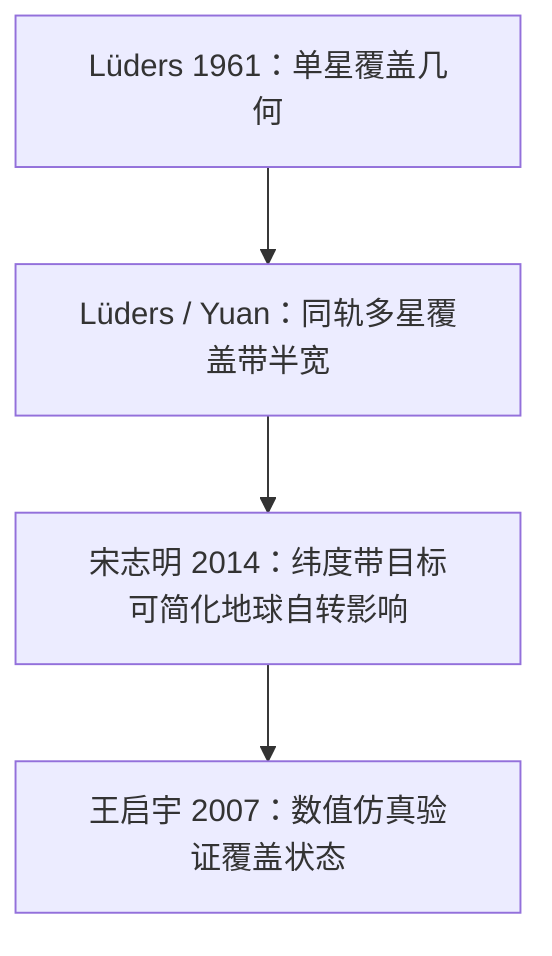

 
# 问题一文献证据与建模依据

> 本文件只整理**问题一**相关论文的可用证据。  
> 暂不完成最终推导，只记录哪些公式/方法可以作为后续建模依据，哪些地方需要继续核验。

## 1. 阅读范围

本轮阅读了参考文献目录中“覆盖几何（问题一）”下的 5 篇文献：

| 文献 | 阅读状态 | 与问题一的关系 |
|:--|:--|:--|
| [[数学建模/第一次/参考文献/星链/MD/02-覆盖几何(问题一)/Luders_1961_Continuous_Zonal_Coverage.md|Lüders 1961]] | 已读文本与关键图 | 单星覆盖几何、单轨道面覆盖带、纬度带连续覆盖核心依据 |
| [[数学建模/第一次/参考文献/星链/MD/02-覆盖几何(问题一)/Lang_1998_Constellation_Comparison_Global_Coverage.md|Lang & Adams 1998]] | 已读文本 | SOC 与 Walker 两类连续覆盖设计方法的综述/比较 |
| [[数学建模/第一次/参考文献/星链/MD/02-覆盖几何(问题一)/Song_2014_Walker_Regional_Coverage.md|宋志明 2014]] | 已读文本与关键图 | Walker 星座对纬度带/全球目标的持续覆盖判定 |
| [[数学建模/第一次/参考文献/星链/MD/02-覆盖几何(问题一)/Wang_2007_Constellation_Coverage_Simulation.md|王启宇 2007]] | 已读文本 | 覆盖仿真框架、重访时间数值法与解析法 |
| [[数学建模/第一次/参考文献/星链/MD/02-覆盖几何(问题一)/Yuan_1997_Multiple_Coverage_Optimal_Design.md|袁仕耿 1997]] | 已读文本与关键图 | 覆盖带法、多重覆盖、相邻轨道相位约束 |

## 2. 问题一的三个小问与文献对应

| 题目要求 | 首选依据 | 辅助依据 | 说明 |
|:--|:--|:--|:--|
| 单星覆盖区几何、地心角、覆盖半径、面积 | Lüders 1961 | 王启宇 2007 | Lüders 给出单星视场半角与地心覆盖半角关系；题给 506 km 应作为公式校验 |
| 倾角圆轨道星下点轨迹与连续覆盖条件 | Lüders 1961、宋志明 2014 | Lang 1998 | Lüders 用覆盖带分析纬度带；宋志明给 Walker 轨迹划分与判定思路 |
| 单轨道面最少卫星数、间距与重叠率曲线 | Lüders 1961、袁仕耿 1997 | 王启宇 2007 | Lüders 的同轨卫星覆盖带半宽公式可给解析关系；王启宇的数值法可用于验证 |

## 3. Lüders 1961：连续纬度带覆盖的核心依据

### 3.1 论文适用对象

Lüders 研究的是由若干圆轨道组成的卫星网络：

- 所有卫星轨道为相同高度的圆轨道；
- 每个轨道面内卫星均匀分布；
- 轨道面倾角相同；
- 轨道面升交点均匀分布；
- 地球视为球体；
- 传感器视锥轴线始终指向当地垂直方向；
- 不考虑会改变相对构型的差分摄动。

这与本题问题一“高度为 $h$、倾角为 $i$、圆轨道上均匀分布 $N$ 颗卫星”的设定高度一致，因此可作为主要理论依据。

### 3.2 单星覆盖几何

Lüders 给出单星可见球面半角 $\theta$、卫星高度 $h$、地球半径 $R_E$、最小可见角 $\sigma$ 的关系：

$$
h=R_E\left[\frac{\cos\sigma}{\cos(\theta+\sigma)}-1\right]
$$

关键图：

![[数学建模/第一次/参考文献/星链/images/images_Luders_1961_Continuous_Zonal_Coverage/ccd2e11006facd56bf49031ddf57093788e84079dde498b47c7de00f23c51ed7.jpg|350]]

对本题的意义：

1. 可用来推导覆盖地心角 $\theta$；
2. 再由 $r_g=R_E\theta$ 或球面距离公式得到地面覆盖半径；
3. 覆盖面积可写成球冠面积：

$$
A=2\pi R_E^2(1-\cos\theta)
$$

> [!warning] 待复核
> 题目给的是“对地通信天线半锥角 $\alpha=40.46^{\circ}$”，而 Lüders 使用的是最小可见角 $\sigma$ 与地心半角 $\theta$。后续推导必须先明确 $\alpha,\sigma,\theta$ 的几何定义转换，不能直接把 $\alpha$ 当作 $\sigma$。

### 3.3 单轨道面覆盖带

Lüders 将同一轨道面内 $n_2$ 颗均匀分布卫星的覆盖圆组合成一条连续覆盖带，覆盖带半宽记为 $\psi$。其关键关系为：

$$
\cos\theta=\cos\psi\cos\frac{\pi}{n_2}
$$

关键图：

![[数学建模/第一次/参考文献/星链/images/images_Luders_1961_Continuous_Zonal_Coverage/7481eab2d6f776a56549488fb1fe632d81c5df6007f14d11c761ab4764e2f813.jpg|450]]

对本题的意义：

- 问题一第（3）问要求“单个轨道面至少需要多少颗卫星”；
- 该式正好给出卫星数 $n_2$、单星覆盖半角 $\theta$、覆盖带半宽 $\psi$ 之间的关系；
- 当 $n_2$ 增大时，轨道方向相邻覆盖圆间距减小，覆盖带半宽 $\psi$ 增大；
- 可据此构造“卫星间距—覆盖重叠率”曲线。

### 3.4 纬度带连续覆盖

Lüders 后续用 $n_1$ 个轨道面、倾角 $i$、覆盖带半宽 $\psi$ 推导连续覆盖纬度带的方程组。问题一只考虑单轨道面，因此主要使用单轨覆盖带公式；问题二多轨道面优化时才需要完整使用其 $n_1$ 轨道面方程组。

### 3.5 可用结论

Lüders 可直接支撑：

- 圆轨道、均匀相位、垂直指向传感器的覆盖假设；
- 单星覆盖半角公式；
- 同轨多星组成连续覆盖带的半宽公式；
- 纬度带连续覆盖作为设计目标的合理性。

但它不能直接解决：

- 中国矩形区域的经纬度边界覆盖；
- 本题问题二的有限经度区域；
- 通信链路与时延；
- 失效与鲁棒性。

## 4. Lang & Adams 1998：SOC 与 Walker 方法的选择依据

### 4.1 论文核心内容

Lang & Adams 比较了两类连续覆盖星座设计方法：

1. **Streets of Coverage（SOC）覆盖街/覆盖带方法**  
   先让单个轨道面形成连续覆盖带，再解析或搜索需要多少条覆盖带覆盖纬度区域或全球。
2. **Walker 方法**  
   用对称圆轨道星座参数 $T/P/F$ 与倾角 $i$ 描述星座，传播星座随时间的位置，寻找所需覆盖圆半径最小的构型。

论文指出，对低中纬度的纬度带覆盖，最优星座通常由节点均匀分布的倾斜轨道面组成；对高纬或含极区的覆盖，极轨方案可能更优。

### 4.2 对问题一的意义

问题一第（3）问是单轨道面纬度带连续覆盖，本质更接近 SOC 方法；问题二的多轨道面星座优化则更接近 Walker 方法。

因此可作为方法选型依据：

- 问题一：优先用 Lüders/SOC 的覆盖带推导；
- 问题二：再引入 Walker 参数化和仿真优化。

### 4.3 不能直接采用的地方

Lang & Adams 的主要结果是全球或宽纬度带连续覆盖表格，且强调实际星座选择不一定只最小化卫星数，还受发射、备份、成本等因素影响。问题一只需要覆盖几何，不应直接引用其表格作为本题答案。

## 5. 宋志明 2014：Walker 星座区域覆盖判定

### 5.1 Walker 参数化

论文采用 Walker 星座 $T/P/F$ 表示法，其中：

- $T$：卫星总数；
- $P$：轨道面数；
- $F$：相邻轨道面相位参数。

第 $i$ 个轨道面第 $j$ 颗卫星的升交点赤经与相位为：

$$
\left\{
\begin{array}{l}
\Omega=\Omega_0+(i-1)\dfrac{2\pi}{P}\\
u=u_0+(i-1)F\dfrac{2\pi}{T}+(j-1)P\dfrac{2\pi}{T}
\end{array}
\right.
$$

该公式更适用于问题二，但问题一讨论“同一轨道面均匀分布 $N$ 颗卫星”时，也可以将其退化为单轨道面相位均匀分布。

### 5.2 地球自转处理

宋志明的定理指出：对于全球或纬度带目标，在分析持续覆盖时，可转化为天球系下的纬度带覆盖；换言之，对于**纬度带目标**，地球自转不改变持续覆盖结论。

这对问题一非常重要：

- 问题一第（3）问目标是 $30^{\circ}\mathrm{N}\sim50^{\circ}\mathrm{N}$ 纬度带；
- 纬度带对经度旋转不变；
- 因此可在问题一中简化地球自转影响。

> [!warning] 限制
> 这个结论不能直接推广到问题二的中国矩形区域，因为中国区域有固定经度边界，并不是经度旋转不变的纬度带。

### 5.3 星下点轨迹划分与特征区域

论文利用 Walker 星座星下点轨迹的拓扑关系，把地球表面划分为特征区域，只需分析少数区域即可判断全球或纬度带持续覆盖。

关键图：

![[数学建模/第一次/参考文献/星链/images/images_Song_2014_Walker_Regional_Coverage/2e78cfe251e59a229038f474cb15785a3cf2a2d4140d2b2234bd3c58c1fdc079.jpg|450]]

对本题的意义：

- 如果问题二采用 Walker 构型，可用该思想减少覆盖判定范围；
- 对问题一，可引用其“纬度带可忽略地球自转”的理论说明；
- 但单轨道面最少卫星数仍以 Lüders 的覆盖带公式为主。

### 5.4 论文自身限制

宋志明 2014 明确指出，其方法主要判断是否完全覆盖；若不能完全覆盖，不能直接给出覆盖率。因此本题问题二需要覆盖率、平均覆盖重数、最大覆盖间隙时间时，仍需数值仿真或其他指标计算框架。

## 6. 王启宇 2007：覆盖仿真的验证框架

### 6.1 数值法覆盖判定

王启宇提出的数值法思路是：

1. 用轨道动力学模型产生卫星星下点轨迹和时间序列；
2. 根据卫星与目标区域的几何关系判断覆盖情况；
3. 由覆盖状态随时间变化推算重访时间或覆盖性能。

这适合作为本题解析公式的校验框架。

### 6.2 重访时间公式

论文给出平均重访时间和重访概率的关系：

$$
P_{\text{revisit}}=\frac{T_{\text{period}}}{T_{\text{revisit}}}
$$

并用覆盖面积比例表示重访概率：

$$
\frac{S_{\text{covered}}}{S_{\text{Total}}}=P_{\text{revisit}}
$$

多颗卫星平均重访时间满足：

$$
\frac{1}{T}=\frac{1}{T_1}+\frac{1}{T_2}+\cdots+\frac{1}{T_i}
$$

### 6.3 对问题一的使用方式

问题一要求的是连续覆盖与最少卫星数，不是平均重访时间。因此王启宇 2007 不适合作为主推导依据，但适合作为：

- 仿真验证方法；
- 覆盖状态时间序列生成方法；
- 后续画“卫星间距—覆盖重叠率/间隙时间”曲线的程序框架依据。

### 6.4 需要注意的限制

该文主要面向稀疏星座的非连续局部覆盖和重访时间分析。若直接用于本题连续覆盖，需要把评价指标从“平均重访时间”改为：

- 是否存在覆盖空窗；
- 最大覆盖间隙时间；
- 同一时刻覆盖重数；
- 目标纬度带全域覆盖状态。

## 7. 袁仕耿 1997：覆盖带法与多重覆盖约束

### 7.1 覆盖带基本关系

袁仕耿采用覆盖带技术研究一般倾斜轨道星座的全球多重连续覆盖。对同一轨道面内均匀分布的卫星，其覆盖带半宽写为：

$$
C_j=\arccos\left(\frac{\cos\theta}{\cos(j\pi/S)}\right)
$$

其中：

- $S$：单轨道面内卫星数；
- $\theta$：单星有效覆盖圆半径对应的地心角；
- $j$：同一轨道面所能提供的覆盖重数；
- $C_j$：$j$ 重覆盖带半宽。

关键图：

![[数学建模/第一次/参考文献/星链/images/images_Yuan_1997_Multiple_Coverage_Optimal_Design/01c2af42c151523e00390edc0e654b538ae85a89e4d5ab5d37d806cb9c155d03.jpg|450]]

### 7.2 对问题一的意义

对问题一单轨道面覆盖：

- 可取 $j=1$ 得到单重覆盖带半宽；
- 可用 $S=N$ 表示单轨道面卫星数；
- 可将 $C_1$ 与 Lüders 的 $\psi$ 进行符号统一；
- 该式有助于构造“卫星数—覆盖带半宽—重叠程度”的关系。

### 7.3 对后续问题的意义

袁仕耿 1997 还推导了相邻轨道同向区、反向区的约束方程，考虑了相邻轨道间相对相位。该部分对问题二多轨道面设计和问题四二重覆盖更有价值。

但由于本题问题一只要求单轨道面，暂不展开相邻轨道约束。

## 8. 综合判断：问题一建模应采用的依据组合

### 8.1 主线

问题一可采用如下文献支撑链：

### 8.2 建议的推导顺序

1. 先建立单星覆盖几何，求覆盖地心角 $\theta$、覆盖半径 $r_g$、覆盖面积 $A$；
2. 代入题给 $h=550$ km 与天线半锥角，复核题给覆盖半径约 506 km；
3. 用 Lüders/Yuan 的覆盖带公式，建立 $N$ 与覆盖带半宽 $\psi$ 的关系；
4. 对 $30^{\circ}\mathrm{N}\sim50^{\circ}\mathrm{N}$ 纬度带，判断单轨道面能否形成连续覆盖；
5. 用数值仿真生成覆盖状态曲线，验证解析得到的最小 $N$；
6. 计算相邻卫星覆盖圆的重叠率，画出卫星间距—覆盖重叠率曲线。

## 9. 当前仍需核验的问题

| 待核验点 | 原因 | 建议处理 |
|:--|:--|:--|
| 题给半锥角 $\alpha$ 与 Lüders 的 $\sigma,\theta$ 如何对应 | 符号定义不同，不能直接套公式 | 单独画三角形推导，并用 506 km 反算校验 |
| 单轨道面是否足以覆盖完整纬度带 | 单轨道面覆盖的是沿轨迹的覆盖带，不一定能覆盖所有经度 | 需明确题意是否指“轨道面扫过纬度带”还是“任意时刻整个纬度带” |
| $30^{\circ}\sim50^{\circ}$ 纬度带的“连续覆盖”定义 | 若指任意经度全覆盖，单轨道面通常不可能；若指该轨道面覆盖带连续，则可分析 | 需要在建模说明中定义清楚 |
| MinerU 公式 OCR 可能有误 | 中文论文中部分符号丢失或错位 | 关键公式最终应回看 PDF 或截图 |

## 10. 本轮阅读结论

1. **问题一的主依据应是 Lüders 1961**，因为它直接给出单星覆盖几何和同轨多星覆盖带半宽关系；
2. **袁仕耿 1997 可作为覆盖带法补充**，尤其适合说明覆盖带半宽与同轨卫星数、覆盖重数之间的关系；
3. **宋志明 2014 可用于说明纬度带目标下地球自转的处理**，但不能直接推广到问题二的固定经纬度矩形区域；
4. **王启宇 2007 适合做仿真验证依据**，不应作为连续覆盖解析推导的主依据；
5. **Lang & Adams 1998 适合作为方法分类依据**，说明问题一用 SOC 思路、问题二再用 Walker/优化思路。

下一步应进入：

[[03-问题一单星覆盖几何推导]]

重点只处理单星覆盖几何，并用题给“覆盖半径约 506 km”进行校验。
