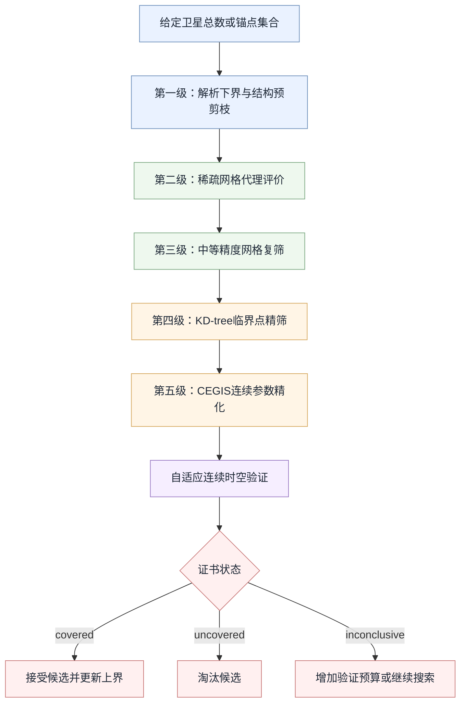

# 17-问题二大规模分层并行快速搜索算法修改方案

> [!abstract] 文档元信息
> - **状态**：算法重构设计稿
> - **适用目录**：`代码/问题二`
> - **前置版本**：已完成初筛完整时域、24 h 活动集、审计字段、失效时长与连续验证控制流修复
> - **核心目标**：在不削弱最终覆盖判定口径的前提下，将当前”全结构高精度搜索”重构为”低成本代理筛选—分层精化—连续验证”的多保真优化流程

---

## 1. 修改背景

现有问题二程序已经建立了完整的 Walker 星座搜索框架，包括：

1. 枚举卫星总数 $S$ 的全部 Walker 离散结构 $(M,N,F)$；
2. 使用 Sobol 序列生成连续参数
   $$
   \theta=(i,\Omega_0,u_0);
   $$
3. 使用 KD-tree 生成球面覆盖临界点并计算覆盖裕度；
4. 使用 Powell 方法优化连续参数；
5. 使用反例驱动方法（CEGIS）补充最坏时空约束；
6. 使用自适应时空盒验证器尝试给出连续覆盖证书。

该框架适合对少量候选进行精细评价与最终验证，但当卫星总数提升至 $400\sim1600$ 时，直接执行全部离散结构的完整临界点筛选会产生很高的计算成本。

因此，当前性能瓶颈并非单纯由计算机配置造成，而是由以下搜索架构决定：

```text
全部Walker结构
→ 全部连续参数样本
→ 完整时间轴
→ KD-tree临界点构造
→ 覆盖裕度计算
→ 少量候选进入CEGIS
```

高成本的精确计算被过早用于大量明显劣质结构，导致粗筛阶段已经接近最终验证的计算强度。

---

## 2. 现有算法的复杂度来源

### 2.1 Walker 离散结构数量

对于给定卫星总数

$$
S=MN,
$$

现有程序保留所有有序因子分解 $(M,N)$，并对每个轨道面数 $M$ 枚举

$$
F=0,1,\ldots,M-1.
$$

因此固定 $S$ 时的 Walker 结构总数为

$$
K_{\mathrm{Walker}}(S)
=\sum_{M\mid S}M
=\sigma(S),
$$

其中 $\sigma(S)$ 为正约数和函数。

若选择如下粗筛锚点，则结构数量为：

| 卫星总数 $S$ | Walker 结构数 $\sigma(S)$ |
|---:|---:|
| 400 | 961 |
| 800 | 1953 |
| 1200 | 3844 |
| 1600 | 3937 |

虽然每个星数的有序因子对数量并不特别大，但对每个因子对完整枚举全部 $F$ 后，离散结构数迅速上升。

### 2.2 完整初筛的计算量

设：

- $K_S$：某个总星数下的 Walker 结构数；
- $n_{\mathrm{sample}}$：每个结构的连续参数样本数；
- $L_t$：初筛时间点数；
- $C_{\mathrm{critical}}(S)$：单个时刻生成和评价临界点的成本。

则现有初筛的主要成本近似为

$$
T_{\mathrm{screen}}(S)
=
O\!\left(
K_S\,
n_{\mathrm{sample}}\,
L_t\,
C_{\mathrm{critical}}(S)
\right).
$$

修复后，6 h、300 s 步长的初筛包含

$$
L_t=\frac{6\times3600}{300}+1=73
$$

个时刻。以 $S=1600$ 为例，即使每个结构只采样一次，也需要评价

$$
3937\times73=287401
$$

个星座时刻。

每个时刻还需要执行：

1. 卫星与目标区域边界交点计算；
2. KD-tree 邻近卫星对查询；
3. 小圆交点生成；
4. 临界点去重；
5. 代表点构造；
6. 覆盖重数和裕度计算。

因此，KD-tree 虽然降低了全量点积和全卫星对计算，但没有消除大规模离散枚举造成的主导成本。

### 2.3 CEGIS 的高成本

对于进入精修的候选，CEGIS 每轮包括：

1. 在活动约束集上进行 Powell 连续优化；
2. 对完整 24 h 时间网格执行分离验证；
3. 提取最坏时空反例；
4. 将反例加入活动集；
5. 重新优化。

若活动集包含 $A$ 个时空约束、局部优化评价次数为 $E$，则单轮连续优化成本近似为

$$
O(EAS).
$$

因此，CEGIS 应仅用于数量很少的高质量候选，不应承担大规模结构粗筛任务。

---

## 3. 修改目标

本次重构需要同时满足以下目标。

### 3.1 计算目标

1. 大幅减少粗筛阶段进入临界点算法的结构数量；
2. 避免在粗筛阶段完整枚举所有相位因子 $F$；
3. 利用多核 CPU 并行评价相互独立的 Walker 结构；
4. 支持断点续跑，防止长时间计算因中断而全部丢失；
5. 在不同卫星总数之间复用优质结构和连续参数；
6. 将高精度 CEGIS 与连续证书严格限制在最终候选集。

### 3.2 正确性目标

1. 最终候选仍使用完整时间轴和 KD-tree 临界点评价；
2. 最终连续参数优化仍覆盖 24 h 时间域；
3. 最终判定仍由 CEGIS 收敛条件和自适应连续验证器完成；
4. 代理筛选只负责排序和剪枝，不直接作为可行性证明；
5. 不将启发式“未找到解”表述为严格不可行；
6. 不因追求速度重新引入不完整时间轴排名问题。

### 3.3 结果目标

程序最终应区分以下状态：

```text
proxy_rejected
screened_candidate
numerically_feasible
cegis_converged
certificate_covered
certificate_uncovered
certificate_inconclusive
```

只有状态为 `certificate_covered` 的候选，才可作为当前模型下通过连续覆盖验证的方案。

---

## 4. 总体算法架构

新的搜索器采用五级多保真评价。



各层的定位如下：

| 层级 | 评价方法 | 主要作用 | 是否可作最终结论 |
|---|---|---|---|
| 第一级 | 解析下界、因子结构规则 | 排除明显不合理结构 | 否 |
| 第二级 | 稀疏网格、少量时刻、抽样 $F$ | 快速数量级筛选 | 否 |
| 第三级 | 中等网格、较多时刻 | 稳定候选排序 | 否 |
| 第四级 | KD-tree 临界点 | 精确离散时域评价 | 数值结论 |
| 第五级 | CEGIS + 自适应验证 | 连续参数精化与连续覆盖验证 | 是，限证书通过 |

---

## 5. 第一级：结构预剪枝

### 5.1 保留全部因子对，抽样相位因子

粗筛阶段不再对每个轨道面数 $M$ 完整枚举全部

$$
F=0,\ldots,M-1.
$$

改为从相位区间中均匀抽取 $K_F$ 个代表值：

$$
F_j
=
\left\lfloor
\frac{jM}{K_F}
\right\rfloor,
\qquad
j=0,1,\ldots,K_F-1.
$$

建议默认：

$$
K_F=\min(8,M).
$$

同时补充以下具有明确结构意义的相位：

$$
F\in
\left\{
0,\ 1,\ \left\lfloor\frac{M}{4}\right\rfloor,\ 
\left\lfloor\frac{M}{2}\right\rfloor,\ M-1
\right\},
$$

并对结果去重。

例如 $S=1600$ 时，完整结构数为3937。若该星数有21个有序因子对，且每个因子对最多抽取8个相位，则粗筛离散结构数量可降至约

$$
21\times8=168.
$$

该步骤可在进入覆盖计算之前，将候选数压缩一个数量级以上。

### 5.2 轨道面数的软约束

不直接删除所有极端因子结构，但可以设置优先级。

建议优先评价满足

$$
M_{\min}\le M\le M_{\max}
$$

的结构，其中上下界由以下因素共同决定：

1. 目标区域经度跨度；
2. 覆盖圆角半径；
3. 轨道面间距；
4. 每轨卫星沿轨间距；
5. 纬度可达性；
6. 星座对称性。

可采用软评分：

$$
J_{\mathrm{shape}}
=
-\lambda_1
\left|
\Delta\Omega-\Delta\Omega_{\mathrm{target}}
\right|
-\lambda_2
\left|
\Delta u-\Delta u_{\mathrm{target}}
\right|,
$$

其中

$$
\Delta\Omega=\frac{360^\circ}{M},
\qquad
\Delta u=\frac{360^\circ}{N}.
$$

该评分只调整评价顺序，不作为严格淘汰依据。

### 5.3 倾角候选压缩

现有倾角下界为

$$
i_{\min}
=
\varphi_{\max}-\theta_{\mathrm{cov}}.
$$

粗筛阶段不必立即对整个

$$
[i_{\min},90^\circ]
$$

进行连续随机搜索，可先评价有限候选集：

$$
i\in
\left\{
i_{\min},
i_{\min}+2^\circ,
i_{\min}+5^\circ,
i_{\min}+10^\circ,
60^\circ,
75^\circ,
90^\circ
\right\},
$$

并删除超过 $90^\circ$ 的值。

中等精度阶段再围绕表现最好的倾角执行 Sobol 或局部采样。

---

## 6. 第二级：稀疏网格代理评价

### 6.1 代理评价原则

代理层不生成覆盖圆交点，不构造临界点，只在固定稀疏地面网格和少量时刻上计算覆盖计数及近似裕度。

设代理地面点集为

$$
\mathcal G_{\mathrm{proxy}}
=
\{x_1,\ldots,x_{K_g}\},
$$

代理时间集为

$$
\mathcal T_{\mathrm{proxy}}
=
\{t_1,\ldots,t_{K_t}\}.
$$

建议初始配置：

```text
空间步长：8°～10°
时间点数：7～9
时间范围：覆盖24 h均匀分布
边界点：必须单独加密
```

代理评价的核心计算为：

$$
D_{p,s,t}
=
x_p^\mathsf{T}r_s(t),
$$

若

$$
D_{p,s,t}\ge\cos\theta_{\mathrm{cov}},
$$

则第 $s$ 颗卫星在时刻 $t$ 覆盖点 $p$。

该计算可通过 NumPy 批量矩阵乘法完成，不需要逐个生成球面临界点。

### 6.2 代理指标

对每个候选计算：

1. 代理最小覆盖重数
   $$
   C_{\min}^{\mathrm{proxy}};
   $$

2. 代理全覆盖时刻比例
   $$
   R_t^{\mathrm{proxy}}
   =
   \frac{1}{K_t}
   \sum_{t}
   \mathbf 1
   \left[
   \min_p C_{p,t}\ge q
   \right];
   $$

3. 代理空间覆盖率
   $$
   R_x^{\mathrm{proxy}}
   =
   \frac{1}{K_t}
   \sum_t
   \frac{
   \sum_p w_p\mathbf 1[C_{p,t}\ge q]
   }{
   \sum_p w_p
   };
   $$

4. 第 $q$ 近卫星的近似覆盖裕度
   $$
   m_{\min}^{\mathrm{proxy}}
   =
   \min_{p,t}
   \left(
   d^{(q)}_{p,t}
   -
   \cos\theta_{\mathrm{cov}}
   \right);
   $$

5. 代理最大连续失效时长
   $$
   G_{\max}^{\mathrm{proxy}}.
   $$

综合排序分数可定义为：

$$
J_{\mathrm{proxy}}
=
w_1 C_{\min}^{\mathrm{proxy}}
+w_2 R_t^{\mathrm{proxy}}
+w_3 R_x^{\mathrm{proxy}}
+w_4 m_{\min}^{\mathrm{proxy}}
-w_5\frac{G_{\max}^{\mathrm{proxy}}}{T}.
$$

建议采用字典序排序，而不是过度依赖人为权重：

```text
C_min_proxy
→ min_margin_proxy
→ full_time_rate_proxy
→ weighted_coverage_rate_proxy
→ -max_gap_proxy
```

### 6.3 边界加密

目标区域边界往往是最容易失效的位置。代理网格必须包含：

1. 四个角点；
2. 四条边界上的等距点；
3. 最高纬度边界；
4. 最低纬度边界；
5. 经度两端边界。

内部网格可以较稀疏，但边界步长应不大于内部步长的一半。

### 6.4 代理层淘汰规则

建议每个卫星总数保留：

- 前 $B_M$ 个轨道面结构；
- 每个轨道面结构前 $B_F$ 个相位；
- 总计前 $K_1$ 个候选。

默认可设置：

```text
B_M = 12
B_F = 4
K_1 = 48
```

为防止代理误判，可额外保留：

1. 每个因子对的最佳候选；
2. 倾角边界候选；
3. 随机探索候选；
4. 上一卫星总数的优质结构映射候选。

---

## 7. 第三级：中等精度复筛

中等精度层仍使用固定网格，但提高时空分辨率。

建议配置：

```text
内部空间步长：4°
边界空间步长：1°～2°
时间点数：25～49
连续参数样本：每结构2～4个
保留候选数：12～20个
```

该层主要解决稀疏代理排序不稳定的问题。

中等精度复筛应对第二级候选执行：

1. 倾角邻域采样；
2. RAAN 初相位邻域采样；
3. $u_0$ 邻域采样；
4. 相位因子邻域扩展
   $$
   F-1,\ F,\ F+1;
   $$
5. 相邻轨道面数结构的可行映射。

最终保留前 $K_2$ 个候选进入 KD-tree 临界点精筛。

建议：

$$
K_2=12.
$$

---

## 8. 第四级：KD-tree 临界点精筛

该层复用现有 `q2_kdtree_coverage.py`，不降低最终离散时域评价精度。

建议配置：

```text
初筛时长：6 h
初筛时间步长：300 s
完整评价时刻：73
include_representatives：True
提前终止：关闭
```

必须保持：

```python
stop_if_margin_below=None
```

因为候选之间需要在相同完整时间轴上进行公平排序。

每个卫星总数仅将中等精度层保留的 $K_2$ 个候选送入该层，而不是重新枚举全部 Walker 结构。

精筛后保留：

$$
K_3=5\sim10
$$

个候选进入 CEGIS。

---

## 9. 第五级：CEGIS 与连续验证

### 9.1 CEGIS 配置

CEGIS 初始活动约束集和分离验证必须使用相同的24 h时间域。

建议正式配置：

```text
活动集时间步长：900 s
分离时间步长：120 s
最大CEGIS轮数：6～10
局部最大评价次数：200～400
```

对候选执行：

$$
\max_{\theta}
\min_{(x,t)\in\mathcal A}
m(x,t;\theta),
$$

其中 $\mathcal A$ 为当前活动约束集。

每轮使用分离器求解：

$$
(x^*,t^*)
=
\arg\min_{x\in\mathcal D,\ t\in\mathcal T}
m(x,t;\theta).
$$

若

$$
m(x^*,t^*)<-\varepsilon,
$$

则将该反例加入活动集并继续优化。

### 9.2 连续时空验证

只有满足以下条件的候选才进入连续验证：

```text
c_min >= q
min_margin >= -tolerance
cegis_converged = True
```

连续验证器可能返回：

- `covered`：接受；
- `uncovered`：拒绝；
- `inconclusive`：增加盒子预算或继续搜索。

程序不得在 `uncovered` 或 `inconclusive` 时停止整个卫星总数搜索。

---

## 10. 多进程并行设计

### 10.1 并行粒度

不同 Walker 结构之间相互独立，适合使用进程级并行。

推荐并行任务单元：

```text
一个离散结构
+ 一组连续参数样本
+ 指定代理时间网格
```

建议使用：

```python
concurrent.futures.ProcessPoolExecutor
```

而不是线程池。原因是：

1. 临界点构造包含大量 Python 和 SciPy 计算；
2. 进程可避免全局解释器锁限制；
3. 单个任务数据边界清晰；
4. 任务失败容易隔离。

默认工作进程数：

$$
n_{\mathrm{worker}}
=
\max(1,n_{\mathrm{CPU}}-1).
$$

必须提供：

```text
--workers
```

参数允许用户手动限制进程数和内存占用。

### 10.2 避免嵌套并行

NumPy、SciPy 或 BLAS 可能自行使用多线程。多进程外层并行时，应限制每个进程内部线程数：

```text
OMP_NUM_THREADS=1
MKL_NUM_THREADS=1
OPENBLAS_NUM_THREADS=1
```

否则可能出现进程数与BLAS线程数相乘，导致CPU过度竞争。

### 10.3 确定性

每个结构的随机种子应由以下量确定：

$$
\mathrm{seed}
=
H(S,M,N,F,\mathrm{stage},\mathrm{global\_seed}),
$$

以保证：

1. 单进程和多进程结果一致；
2. 断点续跑不改变样本；
3. 调整任务提交顺序不改变结果。

---

## 11. 跨卫星总数热启动

### 11.1 结构继承

若在总星数 $S$ 下发现优质结构

$$
(M,N,F),
$$

则对邻近总星数 $S'$ 可构造近似结构：

$$
M'
=
\arg\min_{d\mid S'}
|d-M|,
\qquad
N'=\frac{S'}{M'},
$$

并映射相位：

$$
F'
=
\operatorname{round}
\left(
F\frac{M'}{M}
\right)
\bmod M'.
$$

### 11.2 连续参数继承

连续参数可直接作为热启动：

$$
i'=i,\qquad
\Omega_0'
=
\Omega_0\bmod\frac{360^\circ}{M'},
\qquad
u_0'
=
u_0\bmod\frac{360^\circ}{N'}.
$$

热启动候选应与新的 Sobol 探索候选同时保留，避免搜索完全依赖上一星数结果。

### 11.3 反例继承

邻近星数的最坏时空点具有参考价值。可将上一候选的反例集合：

$$
\mathcal A_S
$$

作为新候选活动集的附加初始约束，但不能替代新星数的完整分离验证。

---

## 12. 外层最小卫星数搜索

### 12.1 不采用普通二分搜索

Walker 结构集合随卫星总数变化，且不同总星数的因子分解不同。因此数值可行性不保证严格单调。

不能直接假设：

$$
S\text{ 可行}
\Longrightarrow
S+1\text{ 必然可行}.
$$

所以不应使用未经验证的普通二分法。

### 12.2 推荐搜索流程

采用“锚点定位—分段缩小—局部递增”的流程：

```text
400, 800, 1200, 1600 锚点代理筛选
→ 找到首个表现明显改善或数值可行的锚点
→ 在相邻锚点间按100缩小
→ 按20缩小
→ 在临界区间逐整数搜索
→ 对首个候选提高预算复核
→ 执行连续时空验证
```

### 12.3 停止条件

只有满足以下条件之一才能停止：

1. 找到 `certificate_covered` 候选；
2. 达到用户给定最大卫星数；
3. 达到计算预算并输出 `budget_exhausted`；
4. 连续验证全部未决并输出 `certificate_inconclusive`。

禁止将“未找到候选”直接写成“严格不可行”。

---

## 13. 断点续跑与结果落盘

### 13.1 每任务即时写入

现有程序倾向于在整个总星数完成后统一写入结果。新的调度器应在每个候选或每个结构完成后立即追加：

```text
proxy_records.jsonl
screen_records.jsonl
refined_records.jsonl
```

JSONL 适合逐行追加，并能在程序中断后恢复。

### 13.2 原子检查点

每个阶段完成后先写入临时文件：

```text
checkpoint.tmp
```

再通过原子重命名生成：

```text
checkpoint.json
```

检查点至少包含：

```json
{
  "stage": "proxy",
  "total_satellites": 800,
  "completed_structure_keys": [],
  "pending_structure_keys": [],
  "best_candidates": [],
  "seed": 20260710
}
```

### 13.3 任务状态

每个结构设置状态：

```text
pending
running
completed
failed
skipped
```

重新启动时只运行 `pending`、`failed` 或缺失输出的任务。

---

## 14. 建议模块划分

### 14.1 新增模块

#### `q2_proxy_coverage.py`

负责：

1. 生成稀疏代理网格；
2. 批量计算卫星—地面点点积；
3. 计算代理覆盖重数和裕度；
4. 输出代理指标。

核心接口建议：

```python
evaluate_proxy_constellation(
    params,
    times_s,
    ground_points,
    *,
    q=1,
    config=None,
) -> ProxyCoverageResult
```

#### `q2_structure_pruning.py`

负责：

1. 抽样相位因子；
2. 结构软评分；
3. 保留每因子对最佳候选；
4. 邻域扩展；
5. 跨星数结构映射。

核心接口建议：

```python
sampled_walker_structures(
    total_satellites,
    *,
    phase_samples=8,
    include_special_phases=True,
)
```

#### `q2_parallel_search.py`

负责：

1. 多进程任务提交；
2. 确定性种子；
3. 异常捕获；
4. 超时处理；
5. 结果排序。

#### `q2_checkpoint.py`

负责：

1. JSONL追加；
2. 原子检查点；
3. 恢复任务；
4. 输出完整性验证。

#### `run_q2_hierarchical_search.py`

作为新的统一入口，协调：

```text
结构预剪枝
→ 代理粗筛
→ 中等复筛
→ KD-tree精筛
→ CEGIS
→ 连续验证
```

### 14.2 复用模块

以下模块继续作为高精度后端：

```text
q2_constellation.py
q2_search_space.py
q2_kdtree_coverage.py
q2_active_set.py
q2_adaptive_verify.py
```

原来的：

```text
run_q2_optimized_search.py
```

保留为单个总星数的高精度基准程序和回归测试工具，不再承担400–1600颗的大规模粗筛。

---

## 15. 推荐命令行参数

新的入口建议支持：

```text
--totals 400,800,1200,1600
--phase-samples 8
--proxy-interior-step 8
--proxy-boundary-step 2
--proxy-time-count 9
--proxy-keep-per-total 48
--medium-interior-step 4
--medium-boundary-step 1
--medium-time-count 33
--medium-keep-per-total 12
--exact-keep-per-total 6
--workers 7
--resume
--seed 20260710
--adaptive-verify
```

示例：

```bat
python run_q2_hierarchical_search.py ^
  --totals 400,800,1200,1600 ^
  --phase-samples 8 ^
  --proxy-time-count 9 ^
  --proxy-keep-per-total 48 ^
  --medium-keep-per-total 12 ^
  --exact-keep-per-total 6 ^
  --workers 7 ^
  --resume ^
  --output-dir results_hierarchical
```

---

## 16. 伪代码

```text
输入：
    候选卫星总数集合 S_set
    覆盖重数 q
    各层计算预算

for S in S_set:

    factor_pairs ← 枚举 S 的有序因子对

    proxy_structures ← 空集

    for (M, N) in factor_pairs:
        F_sample ← 抽样代表相位 + 特殊相位
        for F in F_sample:
            生成少量倾角、RAAN、初相位候选
            加入 proxy_structures

    并行评价 proxy_structures 的稀疏网格代理指标

    proxy_top ←
        每因子对保留最佳
        + 全局Top-K
        + 随机探索候选
        + 上一星数热启动候选

    对 proxy_top 执行中等精度网格复筛
    medium_top ← 取前K2并扩展相邻F和连续参数邻域

    对 medium_top 执行完整KD-tree临界点精筛
    exact_top ← 取前K3

    for candidate in exact_top:
        执行24 h CEGIS
        if 数值可行且CEGIS收敛:
            执行连续时空验证
            if certificate == covered:
                记录接受候选
                更新当前可行上界

输出：
    各层全部记录
    候选淘汰原因
    首个数值可行候选
    首个证书通过候选
    计算预算与运行时间
```

---

## 17. 复杂度变化

### 17.1 原始粗筛

$$
T_{\mathrm{old}}
=
O\!\left(
\sigma(S)
n_s
L_t
C_{\mathrm{critical}}(S)
\right).
$$

### 17.2 新代理粗筛

设：

- $d(S)$：正约数个数；
- $K_F$：每因子对抽样相位数；
- $K_i$：倾角等连续参数初始候选数；
- $K_g$：代理地面点数；
- $K_t$：代理时间点数。

则代理层主要成本为

$$
T_{\mathrm{proxy}}
=
O\!\left(
d(S)
K_F
K_i
K_t
K_g
S
\right).
$$

与原算法相比，主要削减来自：

1. $\sigma(S)$ 降为 $d(S)K_F$；
2. 73个时间点降为7～9个；
3. 临界点构造改为固定网格矩阵乘法；
4. 使用多进程并行；
5. 仅少量候选进入高精度层。

粗筛阶段有望获得数量级加速，但具体倍数必须通过基准测试确定，不能在未运行前固定承诺。

---

## 18. 测试方案

### 18.1 单元测试

#### 相位抽样测试

验证：

```text
所有F均满足0 <= F < M
无重复F
特殊相位被包含
M较小时能够退化为完整枚举
```

#### 代理覆盖测试

在固定网格上，代理覆盖计数应与密集点积实现完全一致。

#### 并行确定性测试

同一随机种子下：

```text
workers=1
workers=4
```

应产生相同候选参数、相同排序和相同结果文件。

#### 检查点测试

模拟程序中断后重新启动，已完成结构不得重复运行。

#### 完整相位回退测试

设置：

```text
phase_samples >= M
```

时，抽样结构集合应与原完整结构集合一致。

### 18.2 排序有效性测试

在较小卫星数上同时执行：

1. 全结构KD-tree精确筛选；
2. 新代理筛选。

检查：

- 代理Top-20中包含多少精确Top-10；
- Spearman排序相关系数；
- 首个数值可行结构是否被代理层保留。

建议验收指标：

```text
精确Top-10召回率 >= 80%
代理层相对完整精筛加速 >= 20倍
```

若召回率不足，应增加：

- 相位样本数；
- 边界网格密度；
- 代理时间点数；
- 每因子对保留数量。

### 18.3 端到端测试

至少测试：

```text
S=40：验证无异常并与当前修复版结果口径一致
S=80：验证分层筛选结果完整
S=400：验证性能和断点续跑
```

---

## 19. 性能记录要求

每个阶段应输出：

```text
候选生成数
候选完成数
候选淘汰数
各阶段耗时
平均单候选耗时
峰值内存
工作进程数
最优代理分数
最优精确裕度
CEGIS轮数
证书状态
```

输出文件建议：

```text
q2_hierarchical_summary.json
q2_proxy_records.csv
q2_medium_records.csv
q2_exact_records.csv
q2_refined_records.csv
q2_certificate_records.json
q2_stage_timing.csv
q2_checkpoint.json
```

---

## 20. 论文中的算法表述

论文中可将新算法表述为：

> 针对Walker星座离散结构数量随轨道面数和相位因子快速增长的问题，本文构建多保真分层优化框架。首先利用稀疏时空网格和抽样相位因子建立低成本代理评价，对全部候选进行结构预筛；随后对优质候选逐步提高空间与时间分辨率，并使用KD-tree临界点方法计算区域最坏覆盖裕度；最后采用反例驱动连续参数优化和保守时空盒验证，对数值可行候选进行连续覆盖检验。该方法将高成本几何精确评价限制在少量候选上，同时通过每因子对保留、随机探索和邻域扩展降低代理模型误淘汰优质结构的风险。

对于最优性，应表述为：

> 所得方案为当前Walker参数化、搜索预算及连续验证口径下获得的最小接受星数。由于固定星数下的连续参数优化具有非凸性，且不同星数对应的Walker离散结构集合不完全嵌套，较小星数未找到可行方案不能单独视为严格不可行证明。

---

## 21. 实施顺序

建议按以下顺序修改代码。

### 第一阶段：代理评价器

1. 新建 `q2_proxy_coverage.py`；
2. 实现固定网格批量覆盖计算；
3. 与密集方法进行一致性测试；
4. 输出代理指标。

### 第二阶段：结构抽样与剪枝

1. 新建 `q2_structure_pruning.py`；
2. 实现相位抽样；
3. 实现每因子对保留；
4. 实现结构邻域扩展；
5. 实现跨星数热启动。

### 第三阶段：并行与检查点

1. 新建 `q2_parallel_search.py`；
2. 新建 `q2_checkpoint.py`；
3. 实现确定性种子；
4. 实现JSONL即时落盘；
5. 实现断点恢复。

### 第四阶段：统一入口

1. 新建 `run_q2_hierarchical_search.py`；
2. 串联代理、复筛、精筛、CEGIS与证书；
3. 增加阶段耗时和状态输出；
4. 增加锚点及临界区间搜索逻辑。

### 第五阶段：校准与正式运行

1. 在 $S=40,80$ 上比较代理与精确排序；
2. 调整代理网格和保留数量；
3. 在 $S=400$ 上完成性能基准；
4. 执行 $400,800,1200,1600$ 锚点搜索；
5. 在首个可行区间内逐步缩小；
6. 对最终候选执行高预算CEGIS和连续验证。

---

## 22. 最终结论

当前算法的主要限制不是KD-tree失效，而是：

```text
完整相位枚举
+ 高精度临界点方法使用过早
+ 全结构串行处理
+ 缺少多保真代理层
+ 缺少跨星数热启动
+ 缺少细粒度检查点
```

修改后的核心原则为：

$$
\boxed{
\text{低成本代理覆盖全部候选}
\rightarrow
\text{中等精度稳定排序}
\rightarrow
\text{高精度评价少量候选}
\rightarrow
\text{连续验证最终方案}
}
$$

原有KD-tree、CEGIS和自适应验证器不应删除，而应从“大规模搜索器”中分离出来，作为最终精筛与验证后端。这样既能降低400～1600颗卫星范围内的搜索时间，又能保持最终覆盖判定的严谨性。
