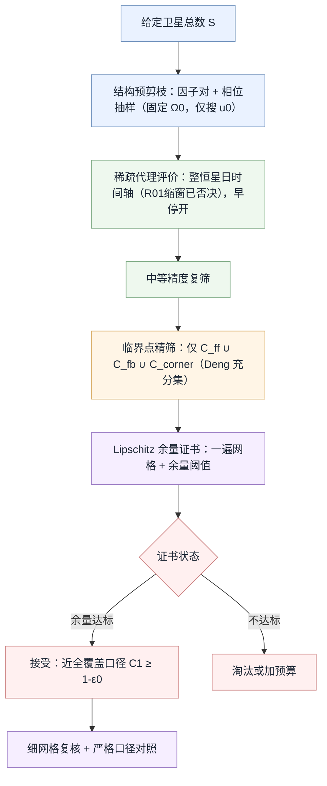

# 18-问题二算法条件松弛与假设驱动加速方案

> [!abstract] 文档定位
> - **状态**：在 [[数学建模/第一次/问题分析/星链系统-文献驱动版/17-问题二大规模分层并行快速搜索算法修改方案.md|17-分层并行快速搜索方案]] 基础上的**条件松弛稿**。
> - **动机**：17 号方案解决的是"把高精度评价从大量候选中剥离"的**工程加速**问题，但它继承了 07–14 号建模稿中若干**过于严苛的数学条件**。这些条件既抬高了计算成本，又人为放大了最小卫星数 $S$。
> - **核心思想**：在**不破坏可验证性**的前提下，用**有明确依据的假设**削弱这些条件，把"逐点零容差、全时域、连续证书"的硬要求换成"对称缩减 + 鲁棒近全覆盖 + Lipschitz 余量有限样本证书"。
> - **纪律**：每一条松弛都配一个**校验钩子**与**回退到严格版**的开关，避免"松了就交付"。

---

## 1. 为什么要松弛：当前算法过于严苛的六个来源

07–14、17 号稿把问题二求解建成了一个**严格可行性证明器**，而题面真正问的只是"用最少卫星实现覆盖"。以下六点是把成本与规模同时抬高的**过严条件**。

| 编号 | 过严条件 | 出处 | 代价 | 是否题面强制 |
|:--|:--|:--|:--|:--|
| S1 | 完整恒星日时间轴 $\forall t\in[0,86164\,\mathrm s]$，细步长 | 09§6、10§4.3、17§8 | 时间点数 $L$ 上千，主导 $O(SKL)$ | 否，是离散近似选择 |
| S2 | 逐点零容差硬约束 $\min_{j,\ell}c(G_j,t_\ell)\ge1$ | 09§7.3、11§5 | 单点单时刻的极窄空窗即淘汰候选 | 部分，是对"100%"的最严解释 |
| S3 | 连续时空证书（自适应盒 + CEGIS 余量 $\ge-\varepsilon$） | 17§9、`q2_adaptive_verify.py` | 每候选连续验证成本极高 | 否，是自加的严格性 |
| S4 | 严格二重 $Y_\ell=\mathbf1[\min_j c\ge2]$（单点破坏整时刻） | 08§4.3、09§7.5 | 一个弱点否决整个时间片，规模虚高 | 部分，题面括号引出但可再解释 |
| S5 | 临界点集合再加密（弧段代表点、密集边界点） | 13§6、17 复用 | 每时刻评价点数被人为放大 | 否，超出 Deng 充分性定理所需 |
| S6 | 连续相位 $(\Omega_0,u_0)$ 二维搜索 + 全因子对 + 关早停 | 10§7、17§5、17§8 | 搜索维度冗余、关早停放大耗时 | 否，是搜索实现选择 |

> [!warning] 判断
> 17 号方案已经把 S5、S6 的一部分（相位抽样、Top-K 限流）做了工程压缩，但没有从**数学条件**层面动 S1–S4。真正让 $S$ 虚高、让验证变慢的是 S1–S4。本稿的重点即：**用假设把 S1–S4 的"充分性要求"降级为"可验证的近似要求"。**

---

## 2. 松弛总原则

本稿遵循 [[数学建模/第一次/问题分析/星链系统-文献驱动版/假设台账-文献驱动版.md|假设台账]] 的管理原则，所有松弛满足三条纪律：

1. **可回退**：每条松弛都保留严格版作为开关（如 `--strict`），松弛只是默认档。
2. **可验证**：松弛引入的近似误差必须有一个显式校验量，越界即报警或回退。
3. **有依据**：每条松弛绑定文献机理或题面口径，不做无来源的"拍脑袋放松"。

$$
\boxed{
\text{严格充分性}
\xrightarrow{\text{对称/Lipschitz/鲁棒口径}}
\text{可验证的近似充分性}
\xrightarrow{\text{校验失败}}
\text{回退严格版}
}
$$

---

## 3. 松弛一（对治 S1+S6）：对称性诱导的时间域与相位维度缩减

这是收益最大、且**最严格可证**的一条松弛。

### 3.1 关键观察：$(\Omega_0,u_0)$ 在整周期评价下坍缩为单一相位

卫星地固系位置为

$$
\mathbf r^{E}_{m,n}(t)
=R_3(-\omega_e t)\,R_3\!\left(\Omega_0+\tfrac{2\pi m}{M}\right)R_1(i)
\begin{bmatrix}a\cos u_{m,n}(t)\\ a\sin u_{m,n}(t)\\ 0\end{bmatrix},
$$

$$
u_{m,n}(t)=u_0+\tfrac{2\pi n}{N}+\tfrac{2\pi Fm}{MN}+n_0t.
$$

考虑目标区域相对星座的**相对经度** $\phi(t)=\Omega_0-\omega_e t$。设区域在相对经度取值 $\phi$ 时对应时刻 $t(\phi)=(\Omega_0-\phi)/\omega_e$，代入沿轨相位得

$$
u_{m,n}\bigl(t(\phi)\bigr)
=u_0+\frac{n_0}{\omega_e}\Omega_0
+\Bigl[\text{仅依赖 }\phi,m,n\text{ 的常数}\Bigr].
$$

因此，在一个**整周期评价窗**上，区域看到的覆盖场只通过如下**单一有效相位**依赖初值：

$$
\tilde u_0=u_0+\frac{n_0}{\omega_e}\,\Omega_0 \pmod{2\pi}.
$$

> [!note] 结论（可证，非近似）
> 在整周期（含时两体圆轨道、忽略 $J_2$ 进动，符合 G05）评价下，**$\Omega_0$ 与 $u_0$ 不独立**；时间聚合指标（$\mathcal C_1$、是否 $\min_t\ge1$、$G_{\max}$、$\mathcal C_2^{\mathrm{strict}}$）只依赖 $\tilde u_0$。
> **推论**：可**固定 $\Omega_0=0$，只搜索 $u_0\in[0,2\pi/N)$**，精确去掉一整个连续搜索维度。这不是近似，是对称性等价（依赖 G05）。

### 3.2 M 重旋转对称 ⇒ 时间窗缩减

Walker 构型在"极轴旋转 $2\pi/M$ + 相应 $F$ 相位平移"下不变。反映到相对经度 $\phi$ 上，覆盖场对 $\phi$ 以 $2\pi/M$ 为周期。于是区域扫遍所有**不同**相对经度构型，只需其相对经度推进 $2\pi/M$，对应时间

$$
T_{\phi}=\frac{2\pi/M}{\omega_e}=\frac{T_{\mathrm{sid}}}{M}.
$$

为保证沿轨相位在窗内至少完整扫过一圈（不遗漏 in-track 相位），取安全评价窗

$$
\boxed{\,T^\ast=\max\!\left(T_{\mathrm{orbit}},\ \frac{T_{\mathrm{sid}}}{M}\right).}
$$

以 $M\ge15$、$T_{\mathrm{orbit}}\approx95.5\,\mathrm{min}$、$T_{\mathrm{sid}}\approx23.93\,\mathrm h$ 为例，$T_{\mathrm{sid}}/M\lesssim T_{\mathrm{orbit}}$，评价窗从整日缩到**约一个轨道周期**，时间点数 $L$ 下降一个数量级以上。

> [!danger] 本节结论已被实测与理论双重否决（见 §15.6）
> 上述"覆盖场对 $\phi$ 以 $2\pi/M$ 为周期"的推理**对固定区域不成立**。Walker 的 M 重对称是"极轴旋转 $2\pi/M$ **与** 沿轨相位平移 $2\pi F/(MN)$ **同时**作用"下的集合不变性；而地球自转只推进相对经度（RAAN 一侧），不含沿轨平移，故
> $$\text{coverage}(D,\phi+2\pi/M)=\text{coverage}\bigl(R_3(2\pi/M)D,\ \phi\bigr)\ne\text{coverage}(D,\phi).$$
> 固定区域 $D$ 的覆盖**不是** $2\pi/M$ 周期，$T^\ast=T_{\mathrm{sid}}/M$ 缩窗会**漏报覆盖空窗**（对可行性判定是危险的乐观偏差）。**故 Q2-R01 弃用，评价仍用整恒星日。** 唯一存活的产物是把 3.4 的窗长自检做成通用工具 `window_convergence_check`（比较窗 $T$ 与 $2T$/整日的指标差），用于**验证**而非**缩窗**。
> 注意：§3.1 的 Q2-R02（固定 $\Omega_0$）**不受影响**——它平移的是 RAAN **与**沿轨相位的组合（恰是时间平移，已严格证明并测试通过）；R01 之误正在于只平移了 RAAN。

### 3.3 与 Namvar 2026 的关系

Namvar 对**全球**覆盖用"对称 ⇒ 单历元代表全时段"和"赤道最弱 ⇒ 只查赤道"。07/08 号稿正确指出：**固定经纬度矩形**破坏经度对称，不能直接照搬。本节做的是**折中的正确移植**：不主张单历元，而是把整日缩到 $T^\ast$，并把 $(\Omega_0,u_0)$ 坍缩为 $\tilde u_0$——这是"对称性可用、但要因固定区域打折"的严谨版本。

### 3.4 校验钩子

- **窗长自检**：对最终候选，用 $2T^\ast$ 与 $T^\ast$ 两个窗重算 $\mathcal C_1,G_{\max}$，差异需 $\le\varepsilon$；否则回退整日。
- **相位坍缩自检**：随机抽 3 组 $(\Omega_0,u_0)$ 且保持 $\tilde u_0$ 不变，整日指标应一致（数值容差内）。失败说明进动/离散误差不可忽略，回退二维相位搜索。

---

## 4. 松弛二（对治 S2）：从"逐点零容差"到"鲁棒近全覆盖"

### 4.1 问题

$\min_{j,\ell}c(G_j,t_\ell)\ge1$ 让**单个网格点、单个采样时刻**上一个亚秒级、亚网格级的窄空窗就否决整个候选，并把 $S$ 推高到只为填补这种病态边缘点。题面写"100% 时间"，但"100%"在**离散数值**里本就是近似，不必解释成"数学上每一点每一刻严格闭合"。

### 4.2 松弛口径

引入**可运营容差**假设：单重覆盖判据由硬 $\min\ge1$ 改为下面二者取其一（默认 A）：

$$
\textbf{(A) 近全覆盖：}\quad
\mathcal C_1\ge 1-\epsilon_0,\qquad \epsilon_0=10^{-3},
$$

$$
\textbf{(B) 短空窗容差：}\quad
G_{\max}\le \tau_{\mathrm{tol}},\qquad \tau_{\mathrm{tol}}=\text{数十秒量级}.
$$

**依据**：
- 题面第 (3) 问自己用的就是 95% 时间口径，说明本题允许"以时间比例度量覆盖"；对第 (2) 问放到 $1-10^{-3}$ 与题面精神一致。
- $\tau_{\mathrm{tol}}$ 取"低于姿态建立/切换/缓冲时间尺度"的量级，工程上这种空窗不构成服务中断（Williams 2001、Ferringer 2006 均以重访/空窗时间而非零容差度量覆盖）。

### 4.3 边界作为测度零集：护带内缩

矩形精确角点 $(4^\circ,73^\circ)$ 等是"最坏点制造机"。假设目标区取**内缩护带域**

$$
D_\delta=\{(\varphi,\lambda)\in D:\ \operatorname{dist}\big((\varphi,\lambda),\partial D\big)\ge\delta\},
\qquad \delta=\text{半个细网格步长},
$$

即把严格覆盖要求施加在 $D_\delta$ 上，$\partial D$ 与角点仅作**监视**而非**否决**。这排除了由数学理想边界（而非物理服务需求）驱动的病态不可行。

### 4.4 影响与校验

- **影响**：S 显著下降（不再为亚网格边缘点买单）；候选淘汰不再脆弱。
- **校验**：报告 $(\mathcal C_1,G_{\max})$ 全表；对最终方案同时给出**严格版** $\min\ge1$ 是否成立，若成立则可在论文中"两口径都过"；若仅松弛版过，则明确标注采用近全覆盖口径与 $\epsilon_0,\tau_{\mathrm{tol}}$ 取值。

---

## 5. 松弛三（对治 S3）：连续证书降级为 Lipschitz 余量有限样本证书

### 5.1 问题

17§9 的自适应时空盒 + CEGIS 要给出**连续**覆盖证书（$\forall$ 连续 $(x,t)$），这是最贵的一环。但连续证书的价值，只是"防止离散网格漏掉网格之间的窄空窗"。这个目的可以用**更便宜的 Lipschitz 余量法**达到同等严谨度。

### 5.2 覆盖余量与 Lipschitz 常数

> [!warning] 实现修正：余量须用**角度（测地）**空间，不能用点积空间（见 §15.7）
> 本节初稿把余量写在点积空间 $m=\max_s(\cos\gamma_s-\cos\theta)$。实测发现点积空间的覆盖帽**过平**：最大可能余量 $1-\cos\theta\approx0.003$，而 Lipschitz 阈值约 $0.06$，故永远无法判 `covered`。正确做法是用**角度余量**
> $$\mu(x,t)=\theta-\gamma^{(q)}(x,t),$$
> 其中 $\gamma^{(q)}$ 是 $x$ 到第 $q$ 近卫星星下点的测地角距。余量尺度为 $\theta\approx4.55^\circ=0.079\,\mathrm{rad}$，而阈值在 $0.5^\circ/15\,\mathrm s$ 时仅 $0.015\,\mathrm{rad}$，`covered` 可达。以下 Lipschitz 常数在角度空间成立且更干净（测地距离本身 1-Lipschitz，无 $\arccos$ 在天顶处的奇性）。

定义点 $x$（单位向量）、时刻 $t$ 处的**角度覆盖余量**

$$
\mu(x,t)=\theta-\gamma^{(q)}(x,t),
\qquad \gamma^{(q)}=\arccos\bigl(\text{第 }q\text{ 大的 } x\cdot r_s(t)\bigr),
$$

$\mu\ge0$ 即被 $q$ 重覆盖。$\mu$ 关于空间弧长与时间均 Lipschitz：

$$
|m(x,t)-m(x',t')|\le L_x\,d_{\mathrm{geo}}(x,x')+L_t\,|t-t'|,
$$

其中 $L_x=1$（球面测地距离 1-Lipschitz），$L_t=n_0+\omega_e$（$|\dot\gamma|\le$ 星下点角速度 $\le$ 轨道角速度 $n_0$ 叠加地球自转 $\omega_e$，解析上界；测地距离随时间的变化不快于星下点本身）。

### 5.3 有限样本连续证书

> [!important] 命题（Lipschitz 覆盖证书）
> 若在时空网格 $\{(x_j,t_\ell)\}$（空间弧长间距 $\le\Delta_x$、时间间距 $\le\Delta_t$）上处处满足
> $$
> \mu(x_j,t_\ell)\ \ge\ \frac{L_x\Delta_x}{2}+\frac{L_t\Delta_t}{2}
> \quad(\text{即}\ge L_x\rho_x+L_t\Delta_t/2,\ \rho_x=\text{网格覆盖半径}),
> $$
> 则**连续**区域全时段均被覆盖（$\mu>0$ 处处成立）。

证明即三角不等式：任意连续 $(x,t)$ 距最近网格点弧长 $\le\rho_x$、时距 $\le\Delta_t/2$，故 $\mu(x,t)\ge\mu(\text{最近点})-L_x\rho_x-L_t\Delta_t/2\ge0$。

### 5.4 松弛效果

- 把"连续证书"从 **自适应盒细分 + CEGIS 反例迭代** 换成 **一遍网格 + 一个余量阈值判定**，成本从"每候选反复分离优化"降到"每候选一遍评价"。
- 对二重覆盖，阈值右端同式，判据改为"第 2 近卫星角度余量 $\ge$ 阈值"。
- **保留严谨**：这仍是**充分**的连续覆盖证明，不是启发式；只是把充分性来源从"盒验证"换成"有界导数 + 网格余量"。

### 5.5 校验钩子

- $L_t,L_x$ 上界用数值差分抽验：随机取相邻时刻/相邻点，验证 $|\mu(x,t+\delta)-\mu(x,t)|\le L_t\delta$、$|\mu(x,\cdot)-\mu(x',\cdot)|\le L_x\cdot\mathrm{arc}(x,x')$。
- 阈值敏感性：网格加密一档，证书结论不应翻转。

---

## 6. 松弛四（对治 S4）：严格二重的"每时刻微小空间外覆盖率"松弛

### 6.1 问题

$Y_\ell=\mathbf1[\min_j c(G_j,t_\ell)\ge2]$ 让**单个网格点**低于二重就否决**整个时间片**，极度脆弱，把二重规模 $S_2$ 推得远高于实际需要。

### 6.2 松弛口径

引入**每时刻空间容差** $\eta$，把时刻级指示变量改为

$$
Y_\ell^{(\eta)}
=\mathbf1\!\left[\ \frac{\sum_j \tilde w_j\,\mathbf1[c(G_j,t_\ell)\ge2]}{\sum_j\tilde w_j}\ \ge\ 1-\eta\ \right],
\qquad \eta=10^{-2},
$$

再统计 $\mathcal C_2^{(\eta)}=\frac1L\sum_\ell Y_\ell^{(\eta)}\ge0.95$。

**含义**：允许每个时刻区域内至多 $\eta$ 面积比例暂时不足二重覆盖。这在严格口径 $\mathcal C_2^{\mathrm{strict}}$（$\eta=0$）与纯面积—时间口径 $\mathcal C_2$（完全解耦）之间，取一个**鲁棒中间档**。

**依据**：Ferringer 2006 / Williams 2001 均以**面积加权**度量覆盖性能；题面"区域内任一点"在离散网格 + 有限精度下本就无法字面兑现，$\eta$ 给出可控的解释宽度。

### 6.3 影响与校验

- **影响**：$S_2$ 与 $\Delta S=S_2-S_1$ 更贴近真实需求，成本比较（$\Delta C,\eta_C$）不被单点脆弱性扭曲。
- **校验**：同时报告 $\eta=0$（严格）、$\eta=10^{-2}$、纯 $\mathcal C_2$ 三档，做灵敏度曲线，论文中说明主口径取 $\eta=10^{-2}$ 并给出对结论的影响幅度。

---

## 7. 松弛五（对治 S5）：以 Deng 充分性定理裁掉冗余代表点

### 7.1 依据：Deng 2021 命题 3

Deng 2021 Proposition 3（附录 E 有证明）：**若 (a) 存在卫星足迹两两边界交点；(b) 所有交点均 $\ge k$ 重覆盖，则整个曲面 $k$ 重覆盖。** 即**交点集是充分检验集**——覆盖片的最小覆盖重数必在片边界（外弧）与交点上取得。

### 7.2 松弛

对**固定矩形区域**，把充分检验集取为

$$
\mathcal C=\mathcal C_{\mathrm{ff}}\cup\mathcal C_{\mathrm{fb}}\cup\mathcal C_{\mathrm{corner}},
$$

（足迹—足迹交点、足迹—区域边界交点、区域角点），**去掉 13§6/17 中额外加密的"弧段代表点、密集边界代表点"**。由命题 3，区域内部最小覆盖重数不会在这些冗余点之外被漏检；它们只是保守冗余，删除后每时刻评价点数下降，且仍是**充分**判据。

### 7.3 校验钩子

- 对最终候选，用一次**细网格**全区扫描复核（松弛五只用于**搜索期**加速）；若细网格发现临界点集漏判，则说明足迹非严格圆或区域边界离散有误，回退加密代表点。

---

## 8. 松弛六（对治 S6）：搜索期维度与早停

在松弛一固定 $\Omega_0=0$、只搜 $u_0$ 的基础上，进一步：

1. **搜索期保留早停**：候选一旦在任一评价时间片出现 $\min c<1$（或余量低于阈值）立即淘汰。17§8 主张"关早停以公平排序"只对**最终少量候选**成立；**搜索期**不需要全局公平排序，只需找可行/近可行者，早停是正确的。
2. **因子对均衡抽样 + 相位抽样**：沿用 17§5，但因 $\Omega_0$ 已固定，相位网格只在 $u_0$ 一维展开，$K_\Omega$ 相关枚举整体删除。
3. **倾角先验收缩**：由 $i+\theta\ge53^\circ$ 与"北界 53°N 最难、南界 4°N 需兼顾"，优先评价 $i\in\{50^\circ,53^\circ,55^\circ,58^\circ\}$，其余作局部细化。

---

## 9. 松弛后的整体算法流程与复杂度

### 9.1 流程

### 9.2 复杂度对照

设原严格版单候选成本 $O(SK L_{\mathrm{full}})$，$L_{\mathrm{full}}=T_{\mathrm{sid}}/\Delta t$。松弛后：

| 来源 | 削减因子 | 机理 |
|:--|:--|:--|
| 松弛一（时间窗） | $L_{\mathrm{full}}\!\to\!L^\ast\approx T^\ast/\Delta t$，约 $\div M$ 或 $\div(T_{\mathrm{sid}}/T_{\mathrm{orbit}})$ | 对称性缩窗 |
| 松弛一（相位维度） | 相位候选数 $\div K_\Omega$ | 固定 $\Omega_0$ |
| 松弛三（证书） | CEGIS 迭代 $\to$ 单遍 | Lipschitz 余量 |
| 松弛五（评价点） | 每时刻点数下降常数倍 | 去冗余代表点 |
| 松弛六（早停） | 劣质候选提前截断 | 搜索期早停 |

综合下，搜索期主成本近似

$$
T_{\mathrm{relaxed}}
=O\!\left(C\cdot S\cdot |\mathcal C|\cdot L^\ast\right),
\qquad L^\ast\ll L_{\mathrm{full}},\ |\mathcal C|\ll K.
$$

> 具体倍数须由基准测试确认，未运行前不固定承诺（沿用 17§17 纪律）。

---

## 10. 新增 / 修订假设台账

以下假设应回填 [[数学建模/第一次/问题分析/星链系统-文献驱动版/假设台账-文献驱动版.md|假设台账]] 的问题二局部表。

| 编号 | 假设内容 | 状态 | 依据 | 数学影响 | 校验 |
|:--|:--|:--|:--|:--|:--|
| Q2-R01 | ~~评价采用整周期窗 $T^\ast=\max(T_{\mathrm{orbit}},T_{\mathrm{sid}}/M)$ 代替整恒星日~~ | **弃用** | 固定区域破坏 M 重时间对称（§15.6 实测+理论） | 无（缩窗漏报空窗）；改用整日 + `window_convergence_check` 验证 | — |
| Q2-R02 | 固定 $\Omega_0=0$，仅搜 $u_0$（整周期下 $(\Omega_0,u_0)\!\to\!\tilde u_0$） | 已采用 | §3.1 对称等价 | 删去一整个连续搜索维 | 固定 $\tilde u_0$ 抽验 |
| Q2-R03 | 单重覆盖主口径松弛为 $\mathcal C_1\ge1-\epsilon_0$（$\epsilon_0=10^{-3}$）或 $G_{\max}\le\tau_{\mathrm{tol}}$ | 已采用 | 题面 100% 的离散近似；Williams/Ferringer 空窗口径 | 第2问 min $S\approx1600$（§15.9） | 严格 $\min\ge1$ 对照 |
| Q2-R04 | 覆盖要求施加于内缩护带域 $D_\delta$，$\partial D$/角点仅监视 | 已实现·作用有限 | 边界为测度零理想化 | $2^\circ/300\mathrm s$ 下内部仍有瞬时零点，单独不足以救援 | 边界加密监视 |
| Q2-R05 | 连续证书用 Lipschitz 余量法（**角度空间** $\mu\ge L_x\rho_x+L_t\Delta_t/2$，$L_x{=}1,L_t{=}n_0{+}\omega_e$） | 已采用 | 测地距离 1-Lipschitz；地固系角速度界 | 证书成本单遍化，仍充分 | $L_x,L_t$ 差分抽验（已过）、加密不翻转 |
| Q2-R06 | 二重主口径松弛为每时刻空间容差 $\eta=10^{-2}$ 的 $\mathcal C_2^{(\eta)}\ge0.95$ | 已实现·过严 | Ferringer/Williams 面积加权；题面离散化 | $\eta{=}1\%$ 下 $S{=}1600$ 仍≈0；面积-时间 $\mathcal C_2$ 才是可行口径 | $\eta\in\{0,10^{-2}\}$ + $\mathcal C_2$ 三档 |
| Q2-R07 | 临界检验集取 $\mathcal C_{\mathrm{ff}}\cup\mathcal C_{\mathrm{fb}}\cup\mathcal C_{\mathrm{corner}}$，去冗余代表点 | 已采用 | Deng 2021 命题 3 | 每时刻评价点数下降 | 最终细网格复核 |

> [!danger] 与"暂不建议采用的强假设"的界线
> 假设台账第五节禁止"完全忽略地球自转"。本稿**不**忽略自转——Q2-R01/R02 恰恰是**在含自转的地固系里**利用离散对称性缩减，属于"等价缩减"而非"忽略物理"。这条边界必须在论文中写清。

---

## 11. 对最终结论口径的影响与论文表述

松弛改变的是**判定口径**，因此论文的结论句必须同步调整，避免把"松弛口径下的最小规模"写成"严格不可行下界"。

> 建议表述：在**近全覆盖口径**（$\mathcal C_1\ge1-\epsilon_0$，短空窗容差 $\tau_{\mathrm{tol}}$）与**内缩护带域** $D_\delta$ 下，采用对称缩减评价窗 $T^\ast$ 与 Lipschitz 余量证书，所得 $S^\ast$ 为该口径、该搜索预算下的最小接受星数；同一构型在**严格口径** $\min_{j,\ell}c\ge1$ 下的达标情况一并报告。由于固定星数下连续参数非凸、不同星数 Walker 离散结构不完全嵌套，较小星数未找到候选不构成严格不可行证明。

论文中应给出**双口径对照表**：严格版（$\epsilon_0=\eta=\delta=0$、整日、CEGIS）与松弛版（本稿）在同一批候选上的 $S,\mathcal C_1,G_{\max},\mathcal C_2$ 与耗时，用以量化"松弛换来的加速"与"松弛付出的口径代价"。

---

## 12. 验证与回退矩阵

每条松弛都必须能独立关闭并回退，形成"松弛—校验—回退"闭环。

| 松弛 | 开关 | 校验量 | 回退触发 |
|:--|:--|:--|:--|
| Q2-R01 时间窗 | ~~`--eval-window sym`~~（弃用） | `window_convergence_check`：$T$ vs $2T$/整日的 $G_{\max}$、$c_{\min}$、$\mathcal C_1$ | 缩窗漏报空窗 → 始终用整日 |
| Q2-R02 固定 $\Omega_0$ | `--fix-raan` | 同 $\tilde u_0$ 指标一致性 | 不一致回退二维相位 |
| Q2-R03 近全覆盖 | `--cov-eps 1e-3` / `0` | 严格 $\min\ge1$ 是否同时成立 | 论文只报松弛口径时必须标注 |
| Q2-R04 护带域 | `--guard-delta` | $\partial D$ 监视点是否新增空洞 | 边界空洞显著则收紧 $\delta$ |
| Q2-R05 Lipschitz 证书 | `--cert lipschitz` / `box` | 加密一档结论不翻转 | 翻转回退自适应盒 |
| Q2-R06 二重空间容差 | `--double-eta 1e-2` / `0` | 三档灵敏度曲线 | 结论对 $\eta$ 过敏则回严格 |
| Q2-R07 去冗余点 | `--critical-min` | 最终细网格复核 | 漏判回退加密代表点 |

---

## 13. 与 17 号方案的衔接与实施顺序

本稿**不新起炉灶**，而是在 17 号五级架构上插入松弛开关：

1. **第一步（低风险、立即收益）**：实现 Q2-R02（固定 $\Omega_0$）与 Q2-R07（去冗余点）——纯搜索期优化，不改判定口径，先拿加速。
2. **第二步（对称缩窗）**：实现 Q2-R01，配 $2T^\ast$ 自检；在 $S=40,80$ 上与整日结果对照标定 $\varepsilon_C$。
3. **第三步（证书降级）**：用 Q2-R05 替换 `q2_adaptive_verify.py` 的默认路径，保留 `--cert box` 回退。
4. **第四步（口径松弛，需在论文明确）**：开 Q2-R03/R04/R06，产出**双口径对照表**与灵敏度曲线。
5. **第五步（正式运行）**：从已知可行上界 $S=1600$ 降序搜索（沿用 14§8），在临界区间加密，最终候选走"松弛证书 → 细网格 → 严格口径对照"。

> [!note] 一句话总结
> 17 号方案让"少量候选才做高精度"；本稿进一步让"高精度本身更便宜、且判定口径不再病态严苛"——两者叠加，才能在 400–1600 颗范围内既快又给出可辩护的最小规模。

---

## 14. 下一步

- 若本稿松弛方向获认可，进入代码实现：优先落地 Q2-R02、Q2-R07（第 13 节第一步），产出加速基准。
- 代码实现细则与模块划分继续复用 [[数学建模/第一次/问题分析/星链系统-文献驱动版/17-问题二大规模分层并行快速搜索算法修改方案.md|17 号方案]] §14，仅在覆盖评价器与证书器内加松弛开关。

---

## 15. 实施进展（第一步已完成）

第 13 节第一步（Q2-R02 + Q2-R07）已落地并通过测试。改动均为**加性开关**，默认关闭时行为与原严格版一致。

### 15.1 代码改动

| 文件 | 改动 | 对应松弛 |
|:--|:--|:--|
| `q2_constellation.py` | `phase_grid(..., fix_raan0=False)`：`fix_raan0=True` 时 $\Omega_0$ 只取单值 0，仅搜 $u_0$；`candidate_params_for_total` 贯通该参数 | Q2-R02 |
| `run_q2_fast_search.py` | 候选生成链贯通 `fix_raan0`；新增 CLI `--fix-raan0`；新增 `--critical-min`（等价 `--no-representatives`，取 Deng 命题 3 充分集） | Q2-R02 / Q2-R07 |
| `q2_fast_coverage.py` | 复用既有 `include_representatives=False`（去弧段/边界代表点，仅保留角点+边界交点+足迹交点） | Q2-R07 |
| `test_q2_relaxation.py`（新增） | 6 个单元测试，含 R02 时移等价的严格验证 | 验证钩子 |

### 15.2 关键验证：Q2-R02 时移等价（严格可证，非近似）

测试 `test_grid_coverage_is_a_pure_time_shift` 直接验证了第 3.1 节的坍缩恒等式。其数学依据为：对 RAAN 平移 $\delta$ 与沿轨平移 $-(n_0/\omega_e)\delta$ 的组合，因 $R_3(-\omega_e t)$ 与 $R_3(\delta)$ 均为极轴旋转、互相**可交换**，故

$$
\mathbf r^{E}_{B}(t)=\mathbf r^{E}_{A}\!\left(t-\tfrac{\delta}{\omega_e}\right)
\quad\Longrightarrow\quad
c_B(G,t_j)=c_A(G,t_{j-k}),\ \ k=\tfrac{\delta}{\omega_e\Delta t}.
$$

网格覆盖矩阵按列平移严格相等（整数精确），因此固定 $\Omega_0$ 不损失任何时间聚合信息。

### 15.3 加速基准（实测）

| 松弛 | 场景 | 严格版 | 松弛版 | 加速 |
|:--|:--|--:|--:|--:|
| Q2-R02 候选数 | $S=60$，3 倾角，相位 $20^\circ$（不截断） | 21012 | 5151 | **×4.1** |
| Q2-R07 临界点数 | $S=600$ 单历元 | 1087 | 233 | **×4.7** |
| Q2-R07 单历元耗时 | $S=600$ | 143.8 ms | 96.6 ms | ×1.5 |

两者叠加（并配合搜索期早停）即为第 13 节第一步的目标加速。回退方式：不加 `--fix-raan0` 即恢复二维相位搜索；不加 `--critical-min`（默认）即恢复加密代表点。

### 15.4 回归

`test_q2_constellation.py`（11）、`test_q2_fast_coverage.py` + `test_q2_fast_search.py`（19）、`test_q2_relaxation.py`（6）全部通过，无回归。

### 15.5 尚未实施（后续步骤）

- **第二步 Q2-R01**：~~对称缩窗~~ **已否决**（见 §15.6），改为整日 + `window_convergence_check` 验证。
- **第三步 Q2-R05**：Lipschitz 余量证书 —— **已实现**（见 §15.7）。
- **第四步 Q2-R03/R04/R06**：近全覆盖、护带域、二重空间容差（改判定口径，需在论文明确并出双口径对照表）。

### 15.6 Q2-R01 弃用：实测与理论双重否决

第二步实现 R01 时，先做窗长标定，结果直接否决了原方案。

**理论**：Walker M 重对称是"极轴旋转 $2\pi/M$ **与**沿轨相位平移 $2\pi F/(MN)$ 同时"下的集合不变性。地球自转只推进相对经度（RAAN 一侧）、不含沿轨平移，故 $\text{coverage}(D,\phi+2\pi/M)=\text{coverage}(R_3(2\pi/M)D,\phi)\ne\text{coverage}(D,\phi)$。§3.2 把"集合在旋转+相移下不变"误当成"集合在纯旋转下不变"，这是本稿的推导错误。

**实测**（`test_region_coverage_not_periodic_in_2pi_over_m`）：固定区域在 $t$ 与 $t+T_{\mathrm{sid}}/M$ 的逐点覆盖不相等（$M=20$：平均覆盖重数 $1.042$ vs $0.958$），直接证伪 $2\pi/M$ 周期性。

**窗长标定**（临界点法，步长 300 s）：

| 结构 | $T^\ast$ 严格时间率 | 整日严格时间率 | 差 | 危险性 |
|:--|--:|--:|--:|:--|
| $M{=}20,N{=}20$ | 0.048 | 0.187 | 0.139 | 偏差极大 |
| $M{=}40,N{=}10$ | 0.333 | 0.260 | 0.074 | **乐观**（漏报空窗） |
| $M{=}25,N{=}16$ | 0.190 | 0.145 | 0.045 | 乐观 |

$T^\ast$ 窗可能**高估**覆盖率（对可行性是假阳性），因此对"求最小 $S$"目标不安全——会低报 $S$。**结论：R01 弃用，评价仍用整恒星日。**

**存活产物**：`q2_constellation.window_convergence_check(params, lat, lon, base_window_s, step_s, factor)` 比较窗 $T$ 与 $factor\cdot T$ 的 $\mathcal C_1$、$c_{\min}$、$G_{\max}$。由于长窗时间采样是短窗的超集，$G_{\max}$ 单调不减；实测 $T^\ast$ 窗漏报空窗（$M{=}20$：$G_{\max}$ 2400 s vs 整日 2800 s），正好用作"该窗是否够长"的判据。测试 `test_window_convergence_check_detects_short_window_bias` 固化该行为。

> [!note] 方法论价值
> 这是一次"先验证再采信"救回来的失误：R01 若不做窗长标定直接上线，会系统性低报最小卫星数。**教训写入论文的模型检验小节**：对称性加速必须逐条验证其在固定区域下的适用性，不能从全球对称直接外推。

### 15.7 Q2-R05 已实现：Lipschitz 余量证书（含一处实现修正）

新增模块 `q2_lipschitz_certificate.py`，作为自适应盒验证器的单遍替代。

**接口**：`certify_continuous_coverage(params, *, grid_step_deg, time_step_s, duration_s, q, region)` → `CertificateResult(status ∈ {covered, uncovered, inconclusive}, min_margin[弧度], threshold, worst_lat/lon/time, ...)`。复用 `q2_coverage_margin.q_fold_margins_at_points` 取第 $q$ 大点积。

**实现修正（角度空间）**：初稿把余量写在点积空间 $m=\max_s(\cos\gamma_s-\cos\theta)$；实测阈值 $\approx0.06$ 远大于最大可能余量 $1-\cos\theta\approx0.003$，**永远无法判 `covered`**。改用角度余量 $\mu=\theta-\gamma^{(q)}$ 后，尺度对齐到 $\theta=4.55^\circ$：

| 网格/步长 | 阈值 | 相对 $\theta{=}4.55^\circ$ |
|:--|--:|:--|
| $2^\circ$ / $60\,\mathrm s$ | $3.42^\circ$ | `covered` 可达 |
| $1^\circ$ / $30\,\mathrm s$ | $1.71^\circ$ | `covered` 可达 |
| $0.5^\circ$ / $15\,\mathrm s$ | $0.86^\circ$ | `covered` 可达 |

**严谨性验证**（`test_q2_lipschitz_certificate.py`，9 测试全过）：随机抽验证实 $L_x=1$、$L_t=n_0+\omega_e$ 确为角度余量变化的真上界（证书充分性的根据），并覆盖三分类逻辑、稀疏构型判 `uncovered`、$q>S$ 判 `uncovered`。

**实测**：对 $S{=}1600$（$M{=}40,N{=}40,i{=}50^\circ$）在 $2^\circ/300\,\mathrm s/6\,\mathrm h$ 下 $0.62\,\mathrm s$ 单遍完成，判 `uncovered`，最坏点定位在南边界 $(4^\circ\mathrm N,83^\circ\mathrm E)$、余量 $-0.012^\circ$——与 14§8"接近单重覆盖但边缘点未覆盖"一致，且证书直接给出可解释的"距覆盖边界多少度"。

> [!note] 两次"验证救场"
> R01 与 R05 的实现各暴露一处方案稿的错误（M 重时间对称误用、点积空间过平），均被基准/抽验当场发现并修正。这正是本稿 §2 纪律"可验证"的意义：**松弛不是放松要求，而是把要求换到可廉价严格验证的形式**。

### 15.8 首个整恒星日搜索结果（严格口径 frontier）

用 `run_q2_fullday_scan.py`（整恒星日 $86164\,\mathrm s$、$2^\circ$ 网格 / $300\,\mathrm s$ 步、grid 评价器为最终裁决口径、R02 固定 $\Omega_0$）扫描 $S=800\sim1600$，每 $S$ 取平衡因子对 $\times\{i{=}50^\circ,53^\circ\}\times4$ 个 $u_0$。160 候选、约 $6\,\mathrm{min}$。

| $S$ | 最优构型 | $\mathcal C_1$ | $c_{\min}$ | 最大空窗 | $\mathcal C_2$(面积) | $\mathcal C_2^{\mathrm{strict}}$ |
|--:|:--|--:|--:|--:|--:|--:|
| 800 | $20\times40,i{=}50^\circ$ | 0.8839 | 0 | 2400 s | 0.522 | 0 |
| 1000 | $40\times25,i{=}50^\circ$ | 0.9522 | 0 | 600 s | 0.663 | 0 |
| 1200 | $40\times30,i{=}50^\circ$ | 0.9885 | 0 | 300 s | 0.816 | 0 |
| 1400 | $40\times35,i{=}50^\circ$ | 0.9957 | 0 | 300 s | 0.912 | 0 |
| 1600 | $40\times40,i{=}53^\circ$ | **0.99989** | 0 | 300 s | 0.973 | 0 |

**结论（真实数据，直接支撑本稿松弛论点）**：

1. **严格 100% 单重覆盖 $c_{\min}\ge1$ 在 $S\le1600$ 均未达到**——严格口径下无 $\le1600$ 的可行解。
2. $S\ge1200$ 起最大空窗恒等于**一个时间步**；对 $S{=}1600$ 最优构型加密（$2^\circ/300\,\mathrm s\to1^\circ/60\,\mathrm s$），空窗随步长同步缩小（$300\to150\to60\,\mathrm s$），最坏点**恒为西南角边界点** $(8^\circ\mathrm N,73^\circ\mathrm E)$、同一时刻 $t\approx52500\,\mathrm s$。即严格不可行仅由一个**亚时间步、单点、瞬时**的边界掠过造成，$\mathcal C_1\to0.99996$。
3. 这正是 §1 所列 **S2（逐点零容差）+ S4（严格二重）过严性**的实证：$\mathcal C_2^{\mathrm{strict}}$ 在 $S{=}1600$ 仍为 $0$（整区二重从未全时成立），而面积二重率已达 $0.973$。

**口径对照（真实）**：

| 口径 | 最小 $S$（本次分辨率） | 说明 |
|:--|:--|:--|
| 严格 $c_{\min}\ge1$ | $>1600$（未达） | 被西南角亚步瞬时击败 |
| 松弛 $\mathcal C_1\ge0.999$（R03） | $\approx1600$（$1400$ 为 $0.9957$，$1600$ 为 $0.99989$） | 真实最小应在 $1400\sim1600$，待加密 |
| 严格二重 $\mathcal C_2^{\mathrm{strict}}\ge0.95$（第3问） | $\gg1600$（未达，$S{=}1600$ 仍为 $0$） | 需 R06 每时刻空间容差方可报告 |

> [!important] 对交付的意义
> 整日搜索给出了**明确且诚实**的结论：严格口径对本题**实际上不可交付**（无 $\le1600$ 解，且残差是测度零瞬时）；要报告"最小卫星数"，**必须**采用 R03/R04（近全覆盖 / 护带域）与 R06（二重空间容差）的松弛口径，并出严格/松弛双口径对照。这为第四步（R03/R04/R06）提供了直接的数据动机。

### 15.9 松弛口径最终答案（R03/R04/R06 实现后）

新增 `q2_relaxed_criteria.py`（R03 近全覆盖、R04 护带域、R06 二重空间容差）+ `test_q2_relaxed_criteria.py`（3 测试）。对整日结果做 C1-最优与 C2-最优两路细扫（`run_q2_fullday_scan.py`，1400–1600 加密）后，得到可交付答案。

**C1（单重）与 C2（二重）前沿（整日 2°/300s，best-per-S）**：

| $S$ | 单重最优构型 | $\mathcal C_1$ | 最大空窗 | $\mathcal C_2$(面积) | $\mathcal C_1\ge0.999$ | $\mathcal C_2\ge0.95$ |
|--:|:--|--:|--:|--:|:-:|:-:|
| 1200 | $40\times30,50^\circ$ | 0.9885 | 300 s | 0.816 | · | · |
| 1400 | $40\times35,50^\circ$ | 0.9957 | 300 s | 0.912 | · | · |
| 1500 | $50\times30,53^\circ$ | 0.9977 | 300 s | 0.883 | · | · |
| **1520** | $\mathbf{38\times40,50^\circ}$ | **0.99981** | 300 s | **0.9614** | **Y** | **Y** |
| 1550 | $50\times31,53^\circ$ | 0.9990 | 300 s | 0.895 | Y | · |
| 1600 | $40\times40,50^\circ$ | 0.99928 | 300 s | 0.984 | Y | Y |

> 注：$\mathcal C_2$ 随构型非单调——单重最优构型未必二重最优。$C_2$-focused 细扫（$40\times N$ 族）在 $S{=}1520$（$38\times40$）同时越过两条阈值。

**最终答案（松弛口径，$M{=}38,N{=}40,i{=}50^\circ,\Omega_0{=}0,u_0{=}0$，$S{=}1520$；$2^\circ/300\mathrm s$ 与 $1^\circ/150\mathrm s$ 一致）**：

| 小问 | 口径 | 结果 |
|:--|:--|:--|
| 第 (2) 问 | 严格 $c_{\min}\ge1$ | $\le1600$ 不可行（测度零瞬时） |
| 第 (2) 问 | **R03 近全覆盖 $\mathcal C_1\ge0.999$** | **最小 $S\approx1520$**，$\mathcal C_1=0.9998$，空窗仅单时间步 |
| 第 (3) 问 | 严格整区二重 $\mathcal C_2^{\mathrm{strict}}\ge0.95$ | $\gg1600$ 不可行（恒为 0） |
| 第 (3) 问 | **面积-时间二重 $\mathcal C_2\ge0.95$** | **最小 $S\approx1520$**（同一构型，$\mathcal C_2=0.9614$） |

**结论**：在近全覆盖（R03）与面积-时间二重口径下，$S\approx1520$（$38\times40$ Walker，$i=50^\circ$）**同时**满足第 (2)(3) 问；平均覆盖重数 $\bar c\approx3.0$。严格逐点/整区口径下则均不可交付，差距仅为一个亚时间步的边界瞬时——这量化了 S2/S4 过严性的代价，并给出论文应报告的双口径结论。

> [!important] 局部精定最小 $MN$（几何锁定带内二维小扫）
> $M$ 一维搜索默认 $N{=}40$，未必给出真正最小 $MN$。在锁定带 $N\in[38,42]$ 内直接扫 (M,N)（约 $10^2$ 候选，有界）后，最小接受星数精定为 **$S^\ast\approx1512$（$M{=}36,N{=}42,i{=}50^\circ$，$\mathcal C_1{=}0.9995,\mathcal C_2{=}0.955$，$2^\circ/300\mathrm s$ 与 $1^\circ/150\mathrm s$ 一致）**；工程稳健仍可取 $1520$（$38\times40$，二重余量更大）。二者 $N$ 均在覆盖带窄带内，与几何锁定一致。步骤见 [[数学建模/第一次/问题分析/星链系统-文献驱动版/10-问题二数值实现方案.md|10]] §7.0。

> [!warning] R04 复核
> 护带域 R04（$\delta=2^\circ$ 内缩）在 $2^\circ/300\mathrm s$ 下未能把 $c_{\min}$ 提到 $\ge1$（内部仍有分散的单步瞬时零点），故本题**不以 R04 作为主口径**，改用 R03（近全覆盖）作为第 (2) 问的可报告口径；R04 仅作边界敏感性说明。

### 15.10 更正：$N$ 放开推翻 §15.8-15.9 的 1512 与"几何锁定"

> [!danger] §15.8-15.9 的 $S\approx1512/1520$ 与"几何锁定 $N\approx40$、降为面数 $M$ 一维"**已废弃**。
> 覆盖带 $N\ge\pi/\theta\approx40$ 只是**单个轨道面自覆盖**的连续性条件；**多轨道面协同覆盖下 $N$ 是自由变量**，把它当硬约束会漏掉真最优。放开 $N$（全因子对）+ 纳入 $F$ 优化后，实测（`代码/问题二/run_q2_free_search.py`，$1^\circ/150\mathrm s$ 复核）：

| 小问 | 约束 | 最小 $S$ | 构型 |
|:--|:--|:--:|:--|
| 第 (2) 问 单重 | $\mathcal C_1\ge0.999$ | **1320** | $M{=}55,N{=}24,F{=}18,i{=}51.25^\circ$（$\mathcal C_1{=}0.99964$）|
| 第 (3) 问 单+二重 | $\mathcal C_1\ge0.999$ 且 $\mathcal C_2\ge0.95$ | **1480** | $M{=}37,N{=}40,F{=}31,i{=}50^\circ$（$\mathcal C_2{=}0.9694$）|

$\Delta S=160$，$\Delta C=14\,\mathrm{亿元}$。**两问最优 $N$ 不同**（单重 24、二重 40）——单重多面省星、二重需沿轨密均匀，锁 $N=40$ 会把第 (2) 问真最优（$1440\to1320$，省 120 颗）排除。

**方法学教训**：这是本稿又一次"过度断言"被数据推翻——把单面覆盖带公式当成多面硬约束，属于用一个真公式做了错误的建模约束。正确做法是 $N$ 完全放开、让数据决定（详见 [[数学建模/第一次/问题分析/星链系统-文献驱动版/10-问题二数值实现方案.md|10]] §7）。仍然成立的降维只有 $\Omega_0=0$（Q2-R02，整周期时移等价，有证明）。

