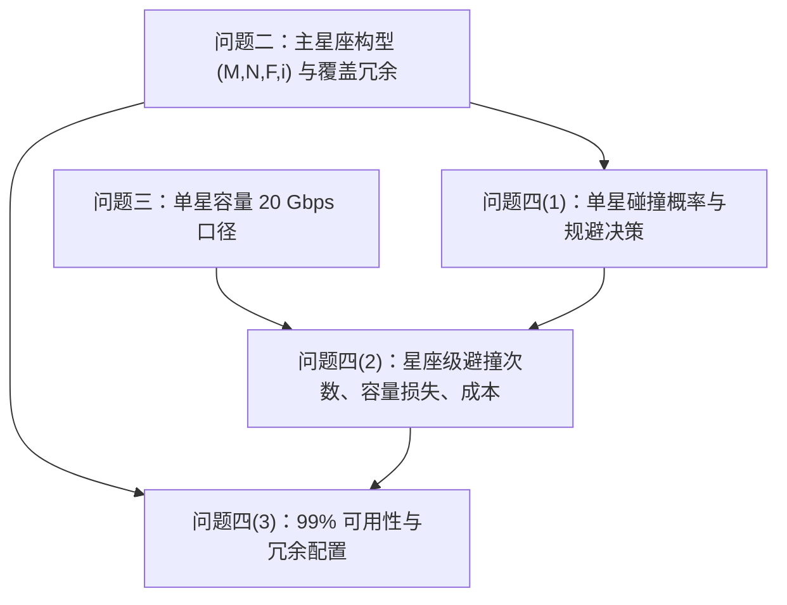

# 问题四问题分析与建模入口

> 本文件作为问题四的起点：先把题目要求转化为可建模、可计算、可验证的对象，并把每个模型组件绑定到已精读的文献。
> 当前不直接给出年度避撞次数、容量损失、冗余星数的最终数值，因为它们依赖问题二尚未固化的最终构型 $(M,N,F,i)$ 与若干碎片环境参数；本文件先建立可直接接入问题二输出的模型框架，并标出所有待定参数与待检验假设。

## 0. 本问在全题中的位置

问题四是"覆盖—网络—风险—成本"耦合链条的最后一环，检验问题二主星座在**碎片威胁下的可用性与全生命周期代价**。它同时向前依赖问题二（星座构型、覆盖冗余）与问题三（容量口径），并把前三问的"几何/网络"结论推进到"风险/经济"层面。



## 1. 题目要求拆解

问题四设定 550 km 高度处直径 $>1\,\mathrm{cm}$ 碎片数密度 $n\approx 10^{-8}\,\text{个}/\mathrm{km^3}$，碰撞概率与相对截面积、相对速度有关；每星配自主避撞系统，预测碰撞概率超阈值 $P_{th}$ 时机动，单次燃料成本 $2\,\text{万元}$、单次机动速度增量 $\Delta V\le 1\,\mathrm{m/s}$、机动期间通信能力下降 $50\%$；碰撞失效后同轨剩余卫星可轨道调整填补空缺，耗时约 $7\,\text{天}$。三小问可转化为：

| 小问 | 题面要求 | 建模转化 |
|:--|:--|:--|
| (1) | 建立单星碰撞概率模型与年度规避决策模型，综合碎片尺寸分布、相对速度分布、预警时间裕度，推导年平均碰撞概率与预期规避次数 | 通量法给"物理碰撞率 / 交会事件率"，会合平面二维高斯给"单次交会概率 $P_c$"，以 $P_c\ge P_{th}$ 为规避判据，推出年度规避次数期望 |
| (2) | 基于问题二星座估算年度避撞总次数、系统容量损失比例与经济成本 | 单星速率 $\times S$ 得总次数；机动期 $50\%$ 容量折减 → 可用容量下降比例；燃料成本 + 期望碰撞损失 → 年度额外成本 |
| (3) | 99% 时间满足基本覆盖（降级时间 $\le 1\%$）下需预留多少冗余星，比较三种冗余方案并给出最优配置与成本 | 定义"基本覆盖"与"降级时间"，建立故障—恢复可用性模型；用冷储备置信度 / 多级库存约束求最小冗余；对比面内备份、增面、地面备份 |

因此问题四是一个

$$
\text{碎片环境} \rightarrow \text{碰撞概率与规避} \rightarrow \text{容量与成本} \rightarrow \text{可用性与冗余优化}
$$

的分层"风险—成本"建模问题，**目标由问题二的 $\min MN$ 扩展为全生命周期成本与可用性约束下的冗余优化**。

## 2. 与问题二 / 问题三的继承关系

问题四以问题二输出为输入。设问题二给出

$$
(M,N,F,i,\bar\Omega,u_0),\qquad S=MN,
$$

若问题二尚未给出最终可行构型，则问题四模型先保留参数化形式，并可用候选构型（如面积下界 $S\ge 40$ 起步的单重方案、$S\ge 80$ 起步的二重方案）做敏感性分析。**特别地，问题二第 (3) 问的二重覆盖冗余是问题四第 (3) 问可用性的关键前置**：若区域在某时刻本就二重覆盖，则单星退出未必造成覆盖空洞；因此"基本覆盖保持"必须回到问题二的覆盖判定 $c(G_j,t_\ell)$ 上重新计算，而不是脱离覆盖几何空谈可靠性。

题目寿命 $5\,\text{年}$、单星制造 $500\,\text{万元}$、一箭 $60$ 星 / $2\,\text{亿元}$、避撞 $2\,\text{万元/次}$、填补耗时 $7\,\text{天}$ 均在问题四统一进入成本与可用性模型。

## 3. 必须先厘清的两类风险与两类"概率"

问题四最容易混淆之处，是把"通量法碰撞概率"与"单次交会碰撞概率 $P_c$"当成同一个量。二者含义、量级、用途都不同，必须分开（这是本问区别于旧版思路 [[数学建模/第一次/问题分析/星链系统最初分析（已废弃）/06-问题四建模思路.md|06-问题四建模思路]] 的核心）。

### 3.1 两类概率

| 概念 | 记号 | 定义与量级 | 依据文献 | 用途 |
|:--|:--|:--|:--|:--|
| 通量法累积碰撞概率 / 碰撞率 | $\dot N_c,\ P_c^{\text{flux}}$ | 由碎片数密度、相对速度、截面积给出的**物理撞击率**，单位时间期望撞击次数极小（$\sim 10^{-5}/\text{年·星}$ 量级） | 题目附录通量法；Liou 2006 碎片环境 | 估计真正的年期望碰撞/失效次数、期望经济损失 |
| 单次交会碰撞概率 | $P_c$ | 对某一次可编目碎片的接近事件，脱靶点落入碰撞圆的概率（$\sim 10^{-6}\!\sim\!10^{-3}$，取决于协方差与脱靶量） | Akella 2000、Patera 2001、白显宗 2008、Bombardelli 2015 | 与阈值 $P_{th}$ 比较，决定是否机动 |

> [!important] 建模关键
> "年度规避次数"不能直接由通量法 $\dot N_c$ 得到——通量法给的是**真正撞上的期望次数**（极小）；规避是针对**接近事件（conjunction）**触发的，其频率远高于物理碰撞率，取决于筛查半径（screening volume）与可编目碎片密度。因此规避次数要走"交会事件率 $\times\ \mathbb P(P_c\ge P_{th})$"这条链，而不是"$\dot N_c\times$ 年"。

### 3.2 两类后果

| 风险 | 触发 | 后果 | 建模方式 |
|:--|:--|:--|:--|
| 避撞机动 | 预测 $P_c\ge P_{th}$ | 卫星未失效，但机动期间容量下降 $50\%$（短时服务降级） | 容量折减 + 短时降级时间累加 |
| 碰撞失效 | 真实撞击（多来自不可编目 $1\!\sim\!10\,\mathrm{cm}$ 碎片） | 卫星退出服务，需 $7\,\text{天}$ 填补 | 失效率 → 可用性模型 → 备用星策略 |

> [!note] 可编目 vs 不可编目
> 规避只能针对**可编目**（一般 $>10\,\mathrm{cm}$）且已预报接近的目标；$1\!\sim\!10\,\mathrm{cm}$ 碎片一般不可跟踪、又难以完全屏蔽，是**主要致命失效来源**，只能进入失效率而非规避流程。题目仅给 $n(>1\,\mathrm{cm})$，需借尺寸分布把它拆成"可规避"与"只能承受"两部分。

## 4. 第 (1) 问：单星碰撞概率与年度规避决策模型

### 4.1 通量法：物理碰撞率与年平均碰撞概率

题目附录给出通量近似 $P\approx\sigma v_{rel} n t$。据此定义单星物理碰撞率

$$
\dot N_c=\sigma_c\, \bar v_{rel}\, n,
$$

其中 $\sigma_c$ 为等效碰撞截面积（$=\pi(R_{sat}+R_{deb})^2$，把碎片并入合并半径），$\bar v_{rel}$ 为平均相对速度，$n$ 为碎片数密度。年平均碰撞概率（小概率下近似等于期望次数）为

$$
P_c^{\text{annual}}\approx \dot N_c\, t_{year}
=\sigma_c\,\bar v_{rel}\, n\, t_{year},
\qquad t_{year}=3.156\times10^{7}\,\mathrm{s}.
$$

> [!note] 数量级锚点（示例参数，非最终值）
> 取 $\sigma_c\sim 10\,\mathrm{m^2}=10^{-5}\,\mathrm{km^2}$、$\bar v_{rel}\sim 10\,\mathrm{km/s}$、$n=10^{-8}\,\mathrm{km^{-3}}$，则 $\dot N_c\sim 10^{-12}\,\mathrm{s^{-1}}\Rightarrow P_c^{\text{annual}}\sim 3\times10^{-5}/\text{年·星}$。全星座 $S$ 颗、$5$ 年寿命的期望碰撞次数约 $S\times5\times3\times10^{-5}$，对数百颗规模是 $\mathcal O(10^{-2})$ 量级——单次碰撞概率虽小，但对大星座全寿命并非可忽略，需进入期望经济损失。

轨道速度作为 $\bar v_{rel}$ 的标度：$a=R_e+h=6921\,\mathrm{km}$，

$$
v_{orb}=\sqrt{\mu/a}=7.59\,\mathrm{km/s},\qquad
T_{orb}=2\pi\sqrt{a^3/\mu}\approx 95.5\,\mathrm{min}.
$$

### 4.2 碎片尺寸分布与相对速度分布

题目只给 $n(>1\,\mathrm{cm})$。为区分"可规避（可编目，$>D_{cat}$）"与"只能承受（$1\!\sim\!10\,\mathrm{cm}$）"，引入尺寸累积分布幂律

$$
n(>D)=n(>1\,\mathrm{cm})\left(\frac{D}{1\,\mathrm{cm}}\right)^{-\beta},
\qquad \beta\approx 2\!\sim\!2.5,
$$

得可编目密度 $n_{cat}=n(>D_{cat})$。相对速度不是单值，而由倾角/升交点差决定的分布 $f(v_{rel})$（LEO 平均约 $10\,\mathrm{km/s}$，正撞可达 $\sim 15\,\mathrm{km/s}$）。碰撞率应对分布积分：

$$
\dot N_c=\bar v_{rel}\int_{D_{min}}^{\infty}\sigma_c(D)\,\Big|\frac{\mathrm dn}{\mathrm dD}\Big|\,\mathrm dD,
\qquad
\bar v_{rel}=\int v\,f(v)\,\mathrm dv.
$$

### 4.3 单次交会碰撞概率 $P_c$（会合平面二维高斯）

对某次可编目碎片接近事件，采用短时交会假设（匀速直线、无速度误差、位置误差高斯），将三维碰撞概率降为会合平面内半径 $R=R_{sat}+R_{deb}$ 圆域上的二维高斯积分：

$$
P_c=\frac{1}{2\pi\sqrt{|\mathbf P^*|}}
\iint_{x^2+y^2\le R^2}
\exp\!\Big[-\tfrac12(\mathbf x-\boldsymbol\rho^*)^{\mathsf T}\mathbf P^{*-1}(\mathbf x-\boldsymbol\rho^*)\Big]\,\mathrm dx\,\mathrm dy,
$$

其中 $\boldsymbol\rho^*$ 为标称脱靶矢量在会合平面的投影，$\mathbf P^*$ 为两目标位置协方差投影到会合平面的 $2\times2$ 阵。最近接近时刻由 $t_{cpa}=-(\tilde\rho_o\cdot v_r)/(v_r\cdot v_r)$ 给出，且脱靶不确定度在相对速度方向恒为零（Akella 2000 式 9），这正是降维依据。数值上可用 Patera 2001 的**降维路径积分**或白显宗 2008 的**压缩空间 + 极坐标一重积分**高效批量计算（星链上万交会对时计算效率是关键）。

> [!warning] 协方差敏感性
> $P_c$ 对位置协方差高度敏感（Akella 2000、白显宗 2008 均强调）：白显宗 2008 指出 $P_c$ 随位置不确定度先增后减，在某 $\sigma_D$ 处取极大。星链场景通常拿不到真实协方差，需合理假定 TLE 级误差并做**协方差敏感性分析**；规避门限工程常用黄限 $10^{-5}$、红限 $10^{-4}$（白显宗 2008），可作为 $P_{th}$ 参考。

### 4.4 预警时间裕度与 $\Delta V$ 可行性

题目限定单次 $\Delta V\le 1\,\mathrm{m/s}$。是否"这一次机动就能把 $P_c$ 压到阈值以下"取决于**预警时间裕度**。由 Bombardelli 2015 的 b-平面线性关系，脱靶量与所加脉冲成线性，最大脱靶量

$$
\Delta r_{\max}=\sqrt{\lambda_1}\,\Delta V,
$$

其中 $\lambda_1$ 为 $\mathbf A=\mathbf M^{\mathsf T}\mathbf Q\mathbf M$ 的最大特征值，随机动提前量 $\Delta\theta=\theta_c-\theta_m$（即预警圈数）增大而增大。于是给定预警时间可算出"$1\,\mathrm{m/s}$ 能达到的脱靶量 / 可降到的 $P_c$"，据此判定：

- 若预警充分（提前数圈），$1\,\mathrm{m/s}$ 通常足以清除阈值；
- 若预警过短，单次机动可能不足，形成**残余风险**，需并入失效率或多次机动。

最小化碰撞概率的最优机动方向与最大化脱靶量方向一般不同（Bombardelli 2015），可作为进阶讨论，主模型先用 $\Delta r_{\max}$ 判可行性即可。

### 4.5 年度规避决策模型

规避是针对接近事件触发的。设单星年接近事件率（可编目碎片穿过筛查半径 $R_s$ 的通量）

$$
\dot N_{ca}=\sigma_s\,\bar v_{rel}\,n_{cat}\,t_{year},
\qquad \sigma_s=\pi R_s^2,
$$

其中每次事件以 $P_c$ 与阈值比较。年度期望规避次数

$$
\mathbb E[N_{av}]=\dot N_{ca}\cdot \mathbb P\big(P_c\ge P_{th}\big),
$$

即接近事件率乘"该事件 $P_c$ 超阈值的比例"。$P_{th}$ 越低则规避越频繁、燃料越多但残余碰撞风险越低，$P_{th}$ 越高则相反——这构成"机动次数—燃料—残余风险"的权衡曲线，是第 (1) 问要给出的核心关系。

> [!note] 口径提醒
> $R_s$、$n_{cat}$、$f(v_{rel})$、协方差量级均为**待定环境参数**，应在假设中显式声明，并用敏感性扫描给出 $\mathbb E[N_{av}]$ 的合理区间，而非单点值。真实星链公开数据（每星每年数次机动量级）可作为量级校核。

## 5. 第 (2) 问：星座级避撞次数、容量损失与经济成本

### 5.1 年度避撞总次数

独立假设下全星座 $S=MN$ 颗：

$$
N_{av}^{\text{tot}}=S\cdot \mathbb E[N_{av}].
$$

若不同轨道面 / 纬度带碎片通量不均，可按纬度带加权 $N_{av}^{\text{tot}}=\sum_{m,n}\mathbb E[N_{av}]_{m,n}$。

### 5.2 系统容量损失比例

每次机动持续 $\tau_m$（题目未给，设为待定，量级几分钟到几十分钟），期间容量降 $50\%$。单星年降级"等效容量·时间"损失 $=\mathbb E[N_{av}]\,\tau_m\times 0.5$。系统可用容量比例

$$
\eta_{cap}=1-\frac{0.5\,\tau_m\,N_{av}^{\text{tot}}}{S\,t_{year}}
=1-\frac{0.5\,\tau_m\,\mathbb E[N_{av}]}{t_{year}}.
$$

由于机动稀疏、$\tau_m\ll t_{year}$，$\eta_{cap}$ 通常极接近 $1$；但结合问题三"峰值为均值 $1.5$ 倍"的业务波动，应指出机动若与峰值时段叠加，局部瓶颈影响会被放大（进阶：与问题三拥塞模型联立）。

### 5.3 经济成本

年度额外成本分解（对照 Jakob 2018 的 TESSAC 制造 + 持有 + 发射 + 机动四分解，本题简化为）：

| 项目 | 计算式 | 说明 |
|:--|:--|:--|
| 规避燃料 | $C_{fuel}=N_{av}^{\text{tot}}\times 2\,\text{万元}$ | 题给单次成本 |
| 期望碰撞损失 | $C_{coll}=S\,\dot N_c\,t_{year}\times(500\,\text{万元}+\text{发射摊销})$ | 失效星重置 + 补发 |
| 容量损失机会成本 | $C_{cap}=(1-\eta_{cap})\times(\text{单位容量年收益})\times S$ | 需单位容量价值假设，或只报 $\eta_{cap}$ |
| 年度额外成本合计 | $C_{extra}=C_{fuel}+C_{coll}+C_{cap}$ | |

发射摊销按一箭 $60$ 星、$2\,\text{亿元}$ 折算 $\approx 333\,\text{万元/星}$，与 $C(S)=500S+20000\lceil S/60\rceil$（问题二成本式）口径一致。

## 6. 第 (3) 问：99% 可用性与冗余配置

### 6.1 "基本覆盖"与"降级时间"的判定

题面要求"因卫星故障或避撞导致的覆盖降级时间不超过 $1\%$"。必须先定义：

- **基本覆盖**：沿用问题二判定，区域内所有网格点满足 $c(G_j,t)\ge 1$（单重连续覆盖）；
- **降级事件**：某时刻存在 $G_j$ 使 $c(G_j,t)=0$；
- **可用性**：

$$
A=1-\frac{\text{降级时间}}{t_{year}}\ge 0.99.
$$

关键在于：**单星退出是否立刻造成 $c=0$，取决于问题二方案的覆盖冗余**。若该区域此刻本为二重覆盖，退出一颗后仍 $\ge 1$，不算降级；只有当退出发生在"仅单重覆盖的临界时空点"时才形成空洞。故第 (3) 问须把"故障事件"叠加到问题二覆盖时空图上判定，而非孤立计算。

### 6.2 故障—恢复过程与可靠性模型

单星年故障率 $\lambda$ 含"碰撞致损率 $\dot N_c t_{year}$"与"内在退化失效率"（题目寿命 $5\,\text{年}$，可设指数寿命 $p=e^{-\lambda t}$）。一次未被及时填补的故障造成的空洞时长 $\approx$ 恢复时间 $T_r$（面内填补 $7\,\text{天}$；空间备份 $1\!\sim\!2\,\text{月}$；地面备份数周至数月，见 Liu 2005、Jakob 2018 表 1）。若备份不足，年降级时间

$$
D_{year}\approx \mathbb E[\text{未覆盖故障次数}]\times T_r\times \mathbb P(\text{该故障致空洞}),
$$

要求 $D_{year}\le 0.01\,t_{year}=3.65\,\text{天/年}$。注意：**单次 $7\,\text{天}$ 面内填补即已逼近全年 $1\%$ 预算**，故必须靠冗余把"致空洞故障"压到近乎为零。

可靠性量化采用 Liu 2005 冷储备置信度（备份策略在寿命期内有足够备份的概率）：

- 地面备份：$c_g=p^{n}\sum_{k=0}^{s}\dfrac{(-n\ln p)^k}{k!}$；
- 空间（面内 / 每面）备份：$c_s=p^{n}\Big[\sum_{k=0}^{s/w}\dfrac{(-\tfrac{n}{w}\ln p)^k}{k!}\Big]^{w}$，$w$ 为轨道面数、$s$ 为空间备份总数；

或用 Jakob 2018 多级库存 $(s,Q)$ 的 fill-rate 联合约束 $\rho_{plane}^{N_{plane}}\rho_{parking}^{N_{parking}}\ge \rho_{global}$ 表达"整星座在冲击下仍满足最低可用度"。

### 6.3 三种冗余方案

| 方案 | 机制 | 恢复时间 | 优点 | 缺点 | 文献 |
|:--|:--|:--|:--|:--|:--|
| A 面内备份 | 每轨道面预留 $k$ 颗在轨备份，同面故障即刻/数天替换 | $1\!\sim\!7\,\text{天}$ | 填补快、轨位相近；对单面单星失效最鲁棒 | 每面都加，冗余总量大、持有成本高 | Liu 2005 空间备份；Jakob 2018 in-plane |
| B 增加额外轨道面 | 在 $M$ 面外加 $m$ 个冗余面，提升整体覆盖重数 | —（靠覆盖冗余，非替换） | 提升平均覆盖重数，对多星并发失效鲁棒 | 增星多、跨面机动代价大 | de Weck 2004 分层/分阶段 |
| C 地面备份 | 储备地面备份星，故障后应急发射补网 | 数周至数月 | 无在轨维护成本；一箭可补任意轨道面 | 响应慢、降级时间长，依赖快速发射能力 | Liu 2005 地面备份；Jakob 2018 供应商级 |

停泊轨道（parking）利用 $J_2$ 引起的 RAAN 漂移可让一个低轨库存点轮流服务所有轨道面（Jakob 2018），是介于 A、C 之间的第四类思路，可作为进阶方案。

### 6.4 冗余优化与成本对比

以最小全生命周期成本为目标、以可用性为约束：

$$
\begin{aligned}
\min_{k,\,m,\,s}\quad & C_{life}=C_{sat}+C_{launch}+C_{hold}+C_{av}+C_{spare}\\
\text{s.t.}\quad & A\ge 0.99,\\
& (\text{或等价})\ c_g\ /\ c_s\ \ge\ \text{置信度下限},\\
& \Delta V,\ \text{恢复时间},\ \text{发射能力约束}.
\end{aligned}
$$

三方案在相同可用性下比较额外星数、发射增量、恢复时间与总成本：

| 方案 | 额外星数 | 发射增量 | 典型恢复时间 | 主要成本项 |
|:--|:--|:--|:--|:--|
| A 面内备份 | $M\times k$ | $\lceil Mk/60\rceil$ 箭 | $\le 7\,\text{天}$ | 制造 + 在轨持有 |
| B 增面 | $m\times N$ | $\lceil mN/60\rceil$ 箭 | 覆盖冗余即时 | 制造 + 发射 |
| C 地面备份 | $s$（地面） | 按需应急发射 | 数周—数月 | 应急发射 + 待命维护 |

Liu 2005 的算例结论（相同条件下地面备份置信度优于空间备份，但须以快速发射为前提）可作为定性对照；最终推荐配置应结合本题 $7\,\text{天}$ 面内填补的有利条件，给出"面内备份为主、地面备份为辅"的混合策略并算清成本。

## 7. 文献依据进入方式

| 文献 | 对本问的作用 | 采用方式 |
|:--|:--|:--|
| [[数学建模/第一次/参考文献/星链/中文精读/05-碎片鲁棒性(问题四)/Akella_2000_Collision_Probability.md\|Akella 2000]] | 会合平面降维、二维圆域碰撞概率积分、$t_{cpa}$ 与降维依据 | 第 (1) 问 $P_c$ 主公式与筛查流程 |
| [[数学建模/第一次/参考文献/星链/中文精读/05-碎片鲁棒性(问题四)/Patera_2001_Collision_Probability_General.md\|Patera 2001]] | 降维路径积分，海量交会对高效批量算 $P_c$，非球形/姿态影响 | 第 (1)(2) 问数值实现与效率 |
| [[数学建模/第一次/参考文献/星链/MD/05-碎片鲁棒性(问题四)/Bai_2008_Collision_Probability_Method.md\|白显宗 2008]] | 压缩空间 + 极坐标一重积分、黄/红规避门限、$P_c$ 对协方差先增后减 | $P_c$ 计算与 $P_{th}$ 取值参考 |
| [[数学建模/第一次/参考文献/星链/MD/05-碎片鲁棒性(问题四)/Bombardelli_2015_Optimal_Collision_Avoidance.md\|Bombardelli 2015]] | b-平面线性 $\Delta r=\sqrt{\lambda_1}\Delta V$、最优机动、$\Delta V$—$P_c$ 关系 | 第 (1) 问 $1\,\mathrm{m/s}$ 与预警时间可行性判定 |
| [[数学建模/第一次/参考文献/星链/MD/05-碎片鲁棒性(问题四)/Liou_2006_Orbiting_Debris_Risks.md\|Liou 2006]] | LEO 碎片环境长期演化、密度非均匀、可编目 $>10\,\mathrm{cm}$ 口径 | 背景与 $n$、尺寸分布合理性说明 |
| [[数学建模/第一次/参考文献/星链/中文精读/05-碎片鲁棒性(问题四)/Jakob_2018_Optimal_Spare_Strategy.md\|Jakob 2018]] | 多级库存 $(s,Q)$、泊松故障 → 需求率、fill-rate 联合约束、TESSAC 成本分解 | 第 (3) 问备份成本与可用性约束模板 |
| [[数学建模/第一次/参考文献/星链/MD/05-碎片鲁棒性(问题四)/Liu_2005_Backup_Strategy_Confidence.md\|刘广军 2005]] | 冷储备置信度 $c_g,c_s$ 闭式、备份策略分类、地面优于空间的定性结论 | 第 (3) 问最小冗余星数与置信度主公式 |
| [[数学建模/第一次/参考文献/星链/MD/05-碎片鲁棒性(问题四)/deWeck_2004_Staged_Deployment.md\|de Weck 2004]] | 分阶段/分层弹性部署、实物期权、全生命周期成本折现 | 方案 B/进阶与成本折现框架 |

详细证据已整理到 [[数学建模/第一次/问题分析/星链系统-文献驱动版/23-问题四文献证据与建模依据.md|23-问题四文献证据与建模依据]]，逐条把模型组件绑定到论文来源。

## 8. 初步求解流程

```text
输入：问题二星座 (M,N,F,i,Ω0,u0)，碎片环境 (n, 尺寸分布 β, 速度分布 f(v_rel))，
      协方差量级，阈值 P_th，筛查半径 R_s，机动时长 τ_m，恢复时间 T_r，寿命 5 年
第(1)问：
  1. 通量法算单星物理碰撞率 Ṅ_c 与年碰撞概率 P_c^annual
  2. 尺寸分布拆分可编目/不可编目，得 n_cat
  3. 会合平面二维高斯（Patera/白显宗一重积分）算样本 P_c 分布
  4. 用 Bombardelli 线性关系判 1 m/s 在给定预警下能否清除 P_th
  5. 交会事件率 × P(P_c≥P_th) → 年度规避次数期望，画 P_th—次数—残余风险曲线
第(2)问：
  6. N_av^tot = S × E[N_av]；容量折减 η_cap；成本 C_fuel + C_coll + C_cap
第(3)问：
  7. 定义基本覆盖 c(G,t)≥1，把故障事件叠加到问题二覆盖时空图
  8. 建故障—恢复过程，用 Liu 2005 置信度 / Jakob 2018 fill-rate 约束 A≥0.99
  9. 对 A/B/C 三方案分别求最小冗余，比较额外星数、发射、恢复时间、总成本
 10. 给出最优（混合）冗余配置与全生命周期成本
输出：年碰撞概率、年度规避次数、容量损失、经济成本、最优冗余方案与成本
```

## 9. 暂定假设（Q4-Hxx）

| 编号 | 假设内容 | 状态 | 依据 | 备注 |
|:--|:--|:--|:--|:--|
| Q4-H01 | 问题四继承问题二同高度圆轨道与 Walker-Delta 参数 $(M,N,F,i,\bar\Omega,u_0)$，$S=MN$。 | 暂定 | G02；问题二建模表述 | 问题二最终构型确定后固化 |
| Q4-H02 | 短时交会假设：交会期间匀速直线、无速度误差、位置误差高斯且协方差恒定。 | 已采用 | Akella 2000；Patera 2001；白显宗 2008 | LEO 高相对速度交会成立 |
| Q4-H03 | 碎片视为质点，卫星等效为半径 $R_{sat}$ 的球，合并半径 $R=R_{sat}+R_{deb}$。 | 已采用 | Akella 2000；Bombardelli 2015 | $R_{sat}$ 由 227 kg 平板星等效，待定 |
| Q4-H04 | 通量法 $P\approx\sigma v_{rel}n t$ 用于物理碰撞率；规避次数走交会事件率 × $\mathbb P(P_c\ge P_{th})$，二者不混用。 | 已采用 | 题目附录；本文件 §3 | 本问核心口径 |
| Q4-H05 | 只有可编目（$>D_{cat}$，取 $10\,\mathrm{cm}$）且已预报的接近事件可规避；$1\!\sim\!10\,\mathrm{cm}$ 只进入失效率。 | 暂定 | Liou 2006；白显宗 2008 | 用尺寸幂律拆分 $n$ |
| Q4-H06 | 相对速度服从分布 $f(v_{rel})$，主口径取平均 $\bar v_{rel}\approx 10\,\mathrm{km/s}$。 | 待检验 | Liou 2006；轨道速度 $7.59\,\mathrm{km/s}$ | 做敏感性扫描 |
| Q4-H07 | 位置误差协方差量级按 TLE 级假定，并做敏感性分析（$P_c$ 对协方差敏感）。 | 待检验 | Akella 2000；白显宗 2008 | 无真实协方差数据 |
| Q4-H08 | 规避阈值 $P_{th}$ 取工程门限量级（黄限 $10^{-5}$、红限 $10^{-4}$）作为情景参数。 | 暂定 | 白显宗 2008 | 扫描给出权衡曲线 |
| Q4-H09 | 单次机动 $\Delta V\le 1\,\mathrm{m/s}$，脱靶量 $\Delta r_{\max}=\sqrt{\lambda_1}\,\Delta V$ 随预警时间增大。 | 已采用 | 题目条件；Bombardelli 2015 | 预警过短则残余风险入失效率 |
| Q4-H10 | 单星年故障率 $\lambda$ = 碰撞致损率 + 内在退化失效率，寿命服从指数分布 $p=e^{-\lambda t}$。 | 暂定 | Liu 2005；Jakob 2018 泊松故障 | 内在失效率需设情景值 |
| Q4-H11 | 故障相互独立（不建碎片级联/凯斯勒效应突发失效）。 | 待检验 | Jakob 2018 局限；假设台账 G08 | 若强调突发冲击需换重尾/成簇过程 |
| Q4-H12 | "基本覆盖"= 问题二判定 $c(G_j,t)\ge 1$；降级 = 存在 $c=0$；可用性 $A\ge 0.99$。 | 已采用 | 题面；问题二覆盖模型 | 单星退出是否致空洞须回覆盖时空图判定 |
| Q4-H13 | 面内填补恢复 $7\,\text{天}$，空间备份 $1\!\sim\!2\,\text{月}$，地面备份数周—数月。 | 已采用 | 题目条件；Liu 2005；Jakob 2018 表 1 | 决定各方案降级时间 |
| Q4-H14 | 机动时长 $\tau_m$、单位容量年收益、$D_{cat}$、$R_s$ 为待定情景参数，须显式声明并扫描。 | 待检验 | 题面未给 | 避免单点臆断 |

## 10. 下一步

1. 待问题二输出至少一个候选可行构型 $(M,N,F,i)$ 后，创建"问题四假设与指标推导"，固化符号、$P_c$/规避/可用性三层指标与情景参数区间。
2. 编写问题四数值实现：先做小规模 smoke test——用 Patera/白显宗一重积分复算一个已知交会算例（如白显宗 2008 的 $10^{-3}$ 量级碎片碰撞例）校核 $P_c$ 代码正确性。
3. 对 $P_{th}$、$\bar v_{rel}$、协方差量级、$R_s$ 做敏感性扫描，给出年度规避次数与容量损失的合理区间而非单值。
4. 把故障事件叠加到问题二覆盖时空图，量化"单星退出致空洞"的概率，再进入三方案冗余优化与全生命周期成本对比。
5. 已补建 [[数学建模/第一次/问题分析/星链系统-文献驱动版/23-问题四文献证据与建模依据.md|23-问题四文献证据与建模依据]]、[[数学建模/第一次/问题分析/星链系统-文献驱动版/24-问题四参数化求解模型.md|24-问题四参数化求解模型]]、[[数学建模/第一次/问题分析/星链系统-文献驱动版/25-问题四模型科学依据审查与修正.md|25-问题四模型科学依据审查与修正]] 与 [[数学建模/第一次/问题分析/星链系统-文献驱动版/26-问题四求解算法设计与复杂度审查.md|26-问题四求解算法设计与复杂度审查]]；代码实现与效率审查见 [[数学建模/第一次/问题分析/星链系统-文献驱动版/27-问题四代码实现与效率审查.md|27-问题四代码实现与效率审查]]。


