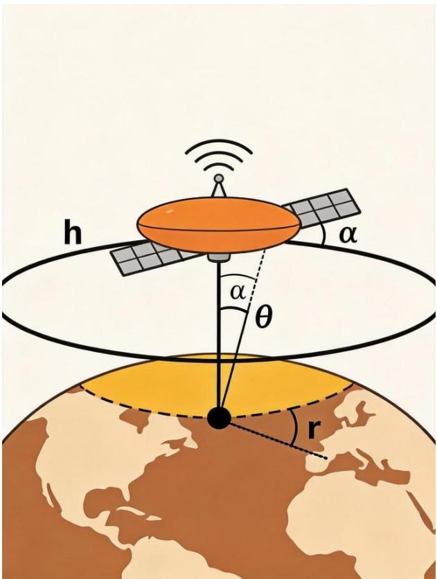
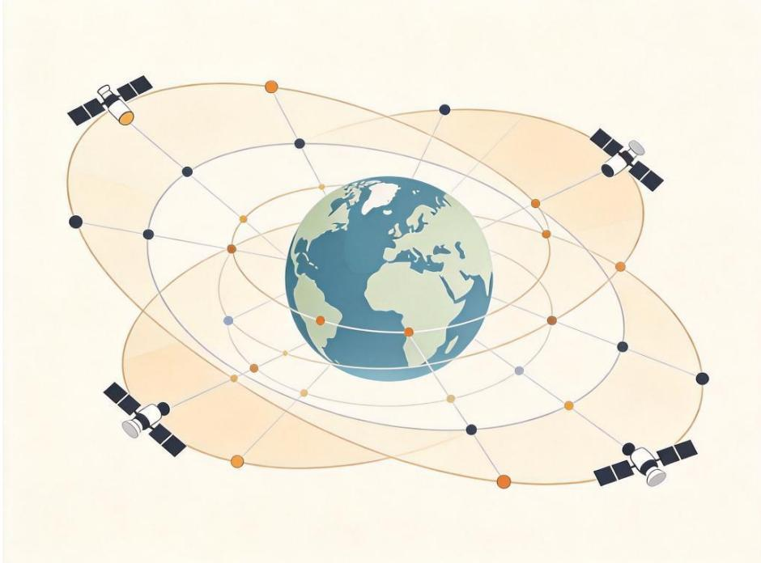
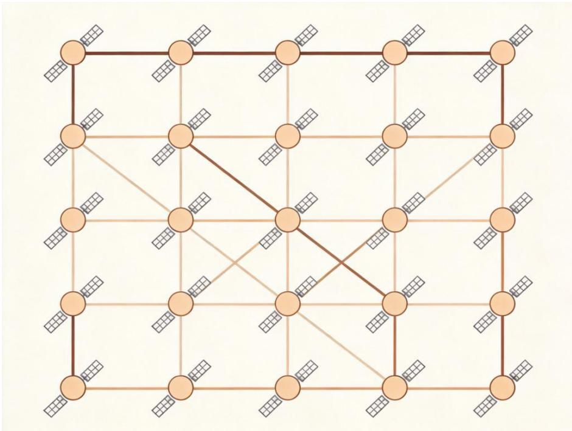
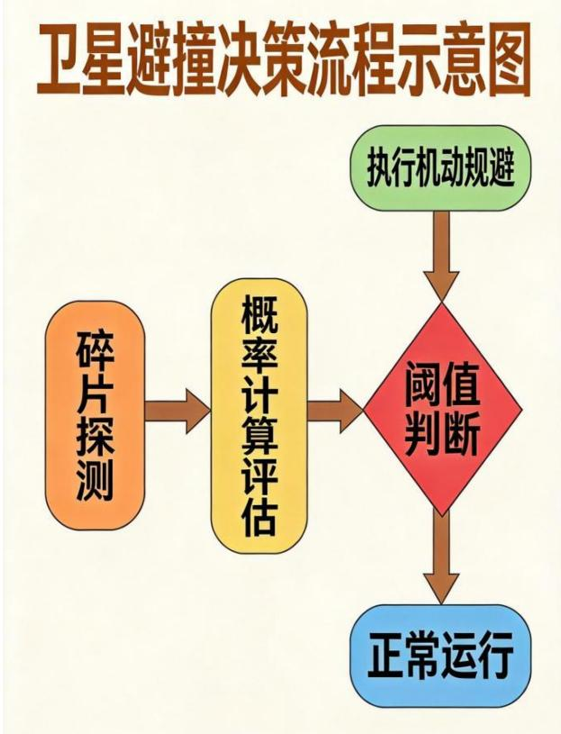

# 低轨卫星星座优化部署与鲁棒性设计

本题以低轨（LEO）卫星通信星座的工程设计为背景，围绕区域覆盖型星座的优化部署与鲁棒性设计展开，涉及轨道力学、几何覆盖分析、网络拓扑优化、通信路由算法、风险评估与冗余设计等多个学科领域的知识。题目由浅入深设置了四个层次递进的问题：从单颗卫星与单轨道面的基础覆盖特性分析，到多轨道面星座的组网优化设计，再到星间链路拓扑与通信路由的性能评估，最后延伸至空间碎片规避与星座鲁棒性设计。

赛题注重建模能力与工程思维的结合，要求参赛队伍综合运用球面几何、轨道动力学、整数规划、图论、概率统计等数学工具，建立合理的数学模型并给出可行的设计方案。题目同时考察学生对复杂系统的分析能力、多目标优化的权衡能力以及对工程实际约束的把握能力，适合作为高年级本科生或研究生的数学建模竞赛题目。

## 一、问题背景

低轨（Low Earth Orbit, LEO）卫星通信星座由数百至数千颗卫星组成，分布在多个轨道平面上，通过星间链路（Inter-Satellite Link, ISL）实现全球覆盖与宽带通信服务。与传统地球静止轨道（GEO）通信卫星相比，LEO 星座具有传输时延低（单程约2~3 ms，远低于 GEO 的约 120 ms）、路径损耗小、终端设备便携等显著优势，已成为下一代卫星互联网的核心技术方向。以 Starlink、OneWeb 等为代表的商业低轨星座系统正在快速部署，推动航天产业进入规模化发展新阶段。

然而，低轨星座的大规模部署也带来了诸多技术挑战：星座规模庞大导致系统复杂度高，卫星制造与发射成本巨大；低轨空间轨道资源有限，频谱协调难度大；空间碎片日益增多，碰撞风险持续上升；卫星数量众多导致运维管理成本高昂等。因此，在满足服务质量要求的前提下，优化星座部署方案、提升系统鲁棒性、降低全生命周期成本，是低轨星座工程设计中面临的核心问题。

某航天科技公司计划建设一个面向区域服务的低轨卫星通信星座，采用类似Starlink 的平板卫星设计方案。目标服务区域为至4°N~53°N、73°E~135°E，大致覆盖中国全部地区及周边海域。公司要求星座系统在该区域内实现连续覆盖，并满足一定的通信时延和可靠性指标。请根据以下已知条件和设计要求，完成星座系统的优化设计与鲁棒性分析。

## 二、已知条件与参数

单颗卫星的基本参数如表 1所示：

表1 单颗卫星基本参数表

<table><tr><td>参数名称</td><td>参数值与说明</td></tr><tr><td>轨道类型与高度</td><td>标称 550km 的近圆轨道</td></tr><tr><td>轨道倾角</td><td>可在 40°~60° 范围内选择</td></tr><tr><td>对地通信天线</td><td>Ku 波段,半锥角 40.46°,对应地面覆盖半径约 506 km</td></tr><tr><td>星间链路</td><td>激光通信,最大通信距离 5000km,可与同轨道面相邻卫星及相邻轨道面内最近卫星建立链路</td></tr><tr><td>卫星质量</td><td>227 kg/颗</td></tr><tr><td>单星制造成本</td><td>500万元/颗</td></tr><tr><td>发射方式</td><td>一箭60星,单次发射成本2亿元</td></tr><tr><td>设计寿命</td><td>5年</td></tr><tr><td>推进系统</td><td>氪离子推进,单次避撞机动速度增量 $\leqslant 1\text{m/s}$ ,对应燃料成本约2万元</td></tr><tr><td>单星接入容量</td><td>20 Gbps</td></tr><tr><td>星上处理时延</td><td>0.5ms/跳</td></tr></table>

星座设计需要满足以下基本要求：  
（1）区域内任意地点、任意时刻至少被 1颗卫星覆盖（单重连续覆盖）；  
（2）区域内端到端通信时延不超过 30 ms；

（3）任意单颗卫星因故障或避让碎片临时退出服务时，系统仍能维持基本覆盖能力。

## 三、需要解决的问题

## 问题一：单轨道面覆盖特性分析

单颗卫星的地面覆盖特性是星座系统设计的基础。请建立单颗卫星的地面覆盖几何模型，完成以下分析：

(1) 推导单星覆盖区在地面投影的几何形状与面积表达式。设轨道高度为 $h$，地球半径为 $R$，天线半锥角为 $\alpha$，给出覆盖区地心角、地面覆盖半径及覆盖面积的解析公式。

(2) 对于倾角为 $i$、高度为 $h$ 的圆轨道上均匀分布 $N$ 颗卫星的情况，分析星下点轨迹随时间的变化规律，以及在目标纬度带内实现连续覆盖的条件。讨论地球自转对覆盖连续性的影响。

(3) 若要求在 $30^{\circ}\mathrm{N}\sim50^{\circ}\mathrm{N}$ 纬度带内实现连续覆盖（任意时刻该纬度带内至少有一颗卫星可见），单个轨道面至少需要多少颗卫星？定量给出卫星间距与覆盖重叠率之间的关系曲线。

  
图1 单星地面覆盖几何示意图

## 问题二：多轨道面星座组网优化设计

实际星座系统由多个轨道面组成，轨道面在赤道上按一定规律分布。考虑由M个轨道面组成的完整星座，每个轨道面高度均为 550 km，轨道面在赤道上均匀分布升交点。请建立星座覆盖性能评估模型并完成优化设计：

(1) 建立星座覆盖性能评估模型，定义覆盖率、平均覆盖重数、最大覆盖间隙时间等关键性能指标，并说明各指标的计算方法。

(2) 在满足目标区域（$4^{\circ}\mathrm{N}\sim53^{\circ}\mathrm{N},~73^{\circ}\mathrm{E}\sim135^{\circ}\mathrm{E}$）100%时间单重覆盖的约束下，以总卫星数量最少为优化目标，求解最优轨道面数M、每轨道面卫星数N、轨道倾角i以及升交点经度布局。给出具体的星座参数配置方案。

(3) 若进一步要求目标区域内95%以上的时间实现二重覆盖（即任意时刻区域内任一点至少被两颗卫星同时可见），星座规模和布局需要如何调整？比较单重覆盖与二重覆盖两种场景下的星座规模差异与成本变化。

  
图2 多轨道面星座布局示意图

## 问题三：星间链路与通信路由优化

星间链路是低轨星座实现端到端通信的关键技术。每颗卫星可与同轨道面前后各1颗相邻卫星、以及左右相邻轨道面内各 1颗最近卫星建立激光链路（每颗卫星最多 4条星间链路），链路最大通信距离为 5000 km。请完成以下分析：

(1) 建立星间链路的拓扑结构模型，分析由于轨道运动导致的不同轨道面卫星之间距离随时间的周期性变化规律，给出链路通断的判定条件与时变拓扑的描述方法。

(2) 对于区域内任意两点 A 到 B 的通信请求，建立端到端时延最小的路由策略模型（考虑星上处理时延 0.5 ms/跳和光速传播时延）。基于问题二中设计的星座，计算区域内的平均端到端时延和最大端到端时延，评估是否满足 30 ms的设计要求。

(3) 在总带宽受限的情况下（每颗卫星接入容量 20 Gbps），若区域内产生均匀分布的通信业务需求（总流量随时间变化，峰值为平均值的 1.5 倍），建立流量分配与拥塞控制模型，评估系统的吞吐量与时延性能，并给出流量工程优化建议。

  
图3 星间链路网络拓扑示意图

## 问题四：碎片规避与星座鲁棒性设计

空间碎片是低轨星座安全运行面临的重要威胁。随着近地空间活动的增加，空间碎片数量持续增长，碰撞风险日益突出。假设 550 km 高度处，直径大于 1 cm 的碎片数密度约为 $10^{-8}$ 个/km³，碰撞概率与相对截面积和相对速度有关。每颗卫星配备自主避撞系统，当预测碰撞概率超过阈值 $P_{th}$ 时执行机动规避，每次规避消耗燃料成本约 2万元，且规避期间卫星通信能力下降 50%。若卫星因碰撞故障失效，同轨道面剩余卫星可通过轨道调整填补空缺，调整耗时约 7天。请完成以下分析：

(1) 建立单颗卫星的碰撞概率计算模型与年度规避决策模型，综合考虑碎片尺寸分布、相对速度分布、预警时间裕度等因素，推导年平均碰撞概率和预期规避次数的计算公式。

(2) 基于问题二中设计的星座方案，估算整个星座的年度平均避撞总次数，以及因避撞机动导致的系统容量损失（可用容量的下降比例）和对应的经济成本。

(3) 若要求 99%的时间内系统满足基本覆盖要求（即因卫星故障或避撞导致的覆盖降级时间不超过 1%），需要预留多少冗余卫星？比较三种冗余方案（每个轨道面增加备用卫星、增加额外轨道面、设置地面备用卫星）的优劣，给出最优冗余配置方案及成本分析。

  
图4 卫星避撞决策流程示意图

## 参考文献

以下文献供参赛选手参考，可帮助理解相关背景知识：

[1] Kaplan M H. Modern Spacecraft Dynamics and Control[M]. John Wiley & Sons,1976.（航天器轨道动力学经典教材，覆盖轨道力学基础）

[2] Luders R D. Satellite Networks for Continuous Zonal Coverage[J]. The Journal of the Astronautical Sciences, 1961, 7(1): 36-43.（早期星座覆盖理论的经典文献，提出Walker星座思想）

[3] Ballard A H. Rosette Constellations of Satellites[J]. The Journal of the AstronauticalSciences, 1980, 28(1): 43-54.（介绍花型星座设计方法，可用于区域覆盖优化）

[4] Handberg R, Kristensen T. The Economics of Mega-constellations: Costs and Benefits[J]. Space Policy, 2020, 52: 101374.（分析大型低轨星座的经济成本与效益）

[5] Klinkrad H. Space Debris: Models and Risk Analysis[M]. Springer Praxis Publishing, 2006.（空间碎片环境建模与碰撞风险评估权威著作）

## 附录 基础公式提示

以下基础公式仅供参考，选手可根据需要自行选用或推导其他相关公式：

1. 球面三角基本公式

（1）余弦定理：对于球面三角形 ABC，有

$$
\cos a = \cos b \cos c + \sin b \sin c \cos A
$$

$$
\cos A = -\cos B \cos C + \sin B \sin C \cos a
$$

（2）正弦定理： $\sin a / \sin A = \sin b / \sin B = \sin c / \sin C$

## 2. 轨道周期公式

圆轨道周期： $T = 2\pi \sqrt{a^{3}/\mu}$

其中，$a$ 为轨道半长轴（圆轨道时等于轨道半径）， $\mu$ 为地球引力常数，$\mu \approx 3.986 \times 10^{14}\,\mathrm{m}^{3}/\mathrm{s}^{2}$

3. 星下点轨迹

对于倾角为 $i$ 的圆轨道，星下点纬度 $\varphi$ 与升交点角距 $u$ 的关系为： $\sin\varphi = \sin i \sin u$

4. 两物体碰撞概率模型

通量法近似： $P \approx \sigma \times v_{rel} \times n \times t$

其中， $\sigma$ 为碰撞截面积， $v_{rel}$ 为相对速度，$n$ 为碎片数密度，$t$ 为时间。

5. 地球基本参数

地球平均半径： $R \approx 6371\,\mathrm{km}$

地球自转角速度： $\omega_{e} \approx 7.292 \times 10^{-5}\,\mathrm{rad}/\mathrm{s}$

光速： $c \approx 3 \times 10^{8}\,\mathrm{m}/\mathrm{s}$

地球引力常数： $\mu \approx 3.986 \times 10^{14}\,\mathrm{m}^{3}/\mathrm{s}^{2}$
