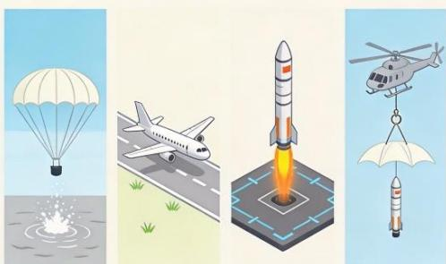
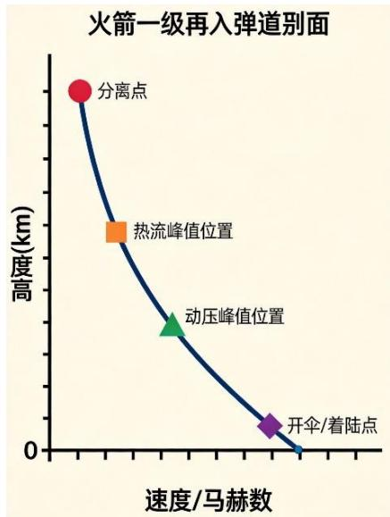
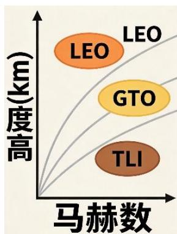
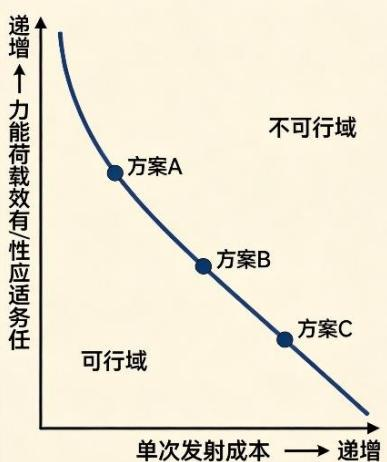

# 可重复使用运载火箭回收方式的优化设计

## 一、问题背景

随着全球商业航天产业的蓬勃发展，降低发射成本已成为提升运载火箭市场竞争力的核心驱动力。可重复使用运载火箭（Reusable Launch Vehicle, RLV）通过对助推级乃至上面级的回收与复用，能够显著分摊单次发射的硬件成本，被公认为下一代航天运输系统的重要技术方向。

目前，国内外航天机构与商业公司提出并验证了多种火箭一级助推器的回收技术路线，其中最具代表性的有以下四种：

（1）伞降回收：助推级分离后利用降落伞系统减速，最终在海上溅落或陆地着陆（如美国航天飞机固体助推器的回收方式）。该方案需要配备防热结构、浮囊与定位装置，结构增重适中，但落点精度较低，且受再入气动加热环境限制较大。

（2）带翼飞回（水平着陆）：助推级带有气动翼面与起落架，像飞机一样滑翔返回并在跑道上水平着陆（如俄罗斯「贝加尔」助推器方案）。该方案结构增重较大，但可利用升力体再入构型承受更大热流，落点精确，可重复使用潜力高。

（3）垂直动力着陆：助推级利用发动机多次点火，通过反推减速实现垂直定点着陆（如 SpaceX 公司Falcon9 火箭的一级回收）。该方案对发动机深度节流与多次启动能力要求高，并需预留大量返航及着陆推进剂，但无需额外的大型翼面或降落伞系统，落点精度极高。

  
图 1 四种典型火箭回收方式对比示意图

（4）空中捕获回收：助推级在下降过程中释放翼伞，由直升机等空中平台在低空挂钩捕获（如 Rocket Lab 公司 Electron 火箭一级的回收尝试）。该方案对箭体的质量惩罚较小，但对捕获窗口、气象条件要求极为苛刻，目前仅适用于小型运载火箭。

在工程实践中，回收方式的选择绝非单纯的技术偏好问题，而是与成本约束、火箭构型、发动机技术水平、有效载荷能力、发射任务轨道类型等诸多因素紧密耦合的系统决策问题。不同的任务剖面（近地轨道、地球同步转移轨道、月球转移轨道等）对应不同的一级分离速度与再入环境，对回收方案的可行性与经济性产生决定性影响。

假设你团队受一家新兴商业航天公司委托，为其下一代可重复使用运载火箭设计回收方案。该公司要求火箭覆盖从近地轨道（LEO）到地球同步转移轨道（GTO）乃至月球转移轨道（TLI）的多种任务，有效载荷能力范围为 1~15吨（LEO 400 km圆轨道基准）。火箭拟采用两级液体构型，推进剂组合可在液氧煤油、液氧甲烷、液氧液氢中选择。公司希望你们从数学建模的角度，系统分析回收方式的选择逻辑，并给出最优方案。

## 二、已知条件与参数

为减少数据查阅工作量并统一建模基准，以下给出简化条件与典型参数范围，参赛队可在此基础上进行合理假设与拓展。

### 2.1 环境与物理常数

大气模型：采用等温指数大气模型，密度随高度变化为 $\rho(h) = \rho_{0} \cdot \exp(-h/H)$

驻点热流估算（经典 Sutton-Graves 形式）：

$$
\dot{q}_{s} = K \cdot (\rho/\rho_{0})^{0.5} \cdot V^{3},
$$

其中 $V$ 为来流速度，$K$ 为与飞行器头部曲率半径相关的常数（可取上述典型值，亦可根据假设的钝头半径自行调整）， $\dot{q}_{s}$ 的单位为 $\mathrm{W/m}^{2}$。

动压： $q = \frac{1}{2}\rho V^{2}$

<table><tr><td>参数名称</td><td>符号</td><td>数值与单位</td></tr><tr><td>海平面重力加速度</td><td> $g_0$ </td><td>9.80665 m/s²</td></tr><tr><td>地球平均半径</td><td> $R_E$ </td><td>6371 km</td></tr><tr><td>海平面大气密度</td><td> $\rho_0$ </td><td>1.225 kg/m³</td></tr><tr><td>大气标高(等温指数模型)</td><td>H</td><td>8.5 km</td></tr><tr><td>热流常数(Sutton-Graves)</td><td>K</td><td> $1.83 \times 10^{-4}$ (SI 单位)</td></tr></table>

### 2.2 火箭发动机与构型参数（液氧煤油基线）

<table><tr><td>参数名称</td><td>符号</td><td>数值/范围</td></tr><tr><td>一级海平面比冲</td><td> $I_{sp,sl}$ </td><td>300 s</td></tr><tr><td>一级真空比冲</td><td> $I_{sp,vac}$ </td><td>348 s</td></tr><tr><td>二级真空比冲(氢氧级)</td><td> $I_{sp,up}$ </td><td>450 s</td></tr><tr><td>一级结构系数(不含发动机)</td><td> $\varepsilon_1$ </td><td>约 6%(干重/推进剂质量)</td></tr><tr><td>二级结构系数(不含发动机)</td><td> $\varepsilon_2$ </td><td>约 8%(干重/推进剂质量)</td></tr><tr><td>发动机推重比(海平面推力/自重)</td><td> $T/W_{eng}$ </td><td>约 80</td></tr><tr><td>发动机深度节流能力(基准型 / 先进型)</td><td>—</td><td>60%~100% / 30%~100%</td></tr><tr><td>发动机多次启动能力</td><td>—</td><td>2-4 次</td></tr></table>

### 2.3 各回收方式的质量惩罚

以下为回收系统附加质量占该级干重（不含预留推进剂）的百分比范围：

<table><tr><td>回收方式</td><td>主要增重部件</td><td>质量惩罚范围</td></tr><tr><td>伞降回收</td><td>防热罩、降落伞系统、浮囊、定位装置</td><td>8%-12%</td></tr><tr><td>垂直动力着陆</td><td>栅格舵、着陆腿、导航制导系统</td><td>3%-5%(不含预留推进剂)</td></tr><tr><td>带翼飞回</td><td>机翼、起落架、增稳系统、防热瓦</td><td>18%-25%</td></tr><tr><td>空中捕获</td><td>翼伞及挂钩装置、捕获平台</td><td>5%-8%(不含平台成本)</td></tr></table>

### 2.4 发射成本模型

单次发射成本可按以下粗略模型估算：

$$
C_{launch} = C_{vehicle}/N + C_{oper} + C_{refurb} + C_{prop}
$$

其中， $C_{vehicle}$ 为该枚火箭总制造成本，$N$ 为可重复使用次数， $C_{oper}$ 为一次性发射操作费， $C_{refurb}$ 为回收翻新增维护费， $C_{prop}$ 为推进剂费用。参赛队可自行假设各项成本与质量、推力、复杂度之间的合理函数关系，但必须在论文中清晰说明假设依据。

## 三、需要解决的问题

## 问题1 回收方式的多因素综合评价

请构建影响助推级回收方式选择的综合评价指标体系，指标维度至少应涵盖：发动机技术约束、回收引起的质量惩罚、落点精度、对再入热环境的适应性、单次回收成本、重复使用潜力等。以该公司基准任务——将 5吨有效载荷送入高度 400 km、倾角 30°的近地圆轨道——为应用场景，对四种回收方式进行综合评估与排序。

分析中需特别讨论以下情形：

1. 若发动机仅支持 60%~100% 节流范围，对垂直动力着陆方案的可行性与性能意味着什么？

2. 若发射场位于内陆地区，海上溅落不可行，将对伞降回收和空中捕获方式产生哪些影响？

## 问题2 给定 LEO任务下的运载能力精细比较

将两级火箭视为串联的变质量系统，建立起飞质量与有效载荷之间的传递模型，推导由于一级回收造成的「运载能力损失」的解析表达式。

针对上述LEO 基准任务，假设一级采用液氧甲烷发动机（地面比冲 330 s，真空比冲 380 s，可节流至40%），二级仍为液氢液氧级。请分别就伞降回收（海上溅落）与垂直动力着陆回收两种方案完成以下分析：

1. 确定一级为实现回收而必须预留的最小推进剂量（含再入减速、大气层内速度调整和着陆燃烧等阶段），并据此反推在满足5吨有效载荷条件下的火箭起飞质量；

2. 分析垂直着陆方案中，发动机节流深度从 40% 进一步降低到 20% 对预留推进剂量的影响，并讨论其对总起飞质量以及悬停能力、着陆精度的可能改善；

3. 若伞降方案的海上溅落导致箭体结构受损，使可重复使用次数由垂直着陆方案的 10次降为 5 次，结合题目给出的成本模型，比较两种方案的全寿命周期单次发射成本。

  
图 2 火箭一级再入弹道剖面示意图

## 问题3 任务航程（分离速度）对回收方式的限制

不同轨道任务对应不同的一级分离速度与高度条件：例如 LEO 任务的一级分离马赫数约为 6~8，分离高度约 60~80 km；GTO 任务的分离马赫数可达 10~12，分离高度约 80~100 km；TLI 任务则更高。更高的分离速度意味着更严酷的再入气动加热与更严峻的减速挑战。

请建立一级再入弹道的简化分析模型，以「最大允许驻点热流 $\dot{q}_{s,max}$」与「最大允许动压 $q_{max}$」为约束条件，推导三种回收方式（伞降、带翼飞回、垂直动力着陆）可以承受的最大分离马赫数及对应高度范围。建模时可参考以下假设：

1. 伞降方案受热流和动压限制最为严格，无主动减速能力；

2. 垂直动力着陆可通过再入前的高空反推点火降低再入速度，但需消耗额外推进剂；

  
图3 不同任务轨道的分离条件与热流约束示意图

3. 带翼飞回可利用升力体滑翔构型拉长减速路径，显著提高热流承受上限，但结构质量代价较大。

请在「分离马赫数—有效载荷质量」二维平面上，画出三种回收方式的理论可行域边界（即能够将指定有效载荷送入目标轨道且成功实现回收的参数范围）。分析哪种回收方式能够支撑该公司开拓 GTO 和TLI 发射市场，并给出相应的前提技术条件。

## 问题 4 面向商业航天的多任务、多目标回收方案设计

该公司希望研制一款能够覆盖 1~15 吨 LEO 有效载荷、并兼顾 GTO 任务的通用型火箭，允许对一级助推器采用一种回收方式，对整流罩等部件采用另一种回收方式（混合回收策略），甚至可以为不同任务档位选择不同的回收参数配置。

请建立以「最小化全寿命周期单次发射成本」与「最大化任务适应性」（可用「可到达轨道范围」或「最大有效载荷能力」度量）为目标的多目标优化模型。决策变量至少应包括：

1. 一级回收方式选择（可针对不同任务档位设置不同方案）；

2. 推进剂组合方案（液氧煤油/液氧甲烷/液氧液氢及其组合）；

3. 发动机类型与节流能力指标；

4. 火箭基本尺度参数（级直径、推进剂加注量、推重比等）。求解该多目标优化问题，并给出以下结果：

1. 非支配解集（Pareto 前沿），并从中推荐 2~3 个具有竞争力的火箭构型与回收方案组合，分别说明其适用场景；

2. 以表格形式给出「有效载荷—目标轨道—推荐回收方式」的决策参考表；

3. 若未来发动机深度节流技术取得突破（可稳定节流至15%~20%），并结合人工智能在线轨迹规划技术，预测现有回收方式中哪些的劣势将被大幅削弱，是否可能出现全新的

图 4 多目标优化 Pareto 前沿概念示意图

「混合模式」回收（如高空伞降+末端动力着陆），并对其成本与性能优势进行建模分析。

## 参考文献

[1] Sutton G P, Bibarz O. Rocket Propulsion Elements[M]. 8th ed. New York: John Wiley & Sons, 2010.

[2] Bate R R, Mueller D D, White J E. Fundamentals of Astrodynamics[M]. New York: Dover Publications, 1971.

[3] Anderson J D. Hypersonic and High Temperature Gas Dynamics[M]. 2nd ed. Reston: AIAA Education Series, 2006.

[4] Deb K, Pratap A, Agarwal S, et al. A fast and elitist multiobjective genetic algorithm: NSGA-II[J]. IEEE Transactions on Evolutionary Computation, 2002, 6(2): 182-197.

[5] Sutton K, Graves R. A review of approximate methods for calculating stagnation point convective heating in hypersonic flow[R]. AIAA Paper 1970-0615, 1970.

[6] 徐敏, 宋笔锋. 可重复使用运载器总体设计与优化[M]. 北京: 国防工业出版社, 2018.

## 附录 基础公式参考

以下列出部分基础物理公式，供建模时参考。参赛队可根据自身模型需要选用或拓展。

### A1 齐奥尔科夫斯基火箭方程

理想火箭方程描述了单级火箭在无外力场中的速度增量与质量比的关系：

$$
\Delta\mathrm{v} = I_{sp} \cdot g_{0} \cdot \ln(m_{initial}/m_{final})
$$

其中 $m_{initial}$（含推进剂）， $m_{final}$ 为燃烧结束后的质量， $I_{sp}$ 为比冲。

### A2 圆轨道速度公式

半径为 $r$ 的圆轨道速度为：

$$
v_{circ} = \sqrt{(\mu/r)}
$$

其中 $\mu = g_{0} \cdot R_{E}^{2}$ 为地球引力常数（标准值 $\mu \approx 3.986 \times 10^{14}\,\mathrm{m}^{3}/\mathrm{s}^{2}$），$r = R_{E} + h$ 为轨道半径，$h$ 为轨道高度。

### A3 气动加热基本关系

驻点对流热流的 Sutton-Graves 近似公式：

$$
\dot{q}_{s} = K \cdot \sqrt{(\rho/R_{n})} \cdot V^{3}
$$

其中 $R_{n}$ 为头部曲率半径，$K$ 为与气体性质相关的常数（层流条件下，空气 $K \approx 1.83 \times 10^{-4}$，使用SI 单位）。

### A4 再入弹道方程（简化形式）

平面再入运动方程组（忽略科氏力与地球自转）：

$$
\begin{array}{r} dV/dt = -D/m - g \cdot \sin\gamma \\ d\gamma/dt = (L/(mV) - g/V) \cdot \cos\gamma + V \cdot \cos\gamma/r \\ dh/dt = V \cdot \sin\gamma \\ dr/dt = V \cdot \sin\gamma \end{array}
$$

其中 $V$ 为速度，$\gamma$ 为飞行路径角，$D$ 为阻力，$L$ 为升力，$m$ 为质量，$h$ 为高度，$r$ 为地心距。

### A5 多目标优化与 Pareto 最优

对于多目标最小化问题，称解 $\mathbf{x}_{1}$ 支配解 $\mathbf{x}_{2}$（$\mathbf{x}_{1} < \mathbf{x}_{2}$），当且仅当：

$$
\forall i \in 1, 2, \dots, k, f_{i}(x_{1}) \leq f_{i}(x_{2}), \text{且} \exists j \in 1, 2, \dots, k, f_{j}(x_{1}) < f_{j}(x_{2})
$$

不被任何其他解支配的解称为 Pareto 最优解（非支配解），全体 Pareto 最优解构成 Pareto 前沿。

### A6 常用轨道参数参考

<table><tr><td>轨道类型</td><td>典型高度/近地点</td><td>轨道速度</td><td>特征速度需求*</td></tr><tr><td>LEO (400 km)</td><td>400 km 圆</td><td>≈7.67 km/s</td><td>≈9.2~9.5 km/s</td></tr><tr><td>GTO</td><td>200 km / 35786 km</td><td>≈10.2 / 1.6 km/s</td><td>≈10.5~11.0 km/s</td></tr><tr><td>TLI (月球转移)</td><td>200 km 近地点</td><td>≈10.9 km/s</td><td>≈11.5~12.0 km/s</td></tr></table>

\* 特征速度（Δv）含重力损失、气动阻力损失及导航余量等，为粗略参考值。
